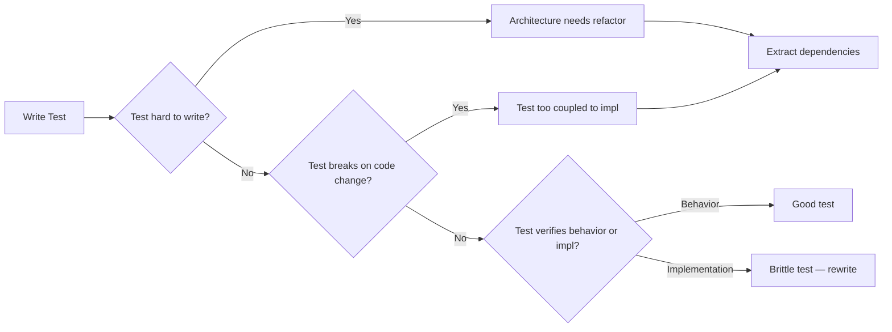
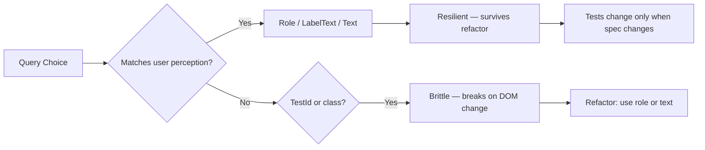
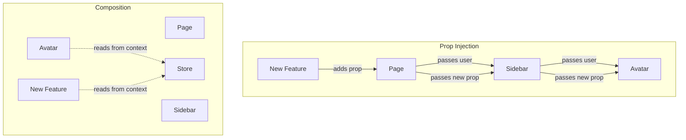
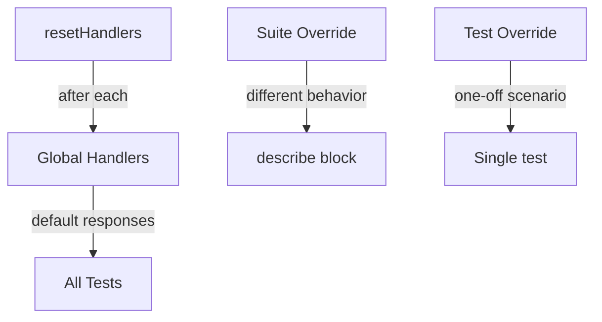
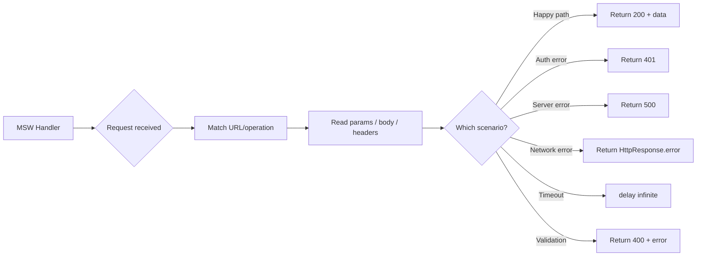
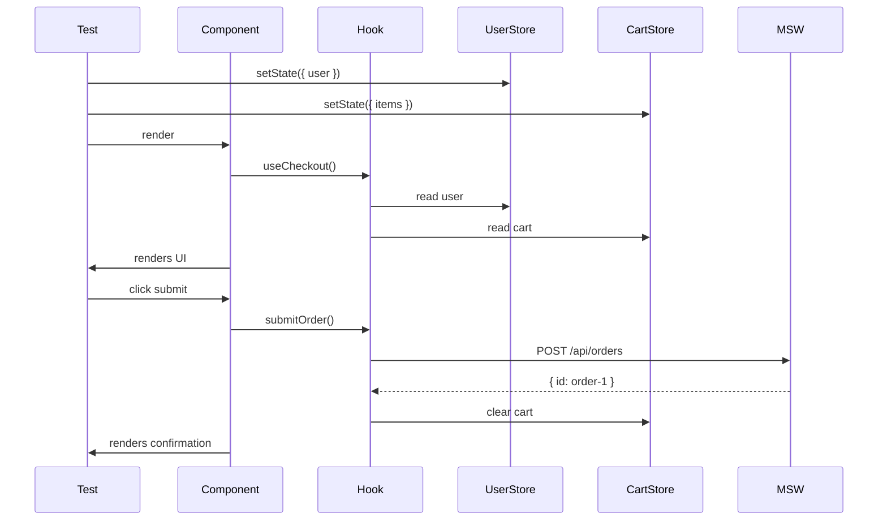
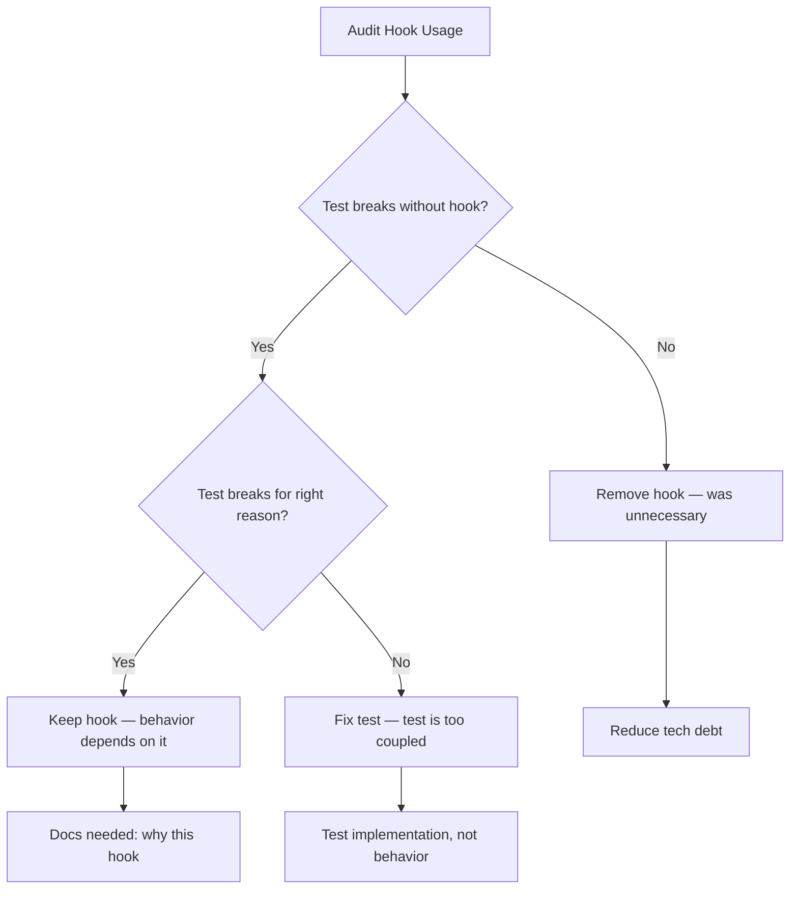
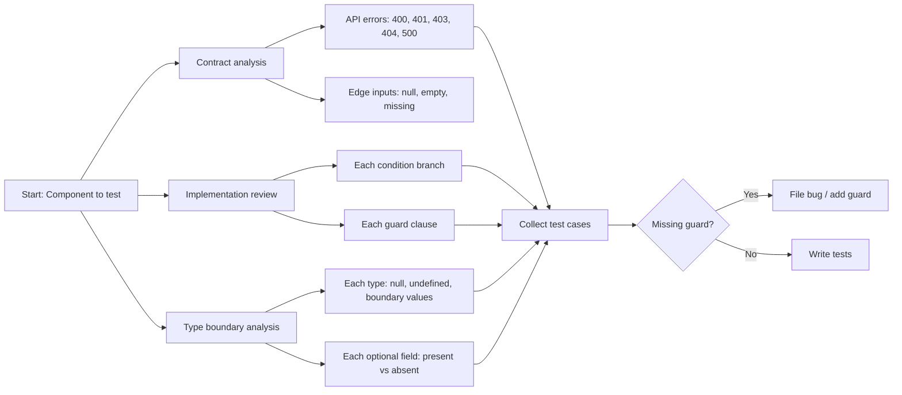
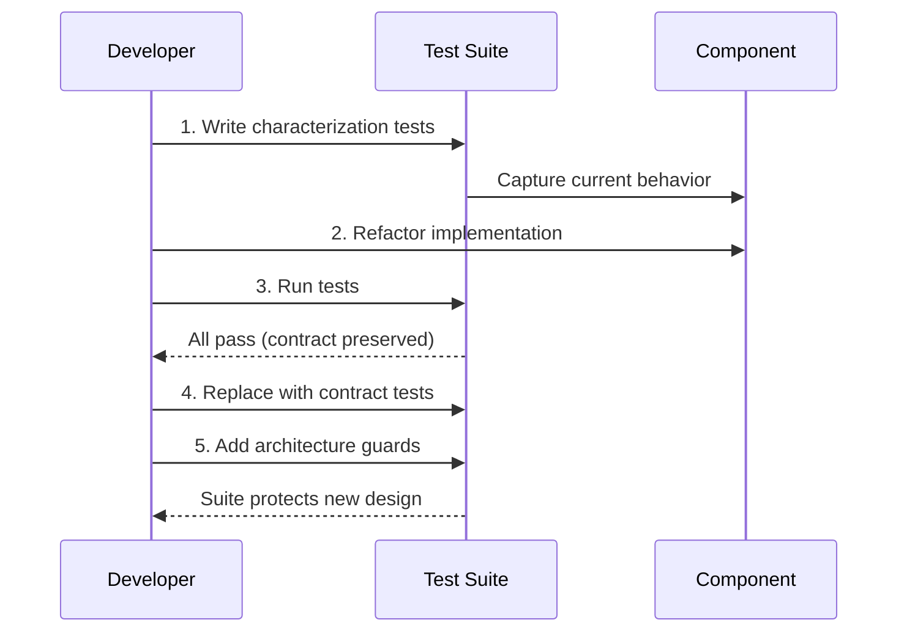

# Module 1: Testing ROI & Boundaries

Est. study time: 2h
Language: en
Description: Foundation module — learn to evaluate test value, choose test levels strategically, and recognize when tests become liabilities that block refactoring.

## Learning Objectives (maps to course CILOs)
- Evaluate test ROI across unit/integration/e2e levels using real maintenance cost math
- Identify test types that block vs enable refactoring
- Apply boundary decisions: what to test at each level, what to skip
- Recognize "test coverage trap" — high coverage that prevents evolution

---

## Core Content

### 1.1 The Test Cost Curve

Every test has 3 costs:
- **Write cost**: time to author
- **Maintain cost**: time to update when code changes
- **CI cost**: compute time × frequency

Most teams track only write cost. The hidden killer: maintain cost grows with test fragility.

Compare levels:

| Level | Write | Maintain | CI run | Refactor block |
|-------|-------|----------|--------|----------------|
| Unit | Low | Low | Fast | Low (if well-designed) |
| Integration | Medium | Medium | Medium | Medium |
| E2E | High | High | Slow | High |

**Think**: Your CI test suite takes 45 minutes. The CTO wants it under 10 minutes. What do you remove?

*Answer: Start with slow E2E tests that test simple things already covered at lower levels. Keep E2E only for critical user flows that cannot be validated otherwise. Each test you keep must justify its cost.*

### 1.2 Tests as Architecture Feedback

Here is the key insight: **If a test is hard to write, the architecture is wrong.**

Hard-to-test code reveals:
- Tight coupling (hard to isolate)
- Hidden dependencies (hard to set up)
- Side effects in unexpected places (hard to assert)
- Mixed concerns (hard to describe intent)

Pattern: Struggling to test a component? The test is telling you the component needs refactoring. Do not fight the test — listen to it.

```text
// Hard to test — implicit dependency on API + router
function Dashboard() {
  const [data, setData] = useState(null)
  useEffect(() => {
    fetch('/api/dashboard').then(setData)
  }, [])
  const navigate = useNavigate()
  return <div>...</div>
}

// Easier to test — dependency injected via hook
function Dashboard() {
  const { data } = useDashboardData()
  return <div>...</div>
}
// Now test useDashboardData in isolation, Dashboard as pure UI
```

> **Think**: Your component renders a list from `fetch()` inside `useEffect`. To test, you mock `fetch`, wait for async, then assert. This works but feels fragile. What does the test tell you about the component's architecture?
>
> *Answer: Data fetching is mixed with rendering. If you change the API client (e.g., switch to React Query), every test breaks. Extract data layer into a hook or service — tests only change when rendering behavior changes, not when data fetching strategy changes.*

### 1.3 Test Level Boundaries: What Goes Where

Rule of thumb:
- **Unit (60%)**: Pure logic, hooks (with extracted data layer), utilities, store reducers. Fast feedback.
- **Integration (30%)**: Component + dependencies together (renders with real context providers, MSW for API). Core user flows.
- **E2E (10%)**: Critical paths only — login, checkout, data loss prevention. Use sparingly.

Why 60/30/10? The test pyramid is not about numbers. It is about **feedback speed vs confidence tradeoff**. Unit gives fastest feedback per test. E2E gives highest confidence per test but slowest feedback.

**Think**: Your payment flow has 12 steps. You have:
- 1 E2E test covering all steps (2 min)
- 12 integration tests, each covering one step (2s each)
- 24 unit tests for edge cases (0.1s each)
Your CI is 12 min. The payment integration test fails once per week — flaky network. Do you debug the flake or delete the E2E test?

*Answer: Delete the E2E test. The integration tests cover each step with better isolation. The E2E adds zero new coverage but adds 2 min of CI time + flakiness. Only keep E2E for flows where integration tests cannot simulate real conditions (e.g., payment gateway redirect).*

### 1.4 The Coverage Trap

80% coverage does not mean 80% bug-free. Coverage measures what code *executed*, not what code *verified correctly*.

```typescript
function calculateDiscount(price: number, isMember: boolean): number {
  if (isMember) return price * 0.9
  return price
}
```

Test that achieves 100% coverage but verifies nothing useful:
```text
test('returns price for non-member', () => {
  expect(calculateDiscount(100, false)).toBe(100)
})
test('returns discounted price for member', () => {
  expect(calculateDiscount(100, true)).toBe(90)
})
```

These tests *execute* both branches. They *verify* what the code does. But they do not verify *specification*:
- What if price is 0?
- What if price is negative?
- What if isMember is undefined?
- What if discount rate changes? (hardcoded 0.9 — should this be configurable?)

**Think**: Team A has 95% coverage and ships a bug: negative price passes through without error. Team B has 60% coverage but tests every boundary condition. Which team has better testing?

*Answer: Team B. Coverage percentage is a vanity metric. What matters is whether tests verify behavior at boundaries and invariants. Team A's high coverage came from trivial "execute and assert no crash" tests.*



### 1.5 Characteristics of Advanced vs Junior Testing

| Junior test | Advanced test |
|---|---|
| Tests implementation details | Tests behavior/contracts |
| Mocks everything | Uses real dependencies when practical |
| High coverage, low assertion rigor | Focused coverage, high assertion rigor |
| Breaks on any refactor | Survives refactor (tests change when spec changes) |
| 100 tests, long CI | 50 tests, fast CI, better confidence |

---

## Why This Matters

Most teams discover the test cost problem in production: 500 tests, 20-minute CI, every PR breaks unrelated tests. The team starts deleting tests or mocking aggressively. This is the symptom of not understanding test ROI.

The advanced tester thinks: "What is the minimum set of tests that gives me maximum confidence to refactor?" This module's concepts are your filter for every test you write from now on.

---

## Common Questions

**Q: If tests are hard to write, should I mock more?**
A: No — this is the most common mistake. Mocking hides coupling instead of fixing it. If a test is hard to set up, the code is probably too coupled. Mock only external boundaries (API, filesystem, third-party SDK). Do not mock your own modules to make testing easier.

**Q: What about 100% coverage mandates from management?**
A: Push back with data. Show that 100% coverage costs more in maintenance than it saves in bug prevention. Propose a targeted approach: critical paths at 90%+, utilities at 70%+, UI components at 50%+ (tested through integration). Cover the math: if maintain cost per test is 5 min per month × N tests, vs bug cost per incident × expected incidents.

**Q: When is an E2E test worth its cost?**
A: When the flow cannot be reliably tested at lower levels. Examples: third-party payment redirect, OAuth login flow, cross-tab synchronization. For everything else, integration tests are better.

---

## Examples

### Example 1: Converting a brittle test suite

**Problem**: Team has 200 tests for a search component. Every UI change breaks 30 tests. CI takes 15 min.

**Root cause**: Tests use `getByTestId` everywhere, test internal state transitions, mock the API client, and assert on implementation details (class names, internal state values).

**Solution**: Delete all 200 tests. Write 20 integration tests using MSW for API, `getByRole` for queries, test only visible behavior (search input → results list → empty state → error state). CI drops to 2 min. Refactors no longer cause test failures.

### Example 2: Using test feedback to refactor

**Problem**: `UserProfile` component fetches data, handles loading/error/empty states, and renders a complex layout. Writing tests requires 30 lines of setup.

**Test feedback**: The component has 3 responsibilities (data fetching, state management, rendering). Each should be separate.

**After refactor**: `useUserProfile` hook (test data logic), `UserProfileUI` component (test rendering, no data deps), `UserProfile` composite (integration test with MSW). Each test is 5-10 lines.

---

## Key Takeaways

- Every test has 3 costs: write, maintain, CI run. Ignoring maintain cost creates brittle suites
- Hard-to-test code is architecture feedback, not a mocking problem
- Test behavior, not implementation — behavior tests survive refactors
- Delete tests that no longer provide value. Dead test weight slows the team
- Coverage percentage is vanity. Boundary verification is value
- 60/30/10 unit/integration/e2e ratio is about feedback speed, not dogma
- Mock only external boundaries. Do not mock your own modules
- E2E tests are high-cost insurance — use sparingly

---

## Common Misconception

"More tests = better quality." False. Bad tests actively reduce quality by:
- Slowing down CI (fewer deploys)
- Desensitizing the team to test failures (cry wolf)
- Blocking refactors (tests break and nobody understands why)
- Encouraging mocking to "fix" testability (hides real coupling)

Better: fewer, smarter, refactor-safe tests.

---

## Feynman Explain

Explain "test ROI" to a junior developer. Use no jargon. Give a concrete example: "Imagine you write a test for every line of code. One day you need to change how data loads. Now every test breaks. You spend 2 hours fixing tests. Was that worth it? What if you had only tested the visible behavior — the data would still appear the same way, so those tests would pass without changes."


---

## Reframe

(Pause. Judge the "coverage trap" argument: is coverage truly meaningless? When would high coverage help despite being shallow? What about regulated industries where coverage mandates exist? Write your evaluation.)

---

## Drill

Take the quiz. MCQs test different angles — recall, application, scenario.

Run: `learn.sh quiz advanced-react-testing 1`

## Quiz: 01-testing-roi-and-boundaries

<p class="quiz-question">What are the three costs of every test?</p>

<p class="quiz-difficulty">★☆☆</p>

<p class="quiz-option"><strong>A.</strong> Setup, execution, teardown</p>

<p class="quiz-option"><strong>B.</strong> Write, maintain, CI run</p>

<p class="quiz-option"><strong>C.</strong> Author, review, merge</p>

<p class="quiz-option"><strong>D.</strong> Unit, integration, e2e</p>

<p class="quiz-answer"><strong>Answer:</strong> B</p>

<p class="quiz-explanation">Write cost (time to author), maintain cost (time to update when code changes), CI run cost (compute time × frequency). Maintain cost is the hidden killer that grows with test fragility.</p>

<hr/>

<p class="quiz-question">A component test requires 30 lines of setup — mocking 3 modules, wrapping in 2 providers, waiting for async. What should this signal?</p>

<p class="quiz-difficulty">★★☆</p>

<p class="quiz-option"><strong>A.</strong> Need a better mocking library</p>

<p class="quiz-option"><strong>B.</strong> Component has too many responsibilities — extract concerns</p>

<p class="quiz-option"><strong>C.</strong> Write more setup helpers</p>

<p class="quiz-option"><strong>D.</strong> Skip testing this component</p>

<p class="quiz-answer"><strong>Answer:</strong> B</p>

<p class="quiz-explanation">Hard-to-test code is architecture feedback. 30 lines of setup means the component is tightly coupled. Extract data fetching, state management, and rendering into separate units — each becomes testable with 5-10 lines.</p>

<hr/>

<p class="quiz-question">A payment flow E2E test (2 min) fails once per week due to network flakiness. Integration tests already cover each step (2s each, 12 steps). What should you do?</p>

<p class="quiz-difficulty">★★★</p>

<p class="quiz-option"><strong>A.</strong> Debug the flake — E2E is irreplaceable</p>

<p class="quiz-option"><strong>B.</strong> Delete the E2E test — integration tests cover the same path with better isolation</p>

<p class="quiz-option"><strong>C.</strong> Add retry logic to the E2E test</p>

<p class="quiz-option"><strong>D.</strong> Move E2E test to a separate nightly pipeline</p>

<p class="quiz-answer"><strong>Answer:</strong> B</p>

<p class="quiz-explanation">The E2E adds zero new coverage but adds 2 min CI time + flakiness. Only keep E2E for flows integration tests cannot simulate (e.g., third-party redirect). Each test must justify its cost.</p>

<hr/>

<p class="quiz-question">Which test set provides more value for the function `divide(a, b)`?</p>

<p class="quiz-difficulty">★★☆</p>

<p class="quiz-option"><strong>A.</strong> Test that calls divide(10, 2) and asserts 5 (100% line coverage)</p>

<p class="quiz-option"><strong>B.</strong> Tests for divide(10, 2), divide(0, 5), divide(10, 0), divide(-10, 2), divide(10.5, 2)</p>

<p class="quiz-option"><strong>C.</strong> Both provide equal value</p>

<p class="quiz-option"><strong>D.</strong> Neither — testing math functions is waste</p>

<p class="quiz-answer"><strong>Answer:</strong> B</p>

<p class="quiz-explanation">Coverage percentage is vanity. What matters is boundary verification: zero, negative, division by zero, floats. The single test (A) executes the line but verifies nothing about edge cases.</p>

<hr/>

<p class="quiz-question">What distinguishes an advanced test from a junior test?</p>

<p class="quiz-difficulty">★☆☆</p>

<p class="quiz-option"><strong>A.</strong> Advanced tests use more sophisticated mocking frameworks</p>

<p class="quiz-option"><strong>B.</strong> Advanced tests test behavior/contracts and survive refactors</p>

<p class="quiz-option"><strong>C.</strong> Advanced tests have higher coverage percentages</p>

<p class="quiz-option"><strong>D.</strong> Advanced tests are slower but more thorough</p>

<p class="quiz-answer"><strong>Answer:</strong> B</p>

<p class="quiz-explanation">Advanced tests verify behavior (what the code does), not implementation (how it does it). They survive refactors because the spec does not change when the implementation changes.</p>

<hr/>

<p class="quiz-question">Your team has 95% line coverage but ships a bug where negative price passes through `calculateDiscount` without error. What is the root cause?</p>

<p class="quiz-difficulty">★★☆</p>

<p class="quiz-option"><strong>A.</strong> Coverage tool is broken</p>

<p class="quiz-option"><strong>B.</strong> Tests execute code but did not verify boundary conditions</p>

<p class="quiz-option"><strong>C.</strong> Need more tests to reach 100%</p>

<p class="quiz-option"><strong>D.</strong> Bug is in production, not testable</p>

<p class="quiz-answer"><strong>Answer:</strong> B</p>

<p class="quiz-explanation">Coverage measures what code executed, not what was verified. The tests hit the price branch but never asserted behavior for edge cases like negative, zero, or non-numeric inputs.</p>

<hr/>

<p class="quiz-question">When should you mock a dependency in tests?</p>

<p class="quiz-difficulty">★★☆</p>

<p class="quiz-option"><strong>A.</strong> Whenever the dependency makes tests slow or unpredictable</p>

<p class="quiz-option"><strong>B.</strong> Only at external boundaries — API, filesystem, third-party SDK</p>

<p class="quiz-option"><strong>C.</strong> Never — always use real dependencies</p>

<p class="quiz-option"><strong>D.</strong> Whenever a test is hard to set up</p>

<p class="quiz-answer"><strong>Answer:</strong> B</p>

<p class="quiz-explanation">Mock only external boundaries. Mocking internal modules hides coupling instead of fixing it. If setup is hard, the architecture needs refactoring, not more mocking.</p>

<hr/>

<p class="quiz-question">A refactor changes how data is fetched (switching from fetch to React Query). The component's visual output is identical. How many tests should break?</p>

<p class="quiz-difficulty">★★★</p>

<p class="quiz-option"><strong>A.</strong> All tests that mock the data layer</p>

<p class="quiz-option"><strong>B.</strong> Only tests that verify data fetching behavior — rendering tests should pass unchanged</p>

<p class="quiz-option"><strong>C.</strong> All tests must be rewritten</p>

<p class="quiz-option"><strong>D.</strong> None — if tests mock at the right boundary</p>

<p class="quiz-answer"><strong>Answer:</strong> D</p>

<p class="quiz-explanation">If tests mock at the API boundary (MSW handlers) instead of the implementation (fetch vs React Query), they pass unchanged. The component still renders the same data. The mock boundary should match the external interface, not the internal implementation.</p>

<hr/>

<p class="quiz-question">What is the recommended test distribution for most React applications?</p>

<p class="quiz-difficulty">★☆☆</p>

<p class="quiz-option"><strong>A.</strong> 70% E2E, 20% integration, 10% unit</p>

<p class="quiz-option"><strong>B.</strong> 60% unit, 30% integration, 10% E2E</p>

<p class="quiz-option"><strong>C.</strong> 33% each level — balance is key</p>

<p class="quiz-option"><strong>D.</strong> 100% E2E — test what users actually see</p>

<p class="quiz-answer"><strong>Answer:</strong> B</p>

<p class="quiz-explanation">The test pyramid prioritizes fast feedback: 60% unit for pure logic, 30% integration for component flows, 10% E2E for critical paths only. This is about feedback speed vs confidence, not an exact rule.</p>

<hr/>

<p class="quiz-question">A junior developer asks: 'Should I add a test every time I fix a bug?' What is the advanced answer?</p>

<p class="quiz-difficulty">★★★</p>

<p class="quiz-option"><strong>A.</strong> Yes — every bug deserves a regression test</p>

<p class="quiz-option"><strong>B.</strong> Yes, but only if the test catches the root cause at the right level — not a superficial 'reproduce the bug' test</p>

<p class="quiz-option"><strong>C.</strong> No — bug-fix tests are waste</p>

<p class="quiz-option"><strong>D.</strong> Write the test in the E2E suite to catch UI regressions</p>

<p class="quiz-answer"><strong>Answer:</strong> B</p>

<p class="quiz-explanation">A superficial bug-fix test asserts the exact scenario that broke. A good regression test verifies the invariant that was violated — and lives at the level closest to the root cause. If the bug was a calculation error, unit test. If it was a missing state, integration test.</p>


---

# Module 2: Query Strategy & Test Maintainability

Est. study time: 2h
Language: en
Description: Query selection is the single highest-leverage skill for writing refactor-safe tests. Learn why getByRole is the default choice, when to drop down to getByText or getByTestId, and how query strategy determines whether tests survive DOM changes.

## Learning Objectives (maps to course CILOs)
- Apply query priority to maximize refactor-resistance of tests
- Distinguish between accessibility queries and implementation queries
- Recognize when a query choice signals poor component accessibility
- Refactor existing tests from brittle queries to resilient ones

---

## Core Content

### 2.1 Why Query Priority Matters

Testing Library's query priority exists for one reason: **refactor resistance**.

A query that looks up by role, label, or text matches what the *user* sees. When you change the underlying DOM structure (div → section, class rename, wrapping element), the query still finds the element.

A query that looks up by testId or class name matches the *implementation*. Any DOM change breaks it.

```text
// Brittle — coupled to DOM structure
screen.getByTestId('user-name')
screen.getByClassName('user-name')

// Resilient — matched by what user sees
screen.getByRole('heading', { name: /user name/i })
screen.getByLabelText('User Name')
screen.getByText('John Doe')
```

**Think**: Your team adds a decorative wrapper `<div class="card-wrapper">` around `<h2>User Name</h2>`. Which queries break?

*Answer: `getByTestId('user-name')` breaks if testId was on the div. `getByClassName` breaks if class changes. `getByRole('heading', { name: /user name/i })` passes — the heading is still a heading with the same accessible name.*

### 2.2 The Query Priority Ladder

Testing Library documents this order. Here is the reasoning for *why* each level exists:

```text
Priority 1: getByRole        — accessible to screen readers, most stable
Priority 2: getByLabelText   — form fields, matches user navigation
Priority 3: getByPlaceholderText — secondary, placeholder disappears on input
Priority 4: getByText        — non-interactive elements, visible text
Priority 5: getByDisplayValue — form values
Priority 6: getByAltText     — images, inputs with alt
Priority 7: getByTitle       — fragile, many elements have no title
Priority 8: getByTestId      — last resort, coupled to implementation
```

Why this order maps to refactor-resistance:

| Query       | Depends on                  | Breaks when                     |
| ----------- | --------------------------- | ------------------------------- |
| getByRole   | ARIA role + accessible name | Element type changes completely |
| getByText   | Visible text content        | Text changes (spec change)      |
| getByTestId | data-testid attribute       | Data attribute removed/renamed  |

> **Think**: You use `getByTestId('submit-btn')` for every assertion. After a design system migration, all buttons use a shared `<Button>` component that does not forward `data-testid`. How many tests break?
>
> *Answer: Every test that uses getByTestId for buttons. If you had used `getByRole('button', { name: /submit/i })`, zero tests break — the role and accessible name are preserved by the new button component.*
>



### 2.3 getByRole: The Default Choice

`getByRole` is the most stable query because it queries the **accessibility tree**, not the DOM tree.

```tsx
// Multiple implementations, same result
<div role="button" tabindex="0">Submit</div>
<button>Submit</button>
<Button>Submit</Button> // design system component

// All found by:
screen.getByRole('button', { name: /submit/i })
```

The `name` option matches the accessible name computed from:
- Inner text content
- `aria-label`
- `aria-labelledby`
- `label` element association

This makes it incredibly refactor-resistant. Change the wrapper, change the styling — as long as the accessible name stays the same, the query works.

**Think**: You have a dropdown component. The old version uses `<select>`. The new version uses a custom div-based dropdown with `role="listbox"`. Does `getByRole('combobox')` still find it?

*Answer: No — if the implementation changes from `<select>` (implicit combobox role) to a custom div without role="combobox", the role changes. But if the new component properly sets `role="combobox"` (as it should for accessibility), the query still works. Test your accessibility, not your HTML.*

### 2.4 When to Use getByText

`getByText` is for non-interactive elements where no role makes sense:

```tsx
// Heading — use getByRole
screen.getByRole('heading', { level: 2, name: /profile/i })

// Error message in a div — no semantic role, use getByText
screen.getByText(/no results found/i)

// List item — use getByRole with listitem
screen.getByRole('listitem', { name: /item name/i })
```

Rule: if there is a semantic role, use it. If there is no semantic role and the text is visible content, use `getByText`.

### 2.5 When (and How) to Use getByTestId

`getByTestId` is valid only when:
1. No semantic way to identify the element (rare)
2. The element is dynamic and has no stable text content
3. You are testing a non-semantic container that must be found

Even then, prefer `getByTestId` over class names or CSS selectors.

```tsx
// Acceptable use: virtualized list container
<div data-testid="virtual-list-container">
  {/* dynamically rendered items */}
</div>

// Bad use: button with visible text
<button data-testid="submit-btn">Submit</button> // ← use getByRole instead
```

**Think**: A slider component renders with no visible label and no semantic role that distinguishes it from other sliders on the page. What is the correct query?

*Answer: Add `aria-label` to the slider (`<div role="slider" aria-label="Volume" />`) and use `getByRole('slider', { name: /volume/i })`. This is both accessible and testable. Avoid `getByTestId` when a simple aria attribute solves the problem.*

### 2.6 data-testid Discipline

Even when `getByTestId` is necessary, discipline matters. The cardinal rule:

**test-id attaches to leaf components only, one level below test scope.**

```text
Test scope: <OrderCheckout>
  ↓ one level down
Leaf: <ShippingForm data-testid="shipping-form" />
Leaf: <PaymentForm data-testid="payment-form" />
```

The test for `OrderCheckout` uses `getByTestId('shipping-form')` to find the slot. But no test should assert on internals *inside* `ShippingForm` via test-id — those use `getByRole` or `getByText` from `ShippingForm`'s own tests.

```tsx
// OrderCheckout.test.tsx — uses test-id only for child slot
test('renders shipping form in checkout', () => {
  render(<OrderCheckout />)
  expect(screen.getByTestId('shipping-form')).toBeInTheDocument()
})

// ShippingForm.test.tsx — uses role/text for internals
test('renders address fields', () => {
  render(<ShippingForm />)
  expect(screen.getByLabelText(/address/i)).toBeInTheDocument()
  expect(screen.getByRole('button', { name: /save/i })).toBeInTheDocument()
})
```

This boundary ensures:
- `ShippingForm` can be refactored internally without breaking `OrderCheckout` tests
- `OrderCheckout` tests verify composition, not leaf details
- `data-testid` is a **composition boundary marker**, not a crutch for bad queries

**Think**: Your team places `data-testid` on every `<div>` in a component. What happens when the Design System replaces all divs with `Box` components that do not forward test-id?

*Answer: Every test that uses those test-ids breaks. If test-ids were only on the component boundary (one level down from test scope), only the boundary test-ids break — leaf component tests use role/text and survive.*

### 2.7 Query Choice as Accessibility Audit

Test query patterns reveal accessibility issues before users report them:

| What tests use                         | What it reveals                             |
| -------------------------------------- | ------------------------------------------- |
| `getByRole('button')` everywhere       | Good — accessible interactive elements      |
| `getByTestId` for interactive elements | Missing accessible names/labels             |
| `getByText` for headings               | Headings missing semantic role              |
| `getByPlaceholderText` for form fields | Missing labels (placeholder is not a label) |

When you find yourself reaching for a lower-priority query, ask: **"Is this hard to query because the component is inaccessible?"**

Fix the accessibility issue, then the test query becomes trivially stable.

---

## Why This Matters

Query strategy is the highest-leverage skill for test maintainability. A single query choice determines whether a test survives a CSS refactor, a design system migration, or a component library upgrade. Teams that use `getByTestId` everywhere face test breakage on every visual update. Teams that use `getByRole` never think about it.

The advanced insight: query strategy is not just about tests. It is a real-time accessibility audit.

---

## Common Questions

**Q: Isn't getByRole slower than getByTestId?**
A: Negligible difference for individual queries (microseconds). If you have thousands of queries, the bottleneck is rendering, not querying. Do not optimize query performance — optimize test maintainability.

**Q: What about third-party components that do not expose roles?**
A: Wrap them in a test helper that adds `data-testid` at the outermost boundary, then query with `getByTestId` only at that boundary. But first check if the component supports `aria-label` or `role` props — many do.

**Q: How do I find the right role for a custom component?**
A: Use browser DevTools accessibility inspector, or `screen.logTestingPlaygroundURL()` in your test to see the accessible tree. The testing library `logRoles` helper also prints all roles found in the rendered component.

---

## Examples

### Example 1: Refactoring from testId to role

Before:
```tsx
// Component
<div data-testid="user-card">
  
  <h3 data-testid="username">{user.name}</h3>
</div>

// Test
screen.getByTestId('user-card')
screen.getByTestId('avatar')
screen.getByTestId('username')
```

After:
```tsx
// Component — same visual, accessible
<article aria-label={`Profile for ${user.name}`}>
  
  <h3>{user.name}</h3>
</article>

// Test — survives any DOM refactor
screen.getByRole('article', { name: /profile for/i })
screen.getByRole('img', { name: /avatar/i })
screen.getByRole('heading', { name: /username/i })
```

### Example 2: Form with invisible labels

Before:
```tsx
// Component — labels hidden visually
<input placeholder="Email" data-testid="email-input" />

// Test
screen.getByTestId('email-input')
```

After:
```tsx
// Component — visually hidden label, accessible
<label htmlFor="email" className="sr-only">Email</label>
<input id="email" placeholder="Email" />

// Test — works for all users
screen.getByLabelText(/email/i)
```

---

## Key Takeaways

- getByRole is the default query — it queries the accessibility tree, not DOM tree
- Query priority maps to refactor-resistance: higher priority = survives more changes
- If a query is hard to write, check if the component is inaccessible
- getByTestId is a last resort, not a default
- Tests break on implementation changes when queries match implementation, not behavior
- Query choice doubles as an automated accessibility audit

---

## Common Misconception

"getByTestId is faster to write, so we use it everywhere." This is short-term thinking. The time saved writing getByTestId is spent tenfold later fixing broken tests on every UI change. getByRole requires learning ARIA roles but pays back immediately in test stability.

The real cost is not the 2 extra seconds to type `getByRole('button', { name: /submit/i })` — it is the 2 hours debugging why 50 tests broke after upgrading the button component.

---

## Feynman Explain

Explain "query priority" to a non-technical product manager. Use no jargon: "Imagine you tell someone to click the blue 'Buy Now' button. If the button changes color to green but still says 'Buy Now', they still find it. But if you said 'click the blue button' and it turned green, they are lost. Good queries describe what the button *does*, not what it *looks like*."


---

## Reframe

(Judge the "getByTestId last resort" rule. When would breaking this rule be pragmatic? Consider: dynamic content generation, canvas/SVG, non-HTML rendering. Write your evaluation.)

---

## Drill

Take the quiz. MCQs test different angles — recall, application, scenario.

Run: `learn.sh quiz advanced-react-testing 2`

## Quiz: 02-query-strategy-and-maintainability

<p class="quiz-question">What is the primary reason Testing Library defines a query priority order?</p>

<p class="quiz-difficulty">★☆☆</p>

<p class="quiz-option"><strong>A.</strong> Performance optimization — getByRole is fastest</p>

<p class="quiz-option"><strong>B.</strong> Refactor resistance — higher priority queries survive DOM changes</p>

<p class="quiz-option"><strong>C.</strong> Simplicity — beginners should start with getByRole</p>

<p class="quiz-option"><strong>D.</strong> Feature completeness — higher priority covers more cases</p>

<p class="quiz-answer"><strong>Answer:</strong> B</p>

<p class="quiz-explanation">Query priority exists for refactor resistance. getByRole queries the accessibility tree, not the DOM tree. It survives wrapper changes, class renames, and structural refactors.</p>

<hr/>

<p class="quiz-question">Which query should be your default for finding interactive elements (buttons, links, inputs)?</p>

<p class="quiz-difficulty">★☆☆</p>

<p class="quiz-option"><strong>A.</strong> getByTestId</p>

<p class="quiz-option"><strong>B.</strong> getByRole</p>

<p class="quiz-option"><strong>C.</strong> getByText</p>

<p class="quiz-option"><strong>D.</strong> getByClassName</p>

<p class="quiz-answer"><strong>Answer:</strong> B</p>

<p class="quiz-explanation">getByRole is the default for interactive elements. It matches the accessibility tree, which is the most stable representation of the component's purpose.</p>

<hr/>

<p class="quiz-question">Your component changes from `&lt;div className="card"&gt;&lt;h2&gt;Profile&lt;/h2&gt;&lt;/div&gt;` to `&lt;section&gt;&lt;h2&gt;Profile&lt;/h2&gt;&lt;/section&gt;`. Which test breaks?</p>

<p class="quiz-difficulty">★★☆</p>

<p class="quiz-option"><strong>A.</strong> screen.getByRole('heading', { name: /profile/i })</p>

<p class="quiz-option"><strong>B.</strong> screen.getByText(/profile/i)</p>

<p class="quiz-option"><strong>C.</strong> container.querySelector('.card')</p>

<p class="quiz-option"><strong>D.</strong> screen.getByTestId('card')</p>

<p class="quiz-answer"><strong>Answer:</strong> C</p>

<p class="quiz-explanation">Queries using class names (C) or CSS selectors break on structural changes. getByRole and getByText survive because the heading text and role are unchanged.</p>

<hr/>

<p class="quiz-question">When is getByTestId an acceptable choice?</p>

<p class="quiz-difficulty">★★☆</p>

<p class="quiz-option"><strong>A.</strong> For every element — it is the simplest query</p>

<p class="quiz-option"><strong>B.</strong> When no semantic role or text can identify the element (e.g., virtualized list container)</p>

<p class="quiz-option"><strong>C.</strong> When getByRole throws 'multiple elements found'</p>

<p class="quiz-option"><strong>D.</strong> When testing CSS animations</p>

<p class="quiz-answer"><strong>Answer:</strong> B</p>

<p class="quiz-explanation">getByTestId is the last resort for cases where no semantic query can identify the element. This is rare. Most 'hard to query' cases are actually accessibility issues.</p>

<hr/>

<p class="quiz-question">A developer keeps using getByPlaceholderText for form inputs. What is the problem?</p>

<p class="quiz-difficulty">★★☆</p>

<p class="quiz-option"><strong>A.</strong> Placeholder text disappears when user types — no stable query target</p>

<p class="quiz-option"><strong>B.</strong> getByPlaceholderText is slower than getByLabelText</p>

<p class="quiz-option"><strong>C.</strong> placeholder attribute is deprecated</p>

<p class="quiz-option"><strong>D.</strong> There is no problem — it is a valid query</p>

<p class="quiz-answer"><strong>Answer:</strong> A</p>

<p class="quiz-explanation">Placeholder text is not a label. It disappears on user input, making assertions unreliable. Use getByLabelText with a proper `&lt;label&gt;` or `aria-label` instead.</p>

<hr/>

<p class="quiz-question">You find that every button in your app requires getByTestId to query. What does this reveal?</p>

<p class="quiz-difficulty">★★☆</p>

<p class="quiz-option"><strong>A.</strong> Buttons are inherently hard to query</p>

<p class="quiz-option"><strong>B.</strong> Buttons lack accessible names — an accessibility issue</p>

<p class="quiz-option"><strong>C.</strong> Testing Library does not support button queries well</p>

<p class="quiz-option"><strong>D.</strong> You need a custom wrapper for button queries</p>

<p class="quiz-answer"><strong>Answer:</strong> B</p>

<p class="quiz-explanation">If buttons need getByTestId, they likely lack accessible names (inner text or aria-label). Fixing the accessibility makes getByRole('button', { name: ... }) work — and improves accessibility for all users.</p>

<hr/>

<p class="quiz-question">After a design system migration, your Button component changes from `&lt;button&gt;Submit&lt;/button&gt;` to `&lt;span role="button" tabindex="0"&gt;Submit&lt;/span&gt;`. Which query survives?</p>

<p class="quiz-difficulty">★★★</p>

<p class="quiz-option"><strong>A.</strong> screen.getByTestId('submit')</p>

<p class="quiz-option"><strong>B.</strong> screen.getByRole('button', { name: /submit/i })</p>

<p class="quiz-option"><strong>C.</strong> screen.getByText(/submit/i)</p>

<p class="quiz-option"><strong>D.</strong> Both B and C</p>

<p class="quiz-answer"><strong>Answer:</strong> D</p>

<p class="quiz-explanation">Both getByRole and getByText survive. getByRole finds the span with role='button' and accessible name 'Submit'. getByText finds the text content. Only getByTestId would break if testId is not carried over.</p>

<hr/>

<p class="quiz-question">What tool helps discover the accessible roles available in a rendered component?</p>

<p class="quiz-difficulty">★☆☆</p>

<p class="quiz-option"><strong>A.</strong> screen.debug()</p>

<p class="quiz-option"><strong>B.</strong> screen.logTestingPlaygroundURL() or logRoles</p>

<p class="quiz-option"><strong>C.</strong> container.querySelectorAll('*')</p>

<p class="quiz-option"><strong>D.</strong> React DevTools</p>

<p class="quiz-answer"><strong>Answer:</strong> B</p>

<p class="quiz-explanation">logTestingPlaygroundURL() opens the Testing Playground to inspect roles. logRoles prints all roles in the component. Both help find the right role-based query.</p>

<hr/>

<p class="quiz-question">A heading should always be queried with which query?</p>

<p class="quiz-difficulty">★★☆</p>

<p class="quiz-option"><strong>A.</strong> getByText — it displays text</p>

<p class="quiz-option"><strong>B.</strong> getByRole('heading', { level: 1-6, name: ... })</p>

<p class="quiz-option"><strong>C.</strong> getByTestId — headings are structural</p>

<p class="quiz-option"><strong>D.</strong> getByTitle — headings have implied title</p>

<p class="quiz-answer"><strong>Answer:</strong> B</p>

<p class="quiz-explanation">Headings have the semantic role 'heading' with a level. Using getByRole ensures the component is accessible (screen readers navigate by headings) and the test survives structural changes.</p>

<hr/>

<p class="quiz-question">Your form uses `&lt;input aria-label="Email" /&gt;` with no visible label. What query should you use?</p>

<p class="quiz-difficulty">★★☆</p>

<p class="quiz-option"><strong>A.</strong> getByTestId('email')</p>

<p class="quiz-option"><strong>B.</strong> getByPlaceholderText('Email')</p>

<p class="quiz-option"><strong>C.</strong> getByRole('textbox', { name: /email/i })</p>

<p class="quiz-option"><strong>D.</strong> getByText('Email')</p>

<p class="quiz-answer"><strong>Answer:</strong> C</p>

<p class="quiz-explanation">getByRole with name matching aria-label is the correct query. Even without a visible label, the aria-label provides the accessible name. This is both accessible and refactor-resistant.</p>

<hr/>

<p class="quiz-question">Where should data-testid attributes be placed in a well-structured component hierarchy?</p>

<p class="quiz-difficulty">★★☆</p>

<p class="quiz-option"><strong>A.</strong> On every element inside the component for maximum testability</p>

<p class="quiz-option"><strong>B.</strong> On leaf components only, one level below the test scope</p>

<p class="quiz-option"><strong>C.</strong> Never — data-testid is always an anti-pattern</p>

<p class="quiz-option"><strong>D.</strong> On the outermost wrapper div of the application</p>

<p class="quiz-answer"><strong>Answer:</strong> B</p>

<p class="quiz-explanation">data-testid marks composition boundaries: the slot where a leaf component lives. Internals of the leaf use role/text queries from the leaf's own tests. This ensures leaf refactors do not break parent tests.</p>

<hr/>

<p class="quiz-question">Your Design System replaces all `&lt;div&gt;` with `&lt;Box&gt;` that does not forward data-testid. Which tests break?</p>

<p class="quiz-difficulty">★★★</p>

<p class="quiz-option"><strong>A.</strong> All tests that use getByRole — roles are lost</p>

<p class="quiz-option"><strong>B.</strong> Only tests that use getByTestId on those elements</p>

<p class="quiz-option"><strong>C.</strong> Only tests that use getByTestId at the composition boundary (one level deep)</p>

<p class="quiz-option"><strong>D.</strong> No tests break — test-ids are implementation details</p>

<p class="quiz-answer"><strong>Answer:</strong> D</p>

<p class="quiz-explanation">If you followed the discipline (test-id only at composition boundary, roles for internals), no tests break. Leaf-internal test-ids would break, but those should never exist. Roles and text survive the migration.</p>


---

# Module 3: Component Contracts

Est. study time: 2.5h
Language: en
Description: Tests are contracts. They enforce what a component promises to render and how it behaves. This module covers patterns that make component tests refactor-safe: composition over prop injection, contract-based assertions, and rules to prevent prop drilling.

## Learning Objectives (maps to course CILOs)
- Design component interfaces that are testable and refactor-safe
- Apply composition patterns to avoid prop drilling
- Write contract tests that verify behavior, not implementation
- Recognize when a component's API needs redesign based on test friction

---

## Core Content

### 3.1 Component Contract = Props + Behavior

Every component has an implicit contract:

```text
Given: props X
When: user does Y
Then: component renders Z
```

A test verifies this contract. When the contract changes (props renamed, behavior changed), tests should break — that is signal, not noise.

When tests break without the contract changing (refactor, styling, wrapper change), the test is testing implementation, not contract.

```tsx
// Contract: <UserProfile userId={string} />
// Renders: user name, email, avatar

// Contract test — what the component promises
test('renders user information', () => {
  render(<UserProfile userId="123" />)
  expect(screen.getByRole('heading', { name: /john/i })).toBeInTheDocument()
  expect(screen.getByText(/john@example.com/)).toBeInTheDocument()
})

// Implementation test — coupled to internals
test('renders with correct CSS class', () => {
  render(<UserProfile userId="123" />)
  expect(container.querySelector('.profile-card')).toBeInTheDocument()
})
```

**Think**: You rename `.profile-card` to `.user-card` during a CSS refactor. Which test breaks?

*Answer: The implementation test breaks. The contract test passes — the component still renders the same content with the same behavior. The CSS class is an implementation detail that tests should never touch.*

### 3.2 Prop Injection Problem

Prop injection = passing props through intermediate components to reach a deep child. This is the most common anti-pattern that makes refactoring painful.

```text
<Page user={user} />          // Page receives user
  → <Sidebar user={user} />   // Sidebar does not use user, just passes it
    → <Avatar user={user} />  // Avatar actually uses user
```

**Problem**: Adding a feature means adding more props to every intermediate component. Every change touches N components.

```tsx
// Brittle — prop injection
function Page({ user, onLogout, theme, notifications }) {
  return (
    <div>
      <Header user={user} onLogout={onLogout} theme={theme} />
      <MainContent user={user} notifications={notifications} />
    </div>
  )
}

// Resilient — composition
function Page() {
  return (
    <div>
      <Header>
        <UserMenu />  {/* UserMenu reads user from context/store */}
      </Header>
      <MainContent>
        <NotificationPanel />  {/* reads notifications internally */}
      </MainContent>
    </div>
  )
}
```

**Think**: Your team adds a "user status" feature that shows online/offline badge next to the avatar. With prop injection, how many files change? With composition, how many?

*Answer: Prop injection: `Avatar` (new prop), `Sidebar` (pass through), `Page` (add prop, pass to Sidebar), data source. Composition: `Avatar` reads from context/store directly. Zero intermediate components change.*



### 3.3 Composition Patterns That Resist Prop Drilling

Three patterns, in order of preference:

**1. Context + Store (Zustand, Jotai, React Context)**

Components read what they need directly from context. No pass-through props.

```tsx
function Avatar() {
  const user = useUserStore(s => s.user)  // reads from store
  if (!user) return <Skeleton />
  return 
}

// Test — no props needed
test('renders avatar from store', () => {
  useUserStore.setState({ user: { name: 'John', avatar: '/john.jpg' } })
  render(<Avatar />)
  expect(screen.getByRole('img', { name: /john/i })).toHaveAttribute('src', '/john.jpg')
})
```

**2. Slots (children prop / render props)**

Let parent inject components instead of data.

```tsx
function Page({ header, sidebar, children }) {
  return (
    <div>
      <header>{header}</header>
      <aside>{sidebar}</aside>
      <main>{children}</main>
    </div>
  )
}

// Usage — Page just arranges, does not care about internals
<Page
  header={<Header><UserMenu /></Header>}
  sidebar={<Sidebar />}
>
  <Content />
</Page>
```

**3. Container/Presenter pattern**

Container handles data, presenter handles rendering. Test both independently.

```tsx
// Presenter — pure, receives data as props, trivial to test
function UserProfileUI({ user, onEdit }) {
  return (
    <div>
      <h2>{user.name}</h2>
      <button onClick={onEdit}>Edit</button>
    </div>
  )
}

// Container — fetches data, passes to presenter
function UserProfileContainer({ userId }) {
  const { data: user } = useUser(userId)
  if (!user) return <Skeleton />
  return <UserProfileUI user={user} onEdit={() => updateUser(user.id)} />
}
```

**Think**: Which pattern is most refactor-resistant when the data source changes from REST to GraphQL?

*Answer: Context/Store pattern. Only the store implementation changes. Components that read from the store do not change. Presenter components (pure UI) do not change at all — they just receive new data.*

### 3.4 Polymorphic Components (`as` Prop)

Polymorphic components accept an `as` prop to change the rendered HTML element:

```tsx
<Button as="a" href="/profile">Profile</Button>   // renders <a>
<Button as="button" onClick={handleClick}>Save</Button> // renders <button>
<Button as={Link} to="/home">Home</Button>         // renders router <Link>
```

**Testing challenge**: The rendered element changes, but the accessible role and contract should stay constant.

```tsx
// Button component contract
test('renders with correct accessible role regardless of as prop', () => {
  const { rerender } = render(<Button as="button">Click</Button>)
  expect(screen.getByRole('button', { name: /click/i })).toBeInTheDocument()

  rerender(<Button as="a" href="/">Click</Button>)
  // <a> without role="button" is not a button — test fails!
  // Fix: component should add role="button" when as="a"
  expect(screen.getByRole('button', { name: /click/i })).toBeInTheDocument()
})
```

**Forwarded refs**: Polymorphic components must forward refs. Test this:

```tsx
test('forwards ref to the underlying DOM element', () => {
  const ref = React.createRef<HTMLAnchorElement>()
  render(<Button as="a" href="/" ref={ref}>Link</Button>)
  expect(ref.current?.tagName).toBe('A')
  expect(ref.current?.getAttribute('href')).toBe('/')
})
```

**Think**: Your library has `as="button"` (renders `<button>`) and `as="a"` (renders `<a>`). A consumer uses `as={Link}` from React Router. How do you test this?

*Answer: Test with a mock `Link` component: `const MockLink = ({ to, children }) => <a href={to}>{children}</a>`. This proves the polymorphic contract works for third-party components without depending on the router library in unit tests.*

### 3.5 Contract Test Rules

**Rule 1: Test the contract, not the wiring.**

```tsx
// Bad — tests implementation
test('calls API on mount', async () => {
  render(<Profile userId="1" />)
  await waitFor(() => {
    expect(mockFetch).toHaveBeenCalledWith('/api/users/1')
  })
})

// Good — tests behavior
test('renders profile after loading', async () => {
  render(<Profile userId="1" />)
  expect(await screen.findByRole('heading', { name: /john/i })).toBeInTheDocument()
})
```

**Rule 2: Assert on what the user perceives.**

If the user does not see it, do not assert on it. This includes:
- Internal state
- API call parameters
- CSS classes
- data-testid (in tests for end users, not library consumers)

**Rule 3: One logical assertion per test.**

```tsx
// Bad — tests multiple things, unclear which failed
test('profile works', async () => {
  render(<Profile userId="1" />)
  expect(await screen.findByText(/john/i)).toBeInTheDocument()
  expect(screen.getByText(/john@example.com/)).toBeInTheDocument()
  expect(screen.getByRole('button', { name: /edit/i })).toBeInTheDocument()
})

// Good — each scenario is a separate test
test('renders user name', async () => { /* ... */ })
test('renders user email', async () => { /* ... */ })
test('shows edit button for own profile', async () => { /* ... */ })
```

**Think**: You have a test that asserts name, email, and avatar visibility in one `it` block. The avatar component throws an error. What happens?

*Answer: The test fails at the first assertion (name). You fix the name and re-run. It fails again at email. You fix email. It fails again at avatar. Three rounds of CI to fix one problem. Separate tests catch all failures in one run.*

### 3.5 Refactor Rules for Components

When refactoring a component, these rules preserve contract integrity:

1. **Inputs**: Props can be renamed if tests use role/text queries (not prop-dependent)
2. **Outputs**: Visible content must stay the same unless spec changes
3. **Internals**: Anything inside the component can change freely
4. **Boundaries**: Extract logic behind hooks/services before changing how they work

```tsx
// Before refactor
function UserCard({ user }) {
  return (
    <div className="card">
      <h2>{user.name}</h2>
      <p>{user.email}</p>
    </div>
  )
}

// After refactor — different internals, same contract
function UserCard({ user }) {
  const initials = getInitials(user.name)
  return (
    <section aria-label={`Profile for ${user.name}`}>
      <Avatar initials={initials} />
      <h2>{user.name}</h2>
      <p>{user.email}</p>
    </section>
  )
}

// Both tests pass unchanged:
test('shows user name', () => {
  render(<UserCard user={{ name: 'John', email: 'john@test.com' }} />)
  expect(screen.getByRole('heading', { name: /john/i })).toBeInTheDocument()
})
```

---

## Why This Matters

Prop drilling is the most common source of brittle components. Every "just add one more prop" decision creates future refactoring cost. Composition and contract testing are the antidote.

The advanced insight: if a component is hard to test without prop drilling, the component's interface is poorly designed. The test exposes the design problem before it reaches production.

---

## Common Questions

**Q: Isn't prop injection simpler for small apps?**
A: Yes, for < 5 components. But small apps grow. The cost of refactoring from prop injection to composition later is high. Start with composition patterns from day one for any state that crosses 2+ component levels.

**Q: Context makes testing harder — I need to wrap everything in providers. Is this worth it?**
A: Create a test wrapper utility. One-time setup cost for infinite refactor safety.

```tsx
// test-utils.tsx
function TestWrapper({ children }) {
  return (
    <UserStoreProvider>
      <ThemeProvider>
        {children}
      </ThemeProvider>
    </TestWrapper>
  )
}

// Usage
render(<Component />, { wrapper: TestWrapper })
```

**Q: Container/presenter seems like extra files for no benefit.**
A: It pays off when: (1) the data source changes, (2) you need to test loading/error/empty states, (3) the UI team works independently from the data team. For trivial components, inline is fine. Extract when the pattern emerges.

---

## Examples

### Example 1: From prop injection to composition

Before:
```tsx
function Dashboard({ user, orders, notifications }) {
  return (
    <div>
      <Header user={user} />
      <OrderList orders={orders} />
      <NotificationBell count={notifications.length} />
    </div>
  )
}
// Every test must pass all three props
// Adding a feature means adding another prop
```

After:
```tsx
function Dashboard() {
  return (
    <div>
      <Header />
      <OrderList />
      <NotificationBell />
    </div>
  )
}
// Each component reads from its own store/slice
// Tests only provide data their component needs
// New features added independently, zero Dashboard changes
```

### Example 2: Refactoring a brittle test suite

Before:
```tsx
// Component passes 6 props through 3 levels
// Test mocks 3 hooks, passes 6 props, asserts on testId
test('order summary', () => {
  render(<CheckoutPage user={user} cart={cart} promo={promo} tax={tax} shipping={shipping} onCheckout={fn} />)
  expect(screen.getByTestId('order-total')).toHaveTextContent('$45.00')
})
```

After refactoring to composition + store:
```tsx
// Component reads from store internally
// Test sets store state directly
test('order total display', () => {
  useCartStore.setState({ items: mockItems, promo: mockPromo })
  render(<OrderSummary />)
  expect(screen.getByText('$45.00')).toBeInTheDocument()
})
```

---

## Key Takeaways

- Component contracts = props + behavior. Test the contract, not internals
- Prop injection creates refactoring tax on every feature addition
- Three composition patterns: context/store, slots, container/presenter
- One logical assertion per test catches all failures in one CI run
- Hard-to-test components are poorly designed components
- Create reusable test wrappers for context-dependent components
- CSS classes, internal state, API calls — do not test these. Test what user sees

---

## Common Misconception

"Prop drilling is fine because TypeScript catches mistakes." TypeScript catches type errors at compile time. It does not catch architectural coupling. The problem with prop injection is not type safety — it is that every component in the chain must change when a new feature is added. That is a design cost, not a type cost.

---

## Feynman Explain

Explain "component contract" to a designer. Use no code: "Imagine a light switch. Its contract is: flip up = light on, flip down = light off. You can change what happens inside the wall — new wiring, smart bulb — but the switch still does the same thing. Good component tests check that flipping up turns on the light, not what color wire is inside."


---

## Reframe

(Judge the "single assertion per test" rule. Is there overhead? When would grouping assertions make sense? What about related properties like "renders user card with name, email, and avatar"? Write your evaluation.)

---

## Drill

Take the quiz. MCQs test different angles — recall, application, scenario.

Run: `learn.sh quiz advanced-react-testing 3`

## Quiz: 03-component-contracts

<p class="quiz-question">A component test asserts on a CSS class name. When the class is renamed, the test fails. What is the problem?</p>

<p class="quiz-difficulty">★☆☆</p>

<p class="quiz-option"><strong>A.</strong> CSS was renamed incorrectly</p>

<p class="quiz-option"><strong>B.</strong> Test asserts on implementation detail, not contract</p>

<p class="quiz-option"><strong>C.</strong> Class names should be stable</p>

<p class="quiz-option"><strong>D.</strong> Test needs a CSS snapshot</p>

<p class="quiz-answer"><strong>Answer:</strong> B</p>

<p class="quiz-explanation">CSS classes are implementation details. The component contract is about visible behavior and content, not styling mechanism. Users do not see class names.</p>

<hr/>

<p class="quiz-question">What is the primary problem with prop injection (passing props through intermediate components)?</p>

<p class="quiz-difficulty">★☆☆</p>

<p class="quiz-option"><strong>A.</strong> Performance — more props means more re-renders</p>

<p class="quiz-option"><strong>B.</strong> Every intermediate component must change when a new feature is added</p>

<p class="quiz-option"><strong>C.</strong> TypeScript cannot type props across 3+ levels</p>

<p class="quiz-option"><strong>D.</strong> Props are harder to mock in tests</p>

<p class="quiz-answer"><strong>Answer:</strong> B</p>

<p class="quiz-explanation">Prop injection creates coupling. Adding a feature requires touching every component in the chain. Composition patterns (context, slots) eliminate this coupling.</p>

<hr/>

<p class="quiz-question">Which pattern isolates rendering from data fetching, making both independently testable?</p>

<p class="quiz-difficulty">★☆☆</p>

<p class="quiz-option"><strong>A.</strong> Prop injection</p>

<p class="quiz-option"><strong>B.</strong> Container/presenter pattern</p>

<p class="quiz-option"><strong>C.</strong> Inline data fetching</p>

<p class="quiz-option"><strong>D.</strong> Higher-order components</p>

<p class="quiz-answer"><strong>Answer:</strong> B</p>

<p class="quiz-explanation">Container/presenter separates data logic (container) from rendering (presenter). Test presenter with props, test container with store mocks. Changes to data fetching do not affect presenter tests.</p>

<hr/>

<p class="quiz-question">A Profile component reads user data from Zustand store. A test renders it and asserts on the user name. Refactoring: the store slice is renamed from `user` to `currentUser`. What happens?</p>

<p class="quiz-difficulty">★★☆</p>

<p class="quiz-option"><strong>A.</strong> Test breaks — must update the store reference</p>

<p class="quiz-option"><strong>B.</strong> Test passes — the component updates its store reference, test does not care about store internals</p>

<p class="quiz-option"><strong>C.</strong> Test breaks — store state must be set differently</p>

<p class="quiz-option"><strong>D.</strong> Test must be rewritten</p>

<p class="quiz-answer"><strong>Answer:</strong> B</p>

<p class="quiz-explanation">The test sets store state via `useUserStore.setState()`. The store slice name is an implementation detail of the component. The test cares about visible output, not internal store paths.</p>

<hr/>

<p class="quiz-question">Which test assertion style is more refactor-resistant?</p>

<p class="quiz-difficulty">★★☆</p>

<p class="quiz-option"><strong>A.</strong> expect(mockFetch).toHaveBeenCalledWith('/api/users/1')</p>

<p class="quiz-option"><strong>B.</strong> expect(await screen.findByRole('heading', { name: /john/i })).toBeInTheDocument()</p>

<p class="quiz-option"><strong>C.</strong> expect(container.querySelector('.user-name')).toHaveTextContent('John')</p>

<p class="quiz-option"><strong>D.</strong> expect(screen.getByTestId('user-name')).toHaveTextContent('John')</p>

<p class="quiz-answer"><strong>Answer:</strong> B</p>

<p class="quiz-explanation">B tests visible behavior (heading rendered). A tests API call (implementation), C tests CSS class (implementation), D tests testId (implementation). Only B survives refactors that change how data is fetched or styled.</p>

<hr/>

<p class="quiz-question">A component passes 8 props through 3 levels to reach a deeply nested child. Adding a 9th prop requires updating 4 components. What pattern should replace this?</p>

<p class="quiz-difficulty">★★☆</p>

<p class="quiz-option"><strong>A.</strong> Prop drilling with default values</p>

<p class="quiz-option"><strong>B.</strong> Context/store pattern — child reads directly from store</p>

<p class="quiz-option"><strong>C.</strong> Global variables</p>

<p class="quiz-option"><strong>D.</strong> Combine all 8 props into a single object</p>

<p class="quiz-answer"><strong>Answer:</strong> B</p>

<p class="quiz-explanation">Context/store lets the child read what it needs directly. Intermediate components do not change when new features are added. This decouples the component tree from data flow.</p>

<hr/>

<p class="quiz-question">A test block has 5 assertions checking name, email, avatar, role, and join date. The avatar breaks. What happens in CI?</p>

<p class="quiz-difficulty">★★☆</p>

<p class="quiz-option"><strong>A.</strong> All 5 assertions run, 4 pass, 1 fails</p>

<p class="quiz-option"><strong>B.</strong> Test fails on first assertion, you fix and re-run, next assertion fails — 5 CI rounds for 1 bug</p>

<p class="quiz-option"><strong>C.</strong> Only the avatar assertion runs</p>

<p class="quiz-option"><strong>D.</strong> Test runner skips the avatar assertion</p>

<p class="quiz-answer"><strong>Answer:</strong> B</p>

<p class="quiz-explanation">Assertions in the same `it` block stop at the first failure. Each CI round only reveals one failure. Separate tests catch all failures in one run, fixing them in one round.</p>

<hr/>

<p class="quiz-question">When refactoring a component, which change SHOULD break tests?</p>

<p class="quiz-difficulty">★★★</p>

<p class="quiz-option"><strong>A.</strong> Renaming a CSS class from .card to .profile-card</p>

<p class="quiz-option"><strong>B.</strong> Changing a `&lt;div&gt;` to `&lt;section&gt;` with same content</p>

<p class="quiz-option"><strong>C.</strong> Removing the user name from the rendered output</p>

<p class="quiz-option"><strong>D.</strong> Switching from class component to function component</p>

<p class="quiz-answer"><strong>Answer:</strong> C</p>

<p class="quiz-explanation">C changes the contract — the component no longer renders the user name. Tests should break to flag this spec change. A, B, D are internal refactors that preserve the contract.</p>

<hr/>

<p class="quiz-question">A Developer wants to add `useUserStore` to a test. What is the correct approach to set store state before rendering?</p>

<p class="quiz-difficulty">★★☆</p>

<p class="quiz-option"><strong>A.</strong> Mock the entire store module with jest.mock</p>

<p class="quiz-option"><strong>B.</strong> Call `useUserStore.setState({ user: testUser })` before render</p>

<p class="quiz-option"><strong>C.</strong> Pass user as a prop to override store</p>

<p class="quiz-option"><strong>D.</strong> Render the component and wait for store to populate</p>

<p class="quiz-answer"><strong>Answer:</strong> B</p>

<p class="quiz-explanation">setState is the direct way to pre-populate store state for a test. It avoids mocking the entire module and keeps the test focused on the component, not the store wiring.</p>

<hr/>

<p class="quiz-question">A component test needs 3 providers (Theme, Router, Store). What is the maintainable approach?</p>

<p class="quiz-difficulty">★★☆</p>

<p class="quiz-option"><strong>A.</strong> Wrap each test in all 3 providers</p>

<p class="quiz-option"><strong>B.</strong> Create a single TestWrapper utility that includes all providers</p>

<p class="quiz-option"><strong>C.</strong> Mock all context values with jest.mock</p>

<p class="quiz-option"><strong>D.</strong> Use beforeEach to set up providers globally</p>

<p class="quiz-answer"><strong>Answer:</strong> B</p>

<p class="quiz-explanation">A single TestWrapper centralizes provider setup. When a new provider is added, one file changes instead of every test. Pass the wrapper via `render(&lt;Component /&gt;, { wrapper: TestWrapper })`.</p>

<hr/>

<p class="quiz-question">A `&lt;Button as="a" href="/profile"&gt;Profile&lt;/Button&gt;` renders as `&lt;a&gt;`. What should the test assert?</p>

<p class="quiz-difficulty">★★☆</p>

<p class="quiz-option"><strong>A.</strong> It renders an `&lt;a&gt;` tag</p>

<p class="quiz-option"><strong>B.</strong> It is accessible as a button role — `getByRole('button', { name: /profile/i })`</p>

<p class="quiz-option"><strong>C.</strong> It has an href attribute</p>

<p class="quiz-option"><strong>D.</strong> It does not render a `&lt;button&gt;` tag</p>

<p class="quiz-answer"><strong>Answer:</strong> B</p>

<p class="quiz-explanation">Polymorphic components should preserve the same accessible role regardless of rendered element. The test asserts on the role contract, not the HTML tag. The component should add role='button' when as='a'.</p>

<hr/>

<p class="quiz-question">How do you test that a polymorphic component forwards refs to the underlying DOM element?</p>

<p class="quiz-difficulty">★★☆</p>

<p class="quiz-option"><strong>A.</strong> It cannot be tested — refs are opaque</p>

<p class="quiz-option"><strong>B.</strong> Create a React ref, pass to component with as='a', assert ref.current.tagName is 'A'</p>

<p class="quiz-option"><strong>C.</strong> Use container.querySelector to find the element</p>

<p class="quiz-option"><strong>D.</strong> Ref forwarding is guaranteed — no test needed</p>

<p class="quiz-answer"><strong>Answer:</strong> B</p>

<p class="quiz-explanation">Create a ref with `React.createRef()`, render with `as="a"` and pass `ref={ref}`, then assert `ref.current.tagName === 'A'`. This validates the ref forwarding contract.</p>


---

# Module 4: MSW: Mock as Contract

Est. study time: 2h
Language: en
Description: Mock Service Worker (MSW) is not just a mocking library — it is a contract layer between tests and API. Handlers define the API surface. Tests verify behavior against that surface. When the API changes, only handlers change, not tests.

## Learning Objectives (maps to course CILOs)
- Set up MSW handlers as API contract definitions
- Organize handlers to maximize reuse and refactor safety
- Write tests that survive API implementation changes
- Distinguish MSW (network-level mock) from module-level mocks

---

## Core Content

### 4.1 MSW vs Module Mocks — Why Network Level Matters

Before MSW, mocking HTTP meant intercepting at the module level:

```tsx
// Module-level mock — brittle
jest.mock('../api/client', () => ({
  fetchUser: jest.fn().mockResolvedValue({ name: 'John' })
}))

// Component test
test('renders user', async () => {
  render(<Profile userId="1" />)
  expect(await screen.findByText(/john/i)).toBeInTheDocument()
})
```

Problem: test is coupled to the import path and the function name. Switch from `fetchUser` to `useQuery` from React Query — mock breaks.

MSW mocks at the **network level**:

```tsx
// MSW handler — matches HTTP, not import
http.get('/api/users/:userId', ({ params }) => {
  return HttpResponse.json({ name: 'John' })
})

// Component test — unchanged regardless of how data is fetched
test('renders user', async () => {
  render(<Profile userId="1" />)
  expect(await screen.findByText(/john/i)).toBeInTheDocument()
})
```

The component's data fetching strategy can change completely (fetch → axios → React Query → tRPC). As long as it hits the same URL, the handler and test pass unchanged.

**Think**: Your team switches from REST to GraphQL for the user endpoint. With module-level mocks, how many tests break? With MSW?

*Answer: Module-level: every test that mocks the REST client breaks — new mock for GraphQL client needed. MSW: write one new GraphQL handler, zero tests change. Tests assert on rendered output, not network layer.*

### 4.2 Handlers as Contract Definitions

An MSW handler is a living contract:

```text
GET /api/users/:id → 200 { id, name, email }
                    → 404 { error: "not found" }
                    → 500 { error: "server error" }
```

This contract is shared knowledge between frontend and backend. Document it in handlers, not in a separate doc.

```tsx
// handlers/users.ts — single source of truth for user API contract
export const userHandlers = [
  http.get('/api/users/:id', ({ params }) => {
    const user = db.users.find(params.id)
    if (!user) return HttpResponse.json({ error: 'User not found' }, { status: 404 })
    return HttpResponse.json(user)
  }),

  http.put('/api/users/:id', async ({ params, request }) => {
    const body = await request.json()
    // validation logic mirrors real API
    if (!body.name) return HttpResponse.json({ error: 'Name required' }, { status: 400 })
    return HttpResponse.json({ ...user, ...body })
  }),
]
```

**Think**: Where do you define the shape of `db.users`? How do you keep it in sync with the real API?

*Answer: Define a factory function or fixture generator that produces realistic data. Use TypeScript types shared between frontend and backend (or a codegen tool like OpenAPI → TypeScript). This way, API type changes cause compile errors in handlers, catching mismatches before tests run.*

### 4.3 Organizing Handlers for Refactor Safety

Pattern: one file per domain, one index that combines all.

```text
mocks/
├── handlers/
│   ├── users.ts       # user endpoints
│   ├── products.ts    # product endpoints
│   ├── auth.ts        # login, logout, token refresh
│   └── orders.ts      # order lifecycle
├── fixtures/
│   ├── users.ts       # test data factories
│   └── products.ts
├── server.ts          # setup + teardown
└── browser.ts         # for Storybook/playwright if needed
```

```tsx
// server.ts — setup
import { setupServer } from 'msw/node'
import { userHandlers } from './handlers/users'
import { productHandlers } from './handlers/products'
import { authHandlers } from './handlers/auth'

export const server = setupServer(
  ...userHandlers,
  ...productHandlers,
  ...authHandlers,
)
```

```tsx
// jest.setup.ts — global lifecycle
beforeAll(() => server.listen())
afterEach(() => server.resetHandlers())
afterAll(() => server.close())
```

This structure means:
- Add a new endpoint: add handler file, spread it in server.ts. Zero test changes.
- Change an endpoint contract: update one handler. Tests that use that endpoint update automatically.
- Override for specific test: `server.use(overrideHandler)` in test body.

### 4.4 Overriding Handlers per Test

Sometimes you need a specific response for one test:

```tsx
test('shows error state when API fails', async () => {
  server.use(
    http.get('/api/users/:id', () => {
      return HttpResponse.json(
        { error: 'Internal server error' },
        { status: 500 }
      )
    })
  )

  render(<Profile userId="1" />)
  expect(await screen.findByText(/error/i)).toBeInTheDocument()
})
```

`server.use` adds a one-shot handler that takes priority. After the test, `resetHandlers()` removes it.

**Think**: You override the user handler in 10 different tests. The API URL changes from `/api/users/:id` to `/api/v2/users/:id`. How many places to update?

*Answer: Change the URL in the base handler file (1 place). The overridden handlers in tests still work because they match after the URL is updated in the base — but only if tests also use the new URL pattern. Better: define URL as a constant and import it everywhere.*

```tsx
// constants.ts
export const API_PATHS = {
  user: '/api/users/:id',
  products: '/api/products/:id',
}

// handlers/users.ts
import { API_PATHS } from '../constants'
http.get(API_PATHS.user, ...)
```

Now URL changes are one-line edits.

### 4.5 MSW Lifecycle: per Test vs per Suite

Three lifecycle patterns:

**1. Global handlers (shared across all tests)**
Default handlers for happy paths. Defined in `server.ts`. Every test gets these.

**2. Suite-level overrides**
When a group of tests needs specific behavior:

```tsx
describe('payment flow', () => {
  beforeAll(() => {
    server.use(paymentHandlers) // override globally for this suite
  })

  afterAll(() => server.resetHandlers())

  // ... tests
})
```

**3. Test-level overrides**
For one specific scenario:

```tsx
test('handles payment timeout', () => {
  server.use(http.post('/api/payments', async () => {
    await delay(10000) // simulate timeout
  }))
  render(<Payment />)
  // ...
})
```

Rule: start with global handlers. Override at the tightest scope needed. Fewer overrides = simpler tests.



---

## Why This Matters

MSW transforms mocking from a fragile chore into a design tool. Handlers become the living API contract. Tests are decoupled from data fetching implementation. When the backend changes, one handler file updates instead of dozens of tests.

The advanced insight: MSW handlers are not test infrastructure — they are API documentation that happens to be executable.

---

## Common Questions

**Q: Does MSW work with all HTTP clients (fetch, axios, React Query, tRPC)?**
A: Yes. MSW intercepts at the `fetch`/`XMLHttpRequest` level. Any client built on these works. tRPC uses HTTP underneath, so MSW can intercept tRPC requests too.

**Q: What about GraphQL?**
A: MSW has built-in `graphql` utilities. Module 5 covers this in depth.

**Q: MSW in Storybook?**
A: Yes — MSW provides browser-side workers. Use the same handler files in both tests and Storybook. One contract, two consumers.

**Q: What about response delay/timeout simulation?**
A: Use MSW's `delay()` utility. `await delay(1000)` adds 1 second. `delay('infinite')` for timeout scenarios.

---

## Examples

### Example 1: Refactoring from module mocks to MSW

Before (module mocks):
```tsx
jest.mock('../hooks/useUser', () => ({
  useUser: jest.fn().mockReturnValue({ data: mockUser, isLoading: false })
}))
test('renders user name', () => {
  render(<Profile userId="1" />)
  expect(screen.getByText(/john/i)).toBeInTheDocument()
})
```

After (MSW):
```tsx
// mocks/handlers/users.ts
export const handlers = [
  http.get('/api/users/1', () => HttpResponse.json(mockUser))
]

// jest.setup.ts
import { handlers } from './mocks/handlers/users'
server.listen({ handlers })

// test — no mocks needed
test('renders user name', async () => {
  render(<Profile userId="1" />)
  expect(await screen.findByText(/john/i)).toBeInTheDocument()
})
```

Now switch from `useUser` to `useQuery` to `fetch` — test never changes.

### Example 2: Contract mismatch detection

Handler defines `{ id, name, email }`. The component expects `{ id, name, avatar }`. The test renders the component and asserts avatar exists:

```tsx
test('renders user avatar', async () => {
  render(<Profile userId="1" />)
  expect(await screen.findByRole('img')).toBeInTheDocument()
}) // FAILS — handler only returns { id, name, email }
```

The test catches the contract mismatch early: the handler (representing the API contract) does not match the component's expectation. Fix the handler or fix the component — you discover the mismatch in development, not after deployment.

---

## Key Takeaways

- MSW intercepts at network level — tests survive data layer refactors
- Handlers are executable API contracts
- Organize handlers by domain (users, products, auth)
- Global handlers for happy path, override at tightest scope
- Define API paths as constants, not strings
- One handler change instead of N test changes
- Handlers catch API contract mismatches early

---

## Common Misconception

"MSW is just another mocking library." No. Module mocks couple tests to import paths and function names. MSW couples tests to HTTP requests — a stable boundary. Switching from fetch to React Query to tRPC? MSW tests pass unchanged. Module mock tests break every time.

The network boundary is the right abstraction level for integration tests.

---

## Feynman Explain

Explain MSW to a backend developer. Use analogies: "Think of MSW handlers like Postman mock servers. They define what the API returns for each endpoint. But instead of being a separate tool, they run inside the test process. When the frontend sends a request, MSW catches it and returns the handler's response — no real server needed."

---

## Reframe

(Judge the "MSW for all HTTP mocking" position. When would you NOT use MSW? What about offline-first apps with no network layer? What about services using WebSocket? Write your evaluation.)

---

## Drill

Take the quiz. MCQs test different angles — recall, application, scenario.

Run: `learn.sh quiz advanced-react-testing 4`

## Quiz: 04-msw-mock-as-contract

<p class="quiz-question">At what level does MSW intercept network requests?</p>

<p class="quiz-difficulty">★☆☆</p>

<p class="quiz-option"><strong>A.</strong> Module import level (replaces imported functions)</p>

<p class="quiz-option"><strong>B.</strong> Network level (intercepts fetch/XMLHttpRequest)</p>

<p class="quiz-option"><strong>C.</strong> React component level (wraps components)</p>

<p class="quiz-option"><strong>D.</strong> Build level (rewrites imports during compilation)</p>

<p class="quiz-answer"><strong>Answer:</strong> B</p>

<p class="quiz-explanation">MSW intercepts at the network level — fetch and XMLHttpRequest. This decouples tests from the specific data fetching library used (fetch, axios, React Query, tRPC all work).</p>

<hr/>

<p class="quiz-question">A team switches from fetch to React Query for data fetching. With MSW, what changes?</p>

<p class="quiz-difficulty">★☆☆</p>

<p class="quiz-option"><strong>A.</strong> All tests must update their handlers</p>

<p class="quiz-option"><strong>B.</strong> Zero test changes — handlers work at the HTTP level</p>

<p class="quiz-option"><strong>C.</strong> Handlers must be rewritten for React Query format</p>

<p class="quiz-option"><strong>D.</strong> Tests need new setup for React Query mocking</p>

<p class="quiz-answer"><strong>Answer:</strong> B</p>

<p class="quiz-explanation">MSW intercepts HTTP requests regardless of which client library sends them. Handlers match URLs, not import paths. The switch from fetch to React Query is transparent to tests.</p>

<hr/>

<p class="quiz-question">How should MSW handlers be organized for maintainability?</p>

<p class="quiz-difficulty">★☆☆</p>

<p class="quiz-option"><strong>A.</strong> All handlers in a single file for easy discovery</p>

<p class="quiz-option"><strong>B.</strong> One handler file per domain (users, products, auth), combined in a server setup file</p>

<p class="quiz-option"><strong>C.</strong> Inline handlers inside each test file</p>

<p class="quiz-option"><strong>D.</strong> Auto-generated from OpenAPI specs</p>

<p class="quiz-answer"><strong>Answer:</strong> B</p>

<p class="quiz-explanation">Domain-based organization (one file per domain) keeps handlers discoverable and maintainable. The server setup file combines all handlers. This mirrors the real API organization.</p>

<hr/>

<p class="quiz-question">You need one test to return 500 from the user endpoint while other tests use the default handler. What is the correct approach?</p>

<p class="quiz-difficulty">★★☆</p>

<p class="quiz-option"><strong>A.</strong> Modify the default handler to return 500</p>

<p class="quiz-option"><strong>B.</strong> Use server.use() inside the specific test to override the handler</p>

<p class="quiz-option"><strong>C.</strong> Create a separate test file with different setup</p>

<p class="quiz-option"><strong>D.</strong> Use jest.mock() for the failing test</p>

<p class="quiz-answer"><strong>Answer:</strong> B</p>

<p class="quiz-explanation">server.use() adds a one-shot override handler for a single test. resetHandlers() restores the default after each test. This isolates the override without affecting other tests.</p>

<hr/>

<p class="quiz-question">What problem does MSW solve that module-level mocks (jest.mock) do not?</p>

<p class="quiz-difficulty">★★☆</p>

<p class="quiz-option"><strong>A.</strong> Faster test execution</p>

<p class="quiz-option"><strong>B.</strong> Tests are decoupled from data fetching implementation</p>

<p class="quiz-option"><strong>C.</strong> Easier to mock simple API responses</p>

<p class="quiz-option"><strong>D.</strong> Better TypeScript support</p>

<p class="quiz-answer"><strong>Answer:</strong> B</p>

<p class="quiz-explanation">Module-level mocks couple tests to import paths and function names. MSW couples tests to HTTP URLs — a stable boundary. Data fetching implementation can change completely without affecting MSW tests.</p>

<hr/>

<p class="quiz-question">The API URL changes from `/api/users/:id` to `/api/v2/users/:id`. What is the most maintainable way to handle this?</p>

<p class="quiz-difficulty">★★☆</p>

<p class="quiz-option"><strong>A.</strong> Find-and-replace all handler URL strings</p>

<p class="quiz-option"><strong>B.</strong> Define API paths as constants and import them in handlers</p>

<p class="quiz-option"><strong>C.</strong> Use regex patterns that match both URLs</p>

<p class="quiz-option"><strong>D.</strong> Create an alias URL in the test setup</p>

<p class="quiz-answer"><strong>Answer:</strong> B</p>

<p class="quiz-explanation">API path constants centralize URL definitions. When the URL changes, update one constant file. All handlers and tests (that import the constant) update automatically.</p>

<hr/>

<p class="quiz-question">After each test, MSW handlers should be reset. What is the standard practice?</p>

<p class="quiz-difficulty">★☆☆</p>

<p class="quiz-option"><strong>A.</strong> Manually reset handlers after each test</p>

<p class="quiz-option"><strong>B.</strong> afterEach(() =&gt; server.resetHandlers()) in setup file</p>

<p class="quiz-option"><strong>C.</strong> MSW resets handlers automatically</p>

<p class="quiz-option"><strong>D.</strong> Use separate server instances per test</p>

<p class="quiz-answer"><strong>Answer:</strong> B</p>

<p class="quiz-explanation">server.resetHandlers() in afterEach removes per-test overrides and restores the default handlers. This prevents test isolation issues.</p>

<hr/>

<p class="quiz-question">A developer writes a handler that always returns the same user regardless of input. The test passes. What is the risk?</p>

<p class="quiz-difficulty">★★★</p>

<p class="quiz-option"><strong>A.</strong> No risk — handler is for testing only</p>

<p class="quiz-option"><strong>B.</strong> Handler does not validate parameters — real API may return different data for different inputs</p>

<p class="quiz-option"><strong>C.</strong> Test is too slow because handler does unnecessary work</p>

<p class="quiz-option"><strong>D.</strong> Handler will break in CI</p>

<p class="quiz-answer"><strong>Answer:</strong> B</p>

<p class="quiz-explanation">A handler that ignores parameters (URL params, query strings, request body) can mask contract mismatches. The component might send wrong parameters, but the test passes because the handler ignores them.</p>

<hr/>

<p class="quiz-question">Why should API path strings be defined as constants rather than hardcoded in handlers?</p>

<p class="quiz-difficulty">★☆☆</p>

<p class="quiz-option"><strong>A.</strong> Constants are faster at runtime</p>

<p class="quiz-option"><strong>B.</strong> URL changes require updating one file instead of every handler</p>

<p class="quiz-option"><strong>C.</strong> MSW requires constants for type safety</p>

<p class="quiz-option"><strong>D.</strong> Hardcoded strings cause test flakiness</p>

<p class="quiz-answer"><strong>Answer:</strong> B</p>

<p class="quiz-explanation">When the API contract changes (e.g., version bump), centralizing URL constants means one edit updates all handlers. This is a maintenance concern, not a runtime concern.</p>

<hr/>

<p class="quiz-question">You write a MSW handler returning `{ id: 1, name: 'John' }`. The component expects `{ id: 1, fullName: 'John' }`. The test renders the component and asserts existence of 'John'. What happens?</p>

<p class="quiz-difficulty">★★★</p>

<p class="quiz-option"><strong>A.</strong> Test passes — MSW response has 'John' as name, component looks for fullName — mismatch but test passes because text 'John' exists</p>

<p class="quiz-option"><strong>B.</strong> Test fails — component cannot find the expected property</p>

<p class="quiz-option"><strong>C.</strong> MSW throws an error — handler response does not match component expectation</p>

<p class="quiz-option"><strong>D.</strong> Component renders nothing — data type mismatch</p>

<p class="quiz-answer"><strong>Answer:</strong> A</p>

<p class="quiz-explanation">The test passes because 'John' is in the rendered output (as `name`), but the component is looking for `fullName` which does not exist. The test passes for the wrong reason. This is why tests should check specific roles and labels, not just text existence.</p>


---

# Module 5: MSW: Complex Scenarios

Est. study time: 2h
Language: en
Description: Real applications need more than happy-path JSON responses. Authentication flows, GraphQL query matching, file uploads, and per-test lifecycle control are where MSW shows its power over module-level mocks.

## Learning Objectives (maps to course CILOs)
- Implement auth flows (login, token refresh, session expiry) with MSW
- Write MSW handlers for GraphQL queries and mutations
- Test file upload scenarios with MSW
- Control handler lifecycle precisely per test scenario

---

## Core Content

### 5.1 Authentication Flows

Auth is the hardest thing to mock with module-level mocks. Token refresh, session expiry, 401 handling — these involve multiple request chains.

MSW handles this naturally by tracking state in handlers:

```tsx
// mocks/handlers/auth.ts
let tokens = {
  accessToken: 'valid-access-token',
  refreshToken: 'valid-refresh-token',
}

export const authHandlers = [
  http.post('/api/login', async ({ request }) => {
    const { email, password } = await request.json()
    if (email === 'user@test.com' && password === 'correct') {
      return HttpResponse.json(tokens)
    }
    return HttpResponse.json(
      { error: 'Invalid credentials' },
      { status: 401 }
    )
  }),

  http.post('/api/refresh', async () => {
    tokens.accessToken = 'refreshed-access-token'
    return HttpResponse.json(tokens)
  }),

  http.get('/api/protected', async ({ request }) => {
    const auth = request.headers.get('Authorization')
    if (!auth?.includes(tokens.accessToken)) {
      return HttpResponse.json(
        { error: 'Unauthorized' },
        { status: 401 }
      )
    }
    return HttpResponse.json({ data: 'protected data' })
  }),
]
```

**Testing token refresh flow**:

```tsx
test('refreshes token on 401 and retries', async () => {
  let isExpired = true

  server.use(
    http.get('/api/protected', ({ request }) => {
      if (isExpired) {
        isExpired = false // simulate refresh then retry
        return HttpResponse.json({ error: 'Unauthorized' }, { status: 401 })
      }
      return HttpResponse.json({ data: 'success' })
    })
  )

  render(<ProtectedPage />)
  expect(await screen.findByText(/success/i)).toBeInTheDocument()
})
```

**Think**: Why is auth flow testing fragile with module mocks?

*Answer: Auth involves multiple API calls (login → API call → refresh → retry). Module mocks require mocking each function independently. MSW mocks at the HTTP level — the sequence of requests is exercised naturally. The mock matches HTTP requests regardless of which function/module sends them.*

### 5.2 GraphQL with MSW

MSW has first-class GraphQL support:

```tsx
import { graphql, HttpResponse } from 'msw'

export const gqlHandlers = [
  graphql.query('GetUser', ({ variables }) => {
    const { id } = variables
    if (id === '1') {
      return HttpResponse.json({
        data: {
          user: { id: '1', name: 'John', email: 'john@test.com' }
        }
      })
    }
    return HttpResponse.json({
      errors: [{ message: 'User not found' }]
    })
  }),

  graphql.mutation('UpdateUser', async ({ variables, request }) => {
    const { id, name } = variables
    if (!name) {
      return HttpResponse.json({
        errors: [{ message: 'Name is required' }]
      })
    }
    return HttpResponse.json({
      data: { updateUser: { id, name, email: 'updated@test.com' } }
    })
  }),
]
```

Key advantages over module mocks for GraphQL:
- **Dynamic query matching**: handler matches by query/mutation name, not by some opaque function
- **Variable access**: check what variables the component sends — catches query parameter mismatches
- **GraphQL error simulation**: standard GraphQL error response format

**Think**: A component sends GraphQL query `GetUser` with variable `userId` but the handler defines variable `id`. What happens?

*Answer: The handler receives `variables: { userId: "1" }` but never uses it — it always returns the same response. The test passes, but the component may not get the right user. This is a signal to add assertion on variables: `expect(variables.id).toBe('1')` or fix the variable name mismatch.*

### 5.3 File Uploads

File upload testing is a common pain point. MSW handles it:

```tsx
http.post('/api/upload', async ({ request }) => {
  const formData = await request.formData()
  const file = formData.get('avatar')

  if (!file || !(file instanceof File)) {
    return HttpResponse.json(
      { error: 'No file provided' },
      { status: 400 }
    )
  }

  return HttpResponse.json({
    url: '/uploads/avatar.jpg',
    size: file.size,
    type: file.type,
  })
})
```

Test:

```tsx
test('uploads avatar file', async () => {
  const file = new File(['avatar-content'], 'avatar.jpg', { type: 'image/jpeg' })

  render(<AvatarUpload />)
  const input = screen.getByLabelText(/upload avatar/i)
  await userEvent.upload(input, file)

  expect(await screen.findByText(/upload complete/i)).toBeInTheDocument()
})

test('shows error for missing file', async () => {
  render(<AvatarUpload />)
  const input = screen.getByLabelText(/upload avatar/i)
  await userEvent.upload(input, []) // empty file list

  expect(await screen.findByText(/no file/i)).toBeInTheDocument()
})
```

**Think**: How do you test upload progress indicators?

*Answer: MSW does not simulate progress events natively. For progress testing, you have two options: (1) test the component that renders the progress bar separately with controlled state, (2) use the real `XMLHttpRequest` upload progress event with MSW's `delay()` to create realistic timing.*

### 5.4 Error Simulation Patterns

MSW makes error simulation trivial:

```tsx
// Network error
http.get('/api/data', () => {
  return HttpResponse.error() // simulate network failure
})

// Timeout
http.get('/api/data', async () => {
  await delay('infinite') // never resolves
})

// Server error
http.get('/api/data', () => {
  return HttpResponse.json(
    { error: 'Internal server error' },
    { status: 500 }
  )
})

// Rate limiting
http.get('/api/data', () => {
  return HttpResponse.json(
    { error: 'Too many requests' },
    { status: 429, headers: { 'Retry-After': '60' } }
  )
})
```

Each error type tests a different behavior in the component:

| Error | What it tests |
|-------|---------------|
| Network error | Retry logic, fallback UI |
| Timeout | Loading state timeout handling |
| 500 | Server error display |
| 429 | Rate limit backoff |
| 401 | Token refresh or redirect to login |

### 5.5 Conditional Handlers (Dynamic Mock Data)

Sometimes you need handlers that respond differently based on request properties:

```tsx
http.get('/api/users', ({ request }) => {
  const url = new URL(request.url)
  const page = url.searchParams.get('page') || '1'
  const role = url.searchParams.get('role')

  let users = db.users.all()
  if (role) users = users.filter(u => u.role === role)

  return HttpResponse.json({
    users: users.slice((+page - 1) * 20, +page * 20),
    total: users.length,
    page: +page,
  })
})
```

This handler responds differently based on query parameters. Tests can exercise pagination, filtering, and empty results without overriding handlers.

**Think**: What happens if the real API has pagination logic that differs from the handler? How do you prevent divergence?

*Answer: Two strategies: (1) keep handler logic minimal — just enough for tests to pass, not a full reimplementation. Complex pagination logic in handlers is maintenance overhead. (2) Use the same validation library/shared types in both handler and real API. If the API contract is defined in OpenAPI and codegen'd, both sides stay in sync.*



---

## Why This Matters

Module-level mocks break down for complex scenarios like auth chains, GraphQL variable matching, and file uploads. MSW handles these naturally because it operates at the network boundary — the same boundary real applications use.

The advanced insight: complex scenarios are where mocking strategy matters most. Easy scenarios (simple GET → 200) work with any approach. Hard scenarios (auth refresh → retry, GraphQL error chains) reveal whether your mock layer is at the right abstraction level.

---

## Common Questions

**Q: How do I simulate WebSocket messages?**
A: MSW does not support WebSocket interception (it only handles HTTP). For WebSocket testing, consider using a real server in test mode, or extract WebSocket logic into a testable abstraction.

**Q: Can I share handlers between Storybook and Jest?**
A: Yes. Create a shared mocks package. Both Storybook (browser worker) and Jest (node server) use the same handler definitions. This ensures consistent test data across all environments.

**Q: What about testing CORS errors?**
A: CORS errors happen at the browser level, not the network level. MSW intercepts before CORS. For CORS testing, use E2E tests (Playwright/Cypress) with a real server or proxy.

**Q: The handler returns a lot of boilerplate. Any way to reduce it?**
A: Create response factory helpers:

```tsx
function success<T>(data: T, status = 200) {
  return HttpResponse.json(data, { status })
}

function error(message: string, status = 500) {
  return HttpResponse.json({ error: message }, { status })
}

http.get('/api/user', () => success(mockUser))
http.get('/api/user', () => error('Not found', 404))
```

---

## Examples

### Example 1: Full auth flow test

```tsx
test('full login → API call → token refresh → retry', async () => {
  let accessToken = 'expired-token'
  let refreshAttempts = 0

  server.use(
    http.post('/api/login', async ({ request }) => {
      const { email } = await request.json()
      return HttpResponse.json({ accessToken: 'fresh-token' })
    }),
    http.get('/api/user', ({ request }) => {
      if (accessToken === 'expired-token') {
        return HttpResponse.json({ error: 'Unauthorized' }, { status: 401 })
      }
      return HttpResponse.json({ name: 'John' })
    }),
    http.post('/api/refresh', () => {
      refreshAttempts++
      accessToken = 'refreshed-token'
      return HttpResponse.json({ accessToken: 'refreshed-token' })
    }),
  )

  render(<LoginPage />)
  await userEvent.type(screen.getByLabelText(/email/i), 'user@test.com')
  await userEvent.click(screen.getByRole('button', { name: /login/i }))
  expect(await screen.findByText(/john/i)).toBeInTheDocument()
  expect(refreshAttempts).toBe(1) // one refresh happened
})
```

### Example 2: GraphQL with dynamic response

```tsx
const userStore = new Map<string, User>()

export const gqlHandlers = [
  graphql.query('GetUser', ({ variables }) => {
    const user = userStore.get(variables.id)
    if (!user) {
      return HttpResponse.json({
        data: null,
        errors: [{ message: 'User not found', extensions: { code: 'NOT_FOUND' } }]
      })
    }
    return HttpResponse.json({ data: { user } })
  }),

  graphql.mutation('UpdateUser', ({ variables }) => {
    const existing = userStore.get(variables.id)
    if (!existing) {
      return HttpResponse.json({
        errors: [{ message: 'Not found' }]
      })
    }
    userStore.set(variables.id, { ...existing, ...variables.input })
    return HttpResponse.json({ data: { updateUser: userStore.get(variables.id) } })
  }),
]

test('updates user via GraphQL mutation', async () => {
  userStore.set('1', { id: '1', name: 'Old Name' })
  render(<EditUser userId="1" />)
  await userEvent.clear(screen.getByLabelText(/name/i))
  await userEvent.type(screen.getByLabelText(/name/i), 'New Name')
  await userEvent.click(screen.getByRole('button', { name: /save/i }))
  expect(await screen.findByText(/saved/i)).toBeInTheDocument()
  expect(userStore.get('1')?.name).toBe('New Name')
})
```

---

## Key Takeaways

- MSW handles complex auth flows naturally via stateful handlers
- GraphQL support includes query/mutation matching and variable access
- File upload testing works with real File objects via formData
- Error simulation: network error, timeout, 500, 429, 401
- Share handlers between test and Storybook environments
- Create response factory helpers to reduce handler boilerplate
- Conditional handlers reduce need for per-test overrides

---

## Common Misconception

"MSW is only for simple REST APIs." MSW supports REST, GraphQL, and any HTTP-based protocol. It includes timeout simulation, error injection, and streaming responses. The only gap is WebSocket (use a real server for that).

---

## Feynman Explain

Explain MSW error simulation to a QA engineer. Use example: "Think of MSW like a network simulator. You tell it: 'when the app asks for user data, pretend the server is down.' Then you check if the app shows the right error page. Without MSW, you would need an actual server outage to test this."

---

## Reframe

(Judge MSW's complexity. For a small app with 5 API endpoints, is MSW worth the setup cost? Where is the line where MSW pays off versus simpler module mocks? Write your evaluation.)

---

## Drill

Take the quiz. MCQs test different angles — recall, application, scenario.

Run: `learn.sh quiz advanced-react-testing 5`

## Quiz: 05-msw-complex-scenarios

<p class="quiz-question">MSW handles auth token refresh naturally because it...</p>

<p class="quiz-difficulty">★☆☆</p>

<p class="quiz-option"><strong>A.</strong> Has built-in auth token management</p>

<p class="quiz-option"><strong>B.</strong> Operates at the HTTP level — the request/response chain is exercised naturally</p>

<p class="quiz-option"><strong>C.</strong> Requires a special auth plugin</p>

<p class="quiz-option"><strong>D.</strong> Automatically tracks session state</p>

<p class="quiz-answer"><strong>Answer:</strong> B</p>

<p class="quiz-explanation">MSW intercepts each HTTP request independently. An auth flow (login → API call → 401 → refresh → retry) is exercised as real HTTP requests, not as mock function calls. The sequence is natural.</p>

<hr/>

<p class="quiz-question">How does MSW handle GraphQL operations?</p>

<p class="quiz-difficulty">★☆☆</p>

<p class="quiz-option"><strong>A.</strong> Cannot handle GraphQL — REST only</p>

<p class="quiz-option"><strong>B.</strong> Matches operations by query/mutation name using graphql.query and graphql.mutation</p>

<p class="quiz-option"><strong>C.</strong> Requires a separate GraphQL mocking library</p>

<p class="quiz-option"><strong>D.</strong> Treats GraphQL as POST requests only</p>

<p class="quiz-answer"><strong>Answer:</strong> B</p>

<p class="quiz-explanation">MSW's graphql utility matches operations by name (e.g., graphql.query('GetUser')). The handler receives variables and can return data or errors in standard GraphQL format.</p>

<hr/>

<p class="quiz-question">A GraphQL MSW handler uses variable `id` but the component sends variable `userId`. What is the likely outcome?</p>

<p class="quiz-difficulty">★★☆</p>

<p class="quiz-option"><strong>A.</strong> MSW throws a variable mismatch error</p>

<p class="quiz-option"><strong>B.</strong> Handler ignores the variable and returns data — test may pass for wrong reason</p>

<p class="quiz-option"><strong>C.</strong> Component receives correct data because handler ignores variables</p>

<p class="quiz-option"><strong>D.</strong> GraphQL request fails with 400</p>

<p class="quiz-answer"><strong>Answer:</strong> B</p>

<p class="quiz-explanation">MSW passes variables to the handler. If the handler ignores them and always returns the same data, the test passes. But the component is sending wrong variable names — a real API would return wrong data. Add variable assertions in handlers to catch this.</p>

<hr/>

<p class="quiz-question">How do you simulate a network timeout in MSW?</p>

<p class="quiz-difficulty">★★☆</p>

<p class="quiz-option"><strong>A.</strong> Return HttpResponse.error()</p>

<p class="quiz-option"><strong>B.</strong> Return delay('infinite')</p>

<p class="quiz-option"><strong>C.</strong> Return HttpResponse.timeout()</p>

<p class="quiz-option"><strong>D.</strong> Return HttpResponse.json({ timeout: true })</p>

<p class="quiz-answer"><strong>Answer:</strong> B</p>

<p class="quiz-explanation">delay('infinite') causes the handler to never respond, simulating a timeout. HttpResponse.error() simulates a network error (request failed entirely). These are different scenarios.</p>

<hr/>

<p class="quiz-question">How do you test file uploads with MSW?</p>

<p class="quiz-difficulty">★★☆</p>

<p class="quiz-option"><strong>A.</strong> Cannot test file uploads — MSW does not support FormData</p>

<p class="quiz-option"><strong>B.</strong> Use File constructor and userEvent.upload, handler reads formData</p>

<p class="quiz-option"><strong>C.</strong> Upload files via direct XMLHttpRequest</p>

<p class="quiz-option"><strong>D.</strong> Mock the file reading API instead</p>

<p class="quiz-answer"><strong>Answer:</strong> B</p>

<p class="quiz-explanation">Create a File object: `new File(['content'], 'file.jpg', { type: 'image/jpeg' })`. Use userEvent.upload to simulate selection. MSW handler reads via `request.formData()`.</p>

<hr/>

<p class="quiz-question">What is the correct way to simulate a real network failure (not a 500 error)?</p>

<p class="quiz-difficulty">★☆☆</p>

<p class="quiz-option"><strong>A.</strong> HttpResponse.json({ error: 'Network error' }, { status: 0 })</p>

<p class="quiz-option"><strong>B.</strong> HttpResponse.error()</p>

<p class="quiz-option"><strong>C.</strong> HttpResponse.networkError()</p>

<p class="quiz-option"><strong>D.</strong> throw new Error('Network failure')</p>

<p class="quiz-answer"><strong>Answer:</strong> B</p>

<p class="quiz-explanation">HttpResponse.error() returns a network-level error that simulates the browser being unable to reach the server. This is different from a 500 server error.</p>

<hr/>

<p class="quiz-question">A handler returns paginated results based on query parameter `page`. What is the risk of duplicating real API pagination logic in the handler?</p>

<p class="quiz-difficulty">★★★</p>

<p class="quiz-option"><strong>A.</strong> Test performance degrades</p>

<p class="quiz-option"><strong>B.</strong> Handler logic may diverge from real API — tests pass but real app breaks</p>

<p class="quiz-option"><strong>C.</strong> MSW does not support query parameters</p>

<p class="quiz-option"><strong>D.</strong> Duplicate logic is always beneficial for test coverage</p>

<p class="quiz-answer"><strong>Answer:</strong> B</p>

<p class="quiz-explanation">Handler pagination logic is a simplified version of the real API. If they diverge (different page sizes, different sorting), tests pass against the handler but fail against the real API. Keep handler logic minimal.</p>

<hr/>

<p class="quiz-question">When would you NOT use MSW and prefer module-level mocks?</p>

<p class="quiz-difficulty">★★☆</p>

<p class="quiz-option"><strong>A.</strong> When testing non-HTTP protocols (WebSocket, WebRTC)</p>

<p class="quiz-option"><strong>B.</strong> When the app has many API endpoints</p>

<p class="quiz-option"><strong>C.</strong> When using GraphQL</p>

<p class="quiz-option"><strong>D.</strong> MSW is always the right choice</p>

<p class="quiz-answer"><strong>Answer:</strong> A</p>

<p class="quiz-explanation">MSW only intercepts HTTP (fetch/XMLHttpRequest). Non-HTTP protocols like WebSocket and WebRTC cannot be mocked with MSW. For those, extract logic into testable abstractions or use real servers.</p>

<hr/>

<p class="quiz-question">A team uses MSW handlers for both Jest tests and Storybook stories. What is the benefit?</p>

<p class="quiz-difficulty">★★☆</p>

<p class="quiz-option"><strong>A.</strong> Handlers must be duplicated in both environments</p>

<p class="quiz-option"><strong>B.</strong> One source of truth for test data — consistent behavior across environments</p>

<p class="quiz-option"><strong>C.</strong> Storybook loads faster with MSW handlers</p>

<p class="quiz-option"><strong>D.</strong> Jest tests can reuse Storybook stories</p>

<p class="quiz-answer"><strong>Answer:</strong> B</p>

<p class="quiz-explanation">Shared handlers ensure components render the same data in tests and Storybook. This prevents discrepancies where a component looks correct in Storybook but fails in tests due to different mock data.</p>

<hr/>

<p class="quiz-question">What is the best approach when a GraphQL mutation handler needs to update state that affects subsequent query handlers?</p>

<p class="quiz-difficulty">★★★</p>

<p class="quiz-option"><strong>A.</strong> Use a shared in-memory store that both query and mutation handlers access</p>

<p class="quiz-option"><strong>B.</strong> Each test must manually set all state before running</p>

<p class="quiz-option"><strong>C.</strong> Use a database in tests</p>

<p class="quiz-option"><strong>D.</strong> Re-create handlers for each test case</p>

<p class="quiz-answer"><strong>Answer:</strong> A</p>

<p class="quiz-explanation">A shared in-memory store (e.g., Map or plain object) between mutation and query handlers enables realistic state changes. Mutation updates the store, query reads from it — just like a real backend.</p>


---

# Module 6: State Architecture Under Test

Est. study time: 2h
Language: en
Description: State management is the backbone of most React apps. How you structure state determines how testable and refactor-safe your components are. This module covers testing Zustand stores, the store.setState pattern, async initialization, and designing state for testability.

## Learning Objectives (maps to course CILOs)
- Test Zustand stores with and without React components
- Use store.setState to prepare test data without mocking modules
- Test async store initialization and side effects
- Design store boundaries that survive refactoring

---

## Core Content

### 6.1 Store.setState: The Test Superpower

Zustand's `setState` is accessible from tests directly. No mocking needed:

```tsx
// store.ts
interface UserState {
  user: User | null
  isLoading: boolean
  fetchUser: (id: string) => Promise<void>
}

export const useUserStore = create<UserState>((set) => ({
  user: null,
  isLoading: false,
  fetchUser: async (id) => {
    set({ isLoading: true })
    const res = await fetch(`/api/users/${id}`)
    const user = await res.json()
    set({ user, isLoading: false })
  },
}))

// test — no mock needed
test('renders user name from store', () => {
  useUserStore.setState({ user: { name: 'John', email: 'john@test.com' } })
  render(<UserProfile />)
  expect(screen.getByText(/john/i)).toBeInTheDocument()
})
```

This is the key insight: **set state before render, test behavior after render.** No mocking of `fetch`, no `jest.mock` of the store file.

**Think**: Why is `store.setState` better than mocking the store module?

*Answer: Module mocking replaces the entire store implementation. If the store logic changes (add derived state, rename selectors), the mock must update. `setState` sets raw data — the component reads it through the actual store implementation. Tests exercise real store logic.*

### 6.2 Testing Store Logic in Isolation

Sometimes you want to test store actions without a component:

```tsx
test('fetchUser updates state correctly', async () => {
  server.use(
    http.get('/api/users/1', () => HttpResponse.json({ name: 'John' }))
  )

  const initialState = useUserStore.getState()
  expect(initialState.user).toBeNull()

  await useUserStore.getState().fetchUser('1')

  const updatedState = useUserStore.getState()
  expect(updatedState.user).toEqual({ name: 'John' })
  expect(updatedState.isLoading).toBe(false)
})
```

This tests the state machine without rendering any component. Faster, more focused.

### 6.3 Testing Side Effects on Store Initialization

Many stores run async initialization:

```tsx
// store with async init
export const useAppStore = create<AppState>((set) => ({
  isInitialized: false,
  theme: 'light',
  initialize: async () => {
    const theme = await loadSavedTheme()
    set({ theme, isInitialized: true })
  },
}))

// Initialize in app root
function App() {
  const initialize = useAppStore(s => s.initialize)
  useEffect(() => { initialize() }, [])
  // ...
}
```

Test:

```tsx
test('initializes theme from saved preference', async () => {
  server.use(
    http.get('/api/theme', () => HttpResponse.json('dark'))
  )

  render(<App />)
  await waitFor(() => {
    expect(useAppStore.getState().isInitialized).toBe(true)
  })
  expect(useAppStore.getState().theme).toBe('dark')
})
```

**Think**: What if the initialization depends on user authentication state? How do you test the interaction between two stores?

*Answer: Set both stores' state before render. `useAuthStore.setState({ user: testUser })`, then render. The init store reads auth state from the store that is already populated. This is simpler than trying to orchestrate async init order.*

### 6.4 Testing Store Updates Without React Component

For stores that have side effects outside React (analytics, logging, localStorage sync):

```tsx
// store with subscription
export const useCartStore = create<CartState>((set, get) => ({
  items: [],
  addItem: (item) => {
    set((state) => ({ items: [...state.items, item] }))
    persistCart(get().items) // side effect: save to localStorage
  },
}))

test('persists cart to localStorage on add', () => {
  const setItemSpy = jest.spyOn(Storage.prototype, 'setItem')

  useCartStore.getState().addItem({ id: '1', name: 'Widget' })

  expect(setItemSpy).toHaveBeenCalledWith(
    'cart',
    expect.stringContaining('Widget')
  )
})
```

No component needed. The store action is a self-contained unit.

**Think**: When would you test store actions without a component vs with a component?

*Answer: Without component: store logic only (computed values, side effects, async flows). With component: integration of store data with rendering. If the store action is complex (multi-step async, conditions), test it solo. If the action is simple (set a value), test it through the component.*

### 6.5 Resetting Store Between Tests

Stores hold mutable state. Tests must reset between runs:

```tsx
afterEach(() => {
  useUserStore.setState(useUserStore.getInitialState())
  useCartStore.setState(useCartStore.getInitialState())
  useAuthStore.setState(useAuthStore.getInitialState())
})
```

Or with a utility:

```tsx
// test-utils.ts
export function resetAllStores() {
  useUserStore.setState(useUserStore.getInitialState())
  useCartStore.setState(useCartStore.getInitialState())
  useAuthStore.setState(useAuthStore.getInitialState())
}
```

Missing reset = flaky tests (order-dependent failures).

### 6.6 Store Boundaries for Refactor Safety

How to organize stores so changing one does not break tests for another:

| Store | Contains | Tests |
|-------|----------|-------|
| `useUserStore` | User data, auth status | User component tests |
| `useCartStore` | Cart items, totals | Cart component tests |
| `useThemeStore` | Theme, layout prefs | All components (via TestWrapper) |

Boundary rule: **A component test should only set state for stores that component reads.** If `UserProfile` reads from `useUserStore` but not `useCartStore`, the test should not touch `useCartStore`.

```tsx
// Good — only sets stores the component actually uses
test('user profile renders name', () => {
  useUserStore.setState({ user: { name: 'John' } })
  render(<UserProfile />)
  expect(screen.getByText(/john/i)).toBeInTheDocument()
})

// Bad — sets unrelated stores, creates hidden dependencies
test('user profile renders name', () => {
  useUserStore.setState({ user: { name: 'John' } })
  useCartStore.setState({ items: [] }) // irrelevant to this test
  useThemeStore.setState({ theme: 'light' }) // irrelevant
  render(<UserProfile />)
  // ...
})
```

### 6.7 Multi-Paradigm State Testing

Real apps mix state paradigms. Testing strategy must adapt:

| Paradigm | Test approach | Setup pattern |
|----------|--------------|---------------|
| **Zustand/Jotai** | `setState` before render | `useStore.setState({ key: value })` |
| **React Context** | Provide wrapper with test values | `<MyContext.Provider value={testValue}>{children}</MyContext.Provider>` |
| **URL state (search params)** | Set initial URL route | `MemoryRouter` with `initialEntries` |
| **Server state (React Query)** | MSW handlers + QueryClient | `QueryClientProvider` with `new QueryClient()` |
| **localStorage/IndexedDB** | Mock or fake implementation | `jest.spyOn(Storage.prototype, 'getItem')` |

**Context + Store mixing**:

```tsx
// Component reads from both context and zustand store
function ThemeAwareProfile() {
  const theme = useContext(ThemeContext)    // context
  const user = useUserStore(s => s.user)    // zustand
  return <div className={theme}>{user?.name}</div>
}

test('renders with dark theme', () => {
  useUserStore.setState({ user: { name: 'John' } })
  render(
    <ThemeContext.Provider value="dark">
      <ThemeAwareProfile />
    </ThemeContext.Provider>
  )
  expect(screen.getByText(/john/i)).toBeInTheDocument()
})
```

**Server state + client state mixing**:

```tsx
// Component uses React Query for data, zustand for UI state
function ProductPage({ id }) {
  const { data, isLoading } = useQuery(['product', id], () =>
    fetch(`/api/products/${id}`).then(r => r.json())
  )
  const addToCart = useCartStore(s => s.addItem)

  if (isLoading) return <Spinner />
  return (
    <div>
      <h1>{data.name}</h1>
      <button onClick={() => addToCart(data)}>Add to Cart</button>
    </div>
  )
}

test('adds product to cart from server data', async () => {
  server.use(
    http.get('/api/products/1', () => HttpResponse.json({ id: 1, name: 'Widget' }))
  )
  useCartStore.setState({ items: [] })

  render(
    <QueryClientProvider client={new QueryClient()}>
      <MemoryRouter>
        <ProductPage id="1" />
      </MemoryRouter>
    </QueryClientProvider>
  )

  await userEvent.click(await screen.findByRole('button', { name: /add to cart/i }))
  expect(useCartStore.getState().items).toHaveLength(1)
})
```

**Think**: Your component reads from React Query (server state) and URL search params (URL state). What test wrappers do you need?

*Answer: `QueryClientProvider` for React Query and `MemoryRouter` with `initialEntries` for URL state. Set initial URL via `initialEntries={['/products?sort=price']}`. The component reads `useSearchParams()` and gets the expected value.*

Key principle: **each paradigm has exactly one boundary**. Set state at that boundary:
- Zustand → `setState`
- Context → `Provider`
- URL → `MemoryRouter`
- Server → MSW + `QueryClient`

Do not pierce the boundary to set state from a different paradigm.

---

## Why This Matters

Zustand's design makes test setup trivial. No mocking, no provider wrapping — just `setState` before render. This is the ideal state management pattern for testability.

But real apps mix paradigms. Testing each paradigm at its natural boundary — without crossing — keeps tests maintainable as state architecture evolves.

The advanced insight: the store boundary is a testing boundary. Well-structured stores make tests simple. Stores that mix concerns (user data + cart data + theme in one store) make tests complex and coupled.

---

## Common Questions

**Q: Does this work with other state managers (Redux, Jotai, Recoil)?**
A: Similar patterns exist. Redux: `store.dispatch()` + `store.getState()`. Jotai: `store.set()`. The principle is the same: set state directly in tests rather than orchestrating UI interactions to reach the desired state.

**Q: What if the store uses middleware (persist, devtools)?**
A: In tests, disable persist middleware. It is an implementation detail that adds complexity to tests without value.

```tsx
const useStore = create(
  persist(
    (set) => ({ ... }),
    { name: 'store', skipHydration: true } // skip hydration in tests
  )
)
```

**Q: What about selectors that derive data (computed values)?**
A: Test selectors separately:

```tsx
// selector
export const cartTotal = (state: CartState) =>
  state.items.reduce((sum, item) => sum + item.price * item.qty, 0)

// test
test('computes cart total', () => {
  useCartStore.setState({
    items: [{ price: 10, qty: 2 }, { price: 5, qty: 1 }]
  })
  expect(cartTotal(useCartStore.getState())).toBe(25)
})
```

---

## Examples

### Example 1: Full store + component integration test

```tsx
test('adds item to cart via button click', async () => {
  useUserStore.setState({ user: { id: '1' } })
  useCartStore.setState({ items: [] })

  render(<ProductPage productId="p1" />)

  await userEvent.click(screen.getByRole('button', { name: /add to cart/i }))

  const cart = useCartStore.getState()
  expect(cart.items).toHaveLength(1)
  expect(cart.items[0].productId).toBe('p1')
  expect(screen.getByText(/cart: 1 item/i)).toBeInTheDocument()
})
```

### Example 2: Reset utility pattern

```tsx
// stores/index.ts
export const stores = [useUserStore, useCartStore, useThemeStore] as const
export const initialStates = stores.map(s => s.getInitialState())

// test-utils.ts
export function resetStores() {
  stores.forEach((store, i) => store.setState(initialStates[i]))
}

// jest.setup.ts
afterEach(() => resetStores())
```

---

## Key Takeaways

- store.setState() is the most powerful test utility for state-dependent components
- Set state before render, test behavior after render
- Test store actions independently (no component needed)
- Reset store state between tests to prevent flakiness
- Store boundaries should match component boundaries
- Test selectors/derived state separately from rendering
- Disable persist middleware in tests

---

## Common Misconception

"Testing stores requires mocking the store module." This is a legacy pattern from Redux + connect. Zustand's direct `setState` access makes mocking unnecessary. Interacting with the real store is simpler, faster, and more robust than replacing the store with a mock.

---

## Feynman Explain

Explain store.setState to a junior dev: "Think of the store as a shared whiteboard. In production, components write on the whiteboard through actions. In tests, you can write directly on the whiteboard before the component reads it. Then you check if the component reacts correctly. Direct access is faster and more reliable than simulating the actions that lead to that state."

---

## Reframe

(Judge the "no mocking stores" approach. When would you need to mock a store? Consider stores that integrate with third-party SDKs, stores with complex timers, stores that depend on browser APIs unavailable in jsdom.)

---

## Drill

Take the quiz.

Run: `learn.sh quiz advanced-react-testing 6`

## Quiz: 06-state-architecture-under-test

<p class="quiz-question">What is the recommended way to set Zustand store state in a test?</p>

<p class="quiz-difficulty">★☆☆</p>

<p class="quiz-option"><strong>A.</strong> Mock the entire store module with jest.mock</p>

<p class="quiz-option"><strong>B.</strong> Call useStore.setState() with the desired data before render</p>

<p class="quiz-option"><strong>C.</strong> Simulate user actions that produce the state</p>

<p class="quiz-option"><strong>D.</strong> Use store.dispatch() like Redux</p>

<p class="quiz-answer"><strong>Answer:</strong> B</p>

<p class="quiz-explanation">store.setState() directly populates store data before render. No mocking needed — the component reads from the real store. This is simpler and faster than simulating user actions.</p>

<hr/>

<p class="quiz-question">Why is store.setState() better than mocking the store module?</p>

<p class="quiz-difficulty">★★☆</p>

<p class="quiz-option"><strong>A.</strong> It is faster to type</p>

<p class="quiz-option"><strong>B.</strong> Tests exercise the real store implementation instead of a fake one</p>

<p class="quiz-option"><strong>C.</strong> mocking is deprecated</p>

<p class="quiz-option"><strong>D.</strong> It works with all state managers</p>

<p class="quiz-answer"><strong>Answer:</strong> B</p>

<p class="quiz-explanation">Module mocking replaces the entire store with a fake. setState() sets raw data — the component reads through the actual store logic (selectors, derived state, middleware). Tests cover real behavior.</p>

<hr/>

<p class="quiz-question">After two tests run, the second test fails because store state from the first test leaks over. What is the fix?</p>

<p class="quiz-difficulty">★☆☆</p>

<p class="quiz-option"><strong>A.</strong> Run tests in random order</p>

<p class="quiz-option"><strong>B.</strong> Reset store state between tests using afterEach</p>

<p class="quiz-option"><strong>C.</strong> Use isolated test files</p>

<p class="quiz-option"><strong>D.</strong> Clear all mocks after each test</p>

<p class="quiz-answer"><strong>Answer:</strong> B</p>

<p class="quiz-explanation">Stores are singletons. Test A sets store state; Test B inherits it. Reset via `afterEach(() =&gt; store.setState(store.getInitialState()))` to ensure each test starts clean.</p>

<hr/>

<p class="quiz-question">An async store action calls fetch() and updates state. What is the test approach?</p>

<p class="quiz-difficulty">★★☆</p>

<p class="quiz-option"><strong>A.</strong> Mock the async action entirely</p>

<p class="quiz-option"><strong>B.</strong> Use MSW for the API call, await the action, assert on store state</p>

<p class="quiz-option"><strong>C.</strong> Skip testing async actions</p>

<p class="quiz-option"><strong>D.</strong> Use setTimeout to wait for completion</p>

<p class="quiz-answer"><strong>Answer:</strong> B</p>

<p class="quiz-explanation">MSW provides the API response. Call store action directly (not through component), await the promise, then assert on store state. This tests both the API interaction and state updates.</p>

<hr/>

<p class="quiz-question">A store persist middleware saves to localStorage. How should tests handle this?</p>

<p class="quiz-difficulty">★★☆</p>

<p class="quiz-option"><strong>A.</strong> Mock localStorage in every test</p>

<p class="quiz-option"><strong>B.</strong> Disable persist middleware in tests (skipHydration: true)</p>

<p class="quiz-option"><strong>C.</strong> Test localStorage interactions separately</p>

<p class="quiz-option"><strong>D.</strong> Use real localStorage — jsdom supports it</p>

<p class="quiz-answer"><strong>Answer:</strong> B</p>

<p class="quiz-explanation">Persist middleware adds complexity without test value. Disable it in tests. The store logic (state transitions) is what matters — persistence is an infrastructure concern.</p>

<hr/>

<p class="quiz-question">What store pattern leads to the simplest tests?</p>

<p class="quiz-difficulty">★☆☆</p>

<p class="quiz-option"><strong>A.</strong> One large store containing all application state</p>

<p class="quiz-option"><strong>B.</strong> Multiple small stores, each owned by a domain (user, cart, theme)</p>

<p class="quiz-option"><strong>C.</strong> Store per component</p>

<p class="quiz-option"><strong>D.</strong> No stores — pass everything through props</p>

<p class="quiz-answer"><strong>Answer:</strong> B</p>

<p class="quiz-explanation">Domain-based stores (user, cart, theme) have clear boundaries. Tests only set state for stores their component actually reads. This minimizes coupling and test setup.</p>

<hr/>

<p class="quiz-question">A test sets useUserStore, useCartStore, and useThemeStore. The component only reads from useUserStore. What is the issue?</p>

<p class="quiz-difficulty">★★☆</p>

<p class="quiz-option"><strong>A.</strong> No issue — extra state is harmless</p>

<p class="quiz-option"><strong>B.</strong> Unnecessary coupling — the test depends on stores it should not know about</p>

<p class="quiz-option"><strong>C.</strong> Performance — more stores means slower tests</p>

<p class="quiz-option"><strong>D.</strong> Theme store will not reset</p>

<p class="quiz-answer"><strong>Answer:</strong> B</p>

<p class="quiz-explanation">Setting stores the component does not use creates hidden dependencies. If the extra stores change their API, this test breaks even though no relevant code changed. Only set what the component consumes.</p>

<hr/>

<p class="quiz-question">How do you test a computed value (derived state) from a store?</p>

<p class="quiz-difficulty">★★☆</p>

<p class="quiz-option"><strong>A.</strong> Rendering a component and asserting on the computed output</p>

<p class="quiz-option"><strong>B.</strong> Testing the selector function directly with store.getState()</p>

<p class="quiz-option"><strong>C.</strong> Computed values cannot be tested separately</p>

<p class="quiz-option"><strong>D.</strong> Adding a test-only getter</p>

<p class="quiz-answer"><strong>Answer:</strong> B</p>

<p class="quiz-explanation">Selectors are pure functions. Test them by passing store state and asserting return value. This is faster than rendering and isolates selector logic from rendering concerns.</p>

<hr/>

<p class="quiz-question">A store action has a side effect (sends analytics event). How do you test the side effect?</p>

<p class="quiz-difficulty">★★☆</p>

<p class="quiz-option"><strong>A.</strong> Mock the analytics module, call store action directly, assert on mock</p>

<p class="quiz-option"><strong>B.</strong> Only test through component — side effects are untestable in isolation</p>

<p class="quiz-option"><strong>C.</strong> Side effects cannot be tested</p>

<p class="quiz-option"><strong>D.</strong> Remove side effects from store actions</p>

<p class="quiz-answer"><strong>Answer:</strong> A</p>

<p class="quiz-explanation">Store actions are functions. Call them directly via `store.getState().actionName()`, then assert the side effect was called. This tests the action without rendering any component.</p>

<hr/>

<p class="quiz-question">A store initializes by fetching data from an API. After the test, the store has data. Next test fails because the data leaks. What is the best pattern?</p>

<p class="quiz-difficulty">★★☆</p>

<p class="quiz-option"><strong>A.</strong> Reset all stores in a global afterEach</p>

<p class="quiz-option"><strong>B.</strong> Run tests sequentially</p>

<p class="quiz-option"><strong>C.</strong> Use separate test files for each store</p>

<p class="quiz-option"><strong>D.</strong> Manually undo each store change</p>

<p class="quiz-answer"><strong>Answer:</strong> A</p>

<p class="quiz-explanation">Create a resetStores utility that calls getInitialState() on all stores. Call it in the global afterEach. This ensures every test starts with a clean state regardless of test order.</p>

<hr/>

<p class="quiz-question">A component uses React Query for server data and zustand for UI state. What test wrappers are needed?</p>

<p class="quiz-difficulty">★★☆</p>

<p class="quiz-option"><strong>A.</strong> Just zustand — setState before render</p>

<p class="quiz-option"><strong>B.</strong> QueryClientProvider for React Query + setState for zustand</p>

<p class="quiz-option"><strong>C.</strong> Only MSW — it covers both</p>

<p class="quiz-option"><strong>D.</strong> No wrappers — just mock the fetch calls</p>

<p class="quiz-answer"><strong>Answer:</strong> B</p>

<p class="quiz-explanation">React Query needs QueryClientProvider as context. Zustand needs setState. MSW handles the API responses. Three boundaries, each at its natural level.</p>

<hr/>

<p class="quiz-question">A component reads URL search params via `useSearchParams()`. How do you set initial query params in a test?</p>

<p class="quiz-difficulty">★★☆</p>

<p class="quiz-option"><strong>A.</strong> Mock useSearchParams with jest.mock</p>

<p class="quiz-option"><strong>B.</strong> Use MemoryRouter with initialEntries: ['/products?sort=price']</p>

<p class="quiz-option"><strong>C.</strong> Set window.location.search directly</p>

<p class="quiz-option"><strong>D.</strong> URL state cannot be tested in unit tests</p>

<p class="quiz-answer"><strong>Answer:</strong> B</p>

<p class="quiz-explanation">MemoryRouter with initialEntries sets the URL state. The component reads useSearchParams() and gets 'sort=price'. This is the natural boundary for URL state testing.</p>


---

# Module 7: Custom Hooks: Component-Integrated

Est. study time: 2h
Language: en
Description: Custom hooks that manage complex state, async data, and external dependencies should be tested through their consumers (components), not in isolation. This module covers when to test hooks solo, when to test through components, and how to detect coupling problems via test friction.

## Learning Objectives (maps to course CILOs)
- Distinguish hooks that benefit from isolation testing vs component-integrated testing
- Design hooks that are testable through their API (return values + callbacks)
- Detect architectural coupling via hook test friction
- Test hooks with multiple stores, external dependencies, and state transitions

---

## Core Content

### 7.1 Isolation vs Integration: When Each Makes Sense

The user's insight from M12: "I even not sure if we should test it by unit tests (personally I wont), instead I will test it with related components."

This intuition is correct for most hooks:

| Hook type | Isolation test? | Why |
|-----------|----------------|-----|
| Pure computation | Yes | No dependencies, testing composition logic |
| Simple state (useState wrapper) | No | Trivial — test through component |
| Async data fetching | No | Test through component + MSW |
| Multi-store orchestration | No | Value is in integration, not isolation |
| Browser API wrapper | Sometimes | If extraction of pure logic is possible |

**Pure hooks worth testing in isolation**:

```tsx
// Worth isolating — pure computation
function useDiscount(price: number, code: string) {
  const discount = DISCOUNT_CODES[code] || 0
  return { total: price * (1 - discount), code, discount }
}

test('applies discount code', () => {
  const { result } = renderHook(() => useDiscount(100, 'SAVE10'))
  expect(result.current.total).toBe(90)
})
```

**Hooks better tested through components**:

```tsx
// Better through component — orchestrates fetching + store + navigation
function useUserProfile(userId: string) {
  const setUser = useUserStore(s => s.setUser)
  const navigate = useNavigate()

  return useQuery({
    queryKey: ['user', userId],
    queryFn: () => fetch(`/api/users/${userId}`).then(r => r.json()),
    onSuccess: (data) => {
      setUser(data)
      navigate('/profile')
    },
  })
}

// Test through component
test('fetches user and navigates on success', async () => {
  server.use(http.get('/api/users/1', () => HttpResponse.json(mockUser)))
  render(<UserPage userId="1" />)
  expect(await screen.findByText(/john/i)).toBeInTheDocument()
  expect(mockNavigate).toHaveBeenCalledWith('/profile')
})
```

**Think**: The hook `useUserProfile` has 3 responsibilities (fetch, store update, navigation). If you test it in isolation, you must mock the store and the router. What does the setup complexity tell you?

*Answer: The hook is doing too much. The test friction reveals the architectural problem. Extract: (1) a pure data-fetching hook, (2) a store update in the component, (3) navigation in the component. Each becomes simpler to test.*

### 7.2 renderHook Utility — When to Use

`renderHook` is useful when:

1. **Hook has no rendering side effects** (pure computation)
2. **Testing hook API contract** (return shape, type narrowing)
3. **Testing callback behavior** (onSuccess, onError)

```tsx
function useCounter(initialValue = 0) {
  const [count, setCount] = useState(initialValue)
  const increment = useCallback(() => setCount(c => c + 1), [])
  const decrement = useCallback(() => setCount(c => c - 1), [])
  return { count, increment, decrement }
}

test('increments counter', () => {
  const { result } = renderHook(() => useCounter(0))
  act(() => result.current.increment())
  expect(result.current.count).toBe(1)
})
```

When NOT to use `renderHook`:
- Hook interacts with context providers (wrap component instead)
- Hook has side effects on external systems (test through component + MSW)
- Hook return value is only meaningful when rendered (DOM queries)

**Think**: Your hook uses `useNavigate()` from React Router. How do you test it?

*Answer: Two options: (1) wrap renderHook in MemoryRouter provider, (2) test through a component that uses the hook. Option 2 is simpler and more realistic — the hook's behavior is only meaningful in the context of a rendered page.*

### 7.3 Testing Mixed-State Hooks

Hooks that interact with multiple stores test atomicity and consistency:

```tsx
function useCheckout() {
  const cart = useCartStore(s => s.items)
  const user = useUserStore(s => s.user)
  const createOrder = useOrderStore(s => s.createOrder)

  const submitOrder = async () => {
    if (!user) throw new Error('Must be logged in')
    if (cart.length === 0) throw new Error('Cart is empty')
    return createOrder({ userId: user.id, items: cart })
  }

  return { submitOrder, itemCount: cart.length }
}
```

Test through component — multiple stores must be consistent:

```tsx
test('submits order with cart items', async () => {
  useUserStore.setState({ user: { id: '1' } })
  useCartStore.setState({ items: [mockItem] })
  server.use(
    http.post('/api/orders', () => HttpResponse.json({ id: 'order-1' }))
  )

  render(<CheckoutPage />)
  await userEvent.click(screen.getByRole('button', { name: /place order/i }))
  expect(await screen.findByText(/order confirmed/i)).toBeInTheDocument()
})

test('blocks checkout when cart is empty', async () => {
  useUserStore.setState({ user: { id: '1' } })
  useCartStore.setState({ items: [] })

  render(<CheckoutPage />)
  expect(screen.getByRole('button', { name: /place order/i })).toBeDisabled()
})
```

**Think**: What if the order submission updates the cart store (clears cart after success)? How do you verify post-submission state?

*Answer: Check both the rendered output (cart shows empty) and the store state directly (`expect(useCartStore.getState().items).toHaveLength(0)`). The component test covers rendering; the store assertion covers the side effect.*



### 7.4 Hooks That Wrap Browser APIs

Hooks that wrap localStorage, navigator, or other browser APIs:

```tsx
function useOnlineStatus() {
  const [isOnline, setIsOnline] = useState(navigator.onLine)
  useEffect(() => {
    const online = () => setIsOnline(true)
    const offline = () => setIsOnline(false)
    window.addEventListener('online', online)
    window.addEventListener('offline', offline)
    return () => {
      window.removeEventListener('online', online)
      window.removeEventListener('offline', offline)
    }
  }, [])
  return isOnline
}
```

Test approach: extract the API dependency, test through component:

```tsx
test('shows offline message when browser goes offline', () => {
  render(<NetworkStatus />)
  expect(screen.getByText(/online/i)).toBeInTheDocument()

  window.dispatchEvent(new Event('offline'))
  expect(screen.getByText(/offline/i)).toBeInTheDocument()
})

test('shows online message when browser comes back online', () => {
  window.dispatchEvent(new Event('offline'))
  render(<NetworkStatus />)
  expect(screen.getByText(/offline/i)).toBeInTheDocument()

  window.dispatchEvent(new Event('online'))
  expect(screen.getByText(/online/i)).toBeInTheDocument()
})
```

**Think**: What if the browser API is not available in jsdom? How do you test a hook using `navigator.mediaDevices`?

*Answer: (1) Polyfill the API in test setup. (2) Extract the API access into a dependency and inject it. (3) Use Playwright (real browser) for these tests. Option 2 is cleanest for unit tests; option 3 for comprehensive tests.*

### 7.5 Detecting Hook Overuse via Test Friction

This is the advanced skill: use test difficulty to detect architectural problems.

| Test friction | Likely cause |
|---|---|
| Need 3+ providers to render | Hook depends on too many contexts |
| Need 4+ mocks for renderHook | Hook orchestrates too many services |
| Setup takes 20+ lines | Component/hook has too many responsibilities |
| Can only test through E2E | Hook is tightly coupled to browser-specific APIs |

When you feel friction testing a hook, do not add more setup — refactor the hook.

```tsx
// Before — hooks that grow in scope over time
function useDashboard() {
  const user = useUser()
  const orders = useOrders()
  const notifications = useNotifications()
  const preferences = usePreferences()
  const analytics = useAnalytics()
  // ... 5 responsibilities, 5 dependencies
}

// After — component coordinates smaller hooks
function Dashboard() {
  return (
    <div>
      <UserSummary />
      <OrderHistory />
      <NotificationList />
      <PreferencesPanel />
    </div>
  )
}
// Each sub-component tests independently with 0-1 dependencies
```

---

## Why This Matters

Custom hooks are where most architectural coupling lives. A hook that grows to orchestrate 3 stores, 2 API calls, and navigation is a sign that business logic is not properly separated.

The advanced insight: test friction is not a testing problem — it is an architecture problem. When testing a hook is hard, refactor the hook.

---

## Common Questions

**Q: Should I ever test a hook in complete isolation (no components, no stores)?**
A: Yes, for hooks that are pure computations. `useDiscount`, `usePagination`, `useDebounce` — functions that take values and return values. These benefit from isolation testing. Hooks with side effects are better tested through components.

**Q: What about renderHook with wrapper option?**
A: Use sparingly. If you need 3+ wrapper providers for renderHook, test through a component instead. The component will need the same providers, and the test will be more realistic.

**Q: How do I test hooks that use setTimeout/setInterval?**
A: Use jest.useFakeTimers(). Call `jest.advanceTimersByTime()` in act(). Better yet, test through a component that uses the hook — the component test handles async/timers the same way.

```tsx
jest.useFakeTimers()
test('debounce delays callback', () => {
  const fn = jest.fn()
  renderHook(() => useDebounce('search term', 300, fn))
  expect(fn).not.toHaveBeenCalled()
  act(() => jest.advanceTimersByTime(300))
  expect(fn).toHaveBeenCalledWith('search term')
})
```

---

## Examples

### Example 1: Refactoring a hard-to-test hook

Before: `useOrderFlow` manages user data, cart, API calls, navigation, and error handling. Test requires 4 mocks + 3 providers.

After: Split into `useCart` (store access), `useSubmitOrder` (API + error handling), `useOrderNavigation` (router).

Each sub-hook tests in 5-10 lines. The component integrates them with testable coordination logic.

### Example 2: Atomicity test

```tsx
test('order creation clears cart and shows confirmation', async () => {
  useUserStore.setState({ user: { id: '1' } })
  useCartStore.setState({ items: [mockItem] })
  server.use(
    http.post('/api/orders', () => HttpResponse.json({ id: 'ord-1' }))
  )

  const { user } = render(<Checkout />)
  await user.click(screen.getByRole('button', { name: /pay/i }))

  // Both conditions must be true — atomicity
  expect(await screen.findByText(/success/i)).toBeInTheDocument()
  expect(useCartStore.getState().items).toHaveLength(0)
  expect(useOrderStore.getState().lastOrderId).toBe('ord-1')
})
```

---

## Key Takeaways

- Most hooks are better tested through components, not isolation
- renderHook is for pure computation hooks with no side effects
- Test friction = architecture problem. Refactor the hook, not the test
- Multi-store hooks test atomicity: all stores consistent before and after action
- Browser API hooks: dispatch events directly in tests
- Setup complexity > 20 lines = extract responsibilities
- Component-integrated testing reveals coupling that isolation hides

---

## Common Misconception

"renderHook is the default way to test hooks." This leads to complex setup with mock providers for every context the hook needs. Testing through a component that uses the hook is simpler, more realistic, and catches integration bugs that isolation tests miss.

---

## Feynman Explain

Explain component-integrated testing to a developer who only uses renderHook. Use analogy: "Testing a car engine in isolation tells you if it runs. Testing it inside the car tells you if the car moves. Both matter, but nobody drives an engine alone. Hooks exist to be used in components. Test them where they live."

---

## Reframe

(Judge the "test through component" bias. When would isolation testing of a complex hook be more valuable than component testing? Consider hooks that emit events (callbacks), hooks with complex state machines, hooks consumed by multiple components.)

---

## Drill

Take the quiz.

Run: `learn.sh quiz advanced-react-testing 7`

## Quiz: 07-custom-hooks-component-integrated

<p class="quiz-question">When should you test a custom hook in isolation using renderHook?</p>

<p class="quiz-difficulty">★☆☆</p>

<p class="quiz-option"><strong>A.</strong> Always — hooks should always be tested without components</p>

<p class="quiz-option"><strong>B.</strong> For pure computation hooks with no side effects (useDiscount, useDebounce)</p>

<p class="quiz-option"><strong>C.</strong> Never — always test through components</p>

<p class="quiz-option"><strong>D.</strong> Only when the hook is exported from a library</p>

<p class="quiz-answer"><strong>Answer:</strong> B</p>

<p class="quiz-explanation">Isolation testing makes sense for hooks that are pure functions — take values, return values. Hooks with side effects (API calls, store updates, navigation) are better tested through components.</p>

<hr/>

<p class="quiz-question">A hook uses useNavigate() from React Router and interacts with a store. What is the best test approach?</p>

<p class="quiz-difficulty">★★☆</p>

<p class="quiz-option"><strong>A.</strong> Mock all dependencies with jest.mock and use renderHook</p>

<p class="quiz-option"><strong>B.</strong> Test through a component that uses the hook — realistic and simpler setup</p>

<p class="quiz-option"><strong>C.</strong> Skip testing — router + store combinations are too complex</p>

<p class="quiz-option"><strong>D.</strong> Use a special renderHook that injects router context</p>

<p class="quiz-answer"><strong>Answer:</strong> B</p>

<p class="quiz-explanation">Testing through a component avoids wrapping renderHook in providers and mocking multiple dependencies. The component test is more realistic and catches integration bugs.</p>

<hr/>

<p class="quiz-question">A hook requires 3 context providers for renderHook. What does this suggest?</p>

<p class="quiz-difficulty">★★☆</p>

<p class="quiz-option"><strong>A.</strong> renderHook wrapper option handles this well</p>

<p class="quiz-option"><strong>B.</strong> The hook is doing too much — consider refactoring</p>

<p class="quiz-option"><strong>C.</strong> Context providers are normal — this is fine</p>

<p class="quiz-option"><strong>D.</strong> Use component testing to reduce provider count</p>

<p class="quiz-answer"><strong>Answer:</strong> B</p>

<p class="quiz-explanation">Friction in testing reveals architectural issues. A hook needing 3+ providers likely has too many responsibilities. Extract smaller hooks, each with 0-1 dependencies.</p>

<hr/>

<p class="quiz-question">A hook's setup requires 25+ lines. What should you do?</p>

<p class="quiz-difficulty">★★☆</p>

<p class="quiz-option"><strong>A.</strong> Write a helper function to reduce repetition</p>

<p class="quiz-option"><strong>B.</strong> Refactor the hook into smaller hooks with clearer boundaries</p>

<p class="quiz-option"><strong>C.</strong> Remove the tests — coverage is not worth the effort</p>

<p class="quiz-option"><strong>D.</strong> Use a test factory pattern</p>

<p class="quiz-answer"><strong>Answer:</strong> B</p>

<p class="quiz-explanation">Setup complexity is architecture feedback, not a test problem. A hook needing 25+ lines of setup has too many responsibilities. Refactor before adding more test infrastructure.</p>

<hr/>

<p class="quiz-question">A hook manages state across 3 Zustand stores (user, cart, orders). How do you test atomicity?</p>

<p class="quiz-difficulty">★★★</p>

<p class="quiz-option"><strong>A.</strong> Test each store interaction separately</p>

<p class="quiz-option"><strong>B.</strong> Set all 3 stores, perform action, assert all 3 stores are consistent after</p>

<p class="quiz-option"><strong>C.</strong> Atomicity cannot be tested</p>

<p class="quiz-option"><strong>D.</strong> Merge the 3 stores into 1</p>

<p class="quiz-answer"><strong>Answer:</strong> B</p>

<p class="quiz-explanation">Atomicity means all stores update together. Set pre-condition in all stores, perform the action, verify post-condition in all stores. Assert both rendered output and store state.</p>

<hr/>

<p class="quiz-question">A hook uses window.addEventListener for online/offline events. How do you test it?</p>

<p class="quiz-difficulty">★★☆</p>

<p class="quiz-option"><strong>A.</strong> Mock window.addEventListener</p>

<p class="quiz-option"><strong>B.</strong> Dispatch real Event objects on window, assert component response</p>

<p class="quiz-option"><strong>C.</strong> Cannot test browser events in jsdom</p>

<p class="quiz-option"><strong>D.</strong> Use renderHook with a mock browser API</p>

<p class="quiz-answer"><strong>Answer:</strong> B</p>

<p class="quiz-explanation">jsdom supports dispatching real DOM events. Use `window.dispatchEvent(new Event('offline'))` then assert the component shows offline state. This tests the actual event handler without mocking.</p>

<hr/>

<p class="quiz-question">A hook is 60 lines long with 4 responsibilities. The test file is 100 lines. What is the recommended action?</p>

<p class="quiz-difficulty">★★☆</p>

<p class="quiz-option"><strong>A.</strong> Keep tests — coverage is good</p>

<p class="quiz-option"><strong>B.</strong> Split the hook into 4 smaller hooks, test each through its consumer component</p>

<p class="quiz-option"><strong>C.</strong> Add more test cases to reach 100% coverage</p>

<p class="quiz-option"><strong>D.</strong> Delete the hook and inline logic</p>

<p class="quiz-answer"><strong>Answer:</strong> B</p>

<p class="quiz-explanation">Hook size and test size are proportional. A 60-line hook with 4 responsibilities should be split. Each sub-hook has simpler tests. The component integrating them tests coordination.</p>

<hr/>

<p class="quiz-question">What does test friction (complex setup, many mocks) reveal?</p>

<p class="quiz-difficulty">★★☆</p>

<p class="quiz-option"><strong>A.</strong> Testing is hard — accept it</p>

<p class="quiz-option"><strong>B.</strong> The hook/component has architectural coupling problems</p>

<p class="quiz-option"><strong>C.</strong> More test utilities are needed</p>

<p class="quiz-option"><strong>D.</strong> The test framework is insufficient</p>

<p class="quiz-answer"><strong>Answer:</strong> B</p>

<p class="quiz-explanation">Test friction always reveals architectural problems. Hard-to-test code is tightly coupled. Listen to the friction and refactor the code, not the test.</p>

<hr/>

<p class="quiz-question">A hook implements a debounce with setTimeout. How do you test it?</p>

<p class="quiz-difficulty">★★☆</p>

<p class="quiz-option"><strong>A.</strong> Use real timeouts — tests will be slow but accurate</p>

<p class="quiz-option"><strong>B.</strong> Use jest.useFakeTimers + act(() =&gt; jest.advanceTimersByTime(delay))</p>

<p class="quiz-option"><strong>C.</strong> Decouple the timing logic into a separate function</p>

<p class="quiz-option"><strong>D.</strong> Both B and C are valid approaches</p>

<p class="quiz-answer"><strong>Answer:</strong> D</p>

<p class="quiz-explanation">Fake timers (B) test debounce timing directly. Extracting timing logic (C) makes the pure function testable without timers. Both are valid depending on hook complexity.</p>

<hr/>

<p class="quiz-question">A hook is used by 5 different components. How should you test it?</p>

<p class="quiz-difficulty">★★★</p>

<p class="quiz-option"><strong>A.</strong> Test through each component that uses it</p>

<p class="quiz-option"><strong>B.</strong> Test in isolation with renderHook — shared hooks need contract tests</p>

<p class="quiz-option"><strong>C.</strong> Test through one representative component</p>

<p class="quiz-option"><strong>D.</strong> Skip testing — the components cover it</p>

<p class="quiz-answer"><strong>Answer:</strong> B</p>

<p class="quiz-explanation">Shared hooks (library hooks, cross-cutting concerns) benefit from isolation contract tests. The hook has a defined API that must remain stable across consumers. Test the contract once.</p>


---

# Module 8: React 19: Architecture Guard

Est. study time: 2.5h
Language: en
Description: React 19's compiler changes the rules for useMemo, useCallback, and memo. Tests should detect overuse of these APIs and verify compiler-friendly patterns. This module covers testing strategies that enforce good architecture and catch premature optimization.

## Learning Objectives (maps to course CILOs)
- Detect useMemo/useCallback overuse via test assertions
- Write tests that survive React 19 compiler optimizations
- Identify architectural debt signaled by excessive memoization
- Test concurrent features (useTransition, useOptimistic, useActionState)

---

## Core Content

### 8.1 React 19 Compiler Changes What You Test

The React 19 compiler automatically memoizes values and components. This means:

- `useMemo` and `useCallback` become **documentation** (communicate intent), not **optimization** (compiler handles this)
- `React.memo` wrapping is often unnecessary — compiler deduplicates renders
- Tests that assert on memoization behavior (`toHaveBeenCalledTimes`) become fragile

```tsx
// React 18 — manual memoization needed
const UserCard = React.memo(function UserCard({ user }) {
  return <div>{user.name}</div>
})

// React 19 — compiler optimizes automatically
function UserCard({ user }) {
  return <div>{user.name}</div>
}
```

**What this means for tests**: Stop testing memoization behavior. Test rendering output.

```tsx
// Brittle — tests memo implementation
test('does not re-render when props unchanged', () => {
  const { rerender } = render(<UserCard user={user} />)
  rerender(<UserCard user={user} />)
  // This breaks with React 19 compiler
})

// Resilient — tests behavior
test('renders user name', () => {
  render(<UserCard user={user} />)
  expect(screen.getByText(/john/i)).toBeInTheDocument()
})
```

**Think**: Your team uses React.memo on every component "just in case." React 19 compiler ships — now all the memo wrappers are redundant code. How many components to update? How many tests break?

*Answer: Every memo-wrapped component (possibly 50+). Tests that assert re-render behavior break. This is exactly why memoization is an implementation detail that tests should not touch.*

### 8.2 Detecting Hook Overuse via Tests

Tests can detect when hooks are misused. Three patterns:

**Pattern 1: useEffect with missing dependencies**

```tsx
function UserProfile({ userId }) {
  const [user, setUser] = useState(null)
  useEffect(() => {
    fetch(`/api/users/${userId}`).then(setUser)
  }, []) // missing userId dependency — BUG
  return <div>{user?.name}</div>
}
```

Test catches it:

```tsx
test('refetches when userId changes', async () => {
  const { rerender } = render(<UserProfile userId="1" />)
  expect(await screen.findByText(/john/i)).toBeInTheDocument()

  server.use(http.get('/api/users/2', () => HttpResponse.json({ name: 'Jane' })))
  rerender(<UserProfile userId="2" />)

  expect(await screen.findByText(/jane/i)).toBeInTheDocument()
  // If the test fails (still shows John), useEffect is missing userId dependency
})
```

**Pattern 2: Unnecessary useCallback**

```tsx
function ProductList({ onSelect }) {
  // Every re-render creates new function — useCallback adds complexity with no benefit
  const handleClick = useCallback((id) => {
    onSelect(id)
  }, [onSelect])

  return <List items={items} onClick={handleClick} />
}
```

Signal: if removing `useCallback` does not change tests, it was unnecessary.

```tsx
// Test that would expose unnecessary useCallback
test('handles selection click', async () => {
  const onSelect = jest.fn()
  render(<ProductList onSelect={onSelect} />)
  await userEvent.click(screen.getByRole('button', { name: /item-1/i }))
  expect(onSelect).toHaveBeenCalledWith('1')
})
// This test passes whether useCallback is present or removed
```

**Pattern 3: useState when derived value works**

```tsx
function OrderSummary({ items }) {
  const [total, setTotal] = useState(0)
  useEffect(() => {
    setTotal(items.reduce((s, i) => s + i.price, 0))
  }, [items]) // state derived from props — should be derived, not stored
  return <div>Total: {total}</div>
}
```

Test reveals the pattern:

```tsx
test('shows total', () => {
  render(<OrderSummary items={[{ price: 10 }, { price: 20 }]} />)
  expect(screen.getByText(/total: 30/i)).toBeInTheDocument()
})
// This test works, but the pattern is wrong.
// Better: `const total = items.reduce(...)` — no state, no effect needed
```

**Think**: You audit your codebase and find 40 useCallbacks, 30 useMemos, and 25 useEffects. Which of these are probably overuse?

*Answer: Many useCallbacks/usememos are unnecessary with React 19 compiler. Many useEffects exist because state is derived from props. A good test suite helps prove which are removable: if removing the hook does not break tests, it was overuse.*



### 8.3 Testing Concurrent Features

React 19 introduces new hooks. Test them through user interaction:

**useTransition** — mark state update as non-urgent:

```tsx
function SearchPage() {
  const [query, setQuery] = useState('')
  const [isPending, startTransition] = useTransition()

  return (
    <div>
      <input onChange={(e) => startTransition(() => setQuery(e.target.value))} />
      {isPending && <Spinner />}
      <SearchResults query={query} />
    </div>
  )
}

test('shows spinner during search transition', async () => {
  render(<SearchPage />)
  await userEvent.type(screen.getByRole('textbox'), 'hello')
  expect(screen.getByRole('status')).toBeInTheDocument() // spinner
})
```

**useOptimistic** — optimistic UI updates:

```tsx
function MessageThread() {
  const [messages, addMessage] = useOptimisticState(
    initialMessages,
    (state, newMsg) => [...state, newMsg]
  )

  const submit = async (text) => {
    addMessage({ text, status: 'sending' })
    await sendMessage(text)
  }

  return <div>{messages.map(m => <Message key={m.id} data={m} />)}</div>
}

test('shows optimistic message immediately', async () => {
  server.use(http.post('/api/messages', () => HttpResponse.json({ id: 'new' })))
  render(<MessageThread />)
  await userEvent.type(screen.getByRole('textbox'), 'Hello{Enter}')
  expect(screen.getByText(/hello/i)).toBeInTheDocument() // appears before API resolves
})
```

**useActionState** — form actions with loading state:

```tsx
function LoginForm() {
  const [state, formAction, isPending] = useActionState(
    async (prevState, formData) => {
      const res = await login(formData)
      if (res.error) return { error: res.error }
      return { success: true }
    },
    { error: null }
  )

  return (
    <form action={formAction}>
      <input name="email" />
      {state.error && <p role="alert">{state.error}</p>}
      <button disabled={isPending}>Login</button>
    </form>
  )
}
```

### 8.4 Test Patterns for Detecting Architectural Debt

Use tests as an architectural audit tool:

| Test detects | What it reveals |
|---|---|
| `useEffect` test fails when deps change | Missing dependency in deps array |
| Removing `useCallback` does not break tests | Unnecessary memoization |
| Component re-renders 10x on simple interaction | Missing key prop, unstable refs |
| Store action call produces stale state | Closure over old closure value |
| Component needs 5+ hooks for simple feature | Hook decomposition needed |

```tsx
// Test that reveals unnecessary re-renders
test('does not re-render entire list on single item change', () => {
  const renderSpy = jest.fn()
  function TrackedItem({ item }) {
    renderSpy(item.id)
    return <li>{item.name}</li>
  }

  const { rerender } = render(<List items={items} ItemComponent={TrackedItem} />)
  rerender(<List items={updatedItems} ItemComponent={TrackedItem} />)
  // If all items re-render instead of just the changed one — missing keys or unstable references
})
```

### 8.5 ErrorBoundary Testing in React 19

React 19 changes ErrorBoundary behavior. The `componentDidCatch` API is stable, but error propagation and recovery patterns differ.

**Basic ErrorBoundary test**:

```tsx
function BrokenComponent() {
  throw new Error('Boom!')
}

test('ErrorBoundary catches rendering errors', () => {
  // Suppress console.error — React logs caught errors by default
  jest.spyOn(console, 'error').mockImplementation(() => {})

  render(
    <ErrorBoundary fallback={<ErrorUI />}>
      <BrokenComponent />
    </ErrorBoundary>
  )

  expect(screen.getByText(/something went wrong/i)).toBeInTheDocument()
  expect(console.error).toHaveBeenCalled() // React did log the error
})
```

Key detail: `console.error` suppression is required. Without it, test output is polluted with React's error logging. Always restore after:

```tsx
afterEach(() => {
  jest.restoreAllMocks()
})
```

**Testing error recovery**:

```tsx
test('ErrorBoundary recovers after retry', () => {
  jest.spyOn(console, 'error').mockImplementation(() => {})
  const { rerender } = render(
    <ErrorBoundary fallback={<ErrorUI />}>
      <BrokenComponent />
    </ErrorBoundary>
  )

  // Error state shown
  expect(screen.getByText(/something went wrong/i)).toBeInTheDocument()

  // After fix, component recovers
  rerender(
    <ErrorBoundary fallback={<ErrorUI />}>
      <WorkingComponent />
    </ErrorBoundary>
  )

  expect(screen.getByText(/working/i)).toBeInTheDocument()
})
```

**React 19 specific: error boundaries for async errors**:

React 19 improves how error boundaries catch async rendering errors. Test pattern:

```tsx
function AsyncBroken() {
  const [error, setError] = useState(false)
  useEffect(() => {
    setError(true) // triggers re-render with throw
  }, [])
  if (error) throw new Error('Async error')
  return null
}

test('ErrorBoundary catches errors from async renders', async () => {
  jest.spyOn(console, 'error').mockImplementation(() => {})

  render(
    <ErrorBoundary fallback={<ErrorUI />}>
      <AsyncBroken />
    </ErrorBoundary>
  )

  expect(await screen.findByText(/something went wrong/i)).toBeInTheDocument()
})
```

**Think**: Why does ErrorBoundary testing require suppressing console.error? Is there a cleaner pattern?

*Answer: React logs all caught errors to console.error for debugging. Without suppression, the test output shows red stack traces even though the test passes. Pattern: wrap in a test helper that auto-suppresses and restores:*

```tsx
function renderWithErrorBoundary(ui: React.ReactElement) {
  jest.spyOn(console, 'error').mockImplementation(() => {})
  const result = render(
    <ErrorBoundary fallback={<ErrorUI />}>{ui}</ErrorBoundary>
  )
  return { ...result, consoleErrorSpy: console.error }
}
```

---

## Why This Matters

React 19 changes the optimization landscape. Patterns that were best practices in React 18 (manual memoization everywhere) become anti-patterns in React 19. Tests must adapt: stop verifying implementation details (is it memoized?) and start verifying behavior (does it render correctly?).

The advanced insight: tests are the safety net for removing unnecessary hooks. If tests pass before and after removing a useCallback, that useCallback was waste. Use tests to prove it.

---

## Common Questions

**Q: Should I still use useMemo in React 19?**
A: For performance optimization? No — the compiler handles this. For referential stability (avoiding infinite effect loops)? Rarely — the compiler handles most cases. Use useMemo only when the computation is genuinely expensive and the compiler cannot infer stability.

**Q: How do I test that the React 19 compiler is working?**
A: You do not. The compiler is a build-time tool. Tests verify runtime behavior. If the component renders correctly, the compiler is doing its job.

**Q: What about migrating from React 18 to 19 — should I remove all memo/callback now?**
A: Remove the ones where tests prove they are unnecessary. Keep controversial ones until migration is complete. Use the patterns in this module to identify safe removals.

---

## Examples

### Example 1: Proving useCallback is unnecessary

```tsx
// Component with useCallback
function Profile({ id }) {
  const handleClick = useCallback(() => {
    navigate(`/profile/${id}`)
  }, [id, navigate])
  return <button onClick={handleClick}>View</button>
}

// Remove useCallback, run tests. If they pass, remove permanently.
function Profile({ id }) {
  const handleClick = () => navigate(`/profile/${id}`)
  return <button onClick={handleClick}>View</button>
}

test('navigates to profile on click', async () => {
  render(<Profile id="1" />)
  await userEvent.click(screen.getByRole('button'))
  expect(mockNavigate).toHaveBeenCalledWith('/profile/1')
})
// Passes with or without useCallback
```

### Example 2: Catching useEffect dependency bug

```tsx
test('updates user data when userId changes', async () => {
  const { rerender } = render(<UserDashboard userId="1" />)
  expect(await screen.findByText(/user-1-data/i)).toBeInTheDocument()

  server.use(http.get('/api/users/2', () => HttpResponse.json(mockUser2)))
  rerender(<UserDashboard userId="2" />)

  // Fails if useEffect does not depend on userId
  expect(await screen.findByText(/user-2-data/i)).toBeInTheDocument()
})
```

---

## Key Takeaways

- React 19 compiler makes useMemo/useCallback/memo mostly unnecessary
- Do not test memoization behavior — it is implementation detail
- Use tests to prove which hooks can be safely removed
- Test concurrent features through user interactions, not state assertions
- Remove hook → tests pass = hook was unnecessary
- useEffect with missing deps is detectable via test (rerender with new props)
- Derive values from props; do not store them in state

---

## Common Misconception

"useCallback and useMemo are always good for performance." In React 19, they add code complexity with zero benefit. The compiler handles memoization automatically. Use them only for referential stability in dependency arrays — and even that is rare with the compiler.

The real cost is not performance — it is that every useCallback adds a dependency array that can become stale.

---

## Feynman Explain

Explain unnecessary useCallback to a junior: "Imagine you write an instruction manual for making coffee. Then you make a copy of the manual every time someone wants coffee, just in case the original changed. That is useCallback — it says 'keep this function stable so nothing else re-runs.' React 19 now knows your manual does not change. You can stop making copies."

---

## Reframe

(Judge the "remove memo/callback aggressively" stance. What about library code consumed externally? What about components with expensive renders where the compiler cannot optimize? Write your evaluation.)

---

## Drill

Take the quiz.

Run: `learn.sh quiz advanced-react-testing 8`

## Quiz: 08-react-19-architecture-guard

<p class="quiz-question">What does the React 19 compiler automatically optimize?</p>

<p class="quiz-difficulty">★☆☆</p>

<p class="quiz-option"><strong>A.</strong> Bundle size and code splitting</p>

<p class="quiz-option"><strong>B.</strong> Memoization of values and components, reducing unnecessary re-renders</p>

<p class="quiz-option"><strong>C.</strong> API call caching</p>

<p class="quiz-option"><strong>D.</strong> TypeScript type checking</p>

<p class="quiz-answer"><strong>Answer:</strong> B</p>

<p class="quiz-explanation">The React 19 compiler automatically memoizes values and components. This means useMemo, useCallback, and React.memo are mostly unnecessary for performance.</p>

<hr/>

<p class="quiz-question">A team uses React.memo on every component. React 19 compiler ships. What should they do?</p>

<p class="quiz-difficulty">★☆☆</p>

<p class="quiz-option"><strong>A.</strong> Keep all memo wrappers — they are harmless</p>

<p class="quiz-option"><strong>B.</strong> Remove memo wrappers where tests prove they are unnecessary</p>

<p class="quiz-option"><strong>C.</strong> React.memo is still required in React 19</p>

<p class="quiz-option"><strong>D.</strong> Rewrite all components without memo</p>

<p class="quiz-answer"><strong>Answer:</strong> B</p>

<p class="quiz-explanation">Use tests to prove which memo wrappers are unnecessary. If removing memo does not break tests, the memo was redundant. Remove with confidence.</p>

<hr/>

<p class="quiz-question">What should you test about memoization behavior in React 19?</p>

<p class="quiz-difficulty">★★☆</p>

<p class="quiz-option"><strong>A.</strong> Assert that components do not re-render when props are unchanged</p>

<p class="quiz-option"><strong>B.</strong> Nothing — memoization is an implementation detail, test rendering output</p>

<p class="quiz-option"><strong>C.</strong> Assert that useCallback returns stable references</p>

<p class="quiz-option"><strong>D.</strong> Count the number of renders in a test</p>

<p class="quiz-answer"><strong>Answer:</strong> B</p>

<p class="quiz-explanation">Memoization is an optimization detail. Tests should verify rendering output (what user sees), not re-render count or reference stability. The compiler handles optimization.</p>

<hr/>

<p class="quiz-question">How do you detect unnecessary useCallback via tests?</p>

<p class="quiz-difficulty">★★☆</p>

<p class="quiz-option"><strong>A.</strong> Profile component render count</p>

<p class="quiz-option"><strong>B.</strong> Remove useCallback — if all tests still pass, it was unnecessary</p>

<p class="quiz-option"><strong>C.</strong> Lint rules catch unnecessary useCallback</p>

<p class="quiz-option"><strong>D.</strong> Run a performance audit</p>

<p class="quiz-answer"><strong>Answer:</strong> B</p>

<p class="quiz-explanation">The definitive test: remove the hook and run tests. If tests pass, the hook was unnecessary. Tests verify behavior, not implementation. Use this as a safe removal strategy.</p>

<hr/>

<p class="quiz-question">A component uses useEffect to derive total from items prop. What is the better pattern?</p>

<p class="quiz-difficulty">★★☆</p>

<p class="quiz-option"><strong>A.</strong> Keep useEffect — it is the standard React pattern</p>

<p class="quiz-option"><strong>B.</strong> Derive the value directly: const total = items.reduce(...)</p>

<p class="quiz-option"><strong>C.</strong> Use useMemo instead of useEffect</p>

<p class="quiz-option"><strong>D.</strong> Store total in a state manager</p>

<p class="quiz-answer"><strong>Answer:</strong> B</p>

<p class="quiz-explanation">Deriving state from props with useEffect is an anti-pattern. The derived value should be computed directly. useEffect introduces unnecessary complexity and a stale dependency risk.</p>

<hr/>

<p class="quiz-question">How do you test useTransition behavior?</p>

<p class="quiz-difficulty">★★☆</p>

<p class="quiz-option"><strong>A.</strong> Assert on isPending value directly</p>

<p class="quiz-option"><strong>B.</strong> Simulate user input and assert on rendered UI (spinner appears during transition)</p>

<p class="quiz-option"><strong>C.</strong> useTransition cannot be tested</p>

<p class="quiz-option"><strong>D.</strong> Mock the transition function</p>

<p class="quiz-answer"><strong>Answer:</strong> B</p>

<p class="quiz-explanation">Test the visible behavior: type in search input, assert spinner appears. Testing isPending directly couples tests to implementation. User-facing behavior is the contract.</p>

<hr/>

<p class="quiz-question">A test for useEffect passes when userId is '1', fails when rerendered with userId '2'. What does this reveal?</p>

<p class="quiz-difficulty">★★★</p>

<p class="quiz-option"><strong>A.</strong> Test is flaky — unrelated to code</p>

<p class="quiz-option"><strong>B.</strong> useEffect is missing userId in its dependency array</p>

<p class="quiz-option"><strong>C.</strong> The mock API returns same data for both IDs</p>

<p class="quiz-option"><strong>D.</strong> Component does not accept userId prop</p>

<p class="quiz-answer"><strong>Answer:</strong> B</p>

<p class="quiz-explanation">When the test passes on first render but fails on rerender with new props, the useEffect likely has a missing dependency. It runs on mount but does not re-run when userId changes.</p>

<hr/>

<p class="quiz-question">What is the advanced tester's approach to React 19's compiler?</p>

<p class="quiz-difficulty">★★☆</p>

<p class="quiz-option"><strong>A.</strong> Ignore it — tests stay the same</p>

<p class="quiz-option"><strong>B.</strong> Remove implementation-detail tests (render count, memo assertions) that the compiler makes irrelevant</p>

<p class="quiz-option"><strong>C.</strong> Add tests for compiler optimization correctness</p>

<p class="quiz-option"><strong>D.</strong> Downgrade to React 18</p>

<p class="quiz-answer"><strong>Answer:</strong> B</p>

<p class="quiz-explanation">The compiler makes some tests obsolete. Tests that assert on memoization behavior (render count, callback stability) are now testing implementation details. Remove them. Focus tests on behavior.</p>

<hr/>

<p class="quiz-question">When should you still use useMemo in React 19?</p>

<p class="quiz-difficulty">★★☆</p>

<p class="quiz-option"><strong>A.</strong> Never — compiler handles everything</p>

<p class="quiz-option"><strong>B.</strong> For referential stability in specific cases the compiler cannot infer</p>

<p class="quiz-option"><strong>C.</strong> For all computed values</p>

<p class="quiz-option"><strong>D.</strong> Only in Server Components</p>

<p class="quiz-answer"><strong>Answer:</strong> B</p>

<p class="quiz-explanation">The compiler handles most memoization automatically. Rare edge cases where referential stability is critical may still need useMemo. These should be the exception, not the default.</p>

<hr/>

<p class="quiz-question">A codebase has 50 useCallbacks. How do you determine which to remove?</p>

<p class="quiz-difficulty">★★★</p>

<p class="quiz-option"><strong>A.</strong> Remove all 50 at once and run tests</p>

<p class="quiz-option"><strong>B.</strong> Remove one at a time, run tests. If tests pass, keep removal</p>

<p class="quiz-option"><strong>C.</strong> Keep all — they are harmless</p>

<p class="quiz-option"><strong>D.</strong> Use a regex to find and replace all with inline functions</p>

<p class="quiz-answer"><strong>Answer:</strong> B</p>

<p class="quiz-explanation">Remove each useCallback individually and run tests. If tests pass, the removal is safe. This incremental approach minimizes risk and builds confidence in test coverage.</p>

<hr/>

<p class="quiz-question">Why must you suppress console.error when testing ErrorBoundary?</p>

<p class="quiz-difficulty">★★☆</p>

<p class="quiz-option"><strong>A.</strong> console.error crashes the test runner</p>

<p class="quiz-option"><strong>B.</strong> React logs caught errors to console.error — without suppression, test output is polluted</p>

<p class="quiz-option"><strong>C.</strong> ErrorBoundary does not work without suppression</p>

<p class="quiz-option"><strong>D.</strong> Vitest requires all console methods to be mocked</p>

<p class="quiz-answer"><strong>Answer:</strong> B</p>

<p class="quiz-explanation">React logs all errors caught by ErrorBoundary to console.error. This is for debugging, not failure. Suppress with `jest.spyOn(console, 'error').mockImplementation(() =&gt; {})` and restore in afterEach.</p>

<hr/>

<p class="quiz-question">How do you test that an ErrorBoundary recovers after the error source is fixed?</p>

<p class="quiz-difficulty">★★☆</p>

<p class="quiz-option"><strong>A.</strong> Error recovery cannot be tested</p>

<p class="quiz-option"><strong>B.</strong> Render with broken child, assert error UI shown, rerender with working child, assert working UI shown</p>

<p class="quiz-option"><strong>C.</strong> Only test the fallback UI renders</p>

<p class="quiz-option"><strong>D.</strong> Use a mock ErrorBoundary that always recovers</p>

<p class="quiz-answer"><strong>Answer:</strong> B</p>

<p class="quiz-explanation">Rerender the ErrorBoundary with different children. First render throws (error UI), second render works (normal UI). This tests the recovery path where the error condition is resolved.</p>


---

# Module 9: Negative Case Discovery

Est. study time: 2.5h
Language: en
Description: Most courses teach testing happy paths. Advanced testing is about finding what you did not think to test. This module covers systematic methods to discover missing negative cases, map error paths, and use gap analysis to drive implementation improvements.

## Learning Objectives (maps to course CILOs)
- Apply systematic gap analysis to discover untested error and edge cases
- Map error paths from API contracts to component behavior
- Use test discovery to identify missing implementation guards
- Organize negative test cases for maintainability and completeness

---

## Core Content

### 9.1 Why Discovery Matters More Than Coverage

Coverage tools tell you what code *executed*. They do not tell you what code *did not handle*.

```tsx
function processPayment(amount: number, currency: string) {
  if (amount <= 0) throw new Error('Invalid amount')
  if (!SUPPORTED_CURRENCIES.includes(currency)) throw new Error('Unsupported currency')
  // ... process payment
}
```

Coverage: 100%. Bugs found: 0. Missing guards:
- What if amount is NaN?
- What if currency is undefined?
- What if payment gateway times out?
- What if amount is 0.001 (below minimum)?

Coverage cannot find these. Systematic discovery methods can.

**Think**: Your payment component has 100% line coverage. A bug ships where NaN amount bypasses the `amount <= 0` check (NaN <= 0 is false in JS). Why did coverage not catch this?

*Answer: Coverage measures which lines executed, not which values were tested at boundaries. The `amount <= 0` branch executed with `amount = 10`, so coverage reported 100%. The NaN case is a different input that happens to follow the same code path but produces wrong behavior.*

### 9.2 Discovery Method 1: Contract-Based Gap Analysis

Every API contract implies negative cases. Start with the contract and derive tests:

```text
POST /api/orders
Request: { items: Item[], promoCode?: string }
Success: 200 { id: string, total: number }
Errors:  400 (validation), 401 (unauth), 404 (item not found), 500 (server error)
```

Each error code is a test case:

```tsx
test('shows validation error for empty items', async () => {
  server.use(
    http.post('/api/orders', () =>
      HttpResponse.json({ error: 'Cart is empty' }, { status: 400 })
    )
  )
  render(<Checkout />)
  await userEvent.click(screen.getByRole('button', { name: /submit/i }))
  expect(screen.getByText(/cart is empty/i)).toBeInTheDocument()
})

test('redirects to login on 401', async () => {
  server.use(
    http.post('/api/orders', () =>
      HttpResponse.json({ error: 'Unauthorized' }, { status: 401 })
    )
  )
  render(<Checkout />)
  await userEvent.click(screen.getByRole('button', { name: /submit/i }))
  expect(mockNavigate).toHaveBeenCalledWith('/login')
})
```

**Contract gap checklist**:

| Contract aspect | Negative cases to test |
|----------------|----------------------|
| Fields | Missing, null, undefined, wrong type, empty, too long |
| Auth | No token, expired token, wrong role, malformed token |
| State machine | Wrong state, concurrent transitions, rollback |
| Pagination | Page 0, negative page, page > max, sort field typo |
| File upload | No file, wrong type, too large, corrupt file |

**Think**: Your API docs say `GET /api/users/:id` returns `401` for unauthorized. You have a test for 401. But you do not have a test for `403` (forbidden — user is authenticated but lacks permission). How do you discover this gap?

*Answer: Review the API contract systematically. The HTTP spec defines 401 (unauthorized = not authenticated) and 403 (forbidden = authenticated but no permission). If the docs list one but not the other, ask the backend team. If the backend returns 403 but your code only handles 401 — that is a bug your tests should catch.*

### 9.3 Discovery Method 2: Implementation-Driven Gap Analysis

Read the implementation and ask: "What would break this?"

```tsx
function UserAvatar({ userId }: { userId: string }) {
  const { data: user, isLoading, error } = useQuery({
    queryKey: ['user', userId],
    queryFn: () => fetchUser(userId),
  })

  if (isLoading) return <Skeleton />
  if (error) return <ErrorState message={error.message} />
  if (!user) return <NotFound /> // edge case: API returns 200 with null data

  return 
}
```

The implementation reveals test cases:

| Condition | Test case | Status |
|-----------|-----------|--------|
| `isLoading` | Show skeleton | Usually tested |
| `error` | Show error | Sometimes tested |
| `!user` | Show not found | **Often missed** |
| `user.avatar` is null | Broken image | **Often missed** |
| `user.name` is empty | Accessible name is empty | **Often missed** |

```tsx
test('shows not found when user data is null', async () => {
  server.use(
    http.get('/api/users/1', () => HttpResponse.json(null)) // 200 with null
  )
  render(<UserAvatar userId="1" />)
  expect(await screen.findByText(/not found/i)).toBeInTheDocument()
})

test('handles missing avatar gracefully', async () => {
  server.use(
    http.get('/api/users/1', () => HttpResponse.json({ name: 'John', avatar: null }))
  )
  render(<UserAvatar userId="1" />)
  const img = screen.getByRole('img', { name: /john/i })
  expect(img).toHaveAttribute('src', DEFAULT_AVATAR) // fallback
})
```

### 9.4 Discovery Method 3: Type Boundary Analysis

TypeScript types define implicit test cases:

```tsx
type OrderInput = {
  items: Array<{ productId: string; quantity: number }>
  shippingAddress?: Address
  promoCode?: string
}
```

Each type property implies edge cases:

| Property | Type | Edge cases |
|----------|------|-----------|
| `items` | `Array<...>` | Empty, single, many, duplicate productIds |
| `productId` | `string` | Empty, invalid format, non-existent |
| `quantity` | `number` | 0, negative, decimal, very large |
| `shippingAddress` | `Address \| undefined` | Undefined, partial, empty fields |
| `promoCode` | `string \| undefined` | Undefined, invalid, expired, max usage reached |

```tsx
// Each edge case is a test
test.each([
  { quantity: 0, expected: /min quantity is 1/i },
  { quantity: -1, expected: /invalid quantity/i },
  { quantity: 1.5, expected: /integer required/i },
  { quantity: 999999, expected: /exceeds max/i },
])('validates quantity $quantity', async ({ quantity, expected }) => {
  render(<Checkout />)
  await addItem({ productId: 'p1', quantity })
  expect(screen.getByText(expected)).toBeInTheDocument()
})
```

**Think**: Type `quantity: number` includes values like `Infinity`, `NaN`, and very large numbers. Your code only checks `quantity <= 0`. What test would catch the NaN bug?

*Answer: Test with quantity = NaN. `NaN <= 0` is false in JavaScript, so the guard does not catch it. The fix: `if (typeof quantity !== 'number' || quantity <= 0 || !Number.isInteger(quantity))`. The test for NaN exposes the missing guard.*



### 9.5 Organizing Negative Tests

Three patterns for maintainable negative test suites:

**Pattern 1: Error scenario table**

```tsx
const errorScenarios = [
  { status: 400, error: 'Invalid input', expected: /invalid/i },
  { status: 401, error: 'Unauthorized', expected: /login/i, action: 'redirect' },
  { status: 403, error: 'Forbidden', expected: /no permission/i },
  { status: 404, error: 'Not found', expected: /not found/i },
  { status: 429, error: 'Too many requests', expected: /try again later/i },
  { status: 500, error: 'Server error', expected: /something went wrong/i },
]

test.each(errorScenarios)(
  'shows "$expected" for $status',
  async ({ status, error, expected }) => {
    server.use(
      http.get('/api/data', () =>
        HttpResponse.json({ error }, { status })
      )
    )
    render(<DataPage />)
    expect(await screen.findByText(expected)).toBeInTheDocument()
  }
)
```

**Pattern 2: Input boundary table**

```tsx
const inputScenarios = [
  { value: '', expected: /required/i },
  { value: 'a'.repeat(1001), expected: /too long/i },
  { value: '<script>alert(1)</script>', expected: /invalid characters/i },
  { value: '   ', expected: /required/i },
]

test.each(inputScenarios)(
  'validates "$value" as "$expected"',
  async ({ value, expected }) => {
    render(<InputForm />)
    await userEvent.type(screen.getByRole('textbox'), value)
    await userEvent.tab()
    expect(screen.getByText(expected)).toBeInTheDocument()
  }
)
```

**Pattern 3: State machine transitions**

```tsx
// States: idle → loading → success | error | empty
const transitions = [
  { from: 'idle', action: 'fetch', to: 'loading' },
  { from: 'loading', action: 'success', to: 'success' },
  { from: 'loading', action: 'error', to: 'error' },
  { from: 'loading', action: 'empty', to: 'empty' },
  { from: 'error', action: 'retry', to: 'loading' },
  { from: 'success', action: 'refetch', to: 'loading' },
]
```

### 9.6 Discovery Leading to Implementation Changes

The most valuable outcome of negative test discovery: finding missing implementation guards.

```tsx
// Discovered via test: what if quantity is NaN?
test('rejects NaN quantity', () => {
  expect(() => processOrder({ quantity: NaN })).toThrow('Invalid quantity')
})
// Test FAILS — no guard for NaN
```

This discovery leads to an implementation fix:

```tsx
// Before
function processOrder({ quantity }: { quantity: number }) {
  if (quantity <= 0) throw new Error('Invalid quantity')
  // NaN passes through — NaN <= 0 is false
}

// After
function processOrder({ quantity }: { quantity: number }) {
  if (typeof quantity !== 'number' || !Number.isFinite(quantity) || quantity <= 0) {
    throw new Error('Invalid quantity')
  }
}
```

The test discovered the missing guard. The implementation improved. This is the feedback loop that advanced testers exploit.

---

## Why This Matters

Happy path tests give false confidence. The real bugs live in edge cases, error paths, and unhandled states. Systematic discovery is a learnable skill — not intuition.

The advanced insight: negative test discovery is not just about finding bugs. It is about finding *missing guards* in the implementation. Each missing guard found by a test is a production bug prevented.

---

## Common Questions

**Q: How many negative test cases is enough?**
A: Start with: every API error code (400, 401, 403, 404, 429, 500), every branch condition (loading, error, empty, success), every optional field (present vs absent), every boundary value (0, negative, max, NaN, null). This typically gives 10-20 negative cases per component.

**Q: Negative tests double the test count. Is this worth it?**
A: The cost/benefit ratio is better for negative tests than positive tests. Positive tests verify what the developer knew would work. Negative tests find what the developer did not think of — these are the bugs that reach production.

**Q: What if the backend does not document all error codes?**
A: Documented error codes are the minimum. For undocumented codes: trace the frontend error handling code, find what status codes it handles, and test opposite paths. If your error handler checks for 400 and 500, test what happens with 401, 403, 429, 502 — even if the backend does not currently return them.

---

## Examples

### Example 1: Contract gap discovery

API docs say: `POST /api/orders` returns 200, 400, 500.

Test analysis discovers: 401 (no auth token sent), 404 (product no longer available), 409 (duplicate order), 422 (validation).

Frontend only handles 400 and 500. Missing: 401 (should redirect), 404 (should show product unavailable), 409 (should show duplicate). Three bugs discovered before deployment.

### Example 2: Type boundary discovery

```tsx
type SearchParams = {
  query: string
  page?: number
  sort?: 'asc' | 'desc'
}
```

Tests for all boundaries:
- `query`: empty, whitespace, special chars, very long, XSS attempt
- `page`: undefined, 0, negative, decimal, very large
- `sort`: undefined, 'asc', 'desc', 'invalid', empty

Result: found missing guard for negative page number (`page: -1` caused API crash).

---

## Key Takeaways

- Coverage finds what executed. Discovery finds what was not handled
- Three discovery methods: contract analysis, implementation review, type boundaries
- Every API error code is a test case
- Every branch condition (loading/error/empty) needs a test
- Every optional field needs present/absent variants
- Test tables (test.each) make negative tests maintainable
- Missing guard found by test = production bug prevented
- Negative test discovery drives implementation improvement

---

## Common Misconception

"Negative testing is about trying to break the app randomly." Negative testing is systematic. Each test case derives from a specific contract clause, implementation condition, or type constraint. Random testing finds random bugs. Systematic testing finds all bugs in a category.

---

## Feynman Explain

Explain negative test discovery to a non-technical PM: "Imagine you have a form. Positive tests: user types correct info and submits — works. Negative tests: what if user types nothing? What if they type a million characters? What if they type HTML code? The positive test checks the path you expect. Negative tests check all the paths you did not think of."

---

## Reframe

(Judge the "every API error code = test case" rule. Is it always true? What about APIs with 20+ error codes where many are backend implementation errors (500) that the frontend cannot handle differently? Where is the line between thorough and wasteful?)

---

## Drill

Take the quiz.

Run: `learn.sh quiz advanced-react-testing 9`

## Quiz: 09-negative-case-discovery

<p class="quiz-question">What does code coverage measure?</p>

<p class="quiz-difficulty">★☆☆</p>

<p class="quiz-option"><strong>A.</strong> Which code paths were verified correct</p>

<p class="quiz-option"><strong>B.</strong> Which lines of code executed during tests</p>

<p class="quiz-option"><strong>C.</strong> How many bugs were found</p>

<p class="quiz-option"><strong>D.</strong> How much of the API contract is tested</p>

<p class="quiz-answer"><strong>Answer:</strong> B</p>

<p class="quiz-explanation">Coverage measures execution, not verification. A line can execute with a value that happens to work but misses edge cases. NaN, null, empty, and boundary values exist on already-covered lines.</p>

<hr/>

<p class="quiz-question">An API returns 200, 400, 401, 404, and 500. Your tests cover 200 and 400. What is the gap?</p>

<p class="quiz-difficulty">★☆☆</p>

<p class="quiz-option"><strong>A.</strong> No gap — 200 and 400 cover the main paths</p>

<p class="quiz-option"><strong>B.</strong> Missing tests for 401, 404, and 500 — each error code is a test case</p>

<p class="quiz-option"><strong>C.</strong> 500 is a server error — frontend cannot handle it differently</p>

<p class="quiz-option"><strong>D.</strong> Error codes are backend concerns, not test concerns</p>

<p class="quiz-answer"><strong>Answer:</strong> B</p>

<p class="quiz-explanation">Every documented API error code implies a frontend behavior. 401 → redirect to login. 404 → show not found. 500 → show generic error. Each missing test is a potential production bug.</p>

<hr/>

<p class="quiz-question">A function checks `if (value &lt;= 0) throw Error`. The value NaN passes through. Why?</p>

<p class="quiz-difficulty">★★☆</p>

<p class="quiz-option"><strong>A.</strong> NaN &lt;= 0 evaluates to false in JavaScript</p>

<p class="quiz-option"><strong>B.</strong> The function was not called with NaN</p>

<p class="quiz-option"><strong>C.</strong> NaN is converted to 0</p>

<p class="quiz-option"><strong>D.</strong> JavaScript automatically fixes NaN</p>

<p class="quiz-answer"><strong>Answer:</strong> A</p>

<p class="quiz-explanation">NaN &lt;= 0 is false. This means the guard does not catch NaN. A test with value NaN would reveal this missing guard and lead to adding `!Number.isFinite(value)` check.</p>

<hr/>

<p class="quiz-question">Which discovery method would find the missing test for null user data when API returns 200 with null?</p>

<p class="quiz-difficulty">★★☆</p>

<p class="quiz-option"><strong>A.</strong> Coverage report</p>

<p class="quiz-option"><strong>B.</strong> Implementation review — read the code and find the `if (!user)` branch</p>

<p class="quiz-option"><strong>C.</strong> API contract review — contract says 'returns User | null'</p>

<p class="quiz-option"><strong>D.</strong> Both B and C</p>

<p class="quiz-answer"><strong>Answer:</strong> D</p>

<p class="quiz-explanation">Implementation review shows the `!user` branch (often untested). Contract review shows `User | null` return type — null is a valid response that needs testing.</p>

<hr/>

<p class="quiz-question">A component renders different states: loading, success, empty, error. How many test cases does state machine analysis suggest?</p>

<p class="quiz-difficulty">★★★</p>

<p class="quiz-option"><strong>A.</strong> 1 — happy path (success)</p>

<p class="quiz-option"><strong>B.</strong> 4 — one for each state (loading, success, empty, error)</p>

<p class="quiz-option"><strong>C.</strong> 7 — each state + transitions between them (idle → loading → success, idle → loading → error, etc.)</p>

<p class="quiz-option"><strong>D.</strong> 2 — loading and success</p>

<p class="quiz-answer"><strong>Answer:</strong> C</p>

<p class="quiz-explanation">Machine state analysis tests each state AND each transition. 3 states × transitions = 7 cases. Missing transitions (e.g., error → retry → loading → success) are common bug sources.</p>

<hr/>

<p class="quiz-question">A type is `page?: number`. What edge cases should you test beside undefined?</p>

<p class="quiz-difficulty">★★☆</p>

<p class="quiz-option"><strong>A.</strong> 0, -1, 1.5, NaN, 999999999</p>

<p class="quiz-option"><strong>B.</strong> Only 0 and -1</p>

<p class="quiz-option"><strong>C.</strong> Only undefined — it is optional</p>

<p class="quiz-option"><strong>D.</strong> Only positive integers</p>

<p class="quiz-answer"><strong>Answer:</strong> A</p>

<p class="quiz-explanation">Type number includes many invalid values. Test: 0 (often means 'no results'), -1 (negative boundary), 1.5 (non-integer), NaN, very large (overflow/performance), and the valid positive range.</p>

<hr/>

<p class="quiz-question">Which tool is most effective for discovering missing implementation guards?</p>

<p class="quiz-difficulty">★★☆</p>

<p class="quiz-option"><strong>A.</strong> ESLint</p>

<p class="quiz-option"><strong>B.</strong> Systematic negative test discovery — write tests for unexpected inputs</p>

<p class="quiz-option"><strong>C.</strong> TypeScript strict mode</p>

<p class="quiz-option"><strong>D.</strong> Code coverage reports</p>

<p class="quiz-answer"><strong>Answer:</strong> B</p>

<p class="quiz-explanation">Systematic negative test discovery finds missing guards by testing inputs the developer did not anticipate (NaN, null, empty, boundary values). TypeScript and lint catch different categories of errors.</p>

<hr/>

<p class="quiz-question">How should large sets of negative test cases be organized?</p>

<p class="quiz-difficulty">★☆☆</p>

<p class="quiz-option"><strong>A.</strong> One test case per file</p>

<p class="quiz-option"><strong>B.</strong> test.each tables grouping related scenarios</p>

<p class="quiz-option"><strong>C.</strong> All in a single test block</p>

<p class="quiz-option"><strong>D.</strong> Separate describe blocks per case</p>

<p class="quiz-answer"><strong>Answer:</strong> B</p>

<p class="quiz-explanation">test.each tables group related scenarios (all API errors, all input validations) into readable tables. They make gaps visible — missing rows are clearly missing test cases.</p>

<hr/>

<p class="quiz-question">A negative test fails. Investigation shows the component does not handle 401 at all. What should you do?</p>

<p class="quiz-difficulty">★★☆</p>

<p class="quiz-option"><strong>A.</strong> Remove the test — the code does not handle it</p>

<p class="quiz-option"><strong>B.</strong> File a bug: add 401 handling to the component, then the test passes</p>

<p class="quiz-option"><strong>C.</strong> Skip the test with a TODO comment</p>

<p class="quiz-option"><strong>D.</strong> Change the test to expect no error</p>

<p class="quiz-answer"><strong>Answer:</strong> B</p>

<p class="quiz-explanation">The test discovered a missing implementation guard. This is the highest value outcome of negative testing. The test reveals what should be built. Fix the component, then the test validates the fix.</p>

<hr/>

<p class="quiz-question">A team has 100 positive tests and 5 negative tests. What is the likely gap?</p>

<p class="quiz-difficulty">★★☆</p>

<p class="quiz-option"><strong>A.</strong> Good balance — positive tests are more important</p>

<p class="quiz-option"><strong>B.</strong> Likely missing many negative cases — most components have 10-20 edge cases</p>

<p class="quiz-option"><strong>C.</strong> 5 negative tests is sufficient for most apps</p>

<p class="quiz-option"><strong>D.</strong> Negative tests should equal positive tests exactly</p>

<p class="quiz-answer"><strong>Answer:</strong> B</p>

<p class="quiz-explanation">A typical component has 10-20 negative test cases (error paths, boundaries, state transitions). 5 negative tests across an entire suite suggests most edge cases are untested.</p>


---

# Module 10: Snapshots as Architecture Guard

Est. study time: 1.5h
Language: en
Description: Snapshots are controversial — used well they catch unintended changes. Used poorly they create noise. This module covers when snapshots protect architectural decisions, when they hurt, and how to handle dynamic content.

## Learning Objectives (maps to course CILOs)
- Use snapshots to guard against unintended structural changes
- Distinguish snapshot-worthy output from volatile content
- Handle dynamic/random content in snapshots

---

## Core Content

### 10.1 When Snapshots Help

Snapshots excel at detecting unintended structural changes in **stable components**:

- Error pages, empty states, loading skeletons
- Generated SVG/icon components
- Form layouts with fixed structure
- Documentation/markdown rendered output

```tsx
test('error page matches snapshot', () => {
  const { container } = render(<ErrorPage code={404} />)
  expect(container).toMatchSnapshot()
})
// Catches: button order changed, text removed, layout broken
```

**Think**: When does a snapshot give a meaningful signal vs noise?

*Answer: Meaningful signal: snapshot changes because the spec changed (new section added, text updated). Noise: snapshot changes because of a CSS-in-JS hash, random ID, or timestamp. The distinction is whether the change reflects a deliberate spec change.*

### 10.2 When Snapshots Hurt

Snapshots are harmful when:

1. **Too large** (> 50 lines) — nobody reads the diff, just approves
2. **Too volatile** — CSS-in-JS class names, generated IDs, timestamps
3. **First resort** — use assertions before snapshots

```tsx
// Bad: huge snapshot of entire page
test('dashboard renders', () => {
  const { container } = render(<Dashboard />)
  expect(container).toMatchSnapshot() // 200+ lines, nobody reviews
})

// Good: targeted assertion for key content
test('dashboard shows user name', () => {
  render(<Dashboard />)
  expect(screen.getByText(/welcome, john/i)).toBeInTheDocument()
})
```

Signal: if you find yourself clicking "update snapshot" without reviewing the diff, the snapshot is too large or too volatile.

### 10.3 Handling Dynamic Content

Snapshots break with random IDs, timestamps, or generated class names.

Solutions:

**1. Mock the dynamic value:**

```tsx
jest.spyOn(Math, 'random').mockReturnValue(0.5)
// Snapshot now gets deterministic output
```

**2. Snapshot property matchers:**

```tsx
expect(container).toMatchSnapshot({
  createdAt: expect.any(String), // ignore exact value
  id: expect.any(Number),
})
```

**3. Inline snapshots for small output:**

```tsx
expect(screen.getByText(/error/i)).toMatchInlineSnapshot(`
  <div class="css-abc123">
    <h2>Error</h2>
    <p>Something went wrong</p>
  </div>
`)
```

### 10.4 Snapshots as Architecture Guard

The advanced use: snapshot structural decisions to prevent regressions.

```tsx
// Guard: button order should not change accidentally
test('form actions are in correct order', () => {
  render(<CheckoutForm />)
  const buttons = screen.getAllByRole('button')
  expect(buttons.map(b => b.textContent)).toMatchSnapshot(['Submit', 'Cancel'])
})
```

---

## Key Takeaways

- Snapshots for stable, small output. Assertions for volatile content
- > 50 line snapshot = too big. Nobody reviews the diff
- Dynamic content: mock values or use property matchers
- Snapshots protect structural decisions from accidental changes
- Inline snapshots for small, specific output

---

## Feynman Explain

Explain snapshots as architecture guards: "A snapshot is like a photo of your room. If someone moves the furniture, you notice. But if the room changes every hour, the photo just creates noise. Snapshot things that should not change, not things that change constantly."

## Quiz: 10-snapshots-architecture-guard

<p class="quiz-question">When do snapshots provide the most value?</p>

<p class="quiz-difficulty">★☆☆</p>

<p class="quiz-option"><strong>A.</strong> For every component in the app</p>

<p class="quiz-option"><strong>B.</strong> For stable, small components with predictable output (error pages, empty states)</p>

<p class="quiz-option"><strong>C.</strong> For dynamic components with random data</p>

<p class="quiz-option"><strong>D.</strong> For testing API responses</p>

<p class="quiz-answer"><strong>Answer:</strong> B</p>

<p class="quiz-explanation">Snapshots excel at detecting unintended changes in stable output. Error pages, empty states, and loading skeletons rarely change — a snapshot diff signals an intentional or accidental change.</p>

<hr/>

<p class="quiz-question">A snapshot is 300 lines. What is the problem?</p>

<p class="quiz-difficulty">★☆☆</p>

<p class="quiz-option"><strong>A.</strong> No problem — bigger is more thorough</p>

<p class="quiz-option"><strong>B.</strong> Nobody will review the diff before approving — defeats the purpose</p>

<p class="quiz-option"><strong>C.</strong> Snapshots over 100 lines cause test timeouts</p>

<p class="quiz-option"><strong>D.</strong> The snapshot format has a line limit</p>

<p class="quiz-answer"><strong>Answer:</strong> B</p>

<p class="quiz-explanation">Large snapshots create 'update fatigue' — developers approve without reviewing. The snapshot becomes noise. Targeted assertions on specific elements provide more value.</p>

<hr/>

<p class="quiz-question">How do you handle a component with Math.random() in snapshot tests?</p>

<p class="quiz-difficulty">★★☆</p>

<p class="quiz-option"><strong>A.</strong> Skip snapshot testing for this component</p>

<p class="quiz-option"><strong>B.</strong> Mock Math.random to return a fixed value</p>

<p class="quiz-option"><strong>C.</strong> Use toMatchInlineSnapshot</p>

<p class="quiz-option"><strong>D.</strong> Remove the random element from the component</p>

<p class="quiz-answer"><strong>Answer:</strong> B</p>

<p class="quiz-explanation">Mocking Math.random (or Date.now, etc.) makes the output deterministic. The snapshot captures the structure without random elements changing each run.</p>

<hr/>

<p class="quiz-question">What should you use instead of a 100-line snapshot?</p>

<p class="quiz-difficulty">★★☆</p>

<p class="quiz-option"><strong>A.</strong> Multiple smaller snapshots for logical sections</p>

<p class="quiz-option"><strong>B.</strong> Targeted assertions (getByRole, getByText) for each important element</p>

<p class="quiz-option"><strong>C.</strong> Inline snapshots</p>

<p class="quiz-option"><strong>D.</strong> Screenshot comparison</p>

<p class="quiz-answer"><strong>Answer:</strong> B</p>

<p class="quiz-explanation">Targeted assertions on specific elements (button text, heading content) are more maintainable than large snapshots. They fail on specific elements, not the entire output.</p>

<hr/>

<p class="quiz-question">A snapshot changes because a CSS-in-JS library changes its class name hash. What is the issue?</p>

<p class="quiz-difficulty">★★☆</p>

<p class="quiz-option"><strong>A.</strong> Snapshot caught a real change — approve it</p>

<p class="quiz-option"><strong>B.</strong> Snapshot is too coupled to volatile implementation details</p>

<p class="quiz-option"><strong>C.</strong> Update the CSS library</p>

<p class="quiz-option"><strong>D.</strong> This is expected — approve the change</p>

<p class="quiz-answer"><strong>Answer:</strong> B</p>

<p class="quiz-explanation">CSS-in-JS class hashes are volatile — they change with library updates, build tool changes, or version bumps. Snapshots should not include these implementation details.</p>


---

# Module 11: Flaky Root Cause Elimination

Est. study time: 2.5h
Language: en
Description: Flaky tests destroy trust in the test suite. Most teams add retries as a band-aid. This module covers systematic root cause elimination: async timing, act() warnings, shared state, and CI environment issues.

## Learning Objectives (maps to course CILOs)
- Diagnose flaky test root causes using systematic classification
- Eliminate flakiness from async timing and shared state issues
- Fix act() warnings by understanding the React state update lifecycle
- Design test isolation strategies that prevent flakiness

---

## Core Content

### 11.1 Flake Classification

Three categories of flakiness:

| Category | Root cause | Fix |
|----------|-----------|-----|
| **Timing** | Async race condition, insufficient wait | Use findBy, waitFor, not arbitrary timeouts |
| **State leakage** | Shared store/state between tests | Reset state in afterEach |
| **Environment** | CI vs local differences, network, timezone | Mock environment, use fake timers |

### 11.2 act() Warnings — Root Cause Analysis

The `act()` warning is the #1 source of confusion and flakiness in React tests. Understanding it is essential.

**What act() does**: `act()` ensures all state updates, effects, and renders are flushed before assertions run. React Testing Library wraps most operations in `act()` automatically (`render`, `userEvent`, `fireEvent`). The warning fires when a state update happens **outside** an `act()` boundary.

```tsx
// Triggers act() warning
test('component with async effect', async () => {
  render(<DataFetcher />) // render triggers useEffect
  // useEffect calls fetch → promise resolves → setState
  // If promise resolves outside act(), React warns:
  // "An update to DataFetcher inside a test was not wrapped in act(...)"
  expect(await screen.findByText(/data/i)).toBeInTheDocument()
})
```

The fix is almost always: **wait for the state update before asserting**.

```tsx
// Fixed — findBy waits inside act()
test('component with async effect', async () => {
  render(<DataFetcher />)
  expect(await screen.findByText(/data/i)).toBeInTheDocument()
  // findBy uses waitFor internally, which wraps assertions in act()
})
```

**Common act() triggers and fixes**:

| Trigger | Why it fires | Fix |
|---------|-------------|-----|
| `setTimeout` in effect | Timer fires after test ends | `jest.useFakeTimers()` + advance timers |
| `fetch` promise resolves | Async state update outside act | `waitFor` or `findBy` |
| `requestAnimationFrame` | Animation callback after render | `jest.useFakeTimers()` with rAF mocking |
| Microtask queue | Promise chain flushes after test ends | `await flushMicrotasks()` utility |

**The dangerous pattern — ignoring act()**:

```tsx
// Bad — suppresses the symptom, not the cause
beforeEach(() => {
  jest.spyOn(console, 'warn').mockImplementation(() => {})
})
// act() warnings silenced. But state updates may still be unflushed.
// Test passes today, flakes tomorrow when React changes timing.
```

**Think**: Your test passes locally but fails in CI with an act() warning. The test uses `setTimeout(fn, 0)` for debounce. What fix applies uniformly?

*Answer: Use `jest.useFakeTimers()` globally in setup. After user action, call `jest.advanceTimersByTime(0)` to flush microtask timers synchronously. This makes CI timing identical to local.*

```tsx
beforeEach(() => { jest.useFakeTimers() })
afterEach(() => { jest.useRealTimers() })

test('debounced search fires once', async () => {
  render(<SearchBox />)
  await userEvent.type(screen.getByRole('searchbox'), 'hello')
  jest.advanceTimersByTime(300) // flush debounce timer
  // Assertions run inside act() because timers fired synchronously
  expect(screen.getByText(/results/i)).toBeInTheDocument()
})
```

### 11.3 Timing Flakes

**Bad — arbitrary timeout**:

```tsx
test('loads data', async () => {
  render(<DataPage />)
  await new Promise(r => setTimeout(r, 1000)) // fragile
  expect(screen.getByText(/data/i)).toBeInTheDocument()
})
```

This fails in CI (slower) and passes locally (fast). Race condition.

**Good — waits for condition**:

```tsx
test('loads data', async () => {
  render(<DataPage />)
  expect(await screen.findByText(/data/i)).toBeInTheDocument()
})
```

`findByText` retries until element appears or timeout (default 1000ms). No arbitrary wait.

**Retry timing for animation/transition**:

```tsx
test('modal open animation completes', async () => {
  render(<Modal />)
  await userEvent.click(screen.getByRole('button', { name: /open/i }))
  // Wait for animation to finish
  await waitFor(() => {
    expect(screen.getByRole('dialog')).toHaveClass('open')
  }, { timeout: 3000 }) // CSS transition = 300ms, generous timeout
})
```

### 11.4 State Leakage Between Tests

Tests share process-level state unless explicitly reset:

```tsx
// Test A — sets store
useUserStore.setState({ user: { name: 'Alice' } })

// Test B — fails because user is still 'Alice' from Test A
afterEach(() => {
  resetAllStores() // every test starts clean
})
```

**Complete reset checklist**:

| What to reset | How |
|--------------|-----|
| Zustand/Jotai stores | `getInitialState()` in afterEach |
| MSW handlers | `server.resetHandlers()` |
| jest mocks | `jest.clearAllMocks()` |
| Fake timers | `jest.useRealTimers()` |
| DOM | Cleaned by RTL's `cleanup` (auto) |
| console.error spies | `jest.restoreAllMocks()` |

```tsx
// setup.ts — comprehensive isolation
afterEach(() => {
  resetAllStores()
  server.resetHandlers()
  jest.clearAllMocks()
  jest.useRealTimers()
})
```

### 11.5 Environment Flakes

Differences between local dev and CI environments:

| Factor | Local | CI | Fix |
|--------|-------|----|-----|
| CPU speed | Fast | Variable | No arbitrary timeouts |
| Timezone | Your TZ | UTC | `process.env.TZ = 'UTC'` in setup |
| Locale | Your locale | en-US | `Intl.DateTimeFormat` mock |
| Screen size | Big monitor | Headless 1024×768 | Set viewport in setup |
| Network | Real or cached | Cold | MSW for all HTTP |
| Date | Real date | Any | `jest.useFakeTimers().setSystemTime(anchorDate)` |

**Key fix: deterministic time**:

```tsx
beforeEach(() => {
  jest.useFakeTimers()
  jest.setSystemTime(new Date('2024-01-15T12:00:00Z'))
})

test('shows today date', () => {
  render(<DateDisplay />)
  expect(screen.getByText('Jan 15, 2024')).toBeInTheDocument()
})
```

**Think**: Your test passes locally on Monday but fails in CI on Sunday because a component displays "Sale ends Sunday" differently. What tests would catch this?

*Answer: Test with multiple system times:*

```tsx
test.each([
  ['Monday', '2024-01-15T12:00:00Z', 'Sale ends Sunday'],
  ['Sunday', '2024-01-14T12:00:00Z', 'Sale ends today!'],
])('shows correct end message on %s', (_, date, expected) => {
  jest.setSystemTime(new Date(date))
  render(<SaleBanner />)
  expect(screen.getByText(expected)).toBeInTheDocument()
})
```

### 11.6 Flaky Detection Strategy

Do not add retries for flaky tests. Add retries only for infrastructure (network, docker).

**Systematic detox**:

1. **Detect**: Tag flaky tests with `test.flaky` or track in test analytics
2. **Classify**: Timing? State leakage? Environment?
3. **Fix**: Apply the category-specific fix
4. **Verify**: Run 10x in CI to confirm fix
5. **Guard**: Add test to prevent regression (isolation check, fake timers)

```tsx
// Turn a detected flaky test into a stable one
// Before: flaky due to real timers
test('expires session after 30 minutes', async () => {
  render(<SessionManager />)
  await new Promise(r => setTimeout(r, 61_000)) // slow and flaky
})

// After: stable with fake timers
test('expires session after 30 minutes', () => {
  jest.useFakeTimers()
  render(<SessionManager />)
  jest.advanceTimersByTime(30 * 60 * 1000 + 1)
  expect(screen.getByText(/session expired/i)).toBeInTheDocument()
})
```

---

## Why This Matters

Flaky tests erode confidence. Teams stop trusting CI, merge with failing tests, or waste hours re-running. Most flakiness comes from three root causes — fix the cause, not the symptom.

The advanced insight: a flaky test is never random. It is deterministic under conditions you have not identified. Classification narrows the search space.

---

## Common Questions

**Q: Should I use `jest.retryTimes(3)` for flaky tests?**
A: No. Retries mask the root cause. Use them only as a temporary bridge while diagnosing permanent fix. Track retries as tech debt.

**Q: How do I detect flaky tests in CI?**
A: Run test file N times (N=10) and check for inconsistent results. Tools: `jest --shard`, `vitest --repeat`, or `flaky-test-detector` packages.

**Q: act() warning but test passes — should I care?**
A: Yes. A passing test with act() warning is unstable. React may change timing behavior in a minor version, and the test breaks. Always fix act() warnings.

**Q: What about `waitFor` timeout — should it be 5000ms?**
A: Default 1000ms is fine for most cases. Increase only for components with slow animations or real timers. If you need >3000ms, investigate why the component is slow.

---

## Examples

### Example 1: act() warning in useEffect cleanup

```tsx
function PollingComponent() {
  const [data, setData] = useState(null)
  useEffect(() => {
    const interval = setInterval(() => {
      fetch('/api/data').then(r => r.json()).then(setData)
    }, 5000)
    return () => clearInterval(interval) // cleanup prevents leak
  }, [])
  return <div>{data?.value}</div>
}

test('polling component does not leak', () => {
  jest.useFakeTimers()
  const { unmount } = render(<PollingComponent />)

  // Advance past one interval
  jest.advanceTimersByTime(5000)

  unmount() // cleanup runs — clears interval
  // No act() warning because interval is cleared
})
```

### Example 2: Systematic flake diagnosis

```tsx
// Flaky test — fails ~20% of CI runs
test('search results appear', async () => {
  render(<Search />)
  await userEvent.type(screen.getByRole('searchbox'), 'react')
  expect(screen.getByText(/results for react/i)).toBeInTheDocument()
})

// Diagnosis:
// 1. Classification: Timing (debounce before API call)
// 2. Root cause: Debounce timer fires after test cleanup
// 3. Fix: fake timers
test('search results appear — fixed', () => {
  jest.useFakeTimers()
  render(<Search />)
  fireEvent.change(screen.getByRole('searchbox'), { target: { value: 'react' } })
  jest.advanceTimersByTime(300) // flush debounce
  expect(screen.getByText(/results for react/i)).toBeInTheDocument()
})
```

---

## Key Takeaways

- Three flake categories: timing, state leakage, environment
- Fix act() warnings — do not suppress them. They signal real timing issues
- Use findBy/waitFor, never arbitrary timeouts
- Fake timers eliminate timing flakiness completely
- Reset all stores and mocks between tests
- System time, locale, timezone must be deterministic in tests
- Track flaky tests; fix root cause, do not add retries

---

## Common Misconception

"If the test passes, the act() warning is harmless." Wrong. act() warnings indicate that a state update happened after the test finished. This means the test is not testing real React behavior — it may pass today but break when internal timing changes. Treat act() warnings as test failures.

---

## Feynman Explain

Explain act() to a junior dev: "React batches all state updates inside act() so it knows when rendering is complete. Outside act(), a state update fires, React tries to render, but the test has already moved on. The warning is React saying 'I did some work after you checked the answer.' Always wait for React to finish before asserting."

Fix flaky tests by analogy: "A flaky test is like a smoke alarm that goes off randomly. After a few false alarms, you stop paying attention. Then a real fire starts and nobody notices. Fix the false alarm, do not just silence it."

## Quiz: 11-flaky-root-cause

<p class="quiz-question">What is the most common cause of flaky tests?</p>

<p class="quiz-difficulty">★☆☆</p>

<p class="quiz-option"><strong>A.</strong> Network failures in CI</p>

<p class="quiz-option"><strong>B.</strong> Async timing issues — insufficient waiting for elements</p>

<p class="quiz-option"><strong>C.</strong> Third-party library bugs</p>

<p class="quiz-option"><strong>D.</strong> Test runner configuration</p>

<p class="quiz-answer"><strong>Answer:</strong> B</p>

<p class="quiz-explanation">Most flaky tests are timing-related: elements not rendered when assertion runs, async calls not resolved. Using findBy and waitFor instead of arbitrary timeouts fixes most cases.</p>

<hr/>

<p class="quiz-question">What should replace `await new Promise(r =&gt; setTimeout(r, 2000))` in tests?</p>

<p class="quiz-difficulty">★☆☆</p>

<p class="quiz-option"><strong>A.</strong> jest.useFakeTimers() with advanceTimersByTime</p>

<p class="quiz-option"><strong>B.</strong> await screen.findByText(/target/i) — wait for the actual element</p>

<p class="quiz-option"><strong>C.</strong> A longer timeout</p>

<p class="quiz-option"><strong>D.</strong> Remove the wait entirely</p>

<p class="quiz-answer"><strong>Answer:</strong> B</p>

<p class="quiz-explanation">findBy queries wait for elements to appear. They adapt to timing variations. Arbitrary setTimeout assumes a fixed time, which varies between machines and CI.</p>

<hr/>

<p class="quiz-question">Test A adds an item to the cart store. Test B runs next and fails because the cart is not empty. What is the root cause?</p>

<p class="quiz-difficulty">★☆☆</p>

<p class="quiz-option"><strong>A.</strong> Test B has a bug</p>

<p class="quiz-option"><strong>B.</strong> State leakage — store not reset between tests</p>

<p class="quiz-option"><strong>C.</strong> Tests should be run in a specific order</p>

<p class="quiz-option"><strong>D.</strong> Cart store is broken</p>

<p class="quiz-answer"><strong>Answer:</strong> B</p>

<p class="quiz-explanation">Zustand stores are singletons. Test A's state persists into Test B. Reset all stores in afterEach to prevent leakage.</p>

<hr/>

<p class="quiz-question">A test passes locally every time but fails 50% in CI. What is the likely cause?</p>

<p class="quiz-difficulty">★★☆</p>

<p class="quiz-option"><strong>A.</strong> CI runs faster/slower, exposing a timing race condition</p>

<p class="quiz-option"><strong>B.</strong> Test runner version mismatch</p>

<p class="quiz-option"><strong>C.</strong> Node version differs</p>

<p class="quiz-option"><strong>D.</strong> Operating system differences</p>

<p class="quiz-answer"><strong>Answer:</strong> A</p>

<p class="quiz-explanation">CI machines have different performance characteristics. A timing assumption that works locally (element renders in 200ms) may fail on slower CI. Use findBy for adaptive waits.</p>

<hr/>

<p class="quiz-question">A test passes in isolation but fails when run with the full suite. What is the most likely cause?</p>

<p class="quiz-difficulty">★★☆</p>

<p class="quiz-option"><strong>A.</strong> Test order dependency — shared state modified by another test</p>

<p class="quiz-option"><strong>B.</strong> Memory issues</p>

<p class="quiz-option"><strong>C.</strong> Too many tests running in parallel</p>

<p class="quiz-option"><strong>D.</strong> CPU throttling</p>

<p class="quiz-answer"><strong>Answer:</strong> A</p>

<p class="quiz-explanation">Tests that pass in isolation but fail in a suite almost always have shared state pollution. Another test modifies a store, module mock, or global that this test depends on.</p>

<hr/>

<p class="quiz-question">What does an act() warning indicate in a React test?</p>

<p class="quiz-difficulty">★★☆</p>

<p class="quiz-option"><strong>A.</strong> The test uses act() incorrectly</p>

<p class="quiz-option"><strong>B.</strong> A state update happened outside React's batching context — test may miss unflushed renders</p>

<p class="quiz-option"><strong>C.</strong> React is about to crash</p>

<p class="quiz-option"><strong>D.</strong> The component has a bug</p>

<p class="quiz-answer"><strong>Answer:</strong> B</p>

<p class="quiz-explanation">act() warnings mean a state update (setState, effect) fired outside act()'s batching. React may have unflushed renders. The test might pass today but flake when timing changes.</p>

<hr/>

<p class="quiz-question">What is the correct response to an act() warning in a passing test?</p>

<p class="quiz-difficulty">★★☆</p>

<p class="quiz-option"><strong>A.</strong> Suppress console.warn — the test passes, warning is noise</p>

<p class="quiz-option"><strong>B.</strong> Fix the root cause (usually waiting for the async update with findBy/waitFor)</p>

<p class="quiz-option"><strong>C.</strong> Add jest.retryTimes(3) — it will pass eventually</p>

<p class="quiz-option"><strong>D.</strong> Ignore it — act() warnings are harmless</p>

<p class="quiz-answer"><strong>Answer:</strong> B</p>

<p class="quiz-explanation">act() warnings signal timing instability. Fixing them prevents future flakiness. The most common fix: use `await screen.findByText()` instead of `screen.getByText()` to wait for state updates.</p>


---

# Module 12: Async & Race Conditions

Est. study time: 2h
Language: en
Description: Concurrent React, async operations, and race conditions are the hardest testing challenges. This module covers fake timers, detecting race conditions, and testing async code safely.

## Learning Objectives (maps to course CILOs)
- Use fake timers to test time-dependent code deterministically
- Detect and test race conditions in async flows
- Test concurrent React features (Suspense, transitions)

---

## Core Content

### 12.1 Fake Timers for Deterministic Tests

```tsx
jest.useFakeTimers()

test('debounce waits 300ms before firing', () => {
  const fn = jest.fn()
  render(<SearchBox onSearch={fn} />)
  userEvent.type(screen.getByRole('textbox'), 'hello')
  expect(fn).not.toHaveBeenCalled() // not yet

  act(() => jest.advanceTimersByTime(300))
  expect(fn).toHaveBeenCalledWith('hello')
})
```

### 12.2 Race Condition Detection

Test concurrent request cancellation:

```tsx
test('cancels previous request when new one starts', async () => {
  let resolveOldRequest: () => void
  const oldPromise = new Promise(r => { resolveOldRequest = r })

  server.use(
    http.get('/api/search', async ({ request }) => {
      const url = new URL(request.url)
      const q = url.searchParams.get('q')
      if (q === 'old') await oldPromise
      return HttpResponse.json({ results: [q] })
    })
  )

  render(<Search />)
  await userEvent.type(screen.getByRole('textbox'), 'old')
  await userEvent.clear(screen.getByRole('textbox'))
  await userEvent.type(screen.getByRole('textbox'), 'new')

  resolveOldRequest!() // resolve old request
  await waitFor(() => {
    // Only new result should be shown
    expect(screen.getByText('new')).toBeInTheDocument()
    expect(screen.queryByText('old')).not.toBeInTheDocument()
  })
})
```

### 12.3 Concurrent React Testing

Suspense with fallback:

```tsx
test('shows fallback while Suspense content loads', () => {
  render(
    <Suspense fallback={<Loading />}>
      <SlowComponent />
    </Suspense>
  )
  expect(screen.getByText(/loading/i)).toBeInTheDocument()
})
```

---

## Key Takeaways

- Fake timers make time-dependent tests deterministic
- Race condition tests: resolve old request after new one, assert old result discarded
- Test Suspense fallback and content independently
- Use findBy/waitFor for async assertions, not arbitrary timeouts
- Cancel stale requests to prevent race conditions in search/autocomplete

---

## Feynman Explain

Explain race conditions: "Imagine ordering two Ubers to the same address. The first one arrives while you are typing the second address. You cancel the first and take the second. If the first Uber shows up late, you might get into the wrong car. Race conditions are the wrong 'Uber' (response) showing up."

## Quiz: 12-async-race-conditions

<p class="quiz-question">What is the primary benefit of jest.useFakeTimers()?</p>

<p class="quiz-difficulty">★☆☆</p>

<p class="quiz-option"><strong>A.</strong> Faster test execution</p>

<p class="quiz-option"><strong>B.</strong> Deterministic control over time-dependent code</p>

<p class="quiz-option"><strong>C.</strong> Automatic mock cleanup</p>

<p class="quiz-option"><strong>D.</strong> Better error messages</p>

<p class="quiz-answer"><strong>Answer:</strong> B</p>

<p class="quiz-explanation">Fake timers give deterministic control. Tests do not wait for real time. advanceTimersByTime moves time forward exactly and instantly.</p>

<hr/>

<p class="quiz-question">A debounce delays API calls by 300ms. How do you test it without waiting 300ms?</p>

<p class="quiz-difficulty">★☆☆</p>

<p class="quiz-option"><strong>A.</strong> Increase the debounce delay to make the test faster</p>

<p class="quiz-option"><strong>B.</strong> Use jest.useFakeTimers + advanceTimersByTime(300)</p>

<p class="quiz-option"><strong>C.</strong> Remove the debounce in tests</p>

<p class="quiz-option"><strong>D.</strong> Use setTimeout with a shorter delay in test env</p>

<p class="quiz-answer"><strong>Answer:</strong> B</p>

<p class="quiz-explanation">Fake timers advance instantly. The debounce runs its full logic (300ms timer), but the test moves time forward without real waiting.</p>

<hr/>

<p class="quiz-question">How do you test that a search component discards results from a stale request?</p>

<p class="quiz-difficulty">★★★</p>

<p class="quiz-option"><strong>A.</strong> Assert the last request always returns first</p>

<p class="quiz-option"><strong>B.</strong> Control response timing via MSW — delay old response, resolve new one first</p>

<p class="quiz-option"><strong>C.</strong> This cannot be tested</p>

<p class="quiz-option"><strong>D.</strong> Assert all requests complete</p>

<p class="quiz-answer"><strong>Answer:</strong> B</p>

<p class="quiz-explanation">MSW can delay responses. Make the old response resolve after the new one. Assert the component shows only the new result — proving it discarded the stale old result.</p>

<hr/>

<p class="quiz-question">What is the correct assertion pattern for async content that may take time to appear?</p>

<p class="quiz-difficulty">★☆☆</p>

<p class="quiz-option"><strong>A.</strong> screen.getByText(/expected/i)</p>

<p class="quiz-option"><strong>B.</strong> await screen.findByText(/expected/i)</p>

<p class="quiz-option"><strong>C.</strong> setTimeout(() =&gt; screen.getByText(/expected/i), 1000)</p>

<p class="quiz-option"><strong>D.</strong> screen.queryByText(/expected/i)</p>

<p class="quiz-answer"><strong>Answer:</strong> B</p>

<p class="quiz-explanation">findByText retries until the element appears or times out. getByText throws immediately if not found. setTimeout is unreliable.</p>

<hr/>

<p class="quiz-question">A component uses Suspense with a fallback. How do you test the fallback content?</p>

<p class="quiz-difficulty">★★☆</p>

<p class="quiz-option"><strong>A.</strong> Cannot test Suspense fallback</p>

<p class="quiz-option"><strong>B.</strong> Render with Suspense wrapper, assert fallback content is visible</p>

<p class="quiz-option"><strong>C.</strong> Mock the lazy component</p>

<p class="quiz-option"><strong>D.</strong> Test the fallback component separately</p>

<p class="quiz-answer"><strong>Answer:</strong> B</p>

<p class="quiz-explanation">Wrap the lazy component in Suspense in the test, render, and assert the fallback content. This tests the actual Suspense behavior.</p>


---

# Module 13: Integration & Dependency Mixing

Est. study time: 2.5h
Language: en
Description: Real applications mix multiple dependencies — stores, APIs, router, analytics, feature flags. This module covers strategies for testing components with complex dependency graphs, multi-store atomicity, and service boundaries.

## Learning Objectives (maps to course CILOs)
- Design test strategies for components with 3+ dependencies
- Test multi-store atomicity (all stores consistent before/after actions)
- Determine mock vs real boundaries for external services
- Test state machines and multi-step flows

---

## Core Content

### 13.1 The Dependency Mix Problem

Real components rarely have one dependency. They mix:

```tsx
function OrderCheckout() {
  const user = useUserStore(s => s.user)
  const cart = useCartStore(s => s.items)
  const { data: shippingRates } = useQuery(['shipping'], fetchRates)
  const navigate = useNavigate()
  const track = useAnalytics()

  // ... orchestrates all 5 dependencies
}
```

Test strategy: set all dependencies at the boundary, test behavior output.

```tsx
test('shows shipping options based on cart weight', async () => {
  useUserStore.setState({ user: { id: '1', address: validAddress } })
  useCartStore.setState({ items: heavyItems })
  server.use(
    http.get('/api/shipping', () => HttpResponse.json([
      { method: 'standard', price: 10 },
      { method: 'express', price: 25 },
    ]))
  )

  render(<OrderCheckout />)
  expect(await screen.findByText(/express: \$25/i)).toBeInTheDocument()
})
```

Each dependency is set at its boundary:
- Store: `setState`
- API: MSW
- Router: MemoryRouter wrapper
- Analytics: mock module (external service)

### 13.2 Real vs Mock Boundaries

| Dependency | Test approach | Boundary |
|-----------|---------------|----------|
| Zustand store | Real store, setState | Store API |
| React Context | Real provider, inject values | Context value |
| HTTP API | MSW handler | HTTP URL |
| Router | MemoryRouter | Route path |
| Analytics SDK | Mock module | Import boundary |
| Feature flags | Test flags provider | Flag key |

**Rule**: Use real implementation for internal dependencies (stores, contexts). Mock at external boundaries (analytics, third-party SDKs, WebSocket).

### 13.3 Multi-Store Atomicity

When an action updates multiple stores, test that all stores are consistent:

```tsx
test('order placement clears cart and locks inventory', async () => {
  useUserStore.setState({ user: { id: '1' } })
  useCartStore.setState({ items: [item1, item2] })
  server.use(http.post('/api/orders', () => HttpResponse.json({ id: 'ord-1' })))

  render(<Checkout />)
  await userEvent.click(screen.getByRole('button', { name: /pay/i }))
  await screen.findByText(/confirmed/i)

  // Atomicity assertion — both conditions must hold
  expect(useCartStore.getState().items).toHaveLength(0)
  expect(useOrderStore.getState().lastOrderId).toBe('ord-1')
})
```

### 13.4 Testing State Machines

Multi-step flows (checkout wizard, onboarding) are state machines:

```tsx
const CHECKOUT_STEPS = ['cart', 'shipping', 'payment', 'confirmation']

test.each(CHECKOUT_STEPS)('renders %s step', (step) => {
  useCheckoutStore.setState({ currentStep: step })
  render(<CheckoutWizard />)
  expect(screen.getByTestId(`step-${step}`)).toBeInTheDocument()
})

test('prevents skipping payment step', async () => {
  useCheckoutStore.setState({ currentStep: 'shipping' })
  render(<CheckoutWizard />)
  const nextBtn = screen.getByRole('button', { name: /next/i })
  await userEvent.click(nextBtn)
  expect(useCheckoutStore.getState().currentStep).toBe('payment') // cannot skip
})
```

### 13.5 Tool-Boundary Decisions: Jest vs Storybook vs Playwright

Integration testing spans multiple tools. Choosing the right tool for each boundary prevents duplicated effort.

| Layer | Tool | What it tests | Example |
|-------|------|---------------|---------|
| **Component logic** | Jest/Vitest | State, effects, handlers | Store updates on click |
| **Component rendering** | Storybook | Visual appearance, a11y tree | Button variants, color themes |
| **User flow** | Playwright | Multi-page navigation, actual browser | Login → dashboard → logout |
| **API contract** | MSW (all layers) | Request/response shape | Shared handlers across all tools |

**Rule**: Each layer uses the **same MSW handlers**. Do not duplicate mock definitions.

```tsx
// handlers.ts — single source of truth for all three tools
export const handlers = [
  http.get('/api/user', () => HttpResponse.json(mockUser)),
  http.post('/api/login', () => HttpResponse.json({ token: 'mock' })),
]
```

**Storybook + MSW**:

```tsx
// Button.stories.tsx
import { handlers } from '../mocks/handlers'

export const LoggedIn: Story = {
  parameters: {
    msw: { handlers: [handlers.user] }, // shared handlers
  },
  render: () => <UserProfile />,
}
```

**Playwright + MSW**:

```tsx
// playwright.config.ts
import { test } from '@playwright/test'
import { handlers } from '../mocks/handlers'

test('login flow', async ({ page }) => {
  // Mock before navigation
  await page.route('**/api/**', async (route) => {
    // Use MSW handlers in Playwright
  })
  await page.goto('/login')
  // ... Playwright assertions in real browser
})
```

**Decision matrix**:

| You need to test... | Use | Because |
|--------------------|-----|---------|
| State change after click | Vitest | Fast, no browser, direct store access |
| Component in various visual states | Storybook | Visual diff, a11y snapshots, docs |
| Multi-page navigation | Playwright | Real browser, cookies, redirects |
| Error boundary behavior | Vitest | Can assert console.error, error UI |
| Screen reader behavior | Playwright + axe | Real a11y tree |

**Think**: Your team duplicates MSW handlers in Jest tests and Playwright tests. A user API endpoint changes. How many places to update?

*Answer: N files — N/2 in Jest mocks + N/2 in Playwright fixtures. If shared handlers from one source, exactly 1 file changes. The single-source principle applies to mock data across all test tools.*

**Pattern: shared mock package**:

```text
packages/
  shared-mocks/
    handlers/
      users.ts
      products.ts
      auth.ts
    fixtures/
      users.ts
      products.ts
```

Each consumer (vitest, storybook, playwright) imports from `@company/shared-mocks`. One contract, three consumers.

---

## Key Takeaways

- Set each dependency at its natural boundary (setState, MSW, provider)
- Real for internal deps, mock for external boundaries
- Test multi-store atomicity: assert all stores after action
- State machine: test each state renders, test transitions are blocked
- Mock analytics/third-party SDKs at module boundary
- Use same MSW handlers across Vitest, Storybook, Playwright
- Decision matrix: Vitest for logic, Storybook for visuals, Playwright for flows
- Share mock definitions via a shared package to prevent duplication

---

## Feynman Explain

Explain dependency mixing: "A real app is like a car — engine, wheels, steering, brakes all work together. Testing in isolation checks each part. Integration testing checks they work together. You set the engine RPM (store state), apply the brake (user click), and check the car stops (UI + store assertions)."

## Quiz: 13-integration-dependency-mixing

<p class="quiz-question">A component uses 3 stores, 2 API endpoints, and the router. How should you set up its test?</p>

<p class="quiz-difficulty">★★☆</p>

<p class="quiz-option"><strong>A.</strong> Mock every dependency with jest.mock</p>

<p class="quiz-option"><strong>B.</strong> Set each at its natural boundary: setState for stores, MSW for APIs, MemoryRouter for router</p>

<p class="quiz-option"><strong>C.</strong> Only test through E2E — too complex for unit tests</p>

<p class="quiz-option"><strong>D.</strong> Refactor the component until it has fewer dependencies</p>

<p class="quiz-answer"><strong>Answer:</strong> B</p>

<p class="quiz-explanation">Each dependency has a natural boundary: setState (store), MSW (API), MemoryRouter (router). No jest.mock needed. This tests real integration between dependencies.</p>

<hr/>

<p class="quiz-question">Which dependencies should be mocked (replaced with test doubles)?</p>

<p class="quiz-difficulty">★★☆</p>

<p class="quiz-option"><strong>A.</strong> Zustand stores — to control state</p>

<p class="quiz-option"><strong>B.</strong> External boundaries (analytics SDK, third-party APIs, WebSocket)</p>

<p class="quiz-option"><strong>C.</strong> React Router — to control navigation</p>

<p class="quiz-option"><strong>D.</strong> Custom hooks — they are internal</p>

<p class="quiz-answer"><strong>Answer:</strong> B</p>

<p class="quiz-explanation">External boundaries (analytics, third-party SDKs) should be mocked because they have side effects and are not under your control. Internal deps (stores, hooks) use real implementations.</p>

<hr/>

<p class="quiz-question">How do you verify that an order action updates both cart and order stores atomically?</p>

<p class="quiz-difficulty">★★☆</p>

<p class="quiz-option"><strong>A.</strong> Check only the rendered output</p>

<p class="quiz-option"><strong>B.</strong> Assert store state for both stores after the action completes</p>

<p class="quiz-option"><strong>C.</strong> Mock both stores and assert the mock functions were called</p>

<p class="quiz-option"><strong>D.</strong> Use a snapshot of all store state</p>

<p class="quiz-answer"><strong>Answer:</strong> B</p>

<p class="quiz-explanation">Atomicity means both stores update together. Read store state directly after the action. Assert cart is empty AND order is created. One assertion per store.</p>

<hr/>

<p class="quiz-question">A checkout wizard has 4 steps. How do you test that the user cannot skip the payment step?</p>

<p class="quiz-difficulty">★★☆</p>

<p class="quiz-option"><strong>A.</strong> Click through all steps and assert final step is correct</p>

<p class="quiz-option"><strong>B.</strong> Set store state to 'shipping', click next, assert current step is 'payment'</p>

<p class="quiz-option"><strong>C.</strong> Test each step renders — transitions are a separate concern</p>

<p class="quiz-option"><strong>D.</strong> Use E2E tests for multi-step flows</p>

<p class="quiz-answer"><strong>Answer:</strong> B</p>

<p class="quiz-explanation">Set the pre-condition (shipping step), perform action (click next), assert post-condition (payment step). This tests the state machine transition rule.</p>

<hr/>

<p class="quiz-question">An analytics SDK is called on every page view. How should you test this?</p>

<p class="quiz-difficulty">★★☆</p>

<p class="quiz-option"><strong>A.</strong> Real analytics calls — use test environment</p>

<p class="quiz-option"><strong>B.</strong> Mock the analytics SDK module and assert calls</p>

<p class="quiz-option"><strong>C.</strong> Do not test analytics — it is not user-facing</p>

<p class="quiz-option"><strong>D.</strong> Use MSW to intercept analytics calls</p>

<p class="quiz-answer"><strong>Answer:</strong> B</p>

<p class="quiz-explanation">Analytics is an external service with side effects. Mock the module boundary. Assert the analytics function was called with correct parameters.</p>

<hr/>

<p class="quiz-question">Your team uses MSW handlers in Vitest. How should they be used in Playwright E2E tests?</p>

<p class="quiz-difficulty">★★☆</p>

<p class="quiz-option"><strong>A.</strong> Playwright has its own mocking — do not share handlers</p>

<p class="quiz-option"><strong>B.</strong> Share the same handler definitions from a shared-mocks package</p>

<p class="quiz-option"><strong>C.</strong> MSW does not work with Playwright</p>

<p class="quiz-option"><strong>D.</strong> Duplicate the handlers — Playwright uses a different API</p>

<p class="quiz-answer"><strong>Answer:</strong> B</p>

<p class="quiz-explanation">Same handlers, same contract. A shared-mocks package exports handler definitions consumed by both Vitest and Playwright. One API change updates one file, not two mock implementations.</p>

<hr/>

<p class="quiz-question">Which test tool is most appropriate for verifying multi-page user flows (login → dashboard → logout)?</p>

<p class="quiz-difficulty">★☆☆</p>

<p class="quiz-option"><strong>A.</strong> Vitest — fast and simple</p>

<p class="quiz-option"><strong>B.</strong> Playwright — real browser, cookies, redirects</p>

<p class="quiz-option"><strong>C.</strong> Storybook — visual component states</p>

<p class="quiz-option"><strong>D.</strong> MSW — network-level mocking</p>

<p class="quiz-answer"><strong>Answer:</strong> B</p>

<p class="quiz-explanation">Playwright runs in a real browser with proper cookie/session handling, redirects, and navigation. Vitest is better for component logic. Storybook is better for visual variants.</p>


---

# Module 14: Capstone: Refactor Under Test

Est. study time: 3h
Language: en
Description: The ultimate test of advanced testing skills: take messy legacy code, write characterization tests, refactor safely. This module synthesizes all 13 previous modules into a single end-to-end workflow.

## Learning Objectives (maps to course CILOs)
- Apply characterization testing to legacy code without existing tests
- Execute a safe refactoring workflow: characterize → refactor → verify
- Design architecture guards that prevent regression after refactoring

---

## Core Content

### 14.1 The Refactoring Workflow

```text
1. Characterize    — write tests that capture current behavior (warts and all)
2. Refactor        — change implementation without changing behavior
3. Verify          — run characterization tests to confirm no regression
4. Clean           — remove characterization tests, write proper contract tests
5. Guard           — add architecture tests to prevent regression
```

### 14.2 Characterization Tests

When refactoring legacy code with no tests, write characterization tests first:

```tsx
// Legacy component — no tests, messy, but works in production
function UserSettings({ userId }) {
  // 100 lines of mixed concerns: data fetching, form state, validation, API calls
  // Nobody wants to refactor this without a safety net
}

// Characterization test — captures current behavior
test('UserSettings renders current settings', async () => {
  server.use(
    http.get('/api/users/1/settings', () => HttpResponse.json({
      theme: 'dark',
      notifications: true,
      language: 'en',
    }))
  )
  render(<UserSettings userId="1" />)
  expect(await screen.findByLabelText(/theme/i)).toHaveValue('dark')
  expect(screen.getByLabelText(/notifications/i)).toBeChecked()
  expect(screen.getByLabelText(/language/i)).toHaveValue('en')
})
```

Characterization tests preserve the contract. They do not judge whether the behavior is correct — they capture what exists. Refactoring changes implementation while keeping the contract intact.

### 14.3 Step-by-Step Refactor

**Step 1**: Write characterization tests for the messy component.
**Step 2**: Extract data fetching into a custom hook.
**Step 3**: Extract form state management.
**Step 4**: Separate pure UI from logic.
**Step 5**: Run characterization tests — they pass (contract preserved).
**Step 6**: Write proper contract tests (clean, intentional).
**Step 7**: Add architecture guards (snapshot of key structure, state machine assertions).
**Step 8**: Remove characterization tests (they were scaffolding).

```tsx
// After refactor
function UserSettings({ userId }) {
  const { settings, updateSetting } = useSettings(userId)
  return <UserSettingsUI settings={settings} onUpdate={updateSetting} />
}

// Contract test
test('updates theme when user selects dark mode', async () => {
  server.use(
    http.put('/api/users/1/settings', () => HttpResponse.json({ success: true }))
  )
  render(<UserSettings userId="1" />)
  await userEvent.selectOptions(screen.getByLabelText(/theme/i), 'dark')
  expect(await screen.findByText(/saved/i)).toBeInTheDocument()
})
```

### 14.4 The `git stash` Characterization Workflow

In practice, characterization tests are often written against code that is **not yet committed** — the messy component is your current working tree. The workflow:

1. **Stash changes**: `git stash push -m "WIP: refactoring UserSettings"`
2. **Reset to clean state**: working tree now has the original, stable component
3. **Write characterization tests** against the clean version
4. **Verify tests pass** on clean code (confirms no pre-existing breakage)
5. **Pop stash**: `git stash pop` restores your WIP changes
6. **Run tests again**: characterization tests should still pass (your WIP has not changed behavior yet)
7. **Refactor** with confidence — tests guard against regression

```bash
git stash push -m "WIP settings refactor"          # save WIP
# working tree is now the original component
npm test -- UserSettings.test.tsx                   # write + verify characterization
git stash pop                                       # restore WIP
npm test -- UserSettings.test.tsx                   # verify tests still pass
# NOW refactor safely
```

**Why this matters**: Without the stash step, you write characterization tests against partially-refactored code. The tests capture the WIP state, not the real contract. When the real refactor breaks something, the characterization test does not catch it because it was calibrated against broken code.

```tsx
// Wrong: writing characterization tests against WIP code
// WIP already moved API call from component to hook
// Characterization test expects hook-based behavior
// Real contract (component does API call) is not captured

// Right: stash WIP, write tests against clean code
// Characterization test expects component to call API
// After refactor (WIP popped), test fails — you know behavior changed
```

**Think**: Your colleague says "I wrote characterization tests, then refactored, and all tests pass — but the UI broke in production." What went wrong?

*Answer: Likely wrote characterization tests against WIP/partially refactored code. The tests captured the WIP contract, not the original contract. When refactoring further, tests passed because they were aligned with the already-changed behavior. Always stash first.*

### 14.5 Architecture Guards

After refactoring, add tests that protect the new architecture from regression:

```tsx
// Guard: container/presenter boundary stays intact
test('UserSettingsUI has no side effects', () => {
  render(
    <UserSettingsUI settings={mockSettings} onUpdate={jest.fn()} />
  )
  // Pure component: no MSW, no store, no async — fast and reliable
  expect(screen.getByLabelText(/theme/i)).toHaveValue('dark')
})

// Guard: hook handles all states
test('useSettings loading state', () => {
  server.use(http.get('/api/users/1/settings', async () => {
    await delay('infinite') // never resolves
  }))
  render(<UserSettings userId="1" />)
  expect(screen.getByRole('status')).toBeInTheDocument() // spinner
})

test('useSettings error state', async () => {
  server.use(http.get('/api/users/1/settings', () =>
    HttpResponse.json({ error: 'Server error' }, { status: 500 })
  ))
  render(<UserSettings userId="1" />)
  expect(await screen.findByText(/error/i)).toBeInTheDocument()
})
```

Guard test rules:
- Each guard asserts **one architectural invariant**
- Guards are explicit about what they protect (comment the intent)
- Guards fail when the architecture degrades, not when code moves
- Remove guards when the invariant becomes conventional (team knows not to violate it)

```tsx
// Good guard comment: explains what invariant is protected
// Guard: all data flows through useSettings hook, not direct fetch in component
test('UserSettings does not fetch directly', async () => {
  let directFetchAttempted = false
  server.use(http.get('/api/users/*', () => {
    directFetchAttempted = true
    return HttpResponse.json({})
  }))
  render(<UserSettings userId="1" />)
  await screen.findByText(/settings/i)
  // If this fires, someone put a fetch() in the component instead of the hook
  expect(directFetchAttempted).toBe(false)
})
```



---

## Why This Matters

Refactoring without tests is flying blind. The characterization + refactor + guard workflow transforms risky refactoring into a mechanical, checkable process.

The advanced insight: tests are not just verification — they are refactoring enablers. A test suite that enables confident refactoring is worth more than a test suite with 100% coverage.

---

## Key Takeaways

- Characterize before refactoring — capture behavior, not intent
- Refactor in small steps with characterization tests as safety net
- Replace characterization tests with intentional contract tests after refactoring
- Add architecture guards to prevent regression of the new design
- Tests that enable refactoring are the highest-value tests

---

## Common Misconception

"Refactoring legacy code is too risky without existing tests." This is exactly when characterization tests add the most value. Write tests that capture current behavior (including bugs — you can add the bug fix separately), refactor with confidence, then add proper tests.

---

## Feynman Explain

Explain characterization testing: "It is like taking a photo of your messy room before cleaning. The photo captures exactly what exists. You clean the room, move things around. Then you check the photo to make sure you did not throw away something important. Once the room is clean, you throw away the 'before' photo."

## Quiz: 14-capstone-refactor-under-test

<p class="quiz-question">What is the first step when refactoring legacy code with no tests?</p>

<p class="quiz-difficulty">★☆☆</p>

<p class="quiz-option"><strong>A.</strong> Start refactoring — the code works, no tests needed</p>

<p class="quiz-option"><strong>B.</strong> Write characterization tests that capture current behavior</p>

<p class="quiz-option"><strong>C.</strong> Delete the code and rewrite from scratch</p>

<p class="quiz-option"><strong>D.</strong> Add E2E tests — they cover everything</p>

<p class="quiz-answer"><strong>Answer:</strong> B</p>

<p class="quiz-explanation">Characterization tests capture current behavior (including bugs) as a baseline. They serve as a safety net during refactoring.</p>

<hr/>

<p class="quiz-question">What is the key difference between characterization tests and contract tests?</p>

<p class="quiz-difficulty">★★☆</p>

<p class="quiz-option"><strong>A.</strong> Characterization tests capture what the code does. Contract tests specify what it should do.</p>

<p class="quiz-option"><strong>B.</strong> They are the same thing</p>

<p class="quiz-option"><strong>C.</strong> Contract tests are for APIs, characterization tests are for UI</p>

<p class="quiz-option"><strong>D.</strong> Characterization tests are faster</p>

<p class="quiz-answer"><strong>Answer:</strong> A</p>

<p class="quiz-explanation">Characterization tests document existing behavior (warts included). Contract tests assert intended behavior. Characterization tests are scaffolding; contract tests are permanent.</p>

<hr/>

<p class="quiz-question">After refactoring, characterization tests pass. What is the next step?</p>

<p class="quiz-difficulty">★★☆</p>

<p class="quiz-option"><strong>A.</strong> Keep characterization tests forever</p>

<p class="quiz-option"><strong>B.</strong> Replace with intentional contract tests + architecture guards</p>

<p class="quiz-option"><strong>C.</strong> Delete all tests — refactor is complete</p>

<p class="quiz-option"><strong>D.</strong> Run production deploy</p>

<p class="quiz-answer"><strong>Answer:</strong> B</p>

<p class="quiz-explanation">Characterization tests captured old behavior. After refactoring, write clean contract tests that specify the intended behavior. Add architecture guards to protect the new design.</p>

<hr/>

<p class="quiz-question">A characterization test passes but the component has a known bug. What should you do?</p>

<p class="quiz-difficulty">★★☆</p>

<p class="quiz-option"><strong>A.</strong> Fix the bug before refactoring</p>

<p class="quiz-option"><strong>B.</strong> Capture the buggy behavior in the characterization test, refactor, fix the bug separately</p>

<p class="quiz-option"><strong>C.</strong> Delete the characterization test — it captures a bug</p>

<p class="quiz-option"><strong>D.</strong> Ignore the bug — characterization tests only capture</p>

<p class="quiz-answer"><strong>Answer:</strong> B</p>

<p class="quiz-explanation">Characterization tests capture reality. Refactoring should not change behavior (even buggy behavior). Fix the bug as a separate step after the refactoring is verified.</p>

<hr/>

<p class="quiz-question">What is the purpose of architecture guards after refactoring?</p>

<p class="quiz-difficulty">★★☆</p>

<p class="quiz-option"><strong>A.</strong> Increase test coverage percentage</p>

<p class="quiz-option"><strong>B.</strong> Prevent the new design from regressing — detect if someone reverts to old patterns</p>

<p class="quiz-option"><strong>C.</strong> Replace unit tests</p>

<p class="quiz-option"><strong>D.</strong> Document the architecture</p>

<p class="quiz-answer"><strong>Answer:</strong> B</p>

<p class="quiz-explanation">Architecture guards enforce the new design. For example: a test that asserts UserSettingsUI stays a pure component without side effects prevents someone from mixing data fetching back into the UI.</p>

<hr/>

<p class="quiz-question">How small should refactoring steps be?</p>

<p class="quiz-difficulty">★☆☆</p>

<p class="quiz-option"><strong>A.</strong> One big refactor — faster</p>

<p class="quiz-option"><strong>B.</strong> Small enough that if tests fail, the cause is obvious (one extraction at a time)</p>

<p class="quiz-option"><strong>C.</strong> Refactor the entire file at once</p>

<p class="quiz-option"><strong>D.</strong> Refactor only if tests exist</p>

<p class="quiz-answer"><strong>Answer:</strong> B</p>

<p class="quiz-explanation">Small steps (extract one hook, move one concern) mean characterization tests pinpoint exactly what broke. Large refactors create cascading failures.</p>

<hr/>

<p class="quiz-question">A component is 300 lines with 5 responsibilities. What is the refactoring plan?</p>

<p class="quiz-difficulty">★★☆</p>

<p class="quiz-option"><strong>A.</strong> Refactor everything at once</p>

<p class="quiz-option"><strong>B.</strong> Extract one responsibility at a time, run characterization tests after each extraction</p>

<p class="quiz-option"><strong>C.</strong> Rewrite from scratch</p>

<p class="quiz-option"><strong>D.</strong> Add integration tests first, then refactor</p>

<p class="quiz-answer"><strong>Answer:</strong> B</p>

<p class="quiz-explanation">One responsibility at a time: extract data fetching → run tests, extract form state → run tests, extract UI component → run tests. Each step is safe and reversible.</p>

<hr/>

<p class="quiz-question">What is the highest-value test according to this module?</p>

<p class="quiz-difficulty">★☆☆</p>

<p class="quiz-option"><strong>A.</strong> The test with the highest coverage contribution</p>

<p class="quiz-option"><strong>B.</strong> The test that enables confident refactoring</p>

<p class="quiz-option"><strong>C.</strong> The fastest test</p>

<p class="quiz-option"><strong>D.</strong> The E2E test</p>

<p class="quiz-answer"><strong>Answer:</strong> B</p>

<p class="quiz-explanation">Tests that enable refactoring are worth more than any coverage metric. A test suite that lets you change code with confidence is the ultimate measure of test quality.</p>

<hr/>

<p class="quiz-question">Why should you git stash WIP changes before writing characterization tests?</p>

<p class="quiz-difficulty">★★☆</p>

<p class="quiz-option"><strong>A.</strong> Git stash is required to use the test runner</p>

<p class="quiz-option"><strong>B.</strong> Writing tests against WIP code captures the partially-refactored contract, not the original — tests may miss real regressions</p>

<p class="quiz-option"><strong>C.</strong> Git stash improves test performance</p>

<p class="quiz-option"><strong>D.</strong> Characterization tests only work on committed code</p>

<p class="quiz-answer"><strong>Answer:</strong> B</p>

<p class="quiz-explanation">WIP code already has changes. Tests written against it calibrate to the new behavior. Popping stash and refactoring further means tests aligned to hybrid state — dangerous. Stash first, test clean code.</p>

<hr/>

<p class="quiz-question">After popping stash, your characterization tests fail. What does this mean?</p>

<p class="quiz-difficulty">★★☆</p>

<p class="quiz-option"><strong>A.</strong> The refactoring broke something — tests correctly caught the regression</p>

<p class="quiz-option"><strong>B.</strong> Tests are wrong</p>

<p class="quiz-option"><strong>C.</strong> The stash corrupted the code</p>

<p class="quiz-option"><strong>D.</strong> Characterization tests are unreliable</p>

<p class="quiz-answer"><strong>Answer:</strong> A</p>

<p class="quiz-explanation">Good! The characterization tests (written against clean code) now fail because your WIP changed behavior. This is exactly what they are supposed to catch. Investigate the difference between WIP and the original contract.</p>
