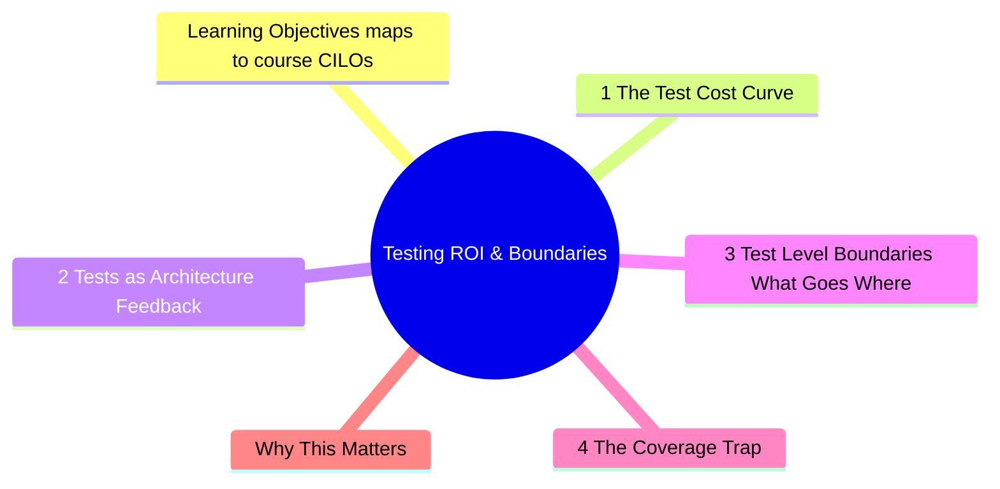
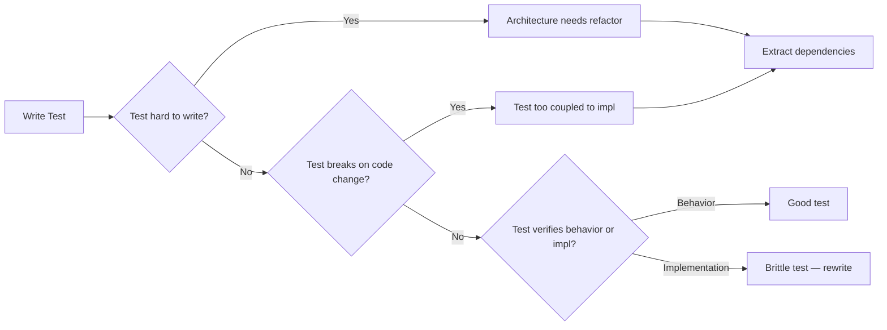

# Module 1: Testing ROI & Boundaries

Est. study time: 2h
Language: en
Description: Foundation module — learn to evaluate test value, choose test levels strategically, and recognize when tests become liabilities that block refactoring.



## Learning Objectives (maps to course CILOs)
- Evaluate test ROI across unit/integration/e2e levels using real maintenance cost math
- Identify test types that block vs enable refactoring
- Apply boundary decisions: what to test at each level, what to skip
- Recognize "test coverage trap" — high coverage that prevents evolution

---

## Core Content

### 1.1 The Test Cost Curve

Every test has 3 costs:
- **Write cost**: time to author
- **Maintain cost**: time to update when code changes
- **CI cost**: compute time × frequency

Most teams track only write cost. The hidden killer: maintain cost grows with test fragility.

Compare levels:

| Level       | Write  | Maintain | CI run | Refactor block         |
| ----------- | ------ | -------- | ------ | ---------------------- |
| Unit        | Low    | Low      | Fast   | Low (if well-designed) |
| Integration | Medium | Medium   | Medium | Medium                 |
| E2E         | High   | High     | Slow   | High                   |

> **Think**: Your CI test suite takes 45 minutes. The CTO wants it under 10 minutes. What do you remove?
>
> *Answer: Start with slow E2E tests that test simple things already covered at lower levels. Keep E2E only for critical user flows that cannot be validated otherwise. Each test you keep must justify its cost.*

### 1.2 Tests as Architecture Feedback

Here is the key insight: **If a test is hard to write, the architecture is wrong.**

Hard-to-test code reveals:
- Tight coupling (hard to isolate)
- Hidden dependencies (hard to set up)
- Side effects in unexpected places (hard to assert)
- Mixed concerns (hard to describe intent)

Pattern: Struggling to test a component? The test is telling you the component needs refactoring. Do not fight the test — listen to it.

```tsx
// Hard to test — implicit dependency on API + router
function Dashboard() {
  const [data, setData] = useState(null)
  useEffect(() => {
    fetch('/api/dashboard').then(setData)
  }, [])
  const navigate = useNavigate()
  return <div>...</div>
}

// Easier to test — dependency injected via hook
function Dashboard() {
  const { data } = useDashboardData()
  return <div>...</div>
}
// Now test useDashboardData in isolation, Dashboard as pure UI
```

> **Think**: Your component renders a list from `fetch()` inside `useEffect`. To test, you mock `fetch`, wait for async, then assert. This works but feels fragile. What does the test tell you about the component's architecture?
>
> *Answer: Data fetching is mixed with rendering. If you change the API client (e.g., switch to React Query), every test breaks. Extract data layer into a hook or service — tests only change when rendering behavior changes, not when data fetching strategy changes.*

### 1.3 Test Level Boundaries: What Goes Where

Rule of thumb:
- **Unit (60%)**: Pure logic, hooks (with extracted data layer), utilities, store reducers. Fast feedback.
- **Integration (30%)**: Component + dependencies together (renders with real context providers, MSW for API). Core user flows.
- **E2E (10%)**: Critical paths only — login, checkout, data loss prevention. Use sparingly.

Why 60/30/10? The test pyramid is not about numbers. It is about **feedback speed vs confidence tradeoff**. Unit gives fastest feedback per test. E2E gives highest confidence per test but slowest feedback.

> **Think**: Your payment flow has 12 steps. You have:
> - 1 E2E test covering all steps (2 min)
> - 12 integration tests, each covering one step (2s each)
> - 24 unit tests for edge cases (0.1s each)
> Your CI is 12 min. The payment integration test fails once per week — flaky network. Do you debug the flake or delete the E2E test?
>
> *Answer: Delete the E2E test. The integration tests cover each step with better isolation. The E2E adds zero new coverage but adds 2 min of CI time + flakiness. Only keep E2E for flows where integration tests cannot simulate real conditions (e.g., payment gateway redirect).*

### 1.4 The Coverage Trap

80% coverage does not mean 80% bug-free. Coverage measures what code *executed*, not what code *verified correctly*.

```typescript
function calculateDiscount(price: number, isMember: boolean): number {
  if (isMember) return price * 0.9
  return price
}
```

Test that achieves 100% coverage but verifies nothing useful:
```typescript
test('returns price for non-member', () => {
  expect(calculateDiscount(100, false)).toBe(100)
})
test('returns discounted price for member', () => {
  expect(calculateDiscount(100, true)).toBe(90)
})
```

These tests *execute* both branches. They *verify* what the code does. But they do not verify *specification*:
- What if price is 0?
- What if price is negative?
- What if isMember is undefined?
- What if discount rate changes? (hardcoded 0.9 — should this be configurable?)

> **Think**: Team A has 95% coverage and ships a bug: negative price passes through without error. Team B has 60% coverage but tests every boundary condition. Which team has better testing?
>
> *Answer: Team B. Coverage percentage is a vanity metric. What matters is whether tests verify behavior at boundaries and invariants. Team A's high coverage came from trivial "execute and assert no crash" tests.*



### 1.5 Characteristics of Advanced vs Junior Testing

| Junior test                        | Advanced test                                      |
| ---------------------------------- | -------------------------------------------------- |
| Tests implementation details       | Tests behavior/contracts                           |
| Mocks everything                   | Uses real dependencies when practical              |
| High coverage, low assertion rigor | Focused coverage, high assertion rigor             |
| Breaks on any refactor             | Survives refactor (tests change when spec changes) |
| 100 tests, long CI                 | 50 tests, fast CI, better confidence               |

---

## Why This Matters

Most teams discover the test cost problem in production: 500 tests, 20-minute CI, every PR breaks unrelated tests. The team starts deleting tests or mocking aggressively. This is the symptom of not understanding test ROI.

The advanced tester thinks: "What is the minimum set of tests that gives me maximum confidence to refactor?" This module's concepts are your filter for every test you write from now on.

---

## Common Questions

**Q: If tests are hard to write, should I mock more?**
A: No — this is the most common mistake. Mocking hides coupling instead of fixing it. If a test is hard to set up, the code is probably too coupled. Mock only external boundaries (API, filesystem, third-party SDK). Do not mock your own modules to make testing easier.

**Q: What about 100% coverage mandates from management?**
A: Push back with data. Show that 100% coverage costs more in maintenance than it saves in bug prevention. Propose a targeted approach: critical paths at 90%+, utilities at 70%+, UI components at 50%+ (tested through integration). Cover the math: if maintain cost per test is 5 min per month × N tests, vs bug cost per incident × expected incidents.

**Q: When is an E2E test worth its cost?**
A: When the flow cannot be reliably tested at lower levels. Examples: third-party payment redirect, OAuth login flow, cross-tab synchronization. For everything else, integration tests are better.

---

## Examples

### Example 1: Converting a brittle test suite

**Problem**: Team has 200 tests for a search component. Every UI change breaks 30 tests. CI takes 15 min.

**Root cause**: Tests use `getByTestId` everywhere, test internal state transitions, mock the API client, and assert on implementation details (class names, internal state values).

**Solution**: Delete all 200 tests. Write 20 integration tests using MSW for API, `getByRole` for queries, test only visible behavior (search input → results list → empty state → error state). CI drops to 2 min. Refactors no longer cause test failures.

### Example 2: Using test feedback to refactor

**Problem**: `UserProfile` component fetches data, handles loading/error/empty states, and renders a complex layout. Writing tests requires 30 lines of setup.

**Test feedback**: The component has 3 responsibilities (data fetching, state management, rendering). Each should be separate.

**After refactor**: `useUserProfile` hook (test data logic), `UserProfileUI` component (test rendering, no data deps), `UserProfile` composite (integration test with MSW). Each test is 5-10 lines.

---

> **Predict**: Commit to an answer: does testing roi & boundaries get simpler or harder once fetch() enters the picture?
>
> *Answer: Harder locally, simpler globally: individual pieces carry more rules, but the overall system needs fewer special cases.*
> **Cloze**: {blank} governs how testing roi & boundaries behaves when multiple useeffect concerns collide.
> **Cloze**: The rule that keeps fetch() correct under load is called {blank}.
> **Cloze**: In testing roi & boundaries, fetch determines {blank}.
> **Spot the Mistake**: Code review note: someone applies useeffect everywhere "to be safe" in a testing roi & boundaries codebase. Spot the mistake.
>
> *Answer: Blanket application hides which spots actually need useeffect. Apply it where the semantics demand it, and document why.*


## Key Takeaways

- Every test has 3 costs: write, maintain, CI run. Ignoring maintain cost creates brittle suites
- Hard-to-test code is architecture feedback, not a mocking problem
- Test behavior, not implementation — behavior tests survive refactors
- Delete tests that no longer provide value. Dead test weight slows the team
- Coverage percentage is vanity. Boundary verification is value
- 60/30/10 unit/integration/e2e ratio is about feedback speed, not dogma
- Mock only external boundaries. Do not mock your own modules
- E2E tests are high-cost insurance — use sparingly

---

## Common Misconception

"More tests = better quality." False. Bad tests actively reduce quality by:
- Slowing down CI (fewer deploys)
- Desensitizing the team to test failures (cry wolf)
- Blocking refactors (tests break and nobody understands why)
- Encouraging mocking to "fix" testability (hides real coupling)

Better: fewer, smarter, refactor-safe tests.

---

## Feynman Explain

Explain "test ROI" to a junior developer. Use no jargon. Give a concrete example: "Imagine you write a test for every line of code. One day you need to change how data loads. Now every test breaks. You spend 2 hours fixing tests. Was that worth it? What if you had only tested the visible behavior — the data would still appear the same way, so those tests would pass without changes."


---

## Reframe

(Pause. Judge the "coverage trap" argument: is coverage truly meaningless? When would high coverage help despite being shallow? What about regulated industries where coverage mandates exist? Write your evaluation.)

---

## Drill

Take the quiz. MCQs test different angles — recall, application, scenario.

Run: `learn.sh quiz advanced-react-testing 1`
