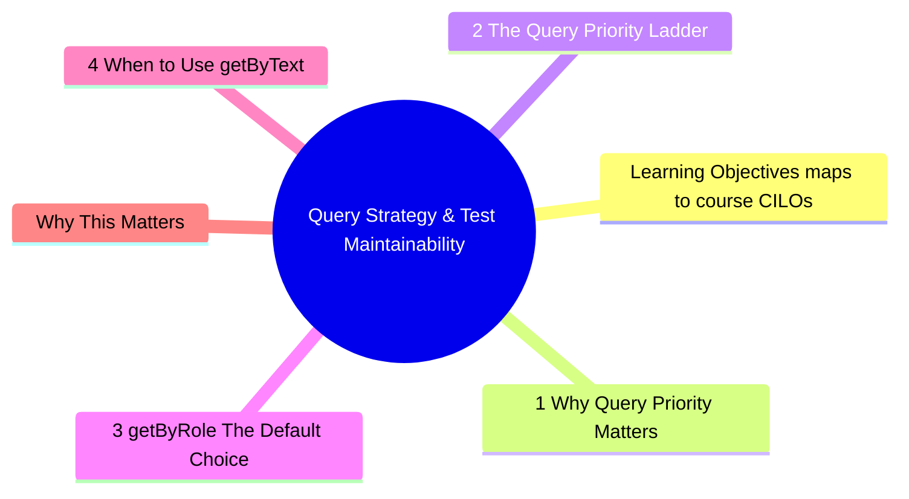
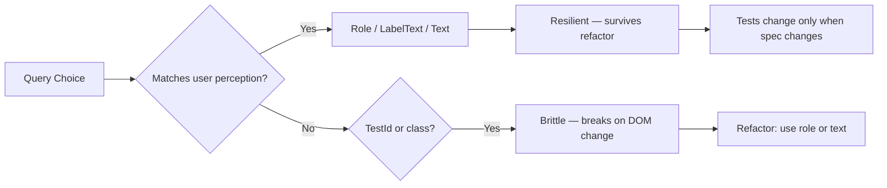

# Module 2: Query Strategy & Test Maintainability

Est. study time: 2h
Language: en
Description: Query selection is the single highest-leverage skill for writing refactor-safe tests. Learn why getByRole is the default choice, when to drop down to getByText or getByTestId, and how query strategy determines whether tests survive DOM changes.



## Learning Objectives (maps to course CILOs)
- Apply query priority to maximize refactor-resistance of tests
- Distinguish between accessibility queries and implementation queries
- Recognize when a query choice signals poor component accessibility
- Refactor existing tests from brittle queries to resilient ones

---

## Core Content

### 2.1 Why Query Priority Matters

Testing Library's query priority exists for one reason: **refactor resistance**.

A query that looks up by role, label, or text matches what the *user* sees. When you change the underlying DOM structure (div → section, class rename, wrapping element), the query still finds the element.

A query that looks up by testId or class name matches the *implementation*. Any DOM change breaks it.

```typescript
// Brittle — coupled to DOM structure
screen.getByTestId('user-name')
screen.getByClassName('user-name')

// Resilient — matched by what user sees
screen.getByRole('heading', { name: /user name/i })
screen.getByLabelText('User Name')
screen.getByText('John Doe')
```

> **Think**: Your team adds a decorative wrapper `<div class="card-wrapper">` around `<h2>User Name</h2>`. Which queries break?
>
> *Answer: `getByTestId('user-name')` breaks if testId was on the div. `getByClassName` breaks if class changes. `getByRole('heading', { name: /user name/i })` passes — the heading is still a heading with the same accessible name.*

### 2.2 The Query Priority Ladder

Testing Library documents this order. Here is the reasoning for *why* each level exists:

```text
Priority 1: getByRole        — accessible to screen readers, most stable
Priority 2: getByLabelText   — form fields, matches user navigation
Priority 3: getByPlaceholderText — secondary, placeholder disappears on input
Priority 4: getByText        — non-interactive elements, visible text
Priority 5: getByDisplayValue — form values
Priority 6: getByAltText     — images, inputs with alt
Priority 7: getByTitle       — fragile, many elements have no title
Priority 8: getByTestId      — last resort, coupled to implementation
```

Why this order maps to refactor-resistance:

| Query       | Depends on                  | Breaks when                     |
| ----------- | --------------------------- | ------------------------------- |
| getByRole   | ARIA role + accessible name | Element type changes completely |
| getByText   | Visible text content        | Text changes (spec change)      |
| getByTestId | data-testid attribute       | Data attribute removed/renamed  |

> **Think**: You use `getByTestId('submit-btn')` for every assertion. After a design system migration, all buttons use a shared `<Button>` component that does not forward `data-testid`. How many tests break?
>
> *Answer: Every test that uses getByTestId for buttons. If you had used `getByRole('button', { name: /submit/i })`, zero tests break — the role and accessible name are preserved by the new button component.*
>



### 2.3 getByRole: The Default Choice

`getByRole` is the most stable query because it queries the **accessibility tree**, not the DOM tree.

```tsx
// Multiple implementations, same result
<div role="button" tabindex="0">Submit</div>
<button>Submit</button>
<Button>Submit</Button> // design system component

// All found by:
screen.getByRole('button', { name: /submit/i })
```

The `name` option matches the accessible name computed from:
- Inner text content
- `aria-label`
- `aria-labelledby`
- `label` element association

This makes it incredibly refactor-resistant. Change the wrapper, change the styling — as long as the accessible name stays the same, the query works.

> **Think**: You have a dropdown component. The old version uses `<select>`. The new version uses a custom div-based dropdown with `role="listbox"`. Does `getByRole('combobox')` still find it?
>
> *Answer: No — if the implementation changes from `<select>` (implicit combobox role) to a custom div without role="combobox", the role changes. But if the new component properly sets `role="combobox"` (as it should for accessibility), the query still works. Test your accessibility, not your HTML.*

### 2.4 When to Use getByText

`getByText` is for non-interactive elements where no role makes sense:

```tsx
// Heading — use getByRole
screen.getByRole('heading', { level: 2, name: /profile/i })

// Error message in a div — no semantic role, use getByText
screen.getByText(/no results found/i)

// List item — use getByRole with listitem
screen.getByRole('listitem', { name: /item name/i })
```

Rule: if there is a semantic role, use it. If there is no semantic role and the text is visible content, use `getByText`.

### 2.5 When (and How) to Use getByTestId

`getByTestId` is valid only when:
1. No semantic way to identify the element (rare)
2. The element is dynamic and has no stable text content
3. You are testing a non-semantic container that must be found

Even then, prefer `getByTestId` over class names or CSS selectors.

```tsx
// Acceptable use: virtualized list container
<div data-testid="virtual-list-container">
  {/* dynamically rendered items */}
</div>

// Bad use: button with visible text
<button data-testid="submit-btn">Submit</button> // ← use getByRole instead
```

> **Think**: A slider component renders with no visible label and no semantic role that distinguishes it from other sliders on the page. What is the correct query?
>
> *Answer: Add `aria-label` to the slider (`<div role="slider" aria-label="Volume" />`) and use `getByRole('slider', { name: /volume/i })`. This is both accessible and testable. Avoid `getByTestId` when a simple aria attribute solves the problem.*

### 2.6 data-testid Discipline

Even when `getByTestId` is necessary, discipline matters. The cardinal rule:

**test-id attaches to leaf components only, one level below test scope.**

```text
Test scope: <OrderCheckout>
  ↓ one level down
Leaf: <ShippingForm data-testid="shipping-form" />
Leaf: <PaymentForm data-testid="payment-form" />
```

The test for `OrderCheckout` uses `getByTestId('shipping-form')` to find the slot. But no test should assert on internals *inside* `ShippingForm` via test-id — those use `getByRole` or `getByText` from `ShippingForm`'s own tests.

```tsx
// OrderCheckout.test.tsx — uses test-id only for child slot
test('renders shipping form in checkout', () => {
  render(<OrderCheckout />)
  expect(screen.getByTestId('shipping-form')).toBeInTheDocument()
})

// ShippingForm.test.tsx — uses role/text for internals
test('renders address fields', () => {
  render(<ShippingForm />)
  expect(screen.getByLabelText(/address/i)).toBeInTheDocument()
  expect(screen.getByRole('button', { name: /save/i })).toBeInTheDocument()
})
```

This boundary ensures:
- `ShippingForm` can be refactored internally without breaking `OrderCheckout` tests
- `OrderCheckout` tests verify composition, not leaf details
- `data-testid` is a **composition boundary marker**, not a crutch for bad queries

> **Think**: Your team places `data-testid` on every `<div>` in a component. What happens when the Design System replaces all divs with `Box` components that do not forward test-id?
>
> *Answer: Every test that uses those test-ids breaks. If test-ids were only on the component boundary (one level down from test scope), only the boundary test-ids break — leaf component tests use role/text and survive.*

### 2.7 Query Choice as Accessibility Audit

Test query patterns reveal accessibility issues before users report them:

| What tests use                         | What it reveals                             |
| -------------------------------------- | ------------------------------------------- |
| `getByRole('button')` everywhere       | Good — accessible interactive elements      |
| `getByTestId` for interactive elements | Missing accessible names/labels             |
| `getByText` for headings               | Headings missing semantic role              |
| `getByPlaceholderText` for form fields | Missing labels (placeholder is not a label) |

When you find yourself reaching for a lower-priority query, ask: **"Is this hard to query because the component is inaccessible?"**

Fix the accessibility issue, then the test query becomes trivially stable.

---

## Why This Matters

Query strategy is the highest-leverage skill for test maintainability. A single query choice determines whether a test survives a CSS refactor, a design system migration, or a component library upgrade. Teams that use `getByTestId` everywhere face test breakage on every visual update. Teams that use `getByRole` never think about it.

The advanced insight: query strategy is not just about tests. It is a real-time accessibility audit.

---

## Common Questions

**Q: Isn't getByRole slower than getByTestId?**
A: Negligible difference for individual queries (microseconds). If you have thousands of queries, the bottleneck is rendering, not querying. Do not optimize query performance — optimize test maintainability.

**Q: What about third-party components that do not expose roles?**
A: Wrap them in a test helper that adds `data-testid` at the outermost boundary, then query with `getByTestId` only at that boundary. But first check if the component supports `aria-label` or `role` props — many do.

**Q: How do I find the right role for a custom component?**
A: Use browser DevTools accessibility inspector, or `screen.logTestingPlaygroundURL()` in your test to see the accessible tree. The testing library `logRoles` helper also prints all roles found in the rendered component.

---

## Examples

### Example 1: Refactoring from testId to role

Before:
```tsx
// Component
<div data-testid="user-card">
  
  <h3 data-testid="username">{user.name}</h3>
</div>

// Test
screen.getByTestId('user-card')
screen.getByTestId('avatar')
screen.getByTestId('username')
```

After:
```tsx
// Component — same visual, accessible
<article aria-label={`Profile for ${user.name}`}>
  
  <h3>{user.name}</h3>
</article>

// Test — survives any DOM refactor
screen.getByRole('article', { name: /profile for/i })
screen.getByRole('img', { name: /avatar/i })
screen.getByRole('heading', { name: /username/i })
```

### Example 2: Form with invisible labels

Before:
```tsx
// Component — labels hidden visually
<input placeholder="Email" data-testid="email-input" />

// Test
screen.getByTestId('email-input')
```

After:
```tsx
// Component — visually hidden label, accessible
<label htmlFor="email" className="sr-only">Email</label>
<input id="email" placeholder="Email" />

// Test — works for all users
screen.getByLabelText(/email/i)
```

---

> **Predict**: Before reading deeper: what do you expect happens when <div class="card-wrapper"> interacts with <h2>user name</h2> in query strategy & test maintainability?
>
> *Answer: The system relies on <div class="card-wrapper"> to keep <h2>user name</h2> predictable — when both apply, the stricter rule wins.*
> **Spot the Mistake**: A developer treats <div class="card-wrapper"> as optional because "it works without it." Where is the mistake?
>
> *Answer: It works only until the assumptions behind <div class="card-wrapper"> are violated. The fix: treat it as part of the contract of query strategy & test maintainability, not an optimization.*


## Key Takeaways

- getByRole is the default query — it queries the accessibility tree, not DOM tree
- Query priority maps to refactor-resistance: higher priority = survives more changes
- If a query is hard to write, check if the component is inaccessible
- getByTestId is a last resort, not a default
- Tests break on implementation changes when queries match implementation, not behavior
- Query choice doubles as an automated accessibility audit

---

## Common Misconception

"getByTestId is faster to write, so we use it everywhere." This is short-term thinking. The time saved writing getByTestId is spent tenfold later fixing broken tests on every UI change. getByRole requires learning ARIA roles but pays back immediately in test stability.

The real cost is not the 2 extra seconds to type `getByRole('button', { name: /submit/i })` — it is the 2 hours debugging why 50 tests broke after upgrading the button component.

---

## Feynman Explain

Explain "query priority" to a non-technical product manager. Use no jargon: "Imagine you tell someone to click the blue 'Buy Now' button. If the button changes color to green but still says 'Buy Now', they still find it. But if you said 'click the blue button' and it turned green, they are lost. Good queries describe what the button *does*, not what it *looks like*."


---

## Reframe

(Judge the "getByTestId last resort" rule. When would breaking this rule be pragmatic? Consider: dynamic content generation, canvas/SVG, non-HTML rendering. Write your evaluation.)

---

## Drill

Take the quiz. MCQs test different angles — recall, application, scenario.

Run: `learn.sh quiz advanced-react-testing 2`
