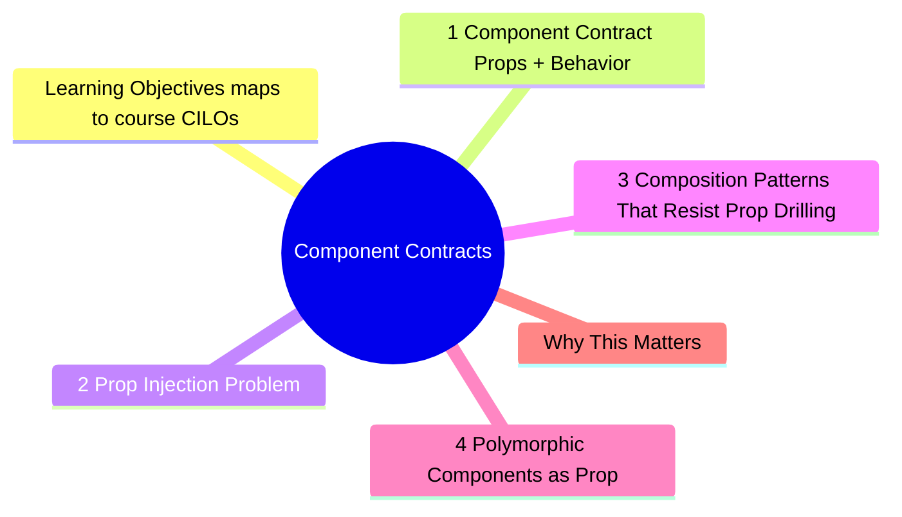
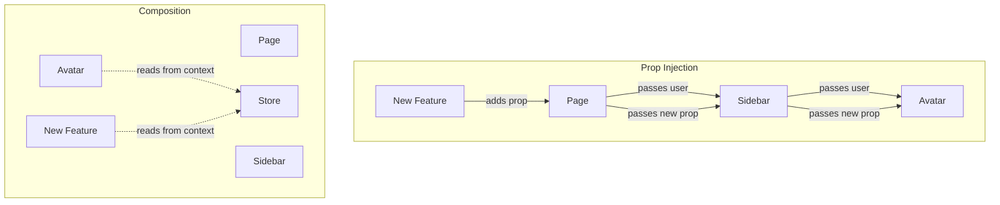

# Module 3: Component Contracts

Est. study time: 2.5h
Language: en
Description: Tests are contracts. They enforce what a component promises to render and how it behaves. This module covers patterns that make component tests refactor-safe: composition over prop injection, contract-based assertions, and rules to prevent prop drilling.



## Learning Objectives (maps to course CILOs)
- Design component interfaces that are testable and refactor-safe
- Apply composition patterns to avoid prop drilling
- Write contract tests that verify behavior, not implementation
- Recognize when a component's API needs redesign based on test friction

---

## Core Content

### 3.1 Component Contract = Props + Behavior

Every component has an implicit contract:

```text
Given: props X
When: user does Y
Then: component renders Z
```

A test verifies this contract. When the contract changes (props renamed, behavior changed), tests should break — that is signal, not noise.

When tests break without the contract changing (refactor, styling, wrapper change), the test is testing implementation, not contract.

```tsx
// Contract: <UserProfile userId={string} />
// Renders: user name, email, avatar

// Contract test — what the component promises
test('renders user information', () => {
  render(<UserProfile userId="123" />)
  expect(screen.getByRole('heading', { name: /john/i })).toBeInTheDocument()
  expect(screen.getByText(/john@example.com/)).toBeInTheDocument()
})

// Implementation test — coupled to internals
test('renders with correct CSS class', () => {
  render(<UserProfile userId="123" />)
  expect(container.querySelector('.profile-card')).toBeInTheDocument()
})
```

> **Think**: You rename `.profile-card` to `.user-card` during a CSS refactor. Which test breaks?
>
> *Answer: The implementation test breaks. The contract test passes — the component still renders the same content with the same behavior. The CSS class is an implementation detail that tests should never touch.*

### 3.2 Prop Injection Problem

Prop injection = passing props through intermediate components to reach a deep child. This is the most common anti-pattern that makes refactoring painful.

```text
<Page user={user} />          // Page receives user
  → <Sidebar user={user} />   // Sidebar does not use user, just passes it
    → <Avatar user={user} />  // Avatar actually uses user
```

**Problem**: Adding a feature means adding more props to every intermediate component. Every change touches N components.

```tsx
// Brittle — prop injection
function Page({ user, onLogout, theme, notifications }) {
  return (
    <div>
      <Header user={user} onLogout={onLogout} theme={theme} />
      <MainContent user={user} notifications={notifications} />
    </div>
  )
}

// Resilient — composition
function Page() {
  return (
    <div>
      <Header>
        <UserMenu />  {/* UserMenu reads user from context/store */}
      </Header>
      <MainContent>
        <NotificationPanel />  {/* reads notifications internally */}
      </MainContent>
    </div>
  )
}
```

> **Think**: Your team adds a "user status" feature that shows online/offline badge next to the avatar. With prop injection, how many files change? With composition, how many?
>
> *Answer: Prop injection: `Avatar` (new prop), `Sidebar` (pass through), `Page` (add prop, pass to Sidebar), data source. Composition: `Avatar` reads from context/store directly. Zero intermediate components change.*



### 3.3 Composition Patterns That Resist Prop Drilling

Three patterns, in order of preference:

**1. Context + Store (Zustand, Jotai, React Context)**

Components read what they need directly from context. No pass-through props.

```tsx
function Avatar() {
  const user = useUserStore(s => s.user)  // reads from store
  if (!user) return <Skeleton />
  return 
}

// Test — no props needed
test('renders avatar from store', () => {
  useUserStore.setState({ user: { name: 'John', avatar: '/john.jpg' } })
  render(<Avatar />)
  expect(screen.getByRole('img', { name: /john/i })).toHaveAttribute('src', '/john.jpg')
})
```

**2. Slots (children prop / render props)**

Let parent inject components instead of data.

```tsx
function Page({ header, sidebar, children }) {
  return (
    <div>
      <header>{header}</header>
      <aside>{sidebar}</aside>
      <main>{children}</main>
    </div>
  )
}

// Usage — Page just arranges, does not care about internals
<Page
  header={<Header><UserMenu /></Header>}
  sidebar={<Sidebar />}
>
  <Content />
</Page>
```

**3. Container/Presenter pattern**

Container handles data, presenter handles rendering. Test both independently.

```tsx
// Presenter — pure, receives data as props, trivial to test
function UserProfileUI({ user, onEdit }) {
  return (
    <div>
      <h2>{user.name}</h2>
      <button onClick={onEdit}>Edit</button>
    </div>
  )
}

// Container — fetches data, passes to presenter
function UserProfileContainer({ userId }) {
  const { data: user } = useUser(userId)
  if (!user) return <Skeleton />
  return <UserProfileUI user={user} onEdit={() => updateUser(user.id)} />
}
```

> **Think**: Which pattern is most refactor-resistant when the data source changes from REST to GraphQL?
>
> *Answer: Context/Store pattern. Only the store implementation changes. Components that read from the store do not change. Presenter components (pure UI) do not change at all — they just receive new data.*

### 3.4 Polymorphic Components (`as` Prop)

Polymorphic components accept an `as` prop to change the rendered HTML element:

```tsx
<Button as="a" href="/profile">Profile</Button>   // renders <a>
<Button as="button" onClick={handleClick}>Save</Button> // renders <button>
<Button as={Link} to="/home">Home</Button>         // renders router <Link>
```

**Testing challenge**: The rendered element changes, but the accessible role and contract should stay constant.

```tsx
// Button component contract
test('renders with correct accessible role regardless of as prop', () => {
  const { rerender } = render(<Button as="button">Click</Button>)
  expect(screen.getByRole('button', { name: /click/i })).toBeInTheDocument()

  rerender(<Button as="a" href="/">Click</Button>)
  // <a> without role="button" is not a button — test fails!
  // Fix: component should add role="button" when as="a"
  expect(screen.getByRole('button', { name: /click/i })).toBeInTheDocument()
})
```

**Forwarded refs**: Polymorphic components must forward refs. Test this:

```tsx
test('forwards ref to the underlying DOM element', () => {
  const ref = React.createRef<HTMLAnchorElement>()
  render(<Button as="a" href="/" ref={ref}>Link</Button>)
  expect(ref.current?.tagName).toBe('A')
  expect(ref.current?.getAttribute('href')).toBe('/')
})
```

> **Think**: Your library has `as="button"` (renders `<button>`) and `as="a"` (renders `<a>`). A consumer uses `as={Link}` from React Router. How do you test this?
>
> *Answer: Test with a mock `Link` component: `const MockLink = ({ to, children }) => <a href={to}>{children}</a>`. This proves the polymorphic contract works for third-party components without depending on the router library in unit tests.*

### 3.5 Contract Test Rules

**Rule 1: Test the contract, not the wiring.**

```tsx
// Bad — tests implementation
test('calls API on mount', async () => {
  render(<Profile userId="1" />)
  await waitFor(() => {
    expect(mockFetch).toHaveBeenCalledWith('/api/users/1')
  })
})

// Good — tests behavior
test('renders profile after loading', async () => {
  render(<Profile userId="1" />)
  expect(await screen.findByRole('heading', { name: /john/i })).toBeInTheDocument()
})
```

**Rule 2: Assert on what the user perceives.**

If the user does not see it, do not assert on it. This includes:
- Internal state
- API call parameters
- CSS classes
- data-testid (in tests for end users, not library consumers)

**Rule 3: One logical assertion per test.**

```tsx
// Bad — tests multiple things, unclear which failed
test('profile works', async () => {
  render(<Profile userId="1" />)
  expect(await screen.findByText(/john/i)).toBeInTheDocument()
  expect(screen.getByText(/john@example.com/)).toBeInTheDocument()
  expect(screen.getByRole('button', { name: /edit/i })).toBeInTheDocument()
})

// Good — each scenario is a separate test
test('renders user name', async () => { /* ... */ })
test('renders user email', async () => { /* ... */ })
test('shows edit button for own profile', async () => { /* ... */ })
```

> **Think**: You have a test that asserts name, email, and avatar visibility in one `it` block. The avatar component throws an error. What happens?
>
> *Answer: The test fails at the first assertion (name). You fix the name and re-run. It fails again at email. You fix email. It fails again at avatar. Three rounds of CI to fix one problem. Separate tests catch all failures in one run.*

### 3.5 Refactor Rules for Components

When refactoring a component, these rules preserve contract integrity:

1. **Inputs**: Props can be renamed if tests use role/text queries (not prop-dependent)
2. **Outputs**: Visible content must stay the same unless spec changes
3. **Internals**: Anything inside the component can change freely
4. **Boundaries**: Extract logic behind hooks/services before changing how they work

```tsx
// Before refactor
function UserCard({ user }) {
  return (
    <div className="card">
      <h2>{user.name}</h2>
      <p>{user.email}</p>
    </div>
  )
}

// After refactor — different internals, same contract
function UserCard({ user }) {
  const initials = getInitials(user.name)
  return (
    <section aria-label={`Profile for ${user.name}`}>
      <Avatar initials={initials} />
      <h2>{user.name}</h2>
      <p>{user.email}</p>
    </section>
  )
}

// Both tests pass unchanged:
test('shows user name', () => {
  render(<UserCard user={{ name: 'John', email: 'john@test.com' }} />)
  expect(screen.getByRole('heading', { name: /john/i })).toBeInTheDocument()
})
```

---

## Why This Matters

Prop drilling is the most common source of brittle components. Every "just add one more prop" decision creates future refactoring cost. Composition and contract testing are the antidote.

The advanced insight: if a component is hard to test without prop drilling, the component's interface is poorly designed. The test exposes the design problem before it reaches production.

---

## Common Questions

**Q: Isn't prop injection simpler for small apps?**
A: Yes, for < 5 components. But small apps grow. The cost of refactoring from prop injection to composition later is high. Start with composition patterns from day one for any state that crosses 2+ component levels.

**Q: Context makes testing harder — I need to wrap everything in providers. Is this worth it?**
A: Create a test wrapper utility. One-time setup cost for infinite refactor safety.

```tsx
// test-utils.tsx
function TestWrapper({ children }) {
  return (
    <UserStoreProvider>
      <ThemeProvider>
        {children}
      </ThemeProvider>
    </TestWrapper>
  )
}

// Usage
render(<Component />, { wrapper: TestWrapper })
```

**Q: Container/presenter seems like extra files for no benefit.**
A: It pays off when: (1) the data source changes, (2) you need to test loading/error/empty states, (3) the UI team works independently from the data team. For trivial components, inline is fine. Extract when the pattern emerges.

---

## Examples

### Example 1: From prop injection to composition

Before:
```tsx
function Dashboard({ user, orders, notifications }) {
  return (
    <div>
      <Header user={user} />
      <OrderList orders={orders} />
      <NotificationBell count={notifications.length} />
    </div>
  )
}
// Every test must pass all three props
// Adding a feature means adding another prop
```

After:
```tsx
function Dashboard() {
  return (
    <div>
      <Header />
      <OrderList />
      <NotificationBell />
    </div>
  )
}
// Each component reads from its own store/slice
// Tests only provide data their component needs
// New features added independently, zero Dashboard changes
```

### Example 2: Refactoring a brittle test suite

Before:
```tsx
// Component passes 6 props through 3 levels
// Test mocks 3 hooks, passes 6 props, asserts on testId
test('order summary', () => {
  render(<CheckoutPage user={user} cart={cart} promo={promo} tax={tax} shipping={shipping} onCheckout={fn} />)
  expect(screen.getByTestId('order-total')).toHaveTextContent('$45.00')
})
```

After refactoring to composition + store:
```tsx
// Component reads from store internally
// Test sets store state directly
test('order total display', () => {
  useCartStore.setState({ items: mockItems, promo: mockPromo })
  render(<OrderSummary />)
  expect(screen.getByText('$45.00')).toBeInTheDocument()
})
```

---

> **Predict**: Before reading deeper: what do you expect happens when .profile-card interacts with .user-card in component contracts?
>
> *Answer: The system relies on .profile-card to keep .user-card predictable — when both apply, the stricter rule wins.*
> **Spot the Mistake**: A developer treats .profile-card as optional because "it works without it." Where is the mistake?
>
> *Answer: It works only until the assumptions behind .profile-card are violated. The fix: treat it as part of the contract of component contracts, not an optimization.*


## Key Takeaways

- Component contracts = props + behavior. Test the contract, not internals
- Prop injection creates refactoring tax on every feature addition
- Three composition patterns: context/store, slots, container/presenter
- One logical assertion per test catches all failures in one CI run
- Hard-to-test components are poorly designed components
- Create reusable test wrappers for context-dependent components
- CSS classes, internal state, API calls — do not test these. Test what user sees

---

## Common Misconception

"Prop drilling is fine because TypeScript catches mistakes." TypeScript catches type errors at compile time. It does not catch architectural coupling. The problem with prop injection is not type safety — it is that every component in the chain must change when a new feature is added. That is a design cost, not a type cost.

---

## Feynman Explain

Explain "component contract" to a designer. Use no code: "Imagine a light switch. Its contract is: flip up = light on, flip down = light off. You can change what happens inside the wall — new wiring, smart bulb — but the switch still does the same thing. Good component tests check that flipping up turns on the light, not what color wire is inside."


---

## Reframe

(Judge the "single assertion per test" rule. Is there overhead? When would grouping assertions make sense? What about related properties like "renders user card with name, email, and avatar"? Write your evaluation.)

---

## Drill

Take the quiz. MCQs test different angles — recall, application, scenario.

Run: `learn.sh quiz advanced-react-testing 3`
