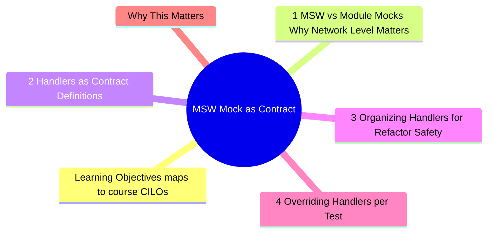
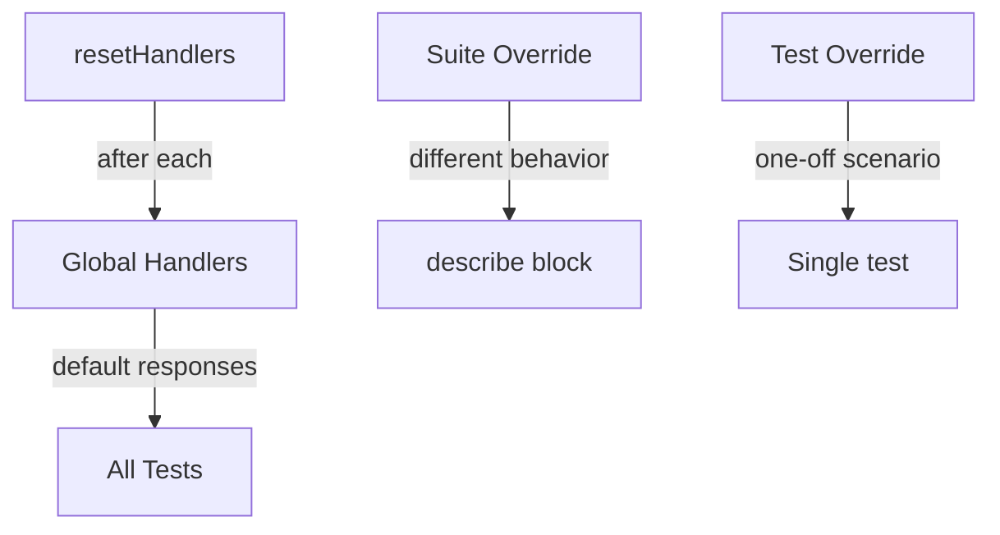

# Module 4: MSW: Mock as Contract

Est. study time: 2h
Language: en
Description: Mock Service Worker (MSW) is not just a mocking library — it is a contract layer between tests and API. Handlers define the API surface. Tests verify behavior against that surface. When the API changes, only handlers change, not tests.



## Learning Objectives (maps to course CILOs)
- Set up MSW handlers as API contract definitions
- Organize handlers to maximize reuse and refactor safety
- Write tests that survive API implementation changes
- Distinguish MSW (network-level mock) from module-level mocks

---

## Core Content

### 4.1 MSW vs Module Mocks — Why Network Level Matters

Before MSW, mocking HTTP meant intercepting at the module level:

```tsx
// Module-level mock — brittle
jest.mock('../api/client', () => ({
  fetchUser: jest.fn().mockResolvedValue({ name: 'John' })
}))

// Component test
test('renders user', async () => {
  render(<Profile userId="1" />)
  expect(await screen.findByText(/john/i)).toBeInTheDocument()
})
```

Problem: test is coupled to the import path and the function name. Switch from `fetchUser` to `useQuery` from React Query — mock breaks.

MSW mocks at the **network level**:

```tsx
// MSW handler — matches HTTP, not import
http.get('/api/users/:userId', ({ params }) => {
  return HttpResponse.json({ name: 'John' })
})

// Component test — unchanged regardless of how data is fetched
test('renders user', async () => {
  render(<Profile userId="1" />)
  expect(await screen.findByText(/john/i)).toBeInTheDocument()
})
```

The component's data fetching strategy can change completely (fetch → axios → React Query → tRPC). As long as it hits the same URL, the handler and test pass unchanged.

> **Think**: Your team switches from REST to GraphQL for the user endpoint. With module-level mocks, how many tests break? With MSW?
>
> *Answer: Module-level: every test that mocks the REST client breaks — new mock for GraphQL client needed. MSW: write one new GraphQL handler, zero tests change. Tests assert on rendered output, not network layer.*

### 4.2 Handlers as Contract Definitions

An MSW handler is a living contract:

```text
GET /api/users/:id → 200 { id, name, email }
                    → 404 { error: "not found" }
                    → 500 { error: "server error" }
```

This contract is shared knowledge between frontend and backend. Document it in handlers, not in a separate doc.

```tsx
// handlers/users.ts — single source of truth for user API contract
export const userHandlers = [
  http.get('/api/users/:id', ({ params }) => {
    const user = db.users.find(params.id)
    if (!user) return HttpResponse.json({ error: 'User not found' }, { status: 404 })
    return HttpResponse.json(user)
  }),

  http.put('/api/users/:id', async ({ params, request }) => {
    const body = await request.json()
    // validation logic mirrors real API
    if (!body.name) return HttpResponse.json({ error: 'Name required' }, { status: 400 })
    return HttpResponse.json({ ...user, ...body })
  }),
]
```

> **Think**: Where do you define the shape of `db.users`? How do you keep it in sync with the real API?
>
> *Answer: Define a factory function or fixture generator that produces realistic data. Use TypeScript types shared between frontend and backend (or a codegen tool like OpenAPI → TypeScript). This way, API type changes cause compile errors in handlers, catching mismatches before tests run.*

### 4.3 Organizing Handlers for Refactor Safety

Pattern: one file per domain, one index that combines all.

```text
mocks/
├── handlers/
│   ├── users.ts       # user endpoints
│   ├── products.ts    # product endpoints
│   ├── auth.ts        # login, logout, token refresh
│   └── orders.ts      # order lifecycle
├── fixtures/
│   ├── users.ts       # test data factories
│   └── products.ts
├── server.ts          # setup + teardown
└── browser.ts         # for Storybook/playwright if needed
```

```tsx
// server.ts — setup
import { setupServer } from 'msw/node'
import { userHandlers } from './handlers/users'
import { productHandlers } from './handlers/products'
import { authHandlers } from './handlers/auth'

export const server = setupServer(
  ...userHandlers,
  ...productHandlers,
  ...authHandlers,
)
```

```tsx
// jest.setup.ts — global lifecycle
beforeAll(() => server.listen())
afterEach(() => server.resetHandlers())
afterAll(() => server.close())
```

This structure means:
- Add a new endpoint: add handler file, spread it in server.ts. Zero test changes.
- Change an endpoint contract: update one handler. Tests that use that endpoint update automatically.
- Override for specific test: `server.use(overrideHandler)` in test body.

### 4.4 Overriding Handlers per Test

Sometimes you need a specific response for one test:

```tsx
test('shows error state when API fails', async () => {
  server.use(
    http.get('/api/users/:id', () => {
      return HttpResponse.json(
        { error: 'Internal server error' },
        { status: 500 }
      )
    })
  )

  render(<Profile userId="1" />)
  expect(await screen.findByText(/error/i)).toBeInTheDocument()
})
```

`server.use` adds a one-shot handler that takes priority. After the test, `resetHandlers()` removes it.

> **Think**: You override the user handler in 10 different tests. The API URL changes from `/api/users/:id` to `/api/v2/users/:id`. How many places to update?
>
> *Answer: Change the URL in the base handler file (1 place). The overridden handlers in tests still work because they match after the URL is updated in the base — but only if tests also use the new URL pattern. Better: define URL as a constant and import it everywhere.*

```tsx
// constants.ts
export const API_PATHS = {
  user: '/api/users/:id',
  products: '/api/products/:id',
}

// handlers/users.ts
import { API_PATHS } from '../constants'
http.get(API_PATHS.user, ...)
```

Now URL changes are one-line edits.

### 4.5 MSW Lifecycle: per Test vs per Suite

Three lifecycle patterns:

**1. Global handlers (shared across all tests)**
Default handlers for happy paths. Defined in `server.ts`. Every test gets these.

**2. Suite-level overrides**
When a group of tests needs specific behavior:

```tsx
describe('payment flow', () => {
  beforeAll(() => {
    server.use(paymentHandlers) // override globally for this suite
  })

  afterAll(() => server.resetHandlers())

  // ... tests
})
```

**3. Test-level overrides**
For one specific scenario:

```tsx
test('handles payment timeout', () => {
  server.use(http.post('/api/payments', async () => {
    await delay(10000) // simulate timeout
  }))
  render(<Payment />)
  // ...
})
```

Rule: start with global handlers. Override at the tightest scope needed. Fewer overrides = simpler tests.



---

## Why This Matters

MSW transforms mocking from a fragile chore into a design tool. Handlers become the living API contract. Tests are decoupled from data fetching implementation. When the backend changes, one handler file updates instead of dozens of tests.

The advanced insight: MSW handlers are not test infrastructure — they are API documentation that happens to be executable.

---

## Common Questions

**Q: Does MSW work with all HTTP clients (fetch, axios, React Query, tRPC)?**
A: Yes. MSW intercepts at the `fetch`/`XMLHttpRequest` level. Any client built on these works. tRPC uses HTTP underneath, so MSW can intercept tRPC requests too.

**Q: What about GraphQL?**
A: MSW has built-in `graphql` utilities. Module 5 covers this in depth.

**Q: MSW in Storybook?**
A: Yes — MSW provides browser-side workers. Use the same handler files in both tests and Storybook. One contract, two consumers.

**Q: What about response delay/timeout simulation?**
A: Use MSW's `delay()` utility. `await delay(1000)` adds 1 second. `delay('infinite')` for timeout scenarios.

---

## Examples

### Example 1: Refactoring from module mocks to MSW

Before (module mocks):
```tsx
jest.mock('../hooks/useUser', () => ({
  useUser: jest.fn().mockReturnValue({ data: mockUser, isLoading: false })
}))
test('renders user name', () => {
  render(<Profile userId="1" />)
  expect(screen.getByText(/john/i)).toBeInTheDocument()
})
```

After (MSW):
```tsx
// mocks/handlers/users.ts
export const handlers = [
  http.get('/api/users/1', () => HttpResponse.json(mockUser))
]

// jest.setup.ts
import { handlers } from './mocks/handlers/users'
server.listen({ handlers })

// test — no mocks needed
test('renders user name', async () => {
  render(<Profile userId="1" />)
  expect(await screen.findByText(/john/i)).toBeInTheDocument()
})
```

Now switch from `useUser` to `useQuery` to `fetch` — test never changes.

### Example 2: Contract mismatch detection

Handler defines `{ id, name, email }`. The component expects `{ id, name, avatar }`. The test renders the component and asserts avatar exists:

```tsx
test('renders user avatar', async () => {
  render(<Profile userId="1" />)
  expect(await screen.findByRole('img')).toBeInTheDocument()
}) // FAILS — handler only returns { id, name, email }
```

The test catches the contract mismatch early: the handler (representing the API contract) does not match the component's expectation. Fix the handler or fix the component — you discover the mismatch in development, not after deployment.

---

> **Predict**: Commit to an answer: does msw: mock as contract get simpler or harder once fetchuser enters the picture?
>
> *Answer: Harder locally, simpler globally: individual pieces carry more rules, but the overall system needs fewer special cases.*
> **Spot the Mistake**: Code review note: someone applies usequery everywhere "to be safe" in a msw: mock as contract codebase. Spot the mistake.
>
> *Answer: Blanket application hides which spots actually need usequery. Apply it where the semantics demand it, and document why.*


## Key Takeaways

- MSW intercepts at network level — tests survive data layer refactors
- Handlers are executable API contracts
- Organize handlers by domain (users, products, auth)
- Global handlers for happy path, override at tightest scope
- Define API paths as constants, not strings
- One handler change instead of N test changes
- Handlers catch API contract mismatches early

---

## Common Misconception

"MSW is just another mocking library." No. Module mocks couple tests to import paths and function names. MSW couples tests to HTTP requests — a stable boundary. Switching from fetch to React Query to tRPC? MSW tests pass unchanged. Module mock tests break every time.

The network boundary is the right abstraction level for integration tests.

---

## Feynman Explain

Explain MSW to a backend developer. Use analogies: "Think of MSW handlers like Postman mock servers. They define what the API returns for each endpoint. But instead of being a separate tool, they run inside the test process. When the frontend sends a request, MSW catches it and returns the handler's response — no real server needed."

---

## Reframe

(Judge the "MSW for all HTTP mocking" position. When would you NOT use MSW? What about offline-first apps with no network layer? What about services using WebSocket? Write your evaluation.)

---

## Drill

Take the quiz. MCQs test different angles — recall, application, scenario.

Run: `learn.sh quiz advanced-react-testing 4`
