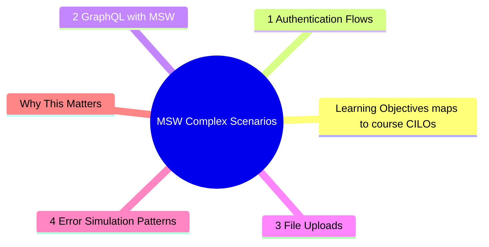
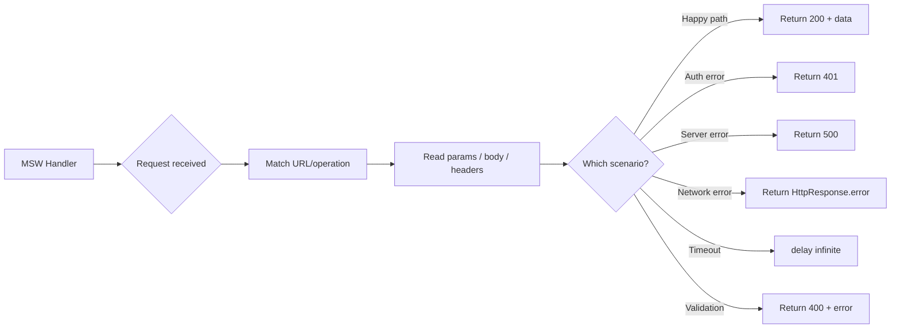

# Module 5: MSW: Complex Scenarios

Est. study time: 2h
Language: en
Description: Real applications need more than happy-path JSON responses. Authentication flows, GraphQL query matching, file uploads, and per-test lifecycle control are where MSW shows its power over module-level mocks.



## Learning Objectives (maps to course CILOs)
- Implement auth flows (login, token refresh, session expiry) with MSW
- Write MSW handlers for GraphQL queries and mutations
- Test file upload scenarios with MSW
- Control handler lifecycle precisely per test scenario

---

## Core Content

### 5.1 Authentication Flows

Auth is the hardest thing to mock with module-level mocks. Token refresh, session expiry, 401 handling — these involve multiple request chains.

MSW handles this naturally by tracking state in handlers:

```tsx
// mocks/handlers/auth.ts
let tokens = {
  accessToken: 'valid-access-token',
  refreshToken: 'valid-refresh-token',
}

export const authHandlers = [
  http.post('/api/login', async ({ request }) => {
    const { email, password } = await request.json()
    if (email === 'user@test.com' && password === 'correct') {
      return HttpResponse.json(tokens)
    }
    return HttpResponse.json(
      { error: 'Invalid credentials' },
      { status: 401 }
    )
  }),

  http.post('/api/refresh', async () => {
    tokens.accessToken = 'refreshed-access-token'
    return HttpResponse.json(tokens)
  }),

  http.get('/api/protected', async ({ request }) => {
    const auth = request.headers.get('Authorization')
    if (!auth?.includes(tokens.accessToken)) {
      return HttpResponse.json(
        { error: 'Unauthorized' },
        { status: 401 }
      )
    }
    return HttpResponse.json({ data: 'protected data' })
  }),
]
```

**Testing token refresh flow**:

```tsx
test('refreshes token on 401 and retries', async () => {
  let isExpired = true

  server.use(
    http.get('/api/protected', ({ request }) => {
      if (isExpired) {
        isExpired = false // simulate refresh then retry
        return HttpResponse.json({ error: 'Unauthorized' }, { status: 401 })
      }
      return HttpResponse.json({ data: 'success' })
    })
  )

  render(<ProtectedPage />)
  expect(await screen.findByText(/success/i)).toBeInTheDocument()
})
```

> **Think**: Why is auth flow testing fragile with module mocks?
>
> *Answer: Auth involves multiple API calls (login → API call → refresh → retry). Module mocks require mocking each function independently. MSW mocks at the HTTP level — the sequence of requests is exercised naturally. The mock matches HTTP requests regardless of which function/module sends them.*

### 5.2 GraphQL with MSW

MSW has first-class GraphQL support:

```tsx
import { graphql, HttpResponse } from 'msw'

export const gqlHandlers = [
  graphql.query('GetUser', ({ variables }) => {
    const { id } = variables
    if (id === '1') {
      return HttpResponse.json({
        data: {
          user: { id: '1', name: 'John', email: 'john@test.com' }
        }
      })
    }
    return HttpResponse.json({
      errors: [{ message: 'User not found' }]
    })
  }),

  graphql.mutation('UpdateUser', async ({ variables, request }) => {
    const { id, name } = variables
    if (!name) {
      return HttpResponse.json({
        errors: [{ message: 'Name is required' }]
      })
    }
    return HttpResponse.json({
      data: { updateUser: { id, name, email: 'updated@test.com' } }
    })
  }),
]
```

Key advantages over module mocks for GraphQL:
- **Dynamic query matching**: handler matches by query/mutation name, not by some opaque function
- **Variable access**: check what variables the component sends — catches query parameter mismatches
- **GraphQL error simulation**: standard GraphQL error response format

> **Think**: A component sends GraphQL query `GetUser` with variable `userId` but the handler defines variable `id`. What happens?
>
> *Answer: The handler receives `variables: { userId: "1" }` but never uses it — it always returns the same response. The test passes, but the component may not get the right user. This is a signal to add assertion on variables: `expect(variables.id).toBe('1')` or fix the variable name mismatch.*

### 5.3 File Uploads

File upload testing is a common pain point. MSW handles it:

```tsx
http.post('/api/upload', async ({ request }) => {
  const formData = await request.formData()
  const file = formData.get('avatar')

  if (!file || !(file instanceof File)) {
    return HttpResponse.json(
      { error: 'No file provided' },
      { status: 400 }
    )
  }

  return HttpResponse.json({
    url: '/uploads/avatar.jpg',
    size: file.size,
    type: file.type,
  })
})
```

Test:

```tsx
test('uploads avatar file', async () => {
  const file = new File(['avatar-content'], 'avatar.jpg', { type: 'image/jpeg' })

  render(<AvatarUpload />)
  const input = screen.getByLabelText(/upload avatar/i)
  await userEvent.upload(input, file)

  expect(await screen.findByText(/upload complete/i)).toBeInTheDocument()
})

test('shows error for missing file', async () => {
  render(<AvatarUpload />)
  const input = screen.getByLabelText(/upload avatar/i)
  await userEvent.upload(input, []) // empty file list

  expect(await screen.findByText(/no file/i)).toBeInTheDocument()
})
```

> **Think**: How do you test upload progress indicators?
>
> *Answer: MSW does not simulate progress events natively. For progress testing, you have two options: (1) test the component that renders the progress bar separately with controlled state, (2) use the real `XMLHttpRequest` upload progress event with MSW's `delay()` to create realistic timing.*

### 5.4 Error Simulation Patterns

MSW makes error simulation trivial:

```tsx
// Network error
http.get('/api/data', () => {
  return HttpResponse.error() // simulate network failure
})

// Timeout
http.get('/api/data', async () => {
  await delay('infinite') // never resolves
})

// Server error
http.get('/api/data', () => {
  return HttpResponse.json(
    { error: 'Internal server error' },
    { status: 500 }
  )
})

// Rate limiting
http.get('/api/data', () => {
  return HttpResponse.json(
    { error: 'Too many requests' },
    { status: 429, headers: { 'Retry-After': '60' } }
  )
})
```

Each error type tests a different behavior in the component:

| Error         | What it tests                      |
| ------------- | ---------------------------------- |
| Network error | Retry logic, fallback UI           |
| Timeout       | Loading state timeout handling     |
| 500           | Server error display               |
| 429           | Rate limit backoff                 |
| 401           | Token refresh or redirect to login |

### 5.5 Conditional Handlers (Dynamic Mock Data)

Sometimes you need handlers that respond differently based on request properties:

```tsx
http.get('/api/users', ({ request }) => {
  const url = new URL(request.url)
  const page = url.searchParams.get('page') || '1'
  const role = url.searchParams.get('role')

  let users = db.users.all()
  if (role) users = users.filter(u => u.role === role)

  return HttpResponse.json({
    users: users.slice((+page - 1) * 20, +page * 20),
    total: users.length,
    page: +page,
  })
})
```

This handler responds differently based on query parameters. Tests can exercise pagination, filtering, and empty results without overriding handlers.

> **Think**: What happens if the real API has pagination logic that differs from the handler? How do you prevent divergence?
>
> *Answer: Two strategies: (1) keep handler logic minimal — just enough for tests to pass, not a full reimplementation. Complex pagination logic in handlers is maintenance overhead. (2) Use the same validation library/shared types in both handler and real API. If the API contract is defined in OpenAPI and codegen'd, both sides stay in sync.*



---

## Why This Matters

Module-level mocks break down for complex scenarios like auth chains, GraphQL variable matching, and file uploads. MSW handles these naturally because it operates at the network boundary — the same boundary real applications use.

The advanced insight: complex scenarios are where mocking strategy matters most. Easy scenarios (simple GET → 200) work with any approach. Hard scenarios (auth refresh → retry, GraphQL error chains) reveal whether your mock layer is at the right abstraction level.

---

## Common Questions

**Q: How do I simulate WebSocket messages?**
A: MSW does not support WebSocket interception (it only handles HTTP). For WebSocket testing, consider using a real server in test mode, or extract WebSocket logic into a testable abstraction.

**Q: Can I share handlers between Storybook and Jest?**
A: Yes. Create a shared mocks package. Both Storybook (browser worker) and Jest (node server) use the same handler definitions. This ensures consistent test data across all environments.

**Q: What about testing CORS errors?**
A: CORS errors happen at the browser level, not the network level. MSW intercepts before CORS. For CORS testing, use E2E tests (Playwright/Cypress) with a real server or proxy.

**Q: The handler returns a lot of boilerplate. Any way to reduce it?**
A: Create response factory helpers:

```tsx
function success<T>(data: T, status = 200) {
  return HttpResponse.json(data, { status })
}

function error(message: string, status = 500) {
  return HttpResponse.json({ error: message }, { status })
}

http.get('/api/user', () => success(mockUser))
http.get('/api/user', () => error('Not found', 404))
```

---

## Examples

### Example 1: Full auth flow test

```tsx
test('full login → API call → token refresh → retry', async () => {
  let accessToken = 'expired-token'
  let refreshAttempts = 0

  server.use(
    http.post('/api/login', async ({ request }) => {
      const { email } = await request.json()
      return HttpResponse.json({ accessToken: 'fresh-token' })
    }),
    http.get('/api/user', ({ request }) => {
      if (accessToken === 'expired-token') {
        return HttpResponse.json({ error: 'Unauthorized' }, { status: 401 })
      }
      return HttpResponse.json({ name: 'John' })
    }),
    http.post('/api/refresh', () => {
      refreshAttempts++
      accessToken = 'refreshed-token'
      return HttpResponse.json({ accessToken: 'refreshed-token' })
    }),
  )

  render(<LoginPage />)
  await userEvent.type(screen.getByLabelText(/email/i), 'user@test.com')
  await userEvent.click(screen.getByRole('button', { name: /login/i }))
  expect(await screen.findByText(/john/i)).toBeInTheDocument()
  expect(refreshAttempts).toBe(1) // one refresh happened
})
```

### Example 2: GraphQL with dynamic response

```tsx
const userStore = new Map<string, User>()

export const gqlHandlers = [
  graphql.query('GetUser', ({ variables }) => {
    const user = userStore.get(variables.id)
    if (!user) {
      return HttpResponse.json({
        data: null,
        errors: [{ message: 'User not found', extensions: { code: 'NOT_FOUND' } }]
      })
    }
    return HttpResponse.json({ data: { user } })
  }),

  graphql.mutation('UpdateUser', ({ variables }) => {
    const existing = userStore.get(variables.id)
    if (!existing) {
      return HttpResponse.json({
        errors: [{ message: 'Not found' }]
      })
    }
    userStore.set(variables.id, { ...existing, ...variables.input })
    return HttpResponse.json({ data: { updateUser: userStore.get(variables.id) } })
  }),
]

test('updates user via GraphQL mutation', async () => {
  userStore.set('1', { id: '1', name: 'Old Name' })
  render(<EditUser userId="1" />)
  await userEvent.clear(screen.getByLabelText(/name/i))
  await userEvent.type(screen.getByLabelText(/name/i), 'New Name')
  await userEvent.click(screen.getByRole('button', { name: /save/i }))
  expect(await screen.findByText(/saved/i)).toBeInTheDocument()
  expect(userStore.get('1')?.name).toBe('New Name')
})
```

---

> **Predict**: Commit to an answer: does msw: complex scenarios get simpler or harder once getuser enters the picture?
>
> *Answer: Harder locally, simpler globally: individual pieces carry more rules, but the overall system needs fewer special cases.*
> **Spot the Mistake**: Code review note: someone applies userid everywhere "to be safe" in a msw: complex scenarios codebase. Spot the mistake.
>
> *Answer: Blanket application hides which spots actually need userid. Apply it where the semantics demand it, and document why.*


## Key Takeaways

- MSW handles complex auth flows naturally via stateful handlers
- GraphQL support includes query/mutation matching and variable access
- File upload testing works with real File objects via formData
- Error simulation: network error, timeout, 500, 429, 401
- Share handlers between test and Storybook environments
- Create response factory helpers to reduce handler boilerplate
- Conditional handlers reduce need for per-test overrides

---

## Common Misconception

"MSW is only for simple REST APIs." MSW supports REST, GraphQL, and any HTTP-based protocol. It includes timeout simulation, error injection, and streaming responses. The only gap is WebSocket (use a real server for that).

---

## Feynman Explain

Explain MSW error simulation to a QA engineer. Use example: "Think of MSW like a network simulator. You tell it: 'when the app asks for user data, pretend the server is down.' Then you check if the app shows the right error page. Without MSW, you would need an actual server outage to test this."

---

## Reframe

(Judge MSW's complexity. For a small app with 5 API endpoints, is MSW worth the setup cost? Where is the line where MSW pays off versus simpler module mocks? Write your evaluation.)

---

## Drill

Take the quiz. MCQs test different angles — recall, application, scenario.

Run: `learn.sh quiz advanced-react-testing 5`
