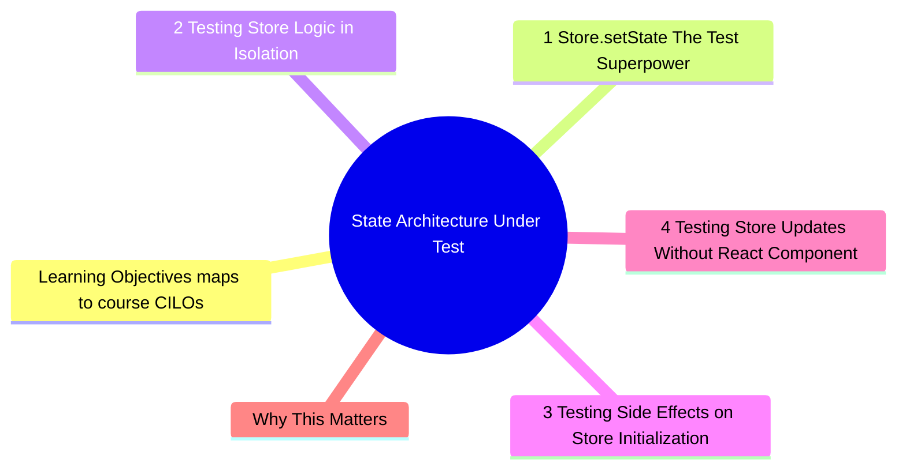

# Module 6: State Architecture Under Test

Est. study time: 2h
Language: en
Description: State management is the backbone of most React apps. How you structure state determines how testable and refactor-safe your components are. This module covers testing Zustand stores, the store.setState pattern, async initialization, and designing state for testability.



## Learning Objectives (maps to course CILOs)
- Test Zustand stores with and without React components
- Use store.setState to prepare test data without mocking modules
- Test async store initialization and side effects
- Design store boundaries that survive refactoring

---

## Core Content

### 6.1 Store.setState: The Test Superpower

Zustand's `setState` is accessible from tests directly. No mocking needed:

```tsx
// store.ts
interface UserState {
  user: User | null
  isLoading: boolean
  fetchUser: (id: string) => Promise<void>
}

export const useUserStore = create<UserState>((set) => ({
  user: null,
  isLoading: false,
  fetchUser: async (id) => {
    set({ isLoading: true })
    const res = await fetch(`/api/users/${id}`)
    const user = await res.json()
    set({ user, isLoading: false })
  },
}))

// test — no mock needed
test('renders user name from store', () => {
  useUserStore.setState({ user: { name: 'John', email: 'john@test.com' } })
  render(<UserProfile />)
  expect(screen.getByText(/john/i)).toBeInTheDocument()
})
```

This is the key insight: **set state before render, test behavior after render.** No mocking of `fetch`, no `jest.mock` of the store file.

> **Think**: Why is `store.setState` better than mocking the store module?
>
> *Answer: Module mocking replaces the entire store implementation. If the store logic changes (add derived state, rename selectors), the mock must update. `setState` sets raw data — the component reads it through the actual store implementation. Tests exercise real store logic.*

### 6.2 Testing Store Logic in Isolation

Sometimes you want to test store actions without a component:

```tsx
test('fetchUser updates state correctly', async () => {
  server.use(
    http.get('/api/users/1', () => HttpResponse.json({ name: 'John' }))
  )

  const initialState = useUserStore.getState()
  expect(initialState.user).toBeNull()

  await useUserStore.getState().fetchUser('1')

  const updatedState = useUserStore.getState()
  expect(updatedState.user).toEqual({ name: 'John' })
  expect(updatedState.isLoading).toBe(false)
})
```

This tests the state machine without rendering any component. Faster, more focused.

### 6.3 Testing Side Effects on Store Initialization

Many stores run async initialization:

```tsx
// store with async init
export const useAppStore = create<AppState>((set) => ({
  isInitialized: false,
  theme: 'light',
  initialize: async () => {
    const theme = await loadSavedTheme()
    set({ theme, isInitialized: true })
  },
}))

// Initialize in app root
function App() {
  const initialize = useAppStore(s => s.initialize)
  useEffect(() => { initialize() }, [])
  // ...
}
```

Test:

```tsx
test('initializes theme from saved preference', async () => {
  server.use(
    http.get('/api/theme', () => HttpResponse.json('dark'))
  )

  render(<App />)
  await waitFor(() => {
    expect(useAppStore.getState().isInitialized).toBe(true)
  })
  expect(useAppStore.getState().theme).toBe('dark')
})
```

> **Think**: What if the initialization depends on user authentication state? How do you test the interaction between two stores?
>
> *Answer: Set both stores' state before render. `useAuthStore.setState({ user: testUser })`, then render. The init store reads auth state from the store that is already populated. This is simpler than trying to orchestrate async init order.*

### 6.4 Testing Store Updates Without React Component

For stores that have side effects outside React (analytics, logging, localStorage sync):

```tsx
// store with subscription
export const useCartStore = create<CartState>((set, get) => ({
  items: [],
  addItem: (item) => {
    set((state) => ({ items: [...state.items, item] }))
    persistCart(get().items) // side effect: save to localStorage
  },
}))

test('persists cart to localStorage on add', () => {
  const setItemSpy = jest.spyOn(Storage.prototype, 'setItem')

  useCartStore.getState().addItem({ id: '1', name: 'Widget' })

  expect(setItemSpy).toHaveBeenCalledWith(
    'cart',
    expect.stringContaining('Widget')
  )
})
```

No component needed. The store action is a self-contained unit.

> **Think**: When would you test store actions without a component vs with a component?
>
> *Answer: Without component: store logic only (computed values, side effects, async flows). With component: integration of store data with rendering. If the store action is complex (multi-step async, conditions), test it solo. If the action is simple (set a value), test it through the component.*

### 6.5 Resetting Store Between Tests

Stores hold mutable state. Tests must reset between runs:

```tsx
afterEach(() => {
  useUserStore.setState(useUserStore.getInitialState())
  useCartStore.setState(useCartStore.getInitialState())
  useAuthStore.setState(useAuthStore.getInitialState())
})
```

Or with a utility:

```tsx
// test-utils.ts
export function resetAllStores() {
  useUserStore.setState(useUserStore.getInitialState())
  useCartStore.setState(useCartStore.getInitialState())
  useAuthStore.setState(useAuthStore.getInitialState())
}
```

Missing reset = flaky tests (order-dependent failures).

### 6.6 Store Boundaries for Refactor Safety

How to organize stores so changing one does not break tests for another:

| Store           | Contains               | Tests                            |
| --------------- | ---------------------- | -------------------------------- |
| `useUserStore`  | User data, auth status | User component tests             |
| `useCartStore`  | Cart items, totals     | Cart component tests             |
| `useThemeStore` | Theme, layout prefs    | All components (via TestWrapper) |

Boundary rule: **A component test should only set state for stores that component reads.** If `UserProfile` reads from `useUserStore` but not `useCartStore`, the test should not touch `useCartStore`.

```tsx
// Good — only sets stores the component actually uses
test('user profile renders name', () => {
  useUserStore.setState({ user: { name: 'John' } })
  render(<UserProfile />)
  expect(screen.getByText(/john/i)).toBeInTheDocument()
})

// Bad — sets unrelated stores, creates hidden dependencies
test('user profile renders name', () => {
  useUserStore.setState({ user: { name: 'John' } })
  useCartStore.setState({ items: [] }) // irrelevant to this test
  useThemeStore.setState({ theme: 'light' }) // irrelevant
  render(<UserProfile />)
  // ...
})
```

### 6.7 Multi-Paradigm State Testing

Real apps mix state paradigms. Testing strategy must adapt:

| Paradigm                       | Test approach                    | Setup pattern                                                           |
| ------------------------------ | -------------------------------- | ----------------------------------------------------------------------- |
| **Zustand/Jotai**              | `setState` before render         | `useStore.setState({ key: value })`                                     |
| **React Context**              | Provide wrapper with test values | `<MyContext.Provider value={testValue}>{children}</MyContext.Provider>` |
| **URL state (search params)**  | Set initial URL route            | `MemoryRouter` with `initialEntries`                                    |
| **Server state (React Query)** | MSW handlers + QueryClient       | `QueryClientProvider` with `new QueryClient()`                          |
| **localStorage/IndexedDB**     | Mock or fake implementation      | `jest.spyOn(Storage.prototype, 'getItem')`                              |

**Context + Store mixing**:

```tsx
// Component reads from both context and zustand store
function ThemeAwareProfile() {
  const theme = useContext(ThemeContext)    // context
  const user = useUserStore(s => s.user)    // zustand
  return <div className={theme}>{user?.name}</div>
}

test('renders with dark theme', () => {
  useUserStore.setState({ user: { name: 'John' } })
  render(
    <ThemeContext.Provider value="dark">
      <ThemeAwareProfile />
    </ThemeContext.Provider>
  )
  expect(screen.getByText(/john/i)).toBeInTheDocument()
})
```

**Server state + client state mixing**:

```tsx
// Component uses React Query for data, zustand for UI state
function ProductPage({ id }) {
  const { data, isLoading } = useQuery(['product', id], () =>
    fetch(`/api/products/${id}`).then(r => r.json())
  )
  const addToCart = useCartStore(s => s.addItem)

  if (isLoading) return <Spinner />
  return (
    <div>
      <h1>{data.name}</h1>
      <button onClick={() => addToCart(data)}>Add to Cart</button>
    </div>
  )
}

test('adds product to cart from server data', async () => {
  server.use(
    http.get('/api/products/1', () => HttpResponse.json({ id: 1, name: 'Widget' }))
  )
  useCartStore.setState({ items: [] })

  render(
    <QueryClientProvider client={new QueryClient()}>
      <MemoryRouter>
        <ProductPage id="1" />
      </MemoryRouter>
    </QueryClientProvider>
  )

  await userEvent.click(await screen.findByRole('button', { name: /add to cart/i }))
  expect(useCartStore.getState().items).toHaveLength(1)
})
```

> **Think**: Your component reads from React Query (server state) and URL search params (URL state). What test wrappers do you need?
>
> *Answer: `QueryClientProvider` for React Query and `MemoryRouter` with `initialEntries` for URL state. Set initial URL via `initialEntries={['/products?sort=price']}`. The component reads `useSearchParams()` and gets the expected value.*

Key principle: **each paradigm has exactly one boundary**. Set state at that boundary:
- Zustand → `setState`
- Context → `Provider`
- URL → `MemoryRouter`
- Server → MSW + `QueryClient`

Do not pierce the boundary to set state from a different paradigm.

---

## Why This Matters

Zustand's design makes test setup trivial. No mocking, no provider wrapping — just `setState` before render. This is the ideal state management pattern for testability.

But real apps mix paradigms. Testing each paradigm at its natural boundary — without crossing — keeps tests maintainable as state architecture evolves.

The advanced insight: the store boundary is a testing boundary. Well-structured stores make tests simple. Stores that mix concerns (user data + cart data + theme in one store) make tests complex and coupled.

---

## Common Questions

**Q: Does this work with other state managers (Redux, Jotai, Recoil)?**
A: Similar patterns exist. Redux: `store.dispatch()` + `store.getState()`. Jotai: `store.set()`. The principle is the same: set state directly in tests rather than orchestrating UI interactions to reach the desired state.

**Q: What if the store uses middleware (persist, devtools)?**
A: In tests, disable persist middleware. It is an implementation detail that adds complexity to tests without value.

```tsx
const useStore = create(
  persist(
    (set) => ({ ... }),
    { name: 'store', skipHydration: true } // skip hydration in tests
  )
)
```

**Q: What about selectors that derive data (computed values)?**
A: Test selectors separately:

```tsx
// selector
export const cartTotal = (state: CartState) =>
  state.items.reduce((sum, item) => sum + item.price * item.qty, 0)

// test
test('computes cart total', () => {
  useCartStore.setState({
    items: [{ price: 10, qty: 2 }, { price: 5, qty: 1 }]
  })
  expect(cartTotal(useCartStore.getState())).toBe(25)
})
```

---

## Examples

### Example 1: Full store + component integration test

```tsx
test('adds item to cart via button click', async () => {
  useUserStore.setState({ user: { id: '1' } })
  useCartStore.setState({ items: [] })

  render(<ProductPage productId="p1" />)

  await userEvent.click(screen.getByRole('button', { name: /add to cart/i }))

  const cart = useCartStore.getState()
  expect(cart.items).toHaveLength(1)
  expect(cart.items[0].productId).toBe('p1')
  expect(screen.getByText(/cart: 1 item/i)).toBeInTheDocument()
})
```

### Example 2: Reset utility pattern

```tsx
// stores/index.ts
export const stores = [useUserStore, useCartStore, useThemeStore] as const
export const initialStates = stores.map(s => s.getInitialState())

// test-utils.ts
export function resetStores() {
  stores.forEach((store, i) => store.setState(initialStates[i]))
}

// jest.setup.ts
afterEach(() => resetStores())
```

---

> **Predict**: Before reading deeper: what do you expect happens when setstate interacts with fetch in state architecture under test?
>
> *Answer: The system relies on setstate to keep fetch predictable — when both apply, the stricter rule wins.*
> **Spot the Mistake**: A developer treats setstate as optional because "it works without it." Where is the mistake?
>
> *Answer: It works only until the assumptions behind setstate are violated. The fix: treat it as part of the contract of state architecture under test, not an optimization.*


## Key Takeaways

- store.setState() is the most powerful test utility for state-dependent components
- Set state before render, test behavior after render
- Test store actions independently (no component needed)
- Reset store state between tests to prevent flakiness
- Store boundaries should match component boundaries
- Test selectors/derived state separately from rendering
- Disable persist middleware in tests

---

## Common Misconception

"Testing stores requires mocking the store module." This is a legacy pattern from Redux + connect. Zustand's direct `setState` access makes mocking unnecessary. Interacting with the real store is simpler, faster, and more robust than replacing the store with a mock.

---

## Feynman Explain

Explain store.setState to a junior dev: "Think of the store as a shared whiteboard. In production, components write on the whiteboard through actions. In tests, you can write directly on the whiteboard before the component reads it. Then you check if the component reacts correctly. Direct access is faster and more reliable than simulating the actions that lead to that state."

---

## Reframe

(Judge the "no mocking stores" approach. When would you need to mock a store? Consider stores that integrate with third-party SDKs, stores with complex timers, stores that depend on browser APIs unavailable in jsdom.)

---

## Drill

Take the quiz.

Run: `learn.sh quiz advanced-react-testing 6`
