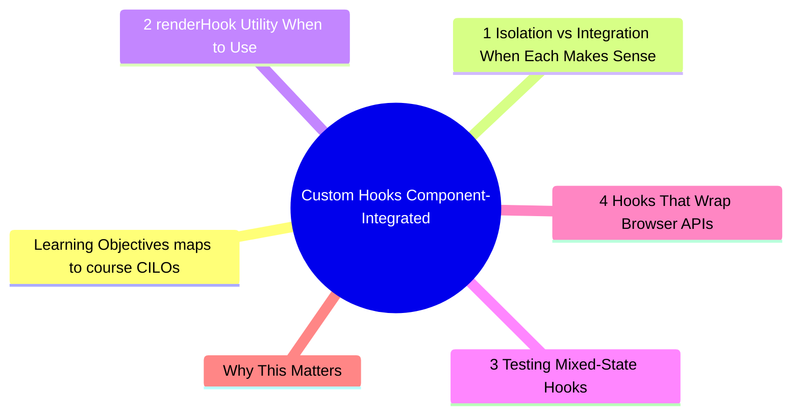
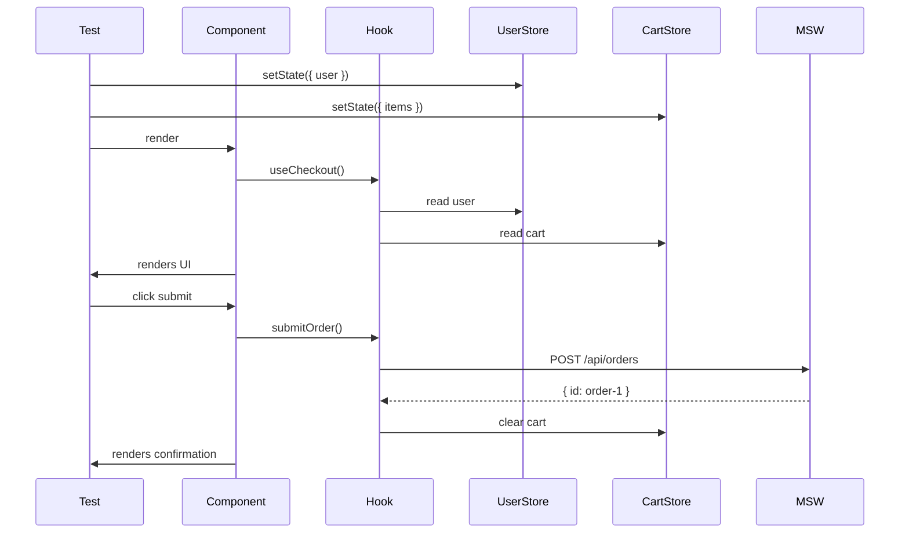

# Module 7: Custom Hooks: Component-Integrated

Est. study time: 2h
Language: en
Description: Custom hooks that manage complex state, async data, and external dependencies should be tested through their consumers (components), not in isolation. This module covers when to test hooks solo, when to test through components, and how to detect coupling problems via test friction.



## Learning Objectives (maps to course CILOs)
- Distinguish hooks that benefit from isolation testing vs component-integrated testing
- Design hooks that are testable through their API (return values + callbacks)
- Detect architectural coupling via hook test friction
- Test hooks with multiple stores, external dependencies, and state transitions

---

## Core Content

### 7.1 Isolation vs Integration: When Each Makes Sense

The user's insight from M12: "I even not sure if we should test it by unit tests (personally I wont), instead I will test it with related components."

This intuition is correct for most hooks:

| Hook type                       | Isolation test? | Why                                        |
| ------------------------------- | --------------- | ------------------------------------------ |
| Pure computation                | Yes             | No dependencies, testing composition logic |
| Simple state (useState wrapper) | No              | Trivial — test through component           |
| Async data fetching             | No              | Test through component + MSW               |
| Multi-store orchestration       | No              | Value is in integration, not isolation     |
| Browser API wrapper             | Sometimes       | If extraction of pure logic is possible    |

**Pure hooks worth testing in isolation**:

```tsx
// Worth isolating — pure computation
function useDiscount(price: number, code: string) {
  const discount = DISCOUNT_CODES[code] || 0
  return { total: price * (1 - discount), code, discount }
}

test('applies discount code', () => {
  const { result } = renderHook(() => useDiscount(100, 'SAVE10'))
  expect(result.current.total).toBe(90)
})
```

**Hooks better tested through components**:

```tsx
// Better through component — orchestrates fetching + store + navigation
function useUserProfile(userId: string) {
  const setUser = useUserStore(s => s.setUser)
  const navigate = useNavigate()

  return useQuery({
    queryKey: ['user', userId],
    queryFn: () => fetch(`/api/users/${userId}`).then(r => r.json()),
    onSuccess: (data) => {
      setUser(data)
      navigate('/profile')
    },
  })
}

// Test through component
test('fetches user and navigates on success', async () => {
  server.use(http.get('/api/users/1', () => HttpResponse.json(mockUser)))
  render(<UserPage userId="1" />)
  expect(await screen.findByText(/john/i)).toBeInTheDocument()
  expect(mockNavigate).toHaveBeenCalledWith('/profile')
})
```

> **Think**: The hook `useUserProfile` has 3 responsibilities (fetch, store update, navigation). If you test it in isolation, you must mock the store and the router. What does the setup complexity tell you?
>
> *Answer: The hook is doing too much. The test friction reveals the architectural problem. Extract: (1) a pure data-fetching hook, (2) a store update in the component, (3) navigation in the component. Each becomes simpler to test.*

### 7.2 renderHook Utility — When to Use

`renderHook` is useful when:

1. **Hook has no rendering side effects** (pure computation)
2. **Testing hook API contract** (return shape, type narrowing)
3. **Testing callback behavior** (onSuccess, onError)

```tsx
function useCounter(initialValue = 0) {
  const [count, setCount] = useState(initialValue)
  const increment = useCallback(() => setCount(c => c + 1), [])
  const decrement = useCallback(() => setCount(c => c - 1), [])
  return { count, increment, decrement }
}

test('increments counter', () => {
  const { result } = renderHook(() => useCounter(0))
  act(() => result.current.increment())
  expect(result.current.count).toBe(1)
})
```

When NOT to use `renderHook`:
- Hook interacts with context providers (wrap component instead)
- Hook has side effects on external systems (test through component + MSW)
- Hook return value is only meaningful when rendered (DOM queries)

> **Think**: Your hook uses `useNavigate()` from React Router. How do you test it?
>
> *Answer: Two options: (1) wrap renderHook in MemoryRouter provider, (2) test through a component that uses the hook. Option 2 is simpler and more realistic — the hook's behavior is only meaningful in the context of a rendered page.*

### 7.3 Testing Mixed-State Hooks

Hooks that interact with multiple stores test atomicity and consistency:

```tsx
function useCheckout() {
  const cart = useCartStore(s => s.items)
  const user = useUserStore(s => s.user)
  const createOrder = useOrderStore(s => s.createOrder)

  const submitOrder = async () => {
    if (!user) throw new Error('Must be logged in')
    if (cart.length === 0) throw new Error('Cart is empty')
    return createOrder({ userId: user.id, items: cart })
  }

  return { submitOrder, itemCount: cart.length }
}
```

Test through component — multiple stores must be consistent:

```tsx
test('submits order with cart items', async () => {
  useUserStore.setState({ user: { id: '1' } })
  useCartStore.setState({ items: [mockItem] })
  server.use(
    http.post('/api/orders', () => HttpResponse.json({ id: 'order-1' }))
  )

  render(<CheckoutPage />)
  await userEvent.click(screen.getByRole('button', { name: /place order/i }))
  expect(await screen.findByText(/order confirmed/i)).toBeInTheDocument()
})

test('blocks checkout when cart is empty', async () => {
  useUserStore.setState({ user: { id: '1' } })
  useCartStore.setState({ items: [] })

  render(<CheckoutPage />)
  expect(screen.getByRole('button', { name: /place order/i })).toBeDisabled()
})
```

> **Think**: What if the order submission updates the cart store (clears cart after success)? How do you verify post-submission state?
>
> *Answer: Check both the rendered output (cart shows empty) and the store state directly (`expect(useCartStore.getState().items).toHaveLength(0)`). The component test covers rendering; the store assertion covers the side effect.*



### 7.4 Hooks That Wrap Browser APIs

Hooks that wrap localStorage, navigator, or other browser APIs:

```tsx
function useOnlineStatus() {
  const [isOnline, setIsOnline] = useState(navigator.onLine)
  useEffect(() => {
    const online = () => setIsOnline(true)
    const offline = () => setIsOnline(false)
    window.addEventListener('online', online)
    window.addEventListener('offline', offline)
    return () => {
      window.removeEventListener('online', online)
      window.removeEventListener('offline', offline)
    }
  }, [])
  return isOnline
}
```

Test approach: extract the API dependency, test through component:

```tsx
test('shows offline message when browser goes offline', () => {
  render(<NetworkStatus />)
  expect(screen.getByText(/online/i)).toBeInTheDocument()

  window.dispatchEvent(new Event('offline'))
  expect(screen.getByText(/offline/i)).toBeInTheDocument()
})

test('shows online message when browser comes back online', () => {
  window.dispatchEvent(new Event('offline'))
  render(<NetworkStatus />)
  expect(screen.getByText(/offline/i)).toBeInTheDocument()

  window.dispatchEvent(new Event('online'))
  expect(screen.getByText(/online/i)).toBeInTheDocument()
})
```

> **Think**: What if the browser API is not available in jsdom? How do you test a hook using `navigator.mediaDevices`?
>
> *Answer: (1) Polyfill the API in test setup. (2) Extract the API access into a dependency and inject it. (3) Use Playwright (real browser) for these tests. Option 2 is cleanest for unit tests; option 3 for comprehensive tests.*

### 7.5 Detecting Hook Overuse via Test Friction

This is the advanced skill: use test difficulty to detect architectural problems.

| Test friction                | Likely cause                                     |
| ---------------------------- | ------------------------------------------------ |
| Need 3+ providers to render  | Hook depends on too many contexts                |
| Need 4+ mocks for renderHook | Hook orchestrates too many services              |
| Setup takes 20+ lines        | Component/hook has too many responsibilities     |
| Can only test through E2E    | Hook is tightly coupled to browser-specific APIs |

When you feel friction testing a hook, do not add more setup — refactor the hook.

```tsx
// Before — hooks that grow in scope over time
function useDashboard() {
  const user = useUser()
  const orders = useOrders()
  const notifications = useNotifications()
  const preferences = usePreferences()
  const analytics = useAnalytics()
  // ... 5 responsibilities, 5 dependencies
}

// After — component coordinates smaller hooks
function Dashboard() {
  return (
    <div>
      <UserSummary />
      <OrderHistory />
      <NotificationList />
      <PreferencesPanel />
    </div>
  )
}
// Each sub-component tests independently with 0-1 dependencies
```

---

## Why This Matters

Custom hooks are where most architectural coupling lives. A hook that grows to orchestrate 3 stores, 2 API calls, and navigation is a sign that business logic is not properly separated.

The advanced insight: test friction is not a testing problem — it is an architecture problem. When testing a hook is hard, refactor the hook.

---

## Common Questions

**Q: Should I ever test a hook in complete isolation (no components, no stores)?**
A: Yes, for hooks that are pure computations. `useDiscount`, `usePagination`, `useDebounce` — functions that take values and return values. These benefit from isolation testing. Hooks with side effects are better tested through components.

**Q: What about renderHook with wrapper option?**
A: Use sparingly. If you need 3+ wrapper providers for renderHook, test through a component instead. The component will need the same providers, and the test will be more realistic.

**Q: How do I test hooks that use setTimeout/setInterval?**
A: Use jest.useFakeTimers(). Call `jest.advanceTimersByTime()` in act(). Better yet, test through a component that uses the hook — the component test handles async/timers the same way.

```tsx
jest.useFakeTimers()
test('debounce delays callback', () => {
  const fn = jest.fn()
  renderHook(() => useDebounce('search term', 300, fn))
  expect(fn).not.toHaveBeenCalled()
  act(() => jest.advanceTimersByTime(300))
  expect(fn).toHaveBeenCalledWith('search term')
})
```

---

## Examples

### Example 1: Refactoring a hard-to-test hook

Before: `useOrderFlow` manages user data, cart, API calls, navigation, and error handling. Test requires 4 mocks + 3 providers.

After: Split into `useCart` (store access), `useSubmitOrder` (API + error handling), `useOrderNavigation` (router).

Each sub-hook tests in 5-10 lines. The component integrates them with testable coordination logic.

### Example 2: Atomicity test

```tsx
test('order creation clears cart and shows confirmation', async () => {
  useUserStore.setState({ user: { id: '1' } })
  useCartStore.setState({ items: [mockItem] })
  server.use(
    http.post('/api/orders', () => HttpResponse.json({ id: 'ord-1' }))
  )

  const { user } = render(<Checkout />)
  await user.click(screen.getByRole('button', { name: /pay/i }))

  // Both conditions must be true — atomicity
  expect(await screen.findByText(/success/i)).toBeInTheDocument()
  expect(useCartStore.getState().items).toHaveLength(0)
  expect(useOrderStore.getState().lastOrderId).toBe('ord-1')
})
```

---

> **Predict**: Commit to an answer: does custom hooks: component-integrated get simpler or harder once useuserprofile enters the picture?
>
> *Answer: Harder locally, simpler globally: individual pieces carry more rules, but the overall system needs fewer special cases.*
> **Cloze**: {blank} governs how custom hooks: component-integrated behaves when multiple renderhook concerns collide.
> **Cloze**: The rule that keeps useuserprofile correct under load is called {blank}.
> **Cloze**: In custom hooks: component-integrated, usenavigate() determines {blank}.
> **Spot the Mistake**: Code review note: someone applies renderhook everywhere "to be safe" in a custom hooks: component-integrated codebase. Spot the mistake.
>
> *Answer: Blanket application hides which spots actually need renderhook. Apply it where the semantics demand it, and document why.*


## Key Takeaways

- Most hooks are better tested through components, not isolation
- renderHook is for pure computation hooks with no side effects
- Test friction = architecture problem. Refactor the hook, not the test
- Multi-store hooks test atomicity: all stores consistent before and after action
- Browser API hooks: dispatch events directly in tests
- Setup complexity > 20 lines = extract responsibilities
- Component-integrated testing reveals coupling that isolation hides

---

## Common Misconception

"renderHook is the default way to test hooks." This leads to complex setup with mock providers for every context the hook needs. Testing through a component that uses the hook is simpler, more realistic, and catches integration bugs that isolation tests miss.

---

## Feynman Explain

Explain component-integrated testing to a developer who only uses renderHook. Use analogy: "Testing a car engine in isolation tells you if it runs. Testing it inside the car tells you if the car moves. Both matter, but nobody drives an engine alone. Hooks exist to be used in components. Test them where they live."

---

## Reframe

(Judge the "test through component" bias. When would isolation testing of a complex hook be more valuable than component testing? Consider hooks that emit events (callbacks), hooks with complex state machines, hooks consumed by multiple components.)

---

## Drill

Take the quiz.

Run: `learn.sh quiz advanced-react-testing 7`
