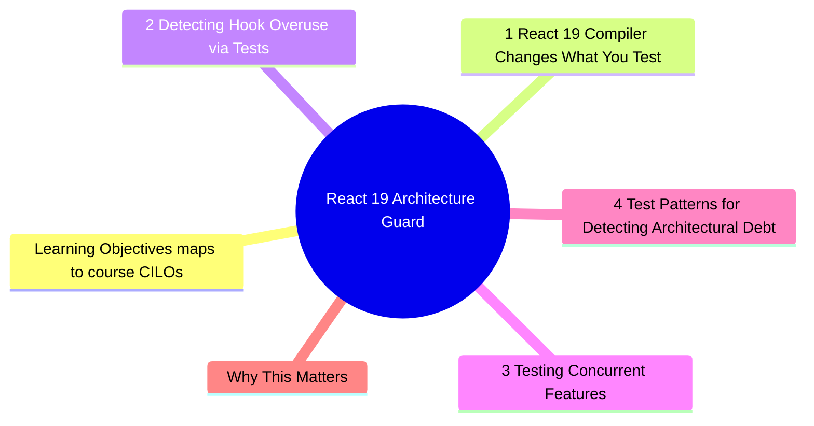
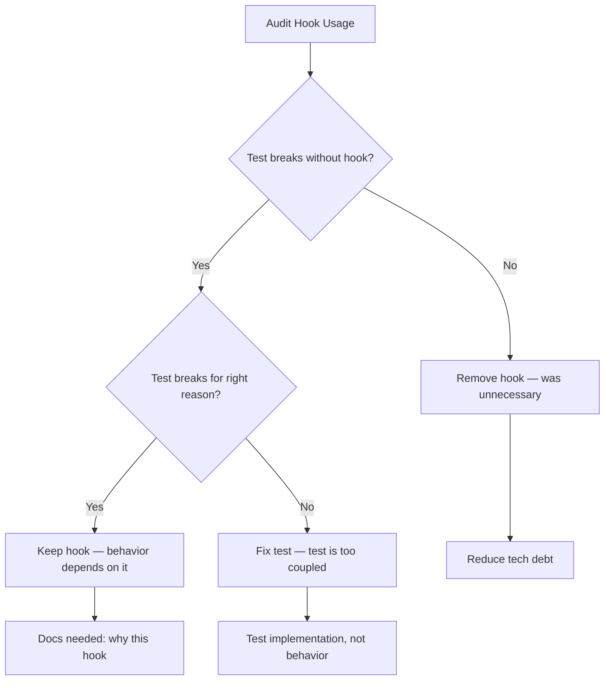

# Module 8: React 19: Architecture Guard

Est. study time: 2.5h
Language: en
Description: React 19's compiler changes the rules for useMemo, useCallback, and memo. Tests should detect overuse of these APIs and verify compiler-friendly patterns. This module covers testing strategies that enforce good architecture and catch premature optimization.



## Learning Objectives (maps to course CILOs)
- Detect useMemo/useCallback overuse via test assertions
- Write tests that survive React 19 compiler optimizations
- Identify architectural debt signaled by excessive memoization
- Test concurrent features (useTransition, useOptimistic, useActionState)

---

## Core Content

### 8.1 React 19 Compiler Changes What You Test

The React 19 compiler automatically memoizes values and components. This means:

- `useMemo` and `useCallback` become **documentation** (communicate intent), not **optimization** (compiler handles this)
- `React.memo` wrapping is often unnecessary — compiler deduplicates renders
- Tests that assert on memoization behavior (`toHaveBeenCalledTimes`) become fragile

```tsx
// React 18 — manual memoization needed
const UserCard = React.memo(function UserCard({ user }) {
  return <div>{user.name}</div>
})

// React 19 — compiler optimizes automatically
function UserCard({ user }) {
  return <div>{user.name}</div>
}
```

**What this means for tests**: Stop testing memoization behavior. Test rendering output.

```tsx
// Brittle — tests memo implementation
test('does not re-render when props unchanged', () => {
  const { rerender } = render(<UserCard user={user} />)
  rerender(<UserCard user={user} />)
  // This breaks with React 19 compiler
})

// Resilient — tests behavior
test('renders user name', () => {
  render(<UserCard user={user} />)
  expect(screen.getByText(/john/i)).toBeInTheDocument()
})
```

> **Think**: Your team uses React.memo on every component "just in case." React 19 compiler ships — now all the memo wrappers are redundant code. How many components to update? How many tests break?
>
> *Answer: Every memo-wrapped component (possibly 50+). Tests that assert re-render behavior break. This is exactly why memoization is an implementation detail that tests should not touch.*

### 8.2 Detecting Hook Overuse via Tests

Tests can detect when hooks are misused. Three patterns:

**Pattern 1: useEffect with missing dependencies**

```tsx
function UserProfile({ userId }) {
  const [user, setUser] = useState(null)
  useEffect(() => {
    fetch(`/api/users/${userId}`).then(setUser)
  }, []) // missing userId dependency — BUG
  return <div>{user?.name}</div>
}
```

Test catches it:

```tsx
test('refetches when userId changes', async () => {
  const { rerender } = render(<UserProfile userId="1" />)
  expect(await screen.findByText(/john/i)).toBeInTheDocument()

  server.use(http.get('/api/users/2', () => HttpResponse.json({ name: 'Jane' })))
  rerender(<UserProfile userId="2" />)

  expect(await screen.findByText(/jane/i)).toBeInTheDocument()
  // If the test fails (still shows John), useEffect is missing userId dependency
})
```

**Pattern 2: Unnecessary useCallback**

```tsx
function ProductList({ onSelect }) {
  // Every re-render creates new function — useCallback adds complexity with no benefit
  const handleClick = useCallback((id) => {
    onSelect(id)
  }, [onSelect])

  return <List items={items} onClick={handleClick} />
}
```

Signal: if removing `useCallback` does not change tests, it was unnecessary.

```tsx
// Test that would expose unnecessary useCallback
test('handles selection click', async () => {
  const onSelect = jest.fn()
  render(<ProductList onSelect={onSelect} />)
  await userEvent.click(screen.getByRole('button', { name: /item-1/i }))
  expect(onSelect).toHaveBeenCalledWith('1')
})
// This test passes whether useCallback is present or removed
```

**Pattern 3: useState when derived value works**

```tsx
function OrderSummary({ items }) {
  const [total, setTotal] = useState(0)
  useEffect(() => {
    setTotal(items.reduce((s, i) => s + i.price, 0))
  }, [items]) // state derived from props — should be derived, not stored
  return <div>Total: {total}</div>
}
```

Test reveals the pattern:

```tsx
test('shows total', () => {
  render(<OrderSummary items={[{ price: 10 }, { price: 20 }]} />)
  expect(screen.getByText(/total: 30/i)).toBeInTheDocument()
})
// This test works, but the pattern is wrong.
// Better: `const total = items.reduce(...)` — no state, no effect needed
```

> **Think**: You audit your codebase and find 40 useCallbacks, 30 useMemos, and 25 useEffects. Which of these are probably overuse?
>
> *Answer: Many useCallbacks/usememos are unnecessary with React 19 compiler. Many useEffects exist because state is derived from props. A good test suite helps prove which are removable: if removing the hook does not break tests, it was overuse.*



### 8.3 Testing Concurrent Features

React 19 introduces new hooks. Test them through user interaction:

**useTransition** — mark state update as non-urgent:

```tsx
function SearchPage() {
  const [query, setQuery] = useState('')
  const [isPending, startTransition] = useTransition()

  return (
    <div>
      <input onChange={(e) => startTransition(() => setQuery(e.target.value))} />
      {isPending && <Spinner />}
      <SearchResults query={query} />
    </div>
  )
}

test('shows spinner during search transition', async () => {
  render(<SearchPage />)
  await userEvent.type(screen.getByRole('textbox'), 'hello')
  expect(screen.getByRole('status')).toBeInTheDocument() // spinner
})
```

**useOptimistic** — optimistic UI updates:

```tsx
function MessageThread() {
  const [messages, addMessage] = useOptimisticState(
    initialMessages,
    (state, newMsg) => [...state, newMsg]
  )

  const submit = async (text) => {
    addMessage({ text, status: 'sending' })
    await sendMessage(text)
  }

  return <div>{messages.map(m => <Message key={m.id} data={m} />)}</div>
}

test('shows optimistic message immediately', async () => {
  server.use(http.post('/api/messages', () => HttpResponse.json({ id: 'new' })))
  render(<MessageThread />)
  await userEvent.type(screen.getByRole('textbox'), 'Hello{Enter}')
  expect(screen.getByText(/hello/i)).toBeInTheDocument() // appears before API resolves
})
```

**useActionState** — form actions with loading state:

```tsx
function LoginForm() {
  const [state, formAction, isPending] = useActionState(
    async (prevState, formData) => {
      const res = await login(formData)
      if (res.error) return { error: res.error }
      return { success: true }
    },
    { error: null }
  )

  return (
    <form action={formAction}>
      <input name="email" />
      {state.error && <p role="alert">{state.error}</p>}
      <button disabled={isPending}>Login</button>
    </form>
  )
}
```

### 8.4 Test Patterns for Detecting Architectural Debt

Use tests as an architectural audit tool:

| Test detects                                   | What it reveals                  |
| ---------------------------------------------- | -------------------------------- |
| `useEffect` test fails when deps change        | Missing dependency in deps array |
| Removing `useCallback` does not break tests    | Unnecessary memoization          |
| Component re-renders 10x on simple interaction | Missing key prop, unstable refs  |
| Store action call produces stale state         | Closure over old closure value   |
| Component needs 5+ hooks for simple feature    | Hook decomposition needed        |

```tsx
// Test that reveals unnecessary re-renders
test('does not re-render entire list on single item change', () => {
  const renderSpy = jest.fn()
  function TrackedItem({ item }) {
    renderSpy(item.id)
    return <li>{item.name}</li>
  }

  const { rerender } = render(<List items={items} ItemComponent={TrackedItem} />)
  rerender(<List items={updatedItems} ItemComponent={TrackedItem} />)
  // If all items re-render instead of just the changed one — missing keys or unstable references
})
```

### 8.5 ErrorBoundary Testing in React 19

React 19 changes ErrorBoundary behavior. The `componentDidCatch` API is stable, but error propagation and recovery patterns differ.

**Basic ErrorBoundary test**:

```tsx
function BrokenComponent() {
  throw new Error('Boom!')
}

test('ErrorBoundary catches rendering errors', () => {
  // Suppress console.error — React logs caught errors by default
  jest.spyOn(console, 'error').mockImplementation(() => {})

  render(
    <ErrorBoundary fallback={<ErrorUI />}>
      <BrokenComponent />
    </ErrorBoundary>
  )

  expect(screen.getByText(/something went wrong/i)).toBeInTheDocument()
  expect(console.error).toHaveBeenCalled() // React did log the error
})
```

Key detail: `console.error` suppression is required. Without it, test output is polluted with React's error logging. Always restore after:

```tsx
afterEach(() => {
  jest.restoreAllMocks()
})
```

**Testing error recovery**:

```tsx
test('ErrorBoundary recovers after retry', () => {
  jest.spyOn(console, 'error').mockImplementation(() => {})
  const { rerender } = render(
    <ErrorBoundary fallback={<ErrorUI />}>
      <BrokenComponent />
    </ErrorBoundary>
  )

  // Error state shown
  expect(screen.getByText(/something went wrong/i)).toBeInTheDocument()

  // After fix, component recovers
  rerender(
    <ErrorBoundary fallback={<ErrorUI />}>
      <WorkingComponent />
    </ErrorBoundary>
  )

  expect(screen.getByText(/working/i)).toBeInTheDocument()
})
```

**React 19 specific: error boundaries for async errors**:

React 19 improves how error boundaries catch async rendering errors. Test pattern:

```tsx
function AsyncBroken() {
  const [error, setError] = useState(false)
  useEffect(() => {
    setError(true) // triggers re-render with throw
  }, [])
  if (error) throw new Error('Async error')
  return null
}

test('ErrorBoundary catches errors from async renders', async () => {
  jest.spyOn(console, 'error').mockImplementation(() => {})

  render(
    <ErrorBoundary fallback={<ErrorUI />}>
      <AsyncBroken />
    </ErrorBoundary>
  )

  expect(await screen.findByText(/something went wrong/i)).toBeInTheDocument()
})
```

> **Think**: Why does ErrorBoundary testing require suppressing console.error? Is there a cleaner pattern?
>
> *Answer: React logs all caught errors to console.error for debugging. Without suppression, the test output shows red stack traces even though the test passes. Pattern: wrap in a test helper that auto-suppresses and restores:*

```tsx
function renderWithErrorBoundary(ui: React.ReactElement) {
  jest.spyOn(console, 'error').mockImplementation(() => {})
  const result = render(
    <ErrorBoundary fallback={<ErrorUI />}>{ui}</ErrorBoundary>
  )
  return { ...result, consoleErrorSpy: console.error }
}
```

---

## Why This Matters

React 19 changes the optimization landscape. Patterns that were best practices in React 18 (manual memoization everywhere) become anti-patterns in React 19. Tests must adapt: stop verifying implementation details (is it memoized?) and start verifying behavior (does it render correctly?).

The advanced insight: tests are the safety net for removing unnecessary hooks. If tests pass before and after removing a useCallback, that useCallback was waste. Use tests to prove it.

---

## Common Questions

**Q: Should I still use useMemo in React 19?**
A: For performance optimization? No — the compiler handles this. For referential stability (avoiding infinite effect loops)? Rarely — the compiler handles most cases. Use useMemo only when the computation is genuinely expensive and the compiler cannot infer stability.

**Q: How do I test that the React 19 compiler is working?**
A: You do not. The compiler is a build-time tool. Tests verify runtime behavior. If the component renders correctly, the compiler is doing its job.

**Q: What about migrating from React 18 to 19 — should I remove all memo/callback now?**
A: Remove the ones where tests prove they are unnecessary. Keep controversial ones until migration is complete. Use the patterns in this module to identify safe removals.

---

## Examples

### Example 1: Proving useCallback is unnecessary

```tsx
// Component with useCallback
function Profile({ id }) {
  const handleClick = useCallback(() => {
    navigate(`/profile/${id}`)
  }, [id, navigate])
  return <button onClick={handleClick}>View</button>
}

// Remove useCallback, run tests. If they pass, remove permanently.
function Profile({ id }) {
  const handleClick = () => navigate(`/profile/${id}`)
  return <button onClick={handleClick}>View</button>
}

test('navigates to profile on click', async () => {
  render(<Profile id="1" />)
  await userEvent.click(screen.getByRole('button'))
  expect(mockNavigate).toHaveBeenCalledWith('/profile/1')
})
// Passes with or without useCallback
```

### Example 2: Catching useEffect dependency bug

```tsx
test('updates user data when userId changes', async () => {
  const { rerender } = render(<UserDashboard userId="1" />)
  expect(await screen.findByText(/user-1-data/i)).toBeInTheDocument()

  server.use(http.get('/api/users/2', () => HttpResponse.json(mockUser2)))
  rerender(<UserDashboard userId="2" />)

  // Fails if useEffect does not depend on userId
  expect(await screen.findByText(/user-2-data/i)).toBeInTheDocument()
})
```

---

> **Predict**: Before reading deeper: what do you expect happens when usememo interacts with usecallback in react 19: architecture guard?
>
> *Answer: The system relies on usememo to keep usecallback predictable — when both apply, the stricter rule wins.*
> **Cloze**: {blank} governs how react 19: architecture guard behaves when multiple usecallback concerns collide.
> **Cloze**: The rule that keeps usememo correct under load is called {blank}.
> **Cloze**: In react 19: architecture guard, react.memo determines {blank}.
> **Spot the Mistake**: A developer treats usememo as optional because "it works without it." Where is the mistake?
>
> *Answer: It works only until the assumptions behind usememo are violated. The fix: treat it as part of the contract of react 19: architecture guard, not an optimization.*


## Key Takeaways

- React 19 compiler makes useMemo/useCallback/memo mostly unnecessary
- Do not test memoization behavior — it is implementation detail
- Use tests to prove which hooks can be safely removed
- Test concurrent features through user interactions, not state assertions
- Remove hook → tests pass = hook was unnecessary
- useEffect with missing deps is detectable via test (rerender with new props)
- Derive values from props; do not store them in state

---

## Common Misconception

"useCallback and useMemo are always good for performance." In React 19, they add code complexity with zero benefit. The compiler handles memoization automatically. Use them only for referential stability in dependency arrays — and even that is rare with the compiler.

The real cost is not performance — it is that every useCallback adds a dependency array that can become stale.

---

## Feynman Explain

Explain unnecessary useCallback to a junior: "Imagine you write an instruction manual for making coffee. Then you make a copy of the manual every time someone wants coffee, just in case the original changed. That is useCallback — it says 'keep this function stable so nothing else re-runs.' React 19 now knows your manual does not change. You can stop making copies."

---

## Reframe

(Judge the "remove memo/callback aggressively" stance. What about library code consumed externally? What about components with expensive renders where the compiler cannot optimize? Write your evaluation.)

---

## Drill

Take the quiz.

Run: `learn.sh quiz advanced-react-testing 8`
