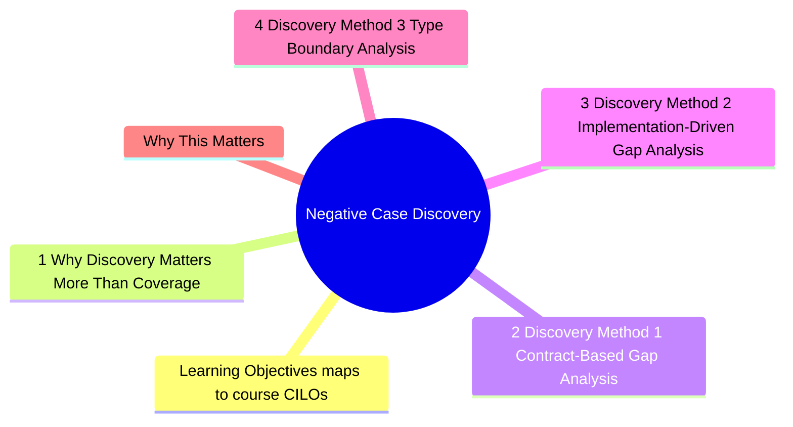
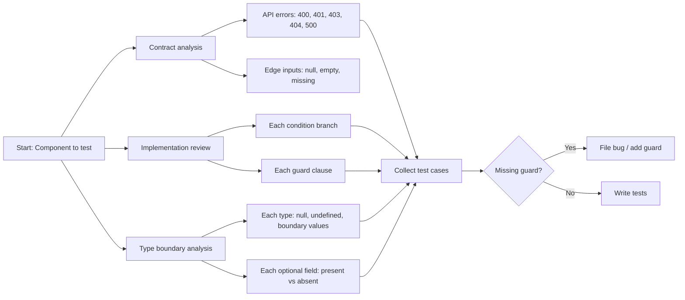

# Module 9: Negative Case Discovery

Est. study time: 2.5h
Language: en
Description: Most courses teach testing happy paths. Advanced testing is about finding what you did not think to test. This module covers systematic methods to discover missing negative cases, map error paths, and use gap analysis to drive implementation improvements.



## Learning Objectives (maps to course CILOs)
- Apply systematic gap analysis to discover untested error and edge cases
- Map error paths from API contracts to component behavior
- Use test discovery to identify missing implementation guards
- Organize negative test cases for maintainability and completeness

---

## Core Content

### 9.1 Why Discovery Matters More Than Coverage

Coverage tools tell you what code *executed*. They do not tell you what code *did not handle*.

```tsx
function processPayment(amount: number, currency: string) {
  if (amount <= 0) throw new Error('Invalid amount')
  if (!SUPPORTED_CURRENCIES.includes(currency)) throw new Error('Unsupported currency')
  // ... process payment
}
```

Coverage: 100%. Bugs found: 0. Missing guards:
- What if amount is NaN?
- What if currency is undefined?
- What if payment gateway times out?
- What if amount is 0.001 (below minimum)?

Coverage cannot find these. Systematic discovery methods can.

> **Think**: Your payment component has 100% line coverage. A bug ships where NaN amount bypasses the `amount <= 0` check (NaN <= 0 is false in JS). Why did coverage not catch this?
>
> *Answer: Coverage measures which lines executed, not which values were tested at boundaries. The `amount <= 0` branch executed with `amount = 10`, so coverage reported 100%. The NaN case is a different input that happens to follow the same code path but produces wrong behavior.*

### 9.2 Discovery Method 1: Contract-Based Gap Analysis

Every API contract implies negative cases. Start with the contract and derive tests:

```text
POST /api/orders
Request: { items: Item[], promoCode?: string }
Success: 200 { id: string, total: number }
Errors:  400 (validation), 401 (unauth), 404 (item not found), 500 (server error)
```

Each error code is a test case:

```tsx
test('shows validation error for empty items', async () => {
  server.use(
    http.post('/api/orders', () =>
      HttpResponse.json({ error: 'Cart is empty' }, { status: 400 })
    )
  )
  render(<Checkout />)
  await userEvent.click(screen.getByRole('button', { name: /submit/i }))
  expect(screen.getByText(/cart is empty/i)).toBeInTheDocument()
})

test('redirects to login on 401', async () => {
  server.use(
    http.post('/api/orders', () =>
      HttpResponse.json({ error: 'Unauthorized' }, { status: 401 })
    )
  )
  render(<Checkout />)
  await userEvent.click(screen.getByRole('button', { name: /submit/i }))
  expect(mockNavigate).toHaveBeenCalledWith('/login')
})
```

**Contract gap checklist**:

| Contract aspect | Negative cases to test                                |
| --------------- | ----------------------------------------------------- |
| Fields          | Missing, null, undefined, wrong type, empty, too long |
| Auth            | No token, expired token, wrong role, malformed token  |
| State machine   | Wrong state, concurrent transitions, rollback         |
| Pagination      | Page 0, negative page, page > max, sort field typo    |
| File upload     | No file, wrong type, too large, corrupt file          |

> **Think**: Your API docs say `GET /api/users/:id` returns `401` for unauthorized. You have a test for 401. But you do not have a test for `403` (forbidden — user is authenticated but lacks permission). How do you discover this gap?
>
> *Answer: Review the API contract systematically. The HTTP spec defines 401 (unauthorized = not authenticated) and 403 (forbidden = authenticated but no permission). If the docs list one but not the other, ask the backend team. If the backend returns 403 but your code only handles 401 — that is a bug your tests should catch.*

### 9.3 Discovery Method 2: Implementation-Driven Gap Analysis

Read the implementation and ask: "What would break this?"

```tsx
function UserAvatar({ userId }: { userId: string }) {
  const { data: user, isLoading, error } = useQuery({
    queryKey: ['user', userId],
    queryFn: () => fetchUser(userId),
  })

  if (isLoading) return <Skeleton />
  if (error) return <ErrorState message={error.message} />
  if (!user) return <NotFound /> // edge case: API returns 200 with null data

  return 
}
```

The implementation reveals test cases:

| Condition             | Test case                | Status           |
| --------------------- | ------------------------ | ---------------- |
| `isLoading`           | Show skeleton            | Usually tested   |
| `error`               | Show error               | Sometimes tested |
| `!user`               | Show not found           | **Often missed** |
| `user.avatar` is null | Broken image             | **Often missed** |
| `user.name` is empty  | Accessible name is empty | **Often missed** |

```tsx
test('shows not found when user data is null', async () => {
  server.use(
    http.get('/api/users/1', () => HttpResponse.json(null)) // 200 with null
  )
  render(<UserAvatar userId="1" />)
  expect(await screen.findByText(/not found/i)).toBeInTheDocument()
})

test('handles missing avatar gracefully', async () => {
  server.use(
    http.get('/api/users/1', () => HttpResponse.json({ name: 'John', avatar: null }))
  )
  render(<UserAvatar userId="1" />)
  const img = screen.getByRole('img', { name: /john/i })
  expect(img).toHaveAttribute('src', DEFAULT_AVATAR) // fallback
})
```

### 9.4 Discovery Method 3: Type Boundary Analysis

TypeScript types define implicit test cases:

```tsx
type OrderInput = {
  items: Array<{ productId: string; quantity: number }>
  shippingAddress?: Address
  promoCode?: string
}
```

Each type property implies edge cases:

| Property          | Type                   | Edge cases                                     |
| ----------------- | ---------------------- | ---------------------------------------------- |
| `items`           | `Array<...>`           | Empty, single, many, duplicate productIds      |
| `productId`       | `string`               | Empty, invalid format, non-existent            |
| `quantity`        | `number`               | 0, negative, decimal, very large               |
| `shippingAddress` | `Address \| undefined` | Undefined, partial, empty fields               |
| `promoCode`       | `string \| undefined`  | Undefined, invalid, expired, max usage reached |

```tsx
// Each edge case is a test
test.each([
  { quantity: 0, expected: /min quantity is 1/i },
  { quantity: -1, expected: /invalid quantity/i },
  { quantity: 1.5, expected: /integer required/i },
  { quantity: 999999, expected: /exceeds max/i },
])('validates quantity $quantity', async ({ quantity, expected }) => {
  render(<Checkout />)
  await addItem({ productId: 'p1', quantity })
  expect(screen.getByText(expected)).toBeInTheDocument()
})
```

> **Think**: Type `quantity: number` includes values like `Infinity`, `NaN`, and very large numbers. Your code only checks `quantity <= 0`. What test would catch the NaN bug?
>
> *Answer: Test with quantity = NaN. `NaN <= 0` is false in JavaScript, so the guard does not catch it. The fix: `if (typeof quantity !== 'number' || quantity <= 0 || !Number.isInteger(quantity))`. The test for NaN exposes the missing guard.*



### 9.5 Organizing Negative Tests

Three patterns for maintainable negative test suites:

**Pattern 1: Error scenario table**

```tsx
const errorScenarios = [
  { status: 400, error: 'Invalid input', expected: /invalid/i },
  { status: 401, error: 'Unauthorized', expected: /login/i, action: 'redirect' },
  { status: 403, error: 'Forbidden', expected: /no permission/i },
  { status: 404, error: 'Not found', expected: /not found/i },
  { status: 429, error: 'Too many requests', expected: /try again later/i },
  { status: 500, error: 'Server error', expected: /something went wrong/i },
]

test.each(errorScenarios)(
  'shows "$expected" for $status',
  async ({ status, error, expected }) => {
    server.use(
      http.get('/api/data', () =>
        HttpResponse.json({ error }, { status })
      )
    )
    render(<DataPage />)
    expect(await screen.findByText(expected)).toBeInTheDocument()
  }
)
```

**Pattern 2: Input boundary table**

```tsx
const inputScenarios = [
  { value: '', expected: /required/i },
  { value: 'a'.repeat(1001), expected: /too long/i },
  { value: '<script>alert(1)</script>', expected: /invalid characters/i },
  { value: '   ', expected: /required/i },
]

test.each(inputScenarios)(
  'validates "$value" as "$expected"',
  async ({ value, expected }) => {
    render(<InputForm />)
    await userEvent.type(screen.getByRole('textbox'), value)
    await userEvent.tab()
    expect(screen.getByText(expected)).toBeInTheDocument()
  }
)
```

**Pattern 3: State machine transitions**

```tsx
// States: idle → loading → success | error | empty
const transitions = [
  { from: 'idle', action: 'fetch', to: 'loading' },
  { from: 'loading', action: 'success', to: 'success' },
  { from: 'loading', action: 'error', to: 'error' },
  { from: 'loading', action: 'empty', to: 'empty' },
  { from: 'error', action: 'retry', to: 'loading' },
  { from: 'success', action: 'refetch', to: 'loading' },
]
```

### 9.6 Discovery Leading to Implementation Changes

The most valuable outcome of negative test discovery: finding missing implementation guards.

```tsx
// Discovered via test: what if quantity is NaN?
test('rejects NaN quantity', () => {
  expect(() => processOrder({ quantity: NaN })).toThrow('Invalid quantity')
})
// Test FAILS — no guard for NaN
```

This discovery leads to an implementation fix:

```tsx
// Before
function processOrder({ quantity }: { quantity: number }) {
  if (quantity <= 0) throw new Error('Invalid quantity')
  // NaN passes through — NaN <= 0 is false
}

// After
function processOrder({ quantity }: { quantity: number }) {
  if (typeof quantity !== 'number' || !Number.isFinite(quantity) || quantity <= 0) {
    throw new Error('Invalid quantity')
  }
}
```

The test discovered the missing guard. The implementation improved. This is the feedback loop that advanced testers exploit.

---

## Why This Matters

Happy path tests give false confidence. The real bugs live in edge cases, error paths, and unhandled states. Systematic discovery is a learnable skill — not intuition.

The advanced insight: negative test discovery is not just about finding bugs. It is about finding *missing guards* in the implementation. Each missing guard found by a test is a production bug prevented.

---

## Common Questions

**Q: How many negative test cases is enough?**
A: Start with: every API error code (400, 401, 403, 404, 429, 500), every branch condition (loading, error, empty, success), every optional field (present vs absent), every boundary value (0, negative, max, NaN, null). This typically gives 10-20 negative cases per component.

**Q: Negative tests double the test count. Is this worth it?**
A: The cost/benefit ratio is better for negative tests than positive tests. Positive tests verify what the developer knew would work. Negative tests find what the developer did not think of — these are the bugs that reach production.

**Q: What if the backend does not document all error codes?**
A: Documented error codes are the minimum. For undocumented codes: trace the frontend error handling code, find what status codes it handles, and test opposite paths. If your error handler checks for 400 and 500, test what happens with 401, 403, 429, 502 — even if the backend does not currently return them.

---

## Examples

### Example 1: Contract gap discovery

API docs say: `POST /api/orders` returns 200, 400, 500.

Test analysis discovers: 401 (no auth token sent), 404 (product no longer available), 409 (duplicate order), 422 (validation).

Frontend only handles 400 and 500. Missing: 401 (should redirect), 404 (should show product unavailable), 409 (should show duplicate). Three bugs discovered before deployment.

### Example 2: Type boundary discovery

```tsx
type SearchParams = {
  query: string
  page?: number
  sort?: 'asc' | 'desc'
}
```

Tests for all boundaries:
- `query`: empty, whitespace, special chars, very long, XSS attempt
- `page`: undefined, 0, negative, decimal, very large
- `sort`: undefined, 'asc', 'desc', 'invalid', empty

Result: found missing guard for negative page number (`page: -1` caused API crash).

---

> **Predict**: Before reading deeper: what do you expect happens when amount <= 0 interacts with amount = 10 in negative case discovery?
>
> *Answer: The system relies on amount <= 0 to keep amount = 10 predictable — when both apply, the stricter rule wins.*
> **Cloze**: {blank} governs how negative case discovery behaves when multiple amount = 10 concerns collide.
> **Cloze**: The rule that keeps amount <= 0 correct under load is called {blank}.
> **Cloze**: In negative case discovery, get /api/users/:id determines {blank}.
> **Spot the Mistake**: A developer treats amount <= 0 as optional because "it works without it." Where is the mistake?
>
> *Answer: It works only until the assumptions behind amount <= 0 are violated. The fix: treat it as part of the contract of negative case discovery, not an optimization.*


## Key Takeaways

- Coverage finds what executed. Discovery finds what was not handled
- Three discovery methods: contract analysis, implementation review, type boundaries
- Every API error code is a test case
- Every branch condition (loading/error/empty) needs a test
- Every optional field needs present/absent variants
- Test tables (test.each) make negative tests maintainable
- Missing guard found by test = production bug prevented
- Negative test discovery drives implementation improvement

---

## Common Misconception

"Negative testing is about trying to break the app randomly." Negative testing is systematic. Each test case derives from a specific contract clause, implementation condition, or type constraint. Random testing finds random bugs. Systematic testing finds all bugs in a category.

---

## Feynman Explain

Explain negative test discovery to a non-technical PM: "Imagine you have a form. Positive tests: user types correct info and submits — works. Negative tests: what if user types nothing? What if they type a million characters? What if they type HTML code? The positive test checks the path you expect. Negative tests check all the paths you did not think of."

---

## Reframe

(Judge the "every API error code = test case" rule. Is it always true? What about APIs with 20+ error codes where many are backend implementation errors (500) that the frontend cannot handle differently? Where is the line between thorough and wasteful?)

---

## Drill

Take the quiz.

Run: `learn.sh quiz advanced-react-testing 9`
