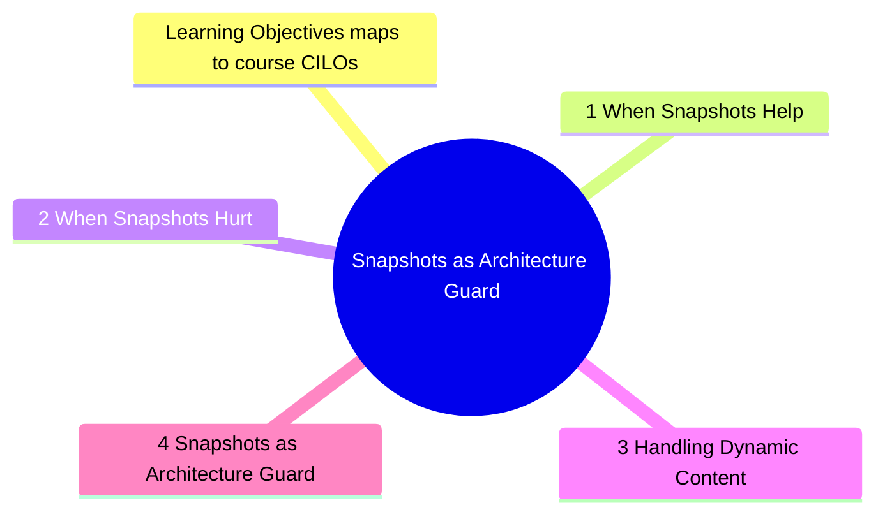

# Module 10: Snapshots as Architecture Guard

Est. study time: 1.5h
Language: en
Description: Snapshots are controversial — used well they catch unintended changes. Used poorly they create noise. This module covers when snapshots protect architectural decisions, when they hurt, and how to handle dynamic content.



## Learning Objectives (maps to course CILOs)
- Use snapshots to guard against unintended structural changes
- Distinguish snapshot-worthy output from volatile content
- Handle dynamic/random content in snapshots

---

## Core Content

### 10.1 When Snapshots Help

Snapshots excel at detecting unintended structural changes in **stable components**:

- Error pages, empty states, loading skeletons
- Generated SVG/icon components
- Form layouts with fixed structure
- Documentation/markdown rendered output

```tsx
test('error page matches snapshot', () => {
  const { container } = render(<ErrorPage code={404} />)
  expect(container).toMatchSnapshot()
})
// Catches: button order changed, text removed, layout broken
```

> **Think**: When does a snapshot give a meaningful signal vs noise?
>
> *Answer: Meaningful signal: snapshot changes because the spec changed (new section added, text updated). Noise: snapshot changes because of a CSS-in-JS hash, random ID, or timestamp. The distinction is whether the change reflects a deliberate spec change.*

### 10.2 When Snapshots Hurt

Snapshots are harmful when:

1. **Too large** (> 50 lines) — nobody reads the diff, just approves
2. **Too volatile** — CSS-in-JS class names, generated IDs, timestamps
3. **First resort** — use assertions before snapshots

```tsx
// Bad: huge snapshot of entire page
test('dashboard renders', () => {
  const { container } = render(<Dashboard />)
  expect(container).toMatchSnapshot() // 200+ lines, nobody reviews
})

// Good: targeted assertion for key content
test('dashboard shows user name', () => {
  render(<Dashboard />)
  expect(screen.getByText(/welcome, john/i)).toBeInTheDocument()
})
```

Signal: if you find yourself clicking "update snapshot" without reviewing the diff, the snapshot is too large or too volatile.

### 10.3 Handling Dynamic Content

Snapshots break with random IDs, timestamps, or generated class names.

Solutions:

**1. Mock the dynamic value:**

```tsx
jest.spyOn(Math, 'random').mockReturnValue(0.5)
// Snapshot now gets deterministic output
```

**2. Snapshot property matchers:**

```tsx
expect(container).toMatchSnapshot({
  createdAt: expect.any(String), // ignore exact value
  id: expect.any(Number),
})
```

**3. Inline snapshots for small output:**

```tsx
expect(screen.getByText(/error/i)).toMatchInlineSnapshot(`
  <div class="css-abc123">
    <h2>Error</h2>
    <p>Something went wrong</p>
  </div>
`)
```

### 10.4 Snapshots as Architecture Guard

The advanced use: snapshot structural decisions to prevent regressions.

```tsx
// Guard: button order should not change accidentally
test('form actions are in correct order', () => {
  render(<CheckoutForm />)
  const buttons = screen.getAllByRole('button')
  expect(buttons.map(b => b.textContent)).toMatchSnapshot(['Submit', 'Cancel'])
})
```

---

> **Predict**: Before reading deeper: what do you expect happens when help interacts with hurt in snapshots as architecture guard?
>
> *Answer: The system relies on help to keep hurt predictable — when both apply, the stricter rule wins.*
> **Cloze**: {blank} governs how snapshots as architecture guard behaves when multiple hurt concerns collide.
> **Cloze**: The rule that keeps help correct under load is called {blank}.
> **Cloze**: In snapshots as architecture guard, handling dynamic determines {blank}.
> **Spot the Mistake**: A developer treats help as optional because "it works without it." Where is the mistake?
>
> *Answer: It works only until the assumptions behind help are violated. The fix: treat it as part of the contract of snapshots as architecture guard, not an optimization.*


## Key Takeaways

- Snapshots for stable, small output. Assertions for volatile content
- > 50 line snapshot = too big. Nobody reviews the diff
- Dynamic content: mock values or use property matchers
- Snapshots protect structural decisions from accidental changes
- Inline snapshots for small, specific output

---

## Feynman Explain

Explain snapshots as architecture guards: "A snapshot is like a photo of your room. If someone moves the furniture, you notice. But if the room changes every hour, the photo just creates noise. Snapshot things that should not change, not things that change constantly."
