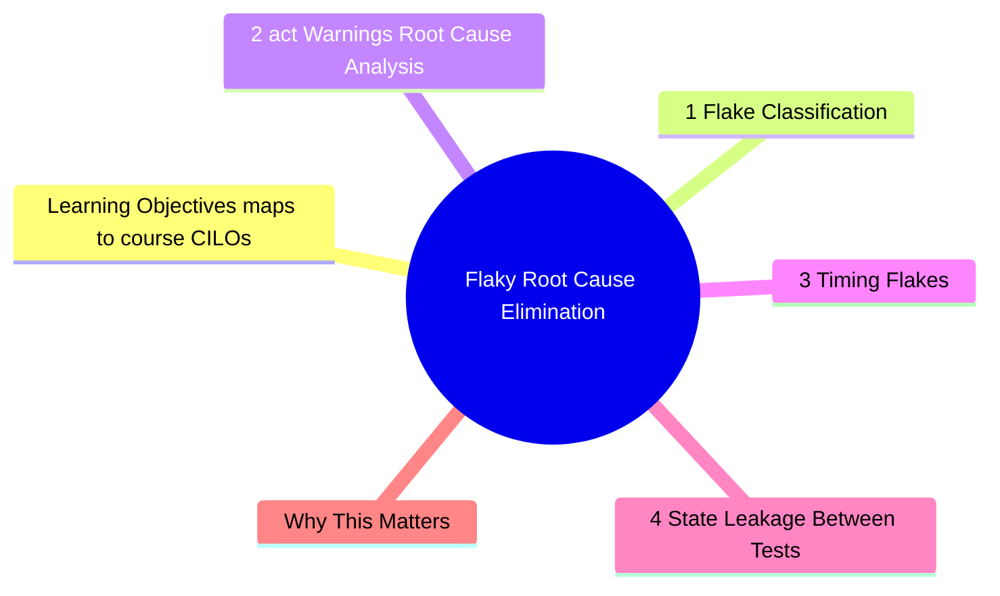

# Module 11: Flaky Root Cause Elimination

Est. study time: 2.5h
Language: en
Description: Flaky tests destroy trust in the test suite. Most teams add retries as a band-aid. This module covers systematic root cause elimination: async timing, act() warnings, shared state, and CI environment issues.



## Learning Objectives (maps to course CILOs)
- Diagnose flaky test root causes using systematic classification
- Eliminate flakiness from async timing and shared state issues
- Fix act() warnings by understanding the React state update lifecycle
- Design test isolation strategies that prevent flakiness

---

## Core Content

### 11.1 Flake Classification

Three categories of flakiness:

| Category          | Root cause                                 | Fix                                         |
| ----------------- | ------------------------------------------ | ------------------------------------------- |
| **Timing**        | Async race condition, insufficient wait    | Use findBy, waitFor, not arbitrary timeouts |
| **State leakage** | Shared store/state between tests           | Reset state in afterEach                    |
| **Environment**   | CI vs local differences, network, timezone | Mock environment, use fake timers           |

### 11.2 act() Warnings — Root Cause Analysis

The `act()` warning is the #1 source of confusion and flakiness in React tests. Understanding it is essential.

**What act() does**: `act()` ensures all state updates, effects, and renders are flushed before assertions run. React Testing Library wraps most operations in `act()` automatically (`render`, `userEvent`, `fireEvent`). The warning fires when a state update happens **outside** an `act()` boundary.

```tsx
// Triggers act() warning
test('component with async effect', async () => {
  render(<DataFetcher />) // render triggers useEffect
  // useEffect calls fetch → promise resolves → setState
  // If promise resolves outside act(), React warns:
  // "An update to DataFetcher inside a test was not wrapped in act(...)"
  expect(await screen.findByText(/data/i)).toBeInTheDocument()
})
```

The fix is almost always: **wait for the state update before asserting**.

```tsx
// Fixed — findBy waits inside act()
test('component with async effect', async () => {
  render(<DataFetcher />)
  expect(await screen.findByText(/data/i)).toBeInTheDocument()
  // findBy uses waitFor internally, which wraps assertions in act()
})
```

**Common act() triggers and fixes**:

| Trigger                  | Why it fires                          | Fix                                     |
| ------------------------ | ------------------------------------- | --------------------------------------- |
| `setTimeout` in effect   | Timer fires after test ends           | `jest.useFakeTimers()` + advance timers |
| `fetch` promise resolves | Async state update outside act        | `waitFor` or `findBy`                   |
| `requestAnimationFrame`  | Animation callback after render       | `jest.useFakeTimers()` with rAF mocking |
| Microtask queue          | Promise chain flushes after test ends | `await flushMicrotasks()` utility       |

**The dangerous pattern — ignoring act()**:

```tsx
// Bad — suppresses the symptom, not the cause
beforeEach(() => {
  jest.spyOn(console, 'warn').mockImplementation(() => {})
})
// act() warnings silenced. But state updates may still be unflushed.
// Test passes today, flakes tomorrow when React changes timing.
```

> **Think**: Your test passes locally but fails in CI with an act() warning. The test uses `setTimeout(fn, 0)` for debounce. What fix applies uniformly?
>
> *Answer: Use `jest.useFakeTimers()` globally in setup. After user action, call `jest.advanceTimersByTime(0)` to flush microtask timers synchronously. This makes CI timing identical to local.*

```tsx
beforeEach(() => { jest.useFakeTimers() })
afterEach(() => { jest.useRealTimers() })

test('debounced search fires once', async () => {
  render(<SearchBox />)
  await userEvent.type(screen.getByRole('searchbox'), 'hello')
  jest.advanceTimersByTime(300) // flush debounce timer
  // Assertions run inside act() because timers fired synchronously
  expect(screen.getByText(/results/i)).toBeInTheDocument()
})
```

### 11.3 Timing Flakes

**Bad — arbitrary timeout**:

```tsx
test('loads data', async () => {
  render(<DataPage />)
  await new Promise(r => setTimeout(r, 1000)) // fragile
  expect(screen.getByText(/data/i)).toBeInTheDocument()
})
```

This fails in CI (slower) and passes locally (fast). Race condition.

**Good — waits for condition**:

```tsx
test('loads data', async () => {
  render(<DataPage />)
  expect(await screen.findByText(/data/i)).toBeInTheDocument()
})
```

`findByText` retries until element appears or timeout (default 1000ms). No arbitrary wait.

**Retry timing for animation/transition**:

```tsx
test('modal open animation completes', async () => {
  render(<Modal />)
  await userEvent.click(screen.getByRole('button', { name: /open/i }))
  // Wait for animation to finish
  await waitFor(() => {
    expect(screen.getByRole('dialog')).toHaveClass('open')
  }, { timeout: 3000 }) // CSS transition = 300ms, generous timeout
})
```

### 11.4 State Leakage Between Tests

Tests share process-level state unless explicitly reset:

```tsx
// Test A — sets store
useUserStore.setState({ user: { name: 'Alice' } })

// Test B — fails because user is still 'Alice' from Test A
afterEach(() => {
  resetAllStores() // every test starts clean
})
```

**Complete reset checklist**:

| What to reset        | How                               |
| -------------------- | --------------------------------- |
| Zustand/Jotai stores | `getInitialState()` in afterEach  |
| MSW handlers         | `server.resetHandlers()`          |
| jest mocks           | `jest.clearAllMocks()`            |
| Fake timers          | `jest.useRealTimers()`            |
| DOM                  | Cleaned by RTL's `cleanup` (auto) |
| console.error spies  | `jest.restoreAllMocks()`          |

```tsx
// setup.ts — comprehensive isolation
afterEach(() => {
  resetAllStores()
  server.resetHandlers()
  jest.clearAllMocks()
  jest.useRealTimers()
})
```

### 11.5 Environment Flakes

Differences between local dev and CI environments:

| Factor      | Local          | CI                | Fix                                              |
| ----------- | -------------- | ----------------- | ------------------------------------------------ |
| CPU speed   | Fast           | Variable          | No arbitrary timeouts                            |
| Timezone    | Your TZ        | UTC               | `process.env.TZ = 'UTC'` in setup                |
| Locale      | Your locale    | en-US             | `Intl.DateTimeFormat` mock                       |
| Screen size | Big monitor    | Headless 1024×768 | Set viewport in setup                            |
| Network     | Real or cached | Cold              | MSW for all HTTP                                 |
| Date        | Real date      | Any               | `jest.useFakeTimers().setSystemTime(anchorDate)` |

**Key fix: deterministic time**:

```tsx
beforeEach(() => {
  jest.useFakeTimers()
  jest.setSystemTime(new Date('2024-01-15T12:00:00Z'))
})

test('shows today date', () => {
  render(<DateDisplay />)
  expect(screen.getByText('Jan 15, 2024')).toBeInTheDocument()
})
```

> **Think**: Your test passes locally on Monday but fails in CI on Sunday because a component displays "Sale ends Sunday" differently. What tests would catch this?
>
> *Answer: Test with multiple system times:*

```tsx
test.each([
  ['Monday', '2024-01-15T12:00:00Z', 'Sale ends Sunday'],
  ['Sunday', '2024-01-14T12:00:00Z', 'Sale ends today!'],
])('shows correct end message on %s', (_, date, expected) => {
  jest.setSystemTime(new Date(date))
  render(<SaleBanner />)
  expect(screen.getByText(expected)).toBeInTheDocument()
})
```

### 11.6 Flaky Detection Strategy

Do not add retries for flaky tests. Add retries only for infrastructure (network, docker).

**Systematic detox**:

1. **Detect**: Tag flaky tests with `test.flaky` or track in test analytics
2. **Classify**: Timing? State leakage? Environment?
3. **Fix**: Apply the category-specific fix
4. **Verify**: Run 10x in CI to confirm fix
5. **Guard**: Add test to prevent regression (isolation check, fake timers)

```tsx
// Turn a detected flaky test into a stable one
// Before: flaky due to real timers
test('expires session after 30 minutes', async () => {
  render(<SessionManager />)
  await new Promise(r => setTimeout(r, 61_000)) // slow and flaky
})

// After: stable with fake timers
test('expires session after 30 minutes', () => {
  jest.useFakeTimers()
  render(<SessionManager />)
  jest.advanceTimersByTime(30 * 60 * 1000 + 1)
  expect(screen.getByText(/session expired/i)).toBeInTheDocument()
})
```

---

## Why This Matters

Flaky tests erode confidence. Teams stop trusting CI, merge with failing tests, or waste hours re-running. Most flakiness comes from three root causes — fix the cause, not the symptom.

The advanced insight: a flaky test is never random. It is deterministic under conditions you have not identified. Classification narrows the search space.

---

## Common Questions

**Q: Should I use `jest.retryTimes(3)` for flaky tests?**
A: No. Retries mask the root cause. Use them only as a temporary bridge while diagnosing permanent fix. Track retries as tech debt.

**Q: How do I detect flaky tests in CI?**
A: Run test file N times (N=10) and check for inconsistent results. Tools: `jest --shard`, `vitest --repeat`, or `flaky-test-detector` packages.

**Q: act() warning but test passes — should I care?**
A: Yes. A passing test with act() warning is unstable. React may change timing behavior in a minor version, and the test breaks. Always fix act() warnings.

**Q: What about `waitFor` timeout — should it be 5000ms?**
A: Default 1000ms is fine for most cases. Increase only for components with slow animations or real timers. If you need >3000ms, investigate why the component is slow.

---

## Examples

### Example 1: act() warning in useEffect cleanup

```tsx
function PollingComponent() {
  const [data, setData] = useState(null)
  useEffect(() => {
    const interval = setInterval(() => {
      fetch('/api/data').then(r => r.json()).then(setData)
    }, 5000)
    return () => clearInterval(interval) // cleanup prevents leak
  }, [])
  return <div>{data?.value}</div>
}

test('polling component does not leak', () => {
  jest.useFakeTimers()
  const { unmount } = render(<PollingComponent />)

  // Advance past one interval
  jest.advanceTimersByTime(5000)

  unmount() // cleanup runs — clears interval
  // No act() warning because interval is cleared
})
```

### Example 2: Systematic flake diagnosis

```tsx
// Flaky test — fails ~20% of CI runs
test('search results appear', async () => {
  render(<Search />)
  await userEvent.type(screen.getByRole('searchbox'), 'react')
  expect(screen.getByText(/results for react/i)).toBeInTheDocument()
})

// Diagnosis:
// 1. Classification: Timing (debounce before API call)
// 2. Root cause: Debounce timer fires after test cleanup
// 3. Fix: fake timers
test('search results appear — fixed', () => {
  jest.useFakeTimers()
  render(<Search />)
  fireEvent.change(screen.getByRole('searchbox'), { target: { value: 'react' } })
  jest.advanceTimersByTime(300) // flush debounce
  expect(screen.getByText(/results for react/i)).toBeInTheDocument()
})
```

---

> **Predict**: Commit to an answer: does flaky root cause elimination get simpler or harder once act() enters the picture?
>
> *Answer: Harder locally, simpler globally: individual pieces carry more rules, but the overall system needs fewer special cases.*
> **Cloze**: {blank} governs how flaky root cause elimination behaves when multiple render concerns collide.
> **Cloze**: The rule that keeps act() correct under load is called {blank}.
> **Cloze**: In flaky root cause elimination, userevent determines {blank}.
> **Spot the Mistake**: Code review note: someone applies render everywhere "to be safe" in a flaky root cause elimination codebase. Spot the mistake.
>
> *Answer: Blanket application hides which spots actually need render. Apply it where the semantics demand it, and document why.*


## Key Takeaways

- Three flake categories: timing, state leakage, environment
- Fix act() warnings — do not suppress them. They signal real timing issues
- Use findBy/waitFor, never arbitrary timeouts
- Fake timers eliminate timing flakiness completely
- Reset all stores and mocks between tests
- System time, locale, timezone must be deterministic in tests
- Track flaky tests; fix root cause, do not add retries

---

## Common Misconception

"If the test passes, the act() warning is harmless." Wrong. act() warnings indicate that a state update happened after the test finished. This means the test is not testing real React behavior — it may pass today but break when internal timing changes. Treat act() warnings as test failures.

---

## Feynman Explain

Explain act() to a junior dev: "React batches all state updates inside act() so it knows when rendering is complete. Outside act(), a state update fires, React tries to render, but the test has already moved on. The warning is React saying 'I did some work after you checked the answer.' Always wait for React to finish before asserting."

Fix flaky tests by analogy: "A flaky test is like a smoke alarm that goes off randomly. After a few false alarms, you stop paying attention. Then a real fire starts and nobody notices. Fix the false alarm, do not just silence it."
