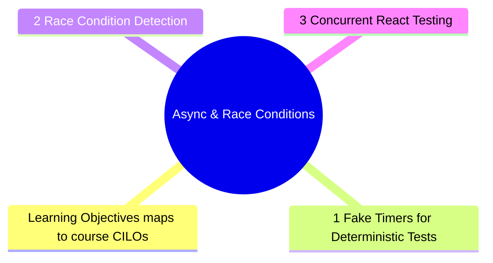

# Module 12: Async & Race Conditions

Est. study time: 2h
Language: en
Description: Concurrent React, async operations, and race conditions are the hardest testing challenges. This module covers fake timers, detecting race conditions, and testing async code safely.



## Learning Objectives (maps to course CILOs)
- Use fake timers to test time-dependent code deterministically
- Detect and test race conditions in async flows
- Test concurrent React features (Suspense, transitions)

---

## Core Content

### 12.1 Fake Timers for Deterministic Tests

```tsx
jest.useFakeTimers()

test('debounce waits 300ms before firing', () => {
  const fn = jest.fn()
  render(<SearchBox onSearch={fn} />)
  userEvent.type(screen.getByRole('textbox'), 'hello')
  expect(fn).not.toHaveBeenCalled() // not yet

  act(() => jest.advanceTimersByTime(300))
  expect(fn).toHaveBeenCalledWith('hello')
})
```

### 12.2 Race Condition Detection

Test concurrent request cancellation:

```tsx
test('cancels previous request when new one starts', async () => {
  let resolveOldRequest: () => void
  const oldPromise = new Promise(r => { resolveOldRequest = r })

  server.use(
    http.get('/api/search', async ({ request }) => {
      const url = new URL(request.url)
      const q = url.searchParams.get('q')
      if (q === 'old') await oldPromise
      return HttpResponse.json({ results: [q] })
    })
  )

  render(<Search />)
  await userEvent.type(screen.getByRole('textbox'), 'old')
  await userEvent.clear(screen.getByRole('textbox'))
  await userEvent.type(screen.getByRole('textbox'), 'new')

  resolveOldRequest!() // resolve old request
  await waitFor(() => {
    // Only new result should be shown
    expect(screen.getByText('new')).toBeInTheDocument()
    expect(screen.queryByText('old')).not.toBeInTheDocument()
  })
})
```

### 12.3 Concurrent React Testing

Suspense with fallback:

```tsx
test('shows fallback while Suspense content loads', () => {
  render(
    <Suspense fallback={<Loading />}>
      <SlowComponent />
    </Suspense>
  )
  expect(screen.getByText(/loading/i)).toBeInTheDocument()
})
```

---

> **Predict**: Commit to an answer: does async & race conditions get simpler or harder once fake timers enters the picture?
>
> *Answer: Harder locally, simpler globally: individual pieces carry more rules, but the overall system needs fewer special cases.*
> **Think**: What would break first if you ignored **1 Fake Timers for Deterministic Tests** in a production async & race conditions setup?
>
> *Answer: Correctness holds at small scale, then behavior diverges as load or complexity grows — exactly what **1 Fake Timers for Deterministic Tests** guards against.*
> **Cloze**: {blank} governs how async & race conditions behaves when multiple deterministic tests concerns collide.
> **Cloze**: The rule that keeps fake timers correct under load is called {blank}.
> **Cloze**: In async & race conditions, race condition determines {blank}.
> **Spot the Mistake**: Code review note: someone applies deterministic tests everywhere "to be safe" in a async & race conditions codebase. Spot the mistake.
>
> *Answer: Blanket application hides which spots actually need deterministic tests. Apply it where the semantics demand it, and document why.*


## Key Takeaways

- Fake timers make time-dependent tests deterministic
- Race condition tests: resolve old request after new one, assert old result discarded
- Test Suspense fallback and content independently
- Use findBy/waitFor for async assertions, not arbitrary timeouts
- Cancel stale requests to prevent race conditions in search/autocomplete

---

## Feynman Explain

Explain race conditions: "Imagine ordering two Ubers to the same address. The first one arrives while you are typing the second address. You cancel the first and take the second. If the first Uber shows up late, you might get into the wrong car. Race conditions are the wrong 'Uber' (response) showing up."
