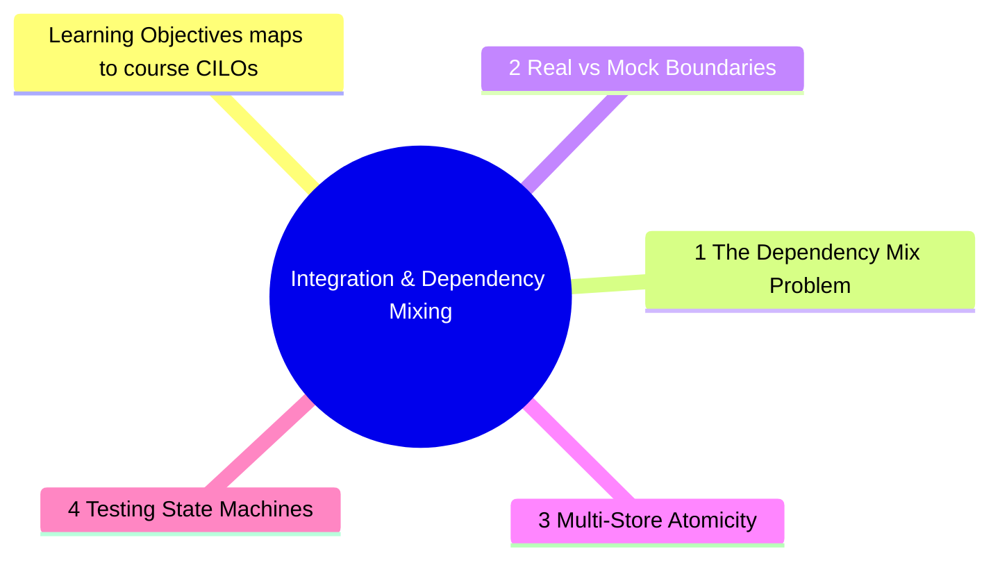

# Module 13: Integration & Dependency Mixing

Est. study time: 2.5h
Language: en
Description: Real applications mix multiple dependencies — stores, APIs, router, analytics, feature flags. This module covers strategies for testing components with complex dependency graphs, multi-store atomicity, and service boundaries.



## Learning Objectives (maps to course CILOs)
- Design test strategies for components with 3+ dependencies
- Test multi-store atomicity (all stores consistent before/after actions)
- Determine mock vs real boundaries for external services
- Test state machines and multi-step flows

---

## Core Content

### 13.1 The Dependency Mix Problem

Real components rarely have one dependency. They mix:

```tsx
function OrderCheckout() {
  const user = useUserStore(s => s.user)
  const cart = useCartStore(s => s.items)
  const { data: shippingRates } = useQuery(['shipping'], fetchRates)
  const navigate = useNavigate()
  const track = useAnalytics()

  // ... orchestrates all 5 dependencies
}
```

Test strategy: set all dependencies at the boundary, test behavior output.

```tsx
test('shows shipping options based on cart weight', async () => {
  useUserStore.setState({ user: { id: '1', address: validAddress } })
  useCartStore.setState({ items: heavyItems })
  server.use(
    http.get('/api/shipping', () => HttpResponse.json([
      { method: 'standard', price: 10 },
      { method: 'express', price: 25 },
    ]))
  )

  render(<OrderCheckout />)
  expect(await screen.findByText(/express: \$25/i)).toBeInTheDocument()
})
```

Each dependency is set at its boundary:
- Store: `setState`
- API: MSW
- Router: MemoryRouter wrapper
- Analytics: mock module (external service)

### 13.2 Real vs Mock Boundaries

| Dependency    | Test approach                | Boundary        |
| ------------- | ---------------------------- | --------------- |
| Zustand store | Real store, setState         | Store API       |
| React Context | Real provider, inject values | Context value   |
| HTTP API      | MSW handler                  | HTTP URL        |
| Router        | MemoryRouter                 | Route path      |
| Analytics SDK | Mock module                  | Import boundary |
| Feature flags | Test flags provider          | Flag key        |

**Rule**: Use real implementation for internal dependencies (stores, contexts). Mock at external boundaries (analytics, third-party SDKs, WebSocket).

### 13.3 Multi-Store Atomicity

When an action updates multiple stores, test that all stores are consistent:

```tsx
test('order placement clears cart and locks inventory', async () => {
  useUserStore.setState({ user: { id: '1' } })
  useCartStore.setState({ items: [item1, item2] })
  server.use(http.post('/api/orders', () => HttpResponse.json({ id: 'ord-1' })))

  render(<Checkout />)
  await userEvent.click(screen.getByRole('button', { name: /pay/i }))
  await screen.findByText(/confirmed/i)

  // Atomicity assertion — both conditions must hold
  expect(useCartStore.getState().items).toHaveLength(0)
  expect(useOrderStore.getState().lastOrderId).toBe('ord-1')
})
```

### 13.4 Testing State Machines

Multi-step flows (checkout wizard, onboarding) are state machines:

```tsx
const CHECKOUT_STEPS = ['cart', 'shipping', 'payment', 'confirmation']

test.each(CHECKOUT_STEPS)('renders %s step', (step) => {
  useCheckoutStore.setState({ currentStep: step })
  render(<CheckoutWizard />)
  expect(screen.getByTestId(`step-${step}`)).toBeInTheDocument()
})

test('prevents skipping payment step', async () => {
  useCheckoutStore.setState({ currentStep: 'shipping' })
  render(<CheckoutWizard />)
  const nextBtn = screen.getByRole('button', { name: /next/i })
  await userEvent.click(nextBtn)
  expect(useCheckoutStore.getState().currentStep).toBe('payment') // cannot skip
})
```

### 13.5 Tool-Boundary Decisions: Jest vs Storybook vs Playwright

Integration testing spans multiple tools. Choosing the right tool for each boundary prevents duplicated effort.

| Layer                   | Tool             | What it tests                         | Example                          |
| ----------------------- | ---------------- | ------------------------------------- | -------------------------------- |
| **Component logic**     | Jest/Vitest      | State, effects, handlers              | Store updates on click           |
| **Component rendering** | Storybook        | Visual appearance, a11y tree          | Button variants, color themes    |
| **User flow**           | Playwright       | Multi-page navigation, actual browser | Login → dashboard → logout       |
| **API contract**        | MSW (all layers) | Request/response shape                | Shared handlers across all tools |

**Rule**: Each layer uses the **same MSW handlers**. Do not duplicate mock definitions.

```tsx
// handlers.ts — single source of truth for all three tools
export const handlers = [
  http.get('/api/user', () => HttpResponse.json(mockUser)),
  http.post('/api/login', () => HttpResponse.json({ token: 'mock' })),
]
```

**Storybook + MSW**:

```tsx
// Button.stories.tsx
import { handlers } from '../mocks/handlers'

export const LoggedIn: Story = {
  parameters: {
    msw: { handlers: [handlers.user] }, // shared handlers
  },
  render: () => <UserProfile />,
}
```

**Playwright + MSW**:

```tsx
// playwright.config.ts
import { test } from '@playwright/test'
import { handlers } from '../mocks/handlers'

test('login flow', async ({ page }) => {
  // Mock before navigation
  await page.route('**/api/**', async (route) => {
    // Use MSW handlers in Playwright
  })
  await page.goto('/login')
  // ... Playwright assertions in real browser
})
```

**Decision matrix**:

| You need to test...                | Use              | Because                               |
| ---------------------------------- | ---------------- | ------------------------------------- |
| State change after click           | Vitest           | Fast, no browser, direct store access |
| Component in various visual states | Storybook        | Visual diff, a11y snapshots, docs     |
| Multi-page navigation              | Playwright       | Real browser, cookies, redirects      |
| Error boundary behavior            | Vitest           | Can assert console.error, error UI    |
| Screen reader behavior             | Playwright + axe | Real a11y tree                        |

> **Think**: Your team duplicates MSW handlers in Jest tests and Playwright tests. A user API endpoint changes. How many places to update?
>
> *Answer: N files — N/2 in Jest mocks + N/2 in Playwright fixtures. If shared handlers from one source, exactly 1 file changes. The single-source principle applies to mock data across all test tools.*

**Pattern: shared mock package**:

```text
packages/
  shared-mocks/
    handlers/
      users.ts
      products.ts
      auth.ts
    fixtures/
      users.ts
      products.ts
```

Each consumer (vitest, storybook, playwright) imports from `@company/shared-mocks`. One contract, three consumers.

---

> **Predict**: Before reading deeper: what do you expect happens when setstate interacts with @company/shared-mocks in integration & dependency mixing?
>
> *Answer: The system relies on setstate to keep @company/shared-mocks predictable — when both apply, the stricter rule wins.*
> **Cloze**: {blank} governs how integration & dependency mixing behaves when multiple @company/shared-mocks concerns collide.
> **Cloze**: The rule that keeps setstate correct under load is called {blank}.
> **Cloze**: In integration & dependency mixing, the dependency determines {blank}.
> **Spot the Mistake**: A developer treats setstate as optional because "it works without it." Where is the mistake?
>
> *Answer: It works only until the assumptions behind setstate are violated. The fix: treat it as part of the contract of integration & dependency mixing, not an optimization.*


## Key Takeaways

- Set each dependency at its natural boundary (setState, MSW, provider)
- Real for internal deps, mock for external boundaries
- Test multi-store atomicity: assert all stores after action
- State machine: test each state renders, test transitions are blocked
- Mock analytics/third-party SDKs at module boundary
- Use same MSW handlers across Vitest, Storybook, Playwright
- Decision matrix: Vitest for logic, Storybook for visuals, Playwright for flows
- Share mock definitions via a shared package to prevent duplication

---

## Feynman Explain

Explain dependency mixing: "A real app is like a car — engine, wheels, steering, brakes all work together. Testing in isolation checks each part. Integration testing checks they work together. You set the engine RPM (store state), apply the brake (user click), and check the car stops (UI + store assertions)."
