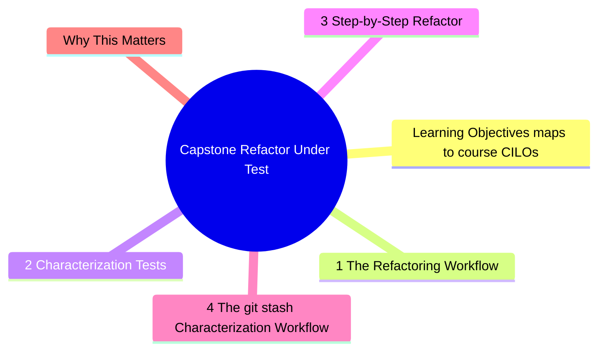
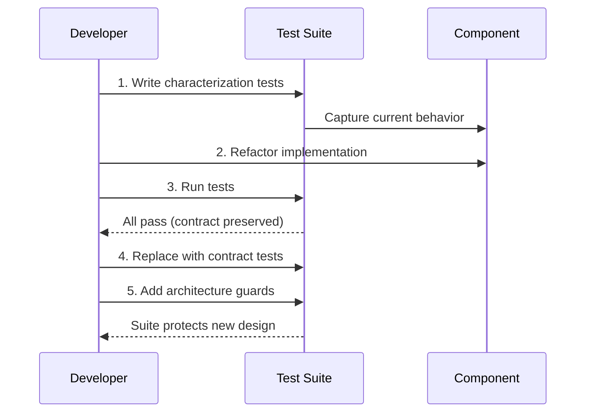

# Module 14: Capstone: Refactor Under Test

Est. study time: 3h
Language: en
Description: The ultimate test of advanced testing skills: take messy legacy code, write characterization tests, refactor safely. This module synthesizes all 13 previous modules into a single end-to-end workflow.



## Learning Objectives (maps to course CILOs)
- Apply characterization testing to legacy code without existing tests
- Execute a safe refactoring workflow: characterize → refactor → verify
- Design architecture guards that prevent regression after refactoring

---

## Core Content

### 14.1 The Refactoring Workflow

```text
1. Characterize    — write tests that capture current behavior (warts and all)
2. Refactor        — change implementation without changing behavior
3. Verify          — run characterization tests to confirm no regression
4. Clean           — remove characterization tests, write proper contract tests
5. Guard           — add architecture tests to prevent regression
```

### 14.2 Characterization Tests

When refactoring legacy code with no tests, write characterization tests first:

```tsx
// Legacy component — no tests, messy, but works in production
function UserSettings({ userId }) {
  // 100 lines of mixed concerns: data fetching, form state, validation, API calls
  // Nobody wants to refactor this without a safety net
}

// Characterization test — captures current behavior
test('UserSettings renders current settings', async () => {
  server.use(
    http.get('/api/users/1/settings', () => HttpResponse.json({
      theme: 'dark',
      notifications: true,
      language: 'en',
    }))
  )
  render(<UserSettings userId="1" />)
  expect(await screen.findByLabelText(/theme/i)).toHaveValue('dark')
  expect(screen.getByLabelText(/notifications/i)).toBeChecked()
  expect(screen.getByLabelText(/language/i)).toHaveValue('en')
})
```

Characterization tests preserve the contract. They do not judge whether the behavior is correct — they capture what exists. Refactoring changes implementation while keeping the contract intact.

### 14.3 Step-by-Step Refactor

**Step 1**: Write characterization tests for the messy component.
**Step 2**: Extract data fetching into a custom hook.
**Step 3**: Extract form state management.
**Step 4**: Separate pure UI from logic.
**Step 5**: Run characterization tests — they pass (contract preserved).
**Step 6**: Write proper contract tests (clean, intentional).
**Step 7**: Add architecture guards (snapshot of key structure, state machine assertions).
**Step 8**: Remove characterization tests (they were scaffolding).

```tsx
// After refactor
function UserSettings({ userId }) {
  const { settings, updateSetting } = useSettings(userId)
  return <UserSettingsUI settings={settings} onUpdate={updateSetting} />
}

// Contract test
test('updates theme when user selects dark mode', async () => {
  server.use(
    http.put('/api/users/1/settings', () => HttpResponse.json({ success: true }))
  )
  render(<UserSettings userId="1" />)
  await userEvent.selectOptions(screen.getByLabelText(/theme/i), 'dark')
  expect(await screen.findByText(/saved/i)).toBeInTheDocument()
})
```

### 14.4 The `git stash` Characterization Workflow

In practice, characterization tests are often written against code that is **not yet committed** — the messy component is your current working tree. The workflow:

1. **Stash changes**: `git stash push -m "WIP: refactoring UserSettings"`
2. **Reset to clean state**: working tree now has the original, stable component
3. **Write characterization tests** against the clean version
4. **Verify tests pass** on clean code (confirms no pre-existing breakage)
5. **Pop stash**: `git stash pop` restores your WIP changes
6. **Run tests again**: characterization tests should still pass (your WIP has not changed behavior yet)
7. **Refactor** with confidence — tests guard against regression

```bash
git stash push -m "WIP settings refactor"          # save WIP
# working tree is now the original component
npm test -- UserSettings.test.tsx                   # write + verify characterization
git stash pop                                       # restore WIP
npm test -- UserSettings.test.tsx                   # verify tests still pass
# NOW refactor safely
```

**Why this matters**: Without the stash step, you write characterization tests against partially-refactored code. The tests capture the WIP state, not the real contract. When the real refactor breaks something, the characterization test does not catch it because it was calibrated against broken code.

```tsx
// Wrong: writing characterization tests against WIP code
// WIP already moved API call from component to hook
// Characterization test expects hook-based behavior
// Real contract (component does API call) is not captured

// Right: stash WIP, write tests against clean code
// Characterization test expects component to call API
// After refactor (WIP popped), test fails — you know behavior changed
```

> **Think**: Your colleague says "I wrote characterization tests, then refactored, and all tests pass — but the UI broke in production." What went wrong?
>
> *Answer: Likely wrote characterization tests against WIP/partially refactored code. The tests captured the WIP contract, not the original contract. When refactoring further, tests passed because they were aligned with the already-changed behavior. Always stash first.*

### 14.5 Architecture Guards

After refactoring, add tests that protect the new architecture from regression:

```tsx
// Guard: container/presenter boundary stays intact
test('UserSettingsUI has no side effects', () => {
  render(
    <UserSettingsUI settings={mockSettings} onUpdate={jest.fn()} />
  )
  // Pure component: no MSW, no store, no async — fast and reliable
  expect(screen.getByLabelText(/theme/i)).toHaveValue('dark')
})

// Guard: hook handles all states
test('useSettings loading state', () => {
  server.use(http.get('/api/users/1/settings', async () => {
    await delay('infinite') // never resolves
  }))
  render(<UserSettings userId="1" />)
  expect(screen.getByRole('status')).toBeInTheDocument() // spinner
})

test('useSettings error state', async () => {
  server.use(http.get('/api/users/1/settings', () =>
    HttpResponse.json({ error: 'Server error' }, { status: 500 })
  ))
  render(<UserSettings userId="1" />)
  expect(await screen.findByText(/error/i)).toBeInTheDocument()
})
```

Guard test rules:
- Each guard asserts **one architectural invariant**
- Guards are explicit about what they protect (comment the intent)
- Guards fail when the architecture degrades, not when code moves
- Remove guards when the invariant becomes conventional (team knows not to violate it)

```tsx
// Good guard comment: explains what invariant is protected
// Guard: all data flows through useSettings hook, not direct fetch in component
test('UserSettings does not fetch directly', async () => {
  let directFetchAttempted = false
  server.use(http.get('/api/users/*', () => {
    directFetchAttempted = true
    return HttpResponse.json({})
  }))
  render(<UserSettings userId="1" />)
  await screen.findByText(/settings/i)
  // If this fires, someone put a fetch() in the component instead of the hook
  expect(directFetchAttempted).toBe(false)
})
```



---

## Why This Matters

Refactoring without tests is flying blind. The characterization + refactor + guard workflow transforms risky refactoring into a mechanical, checkable process.

The advanced insight: tests are not just verification — they are refactoring enablers. A test suite that enables confident refactoring is worth more than a test suite with 100% coverage.

---

> **Predict**: Before reading deeper: what do you expect happens when git stash interacts with git stash pop in capstone: refactor under test?
>
> *Answer: The system relies on git stash to keep git stash pop predictable — when both apply, the stricter rule wins.*
> **Cloze**: {blank} governs how capstone: refactor under test behaves when multiple git stash pop concerns collide.
> **Cloze**: The rule that keeps git stash correct under load is called {blank}.
> **Cloze**: In capstone: refactor under test, the refactoring determines {blank}.
> **Spot the Mistake**: A developer treats git stash as optional because "it works without it." Where is the mistake?
>
> *Answer: It works only until the assumptions behind git stash are violated. The fix: treat it as part of the contract of capstone: refactor under test, not an optimization.*


## Key Takeaways

- Characterize before refactoring — capture behavior, not intent
- Refactor in small steps with characterization tests as safety net
- Replace characterization tests with intentional contract tests after refactoring
- Add architecture guards to prevent regression of the new design
- Tests that enable refactoring are the highest-value tests

---

## Common Misconception

"Refactoring legacy code is too risky without existing tests." This is exactly when characterization tests add the most value. Write tests that capture current behavior (including bugs — you can add the bug fix separately), refactor with confidence, then add proper tests.

---

## Feynman Explain

Explain characterization testing: "It is like taking a photo of your messy room before cleaning. The photo captures exactly what exists. You clean the room, move things around. Then you check the photo to make sure you did not throw away something important. Once the room is clean, you throw away the 'before' photo."
