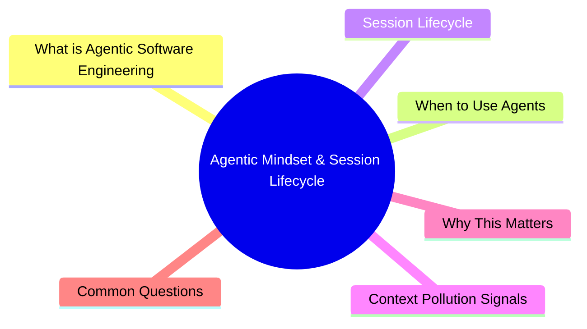

# Module 1: Agentic Mindset & Session Lifecycle

Est. study time: 1.5h
Language: en



## Learning Objectives
- Distinguish agentic coding from chat-based LLM usage
- Decide when to use an agent vs code manually
- Manage session lifecycle: start, continue, restart
- Detect context pollution and diminishing returns

---

## Core Content

### What is Agentic Software Engineering

Traditional LLM chat: you paste code, ask question, get answer. You drive every step.

Agentic: you set goal and constraints. Agent explores codebase, plans, implements, verifies. Agent drives subtasks. You review and redirect.

Shift: **operator → orchestrator**. You don't write every line. You decide direction, inspect output, correct course.

```text
Chat LLM:   You: "write a function to sort users" → LLM: outputs code
Agentic:    You: "add user sorting to the admin panel, follow existing patterns"
            Agent: reads current code → identifies patterns → writes code → runs tests → fixes → presents diff
```

> **Think**: What mental shift is hardest for developers switching from chat to agentic? Why?
> *Answer: Trust. Developers are used to controlling every character. Agentic requires trusting output, reviewing intelligently, not micromanaging.*

### When to Use Agents

| Good for Agent | Bad for Agent | Best Manual |
|---------------|---------------|-------------|
| Boilerplate generation | Novel algorithm design | Architecture decisions |
| Cross-file refactoring | High-security code | Production hotfixes |
| Test writing | Cryptography | Sensitive data handling |
| Documentation | Performance-critical kernels | Legal/compliance code |
| Bug hunting (explore) | System-level programming | Creative design |
| Code review | Domain you don't understand | Reviewing agent's work |

Rule: agent for **mechanical, well-defined, explorable** tasks. Manual for **creative, high-stakes, underspecified** tasks.

> **Think**: You need to implement a new payment provider integration. Agent or manual? Why?
> *Answer: Agent if existing provider integrations exist (pattern to follow). Manual if first integration or security-critical financial logic.*

### Session Lifecycle

```text
START → EXPLORE/PLAN → IMPLEMENT → VERIFY → REVIEW → [CONTINUE or RESTART]
```

**New session** triggers:
- Context exceeds ~90% capacity (agent starts forgetting early instructions)
- Task domain fundamentally changes (e.g., backend → infrastructure)
- Agent shows confusion (repeats questions, contradicts itself)
- After major failure (agent spiraling on wrong approach)

**Continue session** triggers:
- Same-file edits
- Same-feature continuation
- Same bug investigation
- Context still under ~70% full

**Restart** protocol:
1. Compress current session into summary
2. Copy key decisions to AGENTS.md or CLAUDE.md
3. Start fresh session with compressed summary + instructions
4. Cost: ~15s overhead, saves thousands of tokens

> **Think**: You've been working on authentication for 3 hours. Agent is generating good code but responses are slowing and it forgot the project structure. What do you do?
> *Answer: Compress session → restart fresh with compressed summary. Don't push through degradation.*

### Context Pollution Signals

Symptoms of degraded context:
- Agent asks questions already answered
- Agent writes code that violates earlier decisions
- Agent repeats itself
- Response latency increases (more tokens to process)
- Agent "forgets" tools it used successfully earlier

**Prevention**: compress proactively (not just when full). Every 30-50 turns, or when topic closes.

---

## Why This Matters

Most agent failures aren't technical. They're **context management failures**. Wrong session choice, wrong task delegation, wrong trust level. This module's concepts prevent 80% of common agent frustrations.

---

## Common Questions

**Q: Should I let agent explore freely or guide tightly?**
A: Depends on task maturity. New codebase: guide tightly. Established codebase: let agent explore patterns first (discovery-first, covered in M6).

**Q: What if agent wastes tokens exploring too much?**
A: Set budget in prompt: "Spend max 3 tool calls exploring, then propose plan." Bounded exploration.

**Q: Should I restart session daily?**
A: Not necessarily. Restart when context degrades, not on calendar. Some sessions last 100+ turns if topic stays tight.

---

## Examples

### Example 1: Session Lifecycle Management

Problem: Building a feature across 2 days. End of day 1, context ~80% full.

Bad: Start day 2 fresh without context. Agent re-explores codebase, misses yesterday's design decisions.

Good: Compress day 1 → write key decisions to AGENTS.md → start fresh with compressed summary. Day 2 agent picks up where you left off.

### Example 2: Recognizing Wrong Tool for Task

Problem: Need to implement custom sorting algorithm for novel data structure.

Bad: Ask agent to implement from scratch. Agent writes plausible-looking but incorrect algorithm. You don't catch bug. Production fails.

Good: Write algorithm yourself (manual). Ask agent to write tests, benchmark, review for edge cases. Agent helps without being trusted with core logic.

---

> **Predict**: Before reading deeper: what do you expect happens when software engineering interacts with agents in agentic mindset & session lifecycle?
>
> *Answer: The system relies on software engineering to keep agents predictable — when both apply, the stricter rule wins.*
> **Cloze**: {blank} governs how agentic mindset & session lifecycle behaves when multiple agents concerns collide.
> **Cloze**: The rule that keeps software engineering correct under load is called {blank}.
> **Cloze**: In agentic mindset & session lifecycle, session lifecycle determines {blank}.
> **Spot the Mistake**: A developer treats software engineering as optional because "it works without it." Where is the mistake?
>
> *Answer: It works only until the assumptions behind software engineering are violated. The fix: treat it as part of the contract of agentic mindset & session lifecycle, not an optimization.*


## Key Takeaways
- Agentic = orchestrator, not operator. Set goal, review output, redirect.
- Use agents for mechanical/explorable tasks. Manual for creative/high-stakes.
- New session when context degraded, domain shifted, or after failure.
- Compress before restart. Preserve decisions in AGENTS.md.
- Detect context pollution: repetition, forgetting, contradictions.

---

## Common Misconception

**"Agent should do everything."** No. Agent is a force multiplier, not a replacement. Best results come from strategic delegation: agent handles mechanical work, you handle decisions the agent cannot make. The best agentic developers are those who know what NOT to delegate.

---

## Feynman Explain

(Explain "session lifecycle" to a developer who only uses chat LLMs. Why not just keep one chat open forever? What's different about agent sessions?)

---

## Reframe

(Judge: "always start new session for each task" vs "never restart unless forced." Which extreme is more dangerous? What's the cost of each? When would each be right?)

---

## Drill

Take the quiz. Run: `learn.sh quiz agentic-engineering 1`
