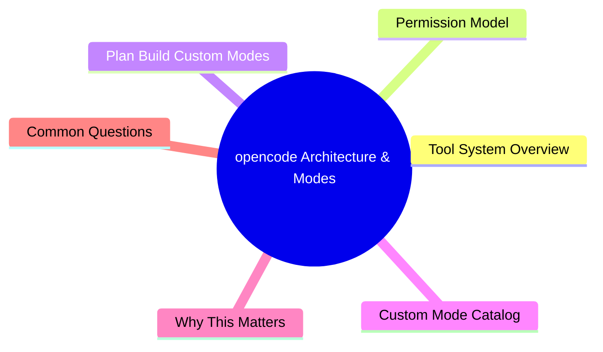

# Module 2: opencode Architecture & Modes

Est. study time: 1.5h
Language: en



## Learning Objectives
- Map opencode tool system and permission model
- Distinguish Plan, Build, and Custom modes
- Design custom modes with tool-permission tables
- Build a multi-mode workflow pipeline

---

## Core Content

### Tool System Overview

opencode agents access filesystem via tools. Each tool has specific capability:

| Tool | Does | Permission needed |
|------|------|-------------------|
| Read | Read any file | Read |
| Write | Write/create files | Write |
| Edit | Modify existing files | Write |
| Glob | Pattern-match file paths | Read |
| Grep | Search file contents | Read |
| Bash | Run shell commands | Write |
| Task | Spawn subagent | Varies by subagent mode |
| Compress | Summarize context | Always allowed |
| Question | Ask user | Always allowed |

> **Think**: Which tool would you block in a mode meant only for code review?
> *Answer: Write, Edit, Bash (all can modify system). Read + Glob + Grep + Question are sufficient for review.*

### Permission Model

Modes restrict tool access at system level. This is **not a prompt** — agent physically cannot call disallowed tools.

```text
Plan mode: Read + Glob + Grep + Task + Compress + Question
           NO: Write, Edit, Bash, tool deletion

Build mode: ALL tools available

Custom mode: YOUR rules
```

> **Think**: Why enforce at system level instead of just telling agent "don't write files"?
> *Answer: Prompts can be ignored or forgotten. System-level enforcement is absolute. Agent CANNOT write even if it tries.*

### Plan / Build / Custom Modes

| Mode | Use Case | Safety |
|------|----------|--------|
| **Plan** | Design, explore, ask questions before committing | Zero risk of unwanted changes |
| **Build** | Implementation with full power | Full trust, full responsibility |
| **Custom** | Create role-specific guardrails | Configurable per role |

> **Think**: A junior dev on your team wants to use opencode. Which mode do you give them?
> *Answer: Custom "junior" mode: Read + Write tests only. No modify source, no bash. Promotes safety while they learn.*

### Custom Mode Catalog

| Mode | Tools Allowed | Tools Blocked | Use Case |
|------|--------------|---------------|----------|
| **Researcher** | Read, Glob, Grep, Task (explore), Write (.md only) | Write (src), Edit, Bash | Investigate issues, write design docs. Cannot touch source. |
| **Reviewer** | Read, Glob, Grep, Question, Write (review output) | Write (src), Edit, Bash | PR review, code audit, style check. |
| **Tester** | Read, Glob, Grep, Write (test/ only) | Write (src/), Edit (src/), Bash | Write test coverage without risk to source. |
| **Commiter** | Read, Glob, Grep, Bash (git only) | Write, Edit | Stage, commit, push. No code changes. |
| **Linter** | Read, Glob, Grep, Bash (lint tools only) | Write, Edit | Enforce style, report violations. |
| **Architect** | Read, Glob, Grep, Write (docs/ only) | Write (src/), Edit, Bash | RFCs, ADRs, architecture documents. |
| **Scaffolder** | Write (new files only), Read, Glob, Grep | Edit (existing files), Bash | Generate boilerplate, new components. |
| **Security Scout** | Read, Glob, Grep, Bash (security tools) | Write, Edit | Vulnerability scan, dependency audit. |
| **Janitor** | Read, Glob, Grep, Edit, Bash (delete/rename) | Write (new features) | Clean dead code, rename, restructure. |
| **Deployer** | Read (configs), Bash (deploy commands) | Write, Edit (src) | Production deployments, rollbacks. |

> **Think**: Why does Scaffolder allow Write but block Edit? What risk does this prevent?
> *Answer: Can create new files but cannot modify existing ones. Prevents accidental edits to stable code during generation.*

### Multi-Mode Workflow Pipeline

Chain modes across development phases:

```text
Phase 1: RESEARCHER
    Agent investigates bug/feature request. Writes findings as .md.
    You review and approve direction.

Phase 2: ARCHITECT
    Agent designs solution. Writes RFC/ADR.
    You review design.

Phase 3: BUILD (default mode)
    Agent implements. Full tool access.
    You review code as it comes.

Phase 4: TESTER
    Agent writes tests for new code.
    Cannot touch source. Safe coverage.

Phase 5: REVIEWER
    Agent audits full diff. Read-only.
    Produces review report.

Phase 6: COMMITER
    You stage files manually.
    Agent writes commit message, commits, pushes.
```

Each phase locks agent to appropriate capabilities. Prevents jumping ahead.

> **Think**: What happens if you skip RESEARCHER and go straight to BUILD for a complex feature?
> *Answer: Agent may implement wrong approach because it didn't fully investigate. Researcher phase catches misunderstandings before code is written.*

---

## Why This Matters

Modes are the safety system of agentic development. Without them, agent has full filesystem access all the time. Custom modes let you match capability to task — reducing risk, improving focus, and enabling multi-phase workflows that catch errors early.

---

## Common Questions

**Q: Can I switch modes mid-session?**
A: Yes. Open a new session with desired mode. Or use mode-switching if supported by your opencode setup.

**Q: How many custom modes should I create?**
A: Start with 3-4 (Researcher, Reviewer, Tester, Commiter). Add more as you identify specific needs. Quality over quantity.

**Q: Can a mode be "read-only but can run tests"?**
A: Yes. Custom mode can allow specific Bash commands (e.g., `npm test`, `pytest`) while blocking Write/Edit.

**Q: Do custom modes work with subagents?**
A: Yes. When you spawn a task subagent, it inherits the current mode's permission set (or can be assigned its own mode).

---

## Examples

### Example 1: Researcher Mode Configuration

```text
Mode: Researcher
Read: ✅ (all files)
Write: ✅ (.md files only)
  - pattern: "**/*.md"
  - pattern: "docs/**"
Edit: ❌
Bash: ❌ (except read-only commands like `ls`, `cat`)
Task: ✅ (explore subagent only)
```

Best for: "Investigate why the login page is slow. Don't change anything."

### Example 2: Multi-Mode Bug Fix

Scenario: Production bug in payment processing.

1. **Researcher** mode: Agent investigates error logs, traces code path, writes findings.md
2. You review → confirm root cause
3. **Build** mode: Agent implements fix
4. **Tester** mode: Agent writes regression tests
5. **Reviewer** mode: Agent reviews full diff
6. **Commiter** mode: Agent writes commit message, commits

Each phase has safety rails. No premature commits. No untested changes.

---

> **Predict**: Before reading deeper: what do you expect happens when npm test interacts with pytest in opencode architecture & modes?
>
> *Answer: The system relies on npm test to keep pytest predictable — when both apply, the stricter rule wins.*
> **Cloze**: {blank} governs how opencode architecture & modes behaves when multiple pytest concerns collide.
> **Cloze**: The rule that keeps npm test correct under load is called {blank}.
> **Cloze**: In opencode architecture & modes, tool system determines {blank}.
> **Spot the Mistake**: A developer treats npm test as optional because "it works without it." Where is the mistake?
>
> *Answer: It works only until the assumptions behind npm test are violated. The fix: treat it as part of the contract of opencode architecture & modes, not an optimization.*


## Key Takeaways
- Modes restrict tool access at system level (not just prompts)
- Plan = read-only. Build = full access. Custom = your rules.
- Custom mode catalog: Researcher, Reviewer, Tester, Commiter, Linter, Architect, Scaffolder, Security Scout, Janitor, Deployer
- Each mode has specific allowed/blocked tools
- Chain modes across dev lifecycle for safety and focus
- Start with 3-4 custom modes, grow as needed

---

## Common Misconception

**"Custom modes are just system prompts with different instructions."** No. Mode enforcement is at the **tool permission level**. You cannot prompt your way around a blocked tool. If a mode denies Write, the agent cannot write a single byte — no matter how cleverly it's prompted.

---

## Feynman Explain

(Explain custom modes to a developer who uses one editor for everything. Why would you want different "editors" for researching vs coding vs committing? Use an analogy from physical tools.)

---

## Reframe

(Judge: "All team members should use the same build mode" vs "each person should have custom modes." When would shared modes cause problems? When would custom modes create confusion?)

---

## Drill

Take the quiz. Run: `learn.sh quiz agentic-engineering 2`
