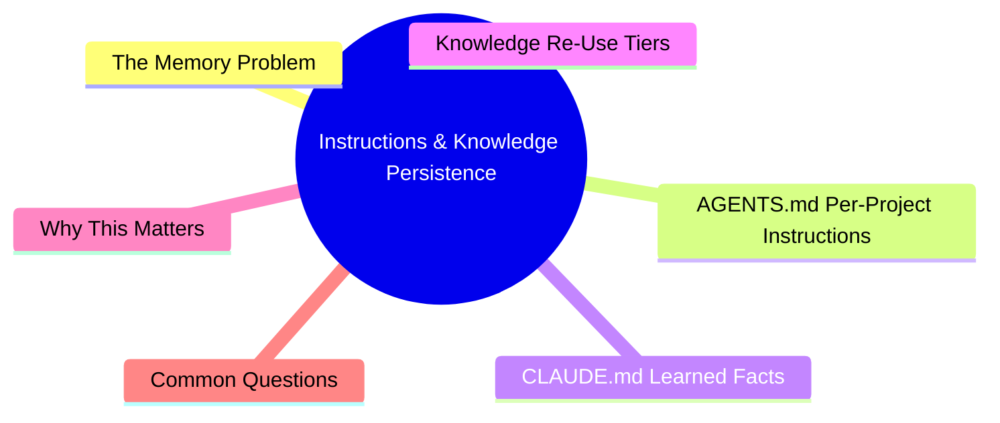

# Module 3: Instructions & Knowledge Persistence

Est. study time: 1.5h
Language: en



## Learning Objectives
- Write effective AGENTS.md instructions per project
- Use CLAUDE.md for cross-session memory
- Apply knowledge re-use tiers: session → project → global
- Compress context strategically between sessions

---

## Core Content

### The Memory Problem

Agent sessions are stateless. Each new session starts blank. Without persistence, agent re-explores codebase, re-learns conventions, repeats mistakes every session.

Solution: **layered memory system**.

```text
Session Memory (compress tool)    → lasts one session
Project Memory (AGENTS.md)        → lasts per repo, persists across sessions
Global Memory (CLAUDE.md)         → lasts per repo, long-term facts
Skills (custom skills)            → lasts across all repos, reusable workflows
```

> **Think**: A project has specific naming conventions. Where should you document them so every agent session uses them?
> *Answer: AGENTS.md. It's loaded at session start for that repo. CLAUDE.md is for facts learned, not static conventions.*

### AGENTS.md: Per-Project Instructions

AGENTS.md sits in project root. Loaded automatically at session start. Contains:

```text
What to put in AGENTS.md:
- Project conventions (naming, imports, folder structure)
- Framework choices (React 19 + Next.js + Tailwind)
- Testing approach (vitest + testing-library, minimum 80% coverage)
- Common commands (dev server, test suite, lint)
- Agent boundaries (what NOT to do: delete files, modify configs)
- Project-specific patterns (component structure, data flow)
```

Good AGENTS.md:

```text
# Project: course-content
# Framework: Next.js 14 + React 19 + Tailwind CSS
# Testing: vitest + @testing-library/react
# State: Zustand stores in src/stores/
# Conventions: kebab-case for files, PascalCase for components
# Do NOT modify: next.config.js, tailwind.config.ts, package.json
# Commands: npm run dev | npm test | npm run lint
```

Bad AGENTS.md:

```text
# Be careful with the code
# Write good tests
# Follow the project style
```

> **Think**: Why is "Write good tests" a bad AGENTS.md instruction?
> *Answer: Too vague. Agent doesn't know what "good" means. Specify: "Write vitest + testing-library tests. One test per component. Mock API calls."*

### CLAUDE.md: Learned Facts

CLAUDE.md stores facts the agent discovers during work. Updated by agent or you.

Examples of what goes in CLAUDE.md:

```text
# Learned during session 2024-01-15
# Auth token refresh occurs in middleware.ts, not API route
# User cache uses Redis with 5min TTL
# The legacy sort function in utils/sort.ts is deprecated, use lodash orderBy
```

CLAUDE.md is read at session start. Agent can suggest updates as it learns.

Rule: AGENTS.md = **static instructions you write**. CLAUDE.md = **dynamic facts discovered during work**.

> **Think**: You discover the CI pipeline runs tests in a specific order. Where to record this?
> *Answer: CLAUDE.md. It's a fact discovered during work, not a static instruction.*

### Knowledge Re-Use Tiers

| Tier | File | Scope | Updated by | Example |
|------|------|-------|------------|---------|
| Session | Compress tool | Current session | You (compress) | "We decided on PostgreSQL, rejected MongoDB" |
| Project | AGENTS.md | Per repo | You (manually) | "Test with vitest, coverage ≥80%" |
| Project | CLAUDE.md | Per repo | Agent + You | "Auth middleware at middleware.ts, not routes" |
| Global | Custom skills | All repos | You (manually) | "create-react-component skill for any React project" |

Promotion path: Session → noticed pattern → add to AGENTS.md → pattern generalizes → elevate to skill.

> **Think**: Session noticed the agent always writes tests after implementation. This is useful. Where to promote?
> *Answer: If specific to this project → AGENTS.md. If you want it in every project → custom skill or global AGENTS.md config.*

### Compression Strategy

Compression collapses conversation history into dense summary. Preserve:

```text
KEEP in compression:
- Design decisions made (with rationale)
- Rejected alternatives (so agent doesn't revisit)
- File paths created/modified
- Patterns established
- Current state (what's done, what's pending)

DROP from compression:
- Failed attempts that led nowhere
- Verbose tool outputs (long error logs, stack traces)
- Back-and-forth exploration noise
- Already-compressed segments that are superseded
```

Pattern: compress every 30-50 turns or when topic closes. Don't wait until context 100% full.

```text
Compress timing:
< 30 turns:  probably premature
30-50 turns:  good cadence for complex topics
50+ turns:    context likely degrading
> 70% budget: compress immediately
```

> **Think**: You have a long error trace from a failed build. Should you include it in compression summary?
> *Answer: No. Include the root cause conclusion, not the raw trace. "Build failed due to missing @types/react" not 200 lines of build output.*

---

## Why This Matters

Without memory persistence, every session is Groundhog Day. Agent re-discovers what it already learned. Knowledge tiers let you build institutional memory that compounds across sessions — each session starts smarter than the last.

---

## Common Questions

**Q: Should I commit AGENTS.md to version control?**
A: Yes. It's project configuration, like .eslintrc or tsconfig.json. CLAUDE.md is optional — commit if you want shared team memory.

**Q: What if AGENTS.md contradicts CLAUDE.md?**
A: AGENTS.md wins. It's explicit instructions. CLAUDE.md is discovered facts that may be stale.

**Q: Can I have multiple AGENTS.md files?**
A: Yes. Some setups support per-directory AGENTS.md. Check your opencode version's documentation.

**Q: Does compression lose information?**
A: Yes — deliberately. You lose noise, keep signal. If uncertain, keep the detail. Conservative compression is safer than aggressive.

---

## Examples

### Example 1: Compression Before Restart

Bad compression: "We worked on auth and made progress."

Good compression: "Auth system: implemented JWT refresh token flow. Token stored in httpOnly cookie. Refresh endpoint at POST /api/auth/refresh. Rejected approach of storing in localStorage (XSS vulnerability). Next: implement token rotation on refresh to prevent replay attacks. Files created: middleware.ts, lib/auth.ts, tests/auth.test.ts."

### Example 2: Knowledge Promotion

Session observation (3x): Agent always asks "what test framework do you use?"

Session 4 answer → add to AGENTS.md: `Testing: vitest + @testing-library/react`

After 3 projects with same setup → promote to custom skill `react-test-setup` with full instructions.

---

> **Predict**: Before reading deeper: what do you expect happens when testing: vitest + @testing-library/react interacts with react-test-setup in instructions & knowledge persistence?
>
> *Answer: The system relies on testing: vitest + @testing-library/react to keep react-test-setup predictable — when both apply, the stricter rule wins.*
> **Cloze**: {blank} governs how instructions & knowledge persistence behaves when multiple react-test-setup concerns collide.
> **Cloze**: The rule that keeps testing: vitest + @testing-library/react correct under load is called {blank}.
> **Cloze**: In instructions & knowledge persistence, the memory determines {blank}.
> **Spot the Mistake**: A developer treats testing: vitest + @testing-library/react as optional because "it works without it." Where is the mistake?
>
> *Answer: It works only until the assumptions behind testing: vitest + @testing-library/react are violated. The fix: treat it as part of the contract of instructions & knowledge persistence, not an optimization.*


## Key Takeaways
- AGENTS.md = static instructions you write. CLAUDE.md = dynamic facts agent discovers.
- Knowledge tiers: session → project (AGENTS.md) → global (skills)
- Compress every 30-50 turns or when context >70%. Keep decisions, drop noise.
- Promote patterns noticed 3+ times to higher tier.
- Commit AGENTS.md. CLAUDE.md optional.

---

## Common Misconception

**"The agent will remember across sessions automatically."** No. Agent sessions are stateless. Without AGENTS.md, CLAUDE.md, or compression carryover, each session starts fresh. Memory persistence is your responsibility.

---

## Feynman Explain

(Explain the three knowledge tiers to a teammate who keeps everything in their head. Why write things down when you could just tell the agent each time?)

---

## Reframe

(Judge: "compress aggressively and restart often" vs "never compress, ride one session." Compare token costs, memory quality, and developer time tradeoffs.)

---

## Drill

Take the quiz. Run: `learn.sh quiz agentic-engineering 3`
