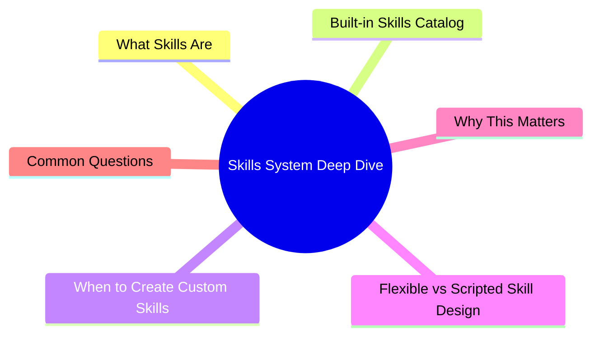

# Module 4: Skills System Deep Dive

Est. study time: 2h
Language: en



## Learning Objectives
- Use built-in skills (caveman, review, commit, cavecrew, learn-anything)
- Decide when to create custom skills vs use inline instructions
- Choose between flexible (description-only) and scripted (deterministic) skill designs
- Map available hooks and events for automation
- Manage skill lifecycle: create, test, publish, maintain

---

## Core Content

### What Skills Are

Skills package instructions + optional scripts into reusable units. Loaded when triggered by name or automatically.

```text
Skill = Instructions (what agent should do)
      + Optional scripts (deterministic behavior)
      + Metadata (name, description, trigger)
      + Trigger conditions (keyword, event, file change)
```

> **Think**: How is a skill different from AGENTS.md?
> *Answer: AGENTS.md loads every session. Skills load only when triggered. Skills can contain executable scripts. AGENTS.md is pure instructions.*

### Built-in Skills Catalog

| Skill | Trigger | What it does |
|-------|---------|--------------|
| **caveman** | `caveman` keyword | Ultra-compressed communication. Drops articles/filler/pleasantries. |
| **caveman-help** | `caveman help` | Quick reference for all caveman modes. |
| **caveman-review** | `caveman review` | Ultra-compressed code review comments: location, problem, fix. |
| **caveman-commit** | `/commit` or `write commit` | Compressed Conventional Commits messages. Subject ≤50 chars. |
| **caveman-compress** | `compress memory file` | Compress CLAUDE.md/memory files into caveman format. |
| **caveman-stats** | `caveman stats` | Show token usage and estimated savings for session. |
| **cavecrew** | `delegate`, `use cavecrew` | Subagent delegation: Investigator (locate), Builder (1-2 file edit), Reviewer (diff review). |
| **learn-anything** | `learn X` | Structured curriculum builder + MCQ + spaced repetition. |
| **customize-opencode** | opencode config editing | Safe editing of opencode configuration files. |

> **Think**: Which skill would you use to save tokens when writing commit messages?
> *Answer: caveman-commit. Compressed Conventional Commits with ≤50 char subject. Cuts commit message tokens ~70%.*

### When to Create Custom Skills

Create skill when pattern appears **3+ times**:

| Scenario | Skill or not? |
|----------|--------------|
| "Create React component with tests" done 3x | ✅ Create skill |
| "Deploy to production" happens weekly | ✅ Create skill |
| One-time database migration script | ❌ Inline instruction |
| Project-specific ESLint rule | ❌ AGENTS.md (not general) |
| "Review PR for security issues" repeated task | ✅ Create skill |
| Team onboarding workflow with 5+ steps | ✅ Create skill |

> **Think**: Why wait for 3 repetitions? Why not create skill on first occurrence?
> *Answer: First occurrence may be one-off. Skill creation has overhead (authoring, testing, maintaining). 3x rule prevents premature abstraction.*

### Flexible vs Scripted Skill Design

**Flexible** (description-only):

```text
Skill: "code-reviewer"
Description: "Review code for correctness, style, security, performance.
Be thorough but concise. Tag issues as critical/major/minor.
Suggest fixes for each issue."
```

- Cheap to create. LLM interprets freely.
- Inconsistent output. Varies by model state.
- Handles edge cases naturally.
- Best for: creative tasks, strategy, nuanced review.

**Scripted** (deterministic steps):

```text
Skill: "deploy-check"
Script:
  1. Run `npm run typecheck` → fail if errors
  2. Run `npm run lint` → fail if warnings
  3. Run `npm test` → fail if any test fails
  4. Run `npm run build` → fail if errors
  5. If all pass: print "✅ Deploy ready"
  6. If any fail: print error report, exit 1
```

- Deterministic. Same input → same output.
- Expensive to write/maintain. Breaks on unexpected input.
- Best for: build steps, CI, mechanical transforms.

**Hybrid** (recommended):

```text
Skill: "feature-implementer"
Script: Run lint + typecheck + test
Instructions: "Implement feature per spec. Follow existing patterns.
After implementation, run verification script. Fix until green."
```

Script for mechanical gates. LLM for judgment.

| Aspect | Flexible | Scripted | Hybrid |
|--------|----------|----------|--------|
| Consistency | Low | High | Medium |
| Maintenance | Low | High | Medium |
| Edge cases | Handles well | Breaks loudly | Handles with script fallback |
| Token cost | Medium | Low | Low (script gates save tokens) |
| Best for | Strategy, review | Build, deploy | Full workflows |

> **Think**: Should a code review skill be flexible or scripted?
> *Answer: Flexible. Code review requires judgment. Scripted can't assess "is this logic correct?" Hybrid: script runs lint/typecheck (mechanical), LLM reviews logic (judgment).*

### Hooks and Events

Skills can attach to lifecycle events:

| Hook | Fires when | Use case |
|------|-----------|----------|
| `pre-message` | Before each message processed | Inject context, check permissions |
| `post-message` | After each message processed | Log decisions, update CLAUDE.md |
| `pre-tool` | Before specific tool call | Validate inputs, prevent destructive ops |
| `post-tool` | After specific tool call | Verify output, save results |
| `pre-commit` | Before git commit | Run pre-commit checks |
| `post-commit` | After git commit | Update changelog, notify |
| File watcher | On file change | Regenerate, retest |

Example: hook `pre-tool` for Write to block writing to config files.

```text
Skill: "config-guard"
Hook: pre-tool (Write)
Condition: file matches next.config.js or package.json
Action: block with message "Config files are read-only. Edit manually."
```

> **Think**: You want to ensure agent never deletes the package.json. Which hook + condition?
> *Answer: pre-tool for Delete/Bash(rm) with condition file = package.json. Block access.*

### Skill Lifecycle

```text
1. IDENTIFY need (3x repetition or critical workflow)
2. PROTOTYPE as inline instructions (verify it works)
3. FORMALIZE as skill (write description/script)
4. TEST in isolation (dry-run mode)
5. PUBLISH to skills directory
6. MONITOR usage (any failures? confusion?)
7. UPDATE as patterns evolve
8. RETIRE when no longer needed
```

Testing checklist before publishing:
- [ ] Run in dry-run mode → verify output
- [ ] Run on edge cases (empty input, missing files)
- [ ] Error messages readable without domain knowledge
- [ ] Token cost acceptable (skill shouldn't burn 5000 tokens to save 10s)
- [ ] Idempotent (running twice same result, or safe to re-run)
- [ ] Has human escape hatch (override flag)

> **Think**: Why test skill in dry-run mode before publishing?
> *Answer: Catches logical errors without risk. Scripted skills may have path errors, missing dependencies, or incorrect assumptions that are cheap to fix before production use.*

---

## Why This Matters

Skills are your most reusable asset. A good skill saves tokens, ensures consistency, and encodes hard-won patterns. Bad skills waste tokens and produce unreliable output. Understanding flexible vs scripted tradeoffs is what separates novice from expert skill authors.

---

## Common Questions

**Q: Can skills call other skills?**
A: Yes. A deploy skill can call test skill and lint skill internally. Composition reduces duplication.

**Q: How do I share skills with my team?**
A: Put skills in version control. Or use opencode's skill distribution mechanism if available.

**Q: What if a skill doesn't work as expected?**
A: Check logs. Run in isolation with minimal input. Add debugging output. Iterate.

**Q: Can I write skills in any language?**
A: Scripts can be any executable (bash, python, node). Instructions are plaintext/markdown.

---

## Examples

### Example 1: Hybrid Security Review Skill

```text
Name: security-review
Type: hybrid
Script: run `npm audit`, `snyk test`, `grep -r "apiKey\|secret\|password" src/`
Instructions: "Review code for security issues.
Check: hardcoded secrets, SQL injection, XSS, CSRF, auth bypass.
For each finding: tag severity (critical/major/minor), location, suggested fix.
Start with script output, then review code logic."
```

Script finds low-hanging fruit (known vulns, hardcoded secrets). LLM reviews logic (auth flaws, injection points).

### Example 2: Avoid Premature Skills

Bad: Create skill for "write a README.md" after doing it once. Next task is different.

Good: After 3rd time writing READMEs for different projects, notice pattern (sections: description, install, usage, API, contributing). Create skill with template and style guide.

---

> **Predict**: Before reading deeper: what do you expect happens when caveman interacts with caveman help in skills system deep dive?
>
> *Answer: The system relies on caveman to keep caveman help predictable — when both apply, the stricter rule wins.*
> **Cloze**: {blank} governs how skills system deep dive behaves when multiple caveman help concerns collide.
> **Cloze**: The rule that keeps caveman correct under load is called {blank}.
> **Cloze**: In skills system deep dive, caveman review determines {blank}.
> **Spot the Mistake**: A developer treats caveman as optional because "it works without it." Where is the mistake?
>
> *Answer: It works only until the assumptions behind caveman are violated. The fix: treat it as part of the contract of skills system deep dive, not an optimization.*


## Key Takeaways
- Skills = instructions + optional scripts + triggers
- Built-in: caveman, review, commit, cavecrew, learn-anything, customize-opencode
- Create skill when pattern repeats 3+ times
- Flexible (LLM judges) vs Scripted (deterministic) vs Hybrid (best of both)
- Hooks: pre/post message, pre/post tool, file watchers, git hooks
- Lifecycle: identify → prototype → formalize → test → publish → monitor → update → retire

---

## Common Misconception

**"Every task should have a skill."** Skills have overhead: creation, testing, maintenance, token cost at trigger. Not every task benefits from skill-ification. The 3x repetition rule prevents premature abstraction. A one-off task is cheaper with inline instructions than a skill that'll never be used again.

---

## Feynman Explain

(Explain the difference between flexible and scripted skills using a cooking analogy. When would you follow a recipe exactly vs cook by taste?)

---

## Reframe

(Judge: "always make hybrid skills" vs "flexible first, add scripts when consistency fails." Which approach leads to better skills over time? What's the cost of over-engineering a skill?)

---

## Drill

Take the quiz. Run: `learn.sh quiz agentic-engineering 4`
