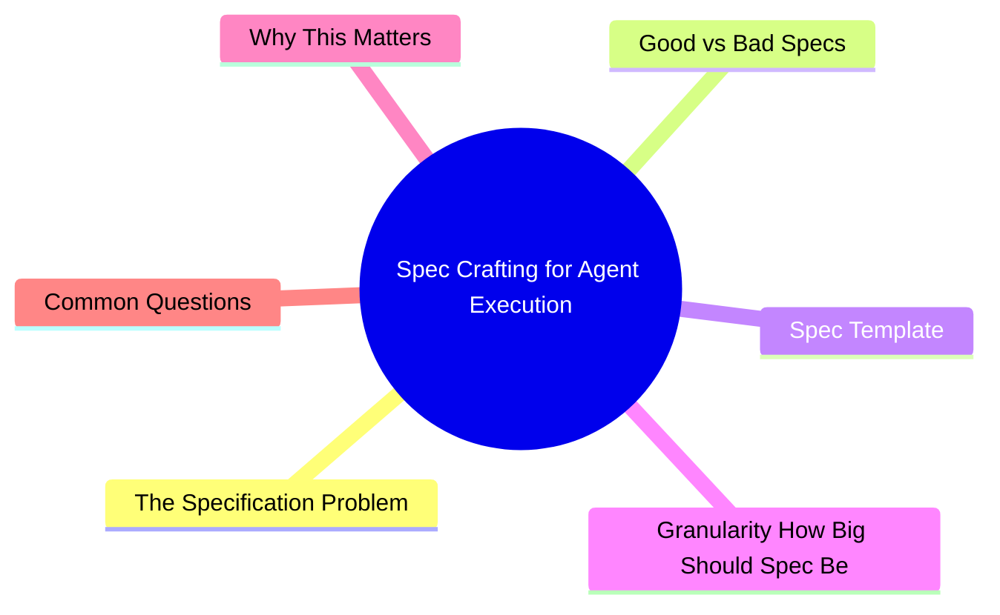

# Module 5: Spec Crafting for Agent Execution

Est. study time: 1.5h
Language: en



## Learning Objectives
- Write specs agents execute reliably without over-specifying
- Choose right granularity for different task types
- Include acceptance criteria the agent can self-verify
- Provide effective technical context

---

## Core Content

### The Specification Problem

Humans fill gaps from context. Agents don't. What's "obvious" to you is invisible to agent.

```text
Human spec: "Add search to the user list page"
Human reads: add search bar, filter results, handle empty state, debounce input

Agent reads: "add search" → what search? which field? API? client-side? debounce? pagination?
```

Write with **explicit gap-filling**. Assume agent knows nothing beyond what's in the spec + codebase.

> **Think**: Why does "add search" fail as agent spec?
> *Answer: Too many unknowns. Agent must guess: search field, API endpoint, debounce timing, UI placement, empty state, error handling. Each guess may be wrong.*

### Good vs Bad Specs

| Bad | Good |
|-----|------|
| "Fix the login bug" | "Login returns 500 when email contains '+' character. Fix input sanitization in POST /api/auth/login. Add test for email with '+'." |
| "Add sorting to table" | "Add sort by name and date to UserTable component. Click header to toggle asc/desc. Default: sort by name asc. Use existing useSort hook in hooks/useSort.ts." |
| "Improve performance" | "Profile shows UserList re-renders on every keystroke in search input. Memoize UserList with React.memo. Memoize filter function with useMemo." |
| "Write tests" | "Write vitest tests for useAuth hook: 1) returns null when not authenticated 2) returns user object when authenticated 3) throws on expired token 4) clears user on logout" |

> **Think**: What's common in all "good" columns?
> *Answer: Specific file paths, concrete behavior, existing patterns referenced, acceptance criteria that can be verified.*

### Spec Template

```text
Task: [One-line summary]
Scope: [Files to create/modify. Be specific.]
Acceptance:
  - [Measurable criteria 1]
  - [Measurable criteria 2]
Context:
  - [Existing pattern to follow]
  - [Rejected approaches (don't explore again)]
  - [Constraints or boundaries]
Verification:
  - [How to confirm it works: test command, manual check]
```

Example:

```text
Task: Add email uniqueness validation to user registration
Scope: modify src/api/auth/register.ts
Acceptance:
  - 409 response when email exists (case-insensitive)
  - 201 response when email unique
  - Test covers both cases
Context:
  - Follow existing validation pattern in src/api/users/create.ts
  - DB query: User.findByEmail(email) already exists
  - Do NOT add client-side validation (separate task)
Verification:
  - npm test src/api/auth/__tests__/register.test.ts
```

> **Think**: What's the cost of missing "rejected approaches" in spec?
> *Answer: Agent may explore and propose approaches already considered and rejected. Wastes tokens and time. Write down what NOT to do.*

### Granularity: How Big Should Spec Be?

| Task size | Spec detail | Agent autonomy | Best for |
|-----------|-------------|----------------|----------|
| Small (1-2 files) | High precision | Low | Bug fix, refactor, test |
| Medium (3-8 files) | Medium detail + pattern references | Medium | Feature addition |
| Large (8+ files) | Architecture + boundaries + file list | High | New feature, module |

Rule: **Spec scales inversely with agent autonomy**. Smaller tasks = tighter spec. Larger tasks = more room for agent to design.

```text
Small spec: "Fix this specific line. Change === to ==. Test passes."
Medium spec: "Add sort to table. Follow useSort pattern in hooks/. Files: UserTable.tsx, types.ts"
Large spec: "Add payment flow. Architecture: [diagram]. Files: [list]. Implement in order: 1) types 2) API 3) UI 4) tests"
```

> **Think**: A large feature spec with very high precision (every line specified) wastes what?
> *Answer: Agent's exploration ability. Over-specifying defeats purpose of using agent. You might as well write code yourself. Balance: enough direction to avoid wrong direction, enough freedom for agent to leverage codebase patterns.*

### Technical Context

Provide context agent cannot discover from codebase:

```text
Context to provide:
- Business rules not in code (e.g., "free tier users cannot export")
- Rejected approaches (saves agent from re-exploring dead ends)
- External dependencies (e.g., "rate limiter is external service, not in repo")
- Performance requirements (e.g., "must handle 1000 concurrent users")
- Security constraints (e.g., "never log user passwords")
```

Context NOT needed:
- Imports (agent reads existing code)
- Project conventions (should be in AGENTS.md)
- Framework API (agent already knows React, Express, etc.)

> **Think**: Should you specify which React hooks to use for a new feature?
> *Answer: Only if project uses non-standard hooks. Standard hooks (useState, useEffect, useMemo) agent already knows. Let it choose based on codebase patterns.*

---

## Why This Matters

Most agent implementation failures trace back to spec problems — not agent capability. Bad spec → wrong output → frustration. Good spec → right output → trust. Spec quality is the highest-leverage skill in agentic development.

---

## Common Questions

**Q: How do I know if my spec is detailed enough?**
A: Read it as if you're the agent. Would you know exactly what to do? Would you have any questions? If yes, add more.

**Q: What if agent still gets it wrong with good spec?**
A: Check if acceptance criteria are verifiable. If agent can't tell if it succeeded, it can't self-correct.

**Q: Should I write specs in issues/PRDs or in session?**
A: Both. External spec for team alignment. Session spec for agent execution. They may differ in format.

---

## Examples

### Example 1: Bug Fix Spec

Bad: "Fix the broken dropdown"

Good:
```text
Task: Dropdown menu closes immediately after opening on mobile
Scope: modify src/components/Dropdown/Dropdown.tsx
Acceptance:
  - Dropdown stays open on tap
  - Closes on tap outside
  - Same behavior across all breakpoints
Context:
  - Bug introduced in PR #142 (clickOutside handler added)
  - The handler fires on capture phase but should be bubble phase on mobile
  - Do NOT change desktop behavior
Verification: npm test src/components/Dropdown/__tests__/
```

### Example 2: Feature Spec - Right Granularity

```text
Task: Add dark mode toggle to settings page
Scope: new file src/components/Settings/DarkModeToggle.tsx
       modify src/context/ThemeContext.tsx
Acceptance:
  - Toggle switch in settings panel
  - Persists choice to localStorage
  - Applies immediately without page reload
  - Follows system preference on first visit
Context:
  - ThemeContext already has setTheme/getTheme
  - CSS variables for dark mode defined in globals.css
  - Follow existing toggle pattern in NotificationsToggle.tsx
  - Do NOT modify existing CSS variable definitions
Verification: npm test, then toggle manually in browser
```

---

> **Predict**: Commit to an answer: does spec crafting for agent execution get simpler or harder once the specification enters the picture?
>
> *Answer: Harder locally, simpler globally: individual pieces carry more rules, but the overall system needs fewer special cases.*
> **Cloze**: {blank} governs how spec crafting for agent execution behaves when multiple problem concerns collide.
> **Cloze**: The rule that keeps the specification correct under load is called {blank}.
> **Cloze**: In spec crafting for agent execution, good vs bad determines {blank}.
> **Spot the Mistake**: Code review note: someone applies problem everywhere "to be safe" in a spec crafting for agent execution codebase. Spot the mistake.
>
> *Answer: Blanket application hides which spots actually need problem. Apply it where the semantics demand it, and document why.*


## Key Takeaways
- Agents don't fill gaps. Write explicit specs.
- Include: scope, acceptance criteria, context (patterns, rejected, constraints), verification.
- Granularity: small tasks = tight spec. Large tasks = looser with architecture guide.
- Provide context agent can't discover: business rules, rejected approaches, performance/security constraints.
- Bad spec is #1 cause of agent failures. Spec quality is highest-leverage skill.

---

## Common Misconception

**"More detail is always better."** Over-specifying burns tokens and constrains agent's ability to leverage codebase patterns. The goal is to provide enough direction without writing the code yourself. If spec is longer than implementation, you should write it yourself.

---

## Feynman Explain

(Explain spec granularity to a junior developer. Why is "add search" both too vague and "add search with these 50 specific lines" too detailed? Where's the sweet spot?)

---

## Reframe

(Judge: "write everything in spec" vs "write minimum spec, let agent ask questions." Which leads to better outcomes? When would each approach be better?)

---

## Drill

Take the quiz. Run: `learn.sh quiz agentic-engineering 5`
