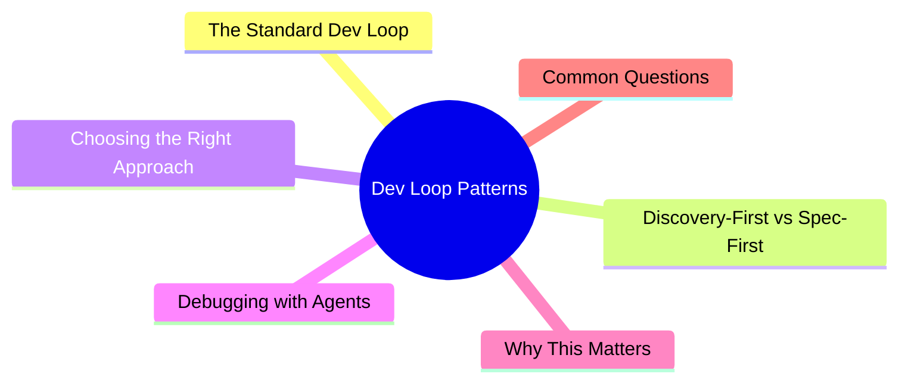

# Module 6: Dev Loop Patterns

Est. study time: 1.5h
Language: en



## Learning Objectives
- Apply Plan→Explore→Implement→Verify→Review loop
- Choose between discovery-first and spec-first approaches
- Use agents effectively for debugging
- Detect and break out of loop inefficiencies

---

## Core Content

### The Standard Dev Loop

```text
PLAN → EXPLORE → IMPLEMENT → VERIFY → REVIEW → [iterate or done]

PLAN:      Agent proposes approach. You approve or redirect.
EXPLORE:   Agent reads relevant files, understands patterns.
IMPLEMENT: Agent writes code.
VERIFY:    Agent runs checks (typecheck, lint, test).
REVIEW:    You inspect diff, approve changes or request fixes.
```

Each iteration tightens. First loop may be broad. Subsequent loops narrow.

> **Think**: Which step is most commonly skipped? What happens when it's skipped?
> *Answer: EXPLORE. Skipping leads to agent implementing against wrong patterns or missing context. Fix takes longer than explore would have.*

### Discovery-First vs Spec-First

**Spec-First**: You write detailed spec. Agent implements. Best when:
- Task is well-understood
- Requirements are clear
- Implementation path is obvious
- You know the codebase well

```text
You: "Add email validation to register form. Spec: [detailed]"
Agent: Implements per spec
You: Review → approve
Time: Fast. Single direction.
```

**Discovery-First**: Agent explores first, proposes plan, you refine. Best when:
- Task is fuzzy or complex
- You're unfamiliar with relevant code
- Multiple valid approaches exist
- Requirements need refinement

```text
You: "We need to add 2FA support. Explore options."
Agent: Reads auth code → finds TOTP lib → proposes 3 approaches
You: "Go with approach 2, but use different storage"
Agent: Implements
Time: Slower first loop. Fewer surprises.
```

> **Think**: When would discovery-first be cheaper overall despite slower first loop?
> *Answer: When spec-first would lead to wrong implementation. Discovery catches misunderstandings before code is written. Rework costs more than upfront exploration.*

### Choosing the Right Approach

| Factor | Spec-First | Discovery-First |
|--------|-----------|-----------------|
| Task clarity | High | Low |
| Codebase familiarity | High | Low |
| Number of valid approaches | 1 | 2+ |
| Risk tolerance | Higher | Lower |
| Token budget | Tight | Generous |
| Developer availability | Available to write spec | Busy, trust agent to explore |

Rule: If you can write a complete spec in 5 min → spec-first. If you need 30 min to understand the codebase → discovery-first.

```text
Decision flow:
Can you write a complete, verifiable spec in <5 min?
  YES → Spec-First
  NO  → Can you clearly describe the goal?
         YES → Discovery-First (agent explores, proposes plan)
         NO  → Agent can't help yet. Explore manually first.
```

> **Think**: You need to add a feature to a module you've never read. Approach?
> *Answer: Discovery-first. Let agent read the module, understand patterns, propose approach. Cheaper than you reading it yourself.*

### Debugging with Agents

Debugging is a natural discovery-first task:

```text
1. DESCRIBE symptom → not diagnosis
   Bad: "The bug is in auth middleware"
   Good: "Login returns 500 for users with '+' in email"

2. Let agent explore code path
   Agent reads: route handler → validation → DB query → error handler

3. Agent proposes root cause + fix
   "Found: input sanitization at src/middleware/validate.ts line 45
    doesn't encode '+' character. Fix: use encodeURIComponent."

4. Verify fix (agent proposes or runs test)
5. Apply fix + regression test
```

Debugging rules:
- State symptom, not diagnosis (agent may find different root cause)
- Provide reproduction steps (exact input, exact output)
- Set boundaries ("don't modify DB schema")
- Let agent read full error path before suggesting fix

> **Think**: Why should you state symptom not diagnosis for debugging?
> *Answer: Your diagnosis may be wrong. Agent may find different (correct) root cause if allowed to explore freely.*

### Breaking Out of Inefficient Loops

Signals loop is stuck:
- Agent making same error repeatedly
- Fix introduces new bug in unrelated code
- Agent re-reading same files
- Response length growing without progress

Breakout strategies:

```text
Stuck symptom        →  Breakout action
Same error repeats     Restart session (context poisoned)
Fix creates new bug    Reset to last known good state. Smaller scope.
Re-reading same files  Compress session. Restart fresh.
Growing response       Cut scope. "Only fix this specific line, nothing else."
Agent overconfident    "Run verification after each change. Show me evidence."
```

> **Think**: Agent has fixed the same bug 3 times, each fix breaks something else. What to do?
> *Answer: Reset to last clean state. Restart session fresh. Give much tighter spec: "Change ONE line: X to Y. Run tests. That's it."*

---

## Why This Matters

The dev loop is your core interaction pattern. Getting loop right means efficient, reliable agent output. Bad loop means frustration, rework, and wasted tokens. Discovery-first vs spec-first is the most impactful decision you make per task.

---

## Common Questions

**Q: Can I mix approaches mid-task?**
A: Yes. Start discovery-first for exploration, then spec-first for each subtask. Common pattern: "Explore the payment flow" then "Implement the refund endpoint with this spec."

**Q: How many explore → implement cycles is normal?**
A: 1-3 per task. More means something is wrong (bad spec, wrong approach, context degraded).

**Q: Should I review after every step or batch?**
A: For safety-critical: review after plan and after implementation. For routine: batch review at end. Tradeoff: safety vs momentum.

---

## Examples

### Example 1: Spec-First Success

Task: "Add timestamp to log output" (well-understood, single file)

Spec: "Modify src/utils/logger.ts: add ISO timestamp before each message. Format: `[2024-01-15T10:30:00Z] message`. Use `new Date().toISOString()`. Test: check log output format."

Agent: implement → verify → done. 2 minutes.

### Example 2: Discovery-First Success

Task: "Support WebSocket for real-time updates" (fuzzy, many approaches)

1. Explore: Agent reads current API (REST), checks if Socket.io or ws is installed, reads existing real-time patterns
2. Proposes: "Socket.io already installed. Add to server.ts. Create socket handlers in src/socket/. Connect from client via useSocket hook."
3. Refine: You add "only authenticated users, namespace /updates"
4. Implement: Agent follows approved plan
5. Review: Working, follows patterns

Total: 15 min (5 explore, 2 refine, 5 implement, 3 review). Spec-first would have been 15 min too but 50% chance wrong approach first.

---

> **Predict**: Before reading deeper: what do you expect happens when [2024-01-15t10:30:00z] message interacts with new date().toisostring() in dev loop patterns?
>
> *Answer: The system relies on [2024-01-15t10:30:00z] message to keep new date().toisostring() predictable — when both apply, the stricter rule wins.*
> **Cloze**: {blank} governs how dev loop patterns behaves when multiple new date().toisostring() concerns collide.
> **Cloze**: The rule that keeps [2024-01-15t10:30:00z] message correct under load is called {blank}.
> **Cloze**: In dev loop patterns, the standard determines {blank}.
> **Spot the Mistake**: A developer treats [2024-01-15t10:30:00z] message as optional because "it works without it." Where is the mistake?
>
> *Answer: It works only until the assumptions behind [2024-01-15t10:30:00z] message are violated. The fix: treat it as part of the contract of dev loop patterns, not an optimization.*


## Key Takeaways
- Standard loop: Plan → Explore → Implement → Verify → Review
- Spec-first: detailed spec, fast execution, for well-understood tasks
- Discovery-first: explore then plan, for fuzzy or unfamiliar tasks
- Debugging: state symptom not diagnosis. Let agent explore code path.
- Break stuck loops: restart, smaller scope, tighter spec, verify after each change
- Decision: can you write spec <5 min? → Spec-first. Else → Discovery-first.

---

## Common Misconception

**"Discovery-first wastes tokens on exploration."** Discovery-first catches misunderstandings before code is written. Rework after wrong implementation costs more tokens and time than upfront exploration. The cheapest exploration is the one that prevents wrong code.

---

## Feynman Explain

(Explain the difference between spec-first and discovery-first using a navigation analogy. When do you use a detailed map vs explore and decide as you go?)

---

## Reframe

(Judge: "always discovery-first" vs "always spec-first." What are the hidden costs of each extreme? When would each one fail catastrophically?)

---

## Drill

Take the quiz. Run: `learn.sh quiz agentic-engineering 6`
