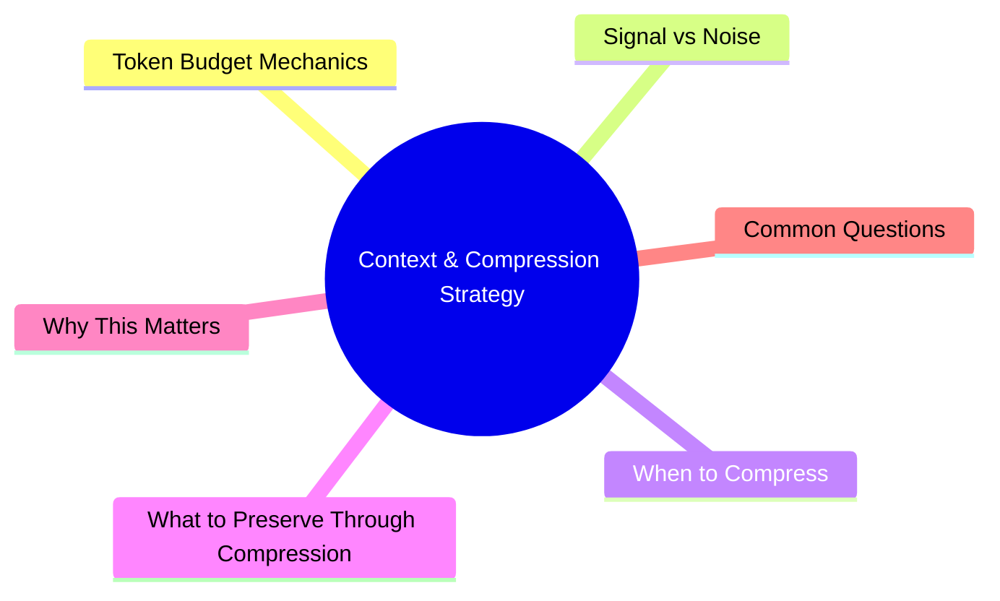

# Module 7: Context & Compression Strategy

Est. study time: 1h
Language: en



## Learning Objectives
- Track and manage token budget across session
- Distinguish signal from noise in conversation history
- Apply compression at optimal times
- Preserve critical information through compression

---

## Core Content

### Token Budget Mechanics

Each session has finite token capacity. Context window fills with:
- System instructions (AGENTS.md, skills, initial prompt)
- Conversation history (your messages + agent responses)
- Tool outputs (file reads, search results, test output)
- Code snippets (generated or read)

```text
Typical budget breakdown:
~10%  System/instructions
~30%  Your messages + spec
~40%  Tool outputs (biggest consumer)
~20%  Agent responses + code
```

> **Think**: What's the biggest token consumer? How to reduce it?
> *Answer: Tool outputs (40%). Reduce by: limiting file reads (specify exact lines), summarizing search results, avoiding full test output on failure.*

### Signal vs Noise

```text
SIGNAL (keep):                          NOISE (drop):
Design decisions                        Full error traces (keep root cause only)
Rejected alternatives                   Verbose search results
File paths created/modified             Multiple read attempts of same file
Patterns established                    Trial-and-error exploration
Current state (done/pending)            "I'll check that file" statements
User preferences expressed              Speculative output before tool call
Test results (pass/fail summary)        Full test output (unless failed)
```

Compression replaces noise with signal summary.

> **Think**: A file read returns 300 lines. You only need 3 specific functions. What to do?
> *Answer: Don't include full output in spec. Say: "Read src/utils.ts lines 45-60 and 120-135." Or ask agent to extract only relevant portions.*

### When to Compress

| Context used | Action |
|-------------|--------|
| < 30% | No compression needed |
| 30-50% | Monitor. Compress if task phase closes. |
| 50-70% | Compress proactively. Don't wait. |
| 70-90% | Compress immediately if topic allows. |
| > 90% | Restart session. Compress summary for next session. |

Compression triggers (not just by percentage):
- Task phase completes (feature done, bug found, design approved)
- Agent shows confusion (repeating questions, forgetting context)
- Before restarting session
- After long tool output (error trace, search results)

> **Think**: Context is at 60%. Task is mid-implementation. Should you compress?
> *Answer: Probably not yet if task is flowing well. But if next step involves large file reads, compress first to make room.*

### What to Preserve Through Compression

Compression summary must include enough for agent to continue without re-exploring:

```text
Must preserve:
- Current task state ("Implementing auth middleware. Routes done, need token validation.")
- Design decisions made ("We chose JWT over session. Token in httpOnly cookie.")
- Rejected alternatives ("localStorage rejected for XSS reasons.")
- Files modified/created ("src/middleware/auth.ts, src/lib/jwt.ts")
- Patterns established ("Error handling via ApiError class, not thrown strings")
- Pending next steps ("Next: implement token refresh endpoint")
- Known issues ("Refresh endpoint currently has no rate limiting")
```

> **Think**: You're compressing mid-task. How do you decide what to keep about rejected alternatives?
> *Answer: Keep only alternatives agent might reasonably re-propose. Don't keep every passing thought. "Rejected localStorage due to XSS" saves re-debate.*

### Compression Anti-Patterns

```text
Anti-pattern 1: Compressing too aggressively
  Effect: Agent loses context, re-explores, wastes tokens
  Fix: When uncertain, keep more. Conservative compression > aggressive.

Anti-pattern 2: Never compressing until forced
  Effect: Agent quality degrades gradually, hard to notice
  Fix: Set compression timer. Every 30-50 turns, compress.

Anti-pattern 3: Including noise in compression
  Effect: Compression summary is as long as original
  Fix: Use template: state → decisions → files → patterns → next steps → issues

Anti-pattern 4: Compressing without saving decisions externally
  Effect: If session dies before restart, decisions lost
  Fix: Also save key decisions to AGENTS.md or CLAUDE.md
```

> **Think**: Why is "never compressing until forced" worse than compressing too early?
> *Answer: Degradation is gradual. You don't notice agent getting worse until it's unusable. Proactive compression prevents the gradual decline.*

---

## Why This Matters

Context management is the #1 practical constraint on agentic development. Running out of context mid-task is like running out of memory mid-application. Compression is your garbage collector — run it proactively, not when the system crashes.

---

## Common Questions

**Q: How long should compression summary be?**
A: For a 50-turn complex session: 300-500 words. For simple task: 100-200 words. If longer than 500 words, you're including noise.

**Q: Can I automate compression?**
A: Some setups support auto-compression at threshold. But manual compression with judgment is generally better.

**Q: Does compression affect agent quality?**
A: Good compression → no loss. Bad compression (dropping critical decisions) → agent confusion. Conservative is safer.

---

## Examples

### Example 1: Good Compression

Before: 50-turn session implementing payment flow. 2000+ tokens of conversation.

Compression:
```text
State: Payment flow implementation. Stripe integration done.
       Refund endpoint pending.
Decisions: Stripe over Braintree (lower fees for our volume).
           Webhook secret in env, not config file. No DB storage of full card numbers.
Files: src/api/payments/create.ts, src/services/stripe.ts, src/webhooks/stripe.ts
Pattern: All API routes use asyncHandler wrapper. Errors return {error: code, message}.
Pending: POST /api/payments/refund. Must check refund window (90 days from charge date).
Issues: Webhook endpoint not tested locally (Stripe CLI not installed).
```

After: 150 words. Agent can continue immediately without re-exploring.

### Example 2: Bad Compression

"Worked on payments. Stripe integration. Some progress on refund stuff. Need to finish refund endpoint."

90 words but zero usable context. Agent will re-explore everything.

---

> **Predict**: Before reading deeper: what do you expect happens when token budget interacts with mechanics in context & compression strategy?
>
> *Answer: The system relies on token budget to keep mechanics predictable — when both apply, the stricter rule wins.*
> **Cloze**: {blank} governs how context & compression strategy behaves when multiple mechanics concerns collide.
> **Cloze**: The rule that keeps token budget correct under load is called {blank}.
> **Cloze**: In context & compression strategy, signal vs noise determines {blank}.
> **Spot the Mistake**: A developer treats token budget as optional because "it works without it." Where is the mistake?
>
> *Answer: It works only until the assumptions behind token budget are violated. The fix: treat it as part of the contract of context & compression strategy, not an optimization.*


## Key Takeaways
- Tool outputs consume ~40% of token budget. Be precise with reads.
- Compress proactively at 50-70%, not when forced at 90%.
- Preserve: state, decisions, rejected alternatives, files, patterns, next steps, issues.
- Drop: raw error traces, verbatim search results, speculative output.
- When uncertain, keep more. Conservative compression > aggressive.
- Set cadence: every 30-50 turns or when topic phase closes.

---

## Common Misconception

**"Compression loses information, so compress as little as possible."** Bad compression loses information. Good compression discards noise, preserves signal. The risk of running out of context (agent degradation) is higher than risk of compressing too much. Compress proactively.

---

## Feynman Explain

(Explain context budget to a developer. Why can't the agent just remember everything? Use working memory analogy: you can hold ~7 items in mind at once. Compression is like writing down the important things so you can forget the rest.)

---

## Reframe

(Judge: "compress at 50% every time" vs "compress only when quality degrades." Which strategy wastes more tokens overall? Which produces better output?)

---

## Drill

Take the quiz. Run: `learn.sh quiz agentic-engineering 7`
