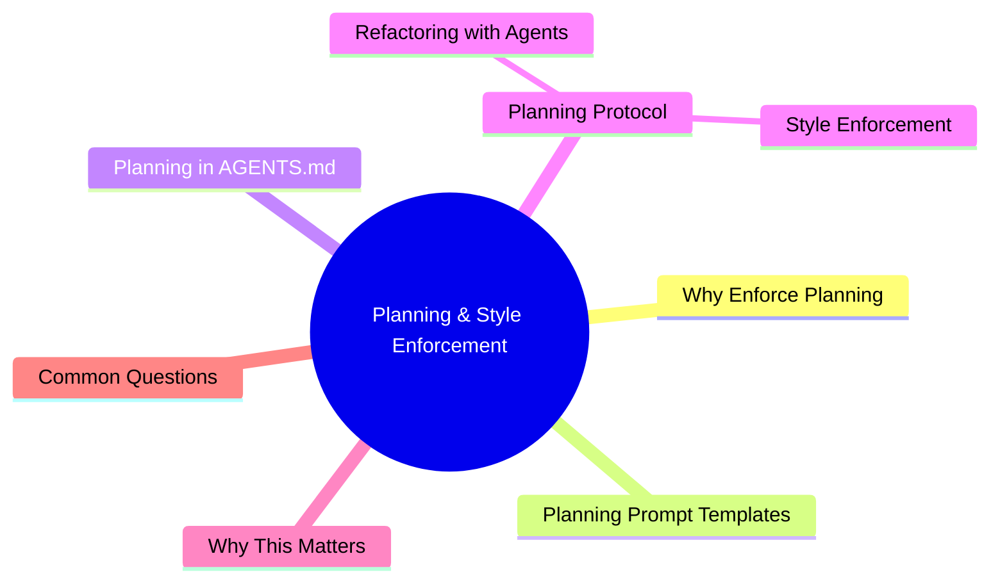

# Module 8: Planning & Style Enforcement

Est. study time: 1.5h
Language: en



## Learning Objectives
- Force agent to plan before writing code
- Define and enforce project conventions
- Use style guides effectively in prompts
- Apply safe refactoring patterns with agents

---

## Core Content

### Why Enforce Planning

Agents optimize for immediate task completion. Without planning step, agent starts writing code immediately — often wrong direction.

```text
No plan enforced:
  You: "Add user search"
  Agent: Writes search UI with client-side filtering (wrong for 10k users)
  You: "No, we need server-side search with debounce"
  Agent: Rewrites everything (wasted tokens)

Plan enforced:
  You: "Add user search. Propose approach first."
  Agent: "Client-side or server-side? User count? Search fields?"
  You: "Server-side. 10k users. email + name fields."
  Agent: Implements correctly first time.
```

> **Think**: How many tokens does "plan first" save in typical medium task?
> *Answer: 30-50% of total tokens. Rewriting wrong approach costs more than writing plan upfront.*

### Planning Prompt Templates

**Basic enforcement** (in every task prompt):

```text
Before writing code:
1. Read relevant files to understand existing patterns
2. Propose implementation approach with file list
3. I will review and approve before you begin
```

**Structured planning** (for complex tasks):

```text
Plan format:
- Approach: [one-paragraph summary]
- Files to modify: [list]
- Files to create: [list]
- Key design decisions: [3-5 bullet points]
- Risks/unknowns: [what you're unsure about]
- Estimated verification: [how you'll confirm it works]

Do NOT start implementation until I approve this plan.
```

> **Think**: What happens if you don't include "I will review and approve before you begin"?
> *Answer: Agent may treat plan as suggested direction and start implementing without waiting. Explicit approval gate prevents premature implementation.*

### Planning in AGENTS.md

Make planning default behavior for your project:

```text
## Planning Protocol
For any task beyond 1-file change:
1. Read relevant files (max 5 tool calls)
2. Propose approach with file list
3. Wait for approval before implementing
```

This loads every session, no need to repeat.

> **Think**: Should 1-line bug fixes also require planning?
> *Answer: No. Planning overhead exceeds benefit for trivial fixes. Reserve planning for multi-file or complex tasks.*

### Style Enforcement

Agents write in their own style unless told otherwise. Define style in AGENTS.md or per-task.

**What to specify:**

```text
Styling conventions:
- Import order: React → third-party → internal (absolute) → relative
- Naming: PascalCase components, camelCase functions, SCREAMING_SNAKE constants
- Error handling: Use Result type, not thrown exceptions
- File structure: One component per file. Component + test colocated.
- CSS: Tailwind utility classes. No CSS modules.
- State: Zustand stores in src/stores/. No Redux.
- API: tRPC router in src/server/api/. No REST.
```

**Enforcement methods:**

| Method | Strength | Overhead | Best for |
|--------|----------|----------|----------|
| AGENTS.md conventions | Passive (agent reads) | Low | Established rules |
| Per-task style block | Active (agent follows) | Medium | Task-specific rules |
| Verification gate | Hard (agent must pass) | High | Critical rules |
| Linter auto-fix | Automatic | Zero | Formatting only |

> **Think**: Why is "linter auto-fix" zero overhead but only for formatting?
> *Answer: Linter runs post-hoc, fixes automatically. Agent doesn't need to think about it. But linters can't enforce architectural conventions (file structure, naming patterns).*

### Refactoring with Agents

Safe refactoring pattern:

```text
1. EXPLORE: Agent maps all usages of the code to refactor
2. PLAN: Agent proposes refactor approach + impact analysis
3. APPROVE: You review plan for missed dependencies
4. EXECUTE: Agent performs refactor in small steps
5. VERIFY: Run typecheck + lint + test after each step
6. REVIEW: You inspect diff for correctness

Critical rules:
- One rename/reorg per step
- Verify after each step (not batch)
- Never refactor and add features in same step
- Keep original code until new code verified
```

**Refactoring anti-patterns:**

```text
Anti-pattern: Refactor + add feature in one go
  Problem: Bug could be in refactor OR feature. Hard to diagnose.
  Fix: Separate into two tasks.

Anti-pattern: Rename without checking all references
  Problem: Agent may miss string references, config files, or comments.
  Fix: Ask agent to find ALL usages before renaming.

Anti-pattern: Trust agent's grep results without verification
  Problem: Agent's grep may miss indirect references (dynamic imports, computed keys).
  Fix: Run typecheck after rename to catch missed references.
```

> **Think**: A rename task needs to update 15 files. Should agent batch all in one step?
> *Answer: No. Do 3-5 files per step, verify after each. If something breaks, you know which step caused it. Batching 15 files risks cascade failure.*

---

## Why This Matters

Without enforced planning, agent writes code immediately — often wrong, requiring rewrite. Without style enforcement, agent produces inconsistent code that needs human cleanup. Planning and style are force multipliers: invest upfront tokens, save massive rework.

---

## Common Questions

**Q: How detailed should style enforcement be?**
A: Enough to produce code you'd accept without manual reformatting. If you'd fix it manually, specify it.

**Q: What if AGENTS.md style rules are long?**
A: Keep them. 200 tokens of style rules saves thousands of tokens in rework. One-time cost per session.

**Q: Can agent enforce style automatically?**
A: Formatting → linter. Architecture → prompts. Naming → AGENTS.md. Don't rely on agent alone for style enforcement.

---

## Examples

### Example 1: Planning Gate

Bad: No gate
```text
You: "Add dark mode"
Agent: Writes CSS variables, toggle button, local storage. Uses class-based dark mode.
(Project uses CSS variables with data-theme attribute. Wrong approach.)
```

Good: With gate
```text
You: "Add dark mode. Propose approach first."
Agent: "CSS variables with data-theme? Or class toggle? Or CSS nesting?"
You: "data-theme attribute on html element. Variables in globals.css."
Agent: Implements correctly. First try.
```

### Example 2: Safe Rename

```python
# Step 1: Map usages
Agent: "UserService.findUsers() used in 12 files: routes/users.py, tests/test_users.py..."

# Step 2: Rename
Agent renames UserService.findUsers() → UserService.searchUsers()

# Step 3: Verify
Agent runs typecheck → passes
Agent runs tests → all pass

# Step 4: You review
Diff shows 12 files updated correctly.
```

---

> **Predict**: Before reading deeper: what do you expect happens when planning interacts with planning prompt in planning & style enforcement?
>
> *Answer: The system relies on planning to keep planning prompt predictable — when both apply, the stricter rule wins.*
> **Cloze**: {blank} governs how planning & style enforcement behaves when multiple planning prompt concerns collide.
> **Cloze**: The rule that keeps planning correct under load is called {blank}.
> **Cloze**: In planning & style enforcement, templates determines {blank}.
> **Spot the Mistake**: A developer treats planning as optional because "it works without it." Where is the mistake?
>
> *Answer: It works only until the assumptions behind planning are violated. The fix: treat it as part of the contract of planning & style enforcement, not an optimization.*


## Key Takeaways
- Enforce plan-before-code with explicit approval gate
- Put planning protocol in AGENTS.md for automatic loading
- Style enforcement: AGENTS.md (low), per-task (medium), verification gate (high)
- Linter handles formatting. Prompts handle architecture.
- Refactor in small steps, verify after each step
- Never refactor + feature in same step
- Planning saves 30-50% tokens by preventing wrong direction

---

## Common Misconception

**"Planning wastes tokens — the agent should just write code."** Planning saves tokens. Wrong-first-direction costs 2-3x of planning overhead. A 100-token plan prevents 1000-token rewrite. Plan is cheap insurance.

---

## Feynman Explain

(Explain "plan first" to a developer who hates writing specs. Why does planning save time even though it feels like slowdown? Use construction analogy: measure twice, cut once.)

---

## Reframe

(Judge: "always enforce planning" vs "plan only for complex tasks." How do you define "complex"? What's the cost of false positive (plan for trivial task)? What's the cost of false negative (no plan for complex task)?)

---

## Drill

Take the quiz. Run: `learn.sh quiz agentic-engineering 8`
