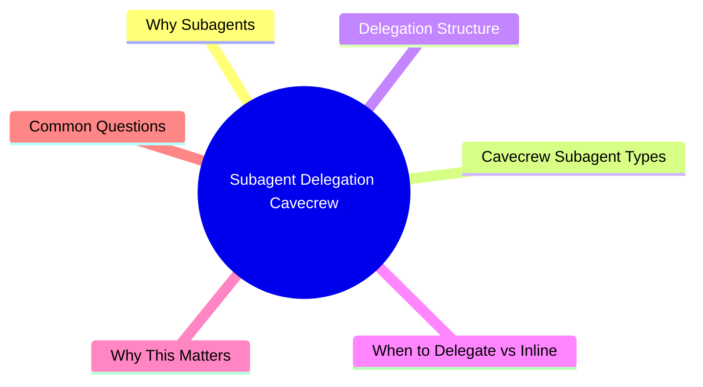

# Module 9: Subagent Delegation (Cavecrew)

Est. study time: 1h
Language: en



## Learning Objectives
- Distinguish when to use subagents vs inline work
- Use Cavecrew subagent types: Investigator, Builder, Reviewer
- Structure delegation prompts for subagents
- Manage context across subagent boundaries

---

## Core Content

### Why Subagents

Main agent context is precious. Each tool call and response consumes space. Subagents run in separate context — they explore, build, or review without polluting main thread.

```text
Inline work: Main context fills with exploration noise
    You: "Find all API routes"
    Agent reads 20 files... context now at 60%
    Agent still hasn't started implementation

Subagent delegation: Main context stays clean
    You: "Use investigator to map API routes"
    Subagent explores, returns compressed summary (200 tokens)
    Main agent uses summary → context still at 20%
    Agent starts implementation with full budget
```

> **Think**: Main context is at 70%. You need to research a complex database schema. Should you do it inline or delegate?
> *Answer: Delegate to investigator subagent. Schema exploration will consume 1000s of tokens. Subagent keeps that noise separate, returns only compressed summary.*

### Cavecrew Subagent Types

**Investigator** — Read-only code locator:
```text
Input: "Find all WebSocket connections and their handlers"
Output: File:line table. Compressed. No suggestions, no fixes.

Best for: Codebase mapping, usage analysis, impact assessment
Context saved: ~60% vs inline exploration
```

**Builder** — Surgical 1-2 file edit:
```text
Input: "Change function name X to Y in file Z"
Output: Diff receipt. Refuses 3+ file scope.

Best for: Typo fixes, single-function rewrites, mechanical renames
Context saved: Keeps large diffs out of main thread
```

**Reviewer** — Diff/branch reviewer:
```text
Input: "Review the diff for security issues"
Output: One line per finding. Severity-tagged. No praise, no scope creep.

Best for: PR review, pre-commit audit, post-implementation check
Context saved: Review findings as single summary, not full diff discussion
```

> **Think**: You need to rename a function used across 15 files. Which subagent to use?
> *Answer: Investigator first (map all usages) → You review → Builder (rename in batches, 3-5 files per call) → Reviewer (verify diff).*

### Delegation Structure

Effective subagent prompt:

```text
Task type: [investigate | build | review]
Scope: [exact files, exact question]
Output format: [what you need back]
Constraints: [boundaries, what NOT to do]
Main context: [compressed context so subagent isn't blind]
```

Example:

```text
Task type: investigate
Scope: Find all files importing from 'old-lib'. Check src/ and tests/ recursively.
Output format: File:line. Group by directory.
Constraints: Do NOT modify any files. Do NOT suggest fixes.
Main context: We're migrating from old-lib to new-lib. tracked in AGENTS.md.
```

Subagent returns compressed output (~60% smaller than inline equivalent).

> **Think**: Why include "main context" in delegation prompt? Doesn't subagent run fresh?
> *Answer: Subagent starts blank. Including key context (project goals, constraints, recent decisions) prevents it from making wrong assumptions.*

### When to Delegate vs Inline

| Factor | Delegate | Inline |
|--------|----------|--------|
| Context budget | < 40% remaining | > 60% remaining |
| Task scope | Isolated, bounded | Tightly coupled to main task |
| Output size | Large expected | Small expected |
| Parallel need | Yes (multiple delegations) | No |
| Decision dependency | Low (exploration only) | High (needs your input mid-task) |

Rule: If task would consume >20% of remaining context budget → delegate. If task output is simple "yes/no" or small diff → inline.

> **Think**: Main context is at 50%. You need to check if a function is used anywhere. Delegate or inline?
> *Answer: Delegate. Grep search + reading results consumes tokens. Subagent does it, returns "Used in 3 files: [file:line]." About 50 tokens.*

---

## Why This Matters

Subagent delegation is the most powerful context management technique. It lets you parallelize work (multiple subagents), protect main context from exploration noise, and receive compressed outputs. Cavecrew makes this structured with predefined agent types.

---

## Common Questions

**Q: Can subagents create subagents?**
A: Typically no (one level deep). Subagent complexity is bounded.

**Q: Do subagents share context?**
A: No. Each subagent runs fresh. You must pass relevant context in delegation prompt.

**Q: Can I use subagents for non-coding tasks?**
A: Yes. Investigator for research, Builder for document edits, Reviewer for spec review.

---

## Examples

### Example 1: Parallel Investigation

Task: Add payment method to checkout. Need to understand existing patterns.

1. Delegate investigator A: "Map current checkout flow files and data flow"
2. Delegate investigator B: "Find all payment-related code and config"
3. Delegate investigator C: "List test patterns for checkout tests"

All three run in parallel (separate contexts). Each returns compressed summary. Main agent synthesizes and proposes approach. Total: 1 min, main context barely touched.

### Example 2: Pre-Commit Review

After feature implementation (main context at 75%):

Delegate reviewer: "Review the git diff for: correctness, security, style violations. Return severity-tagged findings."

Reviewer checks diff without polluting main context. Returns 3-5 line summary. If no critical issues → commit. If issues → fix inline with remaining context budget.

---

> **Predict**: Commit to an answer: does subagent delegation (cavecrew) get simpler or harder once cavecrew subagent enters the picture?
>
> *Answer: Harder locally, simpler globally: individual pieces carry more rules, but the overall system needs fewer special cases.*
> **Cloze**: {blank} governs how subagent delegation (cavecrew) behaves when multiple types concerns collide.
> **Cloze**: The rule that keeps cavecrew subagent correct under load is called {blank}.
> **Cloze**: In subagent delegation (cavecrew), delegation structure determines {blank}.
> **Spot the Mistake**: Code review note: someone applies types everywhere "to be safe" in a subagent delegation (cavecrew) codebase. Spot the mistake.
>
> *Answer: Blanket application hides which spots actually need types. Apply it where the semantics demand it, and document why.*


## Key Takeaways
- Subagents run in separate context. Protect main thread from exploration noise.
- Cavecrew types: Investigator (locate), Builder (1-2 file edit), Reviewer (diff review)
- Subagent output ~60% smaller than inline equivalent
- Delegate when task would consume >20% of remaining context budget
- Pass key context in delegation prompt (subagent starts blank)
- Subagents can run in parallel for independent tasks

---

## Common Misconception

**"Subagents are slower than inline because of overhead."** Subagent overhead (create + return) is ~5 seconds. Exploration inline costs 500+ tokens of context space. Main context budget is finite — protecting it with subagents is faster in practice because you maintain high-quality context longer.

---

## Feynman Explain

(Explain subagent delegation to a manager. Why not have one person do everything? Why split work across team members even though coordination overhead exists?)

---

## Reframe

(Judge: "always delegate exploration" vs "never delegate, keep everything inline." What's the hidden context cost of each choice? When does delegation overhead exceed benefit?)

---

## Drill

Take the quiz. Run: `learn.sh quiz agentic-engineering 9`
