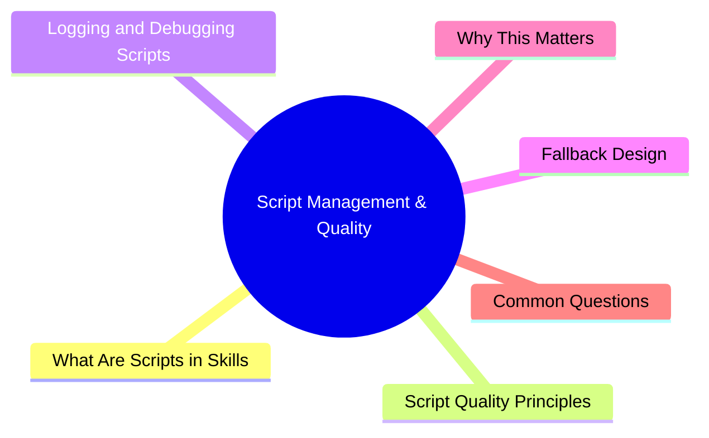

# Module 10: Script Management & Quality

Est. study time: 1.5h
Language: en



## Learning Objectives
- Write and test skill scripts effectively
- Apply logging and idempotency to scripts
- Design fallback behavior for edge cases
- Use quality checklist before publishing scripts

---

## Core Content

### What Are Scripts in Skills

Scripts are deterministic executable code attached to a skill. Unlike LLM instructions (flexible, interpreted fresh each time), scripts produce the same output for same input every execution.

```text
Skill with script:
  Name: "test-watcher"
  Trigger: on file change in src/
  Script:
    - Run `npm test -- --changed` (only changed files)
    - If tests pass: print "✅"
    - If tests fail: print first failure + exit 1
    - If no tests match: print "No affected tests"

Without script (instructions only):
  "Watch for file changes and run relevant tests."
  Agent decides how to do this. May work, may not.
```

> **Think**: When is a script better than LLM instructions for the same task?
> *Answer: When task is deterministic and failure is unacceptable. Build steps, CI checks, data validation. LLM for judgment tasks.*

### Script Quality Principles

**Fail fast, fail loud:**

```bash
#!/bin/bash
# Bad: silent failure
npm test || true

# Good: fail loud
npm test || { echo "❌ Tests failed. Aborting."; exit 1; }
```

**Idempotent (safe to re-run):**

```bash
# Bad: destructive, not idempotent
rm -rf dist/
mkdir dist/

# Good: safe to re-run
rm -rf dist/ 2>/dev/null
mkdir -p dist/
```

**Graceful edge cases:**

```bash
# Bad: crashes on empty directory
for file in src/*.ts; do
  npx tsc --noEmit "$file"
done

# Good: handles empty
for file in src/*.ts; do
  [ -f "$file" ] || continue
  npx tsc --noEmit "$file"
done
```

> **Think**: Why is `npm test || true` dangerous?
> *Answer: Silently swallows test failures. Downstream processes think everything passed. Always fail loud when checks fail.*

### Logging and Debugging Scripts

Every script should produce enough output to diagnose failure:

```text
Good log output:
  [test-watcher] Running tests for changed files...
  [test-watcher] Found 3 changed files: auth.ts, user.ts, product.ts
  [test-watcher] Running: npm test -- --changed
  [test-watcher] ✅ All 45 tests passed (12.3s)
  [test-watcher] Done.

Bad log output:
  Running tests...
  Done.
```

Logging rules:
- Prefix with `[skill-name]` to identify source
- Print inputs (which files, what args)
- Print outputs (pass/fail, metrics, duration)
- Print errors with enough context to fix
- Use consistent format (machine+human readable)

> **Think**: A deploy script fails. What should logs contain?
> *Answer: Which environment? What commit? What step failed? What error? Enough info to fix without re-running entire script.*

### Fallback Design

Scripts encounter unexpected situations. Design for failure:

```bash
# Primary path
if npm run build; then
  echo "Build succeeded"
  exit 0
fi

# Fallback: retry with clean cache
echo "Build failed. Retrying with clean cache..."
npm cache clean --force
if npm run build; then
  echo "Build succeeded (clean cache)"
  exit 0
fi

# Final fallback: report
echo "❌ Build failed even after cache clean."
echo "Manual intervention required."
exit 1
```

Fallback patterns:

| Fallback Type | When | Action |
|--------------|------|--------|
| Retry | Transient failure | Try once more |
| Degrade | Non-critical step | Skip, warn, continue |
| Escalate | Unknown error | Log full context, exit, notify |
| Default | Optional value | Use fallback value, log warning |

> **Think**: A script checks if a config file exists. It doesn't. What's the right fallback?
> *Answer: Depends on criticality. Required config → exit with error + expected location. Optional config → use defaults + log warning.*

### Quality Checklist

Before publishing any script-backed skill:

```text
[ ] Dry-run mode: runs without side effects, prints what it WOULD do
[ ] Edge cases tested: empty input, missing files, network errors, permission denied
[ ] Error messages readable without domain knowledge
[ ] Token cost measured: script doesn't burn excessive tokens
[ ] Idempotent: re-running same state produces same result
[ ] Human escape hatch: override flag (--force, --skip)
[ ] Logs sufficient: input + output + errors + duration
[ ] Fallback defined: what happens when primary path fails
[ ] Timeout defined: max execution time
[ ] Dependencies documented: what must be installed
```

> **Think**: Which checklist item is most commonly skipped? What's the consequence?
> *Answer: Edge cases. Script works on happy path, crashes on empty input or missing file. Leading to silent failures or confusing errors.*

---

## Why This Matters

Scripts are the deterministic backbone of your skill system. Bad scripts produce unreliable automation → you stop trusting the skill system. Good scripts — with idempotency, logging, fallbacks — make automation reliable. Quality checklist prevents shipping fragile scripts.

---

## Common Questions

**Q: Should all skills have scripts?**
A: No. Flexible skills (LLM instructions only) are fine for judgment tasks. Add scripts for deterministic steps.

**Q: How do I test a script in isolation?**
A: Create a test directory with sample inputs. Run script against it. Verify output. Automate with CI if critical.

**Q: What language should scripts be in?**
A: Bash for simple. Python/Node for complex. Match your team's expertise.

---

## Examples

### Example 1: Quality Script with Fallbacks

```bash
#!/bin/bash
set -euo pipefail

SKILL_NAME="deploy-check"
ENV="${1:-staging}"
COMMIT="${2:-HEAD}"

echo "[$SKILL_NAME] Environment: $ENV, Commit: $COMMIT"

# Step 1: Typecheck
echo "[$SKILL_NAME] Running typecheck..."
if ! npm run typecheck 2>/dev/null; then
  echo "[$SKILL_NAME] ❌ Typecheck failed. Fix before deploy."
  exit 1
fi
echo "[$SKILL_NAME] ✅ Typecheck passed"

# Step 2: Tests (non-critical, degrade on fail)
echo "[$SKILL_NAME] Running tests..."
if npm test -- --silent; then
  echo "[$SKILL_NAME] ✅ All tests passed"
else
  echo "[$SKILL_NAME] ⚠️ Tests failed. Continuing (non-blocking)..."
fi

# Step 3: Build
echo "[$SKILL_NAME] Building..."
if ! npm run build; then
  echo "[$SKILL_NAME] Build failed. Retrying with clean cache..."
  rm -rf .cache/
  npm run build || {
    echo "[$SKILL_NAME] ❌ Build failed after retry."
    exit 1
  }
fi
echo "[$SKILL_NAME] ✅ Build succeeded"

echo "[$SKILL_NAME] ✅ Deploy check complete. Ready for $ENV."
```

### Example 2: Dry-Run Mode

```bash
DRY_RUN="${DRY_RUN:-false}"

delete_unused_assets() {
  local file="$1"
  if [ "$DRY_RUN" = "true" ]; then
    echo "[dry-run] Would delete: $file"
  else
    rm "$file"
    echo "[deleted] $file"
  fi
}
```

---

> **Predict**: Commit to an answer: does script management & quality get simpler or harder once npm test || true enters the picture?
>
> *Answer: Harder locally, simpler globally: individual pieces carry more rules, but the overall system needs fewer special cases.*
> **Cloze**: {blank} governs how script management & quality behaves when multiple [skill-name] concerns collide.
> **Cloze**: The rule that keeps npm test || true correct under load is called {blank}.
> **Cloze**: In script management & quality, scripts in skills determines {blank}.
> **Spot the Mistake**: Code review note: someone applies [skill-name] everywhere "to be safe" in a script management & quality codebase. Spot the mistake.
>
> *Answer: Blanket application hides which spots actually need [skill-name]. Apply it where the semantics demand it, and document why.*


## Key Takeaways
- Scripts = deterministic code. Same input → same output.
- Fail fast, fail loud: `exit 1` on failure, never suppress errors.
- Idempotent: safe to re-run. Same state → same result.
- Log: prefix with skill name, print inputs/outputs/errors/duration.
- Fallbacks: retry → degrade → escalate → default.
- Quality checklist: dry-run, edge cases, readable errors, token cost, idempotent, escape hatch, logs, fallback, timeout, dependencies.
- Not every skill needs a script. Judgment tasks → flexible. Deterministic tasks → script.

---

## Common Misconception

**"A script that works once is good enough."** Scripts run many times across different states. An empty directory, missing environment variable, or network timeout will expose fragility. Test edge cases before publishing. The cost of fixing a broken script mid-deploy is 100x the cost of testing ahead.

---

## Feynman Explain

(Explain idempotency to a non-programmer. Why can't a script just "do the thing" without worrying about what happened before? Use microwave example: pressing "start" twice doesn't double-cook your food. Good scripts behave like that.)

---

## Reframe

(Judge: "always write scripts for every step" vs "scripts only for critical paths." Where's the line? When does a script cause more problems than it solves?)

---

## Drill

Take the quiz. Run: `learn.sh quiz agentic-engineering 10`
