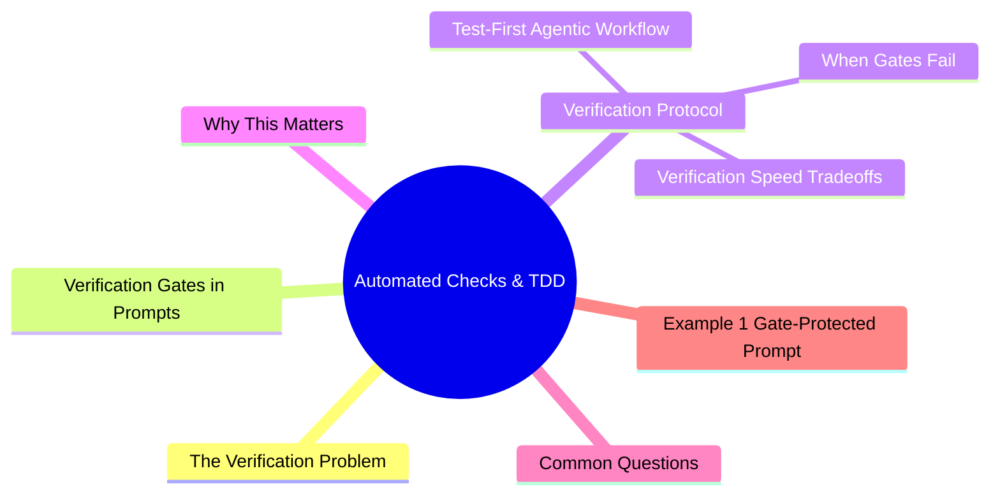

# Module 11: Automated Checks & TDD

Est. study time: 1.5h
Language: en



## Learning Objectives
- Integrate typecheck, lint, and test into agent prompts
- Apply test-first workflow with agents
- Design verification gates that auto-fail before review
- Balance verification speed vs thoroughness

---

## Core Content

### The Verification Problem

Agent code looks plausible. Often wrong in subtle ways. Without automated verification, you must manually inspect every line — defeating purpose of agent.

Solution: **verification gates** — automated checks that run after each implementation step.

```text
Without gate: Agent writes code → you review → find bug → agent fixes → you re-review
With gate:    Agent writes code → typecheck + lint + test pass → you review → approve
```

> **Think**: What percentage of common agent bugs are caught by typecheck + lint + test?
> *Answer: ~80%. Typecheck catches type errors, lint catches style/pattern violations, tests catch logic errors. Remaining 20% need human review.*

### Verification Gates in Prompts

Embed verification into task prompt:

```text
Implementation protocol:
1. Write code
2. Run: npm run typecheck (fix until clean)
3. Run: npm run lint (fix until clean)
4. Run: npm test -- --related (affected tests pass)
5. Only then present diff for review

Do NOT skip steps 2-4. If any step fails, fix and re-run before moving on.
```

**In AGENTS.md:**

```text
## Verification Protocol
All code changes must pass before presenting to human:
1. TypeScript check: npm run typecheck
2. Linting: npm run lint (or eslint)
3. Tests: npm test -- --related
4. Build: npm run build (for deployable changes)
```

> **Think**: Why specify `--related` for tests instead of full suite?
> *Answer: Full suite may take 10+ minutes. Related tests take seconds. Run full suite in CI. Fast verification gates keep agent loop tight.*

### Test-First Agentic Workflow

Test-first with agents is powerful but needs structure:

```text
1. SPEC: You write failing test (expresses desired behavior)
2. IMPLEMENT: Agent writes code to pass test
3. VERIFY: Agent runs test → green
4. REFINE: You review test + code, iterate

Benefits:
- Test = executable spec (no ambiguity)
- Agent knows exactly when done (test passes)
- Regression safety (test stays forever)
- You verify intent before implementation
```

Example:

```text
You write test:
  test('POST /api/users returns 201 with valid data and 400 with missing email', ...)

Agent prompt:
  "Implement the endpoint so this test passes.
   Do NOT modify the test file.
   Run test after implementation to confirm."

Agent: reads test → implements → runs → test passes → presents diff
```

> **Think**: Why should YOU write the test, not the agent?
> *Answer: Test encodes YOUR intent. If agent writes test too, it may encode wrong assumptions. You write test = spec. Agent implements to spec.*

### Verification Speed Tradeoffs

| Gate | Speed | Catch Rate | When to skip |
|------|-------|-----------|--------------|
| Typecheck | Fast (<5s) | ~40% of bugs | Never |
| Lint | Fast (<5s) | ~10% of bugs | Initial exploration |
| Unit tests (related) | Medium (10-60s) | ~20% of bugs | Before human review |
| Full test suite | Slow (1-10m) | ~30% of bugs | CI only |
| Build | Medium (30-120s) | ~10% of bugs | Before deploy |
| TypeScript strict | Fast + thorough | ~50% of bugs | If project supports it |

Order: typecheck → lint → related tests → build. Fail fast, fail cheap.

> **Think**: Agent is exploring a large refactor. Should it run full test suite on every change?
> *Answer: No. Related tests only during iteration. Full suite in CI. Speed matters during agent loop.*

### When Gates Fail

Agent hits verification failure. Proper response:

```text
1. Read error message (don't guess)
2. Fix the issue (not the symptom)
3. Re-run gate
4. If stuck 3+ times → stop and tell human

Anti-patterns:
- Agent disabling the gate ("skip typecheck for now")
- Agent patching symptom not cause
- Agent rewriting test instead of fixing code
- Agent ignoring failure ("it's probably fine")
```

**Guard prompt:**

```text
If typecheck/lint/test fails:
1. Read the error. Understand root cause.
2. Fix the actual issue. Not a workaround.
3. Re-run the gate.
4. If still failing after 3 attempts → stop and report to me.
Do NOT: skip the gate, modify test files, or apply workarounds.
```

> **Think**: Agent can't fix a type error after 3 attempts. What's likely wrong?
> *Answer: Wrong approach, misunderstanding of types, or project has unusual type setup. Stop and investigate. Don't keep trying same approach.*

---

## Why This Matters

Without verification gates, agent output quality is unreliable. With gates, 80% of common bugs are caught automatically. Your review time drops from line-by-line to spot-checking. Verification is the difference between trusting and hoping.

---

## Common Questions

**Q: Should I run verification on every code change, even small ones?**
A: Yes. Typecheck and lint are fast (<5s). Run them always. Tests on related files.

**Q: What if project has no tests?**
A: Start with typecheck + lint. Those alone catch ~50% of agent bugs. Add tests gradually.

**Q: Can verification run in parallel with implementation?**
A: Typecheck/lint can be continuous (file watcher). Tests need implementation first.

---

## Examples

### Example 1: Gate-Protected Prompt

```text
Task: Add pagination to user list endpoint.
Protocol:
1. Read current endpoint pattern
2. Implement pagination
3. Run: npm run typecheck (must pass)
4. Run: npm run lint (must pass)
5. Run: npm test -- --related (must pass)
6. Present diff only after steps 3-5 pass
```

Agent implements → typecheck fails (missing type) → fixes → typecheck passes → lint passes → test passes → presents diff. 2 minutes. Clean.

### Example 2: Test-First Workflow

You write:
```typescript
test('search returns results matching query', async () => {
  const results = await searchAPI.query('alice')
  expect(results).toHaveLength(1)
  expect(results[0].name).toBe('Alice')
})

test('search returns empty array for no match', async () => {
  const results = await searchAPI.query('nonexistent')
  expect(results).toEqual([])
})
```

Agent prompt: "Implement searchAPI.query to pass these tests. Tests are correct and final."

Agent implements → runs tests → green. Done.

---

> **Predict**: Before reading deeper: what do you expect happens when --related interacts with the verification in automated checks & tdd?
>
> *Answer: The system relies on --related to keep the verification predictable — when both apply, the stricter rule wins.*
> **Cloze**: {blank} governs how automated checks & tdd behaves when multiple the verification concerns collide.
> **Cloze**: The rule that keeps --related correct under load is called {blank}.
> **Cloze**: In automated checks & tdd, problem determines {blank}.
> **Spot the Mistake**: A developer treats --related as optional because "it works without it." Where is the mistake?
>
> *Answer: It works only until the assumptions behind --related are violated. The fix: treat it as part of the contract of automated checks & tdd, not an optimization.*


## Key Takeaways
- Verification gates catch ~80% of agent bugs automatically
- Gate order: typecheck → lint → related tests → build
- Embed verification protocol in AGENTS.md (loads every session)
- Test-first: you write test (spec), agent implements to pass
- Run related tests during iteration, full suite in CI
- If gate fails 3+ times → stop and investigate
- Warn agent: do NOT skip gates, modify tests, or apply workarounds

---

## Common Misconception

**"Tests are for CI, not for agent workflow."** Tests are the most efficient feedback mechanism for agents. A failing test tells agent exactly what's wrong — faster than you can describe it in prose. Tests are executable specs that never misinterpret.

---

## Feynman Explain

(Explain verification gates to a junior developer. Why not just trust the agent and check later? Use cooking analogy: taste while cooking, not just at serving.)

---

## Reframe

(Judge: "run full test suite after every change" vs "run only typecheck, trust agent for correctness." Where's the right balance? When does over-verification hurt more than help?)

---

## Drill

Take the quiz. Run: `learn.sh quiz agentic-engineering 11`
