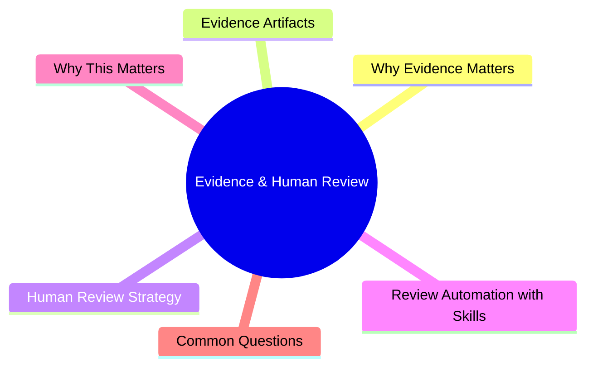

# Module 12: Evidence & Human Review

Est. study time: 1h
Language: en



## Learning Objectives
- Collect reviewable artifacts from agent work
- Structure effective human review process
- Automate review with review checklist skills
- Balance trust vs verification

---

## Core Content

### Why Evidence Matters

Agent works fast. You can't watch every action. Evidence artifacts let you verify after the fact.

```text
No evidence:
  Agent: "Done"
  You: "What did you change?"
  Agent: "The things we discussed"
  You: (must re-read everything)

With evidence:
  Agent: "Done. Files modified: auth.ts, login.tsx. Diff attached. Tests pass."
  You: reviews diff in 30 seconds. Approve.
```

> **Think**: What's the minimum evidence you need to approve an agent's work?
> *Answer: Diff (what changed), test results (it works), decisions made (why this approach). 30-second review.*

### Evidence Artifacts

| Artifact | Format | What it proves |
|----------|--------|---------------|
| Diff/patch | git diff | Exactly what changed |
| Test results | stdout log | Behaviors preserved/added |
| Typecheck/lint output | stdout log | Code quality maintained |
| Decision log | Markdown | Design choices and tradeoffs |
| Coffee-scent receipt | Markdown | Compressed summary of what happened |

**Evidence prompt in every task:**

```text
After implementation, provide:
1. Summary of what was done (2-3 sentences)
2. List of files created/modified
3. Key design decisions made (and why)
4. Verification results (typecheck ✅ lint ✅ test ✅)
5. Any risks or tradeoffs worth noting
```

> **Think**: When is a decision log more important than the diff?
> *Answer: When approach is contentious or has tradeoffs. "Chose X over Y because Z" helps you evaluate if right call was made without re-analyzing the problem.*

### Human Review Strategy

Review in layers, not single pass:

```text
Layer 1: Evidence check (30s)
  - Verify evidence exists and is coherent
  - Check summary matches files modified
  - Confirm verification gates passed

Layer 2: Diff scan (2-5 min)
  - Scan for: logic errors, security issues, unconventional patterns
  - Don't read every line. Trust verification gates for mechanics.
  - Focus on: business logic, data flow, auth/permissions

Layer 3: Spot check (5-10 min for complex)
  - Read critical files fully (core logic, security-sensitive)
  - Run modified feature manually if applicable
  - Check edge cases agent may have missed
```

**When to fully read vs spot check:**

| Situation | Review approach |
|-----------|----------------|
| Bug fix (clear scope) | Spot check diff |
| New feature (complex) | Full read + manual test |
| Refactor (mechanical) | Trust gates, scan diff |
| Security-sensitive | Full read + audit |
| Boilerplate/tests | Trust gates, sample check |

> **Think**: Why scan diff before reading full files?
> *Answer: Diff shows only what changed. Full files include unchanged code — reading them wastes time. Scan diff first, drill into full files only if something looks suspicious.*

### Review Automation with Skills

Create a review skill that enforces review checklist:

```text
Skill: "review-check"
Type: flexible
Instructions:
  Review this diff for:
  1. Correctness: Logic errors, off-by-one, wrong conditions
  2. Security: Injections, auth bypass, data exposure
  3. Conventions: Follows project patterns from AGENTS.md
  4. Edge cases: What happens on empty/null/unexpected input
  5. Testing: Are there tests? Do they cover edge cases?

  For each finding: tag severity (critical/major/minor), file:line, suggested fix.
  No praise. No "looks good" without specific verification.
```

Run after agent implementation to get structured review before your human review.

> **Think**: Why "no praise" in review skill instructions?
> *Answer: Praise wastes tokens. Review is for finding issues. Agent-generated praise ("good work!") adds no value. Output only actionable findings.*

### Trust Calibration

Trust scales with evidence quality, not familiarity:

```text
Low trust (new agent, new codebase):
  - Full diff review
  - Manual test of feature
  - Review all test files
  - Run verification gates yourself

Medium trust (familiar setup, good track record):
  - Scan diff
  - Spot-check critical files
  - Verify test results
  - Trust gates passed

High trust (established patterns, consistent agent):
  - Summary review
  - Security check of changed files
  - Trust gates + agent's own review
```

**Trust degrades** after: incorrect code, missed gate, unexplained changes.

> **Think**: Trust calibrated right. Agent delivers 10 clean PRs. Next PR is complex auth change. What review level?
> *Answer: Escalate trust for high-risk changes regardless of history. Auth/permissions always get full review. Trust applies to routine work, not security boundaries.*

---

## Why This Matters

Without evidence artifacts, you're flying blind. With evidence, review takes 30s-5min instead of 30min. Review automation catches issues before your review, compounding efficiency. Trust calibration ensures you don't miss critical bugs or waste time on routine work.

---

## Common Questions

**Q: Should agent write review of its own code?**
A: Yes—with a review skill. Agent's self-review catches many issues before you see it.

**Q: How do I know if agent is lying about verification results?**
A: If trust is low, run verification yourself. If trust is medium, spot-check one result.

**Q: What if evidence is missing or incomplete?**
A: Ask agent to provide it. If agent can't produce coherent evidence, something is wrong.

---

## Examples

### Example 1: Evidence Receipt

After completing a task, agent provides:

```text
## Summary
Added email uniqueness check to user registration.
Returns 409 for duplicate (case-insensitive). Tests added.

## Files
- src/api/auth/register.ts (modified: added email check)
- src/api/auth/__tests__/register.test.ts (modified: added 2 test cases)

## Decisions
- Case-insensitive check: existing emails "User@Example.com" and "user@example.com" are duplicates
- Used raw SQL `LOWER(email) = LOWER($1)` (existing ORM can't express this efficiently)

## Verification
- typecheck ✅
- lint ✅
- test ✅ (45/45, including 2 new)

## Risks
- Performance: full table scan on email column. Not an issue for <100k users.
```

You review: 30 seconds. Approve.

### Example 2: Trust Calibration Applied

Day 1: Full review of every agent output. 30 min.

Day 5: Agent is consistent. Gates always pass. Review becomes scan + spot check. 5 min.

Week 3: Agent handles routine tasks end-to-end. You review only summary + security-critical files. 2 min.

Month 2: New team member reports a bug agent introduced in authentication. Trust resets for auth-related changes. You now review auth diffs fully.

---

> **Predict**: Commit to an answer: does evidence & human review get simpler or harder once matters enters the picture?
>
> *Answer: Harder locally, simpler globally: individual pieces carry more rules, but the overall system needs fewer special cases.*
> **Cloze**: {blank} governs how evidence & human review behaves when multiple evidence artifacts concerns collide.
> **Cloze**: The rule that keeps matters correct under load is called {blank}.
> **Cloze**: In evidence & human review, human review determines {blank}.
> **Spot the Mistake**: Code review note: someone applies evidence artifacts everywhere "to be safe" in a evidence & human review codebase. Spot the mistake.
>
> *Answer: Blanket application hides which spots actually need evidence artifacts. Apply it where the semantics demand it, and document why.*


## Key Takeaways
- Collect evidence: diff, test results, decisions, gate outputs
- Prompt agent to provide summary + files + decisions + verification + risks after each task
- Review in layers: evidence check → diff scan → spot check
- Create review skill for structured agent self-review before your review
- Calibrate trust: low = full review, medium = scan, high = summary
- Trust degrades on mistakes. Always escalate for security-critical changes.

---

## Common Misconception

**"If verification gates pass, manual review is unnecessary."** Gates catch ~80% of bugs. The remaining 20% include logic errors, design flaws, and security vulnerabilities. Always review. But review faster when gates pass — scan diff, don't read every line.

---

## Feynman Explain

(Explain evidence collection to a manager. Why can't you just trust the agent and check if it works? Use building contractor analogy: would you pay without inspecting the work first? But would you inspect every nail, or spot-check?)

---

## Reframe

(Judge: "full review every time" vs "trust gates completely." What's the cost of over-reviewing? The risk of under-reviewing? Where's the optimal point?)

---

## Drill

Take the quiz. Run: `learn.sh quiz agentic-engineering 12`
