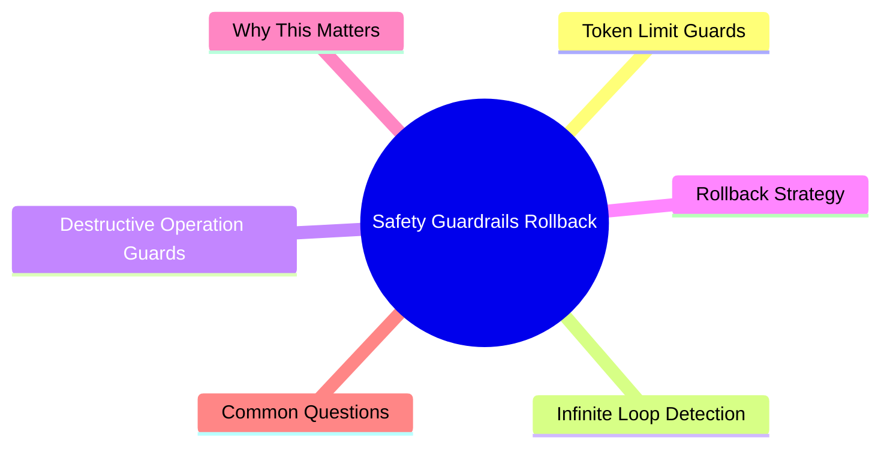

# Module 13: Safety, Guardrails, Rollback

Est. study time: 1h
Language: en



## Learning Objectives
- Set token limits and timeout guards for agent sessions
- Detect and prevent infinite loops
- Protect against destructive operations
- Implement rollback strategy

---

## Core Content

### Token Limit Guards

Unbounded agent sessions can burn thousands of tokens on dead ends.

```text
Hard limits to set:
- Max tool calls per task (e.g., 20)
- Max tokens per response (model limit)
- Max session duration (timeout)
- Max file size for reads (prevent reading huge files)

In AGENTS.md:
  ## Safety Limits
  - Max 20 tool calls per task (if exceeded, stop and report)
  - Never read files >1000 lines without specifying line range
  - Never write files >500 lines without checkpoint check
```

> **Think**: Agent used 50 tool calls on one task and isn't done. What happened?
> *Answer: Likely stuck in loop or went too deep without checkpoint. Should have stopped at 20 and reported. Set hard limit.*

### Infinite Loop Detection

Agent loops look like:

```text
- Repeating same file reads
- Making same type of edit repeatedly
- Fix introduces bug → fix bug → introduces new bug → ...
- Re-exploring already-explored code
- Response patterns repeat (same phrasing, same tool sequence)

Prevention:
  - "If you've attempted same fix 3+ times, stop and report"
  - "If you're re-reading same files, compress and restart"
  - "If you've modified same function 3+ times, show me current state"

Detection:
  - Watch for repetitive tool sequences
  - Track "edit count per file" (3+ edits same file → investigate)
  - Notice when responses get longer without progress
```

> **Think**: Agent has edited login.tsx 7 times. Each edit changes approach. What's happening?
> *Answer: Agent is in iteration loop without convergence. Context likely degraded or approach fundamentally wrong. Stop and reassess.*

### Destructive Operation Guards

Agent can delete or overwrite files. Protect critical paths.

```text
Guards to define:
1. Never delete: package.json, tsconfig.json, node_modules (unless authorized)
2. Never modify: CI config, deploy scripts, security configs
3. Read-only zones: /docs, /config (unless explicitly authorized per task)

In AGENTS.md:
  ## Protected Files (READ ONLY unless per-task approval)
  - package.json, package-lock.json
  - tsconfig.json, next.config.js
  - .github/workflows/*
  - Dockerfile, docker-compose.yml
  - Any file matching *.config.*
  
  ## Never Delete
  - Any file in root directory
  - Any lockfile
  - .gitignore
  - README.md
```

> **Think**: Why list protected files in AGENTS.md instead of relying on generic "be careful"?
> *Answer: Generic instructions ignored or forgotten. Specific file paths are unambiguous. Agent checks before writing.*

### Rollback Strategy

When agent makes changes that need reversal:

```text
Rollback plan (prepare before agent starts):
1. Agent changes are in working tree (not committed)
2. `git stash` or `git checkout -- .` to reset
3. If partial: `git diff` to see changes, revert specific files
4. If committed: `git revert <commit>` or `git reset HEAD~1`

Agent-assisted rollback:
  "Undo the changes to auth.ts. Keep changes to login.tsx."
  Agent: reads current state → reverts specific file → keeps other changes

Safeguard: "Before starting, verify git status is clean."
  If not clean → warn user. Don't start on dirty tree.
```

**Rollback tiers:**

| Situation | Action |
|-----------|--------|
| Minor mistake in single file | Agent reverts specific file |
| Feature went wrong direction | `git checkout` affected files |
| Agent corrupted multiple files | `git reset --hard` to last clean state |
| Changes committed incorrectly | `git revert` or interactive rebase |
| Catastrophic failure | `git stash` → restore from backup |

> **Think**: Agent modified 5 files but only 2 changes are good. How to rollback safely?
> *Answer: Revert specific bad files. Don't revert all. Agent can do selective revert: "Revert utils.ts and api.ts to HEAD. Keep test.ts changes."*

### Pre-Flight Check

Before any significant task, run pre-flight:

```text
Pre-flight checklist:
- [ ] Git working tree clean
- [ ] Branch is correct (not main/master unless authorized)
- [ ] Typecheck passes on current state
- [ ] Tests pass on current state
- [ ] Disk space sufficient
- [ ] Required services running (DB, dev server)

If any fails → stop and resolve before proceeding.
```

This ensures agent starts from known good state. Bugs introduced are agent's, not pre-existing.

> **Think**: Why check typecheck + tests pass BEFORE agent starts?
> *Answer: If typecheck/tests fail after agent change, was it agent's fault or pre-existing? Known good state = clear attribution.*

---

## Why This Matters

Agent failures range from token waste to data loss. Safety guardrails prevent catastrophic mistakes. Rollback plan ensures you can recover instantly. Pre-flight ensures clean attribution of issues. Safety is not optional — it's the difference between empowering tool and dangerous one.

---

## Common Questions

**Q: Can I set automatic tool call limits?**
A: Depends on opencode setup. Some support max tool calls. If not, enforce via AGENTS.md prompt.

**Q: Should I commit agent changes before review?**
A: No. Keep changes in working tree until reviewed. If review rejects, revert is trivial.

**Q: What if agent accidentally deletes a file?**
A: `git checkout <deleted-file>` restores it immediately. Git is your safety net.

---

## Examples

### Example 1: Infinite Loop Caught

Agent is fixing a bug in sort function. After 4 edits, function still fails test:

Without guard: Agent keeps trying different approaches. 15 edits later, still failing. 5000 tokens wasted.

With guard: "If 3+ attempts fail → stop and report." After 3 fails, agent reports: "Tried 3 approaches. All fail. Need human guidance." You investigate: it's a data issue, not code issue.

### Example 2: Destructive Operation Blocked

Agent tries to modify `next.config.js` (in protected list):

```text
Agent: "I need to add an environment variable to next.config.js"
(Checks AGENTS.md: "README ONLY unless per-task approval")
Agent: "next.config.js is in protected files. Cannot modify.
       Please approve: add PUBLIC_API_URL to next.config.js?"
You: "Yes, approved."
Agent: modifies file.
```

Without guard: Agent silently modifies config. May break build.

---

> **Predict**: Commit to an answer: does safety, guardrails, rollback get simpler or harder once git checkout enters the picture?
>
> *Answer: Harder locally, simpler globally: individual pieces carry more rules, but the overall system needs fewer special cases.*
> **Cloze**: {blank} governs how safety, guardrails, rollback behaves when multiple git reset --hard concerns collide.
> **Cloze**: The rule that keeps git checkout correct under load is called {blank}.
> **Cloze**: In safety, guardrails, rollback, git revert determines {blank}.
> **Spot the Mistake**: Code review note: someone applies git reset --hard everywhere "to be safe" in a safety, guardrails, rollback codebase. Spot the mistake.
>
> *Answer: Blanket application hides which spots actually need git reset --hard. Apply it where the semantics demand it, and document why.*


## Key Takeaways
- Set hard limits: max tool calls, token budget, timeout
- Detect loops: repeated reads, repeated edits, no convergence
- Protect critical files: list in AGENTS.md with clear rules
- Rollback plan: git revert, selective revert, reset
- Pre-flight: clean git, typecheck passes, tests pass before agent starts
- Guardrails prevent catastrophe. Rollback ensures recovery.

---

## Common Misconception

**"Guardrails slow down the agent."** 50 tokens of safety rules at start of session save 5000 tokens of damage control. Guardrails don't slow successful work — they prevent expensive failures. Speed without safety is recklessness, not efficiency.

---

## Feynman Explain

(Explain guardrails and rollback to a non-technical stakeholder. Use car analogy: guardrails are seatbelts, rollback is airbag. You don't need them most of the time, but when you do, nothing else substitutes.)

---

## Reframe

(Judge: "maximum guardrails on every task" vs "minimum guardrails, trust the agent." Where do guardrails create false security? When do they prevent useful work?)

---

## Drill

Take the quiz. Run: `learn.sh quiz agentic-engineering 13`
