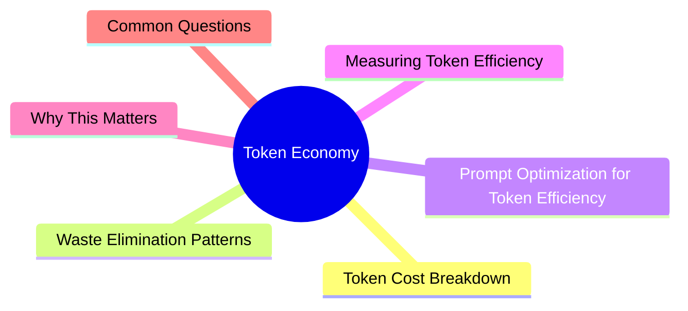

# Module 14: Token Economy

Est. study time: 1h
Language: en



## Learning Objectives
- Understand token cost structure of agent operations
- Identify and eliminate token waste patterns
- Optimize prompts for minimum token consumption
- Measure and track token efficiency

---

## Core Content

### Token Cost Breakdown

Every agent action costs tokens. Not all actions produce equal value.

```text
Cost per operation (approximate):
  Simple question      50-100 tokens
  Write 20-line file   200-400 tokens
  Read 100-line file   300-500 tokens
  Grep search          100-200 tokens
  Glob pattern         50-100 tokens
  Agent response       200-1000 tokens
  Compression          200-500 tokens (but saves 10x+)

Token waste hot spots:
  - Reading full files when only few lines needed
  - Including full error traces in context
  - Letting agent explore without bounds
  - Repeating same information across messages
  - Long agent responses with praise/summarization of unchanged code
```

> **Think**: What's the highest-ROI token investment?
> *Answer: Spec writing and compression. 200 tokens of spec save 2000+ tokens of wrong direction. 500 tokens of compression save 5000+ of context space.*

### Waste Elimination Patterns

| Pattern | Waste | Fix |
|---------|-------|-----|
| Full file reads | 300-500 tokens each | Specify line ranges. Read only what's needed. |
| Agent summarizing unchanged code | 200-500 tokens | "Show only changes. Skip unchanged code." |
| Repeated exploration | 1000+ tokens | Compress decisions to AGENTS.md after first exploration. |
| Praise/affirmation | 50-100 tokens per response | "Skip praise. Just give me findings." |
| Full test output on success | 100-500 tokens | "Only show test failures, skip passing tests." |
| Multiple small tool calls vs batch | Overhead per call | "Read lines 45-60 and 120-135 in one read call." |

> **Think**: Agent says "Here is the updated file: [full file 200 lines]" when only 5 lines changed. What to do?
> *Answer: Instruct: "Show only the diff/hunk, not full file." 5 lines instead of 200 = 97% token savings.*

### Prompt Optimization for Token Efficiency

```diff
- "Could you please take a look at the function below and let me know what you think might need to be changed? I was wondering if there's anything we should improve. Thanks!"
+ "Review this function. Find bugs and optimization opportunities."

Before: 30 tokens (50% filler)
After:  10 tokens (70% reduction)
```

Optimization rules:
- Drop greetings/polite phrases ("please", "thanks", "could you")
- Use short synonyms ("fix" not "implement a solution for")
- Use one word when enough ("yes" not "yes, that sounds right")
- Combine constraints into single instruction ("Fix bug: X. Follow pattern Y. Verify with Z.")
- Use formatting (headers, lists) to reduce ambiguity (saves re-explanation tokens)

> **Think**: You write "please could you implement the feature for adding user search functionality to the admin panel we discussed yesterday?" How many tokens wasted?
> *Answer: ~15 tokens of filler. "Implement user search in admin panel per yesterday's spec" = same information, half the tokens.*

### Measuring Token Efficiency

Track these metrics across sessions:

```text
Metrics to monitor:
  - Tokens per task completed
  - Tokens per file changed
  - Tokens per bug fixed
  - Context usage at task completion
  - Number of compression events
  - Number of restarts due to context full

Improvement targets:
  - Token waste per task < 20% (80% productive)
  - Context usage at task end < 70% (room to continue)
  - Compressions per session: 1-3 (not 0 = never compress, not 10 = over-compressing)
  - Restarts due to context: < 1 per 5 sessions
```

> **Think**: Your average task consumes 5000 tokens. After applying optimization, it's 3000. What changed?
> *Answer: 40% improvement. Likely from: precise file reads, no praise, no full-file output, spec before implementation.*

---

## Why This Matters

Tokens cost money AND context space. Every wasted token reduces effective capacity. Optimization compounds: shorter prompts → more room for output → better results → fewer iterations → less tokens. Token economy is the meta-skill that amplifies all other skills.

---

## Common Questions

**Q: How many tokens is too many for a single task?**
A: If task takes >10 tool calls or >20 agent responses, scope is too large or something is wrong.

**Q: Should I optimize every prompt?**
A: No. Optimize AGENTS.md (loads every session) and common patterns. One-off prompts don't need micro-optimization.

**Q: Does linter output waste tokens?**
A: Only failures. Configure: "Show only lint errors, not passed rules." Many linters support --quiet.

---

## Examples

### Example 1: Before/After Optimization

Before (prompt):
```text
Hi! I was hoping you could help me implement a feature for our application. It's about adding a search bar to the user management page. I think it would be great if users could search by name or email. Let me know what you think!
```

After (optimized):
```text
Add search bar to user management page. Search by name or email.
Pattern: Follow existing search in ProductList.tsx.
Files: UserManagement.tsx, useSearch.ts
```

Before: 45 tokens → After: 25 tokens. Same information.

### Example 2: File Read Savings

Before: "Read src/api/users.ts" — agent returns 300 lines (800 tokens).

After: "Read lines 45-60 (search function) and 120-135 (sort function)" — agent returns 30 lines (80 tokens).

90% token savings. Exactly the information needed.

---

> **Predict**: Before reading deeper: what do you expect happens when token cost interacts with breakdown in token economy?
>
> *Answer: The system relies on token cost to keep breakdown predictable — when both apply, the stricter rule wins.*
> **Cloze**: {blank} governs how token economy behaves when multiple breakdown concerns collide.
> **Cloze**: The rule that keeps token cost correct under load is called {blank}.
> **Cloze**: In token economy, waste elimination determines {blank}.
> **Spot the Mistake**: A developer treats token cost as optional because "it works without it." Where is the mistake?
>
> *Answer: It works only until the assumptions behind token cost are violated. The fix: treat it as part of the contract of token economy, not an optimization.*


## Key Takeaways
- Token waste hot spots: full file reads, praise, repeated exploration, full file output on small changes
- Fix 1: specify line ranges for reads
- Fix 2: "show only diff/changes, not full files"
- Fix 3: compress decisions to AGENTS.md (don't re-explore)
- Fix 4: drop filler from prompts
- Measure: tokens per task, context at completion, compression frequency
- Optimization compounds: less tokens → better context → better output → fewer iterations

---

## Common Misconception

**"Token optimization is micro-optimization — not worth the effort."** Token optimization is NOT micro. Full file reads waste 800 tokens vs 80 for targeted reads. Praise/affirmation adds 50-100 tokens per response across 20 responses = 2000 wasted tokens. These add up to significant context space. Token optimization is high-ROI.

---

## Feynman Explain

(Explain token economy to someone who's never thought about LLM costs. Use money budget: you have $100 per session. Every tool action costs $5-50. Do you spend $40 reading a full file when you only need 3 lines?)

---

## Reframe

(Judge: "optimize every interaction" vs "don't optimize at all, token cost is negligible." At what scale does optimization matter? When is a developer's time more valuable than tokens?)

---

## Drill

Take the quiz. Run: `learn.sh quiz agentic-engineering 14`
