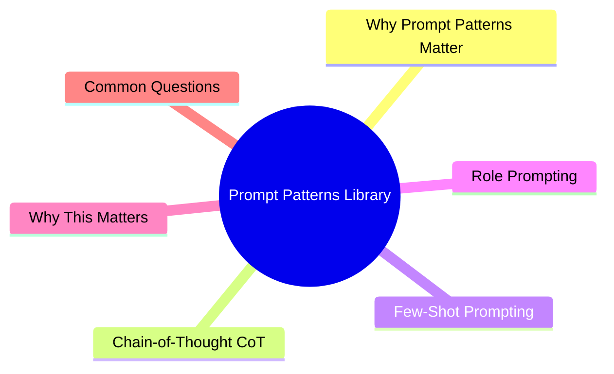

# Module 15: Prompt Patterns Library

Est. study time: 1.5h
Language: en



## Learning Objectives
- Apply chain-of-thought, few-shot, and role-prompting for code tasks
- Choose the right prompt pattern for each scenario
- Recognize and avoid prompt anti-patterns
- Combine patterns for complex tasks

---

## Core Content

### Why Prompt Patterns Matter

Agent quality depends heavily on prompt structure. The right pattern reduces ambiguity, improves output consistency, and saves iterations.

```text
Bad prompt:
  "Make the login page better"

Good pattern:
  "Role: Security-focused code reviewer.
   Task: Audit login page for vulnerabilities.
   Process: List auth flows → Check each against OWASP top 10 →
            Tag findings as critical/major/minor.
   Output: Table format. Include line numbers and fix suggestion."
```

> **Think**: Why does the bad prompt fail? What does the good prompt add?
> *Answer: Bad = no context, no criteria. Good adds: role (perspective), process (thinking path), output format (structure). Each addition reduces ambiguity.*

### Chain-of-Thought (CoT)

Agent thinks step-by-step before answering. Improves correctness for complex tasks.

```text
Before CoT:
  "Is this code vulnerable?"
  Agent: "Looks fine."

With CoT:
  "Analyze this code step by step:
   1. Identify all user inputs
   2. Trace data flow through the function
   3. Check each input against known vulnerability patterns
   4. Verify sanitization exists before trusted execution
   Then: is it vulnerable? Report findings with evidence."

  Agent: walks through each step → identifies vulnerability → explains why.
```

| Pattern | Effect | Token cost | Best for |
|---------|--------|-----------|----------|
| CoT | +20-40% accuracy | +100-300 tokens | Complex logic, security, math |
| Zero-shot CoT ("let's think step by step") | +15-25% accuracy | +5 tokens | Quick improvement |
| Structured CoT (numbered steps) | +25-35% accuracy | +50-150 tokens | Multi-step analysis |

> **Think**: When is CoT NOT worth the extra tokens?
> *Answer: Simple tasks (rename, typo fix, boilerplate). CoT overhead 100-300 tokens for no benefit on trivial work.*

### Few-Shot Prompting

Provide examples of desired input/output format.

```text
Before few-shot:
  "Write a test for the login function."
  Agent: writes test in its preferred style.

With few-shot:
  "Write tests for the login function.
   Follow this exact test pattern:

   Example:
   test('returns user data for valid credentials', async () => {
     const result = await api.login('valid@user.com', 'password123')
     expect(result).toHaveProperty('token')
     expect(result.user.email).toBe('valid@user.com')
   })

   Now write tests for: wrong password, expired token, rate limiting."
```

| Shot count | Effect | Token cost | Best for |
|-----------|--------|-----------|----------|
| 1 shot | Signals format | +50-200 tokens | Format alignment |
| 2-3 shots | Signals format + edge case pattern | +100-500 tokens | Complex outputs |
| 4+ shots | Diminishing returns | Heavy | Rarely needed |

> **Think**: How many shots are optimal for a code generation task?
> *Answer: 1-3. One shows format. Two show variation. Three show edge case. Beyond 3, agent has enough pattern and extra examples waste tokens.*

### Role Prompting

Assign a persona to the agent. Changes perspective and priorities.

```text
Roles for engineering tasks:
  "Senior Developer"          → Focus on production quality, maintainability
  "Security Auditor"          → Focus on vulnerabilities, edge cases
  "Performance Engineer"      → Focus on bottlenecks, optimization
  "Junior Developer"          → Focus on clear explanation, learning
  "QA Engineer"               → Focus on test coverage, failure modes
  "Code Reviewer"             → Focus on correctness, conventions
  "Technical Writer"          → Focus on documentation, clarity
```

Example: Same code evaluated by different roles:

```text
Security Auditor:
  "Report finds: SQL injection risk at line 45 (raw query),
   XSS vulnerability at line 78 (untrusted innerHTML),
   Auth bypass at line 120 (missing token validation)"

Performance Engineer:
  "Report finds: N+1 query in user list, missing index on email,
   bundle has unused lodash imports"
```

> **Think**: What role would you assign for a refactoring task?
> *Answer: "Senior Developer" (production quality, maintainability) or "Code Reviewer" (correctness, conventions). Depends on refactor goal.*

### Combined Pattern

Complex tasks benefit from combining patterns:

```text
Role: Senior Developer
Task: Implement search with pagination
Process:
  1. Read existing search pattern (ProductSearch.tsx)
  2. Propose approach (wait for approval)
  3. Implement following our conventions
  4. Run typecheck → lint → tests (must pass)
  5. Show diff with summary of changes
  6. Flag any risks or tradeoffs

Examples of our pattern:
  (show 1-2 lines of existing pattern)

Apply step-by-step. Don't skip steps.
```

Combines: role (Senior Dev) + CoT (numbered steps) + few-shot (pattern reference) + verification gate.

> **Think**: What's the token cost of a combined pattern? Worth it?
> *Answer: 200-400 tokens for the pattern setup. If it prevents one wrong-direction iteration (1000+ tokens), worth it. For trivial tasks, use simpler pattern.*

### Anti-Patterns to Avoid

```text
Anti-pattern 1: "Be careful"
  Problem: Vague. No specific actions.
  Fix: "Run typecheck after changes. Don't modify tests."

Anti-pattern 2: Over-constraining
  Problem: Spec is longer than implementation = you should write it yourself.
  Fix: Provide patterns, not line-by-line instructions.

Anti-pattern 3: Task overflow
  Problem: "Implement search, add dark mode, fix login bug, refactor utils"
  Agent: context fills with task list, each gets half attention.
  Fix: One task per session.

Anti-pattern 4: Assuming shared knowledge
  Problem: "Fix the same bug as last time" (agent doesn't remember)
  Fix: Describe the bug. Every time.

Anti-pattern 5: Changing requirements mid-session
  Problem: "Actually, forget the search bar — add filters instead"
  Effect: Agent's half-done search work pollutes context for filter task.
  Fix: Separate tasks. Finish or discard search, then start filters.
```

> **Think**: You notice agent output quality dropping after 3 changes of scope in same session. What happened?
> *Answer: Task overflow + context pollution. Agent has partial context for each requirement. Finish current task, then start new session for new task.*

---

## Why This Matters

Prompt patterns are your most powerful tool for improving agent output. A well-structured prompt can double output quality at zero extra cost. A bad prompt guarantees poor results regardless of agent capability. Pattern library lets you pick the right tool for each job.

---

## Common Questions

**Q: Should I use the same pattern for every task?**
A: No. Match pattern to task complexity. Simple task → simple prompt. Complex task → combined pattern.

**Q: How do I know which pattern to use?**
A: Classification: Is task analysis-heavy? → CoT. Is format critical? → Few-shot. Is perspective important? → Role. Is it complex? → Combined.

**Q: Can patterns hurt performance?**
A: Yes. Over-constraining limits agent. Wrong role gives wrong perspective. Too many shots waste tokens. Match pattern to need.

---

## Examples

### Example 1: Security Audit with Combined Pattern

```text
Role: Security Auditor (OWASP Top 10 expert)
Task: Audit src/api/auth/login.ts for vulnerabilities
Process:
  1. List all user-controlled inputs
  2. Trace each input's full data flow
  3. Check each path against: injection, auth bypass, data exposure, rate limiting
  4. Report findings as table: Risk | Location | Description | Fix
Examples of security issues we've fixed:
  (2 examples of past vulnerabilities)
```

Agent finds: no rate limiting on login, verbose error messages (e.g., "user not found" vs "wrong password"), no account lockout. Each tagged with fix suggestion.

### Example 2: Complex Feature with Combined Pattern

```text
Role: Senior Full-Stack Developer
Task: Add file upload to user profile
Process:
  1. Read existing upload pattern (src/api/files/upload.ts)
  2. Propose approach: file size limit? format validation? storage backend?
  3. Wait for approval
  4. Implement with typecheck + test after each step
  5. Present diff with summary + risks

Our conventions:
  - Express routes in src/api/
  - Services in src/services/
  - Error handling: next(err) with ApiError class
```

Agent reads upload pattern → proposes: "Use multer with 5MB limit, validate image/jpeg + image/png, store in S3, save URL in Postgres" → You: "Add webp support" → Agent implements.

---

> **Predict**: Commit to an answer: does prompt patterns library get simpler or harder once patterns matter enters the picture?
>
> *Answer: Harder locally, simpler globally: individual pieces carry more rules, but the overall system needs fewer special cases.*
> **Cloze**: {blank} governs how prompt patterns library behaves when multiple chain concerns collide.
> **Cloze**: The rule that keeps patterns matter correct under load is called {blank}.
> **Cloze**: In prompt patterns library, thought determines {blank}.
> **Spot the Mistake**: Code review note: someone applies chain everywhere "to be safe" in a prompt patterns library codebase. Spot the mistake.
>
> *Answer: Blanket application hides which spots actually need chain. Apply it where the semantics demand it, and document why.*


## Key Takeaways
- CoT: step-by-step thinking. Best for complex analysis. +20-40% accuracy.
- Few-shot: examples. Best for format alignment. 1-3 shots optimal.
- Role prompting: changes agent's perspective. Match role to task type.
- Combined patterns for complex tasks. Cost: 200-400 token setup.
- Anti-patterns: vague instructions, over-constraining, task overflow, assumption of shared knowledge, mid-session scope changes.
- Match pattern to task complexity. Don't over-engineer simple prompts.

---

## Common Misconception

**"A single perfect prompt template works for everything."** No universal prompt. Analysis tasks need CoT. Format-critical tasks need few-shot. Perspective-sensitive tasks need role. Complex tasks need combination. Build a library, pick the right tool.

---

## Feynman Explain

(Explain prompt patterns to a beginner. Why can't you just ask nicely? Use cooking analogy: "make dinner" vs "make pasta with tomato sauce, instructions: boil water, add pasta, drain after 10 min" vs "cook like a chef making carbonara.")

---

## Reframe

(Judge: "always use CoT + few-shot + role combined" vs "always use minimal prompt." What does each approach optimize for? When does each fail?)

---

## Drill

Take the quiz. Run: `learn.sh quiz agentic-engineering 15`
