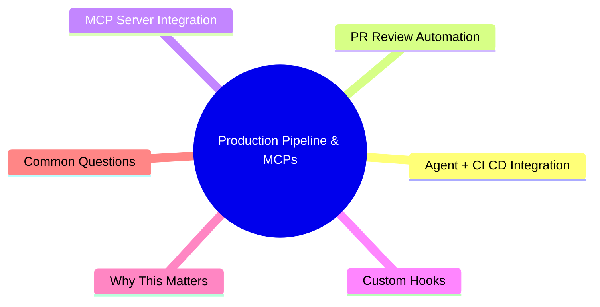

# Module 16: Production Pipeline & MCPs

Est. study time: 1h
Language: en



## Learning Objectives
- Integrate agent workflow with CI/CD pipeline
- Use agents for PR review automation
- Understand MCP server integration
- Design custom hooks for automation

---

## Core Content

### Agent + CI/CD Integration

Agent development doesn't replace CI/CD — it changes where agent output enters the pipeline.

```text
Without agent:
  Dev writes code → commit → PR → CI runs (typecheck, lint, test, build) → review → merge

With agent:
  Agent writes code → (typecheck → lint → test) already passed before commit
  → commit → PR → CI runs (full suite) → agent reviews → human spot-checks → merge

Key: verification gates run BEFORE commit. CI should never catch what agent already verified.
```

**Pre-commit agent checks (run by agent before presenting diff):**

```text
1. Typecheck → pass
2. Lint → pass (auto-fix if project allows)
3. Related tests → pass
4. Build → pass (for deployable changes)
5. Evidence receipt generated (summary + diff + decisions + gate results)
```

If any fail → agent fixes and re-runs. Only passes to you when all green.

> **Think**: CI catches a type error that agent should have caught. What went wrong?
> *Answer: Agent skipped pre-commit verification gate. Either not instructed to run it, or gate was disabled. Fix: enforce verification in AGENTS.md.*

### PR Review Automation

Agent can automate PR review. Integration options:

**As PR reviewer (agent comments on PR):**
- Agent reads PR diff
- Applies review skill (correctness, security, conventions)
- Posts review comments on PR
- Human reviews agent's review + spot-checks code

**As PR author (agent writes PR for you):**
- Requires: feature branch, changes already reviewed
- Agent writes PR description, summarizes changes, tags reviewers
- Agent may create PR via GitHub API

```text
Agent PR review checklist:
1. Verify all acceptance criteria met (from spec)
2. Check diff matches intended scope (no unrelated changes)
3. Run mental review: correctness, security, conventions
4. Check test coverage (are new behaviors tested?)
5. Flag any risks or tradeoffs
6. Output: structured review report + per-line comments if needed
```

> **Think**: Should agent have write access to merge PRs?
> *Answer: No. Agent reviews and comments. Human merges. Merge is human responsibility.*

### MCP Server Integration

MCP (Model Context Protocol) servers extend agent capabilities. Think of them as "tools plugins."

**Common MCP servers:**

| MCP Server | What it provides | Use case |
|-----------|-----------------|----------|
| GitHub | PR, issues, repos, commits | PR review automation, issue triage |
| Git | Clone, branch, commit, push | Automated git operations |
| Filesystem | Read/write outside project | Config files, logs |
| PostgreSQL | Query DB | Database exploration, migrations |
| SQLite | Query local DB | Local development data |
| Puppeteer | Browser automation | Visual testing, screenshots |
| Brave Search | Web search | Research, documentation lookup |

**Installing MCP servers:**

```text
In opencode.json or equivalent config:
{
  "mcpServers": {
    "github": {
      "command": "npx",
      "args": ["-y", "@modelcontextprotocol/server-github"]
    },
    "filesystem": {
      "command": "npx",
      "args": ["-y", "@modelcontextprotocol/server-filesystem", "/path/to/allowed/dir"]
    }
  }
}
```

> **Think**: You want agent to create PRs automatically. Which MCP server needed?
> *Answer: GitHub MCP server. Provides PR creation, commenting, merging capabilities. Agent can run `gh` commands through it.*

### Custom Hooks

Hooks trigger automated actions on events.

**Common hook triggers:**

```text
Pre-commit hook:
  Before allowing commit → run typecheck + lint + tests
  If any fail → block commit, report failures

Post-merge hook:
  After merge → update CLAUDE.md, clear merged branch

Post-deploy hook:
  After deploy → run smoke tests, notify team

File change hook:
  On package.json change → run `npm install`, report new dependencies
  On config change → validate config format
```

**Hook design principles:**
- Fail open (hooks shouldn't block if they error)
- Log all actions (so you can debug hook failures)
- Keep fast (<1s for typical hook)
- Have escape hatch (`--no-verify` for git hooks)

> **Think**: You hook pre-commit to run full test suite. Tests take 15 minutes. Everyone hates this hook. What's wrong?
> *Answer: Hook is too slow. Full suite is for CI. Hook should run related tests only, or only typecheck + lint. Speed matters for adoption.*

### Multi-Repo Workflows

Agent managing multiple repos needs structured approach:

```text
Scenario: Microservice architecture with 5+ repos.
Challenge: Agent context can't hold all repos simultaneously.

Approach:
1. AGENTS.md per repo (conventions, patterns)
2. Common patterns in shared skill (accessible across repos)
3. Per-session scope: one repo per session
4. Cross-repo changes: coordinate via issue/PR, not agent context

For changes spanning repos:
1. Session A: change shared library repo → publish new version
2. Session B: update consumer repos to use new version
```

> **Think**: Why one-repo-per-session for multi-repo work?
> *Answer: Context can't hold all repos. Splitting per-session keeps focus clean. Cross-repo coordination happens via version bumps, not simultaneous edits.*

---

## Why This Matters

Agent development doesn't exist in isolation. It integrates with CI/CD, PR workflows, MCP-extended capabilities, and custom automation hooks. Production pipeline ensures agent output flows smoothly into existing development infrastructure — not disrupting it.

---

## Common Questions

**Q: Should CI run same checks as agent verification?**
A: Yes — but CI runs full suite (slower, more thorough). Agent runs related checks (fast, frequent). Both catch different things.

**Q: Can MCP servers be security risks?**
A: Yes. Filesystem MCP grants file access. Database MCP grants query access. Restrict MCP server permissions to minimum needed.

**Q: What's the most useful MCP server for daily development?**
A: GitHub (PR management) and Filesystem (access outside project). Start with these.

---

## Examples

### Example 1: Full Production Pipeline

```text
1. Agent implements feature (with pre-commit verification)
2. Agent produces evidence receipt
3. You review → approve
4. Agent creates branch + PR (via GitHub MCP)
5. PR triggers CI (full test suite, build, deploy preview)
6. CI passes
7. Agent reviews own PR (review skill)
8. Human spot-checks → merges
9. Post-merge hook: deploys to staging
10. Post-deploy hook: runs smoke tests
```

Total human time: 5-10 min per PR. Agent does everything else.

### Example 2: Hook for Safety

```text
Hook: pre-tool guard for Write
  If destination matches "src/config/*.ts" or "*.config.*":
    - Log: "Protected file. Needs approval."
    - Block write
    - Ask: "Approve write to [file]?"
```

Prevents accidental config modifications. Agent learns to ask before touching protected files.

---

> **Predict**: Before reading deeper: what do you expect happens when --no-verify interacts with agent in production pipeline & mcps?
>
> *Answer: The system relies on --no-verify to keep agent predictable — when both apply, the stricter rule wins.*
> **Cloze**: {blank} governs how production pipeline & mcps behaves when multiple agent concerns collide.
> **Cloze**: The rule that keeps --no-verify correct under load is called {blank}.
> **Cloze**: In production pipeline & mcps, integration determines {blank}.
> **Spot the Mistake**: A developer treats --no-verify as optional because "it works without it." Where is the mistake?
>
> *Answer: It works only until the assumptions behind --no-verify are violated. The fix: treat it as part of the contract of production pipeline & mcps, not an optimization.*


## Key Takeaways
- Agent verification gates run BEFORE commit. CI should never catch what agent already checked.
- Agent can review PRs (structured comments) or author PRs (description + summary).
- MCP servers extend capabilities: GitHub, Filesystem, Database, Browser, Search.
- Custom hooks automate: pre-commit checks, post-merge updates, post-deploy tests.
- Multi-repo: one repo per session. Shared patterns in cross-repo skills.
- Hooks should be fast, log actions, and have escape hatches.
- MCP servers need permission restriction (security).

---

## Common Misconception

**"Agent replaces CI/CD."** Agent complements CI/CD. Agent handles pre-commit verification (fast, focused). CI handles full suite (thorough, independent). Agent is the first gate, CI is the last gate. Both needed.

---

## Feynman Explain

(Explain agent + CI/CD integration to a DevOps engineer. Why not just have agent commit directly to production? What value does the pipeline add if agent already verified?)

---

## Reframe

(Judge: "let agent create and merge PRs autonomously" vs "agent only reviews, human always merges." Where's the right balance? When would full autonomy be acceptable?)

---

## Drill

Take the quiz. Run: `learn.sh quiz agentic-engineering 16`
