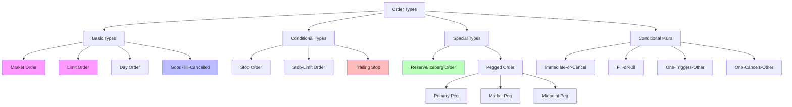
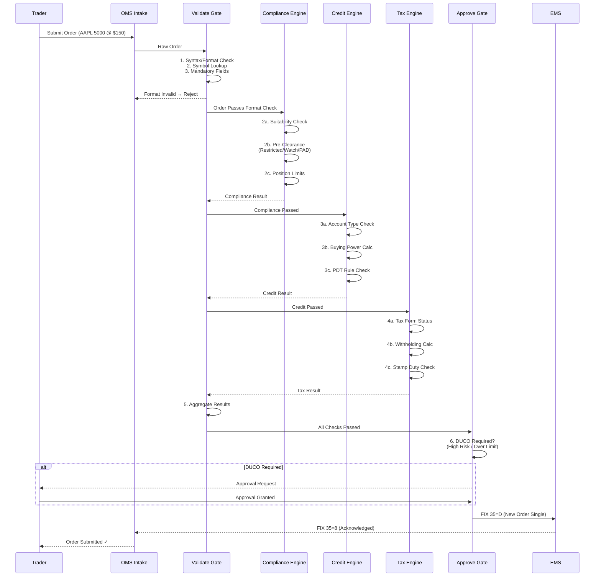
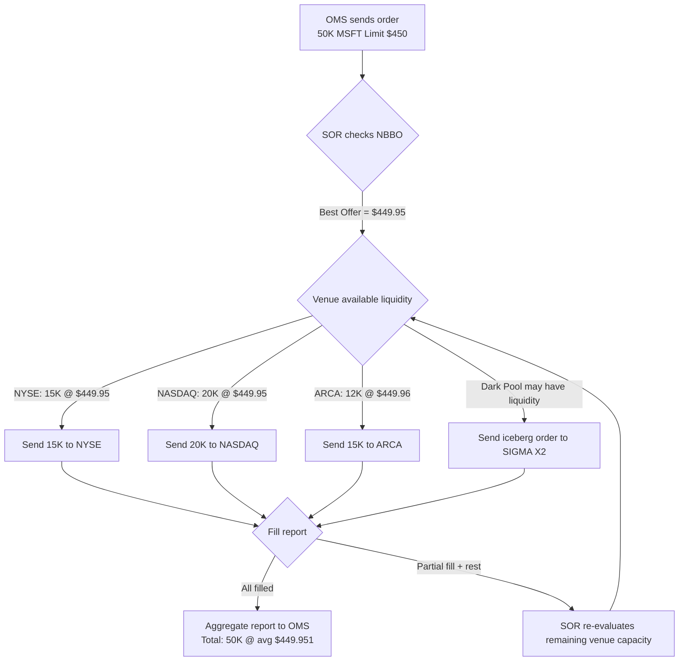
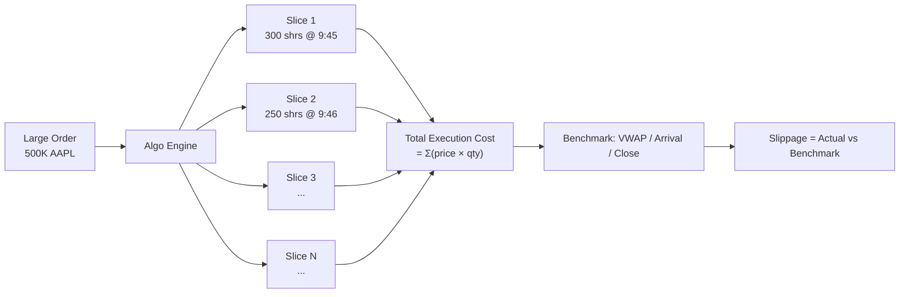
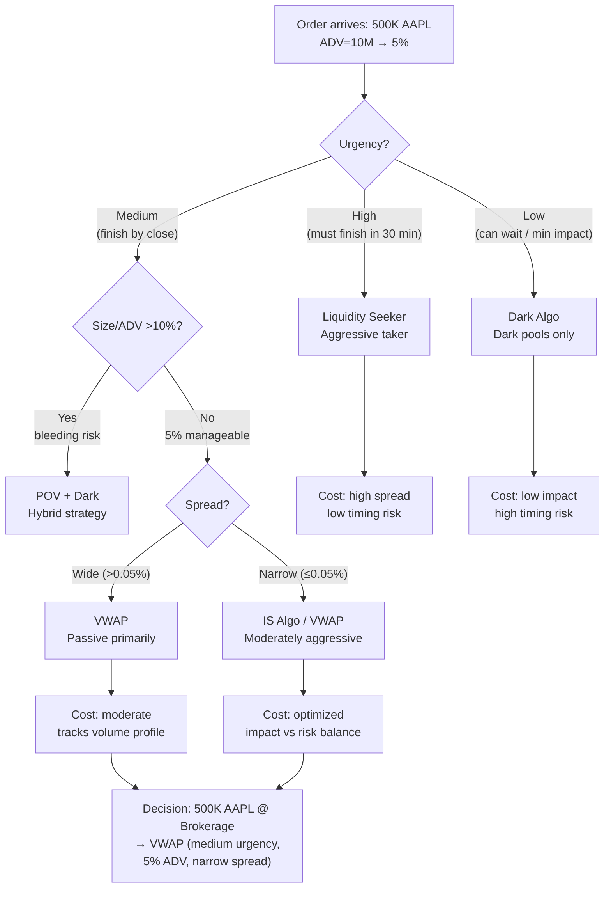
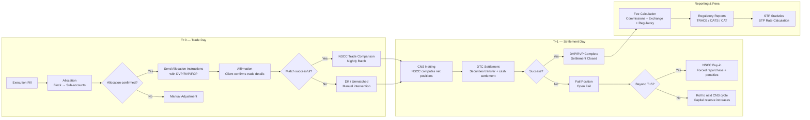
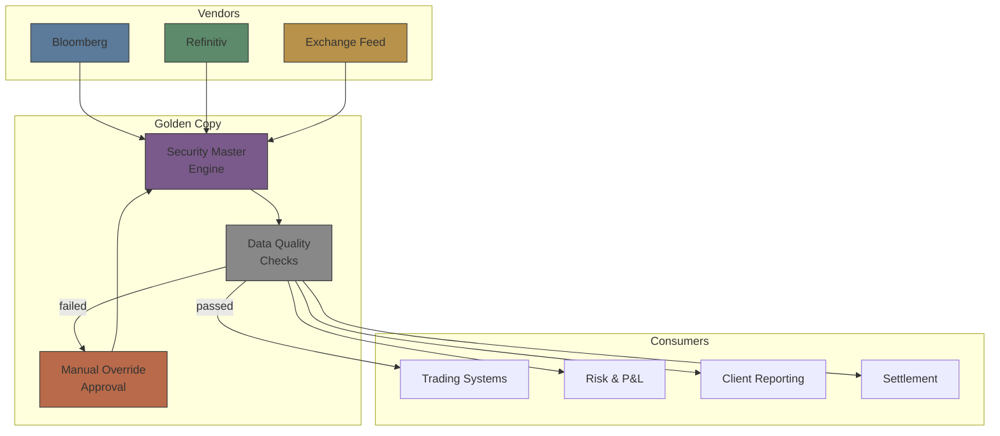
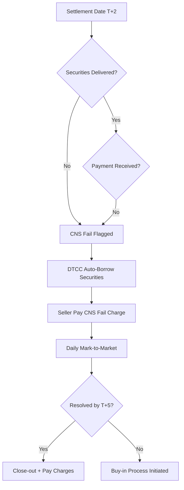
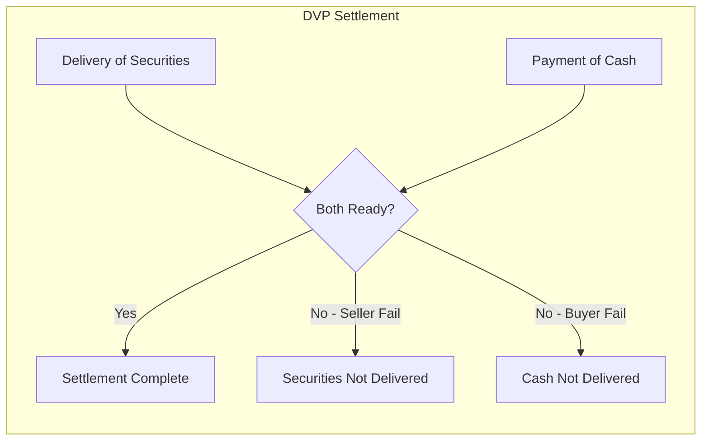
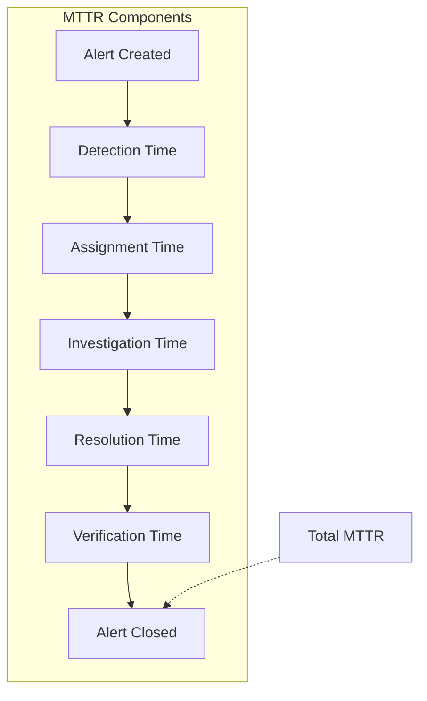

# Module 1: Trade Lifecycle Overview — From Pre-Trade to Settlement

Estimated time: 2h
language: en
description: Full trade lifecycle map, boundary between OMS and EMS, and role of each system

## Learning Objectives (mapped to course CILOs)
- Understand the complete phases of the trade lifecycle and system boundaries — maps to CILO #1
- Distinguish OMS and EMS responsibilities — maps to CILO #6
- Identify data flow and dependencies from pre-trade through settlement — maps to CILO #1

---

## Real-World Case

Your team maintains the broker's pre-trade system (suitability / pre-clearance / order taking). One day, a US equity limit order passes all compliance checks and gets submitted. Thirty minutes later, the trader reports: "The EMS rejected the order — the instrument doesn't have a matching exchange code on the execution side."

Your system uses Bloomberg Ticker, but the EMS uses Reuters RIC + Exchange Code. Each side maintains its own security master table, and the sync lags by 15 minutes — just enough to miss this order.

> **Think**: Why did the pre-trade system pass the check while the execution side rejected it? Which link broke?
>
> *Answer: Data sync delay caused instrument mapping mismatch. The pre-trade system only knows "this stock is tradeable", but doesn't know the execution side needs a different identifier + venue combo to execute. The problem is in cross-system master data synchronization.*

---

## Core Content

### 1. The Four Phases of the Trade Lifecycle

```text
┌──────────────────────────────────────────────────────────────┐
│                   Trade Lifecycle                            │
└──────────────────────────────────────────────────────────────┘
     │
     ▼
┌──────────────────┐    ┌──────────────────┐    ┌──────────────────┐    ┌──────────────────┐
│  1. Pre-Trade    │───▶│  2. Execution    │───▶│  3. Allocation   │───▶│  4. Settlement   │
├──────────────────┤    ├──────────────────┤    ├──────────────────┤    ├──────────────────┤
│ • Suitability    │    │ • Order routing  │    │ • Block trade    │    │ • DVP / RVP      │
│ • Pre-clearance  │    │ • Venue selection│    │ • Allocation     │    │ • CNS (DTCC)     │
│ • Limit checks   │    │ • Order book     │    │ • Give-up /      │    │ • Fails mgmt     │
│ • Compliance     │    │ • Matching       │    │   Take-up        │    │ • Affirmation    │
│ • AML / KYC      │    │ • Partial fills  │    │ • Sub-accounts   │    │ • Confirmation   │
└──────────────────┘    └──────────────────┘    └──────────────────┘    └──────────────────┘
     │                        │                        │                        │
     └── Your domain ─────────┴──── gap ───────────────┴──── gap ───────────────┘
```

> **Think**: Which phase do you deal with daily at the brokerage? Which phases are a black box to you?
>
> *Answer: Your domain = Phase 1 (Pre-Trade). Phases 2-4 are usually black boxes. This course exists to bridge that gap.*

> **Cloze**: "The pre-trade system's main job is to ensure orders pass all {compliance} and {risk} checks before entering the execution system."
>
> *Answer: compliance, risk*

### 2. OMS vs EMS: Responsibilities at the Boundary

```text
    OMS (Order Management System)                        EMS (Execution Management System)
  ┌──────────────────────────────────────────────┐    ┌──────────────────────────────────────────────┐
  │ • Order lifecycle (create, modify, cancel,   │    │ • Route orders to exchanges / ATS / brokers  │
  │   status tracking)                           │    │ • Price discovery & order book matching      │
  │ • Compliance checks (suitability,            │    │ • Partial fill management (remaining qty)    │
  │   pre-clearance)                             │    │ • Market data integration (quotes, depth)    │
  │ • Security master & instrument mapping       │    │ • Algorithmic execution (TWAP/VWAP/IS)       │
  │ • Limit checks (trader/product/concentration)│    │ • Smart Order Routing (SOR)                  │
  │ • FIX message generation & parsing           │    │ • Execution reports                          │
  │ • Trade allocation                           │    │                                              │
  │ • Fee calculation                            │    │                                              │
  │ • P&L reporting                              │    │                                              │
  │ • Regulatory reporting                       │    │                                              │
  └──────────────────────────────────────────────┘    └──────────────────────────────────────────────┘
           │                                                    │
           └──────────── FIX Protocol ────────────▶             ┘
                     New Order Single (35=D)
                     Execution Report (35=8)

```

> **Think**: The diagram shows OMS sending an order to EMS. If the OMS sends a duplicate ClOrdID, how does the EMS handle it?
>
> *Answer: EMS responds with ExecType=8 (Rejected), RejectReason=11 (Duplicate ClOrdID). The OMS must generate unique ClOrdIDs — this is the OMS's responsibility, not the EMS's.*

**Example — Typical FIX order flow:**
```text
OMS ──▶ 35=D (New Order Single) ──▶ EMS
  ClOrdID=20250101-001
  Symbol= AAPL
  Side= 1 (Buy)
  OrdType= 2 (Limit)
  Price= 150.00
  OrderQty= 1000

EMS ──▶ 35=8 (Execution Report) ──▶ OMS
  ClOrdID=20250101-001
  ExecType= 0 (New)
  OrdStatus= 0 (New)
  LeavesQty= 1000

  ... (later, when matched) ...

EMS ──▶ 35=8 (Execution Report)
  ClOrdID=20250101-001
  ExecType= 2 (Fill)
  OrdStatus= 2 (Filled)
  LastShares= 1000
  LastPx= 149.95
  LeavesQty= 0
```

> **Predict**: If the OMS sends an order and the EMS rejects it because the price falls outside the valid range, how should the OMS handle it?
>
> *Answer: The OMS should log the rejection reason, update the order status to Rejected, and notify the trader. It should NOT auto-resubmit — since a price constraint was violated, manual intervention is needed.*

### 3. Key Systems and Roles by Phase

```text
┌───────────────┬──────────────────┬───────────────────┬──────────────────────┐
│ Phase         │ Key Systems      │ Data Flow         │ Common Issues        │
├───────────────┼──────────────────┼───────────────────┼──────────────────────┤
│ Pre-Trade     │ OMS, CRM,        │ Client data →     │ Security master      │
│               │ Compliance System│ limits → product  │ mismatch             │
│               │                  │ mapping → order   │ Client tier          │
│               │                  │                   │ permissions expired  │
├───────────────┼──────────────────┼───────────────────┼──────────────────────┤
│ Execution     │ EMS, Algo Engine,│ OMS → FIX → EMS   │ High latency →       │
│               │ SOR              │ → exchange → fill │ price slippage       │
│               │                  │ → report → OMS    │ Low liquidity →      │
│               │                  │                   │ partial fills        │
├───────────────┼──────────────────┼───────────────────┼──────────────────────┤
│ Allocation    │ OMS,             │ Block trade →     │ Allocation split     │
│               │ Allocation Engine│ break out →       │ deviates from        │
│               │                  │ sub-accounts      │ client instructions  │
│               │                  │                   │ Minimum lot          │
│               │                  │                   │ restrictions         │
├───────────────┼──────────────────┼───────────────────┼──────────────────────┤
│ Settlement    │ CTM / DTCC,      │ Confirm → match → │ Settlement fail →    │
│               │ Custodian Bank,  │ clear → settle →  │ penalty              │
│               │ Clearing Broker  │ cash/securities   │ Counterparty         │
│               │                  │ transfer          │ default → loss       │
│               │                  │                   │ wash trade false     │
│               │                  │                   │ positive             │
└───────────────┴──────────────────┴───────────────────┴──────────────────────┘
```

> **Cloze**: "In the trade lifecycle, the {OMS} is the brain for order management, the {EMS} is the arm for execution, and {DTCC} is the central hub for clearing and settlement."
>
> *Answer: OMS, EMS, DTCC*

### 4. Data Flow: A Single Order's Complete Journey

```text
  Trade Date (T)                                  Settlement Date (T+1 / T+2)
    │                                                │
    ▼                                                ▼
┌──────────┐   ┌───────────┐   ┌─────────┐   ┌──────────┐        ┌──────────────┐
│ Trader   │   │ OMS       │   │ EMS     │   │ Exchange │        │ DTCC CNS     │
│ enters   │──▶│•Compliance│──▶│•Route   │──▶│•Matching │───────▶│ •Match       │
│ order    │   │•Check     │   │•Algo    │   │•Fill     │        │ •Net         │
│          │   │•Limit     │   │•Send    │   │•Report   │        │ •Settle      │
│  AAPL    │   │•Map       │   │         │   │          │        │              │
│  1000    │   │           │   │         │   │          │        │              │
│  Limit   │   │           │   │         │   │          │        │              │
│  $150    │   └───────────┘   └─────────┘   └──────────┘        └──────────────┘
└──────────┘       │               │              │                    │
                   │               │              │                    │
                   ▼               ▼              ▼                    ▼
              • Suitability    • Venue       • Matched/Partial    • Settled
              • Pre-clearance  • Price       • Remain qty         • Affirmed
              • Limit check    • Queue pos   • Exec price         • Cash moved
              • AML/KYC        • Fill qty    • Commission         • Securities moved
```

> **Think**: In this diagram, which link is most likely to break and cause the whole trade to fail?
>
> *Answer: Instrument mapping — from OMS to EMS to Exchange, each hop needs the correct identifier. A mapping failure at any link causes the order to be rejected or executed against the wrong product. As the person maintaining the pre-trade system, this is the area to watch most closely.*

### 5. Brokerage Scenario: Where Your System Sits in the Big Picture

In the brokerage architecture, your pre-trade / suitability system sits at the **start** of the lifecycle:

```text
Client order request
    │
    ▼
┌────────────────────────┐
│  Suitability Engine    │  ← Your team maintains
│  • Client risk rating  │
│  • Product suitability │
│  • Concentration       │
│  • Pre-clearance       │
└─────────┬──────────────┘
          │ passed
          ▼
┌────────────────────────┐
│  Order Intake/OMS      │  ← Your team maintains
│  • Order entry         │
│  • Order validation    │
│  • Instrument lookup   │
│  • FIX generation      │
└─────────┬──────────────┘
          │ FIX 35=D
          ▼
┌────────────────────────┐
│  EMS                   │  ← Gap (less exposure)
│  • Smart routing       │
│  • Venue selection     │
│  • Algo execution      │
└─────────┬──────────────┘
          │ fill(s)
          ▼
┌────────────────────────┐
│  Post-Trade Systems    │  ← Gap
│  • Allocation          │
│  • Settlement          │
│  • Fee calculation     │
│  • Reporting           │
└────────────────────────┘
```

> **Spot the Mistake**: Someone says "If the suitability check passes, the order is guaranteed to execute." What's wrong with this statement?
>
> *Answer: Suitability only checks whether this product is appropriate for this client. The order can still fail due to instrument mapping issues, price outside range, insufficient limits, low liquidity on the EMS side, an exchange reject, and more. Suitability passed ≠ guaranteed execution.*

> **Predict**: If your suitability system has a batch job delay that prevents a client restriction update from being reflected in time, and the order gets rejected at the EMS only after submission, what are the consequences?
>
> *Answer: The trader wastes time managing an order that can't execute, and the client experience suffers. In the worst case: if the restriction was a regulatory trading ban (e.g., insider list) and the order accidentally executes, that could be a regulatory violation. This is why a real-time restriction sync mechanism between pre-trade and EMS is essential.*

---

### Why This Matters

Understanding the full trade lifecycle isn't just about knowledge for its own sake. For your day-to-day work:

1. **Debug Efficiency**: When an order gets rejected or behaves oddly, you know which phase to look at. Instrument mapping problem → check master data sync. Price deviation → check EMS routing. Allocation issue → check allocation engine.

2. **System Design Decisions**: What information does your pre-trade system need to pass downstream? If you don't know how downstream systems use that data, it's hard to make good schema decisions.

3. **Cross-Team Communication**: Your stories depend on the EMS team's work — understanding their constraints helps you estimate timelines accurately.

4. **Incident Response**: A bug in suitability checks may only affect pre-trade. But if it lets a non-compliant order through, the impact ripples through execution, settlement, and regulatory reporting.

---

## Key Takeaways

- The trade lifecycle has four phases: Pre-Trade → Execution → Allocation → Settlement. Each phase has its own systems and data flows.
- OMS manages order lifecycle and compliance checks; EMS handles routing to exchanges and execution.
- Communication between OMS and EMS mainly uses the FIX protocol (35=D New Order Single, 35=8 Execution Report).
- Instrument mapping is the biggest pain point in cross-system integration — mismatched identifiers cause rejections.
- Suitability / pre-clearance is the starting point of a trade, but not a guarantee of execution. Later phases have their own checks.
- Trade date ≠ settlement date. Settlement cycles vary by asset class and market (US equities T+1, some FI T+2/T+3).

---

## Common Misconceptions

**Misconception**: "OMS and EMS are the same system, or only big banks need separate ones."
**Fact**: Even mid-sized brokerages almost always have separate OMS and EMS systems — from different vendors or maintained by different internal teams. OMS focuses on compliance and order management; EMS focuses on execution speed and market connectivity. This separation also provides risk isolation.

**Misconception**: "Once the order reaches the exchange, the job is done."
**Fact**: Execution is only the beginning. There is still allocation (distributing to sub-accounts), affirmation (confirming trade details), and clearing & settlement. The fastest case takes T+1, but complex multi-asset trades can take T+3 or longer.

---

## Spot the Mistake

In a system architecture diagram, someone placed the Suitability Engine after the EMS and before the Exchange, meaning "execute first, check suitability later."

**Why is this wrong?**

*Answer: Suitability is a pre-trade check and must complete before the order enters the execution system. If you find a suitability problem after execution, the trade has already happened — it can't be undone. The correct position is inside the OMS, before the EMS. Suitability + compliance check first, then send to EMS.*

---

## Feynman Explain

(Explain the "trade lifecycle" in the simplest terms to someone without a finance background. Example: you want to buy one share of Apple stock — from the moment you place the order to the moment you actually own the share, what happens in between?)


---

## Reframe

(Pause. Evaluate the "trade lifecycle" as a framework: is this four-phase division useful for your work? Are there situations you've encountered that this framework doesn't cover? For example, are there cross-phase problems this linear model can't capture? Write down your assessment.)

---

## Drill

Complete the quiz. MCQ tests from different angles — memory, application, scenario.

Run: `learn.sh quiz brokerage-ops-en 1`

## Quiz: 01-trade-lifecycle

<p class="quiz-question">The trade lifecycle has four phases. What is the correct order?</p>

<p class="quiz-difficulty">★☆☆</p>

<p class="quiz-option"><strong>A.</strong> Execution → Pre-Trade → Allocation → Settlement</p>

<p class="quiz-option"><strong>B.</strong> Pre-Trade → Execution → Allocation → Settlement</p>

<p class="quiz-option"><strong>C.</strong> Allocation → Pre-Trade → Execution → Settlement</p>

<p class="quiz-option"><strong>D.</strong> Pre-Trade → Allocation → Execution → Settlement</p>

<p class="quiz-answer"><strong>Answer:</strong> B</p>

<p class="quiz-explanation">Pre-Trade (suitability/pre-clearance) → Execution (routing/matching) → Allocation (allocation to sub-accounts) → Settlement (DVP, CNS). This is the industry standard sequence.</p>

<hr/>

<p class="quiz-question">What is the main difference between an OMS and an EMS?</p>

<p class="quiz-difficulty">★☆☆</p>

<p class="quiz-option"><strong>A.</strong> OMS manages order lifecycle and compliance checks; EMS handles routing to exchanges for execution</p>

<p class="quiz-option"><strong>B.</strong> They are functionally the same, just different vendors</p>

<p class="quiz-option"><strong>C.</strong> OMS handles domestic markets, EMS handles international markets</p>

<p class="quiz-option"><strong>D.</strong> OMS is used by traders, EMS is used by compliance teams</p>

<p class="quiz-answer"><strong>Answer:</strong> A</p>

<p class="quiz-explanation">OMS focuses on order management, compliance checks, and limit management. EMS focuses on routing, price discovery, and execution speed. They are usually separate systems communicating via FIX.</p>

<hr/>

<p class="quiz-question">In FIX Protocol, what is the message type for New Order Single?</p>

<p class="quiz-difficulty">★☆☆</p>

<p class="quiz-option"><strong>A.</strong> 35=8</p>

<p class="quiz-option"><strong>B.</strong> 35=D</p>

<p class="quiz-option"><strong>C.</strong> 35=0</p>

<p class="quiz-option"><strong>D.</strong> 35=W</p>

<p class="quiz-answer"><strong>Answer:</strong> B</p>

<p class="quiz-explanation">35=D is New Order Single. 35=8 is Execution Report. 35=0 is Heartbeat. 35=W is Market Data Request.</p>

<hr/>

<p class="quiz-question">When an EMS receives an order from OMS and finds the ClOrdID duplicates a historical order, what should the EMS do?</p>

<p class="quiz-difficulty">★★☆</p>

<p class="quiz-option"><strong>A.</strong> Ignore the duplicate, treat it as a new order</p>

<p class="quiz-option"><strong>B.</strong> Overwrite the old order with the new one</p>

<p class="quiz-option"><strong>C.</strong> Reply with Execution Report, ExecType=8 (Rejected), RejectReason=11 (Duplicate ClOrdID)</p>

<p class="quiz-option"><strong>D.</strong> Wait a while then process it</p>

<p class="quiz-answer"><strong>Answer:</strong> C</p>

<p class="quiz-explanation">FIX spec requires ClOrdID to be unique. On duplicate, the EMS must reject. The OMS is responsible for generating unique ClOrdIDs.</p>

<hr/>

<p class="quiz-question">After a suitability check passes, which of the following could still cause an order to fail execution?</p>

<p class="quiz-difficulty">★★☆</p>

<p class="quiz-option"><strong>A.</strong> Instrument mapping failure on the EMS side</p>

<p class="quiz-option"><strong>B.</strong> Insufficient exchange liquidity, partial fill can't be completed</p>

<p class="quiz-option"><strong>C.</strong> Price outside valid range (market or limit price outside range)</p>

<p class="quiz-option"><strong>D.</strong> All of the above</p>

<p class="quiz-answer"><strong>Answer:</strong> D</p>

<p class="quiz-explanation">Suitability only checks whether the product is appropriate for the client. The execution phase has its own independent checks: mapping, price range, liquidity, etc.</p>

<hr/>

<p class="quiz-question">What is the relationship between Trade Date and Settlement Date?</p>

<p class="quiz-difficulty">★☆☆</p>

<p class="quiz-option"><strong>A.</strong> They are always the same day</p>

<p class="quiz-option"><strong>B.</strong> Settlement Date usually comes after Trade Date; US equities are currently T+1</p>

<p class="quiz-option"><strong>C.</strong> Settlement Date always comes before Trade Date</p>

<p class="quiz-option"><strong>D.</strong> Settlement Date only matters for fixed income products</p>

<p class="quiz-answer"><strong>Answer:</strong> B</p>

<p class="quiz-explanation">US equities switched to T+1 settlement in 2024. Different markets and asset classes have different settlement cycles. Trade Date is when the trade happens; Settlement Date is when cash and securities actually move.</p>

<hr/>

<p class="quiz-question">You are developing a pre-trade system and find that a client's AAPL holding exceeds the concentration limit. What is the correct action?</p>

<p class="quiz-difficulty">★★☆</p>

<p class="quiz-option"><strong>A.</strong> Reject the order directly and log the rejection reason</p>

<p class="quiz-option"><strong>B.</strong> Warn but let the order go through</p>

<p class="quiz-option"><strong>C.</strong> Hide the restriction, don't interfere with trading</p>

<p class="quiz-option"><strong>D.</strong> Modify the client data to bypass the restriction</p>

<p class="quiz-answer"><strong>Answer:</strong> A</p>

<p class="quiz-explanation">Concentration limits are part of compliance checks. Violations should result in direct rejection, logged reason, and notification to the compliance team. Bypassing or hiding could lead to regulatory violations.</p>

<hr/>

<p class="quiz-question">An order sent from OMS to EMS fails due to instrument master data inconsistency caused by midnight batch sync delay. What category of problem is this?</p>

<p class="quiz-difficulty">★★★</p>

<p class="quiz-option"><strong>A.</strong> Execution algorithm problem</p>

<p class="quiz-option"><strong>B.</strong> Data synchronization / master data consistency problem</p>

<p class="quiz-option"><strong>C.</strong> Market liquidity problem</p>

<p class="quiz-option"><strong>D.</strong> Clearing and settlement problem</p>

<p class="quiz-answer"><strong>Answer:</strong> B</p>

<p class="quiz-explanation">This is a classic master data synchronization problem. Each system maintains its own instrument master. Without real-time or near-real-time sync, OMS may accept an order that EMS cannot execute.</p>

<hr/>

<p class="quiz-question">Which of the following is NOT a primary responsibility of an EMS?</p>

<p class="quiz-difficulty">★☆☆</p>

<p class="quiz-option"><strong>A.</strong> Smart Order Routing (SOR)</p>

<p class="quiz-option"><strong>B.</strong> Order book matching</p>

<p class="quiz-option"><strong>C.</strong> Client suitability check</p>

<p class="quiz-option"><strong>D.</strong> Execution reporting</p>

<p class="quiz-answer"><strong>Answer:</strong> C</p>

<p class="quiz-explanation">Suitability checks belong to the pre-trade system / OMS, and must complete before the order reaches the EMS. The EMS focuses on execution-related functions.</p>

<hr/>

<p class="quiz-question">What is the main purpose of the Allocation phase?</p>

<p class="quiz-difficulty">★★☆</p>

<p class="quiz-option"><strong>A.</strong> Deciding which exchange the order goes to</p>

<p class="quiz-option"><strong>B.</strong> Splitting a block trade across different sub-accounts</p>

<p class="quiz-option"><strong>C.</strong> Calculating trade taxes and fees</p>

<p class="quiz-option"><strong>D.</strong> Checking the client's credit limit</p>

<p class="quiz-answer"><strong>Answer:</strong> B</p>

<p class="quiz-explanation">Allocation is the process of distributing a block trade to individual sub-accounts according to client instructions. It happens after execution and before settlement.</p>


---

# Module 2: Asset Class Basics — Equities & ETFs

Estimated time: 2h
language: en
description: Core attributes of equities and ETFs, corporate action impact on orders, ETF creation/redemption mechanics

## Learning Objectives (mapped to course CILOs)
- Master the core attributes of equities and ETFs and their impact on OMS — maps to CILO #2
- Understand how corporate actions affect open orders — maps to CILO #2
- Distinguish between ETF NAV and market price — maps to CILO #2

---

## Real-World Case

Your OMS supports multi-asset trading. Last Monday, trader W placed a GTC (Good-till-Cancelled) limit order to buy 1000 shares of AAPL at $150. The next day, AAPL announced a 4:1 stock split with an ex-date on Friday.

Friday before market open, you get a production alert: multiple GTC orders show abnormal status — quantities show pre-split values, prices are out of market range. Trader complains in the group chat: "Why didn't the system auto-adjust my split orders?"

> **Think**: Why didn't the OMS automatically adjust the orders affected by the split? Who should normally handle this?
>
> *Answer: A stock split is a "corporate action" — normally handled by the back-office / corporate actions team, not automatically by the OMS. The OMS needs to receive adjustment notices from the corporate actions system, then adjust or cancel affected GTC orders per the rules. When that data flow breaks, you get the situation the trader saw.*

---

## Core Content

### 1. Equity Core Attributes

```text
┌────────────────────────────────────────────┐
│           Common Stock Attributes           │
├────────────────────────────────────────────┤
│ Attribute         │ Description             │
├────────────────────────────────────────────┤
│ Ticker            │ AAPL, MSFT, JPM         │
│ ISIN              │ US0378331005            │
│ CUSIP             │ 037833100               │
│ Exchange          │ NASDAQ, NYSE            │
│ Currency          │ USD                     │
│ Par Value         │ $0.00001 (nominal, N/A) │
│ Shares Outstanding│ 15.5B (changes w/ CAs)  │
│ Lot Size          │ 1 (US) = 100 (some mkt) │
│ Trading Unit      │ 1 share                 │
│ Settlement Cycle  │ T+1 (US equities 2024+) │
└────────────────────────────────────────────┘
```

**Why this matters for OMS:**

- **Ticker / ISIN / CUSIP** — the foundation of order identification. Different systems favor different identifiers; mapping is a core challenge
- **Lot Size** — affects minimum order quantity checks. Suitability engine must verify qty % lot size == 0
- **Settlement Cycle** — affects settlement workflow. T+1 equities and T+2 bonds need different handling logic
- **Currency** — cross-currency trades need FX conversion. OMS must track original currency vs settlement currency

> **Think**: When your pre-trade system does limit checks, if the client account is in USD but the product is JPY-denominated, which exchange rate should the limit comparison use?
>
> *Answer: Use the spot FX rate to convert the product value into the client's base currency before comparing. Stale rates could overestimate or underestimate the limit. This means the pre-trade system needs a real-time FX feed.*

> **Cloze**: "The standard trading unit for US equities is {1 share}, but some historically older markets (like Taiwan, Hong Kong) use {1000 or 100 shares} as the standard unit. The OMS must validate minimum order quantities based on {exchange rules}."
>
> *Answer: 1 share, 1000 or 100 shares, exchange rules*

### 2. Corporate Actions Impact on Orders

Corporate actions are one of the OMS's biggest headaches. Here are the most common types and their effect on orders:

```text
                   Corporate Action Types
                          │
        ┌─────────────────┼─────────────────┐
        │                 │                 │
        ▼                 ▼                 ▼
   ┌──────────┐     ┌──────────┐     ┌──────────┐
   │ Split    │     │ Reverse  │     │ Dividend │
   │ 4:1      │     │ 1:10     │     │ $0.50    │
   ├──────────┤     ├──────────┤     ├──────────┤
   │ Qty × 4  │     │ Qty ÷ 10 │     │ Price    │
   │ Price ÷ 4│     │ Price ×10│     │ adjust   │
   │ Adjust   │     │ Adjust   │     │ Ex-date  │
   │ GTC      │     │ GTC      │     │ No impact│
   └──────────┘     └──────────┘     └──────────┘

        ┌──────────┐     ┌──────────┐     ┌──────────┐
        │ M&A      │     │ Name     │     │ Delist   │
        │          │     │ Change   │     │          │
        ├──────────┤     ├──────────┤     ├──────────┤
        │ Stock    │     │ Ticker   │     │ Can't    │
        │ delisted │     │ updated  │     │ trade    │
        │ Replaced │     │ Name     │     │ Cancel   │
        │ New      │     │ updated  │     │ GTC      │
        │ Cancel   │     │ GTC      │     │ Notify   │
        │ GTC      │     │ survives │     │ client   │
        └──────────┘     └──────────┘     └──────────┘
```

**How the OMS should handle each:**

| Corporate Action Type | Impact on Open Orders | OMS Handling |
|---------------------|---------------------|------------|
| Stock Split | Adjust qty and price | Find all affected GTC/GTD orders, adjust qty and price by ratio |
| Reverse Split | Same, watch rounding | May produce fractional shares; must decide to round up or down |
| Cash Dividend | No impact on price/qty | Accounting changes around ex-date, but suitability unaffected |
| Stock Dividend | Similar to split, qty increases | Adjust GTC order qty |
| M&A / Buyout | Target stock delisted | Cancel all GTC orders, notify holding clients |
| Spin-off | Original stock persists + new stock | GTC orders usually stay on parent, new stock handled manually |
| Name / Ticker Change | Metadata only | Update symbol/name in system, GTC orders remain valid |

> **Spot the Mistake**: Someone says "After a stock split, my GTC sell limit price should stay the same because I still want to sell at that price."
>
> *Answer: Wrong. After a split, the stock price adjusts proportionally. If a GTC sell limit at $100 stays at $100 after a 4:1 split, the stock is now trading at ~$25, so the order is far above market and will never fill. Regulators also don't allow such pricing. Correct treatment: qty × 4, price ÷ 4.*

> **Predict**: If the corporate actions team batch-processes split data and updates the master after market close, and your OMS receives the update the night before the ex-date. But your system only scans master data changes once before market open. A GTC order gets amended at 9:01 AM on ex-date — has the split adjustment already been applied?
>
> *Answer: If the OMS only scans master data changes once (e.g., 8:00 AM), the 9:01 AM amend happens after the scan. The amend must be aware the split has already occurred. The correct design: OMS should trigger an event when master data changes (not poll), and should lock related GTC orders from modification during the corporate action window until adjustments complete.*

### 3. ETFs: How They Differ from Stocks

ETFs look like stocks and trade like stocks, but the underlying mechanics are completely different.

```text
┌─────────────────────────────────────────────────────────────────┐
│                       ETF vs Stock                               │
├─────────────────────────────┬───────────────────────────────────┤
│           ETF                │              Stock                │
├─────────────────────────────┼───────────────────────────────────┤
│ Basket of assets (index)    │ Company ownership (one share =    │
│                             │ one vote)                         │
│ Has NAV and Market Price    │ Only Market Price                 │
│ Can be created/redeemed     │ Fixed supply (except buyback/     │
│                             │ secondary offering)               │
│ Authorized Participants (AP)│ No such mechanism                 │
│ do creation/redemption      │                                   │
│ Has expense ratio           │ No expense ratio                  │
│ Has tracking error          │ N/A                               │
│ Dividends paid centrally    │ Each company pays individually    │
└─────────────────────────────┴───────────────────────────────────┘
```

**ETF Creation / Redemption Mechanics:**

```text
         Creation Basket                     Redemption Basket
  ┌─────────────────────────┐        ┌─────────────────────────┐
  │ AAPL 1000 shares        │        │ ETF Shares (5000 units)  │
  │ MSFT 2000 shares        │        │                         │
  │ GOOGL 500 shares        │        │                         │
  │ Cash (for dividends)    │        │                         │
  └──────────┬──────────────┘        └──────────┬──────────────┘
             │                                  │
             ▼                                  ▼
    ┌──────────────────┐              ┌──────────────────┐
    │  AP (Authorized  │              │  AP (Authorized  │
    │   Participant)   │              │   Participant)   │
    └────────┬─────────┘              └────────┬─────────┘
             │                                 │
             ▼                                 ▼
    ┌──────────────────┐              ┌──────────────────┐
    │  ETF Issuer      │              │  ETF Issuer      │
    │  (e.g. BlackRock)│              │  (e.g. BlackRock)│
    │  Creates ETF     │              │  Redeems ETF     │
    │  Shares          │              │  Shares          │
    └──────────────────┘              └──────────────────┘
```

**Why this matters for your OMS:**

- **NAV ≠ Market Price**: An ETF's market price can trade at a premium or discount. For suitability checks, which price do you use for limits? Usually market price — that's what the trader actually pays
- **ETF Creation/Redemption is institutional-level**: Retail clients can only buy/sell ETF shares, not create or redeem directly. Your OMS doesn't need to support creation/redemption (unless you have an AP business)
- **Active ETF portfolios are opaque**: Some ETFs (like ARKK) don't disclose holdings daily. The suitability engine can't check concentration on the underlying securities
- **Tracking error**: An ETF's tracking error is a suitability factor (high tracking error means the ETF is drifting from its index)

> **Think**: A client wants to buy $100K of SPY (S&P 500 ETF). What should the suitability engine check?
>
> *Answer: Check SPY itself for suitability (non-leveraged, diversified, liquid). But you can't check suitability on all 500 underlying holdings one by one (holdings change daily). This is the difficulty of "look-through" checks for ETFs — your system may need to distinguish between ETFs with transparent, stable holdings (like SPY) and opaque ones (like ARKK).*

> **Cloze**: "When an ETF's market price deviates from its NAV, the difference is called {premium or discount}. APs (Authorized Participants) use {arbitrage} to bring the price back toward NAV — when price > NAV, APs create new ETF shares and sell them, pocketing the spread."
>
> *Answer: premium or discount, arbitrage*

### 4. Practical Application in the Broker's OMS

In your brokerage's system, how equities and ETFs are handled differently:

```text
┌──────────────────────────────────────────────────────────────┐
│ Equity vs ETF Handling in the Broker's OMS                     │
├──────────────────────────────┬───────────────────────────────┤
│       Equity                  │          ETF                  │
├──────────────────────────────┼───────────────────────────────┤
│ Suitability: check company   │ Suitability: check ETF type   │
│ fundamentals like sector     │ (leveraged/inverse/active/    │
│ concentration                │ passive)                      │
│                              │ Limited look-through possible │
├──────────────────────────────┼───────────────────────────────┤
│ Corporate Actions: splits/   │ Corporate Actions: rare       │
│ dividends need GTC order     │ but ETF issuer may liquidate  │
│ adjustment                   │                               │
├──────────────────────────────┼───────────────────────────────┤
│ Pricing: single market price │ Pricing: need NAV + market    │
│                              │ price + premium/discount      │
├──────────────────────────────┼───────────────────────────────┤
│ Restricted/unregistered      │ N/A (ETF has no restricted   │
│ shares: needs separate check │ share concept)                │
└──────────────────────────────┴───────────────────────────────┘
```

> **Spot the Mistake**: Someone designs a suitability check that runs restricted-securities checks on every underlying holding of SPY (e.g., checking whether AAPL, MSFT, GOOGL are restricted securities).
>
> *Answer: This is wrong. The ETF's underlying holdings are managed by the ETF issuer. The client buys ETF shares, not the individual stocks. Don't do look-through restricted security checks on ETFs. Just check whether the ETF itself is suitable for that client.*

> **Predict**: If Apple announces a massive stock buyback, would it affect the ETF IVV (iShares Core S&P 500 ETF)? What impact does this have on your OMS?
>
> *Answer: Yes. Apple is an S&P 500 component, so a buyback changes IVV's holding weight. But this is not a corporate action that requires OMS intervention — the ETF issuer adjusts the basket composition automatically. The OMS doesn't need to do anything. However, if the buyback causes AAPL's index weight to exceed a regulatory limit, the suitability engine may need to recalculate the client's single-stock concentration.*

---

### Why This Matters

- **Stock splits are a common source of production incidents**: If the OMS doesn't handle GTC order adjustments correctly, consequences range from trader complaints to regulatory fines
- **ETFs are not stocks**: Applying stock logic to ETFs causes errors — NAV vs market price, look-through checks, tracking error are all ETF-specific
- **Corporate action data flow is a key middle-office KPI**: The speed of corporate action data traveling from issuer → data vendor (Bloomberg/Refinitiv) → back office → OMS → EMS directly affects system correctness

---

## Key Takeaways

- Stock splits/reverse splits directly affect GTC order quantity and price; OMS must complete adjustments before ex-date
- Latency in corporate action data flow (issuer → vendor → back office → OMS) is a system integration pain point
- ETFs differ from stocks: two prices (NAV and market), creation/redemption mechanism, potentially opaque holdings
- ETF suitability should not use look-through checks on underlying holdings; focus on the ETF's own attributes
- When handling ETF orders, the OMS must distinguish market price from NAV for different check scenarios

---

## Common Misconceptions

**Misconception**: "An ETF tracks an index, so the ETF's risk equals the index's risk."
**Fact**: ETFs have tracking error, liquidity risk (niche ETFs trade thinly), premium/discount risk, and potential early liquidation risk. Tracking an index is not the same as being as safe as the index. Leveraged ETFs amplify volatility even further.

**Misconception**: "All GTC orders need adjustment after every corporate action."
**Fact**: Only actions that affect quantity and price (splits, reverse splits, stock dividends) need adjustment. Cash dividends don't affect orders. M&A and delisting require cancellation. The corporate actions team should provide a classification, and the OMS applies different logic per classification.

---

## Spot the Mistake

```text
System design: When a corporate action occurs, the OMS iterates over all Open Orders
for the affected product, directly updates order price and order qty, and then
continues processing new orders.
```

**What step was skipped?**

*Answer: No notification to the trader. Before adjusting GTC orders, the trader should be notified of the upcoming change, or at minimum sent a notification after the adjustment. The trader may have set stop-loss calculations based on the pre-adjustment price and quantity. Also, modifying orders via FIX requires sending an Order Cancel/Replace Request (35=G), not just updating the internal database directly.*

---

## Feynman Explain

(Explain to a junior trader: a stock announces a 2:1 split — what happens to your open market orders and limit orders? Why not just cancel them all?)


---

## Reframe

(Pause. Evaluate the claim that "ETFs don't need look-through checks." As regulations get stricter, does this position hold up? Is there a way to do adequate ETF suitability checks without checking every single underlying holding? Write your assessment.)

---

## Drill

Complete the quiz.

Run: `learn.sh quiz brokerage-ops-en 2`

## Quiz: 02-equity-etf

<p class="quiz-question">After a 4:1 stock split, how should a GTC limit sell order for 1000 shares @ $200 be adjusted?</p>

<p class="quiz-difficulty">★☆☆</p>

<p class="quiz-option"><strong>A.</strong> 1000 shares @ $50</p>

<p class="quiz-option"><strong>B.</strong> 4000 shares @ $50</p>

<p class="quiz-option"><strong>C.</strong> 4000 shares @ $200</p>

<p class="quiz-option"><strong>D.</strong> 250 shares @ $200</p>

<p class="quiz-answer"><strong>Answer:</strong> B</p>

<p class="quiz-explanation">After a split, share count increases and price decreases. 4:1 split: qty × 4 = 4000, price ÷ 4 = $50. Total value stays the same ($200K).</p>

<hr/>

<p class="quiz-question">Which corporate action does **not** require adjusting GTC orders?</p>

<p class="quiz-difficulty">★★☆</p>

<p class="quiz-option"><strong>A.</strong> 4:1 stock split</p>

<p class="quiz-option"><strong>B.</strong> 1:10 reverse split</p>

<p class="quiz-option"><strong>C.</strong> $0.50 per share cash dividend</p>

<p class="quiz-option"><strong>D.</strong> Stock delisting (M&amp;A/buyout)</p>

<p class="quiz-answer"><strong>Answer:</strong> C</p>

<p class="quiz-explanation">Cash dividends don't change the stock's quantity or price structure, so GTC orders don't need adjustment. However, accounting changes occur around the ex-date. A/B/D all directly affect order parameters.</p>

<hr/>

<p class="quiz-question">Regarding an ETF's NAV (Net Asset Value) vs market price, which statement is correct?</p>

<p class="quiz-difficulty">★☆☆</p>

<p class="quiz-option"><strong>A.</strong> NAV and market price are always equal</p>

<p class="quiz-option"><strong>B.</strong> Market price can deviate from NAV, creating a premium or discount</p>

<p class="quiz-option"><strong>C.</strong> NAV is more important than market price; trades should use NAV</p>

<p class="quiz-option"><strong>D.</strong> ETFs only have NAV, no market price</p>

<p class="quiz-answer"><strong>Answer:</strong> B</p>

<p class="quiz-explanation">Market supply and demand cause ETF prices to deviate from the underlying asset value (NAV), creating a premium or discount. AP arbitrage theoretically narrows the gap, but deviations persist short-term.</p>

<hr/>

<p class="quiz-question">What mechanism prevents an ETF's market price from persistently deviating far from NAV?</p>

<p class="quiz-difficulty">★★☆</p>

<p class="quiz-option"><strong>A.</strong> Exchange price regulation mechanisms</p>

<p class="quiz-option"><strong>B.</strong> Authorized Participant (AP) creation/redemption arbitrage</p>

<p class="quiz-option"><strong>C.</strong> ETF issuer adjusting prices daily</p>

<p class="quiz-option"><strong>D.</strong> Regulatory price intervention</p>

<p class="quiz-answer"><strong>Answer:</strong> B</p>

<p class="quiz-explanation">APs are the key to the ETF ecosystem. When price &gt; NAV, APs create new ETF shares to sell, pocketing the spread while pushing price back toward NAV. The reverse happens when price &lt; NAV. This is arbitrage, not regulation or exchange action.</p>

<hr/>

<p class="quiz-question">In a broker's suitability system, what is the correct approach when handling ETF orders?</p>

<p class="quiz-difficulty">★★☆</p>

<p class="quiz-option"><strong>A.</strong> Run suitability checks on every single underlying holding in the ETF basket</p>

<p class="quiz-option"><strong>B.</strong> Focus on the ETF's own attributes (leveraged/inverse/passive/active); don't do look-through checks on underlying holdings</p>

<p class="quiz-option"><strong>C.</strong> Only check the ETF's expense ratio</p>

<p class="quiz-option"><strong>D.</strong> ETFs don't need suitability checks</p>

<p class="quiz-answer"><strong>Answer:</strong> B</p>

<p class="quiz-explanation">ETF holdings can change daily and some ETFs are opaque. Look-through checks are impractical. Suitability should focus on the ETF's type, risk level, liquidity, and other aggregate attributes.</p>

<hr/>

<p class="quiz-question">After the OMS receives a corporate action notice, what is the correct processing sequence?</p>

<p class="quiz-difficulty">★★★</p>

<p class="quiz-option"><strong>A.</strong> Immediately adjust all affected orders → notify the trader</p>

<p class="quiz-option"><strong>B.</strong> Notify the trader → adjust after confirmation → send FIX 35=G cancel/replace requests</p>

<p class="quiz-option"><strong>C.</strong> Cancel all affected orders immediately → re-enter them</p>

<p class="quiz-option"><strong>D.</strong> Wait for regulatory guidance before processing</p>

<p class="quiz-answer"><strong>Answer:</strong> B</p>

<p class="quiz-explanation">Traders must first be notified of the pending adjustment. After they are informed (or confirm), modify orders via FIX Order Cancel/Replace Request (35=G). Directly updating internal state or canceling orders without notice causes problems.</p>

<hr/>

<p class="quiz-question">What is the current standard settlement cycle for US equities (NYSE/NASDAQ)?</p>

<p class="quiz-difficulty">★☆☆</p>

<p class="quiz-option"><strong>A.</strong> T+0 (same-day settlement)</p>

<p class="quiz-option"><strong>B.</strong> T+1 (next business day after trade date)</p>

<p class="quiz-option"><strong>C.</strong> T+2</p>

<p class="quiz-option"><strong>D.</strong> T+3</p>

<p class="quiz-answer"><strong>Answer:</strong> B</p>

<p class="quiz-explanation">US equities moved from T+2 to T+1 settlement in May 2024. Different markets and asset classes vary.</p>

<hr/>

<p class="quiz-question">Which of the following is NOT an ETF-specific risk?</p>

<p class="quiz-difficulty">★★☆</p>

<p class="quiz-option"><strong>A.</strong> Tracking Error</p>

<p class="quiz-option"><strong>B.</strong> Premium/Discount Risk</p>

<p class="quiz-option"><strong>C.</strong> Company Bankruptcy Risk</p>

<p class="quiz-option"><strong>D.</strong> Early Liquidation Risk</p>

<p class="quiz-answer"><strong>Answer:</strong> C</p>

<p class="quiz-explanation">Bankruptcy risk is stock-specific (company goes under, equity goes to zero). ETFs hold a basket of assets; unless all underlying assets default, the ETF won't go bankrupt. A/B/D are all ETF-specific risk categories.</p>

<hr/>

<p class="quiz-question">A trader places a GTC buy order at $50, then the stock announces a 2:1 split. The system does not adjust the order before the ex-date. After the split, the stock price goes from $100 to $50. What happens to the order?</p>

<p class="quiz-difficulty">★★★</p>

<p class="quiz-option"><strong>A.</strong> The order stays at $50, and since the stock is now $50, it fills</p>

<p class="quiz-option"><strong>B.</strong> The order price stays at $50, but the order is effectively wrong (it should have been adjusted)</p>

<p class="quiz-option"><strong>C.</strong> The system auto-cancels the order</p>

<p class="quiz-option"><strong>D.</strong> The order price becomes $25</p>

<p class="quiz-answer"><strong>Answer:</strong> B</p>

<p class="quiz-explanation">Because the system didn't adjust, the order is still at $50. The correct adjusted price should be $25 ($50 ÷ 2). If it fills at $50, the trader pays double the correct price. This is a system bug.</p>

<hr/>

<p class="quiz-question">What type of data is the hardest to keep synchronized across systems in an OMS?</p>

<p class="quiz-difficulty">★☆☆</p>

<p class="quiz-option"><strong>A.</strong> Client addresses</p>

<p class="quiz-option"><strong>B.</strong> Instrument master data (including corporate actions)</p>

<p class="quiz-option"><strong>C.</strong> Trader login passwords</p>

<p class="quiz-option"><strong>D.</strong> System logs</p>

<p class="quiz-answer"><strong>Answer:</strong> B</p>

<p class="quiz-explanation">Instrument master data spans multiple dimensions (ISIN/CUSIP/Ticker, exchange, pricing, corporate action effects) and each system (OMS/EMS/back office) maintains its own copy. Sync latency is a common cause of production incidents.</p>


---

# Module 3: Asset Class Basics — Fixed Income

Estimated time: 2h
language: en
description: Bond pricing conventions, yield calculations, clean vs dirty price, special FI handling in OMS

## Learning Objectives (mapped to course CILOs)
- Master bond quotation conventions and price calculation — maps to CILO #2
- Understand the yield curve and price relationship — maps to CILO #2
- Identify special handling requirements for fixed income in OMS — maps to CILO #2

---

## Real-World Case

Your OMS supports mixed equity and bond accounts. A trader places a US Treasury Note buy order: "Buy 5M of the 10Y UST, price 98-12+." The order hits the suitability engine and returns an error: "Order value exceeds limit by $15,234.82."

The trader is furious: "Bloomberg says it's well within the limit!" Your team spends half a day debugging and finds:

1. The quote (98-12+) was parsed as $98.12 instead of $98.390625
2. Accrued interest was not included in the limit check
3. The $5M face value was treated as market value instead of the actual value at 98-12+

> **Think**: Why can't bond prices use a simple decimal? What does 98-12+ actually mean?
>
> *Answer: US Treasury quotes use thirty-seconds convention. Price is quoted as points + 1/32 fractions. 98-12 = 98 + 12/32 = 98.375. 98-12+ = 98 + 12.5/32 = 98.390625. This convention dates back to the paper-trading era and remains the standard today.*

---

## Core Content

### 1. Bond Quote Convention: Thirty-Seconds

```text
US Treasury Quote Format Examples
┌─────────────────────────────────────────────────────┐
│ Quote          │ Meaning             │ Decimal Value │
├─────────────────────────────────────────────────────┤
│ 98-00          │ 98 + 0/32          │ 98.000        │
│ 98-08          │ 98 + 8/32          │ 98.250        │
│ 98-12          │ 98 + 12/32         │ 98.375        │
│ 98-16          │ 98 + 16/32         │ 98.500        │
│ 98-12+         │ 98 + 12.5/32       │ 98.390625     │
│ 98-124         │ 98 + 12.25/32      │ 98.3828125    │
│ 98-127         │ 98 + 12.75/32      │ 98.3984375    │
└─────────────────────────────────────────────────────┘
```

**Common Conversion Errors:**
- Face value $5,000,000 bond, price 98-12+
- **Correct**: $5,000,000 × 98.390625% = $4,919,531.25
- **Common error**: $5,000,000 × 98.12% = $4,906,000 (off by $13,531.25)

> **Think**: If the price field in the database is decimal(10,6), what value should 98-12+ be stored as?
>
> *Answer: 98.390625. Not 98.12, not 98.12500. Don't store in split format — convert to a uniform decimal format at parse time.*

> **Cloze**: "The tick size (minimum price increment) for US Treasuries is {1/32}, or {0.03125} points. Short-term T-Bills use {discount yield} quotation instead of price."
>
> *Answer: 1/32, 0.03125, discount yield*

### 2. Clean Price vs Dirty Price

This is the most commonly overlooked issue with fixed income in an OMS.

```text
Clean Price vs Dirty Price
┌─────────────────────────────────────────────────────────────────┐
│                                                                 │
│  Dirty Price = Clean Price + Accrued Interest                    │
│                                                                 │
│  Clean Price = The price you see on screen (98-12+)             │
│                                                                 │
│  Accrued Interest = Interest accrued since the last coupon       │
│                     payment up to settlement date                │
│                                                                 │
│  What you actually pay = Dirty Price × Face Value                │
│                                                                 │
└─────────────────────────────────────────────────────────────────┘
```

**Example:**
- Buy 5M UST 10Y, coupon 4.25%, quoted 98-12+
- Last coupon: 2024/8/15
- Settlement: 2024/10/20 (66 days since last coupon)
- Accrued Interest = 5,000,000 × 4.25% × (66/365) = $38,424.66
- Clean Price = $4,919,531.25
- **Dirty Price (actual payment)** = $4,919,531.25 + $38,424.66 = **$4,957,955.91**

```text
Buyer's perspective: Pays Dirty Price
  ┌─────────────────────────────────────────────────────┐
  │ Buyer pays $4,957,955.91                            │
  │                                                     │
  │ ┌──────────────────┐    ┌──────────────────┐       │
  │ │ Clean Price      │    │ Accrued Interest │       │
  │ │ $4,919,531.25    │    │ $38,424.66       │       │
  │ │ (= bond itself)  │    │ (= interest comp)│       │
  │ └──────────────────┘    └──────────────────┘       │
  │                                                     │
  │ Next coupon date (11/15), buyer receives full       │
  │ $106,250 interest                                   │
  │ $106,250 - $38,424.66 (compensated to seller)       │
  │ = $67,825.34 (net gain)                             │
  └─────────────────────────────────────────────────────┘
```

> **Think**: Should your suitability engine use clean price ($4,919,531) or dirty price ($4,957,956) for the limit comparison?
>
> *Answer: Use dirty price. That's the actual cash the client needs to have available. Using only clean price underestimates the required funds, which could lead to insufficient funds at settlement.*

> **Spot the Mistake**: Someone designs the OMS limit check logic as: "Calculate dirty price → compare to limit → reject if over." But the trader says "This order executes at $4.92M clean price, and the limit is $5M — why was it rejected?"
>
> *Answer: The issue is that dirty price ($4.957M) is below $5M... so why was it rejected? Possibly because the system used face value for comparison ($5M > $5M?), or the accrued interest calculation is wrong. The key point: the trader only looks at clean price, but the system uses dirty price. This is a communication and display mismatch.*

### 3. Yield vs Price Relationship

```text
Price vs Yield (Inverse Relationship)

   Price ↑
    │         ← When yield falls, price rises (premium bond)
    │           (coupon rate > market rate)
    │    ────
    │   │    │
    │   │    │  ← Par (price near 100)
    │   │    │    When yield ≈ coupon rate
    │   │    │
    │   │    │──  ← When yield rises, price falls (discount bond)
    │   │         (coupon rate < market rate)
    │   └───────────────→ Yield ↑
    │
    └───────────────────────────
```

**Why this matters for OMS:**

- **Price ≠ Value**: A bond at $100 is not worth $100. A price of 98-12+ means 98.39% of face value, not $98.39
- **Price convention varies by market**: US Treasuries use 32nds, European government bonds use decimal, corporate bonds may quote by yield
- **Yield is an input to suitability checks**: Bonds with excessively high yields (junk bonds) may need extra scrutiny
- **Duration affects limits**: Same face value, short-duration vs long-duration bonds have different price sensitivity. Limit checks should consider duration

> **Cloze**: "When market interest rates rise, the price of existing bonds {falls}, because newly issued bonds offer {higher yields}, making older bonds less attractive. This relationship is called {interest rate risk}."
>
> *Answer: falls, higher yields, interest rate risk*

### 4. Special FI Handling in the OMS

Compared to equities, fixed income needs special treatment in the OMS:

```text
┌──────────────────────┬─────────────────────────────────────────┐
│    Concern           │    Equities                              │
├──────────────────────┼─────────────────────────────────────────┤
│ Price Convention     │ Decimal ($150.25)                        │
│ Value Calculation    │ Qty × Price (simple multiplication)      │
│ Accrued Interest     │ None                                    │
│ Settlement Cycle     │ T+1 (uniform)                            │
│ Corporate Actions    │ Splits/dividends/M&A                     │
│ Minimum Increment    │ 1 share (US)                             │
│ Coupon Schedule      │ N/A                                     │
│ Yield Consideration  │ N/A                                     │
│ Market Data Vendor   │ Single source (Bloomberg/Reuters)        │
└──────────────────────┴─────────────────────────────────────────┘

┌──────────────────────┬─────────────────────────────────────────┐
│    Concern           │    Fixed Income                          │
├──────────────────────┼─────────────────────────────────────────┤
│ Price Convention     │ 32nds / Decimal / Yield (varies by mkt) │
│ Value Calculation    │ Face × Price% + Accrued (multi-step)    │
│ Accrued Interest     │ Must calculate (affects actual payment) │
│ Settlement Cycle     │ T+1 (T-Bills) / T+2 (Corp Bonds)        │
│ Corporate Actions    │ Call / Put / Maturity / Default          │
│ Minimum Increment    │ $1,000 face (wholesale) / $100 (retail) │
│ Coupon Schedule      │ Affects AI calculation, needs tracking  │
│ Yield Consideration  │ Important for suitability               │
│ Market Data Vendor   │ Multi-vendor (fragmented pricing, OTC)   │
└──────────────────────┴─────────────────────────────────────────┘
```

**Practical Considerations:**
- Fixed income is still mainly an OTC market (more than exchange-traded). OMS needs to support RFQ (Request for Quote) workflows, unlike equities' direct order entry
- Different bonds have different settlement cycles: your allocation / post-trade logic must differentiate by FI type
- OTC bond pricing sources can be unreliable; your suitability engine may encounter edge cases where "real-time price unavailable"

> **Predict**: A client account has a $10M limit. They simultaneously buy $5M in equities (market value) and $5M face value of bonds (clean price 98-12+). If the suitability engine uses dirty price for the bond portion, will the total exceed $10M?
>
> *Answer: Equities $5M + Bond dirty price ($4,919,531.25 + accrued interest ~$38K = ~$4.958M) = ~$9.958M < $10M, so within the limit. But if the engine used face value ($5M) and forgot to add accrued interest, it would still pass (~$10M). The dirty price check is more accurate.*

---

### Why This Matters

- **Fixed income is the asset class most likely to be mishandled by an OMS**: Unlike the intuitive logic of equities, FI needs separate price parsing, value calculation, and accrued interest handling
- **Suitability errors**: Using clean price instead of dirty price for limit checks underestimates the funds the client actually needs. If the client can't pay at settlement, that's a settlement fail — heavily scrutinized by regulators
- **Thirty-seconds pricing is a common bug source**: If the price parser doesn't handle suffixes like "+", "4", "7" correctly, pricing errors cascade into wrong limit checks

---

## Key Takeaways

- US Treasury quotes use thirty-seconds convention (98-12+ = 98.390625), not decimal
- Dirty Price = Clean Price + Accrued Interest. The client pays dirty price
- Limit checks must use dirty price. Using only clean price underestimates actual funding needs
- Yield and price have an inverse relationship. Yield itself is also an input to suitability checks
- FI's OTC nature (RFQ workflow, multi-vendor pricing, variable settlement cycles) is a key design differentiator for OMS

---

## Common Misconceptions

**Misconception**: "Face value equals bond value."
**Fact**: Face value is the amount the issuer repays at maturity. A bond's market value depends on the interest rate environment. A 100-face bond could be worth 95 (market rate above coupon) or 105 (market rate below coupon).

**Misconception**: "All bonds use the same quote convention."
**Fact**: US Treasuries use 32nds, European government bonds use decimal, US corporate bonds use decimal (usually), T-Bills use discount rate. Each has a different price calculation method. The OMS must support multiple price conventions.

---

## Spot the Mistake

```text
OMS receives an order:
Face: $5,000,000
Price: 98-12+
Side: Buy

System calculates market value = $5,000,000 × 98.12 / 100 = $4,906,000
(Assuming limit is $5M, system says OK)
```

**What's wrong?**

*Answer: (1) 98-12+ was incorrectly parsed as 98.12 — correct value is 98.390625. (2) Accrued interest wasn't added. (3) The actual funds needed are $4,957,955.91 (dirty price), which is $51,955.91 more than calculated. If the client's remaining limit is $4,950,000, this order would cause a settlement shortfall.*

---

## Feynman Explain

(Explain to a non-finance engineer: why does the same $100 face value bond sell for $95 to one person and $105 to another? Why isn't it always $100?)


---

## Reframe

(Pause. Evaluate the statement "FI needs multi-vendor pricing." How does this affect your system architecture? If your system only uses Bloomberg pricing and the Bloomberg feed goes down, what is your fallback strategy? Write down your assessment.)

---

## Drill

Run: `learn.sh quiz brokerage-ops-en 3`

## Quiz: 03-fixed-income

<p class="quiz-question">What is the decimal equivalent of US Treasury quote 97-08+?</p>

<p class="quiz-difficulty">★★☆</p>

<p class="quiz-option"><strong>A.</strong> 97.08</p>

<p class="quiz-option"><strong>B.</strong> 97.25</p>

<p class="quiz-option"><strong>C.</strong> 97.265625</p>

<p class="quiz-option"><strong>D.</strong> 97.125</p>

<p class="quiz-answer"><strong>Answer:</strong> C</p>

<p class="quiz-explanation">97-08+ = 97 + 8.5/32 = 97 + 0.265625 = 97.265625. Note += 0.5/32.</p>

<hr/>

<p class="quiz-question">What is the definition of Dirty Price?</p>

<p class="quiz-difficulty">★☆☆</p>

<p class="quiz-option"><strong>A.</strong> The bond's quoted market price</p>

<p class="quiz-option"><strong>B.</strong> Clean Price + Accrued Interest</p>

<p class="quiz-option"><strong>C.</strong> Face value multiplied by price percentage</p>

<p class="quiz-option"><strong>D.</strong> The principal amount received at maturity</p>

<p class="quiz-answer"><strong>Answer:</strong> B</p>

<p class="quiz-explanation">Dirty Price = Clean Price (screen quote) + Accrued Interest. This is the amount the buyer actually pays.</p>

<hr/>

<p class="quiz-question">Why should a suitability engine use dirty price instead of clean price for limit checks?</p>

<p class="quiz-difficulty">★★☆</p>

<p class="quiz-option"><strong>A.</strong> Dirty price is smaller, making checks easier to pass</p>

<p class="quiz-option"><strong>B.</strong> The client needs to have dirty price in cash; using clean price underestimates the funds required</p>

<p class="quiz-option"><strong>C.</strong> Only dirty price can be converted to yield</p>

<p class="quiz-option"><strong>D.</strong> Regulations mandate using dirty price</p>

<p class="quiz-answer"><strong>Answer:</strong> B</p>

<p class="quiz-explanation">The client must actually pay the dirty price (including accrued interest). Using clean price underestimates the funding need, which could cause a settlement shortfall.</p>

<hr/>

<p class="quiz-question">When market yields rise, what happens to the price of an existing fixed-rate bond?</p>

<p class="quiz-difficulty">★☆☆</p>

<p class="quiz-option"><strong>A.</strong> Rises</p>

<p class="quiz-option"><strong>B.</strong> Falls</p>

<p class="quiz-option"><strong>C.</strong> Stays the same</p>

<p class="quiz-option"><strong>D.</strong> Rises then falls</p>

<p class="quiz-answer"><strong>Answer:</strong> B</p>

<p class="quiz-explanation">Yield and price are inversely related. Market rates rise → new bonds offer higher yields → existing bonds become less attractive → price falls.</p>

<hr/>

<p class="quiz-question">A bond with $10M face value, priced at 99-16. How much does the buyer need for settlement (assuming no accrued interest)?</p>

<p class="quiz-difficulty">★★☆</p>

<p class="quiz-option"><strong>A.</strong> $10,000,000</p>

<p class="quiz-option"><strong>B.</strong> $9,916,000</p>

<p class="quiz-option"><strong>C.</strong> $9,950,000</p>

<p class="quiz-option"><strong>D.</strong> $9,950,000 but would also need to add AI</p>

<p class="quiz-answer"><strong>Answer:</strong> D</p>

<p class="quiz-explanation">99-16 = 99.5%. $10M × 0.995 = $9,950,000. But the question says 'no AI' as a hypothetical. In practice, bond trades rarely settle exactly on a coupon date, so there is almost always accrued interest.</p>

<hr/>

<p class="quiz-question">Which of the following is NOT a special handling requirement for fixed income in an OMS?</p>

<p class="quiz-difficulty">★★☆</p>

<p class="quiz-option"><strong>A.</strong> Thirty-seconds price parsing</p>

<p class="quiz-option"><strong>B.</strong> Accrued Interest calculation</p>

<p class="quiz-option"><strong>C.</strong> Shares × Price = Total (equity logic also works for bonds)</p>

<p class="quiz-option"><strong>D.</strong> Supporting RFQ (Request for Quote) workflows</p>

<p class="quiz-answer"><strong>Answer:</strong> C</p>

<p class="quiz-explanation">Equities: Qty × Price = Total. Bonds: Face × Price% + AI. Applying equity logic to bonds produces incorrect valuations.</p>

<hr/>

<p class="quiz-question">What information is needed to calculate Accrued Interest?</p>

<p class="quiz-difficulty">★★☆</p>

<p class="quiz-option"><strong>A.</strong> Face value and price</p>

<p class="quiz-option"><strong>B.</strong> Face value, coupon rate, days between last coupon and settlement, day count convention</p>

<p class="quiz-option"><strong>C.</strong> Maturity date and issue date</p>

<p class="quiz-option"><strong>D.</strong> Issue price and maturity price</p>

<p class="quiz-answer"><strong>Answer:</strong> B</p>

<p class="quiz-explanation">Accrued Interest = Face × Coupon Rate × (Days since last coupon / Days in period). Day count conventions (Actual/Actual, 30/360, etc.) vary by market.</p>

<hr/>

<p class="quiz-question">Which bond type uses a different quotation method from the other three?</p>

<p class="quiz-difficulty">★★★</p>

<p class="quiz-option"><strong>A.</strong> US Treasury Note</p>

<p class="quiz-option"><strong>B.</strong> US T-Bill</p>

<p class="quiz-option"><strong>C.</strong> UK Gilt</p>

<p class="quiz-option"><strong>D.</strong> German Bund</p>

<p class="quiz-answer"><strong>Answer:</strong> B</p>

<p class="quiz-explanation">T-Bills use discount yield quotation (not price) because they are zero-coupon bonds. The other three use price quotations (though conventions differ).</p>

<hr/>

<p class="quiz-question">In a broker's OMS, what is the most likely problem when processing fixed income orders?</p>

<p class="quiz-difficulty">★★☆</p>

<p class="quiz-option"><strong>A.</strong> Can't find the correct exchange code</p>

<p class="quiz-option"><strong>B.</strong> Price parsing errors (32nds vs decimal) or missing accrued interest</p>

<p class="quiz-option"><strong>C.</strong> Stock split adjustment logic conflicts</p>

<p class="quiz-option"><strong>D.</strong> Missing ticker symbol</p>

<p class="quiz-answer"><strong>Answer:</strong> B</p>

<p class="quiz-explanation">FI 32nds price parsing and AI calculation are common bug sources in OMS. Bonds don't have exchange/ticker issues (OTC) or splits.</p>

<hr/>

<p class="quiz-question">When market rates rise from 4% to 5%, what happens to the price of a 10Y bond with a 4% coupon?</p>

<p class="quiz-difficulty">★★☆</p>

<p class="quiz-option"><strong>A.</strong> Stays at 100 (par)</p>

<p class="quiz-option"><strong>B.</strong> Falls below 100 (discount)</p>

<p class="quiz-option"><strong>C.</strong> Rises above 100 (premium)</p>

<p class="quiz-option"><strong>D.</strong> Unaffected</p>

<p class="quiz-answer"><strong>Answer:</strong> B</p>

<p class="quiz-explanation">Market rate 5% &gt; coupon 4%. New bonds offer higher yield → existing bond price falls (discount bond), price &lt; 100.</p>


---

# Module 4: Asset Class Overview — Options, Futures, FX, Mutual Funds

Duration: 1.5h
language: en
description: Core attributes, margin/collateral mechanics, and OMS implications for four asset classes

## Learning Objectives (CILO Mapping)
- Understand option and futures margin mechanics — CILO #2
- Master FX spot trading conventions — CILO #2
- Identify mutual fund special handling in OMS — CILO #2

---

## Real-World Scenario

Your broker's system supports multi-asset orders. An institutional client opens positions across four products simultaneously:

1. Buy 100 contracts SPY $500 Call (Options)
2. Sell 5 contracts E-mini S&P 500 Futures
3. Buy EUR/USD $10M (FX)
4. Subscribe $500K Vanguard Total Bond Market Fund (Mutual Fund)

OMS fires all four orders into limit check — and breaks. Option premium uses wrong multiplier, futures margin not factored, FX settlement date mismatches equity, MF only accepts EOD processing. The trader asks: "Why can't one system handle everything uniformly?"

> **Think**: Why can't one system handle everything uniformly? What are the core differences across these four orders?
>
> *Answer: Each asset class has different pricing models, settlement cycles, margin/collateral requirements, and execution methods. Options carry Greeks risk, futures require daily mark-to-market settlement, FX has spot vs forward distinctions, MF uses end-of-day pricing only. OMS needs specialized handling for each asset class.*

---

## Core Content

### 1. Options: Contract vs Cash Equity

```text
Options Core Attributes
┌──────────────────────┬─────────────────────────────────────┐
│ Attribute            │ OMS Impact                          │
├──────────────────────┼─────────────────────────────────────┤
│ Multiplier           │ US equity options = 100 shares. Premium = price × 100│
│ Strike Price         │ Needs tracking for deep ITM/OTM status       │
│ Expiration           │ May need roll-over before expiry                 │
│ Call/Put Type        │ Suitability direction differs (long call bullish) │
│ European/American    │ American can be exercised early (affects risk)     │
│ Margin               │ Short options require margin (complex calculation)    │
│ Greeks (Delta/Gamma) │ Risk assessment parameters, not always computed in OMS in real-time   │
└──────────────────────┴─────────────────────────────────────┘
```

**Option Premium Calculation:**
```text
Option Premium = Quote Price × Multiplier × Contracts

Example: Buy 10 contracts SPY $500 Call, quoted at $12.50
Total Premium = $12.50 × 100 × 10 = $12,500
```

> **Think**: After the trader submits the order, should the suitability engine check the option's total premium or the underlying SPY's notional value?
>
> *Answer: Both. Premium is the actual cash cost, used for limit checks. Notional value ($500 strike × 100 × 10 = $500,000) is used for concentration checks, because the option's risk exposure is in the underlying SPY.*

> **Cloze**: "Selling {naked calls} requires posting {margin} because {upside risk is unlimited}. Buying options caps the maximum loss at {the full premium paid}."
>
> *Answer: naked calls, margin, upside risk is unlimited, the full premium paid*

### 2. Futures: Standardized Contracts, Daily Settlement

```text
Futures vs Options vs Cash Equity
┌───────────────────┬──────────────────┬──────────────────┐
│     Futures       │     Options      │     Cash Equity  │
├───────────────────┼──────────────────┼──────────────────┤
│ Bilateral obligation│ Buyer has right, no obligation│ Ownership stake│
│ Daily MTM settlement│ Option premium paid upfront│ No daily settlement│
│ Requires initial margin│ Short options require margin│ No margin required│
│ Has expiration    │ Has expiration   │ No expiration    │
│ Physical or cash settlement│ Physical or cash settlement│ Securities settlement│
└───────────────────┴──────────────────┴──────────────────┘
```

**Futures Margin Calculation:**
```text
Initial Margin — must be deposited before opening a position
Maintenance Margin — if balance falls below this, margin call triggered
Variation Margin — daily MTM P&L settlement

Example: 1 contract E-mini S&P 500 Futures
  Multiplier: $50 × S&P 500 Index
  Current Index: 5,800
  Notional Value: $50 × 5,800 = $290,000
  Initial Margin: ~$12,000 (approx 4%)
  Maintenance Margin: ~$10,000
```

> **Spot the Mistake**: Someone says "Futures margin is like a down payment — you pay the rest later."
>
> *Answer: Wrong. Margin is not a down payment. It is performance bond — ensuring you can absorb daily settlement losses. The full notional value of the futures is always at risk. Margin is simply a credit guarantee you must maintain.*

> **Predict**: If a client is long 1 contract E-mini and the S&P 500 drops 2% in a day, what happens to the client's account?
>
> *Answer: Client's cash decreases by $290,000 × 2% = $5,800 (variation margin loss). If account balance falls below maintenance margin of $10,000, the broker issues a margin call requiring a top-up to initial margin of $12,000.*

### 3. FX: Spot, Forward, Swap

```text
FX Spot Trading Conventions:
┌──────────────────────┬──────────────────────────────────────────┐
│ Attribute            │ Description                              │
├──────────────────────┼──────────────────────────────────────────┤
│ Settlement           │ T+2 (most major pairs), USD/CAD/MXN T+1  │
│ Quote Convention     │ Base/Quote (EUR/USD = 1.05 means 1 EUR = 1.05 USD)│
│ Lot Size             │ Standard (100K), Mini (10K), Micro (1K)   │
│ Pips                 │ Smallest price unit (EUR/USD 0.0001, USD/JPY 0.01)│
│ NDF                  │ Non-Deliverable Forward (non-convertible currencies)│
└──────────────────────┴──────────────────────────────────────────┘
```

**FX Considerations in OMS:**

- **Currency conversion is a cross-cutting OMS concern**: Every multi-currency account limit check needs an FX rate
- **Multi-currency vs single-currency accounts**: Different account structures lead to different limit enforcement
- **FX trading suitability**: Leveraged FX may require special qualification
- **NDF (Non-Deliverable Forward)**: Settles using a fixing rate, not spot FX rate

```text
FX Handling in the Broker's OMS:
┌──────────────────────────────────────────────────────────────────┐
│  Client orders Buy EUR/USD 10M @ 1.0500                           │
│                                                                  │
│  OMS must verify:                                                  │
│  ├─ Is client USD limit sufficient? (10M × 1.05 = $10.5M)        │
│  ├─ Is client qualified for FX trading? (eligibility check)       │
│  ├─ Does client have USD or need to convert from another currency?│
│  └─ Does T+2 settlement align with other trades?                  │
│                                                                  │
│  OMS sends FIX to EMS (FX-specialized Execution System)           │
└──────────────────────────────────────────────────────────────────┘
```

> **Cloze**: "EUR/USD spot rate 1.0500 means 1 {EUR} = 1.0500 {USD}. If the euro strengthens to 1.0700, EUR has {appreciated} and USD has {depreciated}."
>
> *Answer: EUR, USD, appreciated, depreciated*

### 4. Mutual Funds: Key Differences from ETFs

```text
┌──────────────────────────┬──────────────────────────────────┐
│      Mutual Fund         │       ETF                        │
├──────────────────────────┼──────────────────────────────────┤
│ Priced once daily (NAV)  │ Real-time Market Price + NAV     │
│ All orders execute at market close│ Trades intraday anytime         │
│ Price = End-of-day NAV   │ Price = market supply/demand     │
│ Order cut-off time applies│ No cut-off (intraday trading)    │
│ May charge load fees     │ No load fees (brokerage fees apply)│
│ No creation/redemption mechanism│ Has creation/redemption mechanism   │
│ Minimum investment limits │ Buyable from one share           │
└──────────────────────────┴──────────────────────────────────┘
```

**Mutual Fund Special Handling in OMS:**

- **EOD Batch Processing**: MF orders don't execute instantly. OMS collects all-day orders and submits them in a batch after market close
- **Cut-off Time**: Different funds have different order cut-off times (e.g., 4:00 PM ET)
- **Unknown NAV at order time**: Final price (NAV) is not known until after close — suitability checks must use previous NAV
- **Load Fee / 12b-1 Fee**: May include front-end load, back-end load, redemption fees — OMS must support these
- **Batch allocation on partial fills**: If the fund hits its daily inflow limit, OMS must support prorated allocation

> **Think**: A client subscribes to Vanguard Total Bond Market Fund at 3:59 PM (cut-off 4:00 PM), but NAV won't be published until 6:00 PM. What price does your suitability engine use for the limit check?
>
> *Answer: Previous day NAV. This is the industry standard practice — the current day's NAV is unknown at order time. However, this means the limit check may be biased due to NAV movement. Large NAV swings (> 2%) may require additional review.*

### 5. Multi-Asset OMS Integration Challenges

```text
Asset Class Difference Matrix Within a Single OMS:
┌───────────┬──────────┬──────────┬───────────┬──────────┐
│            │  Equity  │  Option  │  Futures  │    MF    │
├───────────┼──────────┼──────────┼───────────┼──────────┤
│ Price src  │ Real-time│ Real-time│ Real-time │ EOD      │
│ Settlement │ T+1      │ T+1      │ T+1       │ T+1/T+2  │
│ Margin     │ None     │ Yes (short)│ Yes       │ None     │
│ FIX support│ Yes      │ Yes      │ Yes       │ Limited  │
│ Execution  │ Direct   │ Direct   │ Direct    │ Batch    │
│ Min unit   │ 1 share  │ 1 contract│ 1 contract│ $100-$1M │
│ Corp action│ Split/Dvd│ Adjust/Exp│ Roll      │ Conv/Redm│
└───────────┴──────────┴──────────┴───────────┴──────────┘
```

> **Predict**: A brokerage is integrating a new multi-asset OMS and wants to use one unified order validation logic across all asset classes. Which asset class do you think will be hardest to integrate?
>
> *Answer: Fixed Income or Mutual Funds. FI has different price conventions + accrued interest + OTC model. MF uses EOD batch + unknown price + cut-off time. Option margin calculations are complex but the rules are relatively well-defined.*

---

### Why This Matters

- **Multi-asset is the institutional norm**: A hedge fund client may trade equities, options, futures, FX, and mutual funds through the same broker simultaneously
- **Each asset class has a different settlement model**: Failing to distinguish settlement calendars by asset class can cause settlement failures
- **Limit checks must be cross-asset**: The client's total risk exposure is the sum across all assets. Siloed equity limits and futures limits miss the big picture

---

## Key Takeaways

- Option premium uses multiplier × price × qty. Suitability must check both premium and notional value
- Futures margin is not a down payment — it's performance bond. Daily MTM settlement affects account cash balance
- FX spot settles T+2; cross-currency limit checks need real-time FX rates
- MF orders are EOD batch, price unknown at order time (previous NAV). Cut-off times apply
- Multi-asset OMS limit checks must unify notional exposure across all asset classes

---

## Common Misconceptions

**Misconception**: "Futures and options are both derivatives — OMS handles them the same way."
**Fact**: Completely different. Futures impose bilateral obligations + daily settlement. Options grant unilateral rights + premium upfront. Margin calculations differ. OMS needs two separate logic sets.

**Misconception**: "FX is just currency conversion — it shouldn't count as a trade."
**Fact**: FX carries leverage, settlement risk, and regulatory reporting requirements. FX spot and FX forward are handled differently. For multi-currency accounts, FX conversion alone may trigger suitability checks.

---

## Spot the Mistake

```text
OMS design: All asset classes share the same price → value calculation:

MarketValue = Qty × Price
```

**Which asset classes does this formula fail for?**

*Answer: Fails for options (needs × multiplier × 100). Fails for bonds (needs face × price% + AI). Fails for futures (needs × multiplier × index value). Fails for FX (needs lot size standard consideration). Only equity's qty × price is correct.*

---

## Feynman Explain


---

## Reframe

(Pause. Evaluate the trade-offs between "one unified OMS handling all asset classes" vs "dedicated systems for each asset class." Is your brokerage's architecture unified? What do you think is the right trade-off?)

---

## Drill

Run: `learn.sh quiz brokerage-ops-en 4`

## Quiz: 04-options-futures-fx-mf

<p class="quiz-question">Buying 20 contracts SPY $480 Call (quoted at $8.50), what is the total premium payable?</p>

<p class="quiz-difficulty">★☆☆</p>

<p class="quiz-option"><strong>A.</strong> $8,500</p>

<p class="quiz-option"><strong>B.</strong> $17,000</p>

<p class="quiz-option"><strong>C.</strong> $9,600</p>

<p class="quiz-option"><strong>D.</strong> $96,000</p>

<p class="quiz-answer"><strong>Answer:</strong> B</p>

<p class="quiz-explanation">US equity options multiplier = 100. Total Premium = $8.50 × 100 × 20 = $17,000.</p>

<hr/>

<p class="quiz-question">Which is the correct description of futures Initial Margin?</p>

<p class="quiz-difficulty">★★☆</p>

<p class="quiz-option"><strong>A.</strong> A down payment — the rest is paid later</p>

<p class="quiz-option"><strong>B.</strong> A trading commission</p>

<p class="quiz-option"><strong>C.</strong> A performance bond ensuring you can absorb daily settlement losses</p>

<p class="quiz-option"><strong>D.</strong> The total purchase price of the futures contract</p>

<p class="quiz-answer"><strong>Answer:</strong> C</p>

<p class="quiz-explanation">Margin is not a down payment. It is a credit guarantee ensuring you can cover daily MTM losses. The full notional value is always at risk.</p>

<hr/>

<p class="quiz-question">A client is long 1 E-mini S&amp;P 500 contract (multiplier $50). The index falls from 5,800 to 5,650. What is the daily settlement impact?</p>

<p class="quiz-difficulty">★★☆</p>

<p class="quiz-option"><strong>A.</strong> No impact — unrealized P&amp;L doesn't count</p>

<p class="quiz-option"><strong>B.</strong> Account receives $7,500</p>

<p class="quiz-option"><strong>C.</strong> Account is debited $7,500 (variation margin)</p>

<p class="quiz-option"><strong>D.</strong> Only the initial margin needs topping up</p>

<p class="quiz-answer"><strong>Answer:</strong> C</p>

<p class="quiz-explanation">Futures use daily MTM. 1 E-mini: $50 × (5,800 - 5,650) = $7,500 loss. Account cash decreases by $7,500. If below maintenance margin, a margin call is triggered.</p>

<hr/>

<p class="quiz-question">EUR/USD spot rate 1.0500. Client wants to buy €5,000,000 (standard lot = €100,000). How much USD is needed?</p>

<p class="quiz-difficulty">★★☆</p>

<p class="quiz-option"><strong>A.</strong> $5,000,000</p>

<p class="quiz-option"><strong>B.</strong> $5,250,000</p>

<p class="quiz-option"><strong>C.</strong> $5,000,000 × 1.0500 = $5,250,000</p>

<p class="quiz-option"><strong>D.</strong> Depends on lot size, but final settlement is $5,250,000</p>

<p class="quiz-answer"><strong>Answer:</strong> D</p>

<p class="quiz-explanation">EUR/USD: buy EUR sell USD. €5M × 1.0500 = $5,250,000. Standard lot is €100K, so 50 lots. Lot size does not change the total amount.</p>

<hr/>

<p class="quiz-question">When is a Mutual Fund order's price determined?</p>

<p class="quiz-difficulty">★☆☆</p>

<p class="quiz-option"><strong>A.</strong> At order entry in real time</p>

<p class="quiz-option"><strong>B.</strong> After market close (EOD NAV)</p>

<p class="quiz-option"><strong>C.</strong> On T+1 settlement date</p>

<p class="quiz-option"><strong>D.</strong> Decided by the trader</p>

<p class="quiz-answer"><strong>Answer:</strong> B</p>

<p class="quiz-explanation">MF calculates NAV after market close. All orders received before cut-off execute at that NAV. The exact price is not known at order time.</p>

<hr/>

<p class="quiz-question">When the OMS processes an MF order, what price should the suitability engine use for the limit check?</p>

<p class="quiz-difficulty">★★☆</p>

<p class="quiz-option"><strong>A.</strong> The day's real-time price (real-time NAV)</p>

<p class="quiz-option"><strong>B.</strong> Previous day NAV</p>

<p class="quiz-option"><strong>C.</strong> Face value</p>

<p class="quiz-option"><strong>D.</strong> Historical average price</p>

<p class="quiz-answer"><strong>Answer:</strong> B</p>

<p class="quiz-explanation">The current day's NAV is unknown at MF order time. Standard practice uses previous day NAV, but NAV movement margin should be considered.</p>

<hr/>

<p class="quiz-question">Which of the following is a risk factor unique to options?</p>

<p class="quiz-difficulty">★★☆</p>

<p class="quiz-option"><strong>A.</strong> Company bankruptcy risk</p>

<p class="quiz-option"><strong>B.</strong> Delta (sensitivity of option price to underlying price changes)</p>

<p class="quiz-option"><strong>C.</strong> Tracking error</p>

<p class="quiz-option"><strong>D.</strong> Settlement risk</p>

<p class="quiz-answer"><strong>Answer:</strong> B</p>

<p class="quiz-explanation">Delta is one of the option Greeks, measuring option price sensitivity to underlying asset price changes. A is equity risk, C is ETF risk, D applies to all asset classes.</p>

<hr/>

<p class="quiz-question">What is the main difference between futures Daily Settlement (MTM) and equity Unrealized P&amp;L?</p>

<p class="quiz-difficulty">★★☆</p>

<p class="quiz-option"><strong>A.</strong> Futures MTM affects actual account cash and must be settled; equity unrealized P&amp;L does not affect cash</p>

<p class="quiz-option"><strong>B.</strong> There is no difference</p>

<p class="quiz-option"><strong>C.</strong> Equity unrealized P&amp;L also requires daily cash settlement</p>

<p class="quiz-option"><strong>D.</strong> Futures have no concept of unrealized P&amp;L</p>

<p class="quiz-answer"><strong>Answer:</strong> A</p>

<p class="quiz-explanation">Futures daily MTM directly credits/debits account cash. Equity unrealized P&amp;L is a book entry that does not affect cash until the position is closed.</p>

<hr/>

<p class="quiz-question">Which asset class has the least complete FIX protocol support?</p>

<p class="quiz-difficulty">★★★</p>

<p class="quiz-option"><strong>A.</strong> Equity</p>

<p class="quiz-option"><strong>B.</strong> Options</p>

<p class="quiz-option"><strong>C.</strong> Futures</p>

<p class="quiz-option"><strong>D.</strong> Mutual Funds</p>

<p class="quiz-answer"><strong>Answer:</strong> D</p>

<p class="quiz-explanation">Many Mutual Funds still use proprietary APIs or batch file processing — FIX support is limited. Equity/Options/Futures have mature FIX message types.</p>

<hr/>

<p class="quiz-question">When a multi-asset OMS performs limit checks, which approach is correct?</p>

<p class="quiz-difficulty">★★☆</p>

<p class="quiz-option"><strong>A.</strong> Each asset class has its own independent limit — they don't affect each other</p>

<p class="quiz-option"><strong>B.</strong> Aggregate all asset classes' notional exposure into one unified check</p>

<p class="quiz-option"><strong>C.</strong> Only check the equity portion</p>

<p class="quiz-option"><strong>D.</strong> Let the trader self-report risk</p>

<p class="quiz-answer"><strong>Answer:</strong> B</p>

<p class="quiz-explanation">The client's total risk exposure is the sum across all assets. While individual limits exist (e.g., option Greek limits), total notional exposure must be checked uniformly.</p>


---

# Module 5: Security Identifiers & Cross-Asset Mapping

Duration: 2h
language: en
description: Coverage of seven security identifiers (ISIN/CUSIP/SEDOL/Bloomberg Ticker/RIC/FIGI/VALOREN), security master management, identifier mapping patterns, booking and conversion workflows, and the real impact of mapping failures

## Learning Objectives (CILO Mapping)
- Distinguish seven security identifiers by purpose and usage context — CILO #2
- Understand security master maintenance challenges — CILO #3
- Diagnose identifier mapping failures that cause STP breaks — CILO #6

---

## Real-World Scenario

Your brokerage's pre-trade team maintains the system. Last week, a US equity buy order passed all compliance checks: suitability passed, limit sufficient, client qualified. The system sent the order to EMS using CUSIP 037833100 (AAPL).

30 seconds later, EMS replied ExecType=8 (Rejected), reason: "Instrument not found on destination."

Debug revealed: OMS looked up the security by CUSIP, but the corresponding custodian uses ISIN as its primary key. CUSIP US037833100 and ISIN US0378331005 differ by the trailing check digit. In the OMS cross-reference table, this CUSIP→ISIN mapping was stale due to a delayed batch sync from the previous day.

> **Think**: Which identifier does the OMS use, and which does the custodian use? Why does the same stock need two identifiers? Where did the error occur?
>
> *Answer: OMS uses CUSIP (US market standard), custodian uses ISIN (cross-border settlement standard). The mapping error occurred in the cross-reference table sync delay — batch sync is not real-time, so newly issued or updated security mappings were not yet effective.*

---

## Core Content

### 1. Seven Security Identifiers: Who Uses What, When

```text
Chart: Security Identifier Ecosystem
flowchart TB
    subgraph Pre-Trade[Pre-Trade Phase]
        Ticker[Bloomberg Ticker<br/>AAPL US Equity]
        RIC[Reuters RIC<br/>AAPL.O]
    end
    subgraph Execution[Execution Phase]
        ExchangeCode[AAPL<br/>Exchange Symbol]
        FIGI[FIGI<br/>BBG000B9XRY4]
    end
    subgraph Clearing[Clearing Phase]
        CUSIP[CUSIP<br/>037833100]
    end
    subgraph Settlement[Settlement]
        ISIN[ISIN<br/>US0378331005]
        SEDOL[SEDOL<br/>BYX5J33]
    end

    Pre-Trade --> Execution
    Execution --> Clearing
    Clearing --> Settlement
```

**Why so many identifiers?**

Each identifier was created for a different purpose:

| Identifier | Full Name | Primary Region | Primary Use | Who Uses It |
|-------|------|---------|---------|-------|
| **ISIN** | International Securities Identification Number | Global (ISO 6166) | Cross-border settlement, regulatory reporting | Custodians, DTCC, regulators |
| **CUSIP** | Committee on Uniform Securities Identification Procedures | US/Canada | US market settlement, clearing | DTC, US broker-dealers, clearing houses |
| **SEDOL** | Stock Exchange Daily Official List | UK/Ireland | UK market identification | LSE, UK settlement systems |
| **Bloomberg Ticker** | Bloomberg proprietary code | Global | Trading terminal, market data | Traders, OMS pre-trade |
| **Reuters RIC** | Reuters Instrument Code | Global | Real-time quotes, market data | Traders, EMS routing |
| **FIGI** | Financial Instrument Global Identifier | Global (open standard) | Cross-system mapping bridge | OMS, multi-vendor integration |
| **VALOREN** | Swiss Securities Identifier | Switzerland | Swiss market settlement | SIX Swiss Exchange, Swiss settlement systems |

> **Think**: Why do traders prefer Bloomberg Ticker over ISIN?
>
> *Answer: Bloomberg Ticker is human-readable (AAPL US Equity) — traders recognize it at a glance. ISIN (US0378331005) has no semantic meaning and doesn't map intuitively to the product. However, ISIN is the settlement and regulatory standard because it is globally unique and consistent across markets. Bloomberg Ticker may change due to Bloomberg's naming conventions (e.g., company rename), but ISIN remains constant for the product's lifetime.*

> **Cloze**: "ISIN consists of a {2-letter country prefix} + {9 alphanumeric country-specific characters} + {1 check digit}. CUSIP is a {9-character} alphanumeric code primarily used in {US and Canadian markets}. VALOREN is a {7-digit} numeric code used for {Swiss securities}, maintained by {SIX Financial Information}."
>
> *Answer: 2-letter country prefix, 9 alphanumeric country-specific characters, 1 check digit, 9-character, US and Canadian markets, 7-digit, Swiss securities, SIX Financial Information*

**VALOREN Details:**

Switzerland uses the VALOREN identifier (also called VALOR number) for securities traded on SIX Swiss Exchange and settled through SIX SIS. VALOREN is typically a 7-digit number (e.g., VALOR 1234567). Unlike ISIN, which is an alpha-numeric code, VALOREN is purely numeric.

```text
VALOREN to ISIN Mapping:
  VALOR: 1234567 (7-digit Swiss identifier)
        + Country prefix "CH"
        + Check digit calculation
        → ISIN: CH0012345678
```

VALOREN remains important for:
- Swiss domestic settlement (SIX SIS uses VALOREN internally)
- Swiss Franc-denominated instruments
- Historical positions and legacy systems within Swiss banks

> **Think**: A Swiss bank's OMS receives an order for Nestlé. The OMS has the ISIN (CH0038863350) but the Swiss custodian needs a VALOREN to settle. How should the OMS handle this?
>
> *Answer: The OMS must maintain a VALOREN-to-ISIN mapping in its cross-reference table. Using VALOREN as an alias alongside ISIN (the golden key) ensures Swiss custody and settlement systems can process the trade. Without this mapping, Swiss market settlement will fail even though the ISIN is correct.*

### 2. Identifier Mapping (Cross-Reference): Why 40% of STP Failures Originate Here

STP (Straight-Through Processing) is the industry goal: from order entry to settlement with zero manual intervention. A DTCC study found that 40% of STP failures stem from identifier mapping issues.

**Typical Mapping Failure Scenario:**

```text
OMS (using Bloomberg Ticker)
  │  AAPL US Equity
  ▼
Cross-Reference Table (Security Master)
  │  Bloomberg Ticker → CUSIP → ISIN → SEDOL → FIGI → VALOREN
  │  Any missing or incorrect mapping → downstream system cannot resolve
  ▼
EMS (using RIC + Exchange Code)
  │  Needs AAPL.O → not found → Reject
```

**Common Mapping Failure Causes:**

1. **Newly Issued Securities**: On IPO day, Bloomberg may have a Ticker already, but CUSIP/ISIN/VALOREN may not yet be assigned or synced to OMS
2. **Cross-Listings**: The same company listed on multiple exchanges (e.g., HSBC on LSE/HKSE/NYSE) has different identifier combinations per exchange
3. **Corporate Actions**: After a split, reverse split, or rename, some systems update while others lag
4. **Proprietary vs Standard**: Bloomberg Ticker / RIC are proprietary and require licenses; ISIN/CUSIP are standards, but different vendors' mappings may conflict
5. **Multi-Vendor Inconsistency**: No official real-time mapping exists between Bloomberg's FIGI and Refinitiv's RIC

### 3. Identifier Mapping Patterns

Understanding the cardinality and behavior of identifier relationships is critical for OMS design.

**1:1 Mapping (One-to-One)**

The simplest case: one identifier maps to exactly one other identifier. Example: a US-only stock's ISIN maps to exactly one CUSIP.

```text
ISIN: US0378331005  ──→  CUSIP: 037833100
```

No ambiguity. OMS can perform a straightforward lookup.

**N:1 Mapping (Many-to-One)**

Multiple identifiers from different systems map to a single canonical identifier. Example: a cross-listed stock has different Bloomberg Tickers per exchange but one ISIN.

```text
Bloomberg: HSBA LN Equity  ──┐
Bloomberg: HSBC HK Equity  ──┤── ISIN: GB0005405286
Reuters: HSBA.L  ─────────────┘
```

> **Think**: Your OMS receives orders for HSBC from both the London and Hong Kong desks. Both use different Bloomberg Tickers. How does OMS know these are the same instrument for limit aggregation?
>
> *Answer: OMS must resolve both Bloomberg Tickers to the same ISIN. The ISIN is the golden key that consolidates positions and limits. If OMS aggregates by Bloomberg Ticker, orders from the Hong Kong desk would be treated as a separate instrument — overstating available limits.*

**1:N Mapping (One-to-Many)**

One canonical identifier maps to multiple exchange-specific identifiers. Example: the same ISIN is traded on multiple exchanges.

```text
ISIN: US0378331005  ──→  NASDAQ: AAPL
                    ──→  BATS: AAPL
                    ──→  NYSE ARCA: AAPL
```

**Time-Dependent Mapping**

Identifier mappings change over time due to corporate actions. A mapping that was correct yesterday may be wrong today.

```text
Timeline:
  T-1: ISIN US0378331005  ←→  Bloomberg Ticker "AAPL US Equity"
  T+0: Company renames to "APPLE INC." → Bloomberg changes Ticker to "AAPL2 US Equity"
  T+1: Some OMS vendors update, others still use "AAPL" — mapping table now stale
```

An OMS cross-reference table without a temporal dimension (effective date / end date) cannot distinguish pre-rename from post-rename mappings.

**Lossy Mapping**

Some identifier conversions lose information. Example: a Bloomberg Ticker includes exchange context (AAPL US Equity includes "US Equity" indicating the listing venue), but CUSIP does not encode exchange information. Converting Bloomberg Ticker → CUSIP loses the venue detail.

```text
Lossy conversion:
  Bloomberg: "AAPL US Equity"  ──→  CUSIP: 037833100
  Information lost: The "US Equity" venue context is dropped.
```

> **Predict**: Your OMS receives a Bloomberg Ticker "SAP GY Equity" for SAP SE. You convert it to ISIN DE0007164600. The EMS needs a Reuters RIC to route. Your cross-reference table maps ISIN DE0007164600 → RIC SAPG.DE. But the order was meant for Xetra, not Frankfurt floor trading. What went wrong?
>
> *Answer: The Bloomberg Ticker "GY" indicates Xetra, but the RIC "SAPG.DE" may point to a different venue or the floor. The lossy ISIN→RIC mapping dropped the venue preference. Lossy mappings require the OMS to preserve routing metadata beyond just the identifier.*

### 4. Booking & Conversion Patterns

In practice, the OMS sits between pre-trade systems (which use trader-friendly identifiers) and post-trade systems (which use settlement-standard identifiers). The mapping layer handles booking and conversion.

```text
Pre-Trade                    OMS Core                     Post-Trade
─────────                    ────────                     ──────────
Trader enters:               OMS maps to:                 EMS needs RIC for routing
  Bloomberg Ticker           Internal ISIN                Custodian needs CUSIP/ISIN for settlement
  or FIGI                    (golden key)                 Clearing house needs SEDOL
  or RIC                                                Regulator needs ISIN + LEI
```

**Booking Identifier vs Trading Identifier:**

| Phase | Identifier Used | Example |
|-------|----------------|---------|
| Pre-trade (order entry) | Bloomberg Ticker, RIC, Alias | "AAPL US Equity" |
| Execution routing | RIC, Exchange Code, FIGI | "AAPL.O" |
| Trade booking | ISIN, CUSIP | "US0378331005" |
| Clearing | CUSIP (US), SEDOL (UK), VALOREN (CH) | "037833100" |
| Settlement | ISIN (global), VALOREN (Swiss) | "US0378331005" |

**The Cross-Reference Table as Middleware:**

```text
                 ┌─────────────────────────────────┐
                 │    Cross-Reference Table         │
                 │    (Middleware Conversion Layer)  │
                 │                                  │
  Bloomberg ────▶│  Bloomberg → ISIN map           │────▶ Internal ISIN
  RIC ──────────▶│  RIC → ISIN map                 │────▶ for position aggregation
  FIGI ─────────▶│  FIGI → ISIN map                │────▶ and limit checks
  CUSIP ───────▶│  CUSIP → ISIN map               │
  VALOREN ─────▶│  VALOREN → ISIN map              │
                 │                                  │
  ISIN ─────────▶│  ISIN → CUSIP map               │────▶ Custodian feed
  ISIN ─────────▶│  ISIN → RIC map                 │────▶ EMS routing
  ISIN ─────────▶│  ISIN → VALOREN map             │────▶ Swiss settlement
                 └─────────────────────────────────┘
```

**Booking Failures Due to Mapping Gaps:**

1. **Missing VALOREN mapping**: OMS identifies Swiss security by ISIN but cannot produce VALOREN for SIX SIS → settlement rejected
2. **Stale RIC mapping**: Corporate action changed the RIC, but OMS cross-reference still points to old RIC → EMS rejects as "instrument not found"
3. **Cross-listing ambiguity**: OMS holds ISIN for a dual-listed stock but doesn't know which exchange the trade belongs to → EMS routes to wrong venue
4. **FIGI vs Bloomberg mismatch**: Vendor A provides FIGI, vendor B provides Bloomberg Ticker — cross-reference table gets out of sync → different departments see different positions

> **Think**: Your OMS uses ISIN internally as the golden key. For a UK equity trade, the EMS needs SEDOL, and the custodian needs ISIN. The cross-reference table correctly maps ISIN→SEDOL. But the trade is booked with the wrong SEDOL because the equity underwent a corporate action yesterday. What happens?
>
> *Answer: The EMS accepts the order (SEDOL lookup succeeds), the trade executes on the correct stock. The booking to the custodian uses ISIN (correct). But the clearing house (LCH) uses the stale SEDOL → clearing fails. The trade is stuck: executed but not settled. The OMS needs a real-time or event-driven sync trigger tied to corporate actions, not just daily batch updates.*

> **Cloze**: "The OMS conversion layer maps {trading identifiers} (used by traders pre-trade) to {booking identifiers} (used by custodians post-trade). The {cross-reference table} acts as middleware between these two domains. A missing mapping in this layer causes {STP failure} — the trade executes but cannot settle."
>
> *Answer: trading identifiers, booking identifiers, cross-reference table, STP failure*

### 5. Security Master: The Heart of the Heart

```text
Security Master Data Model (Simplified)
┌─────────────────────────────────────────────────┐
│              Security Master Record               │
├─────────────────────────────────────────────────┤
│ Internal ID: SEC-123456 (OMS internal unique key)│
│                                                   │
│ Standard Identifiers:                              │
│   ISIN:      US0378331005                         │
│   CUSIP:     037833100                            │
│   SEDOL:     BYX5J33                              │
│   FIGI:      BBG000B9XRY4                         │
│   VALOREN:   (N/A for US equities)                │
│                                                   │
│ Proprietary Identifiers:                           │
│   Bloomberg Ticker: AAPL US Equity                │
│   Reuters RIC:     AAPL.O                         │
│                                                   │
│ Market Attributes:                                 │
│   Exchange: NASDAQ                                │
│   Currency: USD                                   │
│   Asset Class: Equity                             │
│   Lot Size: 1                                     │
│   Settlement Cycle: T+1                           │
│                                                   │
│ Corporate Actions:                                 │
│   Last Split: 2025-08-28 (4:1)                    │
│   Dividend Schedule: Quarterly                    │
│   Pending Actions: None                           │
└─────────────────────────────────────────────────┘
```

**Security Master Maintenance Challenges:**

- **Single Source of Truth**: Who has final edit authority? Bloomberg data feed vs manual maintenance vs clearing house feed
- **Data Source Conflicts**: Bloomberg says a bond settles T+2, DTCC says T+1 — which takes priority?
- **New Product Onboarding**: How many days before IPO is the record created? Who is responsible for the initial setup?
- **Change Notification**: When a corporate action occurs, who triggers the security master update? How are downstream systems notified?
- **Multi-Market Listings**: Same ISIN maps to multiple exchange codes — how does the master record handle 1:N mappings?
- **Multi-Currency Support**: Swiss Franc instruments need VALOREN; the same issuer's USD bonds trade under CUSIP — master must handle per-currency identifiers

> **Cloze**: "The security master's {golden key} should be an identifier that does not change with corporate actions. In practice, this is usually {ISIN}. The OMS internal {Internal ID} is the relational key between systems and should not be exposed to external interfaces."
>
> *Answer: golden key, ISIN, Internal ID*

> **Spot the Mistake**: Someone designing a security master says: "Bloomberg Ticker is the most intuitive — let's use it as the primary key. When Bloomberg changes the ticker, we'll just update it."
>
> *Answer: Wrong. Bloomberg Ticker changes on company rename, restructuring, or Bloomberg's own naming convention updates. Using Ticker as the primary key means all related data (order history, positions, limits) requires cascading updates on every change. Plus, Bloomberg Ticker is proprietary — switching vendors invalidates the entire dataset. The correct approach uses ISIN (standardized, stable) as the golden key.*

### 6. Derivative Identifiers: Options & Futures

Equity and bond identifiers are relatively straightforward, but derivatives need multiple dimensions for unique identification.

**Option Identification: OCC Symbol**

US equity options use the OCC (Options Clearing Corporation) symbol format:
```text
OCC Symbol = Ticker + Expiration Date + Call/Put + Strike Price

Example: AAPL   250817  C   00250000
          ├───┐  ├───┐  ├┐  ├──────┐
          │      │      │    │
          Ticker  Expiry  C/P  Strike (×1000)
          AAPL   2025/   Call $250.00
                 08/17
```

**Futures Identification: Product Code + Contract Month**

```text
ESZ5 — E-mini S&P 500, Dec 2025
├┐├┐
│ │ └ Last digit of year (2025 → 5)
│ └── Contract month code (Z = December)
└──── Product code (ES = E-mini S&P 500 Futures)

Month codes: F(Jan) G(Feb) H(Mar) J(Apr) K(May) M(Jun)
             N(Jul) Q(Aug) U(Sep) V(Oct) X(Nov) Z(Dec)
```

> **Think**: Why can't options and futures use just ISIN for identification?
>
> *Answer: ISIN can be assigned to a specific contract series (ESZ5 has an ISIN), but traders and systems routing need to know the contract's expiration, strike price, call/put type immediately. OCC Symbols and futures product codes encode these dimensions into a readable string — faster than looking up ISIN then querying attributes. Additionally, each expiration creates new contracts — ISIN allocation has a time lag.*

**Corporate Action Impact on Derivative Identifiers:**

```text
Corporate Action         Option Impact                  Futures Impact
─────────               ──────────                    ────────
Stock Split (4:1)       OCC Symbol unchanged           No direct impact
                        Multiplier 100 → 400           (index futures: constituent
                        Strike adjusted ($500→$125)    weight changes)

Reverse Split (1:10)    OCC Symbol unchanged           No direct impact
                        Multiplier 100 → 10
                        Strike adjusted ($10→$100)

Cash Dividend           OCC Symbol unchanged           No direct impact
                        Deep ITM options may           Index futures adjusted
                        be early-exercised             via index calculation

Cash M&A                OCC Symbol usually unchanged   No direct impact
                        (underlying replaced,          (if underlying changes,
                        option becomes cash-settled)   contract may terminate)

Company Rename          Ticker changes                 Product code unchanged
                        OCC Symbol ticker part updated  (product name updated)
```

> **Predict**: AAPL announces a 4:1 split. You hold AAPL 250817C00250000 (AAPL $250 Call expiring 2025/8/17). What happens to this option after the split?
>
> *Answer: OCC Symbol stays unchanged (AAPL 250817 C 00250000), but the contract multiplier adjusts from 100 to 400, and the strike adjusts from $250 to $62.50. Your 1 contract now represents 400 underlying shares at a strike of $62.50. If the OMS does not update the multiplier and strike, all subsequent limit and risk calculations will be completely wrong.*

### 7. Multi-Vendor OMS Identifier Normalization

In a brokerage's multi-vendor OMS environment, identifier normalization is a daily challenge:

```text
External Systems                    OMS Internal                   External Systems
────────────────                    ────────                       ────────
Bloomberg Ticker: AAPL US Equity     │                             EMS (RIC: AAPL.O)
                                     │
Reuters RIC: AAPL.O                  ├──→ Unified internal PK     Custodian (ISIN: US0378331005)
                                     │     = ISIN
DTCC Feed: CUSIP 037833100           │                             Settlement (CUSIP: 037833100)
                                     │
Exchange Code: NASDAQ:AAPL           │                             Regulatory Filing (ISIN + LEI)
                                     │
SIX VALOREN: 1234567                 │                             Swiss Custodian (VALOREN)
```

**Normalization Principles:**

1. **Internal golden key = ISIN** — the only cross-vendor, cross-system bridge
2. **Proprietary identifiers stored as aliases** — Bloomberg Ticker / RIC / VALOREN are lookup indexes, not relational keys
3. **Inbound orders**: incoming identifier → cross-reference table → internal golden ISIN
4. **Outbound orders**: from ISIN → lookup target downstream system's required identifier format
5. **Mapping failure fallback**: log error, queue to manual processing, notify ops team

> **Think**: An external broker sends a buy order via FIX. Symbol(55) = AAPL, SecurityID(48) = 037833100, SecurityIDSource(22) = 1 (meaning CUSIP). How should your system handle this?
>
> *Answer: Use SecurityIDSource=1 (CUSIP) to identify that 037833100 is a CUSIP, not an ISIN. Look up the cross-reference table to map CUSIP 037833100 → ISIN US0378331005. If mapping not found, fallback: check Symbol(55)=AAPL alias table. If still not found, reject the order and return a Reject message.*

> **Cloze**: "FIX tag 48 (SecurityID) must be used together with tag 22 ({SecurityIDSource}) to determine the identifier {type}. Common values: 1={CUSIP}, 2={SEDOL}, 4={ISIN}, 8={Bloomberg Ticker}."
>
> *Answer: SecurityIDSource, type, CUSIP, SEDOL, ISIN*

---

### Why This Matters

- **Identifier mapping determines STP success or failure**: 40% of straight-through processing failures originate from mapping issues. At brokerage scale, this means thousands of trades requiring manual intervention daily
- **Security master correctness directly impacts upstream and downstream systems**: Master record errors → OMS sends wrong orders → EMS rejects or executes wrong product → settlement fails → regulatory penalties
- **Multi-vendor integration is an institutional challenge**: Bloomberg, Refinitiv, DTCC, SIX each have their own identifier systems. Your system must handle inconsistency, latency, and conflicts
- **Corporate actions are the single largest source of identifier changes**: Thousands of corporate actions per year, each potentially breaking mapping tables
- **Regional identifiers like VALOREN cannot be ignored**: A broker trading Swiss securities must support VALOREN or face Swiss settlement failures

---

## Key Takeaways

- Seven major identifiers each serve distinct purposes: ISIN (cross-border settlement), CUSIP (US settlement), SEDOL (UK), Bloomberg Ticker (trader desktop), RIC (quotes), FIGI (cross-system bridge), VALOREN (Swiss market)
- Identifier mapping follows patterns: 1:1, N:1, 1:N, time-dependent, and lossy — OMS must handle all
- Security master should use ISIN as the golden key, proprietary identifiers as aliases
- The OMS conversion layer maps trading identifiers (pre-trade) to booking identifiers (post-trade) — missing mappings cause STP failures where trades execute but cannot settle
- VALOREN is essential for Swiss securities (SIX Swiss Exchange, SIX SIS settlement) — a 7-digit numeric code
- Cross-reference mapping failures are the #1 cause of STP breaks; near-real-time sync is critical
- Derivatives (options, futures) need multi-dimensional identification (OCC Symbol, futures contract codes), not just ISIN
- Corporate actions trigger identifier changes (split adjusts multiplier/strike, rename changes Ticker, M&A cancels options)
- FIX orders require SecurityID(48) paired with SecurityIDSource(22) for correct interpretation

---

## Common Misconceptions

**Misconception**: "All identifiers point to the same product, so any one is fine."

**Fact**: Completely different. Bloomberg Ticker can change on company rename. The same ISIN can map to multiple exchange codes (cross-listed). CUSIP only covers US/Canada markets. ISIN's check digit calculation differs from CUSIP's. VALOREN is required for Swiss settlement. A mapping error can route to the wrong market or prevent execution entirely.

**Misconception**: "FIGI will replace all other identifiers."

**Fact**: FIGI is an open standard designed as a mapping bridge, but industry adoption still lags far behind ISIN/CUSIP. It is better suited as a stable OMS internal cross-reference key rather than a replacement for existing standards. Regulators still require ISIN and LEI for reporting. VALOREN persists as the Swiss clearing standard.

**Misconception**: "Identifier mapping is a one-time setup — build it once and it's done."

**Fact**: Mapping tables require continuous maintenance. Corporate actions, exchange changes, new product listings, and vendor data feed changes all introduce mapping drift. A static cross-reference table degrades over time and causes increasing STP failure rates.

---

## Spot the Mistake

```text
OMS receives FIX order:
  Symbol(55) = MSFT
  SecurityID(48) = US5949181045
  SecurityIDSource(22) = 4 (ISIN)

OMS forwards the order to EMS using Symbol (MSFT) only. EMS returns Rejected.
```

**What went wrong?**

*Answer: OMS ignored SecurityID and SecurityIDSource. The FIX order already provided a high-quality ISIN (US5949181045). OMS should have used the ISIN for internal lookup and verified the Symbol-to-ISIN mapping consistency. Discarding the ISIN and sending only Symbol wastes the precise identifier received and may cause routing failure from Symbol mismatch. Correct approach: use ISIN to look up the Security Master, confirm the Symbol match, then translate to the identifier format required by EMS.*

---

## Feynman Explain

(Explain to a non-finance engineer: Why does one Apple stock need at least 6 different codes? Why can't we just use "AAPL" for everything? Use the postal address analogy — house number (Ticker), zip code (CUSIP), full address+postcode (ISIN), GPS coordinates (FIGI), and Swiss postal code (VALOREN).)


---

## Reframe

(Pause. Evaluate the "ISIN as golden key" design decision: Is ISIN truly immutable? What about spin-offs where the new company gets a new ISIN? Is ISIN sufficient for OTC derivatives? Is a VALOREN lookup essential for your Swiss book? Document your assessment.)

---

## Drill

Run: `learn.sh quiz brokerage-ops-en 5`

## Quiz: 05-identifiers-mapping

<p class="quiz-question">What is the main difference between ISIN and CUSIP?</p>

<p class="quiz-difficulty">★☆☆</p>

<p class="quiz-option"><strong>A.</strong> ISIN is a global standard (ISO 6166), CUSIP is primarily used in US and Canadian markets</p>

<p class="quiz-option"><strong>B.</strong> ISIN is only used in the US, CUSIP is the European standard</p>

<p class="quiz-option"><strong>C.</strong> They are functionally identical, just different names</p>

<p class="quiz-option"><strong>D.</strong> ISIN is for stocks, CUSIP is for bonds</p>

<p class="quiz-answer"><strong>Answer:</strong> A</p>

<p class="quiz-explanation">ISIN is the ISO 6166 global standard (2-letter country + 9 chars + 1 check digit). CUSIP is the dominant US/Canada identifier (9 alphanumeric chars). They serve different roles in settlement systems.</p>

<hr/>

<p class="quiz-question">In a Security Master, which identifier is best suited as the internal golden key?</p>

<p class="quiz-difficulty">★★☆</p>

<p class="quiz-option"><strong>A.</strong> Bloomberg Ticker</p>

<p class="quiz-option"><strong>B.</strong> ISIN</p>

<p class="quiz-option"><strong>C.</strong> Reuters RIC</p>

<p class="quiz-option"><strong>D.</strong> Exchange code (e.g., AAPL)</p>

<p class="quiz-answer"><strong>Answer:</strong> B</p>

<p class="quiz-explanation">ISIN is standardized, globally unique, and remains stable throughout a product's lifecycle. Bloomberg Ticker and RIC are proprietary and may change with corporate actions or vendor rule changes. Exchange codes may repeat across markets. ISIN is the only cross-vendor consistent key.</p>

<hr/>

<p class="quiz-question">In a FIX order, SecurityID(48)=037833100 with SecurityIDSource(22)=1 means the identifier type is:</p>

<p class="quiz-difficulty">★★☆</p>

<p class="quiz-option"><strong>A.</strong> ISIN</p>

<p class="quiz-option"><strong>B.</strong> SEDOL</p>

<p class="quiz-option"><strong>C.</strong> CUSIP</p>

<p class="quiz-option"><strong>D.</strong> Bloomberg Ticker</p>

<p class="quiz-answer"><strong>Answer:</strong> C</p>

<p class="quiz-explanation">SecurityIDSource(22)=1 means CUSIP. 4=ISIN, 2=SEDOL, 8=Bloomberg Ticker. The same SecurityID value with different Source values points to different identifier systems.</p>

<hr/>

<p class="quiz-question">In the OCC Symbol 'AAPL 250817 C 00250000', what does 00250000 represent?</p>

<p class="quiz-difficulty">★★☆</p>

<p class="quiz-option"><strong>A.</strong> Contract number</p>

<p class="quiz-option"><strong>B.</strong> Strike price × 1000 (i.e., $250.00)</p>

<p class="quiz-option"><strong>C.</strong> Days until expiration</p>

<p class="quiz-option"><strong>D.</strong> Option Delta value</p>

<p class="quiz-answer"><strong>Answer:</strong> B</p>

<p class="quiz-explanation">The last portion of the OCC Symbol is strike price × 1000. 00250000 ÷ 1000 = $250.00. This pairs with the equity option multiplier of 100.</p>

<hr/>

<p class="quiz-question">When AAPL announces a 4:1 stock split, what happens to a client holding AAPL 250817C00250000 (AAPL $250 Call)?</p>

<p class="quiz-difficulty">★★★</p>

<p class="quiz-option"><strong>A.</strong> The option is cancelled</p>

<p class="quiz-option"><strong>B.</strong> OCC Symbol unchanged, multiplier adjusted from 100 to 400, strike adjusted to $62.50</p>

<p class="quiz-option"><strong>C.</strong> OCC Symbol changes to AAPL 250817C00062500</p>

<p class="quiz-option"><strong>D.</strong> No impact — the option continues trading with original terms</p>

<p class="quiz-answer"><strong>Answer:</strong> B</p>

<p class="quiz-explanation">On a stock split, OCC Symbol stays unchanged (avoids system-wide updates), but the multiplier adjusts from 100 to 400 (representing 400 shares), and the strike is proportionally adjusted from $250 to $62.50. OMS must update both multiplier and strike, or risk calculations will be completely wrong.</p>

<hr/>

<p class="quiz-question">A DTCC study found that approximately what percentage of STP (Straight-Through Processing) failures originate from identifier mapping issues?</p>

<p class="quiz-difficulty">★☆☆</p>

<p class="quiz-option"><strong>A.</strong> 10%</p>

<p class="quiz-option"><strong>B.</strong> 25%</p>

<p class="quiz-option"><strong>C.</strong> 40%</p>

<p class="quiz-option"><strong>D.</strong> 70%</p>

<p class="quiz-answer"><strong>Answer:</strong> C</p>

<p class="quiz-explanation">Approximately 40% of STP breaks stem from identifier mapping failures. Common causes include: mapping not established for newly issued securities, one end not updated after corporate actions, multi-identifier conflicts from cross-listings, and inconsistent multi-vendor mappings.</p>

<hr/>

<p class="quiz-question">An OMS uses both Bloomberg and Reuters as market data sources. The same Brazilian stock is labeled BZAN BZ Equity by Bloomberg and BZAN.SA by Reuters. Both have the same ISIN. How should the OMS aggregate positions for limit checks?</p>

<p class="quiz-difficulty">★★★</p>

<p class="quiz-option"><strong>A.</strong> Calculate limits separately for BZAN BZ Equity and BZAN.SA</p>

<p class="quiz-option"><strong>B.</strong> Use ISIN as the golden key to aggregate positions — treat both tickers as the same product</p>

<p class="quiz-option"><strong>C.</strong> Use Bloomberg Ticker as primary, ignore Reuters data</p>

<p class="quiz-option"><strong>D.</strong> Use FIGI as the key instead of ISIN</p>

<p class="quiz-answer"><strong>Answer:</strong> B</p>

<p class="quiz-explanation">Different vendors' proprietary identifiers may diverge, but ISIN is the consistent cross-vendor key. Aggregating by ISIN prevents the same product from being counted twice against limits. Using Bloomberg Ticker for aggregation would treat Reuters-sourced orders as a separate position.</p>

<hr/>

<p class="quiz-question">In the futures contract code ESZ5, what do Z and 5 represent?</p>

<p class="quiz-difficulty">★★☆</p>

<p class="quiz-option"><strong>A.</strong> Z = Chicago Mercantile Exchange, 5 = contract version</p>

<p class="quiz-option"><strong>B.</strong> Z = December contract month, 5 = last digit of year (2025)</p>

<p class="quiz-option"><strong>C.</strong> Z = cash settlement, 5 = physical delivery</p>

<p class="quiz-option"><strong>D.</strong> Z = index futures, 5 = E-mini series</p>

<p class="quiz-answer"><strong>Answer:</strong> B</p>

<p class="quiz-explanation">Futures contract codes use standard month codes: F(Jan) G(Feb) H(Mar) J(Apr) K(May) M(Jun) N(Jul) Q(Aug) U(Sep) V(Oct) X(Nov) Z(Dec). Z = December, 5 = 2025. ES = E-mini S&amp;P 500.</p>

<hr/>

<p class="quiz-question">OMS receives a FIX order: Symbol(55)=MSFT, SecurityID(48)=US5949181045, SecurityIDSource(22)=4. What is the correct handling?</p>

<p class="quiz-difficulty">★★★</p>

<p class="quiz-option"><strong>A.</strong> Ignore SecurityID, send only Symbol=MSFT to EMS</p>

<p class="quiz-option"><strong>B.</strong> Use ISIN US5949181045 to look up Security Master, verify Symbol match, then forward</p>

<p class="quiz-option"><strong>C.</strong> Reject because two identifiers were provided</p>

<p class="quiz-option"><strong>D.</strong> Use only SecurityID, discard Symbol</p>

<p class="quiz-answer"><strong>Answer:</strong> B</p>

<p class="quiz-explanation">The FIX order provides a high-quality ISIN (US5949181045). OMS should use the ISIN to look up the Security Master and verify Symbol-to-ISIN mapping consistency. Discarding the ISIN and using only Symbol wastes the precise identifier and may cause routing failures from Symbol mismatch.</p>

<hr/>

<p class="quiz-question">Which scenario does NOT trigger a change in security identifiers?</p>

<p class="quiz-difficulty">★★☆</p>

<p class="quiz-option"><strong>A.</strong> Company rename (e.g., Facebook → Meta), Bloomberg Ticker updated</p>

<p class="quiz-option"><strong>B.</strong> Cash dividend, ISIN updated</p>

<p class="quiz-option"><strong>C.</strong> Stock split, option contract multiplier adjusted</p>

<p class="quiz-option"><strong>D.</strong> M&amp;A, target company delisted, CUSIP deactivated</p>

<p class="quiz-answer"><strong>Answer:</strong> B</p>

<p class="quiz-explanation">Cash dividends do not affect identifiers. ISIN, CUSIP, and Ticker remain unchanged before and after a dividend. Renames trigger Bloomberg Ticker updates; splits trigger option multiplier and strike adjustments; M&amp;A causes the target company's CUSIP to become inactive.</p>

<hr/>

<p class="quiz-question">What is the VALOREN identifier used for?</p>

<p class="quiz-difficulty">★☆☆</p>

<p class="quiz-option"><strong>A.</strong> Identifying Swiss securities on SIX Swiss Exchange</p>

<p class="quiz-option"><strong>B.</strong> Japanese equities settlement</p>

<p class="quiz-option"><strong>C.</strong> Australian market identification</p>

<p class="quiz-option"><strong>D.</strong> Global options clearing</p>

<p class="quiz-answer"><strong>Answer:</strong> A</p>

<p class="quiz-explanation">VALOREN is the Swiss security identifier used by SIX Swiss Exchange and SIX SIS for Swiss market settlement. It is typically a 7-digit numeric code (e.g., VALOR 1234567).</p>

<hr/>

<p class="quiz-question">An OMS converts Bloomberg Ticker → ISIN internally. For a Swiss equity, the ISIN is correct, but the Swiss custodian needs VALOREN for settlement. The cross-reference table has no VALOREN mapping. What happens?</p>

<p class="quiz-difficulty">★★★</p>

<p class="quiz-option"><strong>A.</strong> The trade settles normally using ISIN</p>

<p class="quiz-option"><strong>B.</strong> The trade executes but Swiss settlement fails because VALOREN is missing</p>

<p class="quiz-option"><strong>C.</strong> The EMS rejects the order before execution</p>

<p class="quiz-option"><strong>D.</strong> VALOREN is automatically derived from the ISIN</p>

<p class="quiz-answer"><strong>Answer:</strong> B</p>

<p class="quiz-explanation">This is a booking failure due to a mapping gap. The OMS handles pre-trade (order entry, ISIN lookup) correctly and the EMS routes the trade. But the post-trade Swiss settlement system (SIX SIS) requires VALOREN — the trade executes but cannot settle. The missing VALOREN mapping causes an STP break.</p>

<hr/>

<p class="quiz-question">Which mapping pattern describes a cross-listed stock where one ISIN maps to different exchange codes on multiple venues?</p>

<p class="quiz-difficulty">★★☆</p>

<p class="quiz-option"><strong>A.</strong> 1:1 mapping</p>

<p class="quiz-option"><strong>B.</strong> N:1 mapping</p>

<p class="quiz-option"><strong>C.</strong> 1:N mapping</p>

<p class="quiz-option"><strong>D.</strong> Lossy mapping</p>

<p class="quiz-answer"><strong>Answer:</strong> C</p>

<p class="quiz-explanation">1:N mapping occurs when one canonical identifier (ISIN) maps to multiple exchange-specific identifiers. A cross-listed stock has the same ISIN but trades under different exchange codes on NYSE, LSE, HKSE, etc. The OMS must preserve venue context when routing to avoid sending to the wrong market.</p>

<hr/>

<p class="quiz-question">A Bloomberg Ticker 'SAP GY Equity' includes the venue context 'GY' (Xetra). When converted to ISIN DE0007164600, the ISIN does not encode venue. The EMS routes to a different venue. What mapping pattern caused this?</p>

<p class="quiz-difficulty">★★★</p>

<p class="quiz-option"><strong>A.</strong> Lossy mapping — venue information was dropped during conversion</p>

<p class="quiz-option"><strong>B.</strong> 1:1 mapping — identifiers mapped correctly</p>

<p class="quiz-option"><strong>C.</strong> Time-dependent mapping — ticker was stale</p>

<p class="quiz-option"><strong>D.</strong> N:1 mapping — multiple tickers mapped to one ISIN</p>

<p class="quiz-answer"><strong>Answer:</strong> A</p>

<p class="quiz-explanation">Lossy mapping: the Bloomberg Ticker encodes venue context (GY = Xetra), but ISIN does not carry venue information. Converting Bloomberg Ticker → ISIN discards the venue detail. The OMS must preserve routing metadata (intended venue) separately from the identifier to avoid routing to the wrong market.</p>


---

# Module 6: Order Types & Price Logic

Duration: 2h
language: en
description: Complete order type taxonomy — from basic market/limit orders to conditional and algorithmic orders, plus each order type's handling in OMS/EMS/FIX

## Learning Objectives (CILO Mapping)
- Distinguish each order type's behavior, lifecycle, and appropriate use cases — CILO #3
- Understand order type impact on OMS validation logic and FIX mapping — CILO #3
- Master practical application of stop, iceberg, and conditional orders — CILO #3
- Identify interactions between order types, product rules, and venue rules — CILO #3

---

## Real-World Scenario

A brokerage institutional client manager calls your team: Client XYZ Asset Management placed an Iceberg order to buy 50,000 shares of AAPL, limit $152, display quantity 5,000 shares. The trader sees the order as sent in OMS, but on the EMS side, the system throws an error: "Reserve order not supported on destination venue."

The client is unhappy: "IBKR supports this — why can't the broker?"

Your team investigates: OMS sent FIX tag 111=MaxFloor (=5000) with tag 110=MinQty (unset) to EMS, but EMS routed to a wholesaler that does not support Reserve/Iceberg orders. EMS performed no order type translation and simply rejected.

> **Think**: Which FIX tags carry the display quantity and total quantity for Iceberg orders? What should OMS check before sending the order?
>
> *Answer: FIX tag 111=MaxFloor indicates display qty, tag 38=OrderQty indicates total qty. Before routing, OMS should check whether the destination venue supports Reserve/Iceberg order types — if not, options include converting to a regular limit order or routing to a venue that does support it.*

---

## Core Content

### 1. Order Type Classification Taxonomy



> **Think**: Which order types above are "price guarantee" types and which are "execution guarantee" types?
>
> *Answer: Market Order is execution guarantee (guarantees fill, not price). Limit Order is price guarantee (guarantees price, not fill). Stop Order is trigger guarantee — once triggered, it becomes a market order.*

> **Cloze**: "{Market orders} guarantee execution but not price; {limit orders} guarantee price but not execution. This trade-off is the central tension in order type selection."
>
> *Answer: Market orders, limit orders*

### 2. Day Order vs GTC: Lifecycle & Inventory Management

| Attribute | Day Order | GTC (Good-Till-Cancelled) |
|------|-------------------|--------------------------|
| FIX tag 59 (TimeInForce) | 0 (Day) | 1 (GTC) |
| Validity | Current trading session only | Until cancelled (max 90 days, venue-dependent) |
| Post-close handling | Auto-cancelled (Expired) | Carried to next trading day |
| Corporate action impact | Usually unaffected (expires same day) | Qty/price may need adjustment or cancel |
| OMS handling | Daily close batch clean up Day orders | Reload to EMS before each day's open |
| Risk | None (auto-expires) | Forgotten order risk, large price move risk |

**GTC Order Cross-Day Lifecycle:**
```text
Trading Day T          T+1             T+2             ⋯
  │               │               │
  ▼               ▼               ▼
┌──────┐      ┌──────┐        ┌──────┐
│Day 1 │──▶   │Day 2 │──▶    │Day 3 │──▶ ⋯ until filled/cancelled
│Open  │      │Still │       │Still │
│      │      │Open  │       │Open  │
└──────┘      └──────┘       └──────┘
  │             │              │
  ▼             ▼              ▼
OMS:         OMS:           OMS:
• intraday   • auto-reload   • pre-market
  cancelable   to EMS pre-    corporate
• held at      open          action check
  close        • price        • adjustment?
  (not expired)  unchanged
```

> **Think**: A client places a GTC limit order to buy AAPL at $150. Two months later, AAPL drops to $100 on poor earnings — the GTC order remains active. The trader forgot about it. Suddenly the stock rallies back to $150 and the order fills. What is the problem?
>
> *Answer: This is classic "forgotten order risk." GTC orders remain active indefinitely. The trader may have forgotten the outstanding order. When the market unexpectedly touches the price, the fill may happen at an undesirable moment. Best practice: OMS should periodically notify traders of open GTC orders (e.g., monthly reports) or enforce a maximum GTC duration.*

### 3. Market Order vs Limit Order: Execution Guarantee vs Price Guarantee

**Market Order:**
- Guarantees execution, does not guarantee price
- FIX: OrdType=1, TimeInForce=1 (GTC) or 3 (IOC) or omitted
- Risk: Slippage — especially in low-liquidity or high-volatility products
- OMS validation: Check if the product allows market orders (some FI/ETF products restrict them)

**Limit Order:**
- Guarantees price, does not guarantee execution
- FIX: OrdType=2, Price tag=44
- Risk: Non-execution risk (especially when limit is below/above market price)
- OMS validation: Check Price is within reasonable range (non-zero, non-negative, compared to market price)

**Slippage Mechanics:**
```text
Market buy 10,000 shares AAPL, order book state:

Level 1: $150.00 x 1,000 shares → fill 1,000 @ $150.00
Level 2: $150.10 x 2,000 shares → fill 2,000 @ $150.10
Level 3: $150.20 x 3,000 shares → fill 3,000 @ $150.20
Level 4: $150.30 x 4,000 shares → fill 4,000 @ $150.30

VWAP = (1000×150 + 2000×150.10 + 3000×150.20 + 4000×150.30) / 10000
      = $150.20
Slippage = $150.20 - $150.00 = $0.20 (13 bps)
```

> **Cloze**: "The risk of a market order is {slippage}; the risk of a limit order is {non-execution}. In highly volatile markets, a market order may fill far from the expected price — this is called {negative slippage}."
>
> *Answer: slippage, non-execution, negative slippage*

> **Predict**: Trader A uses a market order to buy a low-liquidity product (daily volume only 1,000 shares), buying 500 shares. Trader B uses a limit order for the same product, priced at the current ask. Which order is more likely to trigger a price validation warning in OMS?
>
> *Answer: Trader A's market order. A market order on a low-liquidity product can produce significant slippage. OMS pre-trade checks should set a maximum slippage threshold (e.g., 5%) for market orders — warn the trader or force conversion to a limit order if exceeded.*

### 4. Stop Order vs Stop-Limit Order: Trigger Mechanics

**Stop Order (Stop Loss):**
- FIX: OrdType=3 (Stop), StopPx tag=99
- How it works: Sets a "trigger price" (stop price). When the market reaches or crosses the stop price, triggers a **market order**
- Used for stop-loss protection or breakout tracking

**Stop-Limit Order:**
- FIX: OrdType=4 (Stop Limit), StopPx tag=99, Price tag=44
- How it works: When the market reaches the stop price, triggers a **limit order** (not a market order)
- Used to ensure the fill price after trigger does not exceed the limit price

```text
Price Chart (Buy side — long, trigger to buy):
                ▲
                │     Stop Price ($152) ────── Trigger point
                │          │
                │          ▼
                │     ┌──────────┐
                │     │ Post-    │
                │     │ trigger  │
                │     │ Stop→Mkt │  ← Stop Order: no limit, may fill high
                │     │ Stop→Lmt │  ← Stop-Limit: caps max buy price
                │     └──────────┘
                │
                └──────────────────────────▶ Time

Sell side (short or close position, trigger to sell):
                ▲
                │     ┌──────────┐
                │     │ Post-    │
                │     │ trigger  │
                │     │ Stop→Mkt │
                │     │ Stop→Lmt │
                │     └──────────┘
                │          ▲
                │     Stop Price ($148) ────── Trigger point
                │
                └──────────────────────────▶ Time
```

**Stop / Stop-Limit Subtle Differences:**

| Scenario | Stop Order Behavior | Stop-Limit Order Behavior |
|------|----------------|----------------------|
| Stop hit, market recovers quickly | Filled at market price on trigger | Limit order not filled, remains open |
| Stop hit, market gaps down | Fills with slippage (possibly far below stop price) | Limit order does not fill above limit |
| Stop hit, normal liquidity | Fills near stop price | Fills at limit or better |
| Limit set too tight post-trigger | N/A | May never fill (limit too narrow) |

> **Think**: Why do financial regulators have special disclosure requirements for Stop-Limit Orders? In what scenario is a Stop-Limit more dangerous than a regular Stop?
>
> *Answer: The limit on a Stop-Limit may be set too tight, causing the triggered limit order to never fill. The client thinks they have protection (because they set a stop), but the Stop-Limit may not execute at all — creating a false sense of security. This risk must be disclosed.*

### 5. Pegged Orders: Dynamic Price Tracking

Pegged Orders have no fixed price — their price dynamically tracks a reference price.

```text
           ┌──────────────────────────────────────┐
           │      Pegged Order Pricing             │
           ├──────────────────────────────────────┤
           │                                      │
           │  Primary Peg: NBBO Bid + offset       │
           │    ─── Buy order at Bid price          │
           │    ─── Sell order at Offer price        │
           │                                      │
           │  Market Peg: NBBO Offer - offset       │
           │    ─── Buy order at Offer price         │
           │    ─── Sell order at Bid price          │
           │                                      │
           │  Midpoint Peg: (Bid + Offer) / 2       │
           │    ─── Priced at mid-market            │
           │    ─── Most cost-effective              │
           │                                      │
           │  Offset: deviation from reference      │
           │    ─── Positive = more passive          │
           │    ─── Negative = more aggressive       │
           └──────────────────────────────────────┘
```

**Pegged Order Dynamic Behavior:**
```text
Time       NBBO Bid    NBBO Offer    Midpoint    Market Peg Buy (Offset=0)
09:30      $150.00     $150.05       $150.025    $150.05
09:31      $150.02     $150.06       $150.040    $150.06
09:32      $149.98     $150.03       $150.005    $150.03
09:33      $150.01     $150.04       $150.025    $150.04

→ Market Peg Buy price changes every minute — OMS needs continuous tracking!
```

**FIX Representation:**
- FIX tag 40=OrdType: "P" (Pegged)
- FIX tag 59=TimeInForce: 1 (GTC, Pegged orders typically cross days)
- FIX tag 54=Side: 1=Buy, 2=Sell
- Peg Offset: tag 1584 (PegOffsetValue) or vendor-specific tags

> **Cloze**: "Primary Peg buy orders are priced at the {NBBO Bid}, while Market Peg buy orders are priced at the {NBBO Offer}. Midpoint Peg is priced at {(Bid+Offer)/2} — this is the order type with the smallest market impact."
>
> *Answer: NBBO Bid, NBBO Offer, (Bid+Offer)/2*

> **Predict**: A market maker uses a Midpoint Peg order on a very low-liquidity stock. NBBO spread is 10 cents ($100.00 Bid, $100.10 Offer). The order sits at midpoint $100.05. Suddenly an aggressive seller hits the Bid down to $99.90, Offer becomes $100.05. Midpoint becomes $99.975. At what price would you expect the market maker's order to fill?
>
> *Answer: Midpoint becomes $99.975, but actual fill depends on a matching order at that level. Midpoint Peg orders can only match with other midpoint orders or through midpoint-enabled dark pools (e.g., SIGMA X2). In low-liquidity stocks, Midpoint Peg may remain unfilled for extended periods.*

### 6. IOC vs FOK: Partial Fill Behavior

| Attribute | IOC (Immediate-or-Cancel) | FOK (Fill-or-Kill) |
|------|--------------------------|-------------------|
| FIX tag 59 | 3 (IOC) | 4 (FOK) |
| Definition | Fill what's available immediately, cancel remainder | Either fill the entire quantity, or cancel everything |
| Partial fills | ✅ Allowed | ❌ Not allowed |
| Remainder handling | Remaining portion cancelled | All cancelled (if not fully filled) |
| Typical use | Large orders consuming liquidity in stages | Precision quantity trades (e.g., pair trades) |
| OMS handling | Accept fills, mark remaining qty Cancelled | One Reject or one full fill |

```text
IOC 10,000 shares AAPL @ $150 Limit:

Order book:
$150.00 x 3,000    → fill 3,000 ✅
$150.02 x 2,000    → fill 2,000 ✅
$150.05 x 1,000    → fill 1,000 ✅
                     Remaining 4,000 → Cancelled ❌

→ OMS receives 1 Execution Report (New) + 3 Partially Filled
  Final: 1 Cancelled (LeavesQty=4000)

FOK 10,000 shares AAPL @ $150 Limit:

Order book:
$150.00 x 3,000    → not enough!
$150.02 x 2,000    → still not enough!
                     Remaining 5,000 cannot be filled

→ OMS receives 1 Execution Report (Rejected)
  OrdStatus=8 (Rejected), Reason="Cannot fill full quantity"
```

> **Think**: Why do institutional traders generally prefer IOC over FOK?
>
> *Answer: IOC allows partial fills, letting traders build a position incrementally without waiting for all liquidity to appear at once. FOK cancels entirely if liquidity is insufficient — the trader gets nothing. For large orders, IOC can eat into available liquidity in chunks, while FOK is too rigid.*

### 7. Iceberg / Reserve Order: Hidden Liquidity

Iceberg order = display a small portion of the total quantity, hide the rest to avoid revealing true intent.

```text
On-screen order book:
┌──────────────────────┐
│  AAPL Order Book     │
│                      │
│  5,000 shs @ $152     │ ← Iceberg displayed portion
│  ───────────          │
│  3,000 shs @ $151.95  │ ← Other orders
│  2,000 shs @ $151.90  │
│                      │
│  But the iceberg:     │
│  Display: 5,000 shs  │
│  Total: 50,000 shs   │ ← Hidden portion (Reserve)
│  Each display refills │
│  when exhausted       │
└──────────────────────┘

Iceberg Order Lifecycle:
1. OMS sends OrderQty=50000, MaxFloor=5000
2. EMS/Exchange displays first tranche of 5000
3. All 5000 fill → auto-refill next tranche of 5000
4. Repeat until total 50000 filled or cancelled
```

**FIX tags:**
- tag 38=OrderQty: 50000 (total quantity)
- tag 111=MaxFloor: 5000 (display quantity)
- If tag 111 is unset = not an iceberg order

**OMS Iceberg Order Handling:**
- Must track Displayed Qty vs Reserved Qty (OMS internal: Reserved = OrderQty - cumulative displayed fills)
- When displayed portion is exhausted, EMS/Exchange auto-refills — OMS does not need manual intervention
- On Cancel/Replace, the new total cannot be less than the quantity already filled
- **Combination restrictions**: Iceberg orders are typically limit-only — cannot combine with market or stop orders

> **Spot the Mistake**: An OMS implementation sends an Iceberg order modification (Cancel/Replace) with only the new OrderQty=60000, without sending MaxFloor=6000. The exchange treats the order as a regular limit order (not iceberg).
>
> *Answer: A Cancel/Replace Request (FIX 35=G) must **re-send all relevant parameters**, including tag 111=MaxFloor. If MaxFloor is missing from the replace, the exchange interprets it as a regular limit order with OrderQty=60000 displayed in full at the original limit price — completely defeating the client's intent to hide order size.*

### 8. Trailing Stop: Moving Stop Loss

Trailing Stop's stop price "trails" the market price as it moves favorably, maintaining a fixed distance on the unfavorable side.

```text
Trailing Stop Sell (long position protection):

$150.00 ─── AAPL price ──▶
  │
  ├── Price rises to $155.00
  │     │ initial stop=$148.00 (trail=$2.00)
  │     ├── stop stays $148.00
  │     │   (price hasn't crossed stop)
  │     │
  │     ├── Price rises to $160.00
  │     │     stop rises to $158.00
  │     │     (trail distance = $2.00, follows price up)
  │     │
  │     ├── Price falls to $157.50
  │     │     stop stays $158.00 (never goes down)
  │     │     → Trigger! Sell at market
  │     │
  │     ▼
  │   Fill at $157.40 (slippage $0.10)

Key: stop price only moves up (long) or down (short) — never reverses.
```

**Trailing Amount vs Trailing Percent:**

| Type | Definition | Example |
|------|------|------|
| Trailing Amount | Fixed dollar gap | Buy at $100, trail $2 → stop at $102 |
| Trailing Percent | Percentage gap | Buy at $100, trail 2% → stop at $102 |

**FIX Representation:** No standard FIX tag. Common approaches:
- tag 59=TimeInForce: 1 (GTC)
- tag 9941 or vendor-specific fields
- OMS calculates internally and converts to standard FIX stop orders

> **Predict**: A trader sets a Trailing Stop Sell, trail=$0.50, initial price $100. Price moves: $100 → $105 → $103 → $107 → $106.50. When does the Trailing Stop trigger? Approximate fill price?
>
> *Answer: Initial stop=$99.50. At $105, stop rises to $104.50. $103 (no trigger — stop does not decrease). At $107, stop rises to $106.50. Price falls to $106.50 → trigger. Sell at market, approximate fill $106.40 (depending on liquidity).*

### 9. OTO / OCO: Conditional Order Pairs

| Type | Full Name | Behavior |
|------|------|------|
| OTO | One-Triggers-Other | When primary order fills, secondary order is automatically submitted |
| OCO | One-Cancels-Other | Two orders placed simultaneously; when one fills, the other is auto-cancelled |

```text
OTO Scenario: Buy stock with automatic stop-loss

Step 1: Submit primary order (Buy 1000 AAPL @ $150 Limit)

Step 2: Primary order fills ✅
        → OMS auto-submits secondary (Sell 1000 AAPL @ $145 Stop)

Step 3: Stop-loss is now active, risk locked in

OCO Scenario: Breakout trade

Two orders placed simultaneously:
┌──────────────────────────────────────────┐
│  OCO: Buy 1000 AAPL                     │
│                                        │
│  Order A: Stop Buy @ $152              │ ← Breakout buy
│    + Condition: if A fills → cancel B  │
│                                        │
│  Order B: Stop Buy @ $148              │ ← Breakdown buy (reversal)
│    + Condition: if B fills → cancel A  │
└──────────────────────────────────────────┘

Case 1: Price breaks above $152 → A fills, B auto-cancelled
Case 2: Price breaks below $148 → B fills, A auto-cancelled
```

**OTO/OCO Management in OMS:**
- OMS must maintain a "parent-child" or "linked order" relationship
- When the primary/one side fills, OMS must immediately send a Cancel Request (FIX 35=F) to the other side
- Timing critical: if OTO secondary order is submitted after price has moved, it may fill at an unexpected price
- OMS must handle race conditions: OCO both sides filling simultaneously (possible in some matching engines)

### 10. GTC Orders & Corporate Action Interaction

Corporate actions affect different order types differently:

| Order Type | Stock Split (4:1) | Reverse Split (1:10) | Cash Dividend | M&A |
|---------|--------------|------------|---------|------|
| Day Order | Unaffected (already expired) | Unaffected | Unaffected | Unaffected |
| GTC Limit | Qty×4, Price÷4 | Qty÷10, Price×10 | Price unchanged | Cancel all GTC |
| GTC Stop | StopPx÷4 | StopPx×10 | Unchanged | Cancel |
| GTC Pegged | Peg offset unchanged | Peg offset unchanged | Unchanged | Cancel |
| Iceberg GTC | Total×4, Display×4 | Total÷10, Display÷10 | Unchanged | Cancel |
| Trailing Stop | Trail amount÷4 | Trail amount×10 | Unchanged | Cancel |

**Key Principle:** Adjustments must be completed **before the ex-date open**. Any post-open adjustment causes orders to fill at the wrong price.

> **Spot the Mistake**: An OMS implementation handles a 4:1 split for a GTC limit order: buy 1000 shares at $100. The developer writes:
> `new_price = old_price * 4`
> `new_qty = old_qty / 4`
>
> *Answer: Wrong. A 4:1 split means 1 share becomes 4 shares. Qty should be ×4, price should be ÷4. The developer reversed the direction. Correct: new_qty = 4000, new_price = $25.*

### 11. Venue Compatibility: Lit vs Dark Pools

Not all order types are supported on every venue:

| Order Type | Lit Exchange (NYSE/NASDAQ) | Dark Pool (SIGMA X2/Crossfinder) | Wholesaler (Citadel/Virtu) |
|---------|---------------------------|----------------------------------|---------------------------|
| Market | ✅ | ❌ (dark pools typically reject market orders) | ✅ |
| Limit | ✅ | ✅ | ✅ |
| GTC | ✅ (many impose 90-day max) | ✅ (most support) | ❌ (wholesalers typically reject GTC) |
| Stop/Stop-Limit | ✅ | ❌ (no stop orders in dark pools) | ❌ |
| IOC | ✅ | ✅ | ✅ |
| Iceberg | ✅ | ❌ (dark pool is already hidden) | ❌ |
| Pegged | ✅ (select venues) | ✅ (Midpoint Peg common) | ❌ |

**OMS Practice:** After the trader selects an order type, OMS must filter the venue list to show only venues supporting that order type. Without this validation, the scenario from this module's opening case study occurs.

### 12. FIX Order Type Quick Reference

| Order Type | tag 40 OrdType | tag 59 TimeInForce | Other Key Tags |
|---------|---------------|-------------------|--------------|
| Market | 1 (Market) | Omit or 1 (GTC) | No Price (tag 44) |
| Limit | 2 (Limit) | 0=Day / 1=GTC / 3=IOC / 4=FOK | tag 44=Price |
| Stop | 3 (Stop) | 0 (Day) or 1 (GTC) | tag 99=StopPx |
| Stop Limit | 4 (Stop Limit) | 0 (Day) or 1 (GTC) | tag 99=StopPx, tag 44=Price |
| Pegged | P (Pegged) | 1 (GTC) | tag 1584=PegOffsetValue |
| Market + Iceberg | 1 (Market) | 1 (GTC) | tag 111=MaxFloor |
| Limit + Iceberg | 2 (Limit) | 1 (GTC) | tag 111=MaxFloor |

> **Cloze**: "In FIX, limit orders use OrdType={2}, stop orders use OrdType={3}. For TimeInForce, GTC is {1}, IOC is {3}, FOK is {4}."
>
> *Answer: 2, 3, 1, 3, 4*

### 13. Price-Time Priority & Order Type Interactions

The core matching principle of exchanges is **Price-Time Priority**:

```text
Order book (buy side):

Price priority ──▶  $150.05 (9:30:01) ── Best Bid
                   $150.05 (9:30:02) ── Same price, second in line
                   $150.04 (9:30:00) ── Lower price

Time priority ──▶  First come, first served (at same price)
                   $150.05 @ 9:30:01 matched before $150.05 @ 9:30:02
```

**Queue Behavior by Order Type:**

| Order Type | Can Enter Queue | Queue Position Maintained | Notes |
|---------|-----------|------------|------|
| Day Limit | ✅ | ✅ | Standard queue |
| GTC Limit | ✅ | ✅ | Position held across days |
| IOC | ❌ (no queue entry) | N/A | Scans and cancels immediately |
| FOK | ❌ (no queue entry) | N/A | Scans and cancels immediately |
| Iceberg | ✅ | New tranche goes to queue tail | Each auto-refill loses price-time advantage |
| Pegged | ✅ | Re-queues on price change | Each peg price change loses original position |

**Iceberg Queue Disadvantage:**
```text
Iceberg order: Total=10000, Display=1000, Price=$150.00

Round 1: Display 1000 @ $150.00 → Queue position #1
          After fill, auto-refill 1000

Round 2: New display 1000 @ $150.00 → Queue position #5
          (Others have queued at $150.00 — new tranche goes to tail)
```

> **Think**: Why does each new Iceberg tranche go to the queue tail? What strategic implications does this have for large traders?
>
> *Answer: Iceberg design hides true intent, but the cost is losing queue position on each refill. Other market participants observing consistent refills at the same price can "front-run" — placing their own orders ahead. Large traders who want to maintain queue position may need to display the full quantity (revealing intent) or split across multiple OMS accounts.*

---

### Why This Matters

1. **Order types are the trader's core language**: Each order type encodes different trading strategy and risk preference. Without understanding order type behavior, you cannot debug trader issues.

2. **OMS core logic is order type routing and validation**: Over 60% of OMS production issues relate to order type / venue mismatch. Iceberg sent to unsupported venue → reject. GTC paired with Day-order-only algorithmic execution → error.

3. **FIX mapping is OMS infrastructure**: Your OMS code ultimately translates to FIX messages. Wrong OrdType or missing TimeInForce sends orders to the wrong destination or with wrong behavior.

4. **Corporate actions + GTC combinations are high regulatory risk**: If OMS does not correctly adjust GTC orders before the ex-date, large quantities may fill at wrong prices — causing significant financial loss and regulatory penalties.

5. **Order type knowledge directly drives system design decisions**: Do you support Iceberg? Does your OMS order table need a display_qty column? Does your pre-trade engine need different validation for trailing stops vs regular limits? These design decisions come from understanding order types.

---

## Key Takeaways

- Order types fall into four categories: basic (market/limit/day/GTC), conditional (stop/stop-limit/trailing), special (iceberg/pegged), and paired (IOC/FOK/OTO/OCO)
- Market orders guarantee execution but not price; limit orders guarantee price but not execution — a trade-off between slippage and non-execution risk
- GTC orders persist across days but require corporate action handling (qty and price adjustments on splits/reverse splits)
- Stop Orders trigger into market orders, Stop-Limit Orders trigger into limit orders — fundamentally different protection profiles
- Pegged Orders track reference prices (Bid/Offer/Midpoint) dynamically — OMS needs real-time market data support
- Iceberg orders use tag 38=OrderQty + tag 111=MaxFloor; each refill loses price-time queue position
- OTO and OCO require OMS to maintain linked-order relationships and handle race conditions
- Different venues support different order types — OMS must check order type / venue compatibility before routing
- FIX: OrdType (tag 40) and TimeInForce (tag 59) together determine order behavior

---

## Common Misconceptions

**Misconception**: "IOC and FOK are the same — both cancel immediately."
**Fact**: IOC allows partial fills with the remainder cancelled. FOK requires the full quantity to fill or everything is cancelled. Institutional traders prefer IOC because they at least capture available liquidity.

**Misconception**: "Stop Order and Stop-Limit Order behave similarly — the only difference is the limit price."
**Fact**: Fundamentally different. A Stop Order becomes a **market order** on trigger — guarantees execution but carries slippage risk. A Stop-Limit Order becomes a **limit order** on trigger — guarantees price but may not execute. In a fast-declining market, a Stop may fill far below the stop price while a Stop-Limit may not fill at all.

**Misconception**: "Iceberg orders completely hide the total quantity."
**Fact**: Iceberg only hides the total, but market participants can detect iceberg orders by observing the order book's "refill pattern" — consistent replenishment at the same price after each display tranche is consumed is the telltale iceberg signature.

---

## Spot the Mistake

```text
Trader places OCO order:
Buy A: Stop Buy 100 AAPL @ $152
Buy B: Stop Buy 100 AAPL @ $148

System design: OMS sends both orders to EMS simultaneously,
and upon receiving one Execution Report (Fill),
sends a Cancel Request to the other.

Problem: A and B are both at $150 current price.
Price drops to $148 → B triggers → OMS receives Fill → OMS sends Cancel A.
But price quickly recovers to $152 — A may also have triggered and filled!
```

**What is wrong with this design?**

*Answer: Race condition! Both A and B are Stop Buys with close trigger prices. When B fills, the market may trigger A before OMS's Cancel A request arrives. Correct approach: OCO should be handled at the EMS/Exchange level (using venues that natively support OCO), or OMS must guarantee the cancel message arrives before the other order triggers — extremely difficult in a low-latency environment. Alternative: use the same price level with different directions instead of two close stop prices.*

---

## Feynman Explain

(Explain "Iceberg Order" in the simplest terms to a non-finance person. Analogy: you want to buy 100 limited-edition sneakers on the secondary market, but you don't want sellers to know you need that many — they'd raise prices. What would you do? Iceberg orders are the "batch reveal" strategy of the sneaker market.)


---

## Reframe

(Pause. Evaluate the "order type" classification framework: Which three order types do you encounter most frequently in your daily work? Are there order types your OMS supports but rarely uses? Should it? Write your assessment.)

---

## Drill

Run: `learn.sh quiz brokerage-ops-en 6`

## Quiz: 06-order-types

<p class="quiz-question">What is the main difference between a Market Order and a Limit Order?</p>

<p class="quiz-difficulty">★☆☆</p>

<p class="quiz-option"><strong>A.</strong> Market orders can persist across days; limit orders are day-only</p>

<p class="quiz-option"><strong>B.</strong> Market orders guarantee execution but not price; limit orders guarantee price but not execution</p>

<p class="quiz-option"><strong>C.</strong> Market orders only work for US equities; limit orders only work for fixed income</p>

<p class="quiz-option"><strong>D.</strong> They are functionally identical with different names</p>

<p class="quiz-answer"><strong>Answer:</strong> B</p>

<p class="quiz-explanation">Market orders guarantee execution (will fill) but the fill price may deviate due to slippage. Limit orders guarantee price (will not fill worse than the limit) but may not execute at all. This is the most fundamental trade-off in order types.</p>

<hr/>

<p class="quiz-question">In FIX Protocol, what is the TimeInForce (tag 59) value for a GTC (Good-Till-Cancelled) order?</p>

<p class="quiz-difficulty">★☆☆</p>

<p class="quiz-option"><strong>A.</strong> 0</p>

<p class="quiz-option"><strong>B.</strong> 1</p>

<p class="quiz-option"><strong>C.</strong> 3</p>

<p class="quiz-option"><strong>D.</strong> 4</p>

<p class="quiz-answer"><strong>Answer:</strong> B</p>

<p class="quiz-explanation">FIX tag 59 TimeInForce: 0=Day, 1=GTC, 3=IOC, 4=FOK. GTC orders remain active across trading days until filled or cancelled.</p>

<hr/>

<p class="quiz-question">Which two FIX tags carry the total quantity and display quantity for an Iceberg order?</p>

<p class="quiz-difficulty">★★☆</p>

<p class="quiz-option"><strong>A.</strong> tag 38=OrderQty (total), tag 111=MaxFloor (display)</p>

<p class="quiz-option"><strong>B.</strong> tag 111=OrderQty (total), tag 38=MaxFloor (display)</p>

<p class="quiz-option"><strong>C.</strong> tag 38=DisplayQty (display), tag 111=TotalQty (total)</p>

<p class="quiz-option"><strong>D.</strong> tag 44=Price (display), tag 99=StopPx (total)</p>

<p class="quiz-answer"><strong>Answer:</strong> A</p>

<p class="quiz-explanation">FIX tag 38=OrderQty is the total order quantity, tag 111=MaxFloor is the display quantity (the visible tip of the iceberg). If tag 111 is not set, the order is a regular limit order.</p>

<hr/>

<p class="quiz-question">What is the key difference between IOC (Immediate-or-Cancel) and FOK (Fill-or-Kill)?</p>

<p class="quiz-difficulty">★★☆</p>

<p class="quiz-option"><strong>A.</strong> IOC only works for US equities; FOK only works for ETFs</p>

<p class="quiz-option"><strong>B.</strong> IOC allows partial fills with remainder cancelled; FOK requires full fill or full cancel</p>

<p class="quiz-option"><strong>C.</strong> FOK allows partial fills with remainder cancelled; IOC requires full fill or full cancel</p>

<p class="quiz-option"><strong>D.</strong> They behave identically</p>

<p class="quiz-answer"><strong>Answer:</strong> B</p>

<p class="quiz-explanation">IOC consumes whatever liquidity is available (partial fills ok), cancelling the rest. FOK checks whether the order book can satisfy the full quantity — if yes, full fill; if no, full reject. IOC is more flexible, FOK is stricter.</p>

<hr/>

<p class="quiz-question">A client places an Iceberg limit order. The OMS routes it to a wholesaler that does not support Reserve orders. What happens?</p>

<p class="quiz-difficulty">★★★</p>

<p class="quiz-option"><strong>A.</strong> The wholesaler executes normally, just ignoring the hidden portion</p>

<p class="quiz-option"><strong>B.</strong> The wholesaler rejects the order because it cannot handle MaxFloor</p>

<p class="quiz-option"><strong>C.</strong> The wholesaler executes it as a market order</p>

<p class="quiz-option"><strong>D.</strong> The wholesaler converts it to a Day Order automatically</p>

<p class="quiz-answer"><strong>Answer:</strong> B</p>

<p class="quiz-explanation">When the wholesaler does not support Reserve/Iceberg orders, it rejects the order because FIX tag 111=MaxFloor is not recognized. Correct approach: OMS should check venue order type support before routing. If unsupported, either convert to a regular limit order (remove tag 111) or reroute to a supported venue.</p>

<hr/>

<p class="quiz-question">A GTC limit order faces a 4:1 stock split. How should the OMS adjust the order?</p>

<p class="quiz-difficulty">★★☆</p>

<p class="quiz-option"><strong>A.</strong> Quantity unchanged, price unchanged</p>

<p class="quiz-option"><strong>B.</strong> Quantity ×4, price ÷4</p>

<p class="quiz-option"><strong>C.</strong> Quantity ÷4, price ×4</p>

<p class="quiz-option"><strong>D.</strong> Cancel all GTC orders</p>

<p class="quiz-answer"><strong>Answer:</strong> B</p>

<p class="quiz-explanation">A 4:1 split means 1 share becomes 4 shares — total value unchanged. Quantity becomes 4×, price becomes 1/4. For example, a GTC limit buy of 1000 shares at $100 adjusts to 4000 shares at $25.</p>

<hr/>

<p class="quiz-question">Under what conditions does a Trailing Stop's stop price move?</p>

<p class="quiz-difficulty">★★☆</p>

<p class="quiz-option"><strong>A.</strong> When price moves favorably (price rises for long positions)</p>

<p class="quiz-option"><strong>B.</strong> When price moves unfavorably (price falls for long positions)</p>

<p class="quiz-option"><strong>C.</strong> It follows price in both directions</p>

<p class="quiz-option"><strong>D.</strong> It never moves once set</p>

<p class="quiz-answer"><strong>Answer:</strong> A</p>

<p class="quiz-explanation">Trailing Stop's stop price only tracks in the favorable direction (up for long, down for short) and never reverses. For a long position, as price rises, the stop price rises with it, maintaining a fixed trail distance. When price falls, the stop stays put until price crosses it and triggers.</p>

<hr/>

<p class="quiz-question">What order type does a Stop Order become after trigger?</p>

<p class="quiz-difficulty">★☆☆</p>

<p class="quiz-option"><strong>A.</strong> Limit Order</p>

<p class="quiz-option"><strong>B.</strong> Market Order</p>

<p class="quiz-option"><strong>C.</strong> Stop-Limit Order</p>

<p class="quiz-option"><strong>D.</strong> Iceberg Order</p>

<p class="quiz-answer"><strong>Answer:</strong> B</p>

<p class="quiz-explanation">A Stop Order becomes a Market Order on trigger — ensuring immediate execution but with potential slippage. A Stop-Limit Order becomes a Limit Order on trigger — capping the price but risking non-execution.</p>

<hr/>

<p class="quiz-question">A trader places an OCO (One-Cancels-Other) order: Stop Buy @ $152 and Stop Sell @ $148. Price moves from $150 to $147 then recovers to $151. What is the result?</p>

<p class="quiz-difficulty">★★★</p>

<p class="quiz-option"><strong>A.</strong> Both orders fill</p>

<p class="quiz-option"><strong>B.</strong> Stop Sell @ $148 triggers and fills; Stop Buy @ $152 is cancelled</p>

<p class="quiz-option"><strong>C.</strong> Stop Buy @ $152 triggers and fills; Stop Sell @ $148 is cancelled</p>

<p class="quiz-option"><strong>D.</strong> Neither order fills</p>

<p class="quiz-answer"><strong>Answer:</strong> B</p>

<p class="quiz-explanation">Price drops to $147 → crosses Stop Sell @ $148 trigger → Stop Sell fills. OCO logic: when one order fills, the other is automatically cancelled. Stop Buy @ $152 is cancelled. Even if price later recovers to $151, Stop Buy is no longer on the market.</p>

<hr/>

<p class="quiz-question">When each Iceberg order display tranche is consumed and auto-refilled, what happens to its price-time priority?</p>

<p class="quiz-difficulty">★★☆</p>

<p class="quiz-option"><strong>A.</strong> Maintains original queue position</p>

<p class="quiz-option"><strong>B.</strong> Moves to the tail of the same price level</p>

<p class="quiz-option"><strong>C.</strong> Always moves to front of queue</p>

<p class="quiz-option"><strong>D.</strong> Price-time priority is not affected</p>

<p class="quiz-answer"><strong>Answer:</strong> B</p>

<p class="quiz-explanation">Each time an Iceberg's display quantity is consumed and auto-refilled, the new tranche goes to the tail of the queue at that price level (equivalent to a fresh order). This is a structural disadvantage of iceberg orders — sacrificing queue position in exchange for hiding intent. It is also a telltale sign of iceberg activity: consistent replenishment at the same price.</p>


---

# Module 7: OMS Pre-Trade Deep Dive

Estimated Time: 2.5h
Language: en
Description: OMS pre-trade compliance checks, credit review, risk rule engine, commission and tax validation, and the complete Pre-Trade Gate architecture

## Learning Objectives (CILO Mapping)
- Master pre-trade compliance framework: suitability, pre-clearance, credit check, limit management — CILO #1
- Understand compliance rule engine architecture: event-driven, rule priority, hard block vs soft block — CILO #3
- Distinguish pre-trade, at-trade, and post-trade compliance boundaries and responsibilities — CILO #6
- Understand order validation pipeline (Validate → Approve → Route) engineering implementation — CILO #6

---

## Real-World Scenario

Tuesday 9:35 AM, the brokerage OMS receives a limit order: Client A (cash account) buys 5,000 shares of TSLA, limit $250. System checks sequentially:

1. **Symbol check** → TSLA on approved trading list ✅
2. **Suitability** → Client risk rating "Growth", TSLA high-volatility stock, pass ✅ (rule-based scoring only)
3. **Credit check** → Cash account balance $80K, order notional $1.25M → **Insufficient balance** ❌

Order blocked at validate stage. Trader receives reject code: `CREDIT_INSUFFICIENT_CASH_ACCT`.

But the trader reports: "This client is an institutional account in the same group with a cross-guarantee agreement — we should aggregate buying power!"

Problem: OMS credit module does not query group-level aggregated buying power. The pre-trade system only checks single account balance.

> **Think**: If you were the developer responsible for the OMS pre-trade module, what system design flaws does this case expose?
>
> *Answer: (1) Credit check does not consider group-linked accounts (2) Suitability is rule-based only, no risk-based volatility dynamic threshold (3) Rejection message is sent to the trader but no escalation path (e.g., manual approval override)*

---

## Core Content

### 1. Pre-Trade vs At-Trade vs Post-Trade Compliance

Pre-trade compliance is the **most underestimated complexity** in the trade lifecycle. Time boundary definition:

```text
Timeline:
Pre-Trade ───────────── At-Trade ───────────── Post-Trade
(before order sent)     (during execution)       (after trade)

Pre-Trade Compliance:
  • Suitability check       • Market manipulation    • Trade reporting
  • Pre-clearance             detection (layering,    (TRACE, MSRB,
  • Credit check              spoofing)               FINRA OATS)
  • Position limits         • Best execution        • Settlement
  • Tax withholding           monitoring              monitoring
  • Commission disclosure   • Limit order           • Reconciliation
                              protection
```

> **Think**: Why can't suitability be done at-trade or post-trade?
>
> *Answer: Suitability determines "whether this product is suitable for this client." If discovered after execution, the trade has already happened and cannot be reversed (except through cancel/amend processes). Pre-trade is the only window to stop a transaction before funds or securities move.*

> **Cloze**: "The purpose of pre-trade compliance is to block non-compliant orders {before entering the execution system}. If a problem is discovered {after execution}, the remediation cost is far higher than pre-trade blockage."
>
> *Answer: before entering the execution system, after execution*

---

### 2. Suitability: Rule-Based vs Risk-Based

Suitability is the OMS pre-trade check. Two major regulatory frameworks:

**FINRA 2111 (US) vs MiFID II Appropriateness (EU)**

```text
┌──────────────────────────────────┬─────────────────────────────────────┐
│       FINRA 2111                  │      MiFID II Appropriateness       │
├──────────────────────────────────┼─────────────────────────────────────┤
│ Applies: US brokers               │ Applies: EU investment firms        │
│ Requires three-tier suitability:  │ Requires client classification      │
│ reasonable-basis, customer-       │ (retail/professional/counterparty)  │
│ specific, quantitative            │ Product classification (complex/    │
│                                   │ non-complex)                        │
│                                   │ Complex products need additional    │
│                                   │ appropriateness test               │
├──────────────────────────────────┼─────────────────────────────────────┤
│ Rule-Based Implementation:        │ Risk-Based Implementation:          │
│ Client risk questionnaire →       │ Dynamic scoring model →             │
│ A/B/C/D rating                    │ volatility, leverage, liquidity,    │
│ Product risk tier → 1/2/3/4       │ concentration weighted →            │
│ Matching: A-rated can only buy    │ composite risk score →              │
│ tier 1-2 products                 │ threshold determines pass/reject    │
│ Pros: simple, predictable,        │ Pros: flexible, catches edge cases  │
│ easy to audit                     │ Cons: complex model, needs          │
│ Cons: rigid, ignores product      │ continuous calibration              │
│ dynamics                          │                                     │
└──────────────────────────────────┴─────────────────────────────────────┘
```

**The Brokerage OMS typically implements a Hybrid**:
- Rule-based as **first gate** (rapid reject of clearly unsuitable cases)
- Risk-based as **second gate** (weighted scoring for borderline cases)
- Both fail → hard block. Rule pass + risk fail → soft block (manual override possible)

> **Think**: Suppose a client's risk questionnaire result is "Conservative", but they have a 10-year history of trading high-volatility stocks. The rule-based system would reject; the risk-based might accept. Which is more reasonable? Why?
>
> *Answer: Risk-based is more flexible, but any override needs audit trail. Brokerage practice: Rule-based as baseline, risk-based allows experienced clients to bypass certain rules with compliance officer approval. Pure rule-based causes poor client experience (false positives); pure risk-based may be too permissive (false negatives).*

> **Cloze**: "FINRA 2111 requires three-tier suitability: {reasonable-basis}, {customer-specific}, {quantitative}. MiFID II requires classifying products as {complex} and {non-complex}; complex products need an {appropriateness test}."
>
> *Answer: reasonable-basis, customer-specific, quantitative, complex, appropriateness test*

---

### 2b. Suitability Algorithms — Expanded

Modern OMS suitability engines employ multiple algorithm types depending on regulatory regime, asset class, and client demographics.

#### Rule-Based Algorithms

**Decision Tree**
Orders flow through a binary classification tree. Each node represents a check: risk tolerance, investment horizon, product complexity. Terminal nodes yield Pass/Fail.

```text
Client Questionnaire Score ≤ 3?
├── Yes → Product Risk Tier ≤ 2?
│   ├── Yes → PASS
│   └── No → FAIL (Hard Block)
└── No → Product Risk Tier ≤ 3?
    ├── Yes → PASS (with warning)
    └── No → FAIL (Soft Block, eligible for override)
```

**Lookup Table**
A matrix of client risk category × product risk tier. The intersection cell defines the outcome.

```text
           Product Tier 1  Product Tier 2  Product Tier 3  Product Tier 4
Client A       PASS            PASS            SOFT BLOCK      HARD BLOCK
Client B       PASS            SOFT BLOCK      HARD BLOCK      HARD BLOCK
Client C       SOFT BLOCK      HARD BLOCK      HARD BLOCK      HARD BLOCK
Client D       HARD BLOCK      HARD BLOCK      HARD BLOCK      HARD BLOCK
```

**Scoring Matrix**
Each client attribute contributes points. A total score maps to a product eligibility band. Attributes: income, net worth, trading experience, investment objective.

| Attribute | Score Contribution |
|-----------|-------------------|
| Annual Income > $200K | +2 points |
| Net Worth > $1M | +2 points |
| Trading Experience > 5yr | +1 point |
| Aggressive Objective | +1 point |
| Total ≥ 4 → Eligible for Tier 3-4 products |

#### Risk-Based Algorithms

**Weighted Scoring Model**
Dynamic factors with configurable weights:

```text
Suitability Score = w₁ × Volatility + w₂ × Leverage + w₃ × Liquidity + w₄ × Concentration

Example weights (MiFID II emphasis on complexity):
  Volatility (30-day realized):     w₁ = 0.35
  Leverage ratio:                   w₂ = 0.25
  Liquidity (bid-ask spread %):     w₃ = 0.25
  Position concentration:           w₄ = 0.15

Thresholds:
  Score < 40 → PASS
  Score 40-60 → SOFT BLOCK (compliance review)
  Score > 60 → HARD BLOCK
```

**Monte Carlo Simulation for Portfolio Risk**
For complex portfolios, the OMS simulates thousands of potential market scenarios to evaluate whether the proposed order, combined with existing positions, would breach risk thresholds.

```text
Input: Current portfolio + Proposed order
    │
    ▼
Generate 10,000 scenarios (sampled from historical volatility + correlation matrices)
    │
    ▼
For each scenario:
  ├── Calculate P&L impact
  ├── Check margin utilization
  └── Check concentration limits
    │
    ▼
If > 5% of scenarios breach any threshold → HARD BLOCK
If 1-5% of scenarios breach → SOFT BLOCK
< 1% breach → PASS
```

**Machine Learning Classifiers**
Some brokerages deploy ML models (random forest, gradient boosting) to predict suitability violations before they occur. The model is trained on historical suitability decisions, post-trade complaints, and regulatory actions.

> **Think**: A brokerage operates in both US (FINRA) and EU (MiFID II) markets. Should they use the same suitability algorithm for both regimes?
>
> *Answer: No. FINRA 2111 focuses on three-tier reasonable-basis, customer-specific, and quantitative suitability. MiFID II requires appropriateness testing based on product complexity classification. A unified algorithm would either over-constrain (blocking trades unnecessarily) or under-constrain (regulatory risk). Best practice: configurable algorithm selection per jurisdiction, with a shared core and regime-specific plugins.*

#### Algorithm Selection Criteria

| Criterion | Rule-Based Preferred | Risk-Based Preferred |
|-----------|---------------------|---------------------|
| Regulatory regime | FINRA (clear rules) | MiFID II (principles-based) |
| Asset class complexity | Listed equities, ETFs | Derivatives, structured products |
| Client demographics | Retail, mass market | HNW, institutional |
| Audit requirement | High (simple to explain) | Moderate (model validation needed) |
| System latency budget | < 10ms | 10-100ms acceptable |

#### Algorithm Versioning & Audit Trail

Every suitability algorithm change must be versioned and auditable:

```text
Suitability Engine Configuration:
  Current Version: v2.4.1
  Activation Date: 2025-06-01
  Regime: MiFID II (EU)
  Algorithm: WeightedScoringModel
  Weights: {vol:0.35, lev:0.25, liq:0.25, conc:0.15}
  Thresholds: {pass:40, soft:60}

  Previous Version: v2.3.0
  Deactivation Date: 2025-05-31
  Change Reason: "Adjust liquidity weight from 0.20 to 0.25 per
                  ESMA guidance on complex product suitability"

Audit Record per Order:
  OrderID: ORD-20250710-001
  Algo Version: v2.4.1
  Inputs: {vol:0.65, lev:1.2, liq:0.03, conc:0.45}
  Score: 52.3
  Result: SOFT BLOCK
  Override: Yes (Compliance Officer ID: CO-042)
```

---

### 3. Pre-Clearance Process

Pre-clearance is an additional check layer for **employees or specific client groups**. Common pre-clearance checks in brokerage OMS:

```text
Client submits order
    │
    ▼
┌─────────────────────────────────────┐
│ Pre-Clearance Gate                   │
├─────────────────────────────────────┤
│                                     │
│  1. PAD Check (Personal Account      │
│     Dealing) ────────────────────────┤
│     → Employee/family account        │
│       trades need pre-approval       │
│     → Checks: on restricted list?    │
│                                     │
│  2. Restricted List Check ──────────┤
│     → Securities involved in         │
│       underwriting/advisory deals    │
│     → List maintained by compliance  │
│     → Match = hard block + notify    │
│                                     │
│  3. Watch List Check ───────────────┤
│     → Potential insider info stocks  │
│     → Match = flag + enhanced review │
│                                     │
│  4. Insider Trading Screen ─────────┤
│     → Match employee holdings +      │
│       recent trading history         │
│     → Pattern detection: short-swing,│
│       pattern day trading            │
│                                     │
└─────────────┬───────────────────────┘
              │ All checks passed
              ▼
         Proceed to Credit Check
```

**Key Differences**:

| List Type | Block Behavior | Notify | Automation |
|-----------|---------------|--------|-----------|
| Restricted List | Hard block (order cannot send) | Compliance + Trader | Fully automated |
| Watch List | Soft block (overrideable with approval) | Trader only | Automated + manual approval |
| PAD | Hard block or Pre-approval required | Compliance + HR | Pre-trade approval workflow needed |

> **Spot the Mistake**: Someone says "Restricted List and Watch List are the same, just different names."
>
> *Answer: Completely wrong. Restricted List is absolute trading prohibition (hard block), typically due to underwriting, M&A advisory creating insider risk. Watch List is a potential risk marker (soft block) — trading can proceed but needs extra review or monitoring. Confusing the two is a serious regulatory error.*

> **Predict**: A brokerage trader's spouse bought stock A in a personal account yesterday. Today the brokerage begins providing M&A advisory for the acquirer of stock A. Stock A is added to the Restricted List. The spouse's PAD order was already executed yesterday. What happens next?
>
> *Answer: The executed order will not auto-cancel (pre-trade checks only fire before execution). But the compliance system's post-trade monitoring will detect this trade occurred in the sensitive window around the restricted list update, triggering a compliance investigation. The trader may need to submit an affidavit proving the trade occurred before knowing about the M&A. This also exposes restricted list update timeliness — the OMS needs real-time sync of list changes.*

---

### 4. Credit Check & Buying Power Calculation

Credit check is the gate that determines "can the client afford this trade." Core concepts:

```text
Account type determines credit check logic:

Cash Account
  ┌──────────────────────────────┐
  │ Eq = Cash Balance +          │
  │      Settled Securities      │
  │ Max Order Value ≤ Eq         │
  │ Simple: balance > order OK   │
  └──────────────────────────────┘

Margin Account
  ┌──────────────────────────────┐
  │ Buying Power = Cash × 2      │
  │ (Reg T initial margin 50%)   │
  │ or Portfolio Margin (complex)│
  │ Max Order ≤ Buying Power     │
  │ + Overnight maintenance check│
  └──────────────────────────────┘

Day Trading Buying Power
  ┌──────────────────────────────┐
  │ DTBP = (Equity - Overnight   │
  │         Requirement) × 4     │
  │ Applies: Pattern Day Trader  │
  │ Same-day liquidity products  │
  └──────────────────────────────┘
```

**PDT Rule (Pattern Day Trader)**:

```text
Trigger Conditions:
  • Account equity < $25,000 (US equities)
  • ≥ 3 day trades in rolling 5 trading days

Impact:
  • Buying power restricted (settled cash only)
  • 90-day restriction or until $25K met

Common Traps:
  • PDT counts on rolling 5-day window, not calendar week
  • Margin accounts only count day trades
  • Buy and sell same stock on same day = 1 day trade
  • Open/close across days → not a day trade
```

> **Spot the Mistake**: "PDT limits reset at end of day, so if I do 3 day trades today, I can do 3 more tomorrow."
>
> *Answer: Wrong. PDT counts on a rolling 5-trading-day window. Today's 3 trades stay in the window for 5 days. Day 1's counts don't drop until day 6. Not a daily reset.*

> **Cloze**: "Reg T requires {50%} initial margin for margin accounts. This means a client with $50K cash can buy up to ${100K} of securities. Day Trading Buying Power (DTBP) is {4×} equity."
>
> *Answer: 50%, $100K, 4×*

> **Predict**: Client has $30K equity in a margin account, does 3 day trades (TSLA buy/sell, AAPL buy/sell, MSFT buy/sell — all same-day open/close). Equity drops to $28K. Will they be flagged as PDT the next day?
>
> *Answer: 3 day trades triggers the PDT threshold (≥ 3). Also equity < $25K is a PDT trigger condition. They will be flagged. But if equity stayed above $25K, 3 day trades alone would not automatically trigger PDT (both conditions must be met: equity < $25K AND ≥ 3 day trades in rolling 5 days).*

---

### 4b. Expanded Credit Flow — End-to-End

The credit check is not a single lookup but a multi-stage pipeline:

```text
End-to-End Credit Flow:

Order Intake
    │
    ▼
┌─────────────────────────────────────┐
│ 1. Real-Time Balance Lookup         │
│    • Query core banking system      │
│    • Cash balance + settled         │
│      securities value               │
│    • Margin loan outstanding        │
└─────────────────┬───────────────────┘
                  ▼
┌─────────────────────────────────────┐
│ 2. Cross-Account Aggregation        │
│    • Group-level balance?           │
│    • Cross-guarantee agreements     │
│    • Household aggregation          │
│    • Aggregated buying power =      │
│      sum(eligible account balances) │
└─────────────────┬───────────────────┘
                  ▼
┌─────────────────────────────────────┐
│ 3. Buying Power Calculation         │
│    • Account type → formula         │
│    • Cash: Available Cash ≥ Order   │
│    • Margin: Buying Power ≥ Order   │
│    • Portfolio Margin: risk-based   │
└─────────────────┬───────────────────┘
                  ▼
┌─────────────────────────────────────┐
│ 4. Margin Check (Margin Accounts)   │
│    • Current margin utilization     │
│    • Post-order projected margin    │
│    • Check maintenance requirement  │
│    • House margin vs Reg T margin   │
└─────────────────┬───────────────────┘
                  ▼
┌─────────────────────────────────────┐
│ 5. PDT Check                        │
│    • Count day trades (rolling 5d)  │
│    • Check equity threshold $25K    │
│    • Apply PDT buying power limit   │
└─────────────────┬───────────────────┘
                  ▼
┌─────────────────────────────────────┐
│ 6. Credit Hold Reservation          │
│    • Place hold on available credit │
│    • Hold amount = order notional   │
│    • Hold released on:              │
│      – Order cancelled              │
│      – Order rejected               │
│      – Execution settlement         │
└─────────────────┬───────────────────┘
                  ▼
         Order proceeds to execution
```

#### Hold-Release Pattern

The credit hold is a critical concurrency mechanism:

```text
Order Entry (time T+0):
  Available Credit: $1,000,000
  Order Notional: $300,000
  → Place Hold: $300,000
  → Remaining Available: $700,000

Scenario A: Order Executes (T+0.1s):
  Hold Released (converted to settlement obligation)
  Available Credit: $700,000 (adjusted for settlement)

Scenario B: Order Cancelled (T+0.5s):
  Hold Released
  Available Credit: $1,000,000 (fully restored)

Scenario C: Order Rejected by Compliance (T+0.05s):
  Hold Released
  Available Credit: $1,000,000 (fully restored)
```

#### Batch vs Real-Time Credit Checking

| Approach | Latency | Consistency | Freshness | Use Case |
|----------|---------|-------------|-----------|----------|
| Batch (nightly snapshot) | 0ms (pre-computed) | Stale by up to 24h | Low | Overnight risk checks |
| Near-real-time (cache, < 1min) | ~50ms | Minutes stale | Medium | High-volume retail |
| Real-time (live balance query) | 100-500ms | Exact | High | Institutional, large orders |
| Hybrid (cache + live on threshold) | Variable | Exact for large orders | Configurable | Most brokerages |

> **Think**: A brokerage processes 10,000 orders/sec. Every credit check does a real-time balance query taking 200ms. What problem arises? How to fix?
>
> *Answer: 10,000 orders/sec × 200ms = 2,000 concurrent queries — the balance system will be overwhelmed. Fix: (1) Use cached balance with TTL (e.g., 1 second) for small orders (2) Only live-query for orders above a threshold (e.g., > $100K) (3) Batch small-order credit checks and apply aggregate hold.*

#### Margin Account Credit Waterfall

```text
Order: Buy $500K of AAPL in Margin Account

Step 1: Cash available?
  Cash Balance: $50K
  → Use $50K cash first

Step 2: Cash exhausted. Use Margin Loan (Reg T 50%)?
  Remaining: $450K
  Reg T Loan Capacity: min($450K, Account Equity × 2 - Used)
  Equity: $300K → Reg T Buying Power = $600K
  Existing margin loan: $100K
  Available: $600K - $100K = $500K
  → Draw $450K from margin loan ✅

Step 3: Portfolio Margin (if enabled)?
  If PM approved: risk-based requirement may be lower
  PM requirement: $150K (vs $225K under Reg T)
  → Additional headroom: $75K

Step 4: Collateral check?
  Haircut applied to existing portfolio
  Liquid collateral: $400K (after haircut)
  Post-order collateral = $400K + $500K = $900K
  Loan = $450K → Collateral ratio = 50% ✅ (above house minimum 35%)
```

---

### 5. Position Management: Limit Check System

Position management checks ensure client positions do not violate risk limits:

```text
Position Limit Check Layers:

Layer 1: Per-Security Limit
  ┌────────────────────────────────────┐
  │ Long Limit: Max 100,000 shares     │
  │ Short Limit: Max 50,000 shares     │
  │ Check: Current Position + Order    │
  │        Quantity ≤ Limit            │
  └────────────────────────────────────┘

Layer 2: Concentration Limit
  ┌────────────────────────────────────┐
  │ Single security ≤ 20% of equity    │
  │ Single industry ≤ 40% of equity    │
  │ Check: (Held Value + Order Value)  │
  │        ÷ Total Equity ≤ Threshold  │
  └────────────────────────────────────┘

Layer 3: Sector Exposure Limit
  ┌────────────────────────────────────┐
  │ Tech sector: max 60% of portfolio  │
  │ Energy sector: max 30%             │
  │ Check: Sector Aggregate ≤ Limit    │
  └────────────────────────────────────┘

Layer 4: Leverage Limit
  ┌────────────────────────────────────┐
  │ Account leverage ratio ≤ 2:1       │
  │ Check: Total Position Value ÷      │
  │        Account Equity ≤ 2          │
  └────────────────────────────────────┘
```

> **Think**: Client A holds AAPL $1M, MSFT $600K, GOOGL $400K, total equity $2M. Concentration rule: single tech stock ≤ 25%. AAPL is 50%. Now the client orders another $200K AAPL. How should OMS handle it?
>
> *Answer: (1) New AAPL position = $1M + $200K = $1.2M (~54.5%) (2) Exceeds 25% threshold → Concentration Limit breach (3) Sector exposure (tech) also exceeds common threshold (60% → $1.8M/$2M = 90%) (4) Two violations, both hard block. Reject order. Trigger DUCO process if client requests override.*

> **Cloze**: "Concentration limit check must consider both the {held position} and {new order} combined. Formula: (Held Value + Order Value) ÷ Total Equity ≤ {Threshold}."
>
> *Answer: held position, new order, Threshold*

---

### 6. Compliance Rule Engine Architecture

The brokerage OMS compliance rules engine uses **event-driven** architecture:

```text
                 Order Event
                     │
                     ▼
        ┌────────────────────────┐
        │   Rule Engine           │
        │   (Event-Driven)        │
        └────────┬───────────────┘
                 │
        ┌────────┴───────────────┐
        │   Rule Evaluator        │
        │   • Evaluate all rules  │
        │   • Sort by priority    │
        │   • Support rule chains │
        └────────┬───────────────┘
                 │
        ┌────────┴───────────────┐
        │   Violation Aggregator  │
        │   • Collect all         │
        │     violations          │
        │   • Classify Hard/Soft  │
        │   • Generate reject msg │
        └────────┬───────────────┘
                 │
        ┌────────┴───────────────┐
        │   Decision Maker        │
        │   • Any Hard Block?     │
        │     → Reject Order      │
        │   • Only Soft Block?    │
        │     → Allow / Warn      │
        │   • All Pass? → Approve │
        └────────────────────────┘
```

**Rule Priority & Hard/Soft Block Classification**:

```text
Rule Priority (Priority 1 = highest):

Priority 1 (Hard Block, no override):
  • Restricted list match
  • Insider trading detection
  • KYC/AML incomplete
  • Regulator-prohibited trading (e.g., SEC ban)

Priority 2 (Hard Block, escalation possible):
  • Concentration limit exceeded
  • Credit insufficient
  • Position limit exceeded
  • Suitability fail (rule-based)

Priority 3 (Soft Block, overrideable):
  • Suitability fail (risk-based)
  • Watch list match (needs flagging)
  • Concentration approaching threshold (warning)
  • Client risk rating minor mismatch

Priority 4 (Informational, no block):
  • Best execution note
  • Fee estimate discrepancy
  • Tax advisory note
```

> **Think**: Why is the rule engine designed as event-driven rather than batch processing?
>
> *Answer: Pre-trade checks must complete before order dispatch (latency < 100ms). Batch processing cannot meet timeliness requirements. Event-driven fires rule evaluation independently for each order before OES dispatch. Event-driven also handles rule dependencies more easily (one rule's output is another rule's input).*

> **Cloze**: "In the compliance rule engine, a {hard block} means the order is absolutely rejected, not overrideable. A {soft block} means the order can proceed but needs {manual approval or tagging}. Rule priority ranges from {1 (highest)} to {4 (lowest)}."
>
> *Answer: hard block, soft block, manual approval or tagging, 1 (highest), 4 (lowest)*

---

### 7. Commission & Fee Pre-Calculation

Pre-trade fee calculation is not just for estimation — it is a compliance requirement (MiFID II requires pre-trade cost disclosure).

```text
Fee Types & Calculation:

Commission:
  ┌────────────────────────────────────────────┐
  │ Per-trade charging                         │
  │ Bundled: fixed rate includes commission    │
  │   + research fees                          │
  │   → e.g., 0.05% of notional               │
  │ Unbundled: commission vs research fees     │
  │   separated                                │
  │   → e.g., commission 0.02% + research      │
  │     fee $200/trade                         │
  │ Note: MiFID II requires unbundled          │
  └────────────────────────────────────────────┘

MiFID II Research Payment:
  ┌────────────────────────────────────────────┐
  │ Asset managers cannot bundle research      │
  │ costs with execution fees                  │
  │ Must:                                      │
  │ 1. Set up independent research budget      │
  │ 2. Report research fee usage quarterly     │
  │ 3. Pay research fees from client's         │
  │    research account                        │
  │ Impact on OMS:                             │
  │ • Flag research fee allocation in order    │
  │ • Query client research budget balance     │
  └────────────────────────────────────────────┘

Fee Estimate = Commission + Exchange Fee + Clearing Fee + Regulatory Fee

```

> **Think**: A brokerage's institutional client requires MiFID II unbundled pricing. What extra checks must the OMS perform at pre-trade?
>
> *Answer: (1) Query client's quarterly research budget balance (2) If insufficient → soft block or notify (3) Mark research payment allocation in FIX tags beyond 38(OrderQty) (4) Ensure execution fees and research fees are recorded separately for post-trade reporting.*

---

### 8. Tax Withholding Check

Tax withholding is a critical pre-trade check for cross-border trading. The brokerage acts as a Qualified Intermediary (QI) and must perform FATCA withholding.

```text
Client Tax Classification (determines withholding rate):

US Person → W-9 Form on file
  • Generally no withholding
  • But backup withholding if TIN missing

Non-US Person → W-8 Series on file
  • W-8BEN: Individual (claiming treaty benefits)
  • W-8BEN-E: Entity
  • W-8ECI: Effectively connected to US trade/business
  • W-8EXP: Foreign government/organization

FATCA Status:
  • Participating FFI → No withholding
  • Non-participating FFI → 30% withholding
  • Recalcitrant account holder → 30%

CGT (Capital Gains Tax) varies by jurisdiction:
  • US equities: No CGT (non-resident)
  • HK equities: No CGT
  • TW equities: 15% CGT (non-resident)
  • UK: 20% CGT (resident)
  • Australia: CGT applies to non-residents

Stamp Duty varies by jurisdiction:
  • UK: 0.5% on purchase (SDRT)
  • HK: 0.13% (both sides)
  • SG: 0.2% (both sides)
  • US: No federal stamp duty
```

> **Cloze**: "The QI (Qualified Intermediary) agreement requires the broker to appropriately {withhold} on {US-sourced income} for non-US clients. The most common forms are {W-8BEN} (individual) and {W-8BEN-E} (entity). If the client has no valid form on file, the OMS must assume {30% withholding} rate."
>
> *Answer: US-sourced income, withhold, W-8BEN, W-8BEN-E, 30% withholding*

---

### 9. Order Validation Sequence: Validate → Approve → Route (Pre-Trade Gate)

The OMS pre-trade gate ensures all checks pass before dispatching the order to EMS. Sequence:



> **Think**: Compliance engine suitability check takes 500ms, credit engine takes 300ms, tax engine takes 200ms. Total 1 second. Traders complain it is too slow. How would you optimize?
>
> *Answer: (1) Run all three engines in parallel instead of serial — total time = max(500, 300, 200) = 500ms (2) Enable fast path for simple orders (small value, non-complex products, cash accounts) skipping some checks (3) Cache frequent check results (same client, same product, quick repeat orders).*

> **Cloze**: "The complete order validation sequence is: {Validate} → {Approve} → {Route}. If any check fails, the order is {not} sent to the EMS. DUCO (Dual Control) executes at the {Approve} stage."
>
> *Answer: Validate, Approve, Route, not, Approve*

---

### 10. FIX Pre-Trade Messages

The pre-trade phase uses not only 35=D (New Order Single) but also dedicated FIX messages for quoting and RFQ:

```text
FIX Pre-Trade Message Types:

35=W (Request for Quote)
  ┌────────────────────────────────────────┐
  │ Usage: RFQ, especially fixed income    │
  │       or illiquid products             │
  │ Flow: Client sends RFQ → Market maker  │
  │       responds → Client picks price →  │
  │       sends 35=D to execute            │
  │ Key Tags:                              │
  │ • 35=W (MsgType)                       │
  │ • 131=QuoteReqID (unique request ID)   │
  │ • 146=NoRelatedSym (# of products)     │
  │ • 55=Symbol (product code)             │
  │ • 54=Side (buy/sell)                   │
  └────────────────────────────────────────┘

35=R (Quote Request — alternative RFQ form)
  ┌────────────────────────────────────────┐
  │ Similar to 35=W but for equities/      │
  │ futures                                │
  │ Often used to request quotes from      │
  │ multiple market makers                 │
  │ Response: 35=S (Quote) or 35=A (Quote  │
  │       Acknowledgement)                 │
  └────────────────────────────────────────┘

35=j (Quote — market maker response)
  ┌────────────────────────────────────────┐
  │ Market maker's response to RFQ         │
  │ Key Tags:                              │
  │ • 35=j (MsgType)                       │
  │ • 117=QuoteID                          │
  │ • 132=BidPx / 133=OfferPx              │
  │ • 134=BidSize / 135=OfferSize          │
  │ • 62=ValidUntilTime (quote expiry)     │
  └────────────────────────────────────────┘
```

> **Predict**: OMS sends 35=W (RFQ) to three market makers. Maker A responds 35=j (quote $99.50-$99.80), Maker B responds $99.45-$99.75, Maker C does not respond. What should the OMS do?
>
> *Answer: (1) Collect all quotes (2) Select best price (lowest offer for buy = $99.75 from B) (3) Check if ValidUntilTime has expired (4) Send 35=D to winning maker (B at $99.75) (5) Notify other makers their quote was processed. If best quote expired, re-RFQ.*

---

### 11. DUCO (Dual Control) — Dual Person Approval

DUCO is the manual review workflow for high-risk or over-limit orders.

```text
DUCO Trigger Conditions:
  • Order value > 50% of client equity
  • Concentration violation (needs override)
  • Client risk rating vs product mismatch (but history supports)
  • New product / new market first trade
  • Front-office trader offline authorization (needs post-approval)

DUCO Flow:

┌────────────┐
│ Trader     │
│ submits    │
│ order      │
└──────┬─────┘
       │
       ▼
┌────────────────┐
│ OMS detects    │
│ trigger → flag │
│ DUCO → hold    │
│ order          │
└──────┬─────────┘
       │
       ▼
┌──────────────────────────────────┐
│ Notify Compliance Officer +      │
│ Second Authorized Trader         │
│ Both must approve same order     │
└──────┬───────────────────────────┘
       │
       ▼
┌──────────────────────────────────┐
│ First Approves → system record   │
│ Second Approves → system record  │
│ Both approved → order released   │
│ Either rejects → order rejected  │
│ Timeout (e.g., 30min) → auto-    │
│ reject                           │
└──────┬───────────────────────────┘
       │
       ▼
┌────────────────┐
│ Order sent to  │
│ EMS            │
│ Audit trail    │
│ stored         │
└────────────────┘
```

> **Spot the Mistake**: "In DUCO, as long as one manager approves it is fine, because the manager has final authority."
>
> *Answer: Wrong. DUCO stands for Dual Control — two-person control. Both must independently approve. Single-person approval violates the dual control principle and cannot prevent rogue trading or collusion risk. DUCO is a regulatory hard requirement for brokerages.*

---

### 12. Brokerage Real-World Scenario: Full Pre-Trade Gate Flow

Your OMS receives an institutional client order:

**Order Details**:
- Client: Acme Fund (Cayman Islands registered, non-US entity)
- Account Type: Cash account (but group has a margin account)
- Product: 100,000 shares of TSLA (NASDAQ, high-liquidity stock)
- Limit: $300
- Notional: $30M
- Client Cash Balance: $25M

**Pre-Trade Gate Layer-by-Layer Check**:

```text
Step 1: Syntax & Symbol Check
  • TSLA → NASDAQ listed, active trading ✅
  • Side=1 (Buy), OrdType=2 (Limit) ✅
  • Qty=100000, lot size multiple ✅

Step 2: Suitability (Rule-Based)
  • Client Risk Questionnaire: Aggressive Growth
  • TSLA Risk Tier: 4 (high volatility)
  • Matching: Aggressive Growth ≤ 4 ✅
  → Rule-based PASS

Step 3: Suitability (Risk-Based)
  • Client historical vol tolerance: High (10yr track record)
  • TSLA 30-day realized vol: 65%
  • Sector exposure: Tech already at 55% (threshold 60%)
  • Post-order Tech exposure: ($25M + $30M)/$55M = 100%
  → Sector exposure violated ⚠️ Soft Block

Step 4: Pre-Clearance
  • Restricted List: TSLA not listed ✅
  • Watch List: TSLA not listed ✅
  • PAD: Institutional account, non-employee ✅

Step 5: Credit Check
  • Cash account balance: $25M
  • Order value: $30M
  • $25M < $30M → ❌ Insufficient
  • Group margin account has $20M balance
  → Group aggregated buying power: $25M + $20M = $45M ✅
  → Pass (requires group account checking enabled)

Step 6: Position Limits
  • No existing TSLA position → OK
  • Concentration: TSLA/$55M = 54.5% > 20% threshold ❌
  → Hard Block (DUCO overrideable)

Step 7: Tax Withholding
  • Non-US entity → W-8BEN-E on file ✅
  • Cayman Islands → No tax treaty
  • Dividend withholding 30% (but this is a trade, no dividend event) → N/A
  • Stamp duty: US equities no stamp duty ✅

Step 8: Commission & Fee Estimate
  • Institutional unbundled rate: $0.003/share
  • Commission est. = 100,000 × $0.003 = $300
  • Exchange + clearing = ~$50
  • Total est. = $350 ✅

Result:
  • Hard Blocks: 0
  • Soft Blocks: 2 (Sector Exposure ⚠️, Concentration ⚠️)
  • DUCO Required: Yes (concentration override)
  → Initiate DUCO → Compliance + Second Trader Approve → Order Sent

```

> **Predict**: If the tax withholding check finds an expired W-8BEN-E, but the client is a long-term partner. What should the OMS do?
>
> *Answer: OMS should hard block the order. Expired W-8 form means the broker cannot confirm the client's tax status. If the trade proceeds and the stock pays dividends, the broker may need to withhold at the maximum rate (30%), but if the client has a treaty benefit, incorrect over-withholding could lead to claims. Safest approach: reject the trade + notify client to update W-8 form.*

---

### 13. Expanded Regulatory Detail

#### FINRA 3110 (Supervision) — Pre-Trade Oversight

FINRA Rule 3110 requires member firms to establish and maintain a supervisory system reasonably designed to achieve compliance with securities laws. Key pre-trade implications:

```text
3110 Requirements Mapped to OMS Design:

3110(a) Supervisory System:
  • Written supervisory procedures (WSPs) must cover pre-trade review
  • OMS must support configurable business rules per WSP requirements
  • Annual WSP review should trigger OMS rule updates

3110(b) Supervisory Controls:
  • Pre-trade controls must be tested at least annually
  • Exception reports must flag violations within 24 hours
  • Manual override activity must be reviewed by a principal

3110(c) Office of Supervisory Jurisdiction (OSJ):
  • Each OSJ must have a designated principal for pre-trade oversight
  • OMS must route DUCO approvals to the correct OSJ principal

3110(d) On-Site Inspections:
  • Pre-trade gate logic is part of the annual inspection scope
  • Audit trail must show every rule modification and override

Impact on Pre-Trade Gate Design:
  • Rule changes must have effective dating (not immediate, to allow review)
  • Override reporting must include: who, what, when, why
  • Annual testing triggers must be tracked in the OMS itself
```

> **Cloze**: "FINRA 3110 requires that pre-trade controls be {tested at least annually} and that manual override activity be reviewed by {a principal}. The OMS must support {configurable business rules} per the firm's written supervisory procedures."
>
> *Answer: tested at least annually, a principal, configurable business rules*

#### SEC 15c3-1 (Net Capital) — Impact on Pre-Trade Credit

SEC Rule 15c3-1 (Net Capital Rule) directly affects how the brokerage computes available credit for pre-trade checks:

```text
15c3-1 Key Concepts for Pre-Trade:

Net Capital = Net Worth + Qualifying Subordinated Loans - Deductions

Haircuts on Securities:
  • Equities: 15% deduction (long), additional % for concentrated positions
  • Corporate bonds: 2-9% depending on rating/maturity
  • Options: risk-based haircut using theoretical pricing model

How It Affects Pre-Trade Credit:
  • Firm-wide net capital constraint limits aggregate client buying power
  • If firm net capital is low, OMS must reduce available credit firm-wide
  • Large client positions increase firm's capital requirement via haircuts

Real Example:
  Brokerage net capital: $500M
  Aggregate client margin loans: $3B
  Haircuts on collateral: $450M
  Net capital after haircuts: $50M
  → Additional margin lending capacity capped by net capital ratio
  → OMS must enforce firm-level credit ceiling on top of per-client limits
```

#### MiFID II RTS 6 — Suitability Requirements

Regulatory Technical Standard 6 under MiFID II specifies detailed suitability obligations that translate directly to OMS pre-trade logic:

```text
RTS 6 Article 2 — Information Gathering:
  • Client's knowledge and experience in the relevant investment type
  • Client's financial situation (income, assets, investment portfolio)
  • Client's investment objectives (risk tolerance, time horizon, purpose)

OMS Implementation:
  • Questionnaire versioning (RTS 6 requires current questionnaire)
  • Recency check: questionnaire cannot be older than 2 years for retail
  • Material change detection: if client situation changed, re-assess

RTS 6 Article 9 — Appropriateness (Non-Advised Services):
  • For complex products: appropriateness test must occur before execution
  • If client fails test: warning must be provided
  • Client can proceed despite warning (opt-out) but documentation required

OMS Implementation:
  • Product complexity flag (complex/non-complex per RTS 6 criteria)
  • If complex AND client fails test → warning disclosure + opt-out capture
  • Opt-out must be recorded in FIX or via separate consent workflow

RTS 6 Article 13 — Record Keeping:
  • Keep suitability records for 5 years
  • Must include: client information used, assessment result, warning given
  • Must be reproducible — algorithm version + input snapshot

OMS Implementation:
  • Suitability assessment snapshot for every order (not just aggregated)
  • Store: questionnaire version, product classification, scoring inputs, result
  • Algorithm version as part of the audit record
```

> **Think**: Under MiFID II RTS 6, a retail client's risk questionnaire is 3 years old. The client wants to buy a complex structured product. How should the OMS handle this?
>
> *Answer: The questionnaire is too old (RTS 6 effective guidance suggests ≤ 2 years for retail clients). The OMS should: (1) Block the order with a reason code QUESTIONNAIRE_STALE (2) Notify the client-facing system to trigger a re-questionnaire (3) After new questionnaire is completed, re-run suitability/appropriateness. This is a hard block — the old questionnaire cannot be used as the basis for a suitability determination.*

#### Regulatory-Driven Pre-Trade Gate Design Decisions

| Regulatory Requirement | Pre-Trade Gate Impact | Design Decision |
|-----------------------|----------------------|-----------------|
| FINRA 3110 — Annual testing | Rule engine must support scheduled test mode | Add "simulation mode" that runs rules without blocking |
| SEC 15c3-1 — Net capital | Firm-level credit ceiling | Add firm-wide credit monitor upstream of per-client checks |
| MiFID II RTS 6 — Questionnaire recency | Block stale questionnaires | Add client metadata recency check as Priority 2 hard block |
| FINRA 2111 — Quantitative suitability | Position limits + turnover analysis | Add per-period turnover limit (e.g., max 10× portfolio turnover/quarter) |
| MiFID II — Best execution reporting | Pre-trade venue selection analysis | Add venue analysis report for each order |
| SEC Rule 606 — Order routing disclosure | Record routing decisions | Add routing decision metadata to audit store |

---

### Why This Matters

1. **Production Incident Root Cause is Often Pre-Trade**: Brokerage data shows 60%+ of order execution failures trace back to pre-trade issues. Instrument mapping errors, suitability misjudgment, outdated limits are common root causes.

2. **Regulatory Fines Far Exceed Trading Losses**: Violations of suitability, restricted list trading, PAD breaches carry fines in the millions. A single pre-trade check bug can trigger regulatory enforcement action against the bank.

3. **Pre-Trade Gate is the Systems Integration Hub**: The OMS integrates with Compliance System, Credit System, Tax System, Market Data, Client Master, and more. Any system's data quality issues will corrupt pre-trade checks.

4. **Eternal Conflict Between Latency and Accuracy**: More pre-trade checks mean higher latency. The optimization goal: complete all checks within 100ms while missing zero critical violations.

---

## Key Takeaways

- Pre-trade compliance spans three time domains: pre-trade (check), at-trade (monitor), post-trade (report). Suitability must happen pre-trade
- Suitability has rule-based and risk-based implementations; brokerages use hybrid architecture
- Pre-clearance layers: Restricted List → Hard Block; Watch List → Soft Block; PAD → Pre-approval
- Credit check depends on account type: cash = balance, margin = buying power, PDT = rolling 5-day constraint
- Position limits span four layers: per-security, concentration, sector exposure, leverage ratio
- Compliance rule engine is event-driven with priority (1-4) and hard/soft block classification
- MiFID II requires unbundled commission structure; OMS must track research budget
- Tax withholding depends on W-8/W-9 forms; expired forms should cause hard block
- FIX pre-trade messages: 35=W (RFQ), 35=R (Quote Request), 35=j (Quote)
- DUCO dual control is mandatory for high-risk orders; two independent approvals required
- Suitability algorithms range from decision trees to Monte Carlo simulation; algorithm versioning and audit trail are regulatory requirements
- Credit flow follows hold-release pattern: hold at entry, release on cancel/reject/execution; batch vs real-time tradeoffs depend on order volume and value
- FINRA 3110 requires annual testing of pre-trade controls; SEC 15c3-1 sets firm-level credit ceiling; MiFID II RTS 6 mandates questionnaire recency checks

---

## Common Misconceptions

**Misconception**: "All pre-trade checks are done manually by the compliance team."
**Fact**: Pre-trade checks are highly automated. Compliance sets rules and thresholds, but the OMS rule engine executes them in milliseconds. Manual checks only occur in DUCO or exceptional cases.

**Misconception**: "Passing pre-trade checks guarantees successful execution."
**Fact**: Pre-trade only checks "can be sent to EMS." The EMS has its own checks (price range, venue availability, liquidity), market data latency, or exchange rejections that may cause execution failure.

**Misconception**: "PDT limits reset daily."
**Fact**: PDT counts are based on a rolling 5-trading-day window. Day 1's day trades are not removed from the calculation window until day 6. Not a daily reset.

**Misconception**: "A signed W-8 is valid forever."
**Fact**: W-8 series forms have an expiration date (typically 3 years). After expiry, the broker must assume 30% withholding rate. The OMS must track form expiration and verify it in pre-trade checks.

---

## Spot the Mistake

```text
System Design: OMS compliance engine uses a batch job to update the restricted list
daily at 2:00 AM. Wednesday 9:00 AM, the brokerage signs a new M&A advisory contract.
The target company stock (Ticker: XYZ) must be added to the restricted list immediately
after signing. The OMS receives a buy order for XYZ at 9:05 AM.
Check result: Passed (restricted list not yet updated).
```

**Where is the flaw?**

*Answer: Batch-updated restricted list cannot meet real-time requirements. After signing the M&A advisory contract, XYZ should immediately become a restricted security. But the OMS only batch syncs once daily, creating a 24-hour window during which insider trading could slip through. Correct design: event-driven restricted list update (compliance team pushes update to OMS cache at contract signing, or restricted list uses a real-time database instead of a nightly file).*

---

## Feynman Explain

(Explain "Pre-Trade Gate" in the simplest terms to a non-finance colleague. Imagine explaining why an order takes 1 second from submission to sending — what checks happen in that second?)


---

## Reframe

(Pause. Evaluate the proposition "The stricter the pre-trade check, the better." When too many checks exist, what are the negative impacts on client experience, system latency, and trader productivity? In which scenarios do you think the brokerage should relax checks, and which scenarios must absolutely never be relaxed? Write your assessment.)

---

## Drill

Complete the quiz. MCQs test from different angles — memory, application, scenario.

Run: `learn.sh quiz brokerage-ops-en 7`

## Quiz: 07-oms-pre-trade

<p class="quiz-question">What is the main difference between Pre-Trade Compliance and At-Trade Compliance?</p>

<p class="quiz-difficulty">★☆☆</p>

<p class="quiz-option"><strong>A.</strong> Pre-trade checks execute before order dispatch; at-trade monitors market manipulation during execution</p>

<p class="quiz-option"><strong>B.</strong> They are exactly the same, just different timing</p>

<p class="quiz-option"><strong>C.</strong> Pre-trade is executed by the EMS; at-trade is executed by the OMS</p>

<p class="quiz-option"><strong>D.</strong> Pre-trade only checks equities; at-trade checks all asset classes</p>

<p class="quiz-answer"><strong>Answer:</strong> A</p>

<p class="quiz-explanation">Pre-trade compliance focuses on suitability, pre-clearance, credit check before the order reaches the EMS. At-trade compliance monitors market manipulation (layering/spoofing), best execution, etc., during execution. Different time boundaries, different responsibilities.</p>

<hr/>

<p class="quiz-question">What is the main difference between Restricted List and Watch List?</p>

<p class="quiz-difficulty">★☆☆</p>

<p class="quiz-option"><strong>A.</strong> Restricted List is a hard block; Watch List is a soft block</p>

<p class="quiz-option"><strong>B.</strong> Restricted List is for employee trading; Watch List is for institutional clients</p>

<p class="quiz-option"><strong>C.</strong> There is no difference, just different names</p>

<p class="quiz-option"><strong>D.</strong> Restricted List is managed by the exchange; Watch List is auto-generated by the OMS</p>

<p class="quiz-answer"><strong>Answer:</strong> A</p>

<p class="quiz-explanation">Restricted List (from underwriting/M&amp;A advisory) triggers a hard block — order cannot be sent. Watch List (potential risk marker) triggers a soft block — order can proceed but needs extra review. Confusing the two is a serious regulatory error.</p>

<hr/>

<p class="quiz-question">Which comparison between Rule-Based and Risk-Based Suitability is correct?</p>

<p class="quiz-difficulty">★★☆</p>

<p class="quiz-option"><strong>A.</strong> Rule-Based uses client questionnaire tiers matched to product risk — simple and predictable but rigid. Risk-Based uses dynamic scoring models — flexible but needs continuous calibration</p>

<p class="quiz-option"><strong>B.</strong> Rule-Based is used in EU markets; Risk-Based is used in US markets</p>

<p class="quiz-option"><strong>C.</strong> Risk-Based is stricter than Rule-Based and never allows override</p>

<p class="quiz-option"><strong>D.</strong> Rule-Based does not need client data; Risk-Based does</p>

<p class="quiz-answer"><strong>Answer:</strong> A</p>

<p class="quiz-explanation">Rule-Based assigns clients to A/B/C/D tiers and products to 1/2/3/4 tiers. Risk-Based uses volatility, leverage, liquidity for weighted dynamic scoring. Brokerages use hybrid: rule-based as first gate, risk-based as second gate.</p>

<hr/>

<p class="quiz-question">Which description of the PDT (Pattern Day Trader) rule is correct?</p>

<p class="quiz-difficulty">★★☆</p>

<p class="quiz-option"><strong>A.</strong> PDT counts reset at end of day — 3 day trades today, fresh count tomorrow</p>

<p class="quiz-option"><strong>B.</strong> PDT is based on a rolling 5-trading-day window — 3 day trades today stay in the window for 5 days</p>

<p class="quiz-option"><strong>C.</strong> PDT only applies to cash accounts</p>

<p class="quiz-option"><strong>D.</strong> PDT limit is max 5 day trades in 5 trading days</p>

<p class="quiz-answer"><strong>Answer:</strong> B</p>

<p class="quiz-explanation">PDT counts on a rolling 5-trading-day basis. Day 1's day trades are not removed until day 6. Trigger: equity &lt; $25K AND ≥ 3 day trades in rolling 5 days. Not a daily reset.</p>

<hr/>

<p class="quiz-question">In the compliance rule engine, what type of block do Priority 1 (highest priority) rules produce?</p>

<p class="quiz-difficulty">★☆☆</p>

<p class="quiz-option"><strong>A.</strong> Informational notice, does not block the order</p>

<p class="quiz-option"><strong>B.</strong> Soft block, can be manually overridden</p>

<p class="quiz-option"><strong>C.</strong> Hard block, not overrideable</p>

<p class="quiz-option"><strong>D.</strong> Logged to audit trail only, no order flow impact</p>

<p class="quiz-answer"><strong>Answer:</strong> C</p>

<p class="quiz-explanation">Priority 1 rules (restricted list match, insider trading detection, KYC/AML incomplete) are hard blocks. The order is absolutely rejected, not overrideable. This satisfies mandatory regulatory requirements.</p>

<hr/>

<p class="quiz-question">What is the MiFID II requirement for commission structure?</p>

<p class="quiz-difficulty">★★☆</p>

<p class="quiz-option"><strong>A.</strong> Encourages bundled commission to simplify fee calculation</p>

<p class="quiz-option"><strong>B.</strong> Requires unbundled commission — research fees separated from execution fees</p>

<p class="quiz-option"><strong>C.</strong> Does not address commission structure, only trade reporting</p>

<p class="quiz-option"><strong>D.</strong> Requires zero commission on all trades</p>

<p class="quiz-answer"><strong>Answer:</strong> B</p>

<p class="quiz-explanation">MiFID II requires asset managers to unbundle research fees from execution fees. Research must be paid from a separate research budget and reported quarterly to clients. The OMS must check client research budget balance at pre-trade.</p>

<hr/>

<p class="quiz-question">When a non-US client opens an account with a brokerage to trade US equities, which tax form does the OMS need to validate?</p>

<p class="quiz-difficulty">★☆☆</p>

<p class="quiz-option"><strong>A.</strong> W-9</p>

<p class="quiz-option"><strong>B.</strong> W-8 series (e.g., W-8BEN, W-8BEN-E)</p>

<p class="quiz-option"><strong>C.</strong> Form 1040</p>

<p class="quiz-option"><strong>D.</strong> K-1 form</p>

<p class="quiz-answer"><strong>Answer:</strong> B</p>

<p class="quiz-explanation">Non-US clients must provide W-8 series forms (W-8BEN for individuals, W-8BEN-E for entities). W-9 is for US clients. Forms typically expire after 3 years. After expiry, the OMS should assume 30% withholding and hard block.</p>

<hr/>

<p class="quiz-question">A brokerage OMS receives an institutional order: cash account buying $15M MSFT, balance $12M. The group has another margin account with $8M. How should the pre-trade gate handle this?</p>

<p class="quiz-difficulty">★★★</p>

<p class="quiz-option"><strong>A.</strong> Reject, cash account balance insufficient</p>

<p class="quiz-option"><strong>B.</strong> Accept, because group aggregated buying power $20M &gt; $15M</p>

<p class="quiz-option"><strong>C.</strong> Skip credit check, release the order</p>

<p class="quiz-option"><strong>D.</strong> Only send a warning, do not block</p>

<p class="quiz-answer"><strong>Answer:</strong> B</p>

<p class="quiz-explanation">Group-level aggregated buying power: $12M (cash) + $8M (margin) = $20M, enough for the $15M order. But the OMS must support cross-account/group-level credit check, not single-account-only. This is a common OMS gap.</p>

<hr/>

<p class="quiz-question">Which description of the DUCO (Dual Control) process is incorrect?</p>

<p class="quiz-difficulty">★★☆</p>

<p class="quiz-option"><strong>A.</strong> Requires two people to independently approve the same order</p>

<p class="quiz-option"><strong>B.</strong> A single manager's approval is sufficient because the manager has final authority</p>

<p class="quiz-option"><strong>C.</strong> Either approver rejects and the order is rejected</p>

<p class="quiz-option"><strong>D.</strong> If approval times out, the order auto-rejects</p>

<p class="quiz-answer"><strong>Answer:</strong> B</p>

<p class="quiz-explanation">DUCO requires Dual Control — two independent approvals. Single-person approval violates the dual control principle and cannot prevent rogue trading or collusion. This is a regulatory mandate.</p>

<hr/>

<p class="quiz-question">In FIX Protocol, which message type is used for RFQ (Request for Quote)?</p>

<p class="quiz-difficulty">★☆☆</p>

<p class="quiz-option"><strong>A.</strong> 35=D (New Order Single)</p>

<p class="quiz-option"><strong>B.</strong> 35=8 (Execution Report)</p>

<p class="quiz-option"><strong>C.</strong> 35=W (Request for Quote)</p>

<p class="quiz-option"><strong>D.</strong> 35=0 (Heartbeat)</p>

<p class="quiz-answer"><strong>Answer:</strong> C</p>

<p class="quiz-explanation">35=W is the Request for Quote (RFQ), used for quoting especially fixed income or illiquid products. Market makers respond with 35=j (Quote). The client then decides whether to send 35=D for execution.</p>

<hr/>

<p class="quiz-question">What is the concentration limit check formula?</p>

<p class="quiz-difficulty">★★☆</p>

<p class="quiz-option"><strong>A.</strong> Held Value × Order Value ≤ Threshold</p>

<p class="quiz-option"><strong>B.</strong> (Held Value + Order Value) ÷ Total Equity ≤ Threshold</p>

<p class="quiz-option"><strong>C.</strong> Order Value - Held Value ≥ Threshold</p>

<p class="quiz-option"><strong>D.</strong> Total Equity ÷ Held Value ≥ Threshold</p>

<p class="quiz-answer"><strong>Answer:</strong> B</p>

<p class="quiz-explanation">Concentration limit is the ratio of combined held position + new order to total equity. Formula: (Held Value + Order Value) ÷ Total Equity ≤ Threshold. E.g., single security ≤ 20% of account equity.</p>

<hr/>

<p class="quiz-question">During pre-trade, the OMS finds the client's W-8BEN form has expired. The client is a long-term partner with no prior tax issues. What should the OMS do?</p>

<p class="quiz-difficulty">★★★</p>

<p class="quiz-option"><strong>A.</strong> Ignore the expiry, process the order</p>

<p class="quiz-option"><strong>B.</strong> Hard block the order, require the client to update the form</p>

<p class="quiz-option"><strong>C.</strong> Soft block, send a warning but let the order through</p>

<p class="quiz-option"><strong>D.</strong> Auto-extend the form validity</p>

<p class="quiz-answer"><strong>Answer:</strong> B</p>

<p class="quiz-explanation">Expired W-8 form means the broker cannot confirm the client's tax status. Proceeding risks incorrect withholding and regulatory exposure. Standard brokerage procedure: hard block and notify the client to update the form.</p>

<hr/>

<p class="quiz-question">What is the pre-trade gate sequence?</p>

<p class="quiz-difficulty">★☆☆</p>

<p class="quiz-option"><strong>A.</strong> Route → Validate → Approve</p>

<p class="quiz-option"><strong>B.</strong> Validate → Approve → Route</p>

<p class="quiz-option"><strong>C.</strong> Approve → Route → Validate</p>

<p class="quiz-option"><strong>D.</strong> Route → Approve → Validate</p>

<p class="quiz-answer"><strong>Answer:</strong> B</p>

<p class="quiz-explanation">Correct sequence: Validate (format, symbol lookup, mandatory fields) → Approve (compliance, credit, tax all pass + possible DUCO) → Route (send FIX 35=D to EMS). Each step must pass before proceeding to next.</p>

<hr/>

<p class="quiz-question">What three tiers of suitability does FINRA 2111 require?</p>

<p class="quiz-difficulty">★★☆</p>

<p class="quiz-option"><strong>A.</strong> Reasonable-basis, customer-specific, quantitative</p>

<p class="quiz-option"><strong>B.</strong> Basic check, advanced check, full check</p>

<p class="quiz-option"><strong>C.</strong> Product check, market check, price check</p>

<p class="quiz-option"><strong>D.</strong> Credit check, compliance check, risk check</p>

<p class="quiz-answer"><strong>Answer:</strong> A</p>

<p class="quiz-explanation">FINRA 2111 requires: (1) Reasonable-basis — the product is suitable for some investors (2) Customer-specific — product is suitable for this specific client (3) Quantitative — trade frequency and size are suitable. This is mandatory for US brokers.</p>

<hr/>

<p class="quiz-question">An OMS processes an order where suitability passes but credit check fails. How should it handle this?</p>

<p class="quiz-difficulty">★★☆</p>

<p class="quiz-option"><strong>A.</strong> Send to EMS because suitability is more important than credit</p>

<p class="quiz-option"><strong>B.</strong> Reject the order, return a reject code like CREDIT_INSUFFICIENT</p>

<p class="quiz-option"><strong>C.</strong> Auto-transfer funds from client's other accounts</p>

<p class="quiz-option"><strong>D.</strong> Reduce order quantity until it meets the credit limit</p>

<p class="quiz-answer"><strong>Answer:</strong> B</p>

<p class="quiz-explanation">Any pre-trade check failure should reject the order. CREDIT_INSUFFICIENT is a standard reject code. The OMS should not auto-modify order quantity (may exceed client authorization) or bypass the credit check. Correct action: log the rejection reason and notify the trader.</p>

<hr/>

<p class="quiz-question">Which suitability algorithm type uses a matrix of client risk tier × product risk tier to determine pass/fail?</p>

<p class="quiz-difficulty">★★☆</p>

<p class="quiz-option"><strong>A.</strong> Decision tree</p>

<p class="quiz-option"><strong>B.</strong> Lookup table</p>

<p class="quiz-option"><strong>C.</strong> Weighted scoring model</p>

<p class="quiz-option"><strong>D.</strong> Monte Carlo simulation</p>

<p class="quiz-answer"><strong>Answer:</strong> B</p>

<p class="quiz-explanation">A lookup table directly maps the intersection of client risk category and product risk tier to a pass/fail/block outcome. Decision trees use branching logic, weighted models use dynamic scoring, and Monte Carlo simulates portfolio scenarios.</p>

<hr/>

<p class="quiz-question">Under MiFID II RTS 6, how old can a retail client's suitability questionnaire be before the OMS should block the order?</p>

<p class="quiz-difficulty">★★★</p>

<p class="quiz-option"><strong>A.</strong> No time limit — once completed, it is valid forever</p>

<p class="quiz-option"><strong>B.</strong> Up to 5 years</p>

<p class="quiz-option"><strong>C.</strong> Up to 2 years (effective guidance for retail clients)</p>

<p class="quiz-option"><strong>D.</strong> Up to 10 years</p>

<p class="quiz-answer"><strong>Answer:</strong> C</p>

<p class="quiz-explanation">RTS 6 effective guidance suggests suitability questionnaires should be no older than 2 years for retail clients. If the questionnaire is stale, the OMS should block the order with code QUESTIONNAIRE_STALE and trigger a re-questionnaire.</p>

<hr/>

<p class="quiz-question">In the credit hold-release pattern, when is a credit hold released?</p>

<p class="quiz-difficulty">★★☆</p>

<p class="quiz-option"><strong>A.</strong> Only at end of trading day</p>

<p class="quiz-option"><strong>B.</strong> When the order is cancelled, rejected, or execution settles</p>

<p class="quiz-option"><strong>C.</strong> Credit holds are never released</p>

<p class="quiz-option"><strong>D.</strong> Only when the client deposits more funds</p>

<p class="quiz-answer"><strong>Answer:</strong> B</p>

<p class="quiz-explanation">The credit hold is placed at order entry and released when: (1) order is cancelled (2) order is rejected (3) execution settles. This ensures available credit is not double-counted across concurrent orders.</p>


---

# Module 8: EMS Execution, Routing & Market Structure

Estimated Time: 2.5h
Language: en
Description: Smart Order Routing, market depth, venue types, FIX execution reports, partial fill management, routing strategies

## Learning Objectives (CILO Mapping)
- Understand how Smart Order Routing performs price discovery and routing decisions across venues — CILO #4
- Distinguish Lit Venues from Dark Pools operating mechanisms — CILO #4
- Master FIX Execution Report (35=8) core fields and partial fill sequencing — CILO #3
- Identify routing strategy impact on execution quality — CILO #4
- Understand market data sources (SIP vs Direct Feed) impact on routing decisions — CILO #6

---

## Real-World Scenario

Brokerage EMS receives an order: **Buy 50,000 shares of MSFT, limit $450.00**. SOR engine activates, checks NBBO and finds best offer distributed across venues:

- NYSE: shows depth 15,000 shares @ $449.95
- NASDAQ: shows depth 20,000 shares @ $449.95
- ARCA (NYSE Arca): shows depth 12,000 shares @ $449.96
- SIGMA X2 (Dark Pool): hidden liquidity, no public quote

SOR decision: Split order into 3 child orders — 15K to NYSE, 20K to NASDAQ, 15K to ARCA. All 3 venues report fills — total 50,000 shares executed at $449.95-$449.96 range.

But the trader checks the execution report and finds: **Timestamps show the three fills happened 47 milliseconds apart** — in high-speed trading, what does 47ms mean?

> **Think**: Why does SOR not send all 50,000 shares to one venue? Why not let NASDAQ eat the entire order?
>
> *Answer: A single venue may not have enough liquidity to absorb all 50K shares without price slippage. NYSE only shows 15K depth — sending 50K there means remaining 35K could fill at worse prices (price impact). SOR's goal is "minimize market impact + best price execution."*

---

## Core Content

### 1. Smart Order Routing (SOR) Principles

SOR is the "brain" of the EMS — deciding where the order goes, how much, and in what sequence.

```text
Input: Order (Symbol, Side, Qty, Price, Type)
      + Market Data (NBBO, venue depths, latency, fees)
      │
      ▼
┌──────────────────────────────────────────────────┐
│              SOR Decision Engine                   │
│                                                    │
│  1. Price check: order price vs NBBO → executable? │
│  2. Venue selection: Lit vs Dark → route by        │
│     liquidity distribution                         │
│  3. Quantity split: allocate child orders per       │
│     venue displayed depth                          │
│  4. Send order: price first → fee first →          │
│     speed first                                    │
│  5. Report aggregation: merge multi-venue fills    │
│     into single order status                       │
│                                                    │
└───────────────────────┬──────────────────────────┘
                        │
                        ▼
             ┌──────┬──────┬──────┬──────┐
             ▼      ▼      ▼      ▼      ▼
           NYSE  NASDAQ  ARCA  SIGMA X2  ...
```

> **Think**: If NYSE and NASDAQ both have the best offer at $449.95, but NYSE's routing fee is $0.0001/share lower than NASDAQ's, which should SOR choose?
>
> *Answer: Typical routing logic is "price first, fees second." If price is the same, lower-fee venues get priority. But this also depends on the client's routing instructions — some specify "best execution" regardless of fees, others require "lowest cost."*

---

#### SOR Routing Decision Flow



> **Cloze**: "SOR decision sequence: {price} first → {fee} first → {speed} first. But must not violate {NBBO} protection rules."
>
> *Answer: price, fee, speed, NBBO*

> **Think**: SOR receives an order when NBBO Bid is $449.90, but the order is Sell 50K MSFT. How should SOR handle a sell order route?
>
> *Answer: Sell orders use Best Bid (highest buy price). NBBO Bid = $449.90 means the market is willing to buy at $449.90. SOR routes to the venue displaying this best bid, splitting if needed. If the sell limit price is $449.95, the order will not immediately fill — it must wait for the market to rise.*

---

### 2. Lit Venues vs Dark Pools

**Lit Venues (displayed liquidity)**:
- Publicly display bid/ask order book — size at each price level
- Include: NYSE, NASDAQ, NYSE Arca, CBOE, etc.
- Pros: High transparency, price discovery function
- Cons: Large orders expose intent, cause market impact

**Dark Pools (hidden liquidity)**:
- Do not publicly display order book — only the pool knows liquidity
- Include: SIGMA X2 (Morgan Stanley), CBX (Credit Suisse), LX (broker's own), Liquidnet
- Pros: Large orders not exposed, reduced market impact
- Cons: Poor price discovery, potential adverse selection

**Dark Pool Crossing Mechanism**:
```text
Buy $449.95, 20K shares        Sell $449.94, 15K shares
        │                            │
        └───────────────┬────────────┘
                        ▼
             ┌──────────────────────┐
             │  Dark Pool Matching   │
             │  • Mid-point pricing │
             │  • Minimum qty check │
             │  • Price improvement │
             └──────────────────────┘
                        │
                        ▼
            Fill @ $449.945 (mid-point)
            Below NBBO offer, above NBBO bid
            → Both sides get price improvement
```

> **Cloze**: "The main advantage of {Dark Pools} is reducing {market impact} for large orders, but the trade-off is poorer {price discovery}."
>
> *Answer: Dark Pools, market impact, price discovery*

> **Spot the Mistake**: Someone says "Dark Pool fill prices are always at the NBBO mid-point because that is fairest for both sides."
>
> *What is wrong with this?*
>
> *Answer: Not all Dark Pools use mid-point pricing. Some use random prices within NBBO, volume-weighted prices, or negotiated prices between counterparties. Mid-point is common but not the only practice. Also, mid-point is only possible when both buyer and seller are simultaneously in the pool.*

---

### 3. Routing Logic & Venue Types

#### Venue Tiers & Routing Strategies

```text
Venue Tiers (best to worst):
┌─────────────────────────────────────────────────────────────────────┐
│ Tier 1: Primary Listing Exchange  (NYSE for MSFT, NASDAQ for AAPL) │
│   • Best price discovery, deepest liquidity pool                    │
│   • Most retail order flow concentrates on primary venue           │
├─────────────────────────────────────────────────────────────────────┤
│ Tier 2: Regional Exchanges / ECNs  (ARCA, BATS, EDGX, IEX)         │
│   • Secondary liquidity, may have lower fees                        │
│   • Different matching logic (e.g., IEX's 350μs delay)             │
├─────────────────────────────────────────────────────────────────────┤
│ Tier 3: ATS / Dark Pools  (SIGMA X2, CBX, LX)                      │
│   • Hidden liquidity, suitable for large orders                     │
│   • Price improvement opportunity                                  │
├─────────────────────────────────────────────────────────────────────┤
│ Tier 4: Broker Internalization  (in-house liquidity)                │
│   • Broker internal match, no public market touch                  │
│   • Fastest execution, but potential conflict of interest          │
└─────────────────────────────────────────────────────────────────────┘
```

#### Routing Strategy Comparison

| Strategy | Description | Best For |
|----------|-------------|----------|
| **DMA (Direct Market Access)** | Order sent directly to specified exchange, no routing decisions | Trader knows exactly which venue |
| **Algo Routing** | Algorithm (TWAP/VWAP/IS) auto-splits across multiple venues | Large orders needing reduced market impact |
| **Broker-Assisted** | Broker manually chooses venue or routes based on experience | Complex products or special market conditions |

> **Think**: In the brokerage, when would a trader choose DMA over SOR?
>
> *Answer: When the trader needs a specific venue's matching logic (e.g., IEX's anti-front-running mechanism), or is executing an arbitrage strategy (simultaneous orders on two venues), they would choose DMA. SOR delegates routing decisions to the system, giving the trader no control over routing details.*

---

### 4. Order Book & BBO/NBBO

**BBO (Best Bid/Offer)**: A single venue's current best bid and offer prices.

**NBBO (National Best Bid/Offer)**: The best bid and offer across all US venues — computed and disseminated by the SIP (Securities Information Processor).

```text
NYSE BBO:      Bid 449.90 (5K)  /  Offer 449.95 (15K)
NASDAQ BBO:    Bid 449.91 (8K)  /  Offer 449.95 (20K)
ARCA BBO:      Bid 449.89 (3K)  /  Offer 449.96 (12K)

NBBO:          Bid 449.91 @ NASDAQ (8K)  /  Offer 449.95 @ NYSE (15K)
                                                    Offer 449.95 @ NASDAQ (20K)
```

> **Think**: A buy order at $449.95 is sent to NYSE, but NYSE's Best Offer was already taken by another party by the time the order arrives. What should SOR do?
>
> *Answer: SOR checks remaining quantity and whether NBBO has changed. If NBBO is still $449.95 (NASDAQ still has 20K), SOR re-routes the remaining order to NASDAQ. This is the "sweep" mechanism — scanning venues sequentially for available liquidity until the order is fully filled or no liquidity remains.*

> **Predict**: SIP takes ~1ms to compute NBBO. Direct Feed takes ~10μs. If a brokerage EMS uses only SIP data for routing decisions, what happens?
>
> *Answer: SIP latency means the EMS sees "past" NBBO. In fast markets, SIP-published NBBO may already be stale — the best prices may have been taken. Rivals using Direct Feed will fill before you. This is why many firms upgrade to Direct Feed + FPGA hardware acceleration to reduce latency.*

---

### 5. FIX Execution Report (35=8)

When an order fills (partially or fully) at a venue, the EMS sends a FIX Execution Report to notify the OMS.

#### Core Fields

```text
35=8               → MsgType: Execution Report
17=20250710-001    → ExecID (unique, different per fill)
150=0|1|2|F|8      → ExecType
                    0=New (order accepted)
                    1=Partial Fill
                    2=Fill (fully filled)
                    F=Trade Cancel (rare)
                    8=Rejected
39=0|1|2|8         → OrdStatus
                    0=New, 1=Partially Filled, 2=Filled, 8=Rejected
32=15000           → LastShares (this fill quantity)
31=449.95          → LastPx (this fill price)
14=15000           → CumQty (cumulative filled quantity)
151=35000          → LeavesQty (remaining quantity)
6=449.95           → AvgPx (average fill price)
851=15000          → LastLiquidityInd (liquidity indicator)
                    1=Added Liquidity (Maker)
                    2=Removed Liquidity (Taker)
                    4=Crossed (dark pool cross)
60=20250710-14:30:01.123456 → TransactTime (timestamp)
```

#### Partial Fill Sequence

50K MSFT order split across 3 venues — each fill is an independent Execution Report:

```text
Timestamp                        OMS Receives
14:30:01.123456  NYSE Fill 15K @ 449.95   →  ExecID=NY-001  CumQty=15K  LeavesQty=35K
14:30:01.127891  NASDAQ Fill 20K @ 449.95 →  ExecID=NS-001  CumQty=35K  LeavesQty=15K
14:30:01.170234  ARCA Fill 15K @ 449.96   →  ExecID=AR-001  CumQty=50K  LeavesQty=0
                                           AvgPx = (15K×449.95 + 20K×449.95 + 15K×449.96) / 50K
                                                 = $449.951
```

> **Cloze**: "During partial fills, the OMS correlates multiple fills for the same order by matching {ClOrdID} and {ExecID}. {CumQty} is the cumulative fill count, {LeavesQty} is the {remaining} quantity. When LeavesQty=0, the order status becomes {Filled}."
>
> *Answer: ClOrdID, ExecID, CumQty, remaining, Filled*

> **Predict**: The OMS receives three Execution Reports, but the third (ARCA 15K @ 449.96) has a different ExecID format from the first two, and OrdStatus=2 (Filled) with LeavesQty=0 but CumQty is only 35K. What does this mean?
>
> *Answer: This is an inconsistent Execution Report — CumQty (35K) does not equal the original order quantity of 50K. The OMS should detect the mismatch and trigger an alert. Possible causes: ARCA's CumQty did not include the previous 35K (different child order), or the EMS made an aggregation error. The OMS should not auto-mark the order as Filled; manual reconciliation is needed.*

#### Timestamp Types & Precision

```text
Timestamp Type        Precision     Source        Purpose
──────────────────────────────────────────────────────────
Entry Time            millisecond   OMS           Order creation time
Exchange Time         microsecond   Exchange      Venue matching time
Last (TransactTime)   microsecond   EMS/Exchange  Fill time
──────────────────────────────────────────────────────────

Practical Issues:
• Exchange Time earlier than OMS Entry Time → clocks not synchronized
• Multi-venue fill time gap > expected (e.g., 100ms) → possible routing latency
• Microsecond precision is critical for latency monitoring
```

> **Spot the Mistake**: A team says "Our EMS latency is very low — Exchange Time and Entry Time differ by only 500 microseconds."
>
> *What is wrong with this?*
>
> *Answer: Exchange Time is the exchange's clock; Entry Time is the OMS's clock. The two may not be synchronized (NTP sync precision is limited). Real EMS latency should be calculated using the EMS's own send time and receipt of exchange confirmation. Comparing Entry Time and Exchange Time is unreliable.*

---

### 6. Routing Strategy Practical Selection

#### DMA vs Algo vs Broker-Assisted Decision Tree

```text
Order arrives at EMS
    │
    ├── Trader specified venue? → DMA (direct to specified venue)
    │
    ├── Order size > venue displayed depth? → Algo Routing
    │   ├── Time sensitive? → TWAP / VWAP
    │   └── Price sensitive? → Implementation Shortfall
    │
    └── Special product or market? → Broker-Assisted
        └── Broker manually selects venue or sends to upstairs desk
```

#### Brokerage Scenario: Crossing Network Internalization

The brokerage's own Dark Pool (LX) can match client orders internally:
- If "Buy MSFT 50K" and "Sell MSFT 30K" arrive simultaneously, SOR can cross 30K internally in LX
- Pros: No market impact, no exchange fees
- Cons: Potential deviation from NBBO (must monitor price improvement)

> **Think**: When crossing internally in the brokerage LX, what regulatory concern applies?
>
> *Answer: Best Execution obligation. Internal cross prices must not be worse than NBBO. If LX's fill price deviates from NBBO, the client can claim the broker failed to fulfill best execution duty. The brokerage must regularly test LX's price improvement performance.*

---

### 7. Wash Trade Prevention

**Wash Trade**: The same beneficial owner buys and sells the same product on the same venue, creating artificial trading volume.

**Wash Trade Detection Logic (Brokerage EMS)**:
```text
Pre-dispatch check:
1. Same account, same venue, simultaneous Buy and Sell of same product?
2. Two orders with different ClOrdID but same beneficiary account?
3. Order types both Market or Immediate-or-Cancel?

Trigger Condition:
┌──────────────────────────────────────────────────┐
│ Same Account + Same Venue + Same Symbol           │
│ + One Buy + One Sell                              │
│ + Overlapping price ranges                        │
│ → Flag as Potential Wash Trade                    │
│ → EMS rejects one of them                         │
└──────────────────────────────────────────────────┘
```

> **Spot the Mistake**: Someone says "Wash trades only happen between two different accounts — same account buy and sell cannot fill because the EMS would auto-block it."
>
> *What is wrong with this?*
>
> *Answer: Same-account buy and sell orders sent to two different venues (NYSE Buy and NASDAQ Sell) cannot be detected by the EMS automatically — they go to different matching engines. Wash trade prevention requires cross-venue detection at the OMS or EMS level before orders leave the system. Also, deliberate wash trades in high-frequency trading often use different accounts and venues to evade detection.*

---

### 8. Market Data Feed Impact on Routing

```text
SIP (Securities Information Processor)
  ┌────────────────────────────────────┐
  │ • Consolidates all venue data      │
  │ • Publishes NBBO updates every     │
  │   event                            │
  │ • Latency: ~1-5ms (consumer-grade) │
  │ • Cost: low (cheaper market data)  │
  └────────────────────────────────────┘
                    vs
Direct Feeds (NYSE OpenBook, NASDAQ TotalView)
  ┌────────────────────────────────────┐
  │ • Raw order book from each venue   │
  │ • Microsecond-level updates        │
  │ • Latency: ~10-50μs                │
  │ • Cost: high (each venue charges)  │
  └────────────────────────────────────┘
```

**Latency Arbitrage**:
- Direct Feed users see market changes ~1-5ms before SIP users
- In 1ms, prices may change multiple times — SIP users see historical NBBO
- Brokerage EMS typically uses Direct Feed + FPGA acceleration to ensure routing decisions are based on latest market state

> **Predict**: If the brokerage EMS's SIP feed experiences a network fault causing 10ms delay, while competitors use Direct Feed. The brokerage's SOR routes based on stale NBBO. What are the consequences?
>
> *Answer: Most likely, the brokerage's orders will be "late" — SOR sees $449.95 as the best offer which was accurate 10ms ago, but now the market has moved. Orders sent to NYSE find $449.95 already taken, filling at $449.97 instead. Client incurs extra $0.02/share × 50K = $1,000 cost. In extreme market volatility, stale NBBO could cause fills at much worse prices, potentially triggering best execution regulatory issues.*

---

## Why This Matters

1. **SOR Design Affects Every Trade's Cost**: Poor routing decisions can cause thousands of dollars in additional slippage. As a pre-trade system developer, the order metadata you produce (time-in-force, min qty, discretionary price) directly impacts SOR's decision capability.

2. **Execution Report Parsing is Debugging Foundation**: When orders execute abnormally (price deviation, wrong quantity, time mismatch), you need to correctly interpret FIX Execution Reports to locate the problem — OMS issue, EMS issue, or exchange issue.

3. **NBBO & Market Data Understanding Shapes System Design**: If your pre-trade system does pre-trade price validation, do you use SIP data or Direct Feed? Different latency characteristics affect validation threshold design.

4. **Wash Trade Prevention is a Regulatory Red Line**: Violations can result in FINRA fines. The pre-trade system must coordinate with the EMS for cross-venue wash trade detection.

5. **Cross-Team Collaboration**: Your OMS development story may require modifying ClOrdID generation logic, adding extra routing instructions, or adjusting timestamp format — understanding how the EMS handles these fields enables correct technical decisions.

---

## Key Takeaways

- SOR routes large orders across multiple venues based on NBBO and venue depth to reduce market impact
- Lit Venues display order books (high transparency, high market impact); Dark Pools hide liquidity (good for large orders, poorer price discovery)
- Three routing strategies: DMA (direct venue), Algo Routing (algorithmic split), Broker-Assisted (manual)
- NBBO is computed by SIP but has ~1-5ms latency; Direct Feed provides microsecond-level market data
- FIX Execution Report (35=8) core fields: ExecID, ExecType, OrdStatus, LastShares, LastPx, CumQty, LeavesQty, AvgPx, LastLiquidityInd, TransactTime
- Partial fills come as multiple Execution Reports; OMS correlates by ClOrdID + ExecID
- Wash trade prevention requires cross-venue buy/sell overlap detection before routing
- Market data feed latency (SIP vs Direct Feed) directly impacts routing decision quality

---

## Common Misconceptions

**Misconception**: "Dark Pool fills must equal NBBO, otherwise it is an execution violation."
**Fact**: Dark Pool fills are typically at prices better than NBBO (price improvement), but not always at the NBBO mid-point. Some Dark Pools allow negotiation or use volume-weighted pricing. The key requirement: fill price cannot be worse than NBBO — this is the basic best execution requirement.

**Misconception**: "SIP NBBO reflects the true market state."
**Fact**: SIP NBBO has ~1-5ms latency. In a millisecond-scale market, SIP NBBO is historical data. This is why high-frequency traders pay for Direct Feed — to see the real-time market state.

---

## Spot the Mistake

Xiao Wang's system design: When receiving multiple Execution Reports, the OMS uses the last report's CumQty as the total filled quantity and ignores all other Execution Reports.

**Why is this wrong?**

*Answer: The OMS must use ClOrdID to correlate all Execution Reports and verify CumQty's monotonic increase and LeavesQty's final state (=0). Using only the last CumQty may miss fills (if a report was lost). Correct approach: maintain a local state table, update CumQty incrementally, and compare with the previous report to ensure continuity. If a gap is found, trigger reconciliation.*

---

## Feynman Explain

(Explain "Smart Order Routing" in the simplest terms to a non-finance person. Analogy: You want to buy 50 cases of soda, but each store only shows 15-20 cases in stock. How do you buy all 50 cases with minimal cost?)


---

## Reframe

(Pause. Evaluate "SOR routing decisions": How "smart" should SOR be in the brokerage's system? Is there a trade-off we are ignoring? Example: over-optimizing routing could increase latency, system complexity, and maintenance cost. Write your assessment.)

---

## Drill

Complete the quiz. MCQs test from different angles — memory, application, scenario.

Run: `learn.sh quiz brokerage-ops-en 8`

## Quiz: 08-oes-execution-routing

<p class="quiz-question">What is the primary goal of Smart Order Routing (SOR)?</p>

<p class="quiz-difficulty">★☆☆</p>

<p class="quiz-option"><strong>A.</strong> Send all orders to the same exchange for liquidity concentration</p>

<p class="quiz-option"><strong>B.</strong> Route orders to the best venue based on price, liquidity, and fees</p>

<p class="quiz-option"><strong>C.</strong> Delay orders by 5 seconds for better price</p>

<p class="quiz-option"><strong>D.</strong> Ensure orders only execute in Dark Pools</p>

<p class="quiz-answer"><strong>Answer:</strong> B</p>

<p class="quiz-explanation">SOR's purpose is to find the best execution conditions across multiple venues, including price, liquidity depth, and fees. Not concentration into one venue, not deliberate delay.</p>

<hr/>

<p class="quiz-question">Which is a characteristic of a Lit Venue?</p>

<p class="quiz-difficulty">★☆☆</p>

<p class="quiz-option"><strong>A.</strong> Does not publicly display order book information</p>

<p class="quiz-option"><strong>B.</strong> Publicly displays bid/ask quantities and price levels</p>

<p class="quiz-option"><strong>C.</strong> Only allows algorithmic trading</p>

<p class="quiz-option"><strong>D.</strong> Does not require SEC registration</p>

<p class="quiz-answer"><strong>Answer:</strong> B</p>

<p class="quiz-explanation">Lit Venues (like NYSE, NASDAQ) publicly display the full order book at each price level. Dark Pools do not publicly display this information.</p>

<hr/>

<p class="quiz-question">In a FIX Execution Report, which field indicates the quantity filled in this particular execution?</p>

<p class="quiz-difficulty">★☆☆</p>

<p class="quiz-option"><strong>A.</strong> Tag 14 (CumQty)</p>

<p class="quiz-option"><strong>B.</strong> Tag 32 (LastShares)</p>

<p class="quiz-option"><strong>C.</strong> Tag 151 (LeavesQty)</p>

<p class="quiz-option"><strong>D.</strong> Tag 31 (LastPx)</p>

<p class="quiz-answer"><strong>Answer:</strong> B</p>

<p class="quiz-explanation">Tag 32=LastShares is the quantity filled in this execution. CumQty (14) is cumulative filled, LeavesQty (151) is remaining, LastPx (31) is this fill's price.</p>

<hr/>

<p class="quiz-question">An order receives 3 Execution Reports then OrdStatus=2 (Filled) and LeavesQty=0. Which field's value should equal the original order quantity?</p>

<p class="quiz-difficulty">★★☆</p>

<p class="quiz-option"><strong>A.</strong> Tag 14 (CumQty)</p>

<p class="quiz-option"><strong>B.</strong> Tag 32 (LastShares)</p>

<p class="quiz-option"><strong>C.</strong> Tag 151 (LeavesQty)</p>

<p class="quiz-option"><strong>D.</strong> Tag 17 (ExecID)</p>

<p class="quiz-answer"><strong>Answer:</strong> A</p>

<p class="quiz-explanation">When an order is fully filled, CumQty (cumulative fill) should equal the original order quantity. LeavesQty=0 means no remaining quantity. LastShares only contains the most recent fill.</p>

<hr/>

<p class="quiz-question">Brokerage EMS receives 50K MSFT limit buy. NYSE shows 15K @ $449.95, NASDAQ shows 20K @ $449.95, ARCA shows 12K @ $449.96. What is the most reasonable SOR routing strategy?</p>

<p class="quiz-difficulty">★★☆</p>

<p class="quiz-option"><strong>A.</strong> Send all 50K to NYSE, let it absorb</p>

<p class="quiz-option"><strong>B.</strong> Send all 50K to NASDAQ since it shows the most liquidity</p>

<p class="quiz-option"><strong>C.</strong> Split: 15K to NYSE, 20K to NASDAQ, 15K to ARCA</p>

<p class="quiz-option"><strong>D.</strong> Wait until a single venue shows 50K liquidity</p>

<p class="quiz-answer"><strong>Answer:</strong> C</p>

<p class="quiz-explanation">SOR splits based on each venue's displayed depth. NYSE has 15K, NASDAQ 20K, ARCA 12K (but sends 15K). Sending all 50K to one venue causes price impact (remainder fills at worse price). Option D violates best execution obligation.</p>

<hr/>

<p class="quiz-question">What is the primary advantage of a Dark Pool over a Lit Venue?</p>

<p class="quiz-difficulty">★☆☆</p>

<p class="quiz-option"><strong>A.</strong> Faster execution speed</p>

<p class="quiz-option"><strong>B.</strong> Reduced market impact for large orders</p>

<p class="quiz-option"><strong>C.</strong> Zero transaction fees</p>

<p class="quiz-option"><strong>D.</strong> Guaranteed full fill</p>

<p class="quiz-answer"><strong>Answer:</strong> B</p>

<p class="quiz-explanation">Dark Pools do not publicly display order books, so large orders do not expose intent, reducing market impact. But they do not guarantee faster, cheaper, or full fills.</p>

<hr/>

<p class="quiz-question">What is the main limitation of NBBO provided by the SIP (Securities Information Processor)?</p>

<p class="quiz-difficulty">★★☆</p>

<p class="quiz-option"><strong>A.</strong> It does not include NYSE data</p>

<p class="quiz-option"><strong>B.</strong> Latency of ~1-5ms; not real-time market state</p>

<p class="quiz-option"><strong>C.</strong> Cannot distinguish buy/sell direction</p>

<p class="quiz-option"><strong>D.</strong> Only supports US equities, not ETFs</p>

<p class="quiz-answer"><strong>Answer:</strong> B</p>

<p class="quiz-explanation">SIP aggregates all venue data before publishing NBBO, causing ~1-5ms latency. Rivals using Direct Feed see market changes sooner.</p>

<hr/>

<p class="quiz-question">At which stage should wash trade detection occur?</p>

<p class="quiz-difficulty">★★☆</p>

<p class="quiz-option"><strong>A.</strong> Only at settlement/reconciliation</p>

<p class="quiz-option"><strong>B.</strong> Before order routing, at OMS or EMS level, with cross-venue buy/sell detection</p>

<p class="quiz-option"><strong>C.</strong> Only within a single venue</p>

<p class="quiz-option"><strong>D.</strong> Batch check 24 hours after trade execution</p>

<p class="quiz-answer"><strong>Answer:</strong> B</p>

<p class="quiz-explanation">Wash trade prevention must run cross-venue before orders leave the system. If buy/sell orders go to different venues, the venue's matching engine cannot detect it. Post-trade detection is too late.</p>

<hr/>

<p class="quiz-question">OMS receives this Execution Report sequence: 1st CumQty=15K / LeavesQty=35K, 2nd CumQty=35K / LeavesQty=15K, 3rd CumQty=35K / LeavesQty=0. How should the OMS handle this?</p>

<p class="quiz-difficulty">★★★</p>

<p class="quiz-option"><strong>A.</strong> Accept the 3rd report, mark order as Filled</p>

<p class="quiz-option"><strong>B.</strong> Detect CumQty discontinuity (35K → 35K, total should be 50K), trigger alert</p>

<p class="quiz-option"><strong>C.</strong> Ignore the 2nd report, calculate from 1st and 3rd</p>

<p class="quiz-option"><strong>D.</strong> Request EMS re-send all Execution Reports</p>

<p class="quiz-answer"><strong>Answer:</strong> B</p>

<p class="quiz-explanation">The 3rd report's CumQty=35K does not include the previous fills' cumulative total (should be 50K). This is an inconsistent Execution Report. The OMS should not auto-mark as Filled; manual reconciliation is needed.</p>

<hr/>

<p class="quiz-question">An order needs full fill but a single venue shows insufficient depth. Which routing strategy is best?</p>

<p class="quiz-difficulty">★★☆</p>

<p class="quiz-option"><strong>A.</strong> DMA — send to trader-specified venue</p>

<p class="quiz-option"><strong>B.</strong> Algo Routing — use TWAP or Implementation Shortfall to split across venues</p>

<p class="quiz-option"><strong>C.</strong> Broker-Assisted — wait for broker callback</p>

<p class="quiz-option"><strong>D.</strong> Cancel the order</p>

<p class="quiz-answer"><strong>Answer:</strong> B</p>

<p class="quiz-explanation">When order size exceeds a single venue's depth, Algo Routing auto-splits into smaller pieces across multiple venues, reducing market impact. DMA is not suitable because the trader's chosen venue may lack sufficient liquidity.</p>

<hr/>

<p class="quiz-question">In a FIX Execution Report, what is the difference between ExecType=1 (Partial Fill) and ExecType=2 (Fill)?</p>

<p class="quiz-difficulty">★☆☆</p>

<p class="quiz-option"><strong>A.</strong> ExecType=1 means rejected, ExecType=2 means accepted</p>

<p class="quiz-option"><strong>B.</strong> ExecType=1 means partially filled (remaining exists), ExecType=2 means fully filled (LeavesQty=0)</p>

<p class="quiz-option"><strong>C.</strong> ExecType=1 means buy, ExecType=2 means sell</p>

<p class="quiz-option"><strong>D.</strong> No practical difference, just different version numbering</p>

<p class="quiz-answer"><strong>Answer:</strong> B</p>

<p class="quiz-explanation">ExecType=1 is Partial Fill — order has been partially filled with remaining quantity (LeavesQty &gt; 0). ExecType=2 is Fill — order is fully filled (LeavesQty = 0).</p>

<hr/>

<p class="quiz-question">The brokerage's in-house Dark Pool LX internally crosses 30K MSFT. What price condition must the fill satisfy?</p>

<p class="quiz-difficulty">★★☆</p>

<p class="quiz-option"><strong>A.</strong> Must equal NBBO mid-point</p>

<p class="quiz-option"><strong>B.</strong> Must not be worse than NBBO (price improvement above NBBO is allowed, but cannot be worse)</p>

<p class="quiz-option"><strong>C.</strong> Any price is fine because it is an internal trade</p>

<p class="quiz-option"><strong>D.</strong> Must equal the previous trade's fill price</p>

<p class="quiz-answer"><strong>Answer:</strong> B</p>

<p class="quiz-explanation">Best Execution duty requires Dark Pool fill prices not to be worse than NBBO. Price improvement (better than NBBO) is allowed. But pricing that deviates from NBBO may constitute a violation.</p>

<hr/>

<p class="quiz-question">What is the main advantage of Direct Feed over SIP?</p>

<p class="quiz-difficulty">★☆☆</p>

<p class="quiz-option"><strong>A.</strong> Provides historical data for all venues</p>

<p class="quiz-option"><strong>B.</strong> Lower latency (microsecond vs millisecond), more real-time market data</p>

<p class="quiz-option"><strong>C.</strong> Completely free</p>

<p class="quiz-option"><strong>D.</strong> Includes predictive price movement analysis</p>

<p class="quiz-answer"><strong>Answer:</strong> B</p>

<p class="quiz-explanation">Direct Feed receives raw order book data directly from exchanges with ~10-50μs latency. SIP consolidates all venue data before publishing, adding ~1-5ms latency.</p>

<hr/>

<p class="quiz-question">A trader needs to execute a pair of arbitrage trades simultaneously on NYSE and NASDAQ. Which SOR setting is best?</p>

<p class="quiz-difficulty">★★★</p>

<p class="quiz-option"><strong>A.</strong> Enable SOR auto-routing (let the system decide venues)</p>

<p class="quiz-option"><strong>B.</strong> Disable SOR, use DMA to directly specify each child order's target venue</p>

<p class="quiz-option"><strong>C.</strong> Use Dark Pool for all orders</p>

<p class="quiz-option"><strong>D.</strong> Send orders to the broker for manual handling</p>

<p class="quiz-answer"><strong>Answer:</strong> B</p>

<p class="quiz-explanation">Arbitrage strategies need precise control over each child order's target venue and timing. SOR auto-routing would interfere with the arbitrage execution. DMA gives the trader direct control over routing.</p>

<hr/>

<p class="quiz-question">When LeavesQty is not 0 but the EMS stops sending subsequent Execution Reports, what is the most likely cause?</p>

<p class="quiz-difficulty">★★☆</p>

<p class="quiz-option"><strong>A.</strong> Order fully filled</p>

<p class="quiz-option"><strong>B.</strong> Remaining quantity cannot be filled in the market (price not met), order stays on the EMS order book</p>

<p class="quiz-option"><strong>C.</strong> System error, OMS needs to cancel</p>

<p class="quiz-option"><strong>D.</strong> Order was rejected</p>

<p class="quiz-answer"><strong>Answer:</strong> B</p>

<p class="quiz-explanation">LeavesQty &gt; 0 means unfilled remaining quantity. If no matching counterparty at the given price, the order stays on the EMS or exchange order book until cancelled or the market reaches the price condition. Options A and D would have clear ExecType indicators.</p>


---

# Module 9: Algorithmic Trading

Estimated time: 2h
Language: en
Description: Deep dive into algorithmic trading strategies: VWAP, TWAP, Implementation Shortfall, POV, Liquidity Seeking, Dark Algo, TCA, and Reg NMS impact

## Learning Objectives (aligned with course CILOs)
- Differentiate between major algo strategies (VWAP, TWAP, IS, POV) — use cases and limitations — maps to CILO #4
- Select appropriate algorithm based on order characteristics (urgency, size/ADV, spread, volatility) — maps to CILO #4
- Calculate and interpret Implementation Shortfall and its decomposition — maps to CILO #4
- Understand Reg NMS constraints on algo behavior — maps to CILO #4
- Perform basic TCA (Transaction Cost Analysis) — maps to CILO #5

---

## Real-World Scenario

You are an algo strategist on the brokerage's US equities trading desk. At 9:35 AM, a large mutual fund client calls: "We need to buy 500,000 shares of AAPL, complete today."

You quickly assess the key parameters:
- **Order size**: 500,000 shares
- **AAPL average daily volume (ADV)**: ~10,000,000 shares
- **Size / ADV ratio**: 5% (500K / 10M)
- **Market state**: 5 minutes after open, ample liquidity but volatile (opening imbalance just cleared)
- **Order deadline**: Complete by today's close (single-day execution)
- **Client preference**: No specific algo specified, but "minimize market impact" requested

The question emerges: **Is 5% ADV order size large or small? Which algo should be chosen? What happens if a large order is sent directly to the market?**

> **Think**: Is 5% ADV a large order size? If you drop an order to buy 500K AAPL straight into the market, how fast would it fill? What happens to the price?
>
> *Answer: 5% ADV = medium urgency. Dropping it all in as a market order might fill in seconds, but at massive slippage (price impact). Your buy order eats through multiple layers of order book depth, pushing the price up. An algorithm breaks the order into small slices spread across the day.*

---

## Core Content

### 1. Why Algorithmic Trading Exists

The core purpose of algorithmic trading is simple: **Break a large order into smaller pieces to find the optimal balance between time and price.**



Consequences of not slicing:
- 500K share market order → eats best offer + several layers of depth
- Price moves from $150 to $150.50 → market impact cost = 500K × $0.25 average = $125,000
- Other market participants see the large order → adverse selection

After slicing:
- Only a few hundred shares per minute → blends into normal flow
- Average price close to 9:30-16:00 VWAP
- Market impact minimized

> **Cloze**: "The core mechanism of algorithmic trading is splitting a large order into multiple {child orders}, balancing reduced {market impact} against controlling {execution risk}."
>
> *Answer: child orders (slices), market impact, execution risk*

---

### 2. VWAP (Volume-Weighted Average Price)

VWAP is the most classic algo strategy. The goal is execution close to the day's volume-weighted average price.

**Formula:**

```text
VWAP = Σ(Price_i × Volume_i) / Σ(Volume_i)
```

Where i iterates over each trade (or each time interval) in the session.

**How it works:**
- Algo engine loads historical volume profile — average volume percentage per 5-30 minute bucket
- Slicing schedule built from the volume profile
- Within each bucket, uses TWAP or liquidity-seeking to fill that bucket's quota
- Goal: track the market's natural volume distribution

**VWAP Slicing Schedule Example:**

```text
Time       Volume Profile    Slices to send    Cumulative %
─────────────────────────────────────────────────────
09:30-10:00    12%               60,000          12%
10:00-10:30    10%               50,000          22%
10:30-11:00     9%               45,000          31%
11:00-11:30     8%               40,000          39%
11:30-12:00     8%               40,000          47%
12:00-12:30     6%               30,000          53%
12:30-13:00     6%               30,000          59%
13:00-13:30     7%               35,000          66%
13:30-14:00     8%               40,000          74%
14:00-14:30     9%               45,000          83%
14:30-15:00    10%               50,000          93%
15:00-16:00     7%               35,000         100%
─────────────────────────────────────────────────────
Total         100%              500,000
```

> **Think**: Why is the volume profile highest at the open (09:30-10:00)? If the VWAP algo falls behind (under-executed) in the morning, what happens later?
>
> *Answer: The open has elevated volume from opening imbalance and overnight information accumulation. If the algo falls behind in the morning, it's very hard to catch up during the low-volume midday period — historical volume profile shows low midday volume, so you can't execute heavily in a low-volume environment without causing price impact. The VWAP algo will drift from its benchmark.*

> **Predict**: Suppose AAPL has a sudden news event (e.g. earnings leak), and actual volume profile deviates completely from historical. Morning volume spikes to 3x ADV, afternoon crashes. What happens to a VWAP algo order?
>
> *Answer: The VWAP algo's slicing schedule is based on historical data. In the morning when actual volume surges, the algo only sends its scheduled 12% while 36% of daily volume has already traded → the algo falls behind. In the afternoon when volume collapses, the algo must chase the remaining shares in a low-liquidity environment → execution cost spikes. This is VWAP's weakness: slow to react to actual volume changes.*

**Common Misconception:** "VWAP algo guarantees your execution price equals the VWAP benchmark."
**Fact:** VWAP algo only "tracks" the volume profile. If the slicing schedule diverges from actual volume distribution, or if child orders fill away from the interval average, the final result may deviate from VWAP. No algo can guarantee VWAP.

---

### 3. TWAP (Time-Weighted Average Price)

TWAP is simpler than VWAP: **split time evenly, each slice equal size.**

**Formula:**

```text
TWAP = Σ(Price_i) / N
```

Each slice size = total quantity / number of time slices

**Characteristics:**
- Ignores volume profile — doesn't care when volume is heavy or light
- Deterministic execution time: e.g. 500K shares / 390 minutes ≈ 1,282 shares per minute
- Pros: simple, predictable, suitable for low-liquidity or when volume profile unavailable
- Cons: unnecessary market impact during low-liquidity midday periods

> **Think**: For a very small order (0.5% ADV), does the difference between TWAP and VWAP matter?
>
> *Answer: No. For tiny orders with negligible market impact, any slicing strategy yields virtually the same result. For small orders, even a single limit order might suffice — no algorithm needed.*

**TWAP Common Use Cases:**
- Extremely illiquid stocks (micro-cap) — volume profile unreliable
- ETF market maker hedges — just need execution within a fixed window
- Passive index rebalancing — schedule is known (close auction)

---

### 4. Implementation Shortfall (IS)

Implementation Shortfall, introduced by Perold (1988), is the most popular execution algorithm among institutions. It uses the **decision price (arrival price)** as benchmark.

**Core Concept:**

```text
Implementation Shortfall = (Avg Execution Price − Arrival Price) × Shares Executed
```

If avg execution price > arrival price → positive slippage → cost (buy order).

**IS Cost Decomposition:**

```text
Total IS Cost = Market Impact + Timing Risk + Opportunity Cost + Fixed Cost
```

| Cost Category | Definition | Example (500K AAPL) |
|--------------|-----------|---------------------|
| Market Impact | Price movement caused by your order | Price pushed from $150 to $150.15 while buying |
| Timing Risk | Cost from market drift during execution | AAPL rises $0.20 while waiting |
| Opportunity Cost | P&L on unfilled portion | Last 50K not bought, close at $151 |
| Fixed Cost | Commissions, fees, reg fees | $0.005/share × 500K = $2,500 |

**Worked Example:**

```text
Arrival Price (9:35)                   = $150.00
Weighted Avg Fill Price                = $150.18
Shares Filled                          = 480,000 (partial fill)
Unfilled Shares                        = 20,000
Close Price                            = $151.00

Market Impact          = ($150.18 - $150.00) × 480K                 = $86,400
Fixed Cost             = $0.005 × 500K                              = $2,500
Opportunity Cost       = ($151.00 - $150.00) × 20K (unbought)      = $20,000
──────────────────────────────────────────────────────────────────────────
Total IS Cost          = $86,400 + $2,500 + $20,000                 = $108,900
```

> **Cloze**: "Implementation Shortfall uses {arrival price} as its benchmark. If the algo is too aggressive, {market impact} increases; if too passive, {timing risk} rises. The IS algo seeks the optimal path between the two."
>
> *Answer: arrival price, market impact, timing risk*

> **Spot the Mistake**: A trader says: "Lower IS cost means the algorithm performed better."
>
> What's wrong with this statement?
>
> *Answer: IS cost depends on market conditions and order difficulty. If the market rallies sharply after the order, even perfect execution produces a high IS cost (arrival price was $150, close $155). Conversely, if the market drops, poor execution might "coincidentally" yield low IS. Algo performance should be measured as "deviation from achievable benchmark," not absolute IS. A better metric is "excess slippage" = actual IS − expected IS (from model estimates).*

---

### 5. Percentage of Volume (POV)

POV algorithm participates at a **fixed percentage of real-time market volume**.

**How it works:**
- Set target participation rate, e.g. 10%
- Algo monitors real-time market volume
- Each minute: shares to send = that minute's market volume × 10%
- Market slow → you slow (passive waiting)
- Market fast → you accelerate

**POV vs VWAP:**
- VWAP: tracks historical volume profile, ignores real-time market
- POV: tracks real-time market proportion, ignores historical profile
- Hybrid: POV with historical profile as expected volume baseline

> **Think**: Setting POV = 10% means you expect to represent 10% of total daily volume. What happens if every large buyer sets 10% POV?
>
> *Answer: Aggregate participation would far exceed 10%, creating self-fulfilling congestion. This is why brokerage algo engines need order orchestration — coordinating multiple client orders to prevent the same strategy from competing against itself.*

---

### 6. Liquidity Seeking vs Dark Algo

**Liquidity Seeking (aggressively seeking liquidity):**
- Aggressively sweeps visible liquidity (public order book quotes)
- Uses taker strategy: hits best offer / best bid
- Fast execution, but pays spread + exchange fee (taker role in maker-taker model)
- Suitable for high-urgency orders

**Dark Algo:**
- Finds passive liquidity only in dark pools / ATS (Alternative Trading Systems)
- Does not display order information, does not affect public price
- Uses sweeper strategy: simultaneously queries multiple dark pools
- Slow, but market impact is minimal (near zero)
- Risk: may encounter toxic flow in dark pools (e.g. HFT hedging flow)

```text
Liquidity Seeker              Dark Algo
      │                            │
      ▼                            ▼
┌────────────────┐          ┌────────────────┐
│ Public Exchange │          │ Dark Pool A    │
│ (NYSE)          │  taker   │ (LX)           │  passive
│  Sweeps visible │────────▶│  Waits for match│
│  aggressively   │          └────────────────┘
└────────────────┘          ┌────────────────┐
                            │ Dark Pool B    │
                            │ (MS Pool)      │  passive
                            │  Waits for match│
                            └────────────────┘
```

**Maker vs Taker Cost Comparison:**
```text
          Maker (limit order)                Taker (market order)
          ┌─────────────────┐                ┌─────────────────┐
          │ Earns rebate     │               │ Pays spread      │
          │ ~$0.002/share    │               │ ~$0.01/share     │
          │ No fill guarantee│               │ Near-guaranteed  │
          │ Adverse          │               │ fill, but causes │
          │  selection risk  │               │  market impact   │
          └─────────────────┘               └─────────────────┘
```

> **Cloze**: "Taker strategy pays {spread} and {taker fee}, but executes fastest. Maker strategy earns {rebate}, but faces {adverse selection} risk — the market may move against your resting order."
>
> *Answer: spread, taker fee, rebate, adverse selection*

---

### 7. Adaptive / Smart Alpha Algorithms

Next-generation algorithms use machine learning and real-time data to dynamically adjust execution:

- **Volume prediction model**: forecasts volume for the next 5-30 minutes
- **Volatility adjustment**: reduces participation rate when volatility is high
- **Spread cost optimization**: shifts to passive when spreads are too wide
- **Alpha capture**: if model predicts short-term price rise, accelerates buying (not just executing, but capturing alpha)

**Example: Smart Alpha in the Brokerage Algo Wheel:**
```text
Inputs:
  - L1 market data (bid/ask spread, depth)
  - Historical volume profile
  - Peer flow patterns
  - News sentiment signals (NLP)

Outputs:
  - Suggested participation rate: dynamically 5%-25%
  - Suggested aggression: aggressive in high liquidity, passive in low
  - Dynamic dark / lit allocation ratio
```

---

### 8. Algo Selection Decision Tree

Back to the brokerage's 500K AAPL order. Based on order parameters and market conditions:



> **Predict**: The client suddenly says "This order is now urgent — must complete in 15 minutes." You're already running VWAP. What do you do?
>
> *Answer: Immediately pause the VWAP algo, switch to liquidity seeker mode. Or use "adaptive IS algo with high urgency" parameters — the brokerage's algo wheel supports real-time urgency override. If you can't switch instantly, use a hybrid: market order + dark sweeper — sweep 40% with liquidity seeker, rest with dark limit orders to avoid excessive impact.*

> **Spot the Mistake**: Someone says "Dark algo is always better than liquidity seeker because it produces zero market impact."
>
> *Answer: Dark algo doesn't guarantee execution. Waiting for passive matching in dark pools may result in only 20% filled by close. The unfilled portion creates massive opportunity cost. Liquidity seeker has market impact but ensures execution. No algorithm is universally superior — the choice depends on the trade-off between market impact and opportunity cost.*

---

### 9. Reg NMS Impact on Algorithms

Reg NMS (Regulation National Market System), the 2005 US regulatory framework, profoundly affects algo design:

**Key Rules:**

| Rule | Description | Algo Impact |
|------|------------|-------------|
| **Rule 611 (Order Protection Rule)** | Cannot trade through a protected quote (e.g. can't execute at $150.05 if another exchange quotes $150.06) | Algo must route to best-price exchange |
| **Rule 610 (Market Access)** | Fair access, non-discriminatory fees | Algo must consider exchange fee/rebate structures |
| **Rule 612 (Sub-Penny Rule)** | Minimum quote increment is $0.01 (for stocks > $1) | Algo can only place orders in penny increments |

**Practical Impact:**
- SOR (Smart Order Router) must check NBBO (National Best Bid and Offer) across all exchanges
- Algo cannot route to a worse-priced exchange just to save fees
- HFTs exploit Rule 611 for latency arbitrage — algo must account for this

> **Think**: Is there an inherent tension between Rule 611 (Order Protection Rule) and algo routing strategy? Why?
>
> *Answer: Yes. Rule 611 forces routing to the best-price exchange, even if that exchange has lower rebates or slower speed. From the algo's perspective, if routed to a low-rebate, slow exchange, total cost (price + fee + opportunity cost) may be higher. Rule 611 protects "price," not "total cost."*

---

### 10. TCA (Transaction Cost Analysis)

TCA is the systematic method for evaluating algo performance.

**Pre-Trade TCA (ex-ante estimation):**
```text
Expected Cost = Market Impact Model + Spread Cost + Timing Risk
             = f(size/ADV, volatility, spread, exchange)
```
- Uses historical data to simulate expected slippage under different algo strategies
- Helps traders select algorithms

**Post-Trade TCA (ex-post analysis):**
```text
Actual Slippage = Execution Price − Benchmark Price

Benchmark Options:
  - Arrival Price: measures execution vs decision timing
  - VWAP: measures vs day's average market price
  - Close: measures vs closing price
  - Implementation Shortfall: comprehensive measure
```

**TCA Report Example:**

```text
Order: BUY 500,000 AAPL (2025-03-15)
─────────────────────────────────────────────
Arrival Price:         $150.00
Avg Fill Price:        $150.18
Close Price:           $151.00
─────────────────────────────────────────────
vs Arrival:            -$0.18 (-0.12%)    ✓ Good
vs VWAP ($150.12):     -$0.06 (-0.04%)    ✓ Good
vs Close:              -$0.82 (-0.54%)    ✓ Saved vs close
─────────────────────────────────────────────
IS Cost:                $108,900
  Market Impact:        $86,400
  Opp. Cost:            $20,000
  Fixed Cost:            $2,500
─────────────────────────────────────────────
Algo: VWAP, participation rate ≈ 8%
Execution rate: 94.5% of DVOL
```

> **Cloze**: "TCA splits into {pre-trade} and {post-trade} phases. Pre-trade helps select strategy, post-trade evaluates execution quality. Common benchmarks include {arrival price}, {VWAP}, and {close price}."
>
> *Answer: pre-trade, post-trade, arrival price, VWAP, close price*

---

### 11. Client-Directed vs Broker-Choice

- **Client-Directed Routing**: Client specifies which broker's algo or routing rules to use. Common at large hedge funds that have their own algo wheel or TCA team.
- **Broker-Choice**: Client authorizes the broker to choose. Broker optimizes based on client profile and order parameters.

**Brokerage Scenario Distinction:**
```text
Client-Directed: "Use Broker's VWAP for this order."
Broker-Choice:   "Help me buy 500K AAPL — use your best judgement."
```

---

## Why This Matters

1. **Wrong algo choice is costly**: Executing a non-urgent order with a liquidity seeker → wasted spread + fee. Executing an urgent order with a dark algo → unfilled shares + opportunity cost.
2. **TCA is key to client retention**: Large asset managers run TCA daily. If the brokerage's algo consistently underperforms benchmarks, the client takes their order flow elsewhere.
3. **Reg NMS violations = regulatory fines + reputation loss**: Rule 611 violations are a FINRA priority.
4. **Cross-team collaboration**: Whether you work on OMS/EMS engineering or as an algo strategist, you need to understand the algo wheel's routing logic to debug execution anomalies.

---

## Key Takeaways

- VWAP: tracks historical volume profile, suited for medium-sized, low-to-medium urgency orders
- TWAP: time-sliced, simple but ignores volume variation, suited for low-liquidity or ETF hedging
- Implementation Shortfall: arrival price benchmark, balances market impact vs timing risk
- POV: fixed percentage of real-time market volume, follows the market's rhythm
- Dark algo: fully passive, only seeks liquidity in dark pools → zero market impact but high opportunity cost
- Liquidity seeker: aggressively sweeps, high market impact but guarantees execution speed
- Maker earns rebate → passive; Taker pays spread + fee → aggressive
- TCA evaluates execution quality using arrival price / VWAP / close
- Reg NMS Rule 611 prohibits "trading through" a protected quote — algo must route to best price
- Algo selection depends on: urgency, size/ADV, spread, volatility, session timing

---

## Common Misconceptions

**Misconception 1: "VWAP algo guarantees your execution price equals the VWAP benchmark."**
**Fact**: VWAP algo only tracks the historical volume profile. Actual volume may deviate (e.g. major earnings announcement), causing the slicing schedule to misalign. Execution results may be above or below the day's VWAP. Guaranteeing VWAP is impossible.

**Misconception 2: "Dark algo is always better than visible algo because it produces no market impact."**
**Fact**: Dark algo waits passively in dark pools with uncertain fill rates. In low-liquidity dark pools, only 20-30% may fill. The opportunity cost on the unfilled portion can far exceed market impact.

**Misconception 3: "Lower IS cost means better algo execution."**
**Fact**: Absolute IS cost is influenced by market direction. A buy order in a rising market naturally has higher IS, even with perfect execution. Evaluate against "expected IS from pre-trade TCA model" deviation.

---

## Spot the Mistake

A junior trader submits the following execution analysis:

```text
Order: BUY 200,000 MSFT (ADV = 25M → 0.8%)
Algo: POV = 10%
Avg Fill Price: $425.20
VWAP: $425.10
Arrival Price: $425.00

"Execution result is only $0.10 (0.024%) away from VWAP — good performance."
```

**What key point does this analysis miss?**

*Answer: At 0.8% ADV, the order is very small — any reasonable execution method will get close to VWAP. The real test: comparing to arrival price, how did the stock trend through the day? If MSFT opened at $425 and closed at $428, then $425.20 is decent — but that "good result" may owe more to market direction than algo skill. Use pre-trade TCA to estimate expected slippage, then compare actual vs expected.*

---

## Feynman Explain

(Explain "Implementation Shortfall" in the simplest possible terms to someone without a finance background. Example: You decide to buy 100 AAPL shares at $150. As you start buying, the price rises to $151. How much "extra cost" did you incur? Why can't every trade execute at the decision price?)


---

## Reframe

(Pause. Evaluate the convention of "VWAP as execution benchmark." Does VWAP accurately measure execution quality? If a large ETF rebalance order (must execute in close auction) uses a VWAP algo, is this benchmark appropriate? When does VWAP produce misleading evaluations? Write your assessment.)

---

## Drill

Complete the quiz. MCQs test from different angles — recall, application, scenario, TCA calculation.

Run: `learn.sh quiz brokerage-ops-en 9`

## Quiz: 09-algo-trading

<p class="quiz-question">What is the formula for VWAP (Volume-Weighted Average Price)?</p>

<p class="quiz-difficulty">★☆☆</p>

<p class="quiz-option"><strong>A.</strong> Σ(Price_i) / N</p>

<p class="quiz-option"><strong>B.</strong> Σ(Price_i × Volume_i) / Σ(Volume_i)</p>

<p class="quiz-option"><strong>C.</strong> Σ(Volume_i) / Σ(Price_i)</p>

<p class="quiz-option"><strong>D.</strong> (High + Low + Close) / 3</p>

<p class="quiz-answer"><strong>Answer:</strong> B</p>

<p class="quiz-explanation">VWAP = Σ(Price_i × Volume_i) / Σ(Volume_i), the sum of each trade's price times volume divided by total volume. TWAP is Σ(Price_i)/N.</p>

<hr/>

<p class="quiz-question">Compared to VWAP, what is the main characteristic of TWAP (Time-Weighted Average Price)?</p>

<p class="quiz-difficulty">★☆☆</p>

<p class="quiz-option"><strong>A.</strong> Allocates orders based on historical volume profile</p>

<p class="quiz-option"><strong>B.</strong> Splits time evenly, each slice equal size</p>

<p class="quiz-option"><strong>C.</strong> Uses arrival price as benchmark</p>

<p class="quiz-option"><strong>D.</strong> Only seeks liquidity in dark pools</p>

<p class="quiz-answer"><strong>Answer:</strong> B</p>

<p class="quiz-explanation">TWAP ignores volume profile and splits total order quantity equally across time slices. VWAP schedules slices based on historical volume distribution.</p>

<hr/>

<p class="quiz-question">What benchmark does Implementation Shortfall (IS) use?</p>

<p class="quiz-difficulty">★☆☆</p>

<p class="quiz-option"><strong>A.</strong> Day's VWAP</p>

<p class="quiz-option"><strong>B.</strong> Closing price</p>

<p class="quiz-option"><strong>C.</strong> Arrival Price (market price at decision time)</p>

<p class="quiz-option"><strong>D.</strong> TWAP</p>

<p class="quiz-answer"><strong>Answer:</strong> C</p>

<p class="quiz-explanation">IS uses arrival price as benchmark. Execution cost = (avg fill price − arrival price) × shares. This measures execution efficiency, not just price performance.</p>

<hr/>

<p class="quiz-question">A client wants to buy 500,000 shares of AAPL, ADV = 10,000,000 shares. Size/ADV ratio is 5%. Spread is narrow, urgency is medium. Which algorithm is most suitable?</p>

<p class="quiz-difficulty">★★☆</p>

<p class="quiz-option"><strong>A.</strong> Liquidity Seeker — ensures fast fill</p>

<p class="quiz-option"><strong>B.</strong> Dark Algo — minimizes market impact</p>

<p class="quiz-option"><strong>C.</strong> VWAP — tracks volume profile, spreads execution</p>

<p class="quiz-option"><strong>D.</strong> TWAP — evenly slices across time</p>

<p class="quiz-answer"><strong>Answer:</strong> C</p>

<p class="quiz-explanation">5% ADV is medium size, narrow spread favors passive execution. VWAP distributes the order across the day following volume profile, suitable for medium urgency. Liquidity Seeker's spread cost would be wasted.</p>

<hr/>

<p class="quiz-question">In the IS (Implementation Shortfall) decomposition, 'additional cost from market volatility during the waiting period' belongs to which category?</p>

<p class="quiz-difficulty">★★☆</p>

<p class="quiz-option"><strong>A.</strong> Market Impact</p>

<p class="quiz-option"><strong>B.</strong> Timing Risk</p>

<p class="quiz-option"><strong>C.</strong> Opportunity Cost</p>

<p class="quiz-option"><strong>D.</strong> Fixed Cost</p>

<p class="quiz-answer"><strong>Answer:</strong> B</p>

<p class="quiz-explanation">Timing Risk is the cost from market price movement while waiting for execution. Market Impact is the price shift caused by your order directly. Opportunity Cost is the P&amp;L on unfilled portions.</p>

<hr/>

<p class="quiz-question">What is the core mechanism of the POV (Percentage of Volume) algorithm?</p>

<p class="quiz-difficulty">★☆☆</p>

<p class="quiz-option"><strong>A.</strong> Slices based on historical volume profile</p>

<p class="quiz-option"><strong>B.</strong> Slices equally across time</p>

<p class="quiz-option"><strong>C.</strong> Participates at a fixed percentage of real-time market volume</p>

<p class="quiz-option"><strong>D.</strong> Waits passively in dark pools only</p>

<p class="quiz-answer"><strong>Answer:</strong> C</p>

<p class="quiz-explanation">POV sets a target participation rate (e.g. 10%), monitors real-time market volume, and sends the corresponding proportion each period. Fast market → fast execution; slow market → slow execution.</p>

<hr/>

<p class="quiz-question">Compared to Maker strategy (passive limit orders), which cost must a Taker strategy (aggressive market orders) bear that a Maker does not?</p>

<p class="quiz-difficulty">★★☆</p>

<p class="quiz-option"><strong>A.</strong> Regulatory reporting fees</p>

<p class="quiz-option"><strong>B.</strong> Spread + taker fee</p>

<p class="quiz-option"><strong>C.</strong> Broker commission</p>

<p class="quiz-option"><strong>D.</strong> Settlement cost</p>

<p class="quiz-answer"><strong>Answer:</strong> B</p>

<p class="quiz-explanation">Taker must pay the bid-ask spread and exchange taker fee. Maker posting limit orders can earn rebates, but bears non-execution and adverse selection risk.</p>

<hr/>

<p class="quiz-question">What is the most direct impact of Reg NMS Rule 611 (Order Protection Rule) on algorithms?</p>

<p class="quiz-difficulty">★★☆</p>

<p class="quiz-option"><strong>A.</strong> Algo must route orders to the exchange with the NBBO</p>

<p class="quiz-option"><strong>B.</strong> Algo cannot use dark pools</p>

<p class="quiz-option"><strong>C.</strong> Algo must use VWAP strategy</p>

<p class="quiz-option"><strong>D.</strong> Algo must complete all execution before market open</p>

<p class="quiz-answer"><strong>Answer:</strong> A</p>

<p class="quiz-explanation">Rule 611 prohibits trading through a protected quote. The algo's SOR must route orders to the exchange displaying the NBBO (National Best Bid and Offer) at that moment, even if the fee/rebate structure is less favorable.</p>

<hr/>

<p class="quiz-question">Scenario: Brokerage algo executes a buy order for 500K AAPL. Arrival Price=$150, Avg Fill Price=$150.30, Close=$151.50. All 500K filled. What is the IS Cost?</p>

<p class="quiz-difficulty">★★★</p>

<p class="quiz-option"><strong>A.</strong> $150,000</p>

<p class="quiz-option"><strong>B.</strong> $750,000</p>

<p class="quiz-option"><strong>C.</strong> $150</p>

<p class="quiz-option"><strong>D.</strong> $500</p>

<p class="quiz-answer"><strong>Answer:</strong> A</p>

<p class="quiz-explanation">IS = (Avg Fill Price − Arrival Price) × Shares = ($150.30 − $150.00) × 500,000 = $0.30 × 500,000 = $150,000. Note this does not include fixed costs.</p>

<hr/>

<p class="quiz-question">After the trade, the client says 'VWAP algo guaranteed my fill price equals the day's VWAP.' Why is this incorrect?</p>

<p class="quiz-difficulty">★★☆</p>

<p class="quiz-option"><strong>A.</strong> VWAP algo only tracks historical volume profile; actual volume may deviate, causing final price to diverge from VWAP</p>

<p class="quiz-option"><strong>B.</strong> VWAP only applies to fixed income products</p>

<p class="quiz-option"><strong>C.</strong> VWAP algo only works before market open</p>

<p class="quiz-option"><strong>D.</strong> This statement is actually correct — VWAP algo guarantees VWAP execution</p>

<p class="quiz-answer"><strong>Answer:</strong> A</p>

<p class="quiz-explanation">VWAP algo cannot guarantee VWAP. If intraday actual volume distribution diverges from historical profile (e.g. breaking news), the algo's slicing schedule will misalign. No algo can guarantee reaching its benchmark. This is the most common algo misconception.</p>


---

# Module 10: Post-Trade — Settlement, Fees, Pricing & Data Sources

Estimated time: 2h
Language: en
Description: Full post-trade lifecycle breakdown: allocation, confirmation, clearing, settlement, fee calculation, regulatory reporting — starting from the brokerage's 1M share block trade battlefield scenario

## Learning Objectives (aligned with course CILOs)
- Understand block trade allocation workflow and partial fill allocation methodology — maps to CILO #3
- Distinguish between affirmation and confirmation — timing and use cases — maps to CILO #1
- Master DTCC NSCC/DTC clearing mechanics (CNS, netting, matching) — maps to CILO #4
- Understand the settlement lifecycle (T+0/T+1/T+2) and settlement instruction types (DVP/RVP/FOP) — maps to CILO #4
- Identify settlement failure causes and buy-in risk management — maps to CILO #5
- Master fee structure (commissions, exchange fees, clearing fees, SEC fee, FINRA TAF) and pricing models — maps to CILO #5
- Understand STP as the core post-trade KPI — maps to CILO #6

---

## Real-World Scenario

At the brokerage's institutional brokerage morning meeting, the PM gives the order: "Buy 1,000,000 shares of AAPL, market price, split across 50 client accounts, proportioned by prior-day NAV weights."

Execution completes as a full fill at 12:37 PM. But by end of day, operations team discovers:
- 3 accounts have DVP settlement failures (insufficient cash)
- 5 accounts have DVP/RVP flags misconfigured in settlement instructions
- 1 account received no allocation at all — the account ID in the allocation engine was deactivated but not synced

Worse, one defaulting account triggers an NSCC buy-in — the brokerage is forced to repurchase shares at a higher price in the market, with the loss borne by the broker-dealer.

> **Think**: Why does a seemingly simple block trade cause so many post-trade problems? Which step is most underestimated?
>
> *Answer: Execution takes seconds, but allocation + affirmation + clearing + settlement involves at least 4 systems, 50 account configurations, 3 external institutions (DTCC, custodian bank, client). Post-trade complexity far exceeds execution. The most underestimated step is "settlement instruction correctness" — a wrong DVP/RVP flag means money and securities can't be exchanged.*

---

## Core Content

### 1. Trade Allocation: From Block Trade to Individual Accounts

A block trade is a single order that aggregates demand from multiple clients. After execution, it must be broken back into individual client accounts.

**Allocation Timing Models:**
- **Pre-trade allocation**: Ratios set before order placement. Required for fiduciary accounts, ERISA. Ratios must be strictly followed.
- **Post-trade allocation**: Ratios applied after execution. Flexible, but GIPS requires completion before T+1 with timestamp records.
- **Partial fill allocation**: When only part of the order fills, allocation uses pro-rata (shrink proportionally) or FIFO (first-in first-served).

> **Mermaid: Allocation Flow**
> ```mermaid
> graph TD
>     A[PM submits Block Order<br/>1M AAPL] --> B[EMS executes<br/>Full fill @ 12:37]
>     B --> C[OMS Allocation Engine]
>     C --> D{Allocation method?}
>     D -->|Pre-trade| E[Cut by preset ratios<br/>Account A: 30%<br/>Account B: 20%<br/>...]
>     D -->|Post-trade| F[Compute by NAV weight<br/>Real-time ratio allocation]
>     E --> G[Generate 50 Allocation Instructions]
>     F --> G
>     G --> H[Each account gets<br/>individual confirmation & settlement instruction]
>     H --> I[Affirmation process begins]
> ```

**Example — Partial Fill Scenario:**
```text
Original order: 1,000,000 AAPL
Actual fill: 750,000 AAPL (partial fill)

Allocation accounts:  Original %   Original Amt   Post-fill Amt (pro-rata)
Account A:            30%          300,000        225,000
Account B:            20%          200,000        150,000
Account C:            15%          150,000        112,500
...                                      (total = 750,000)
```

> **Think**: If the allocation engine used FIFO instead of pro-rata on a partial fill, what happens?
>
> *Answer: FIFO means the earliest sub-accounts get fully allocated first; later accounts may get nothing. For ERISA accounts this could violate fiduciary duty — all participants should be treated fairly. Pro-rata ensures proportional reduction.*

> **Cloze**: "After block trade execution, the OMS must {allocate} the block trade to individual client sub-accounts. When a partial fill occurs, the standard fair allocation method is {pro-rata}, not FIFO."
>
> *Answer: allocate, pro-rata*

---

### 2. Affirmation vs Confirmation

This is the most commonly confused pair of concepts in post-trade.

| Dimension | Affirmation (Intent Confirmation) | Confirmation (Trade Confirmation) |
|-----------|----------------------------------|-----------------------------------|
| Timing | Trade day (T+0) | Next business day (T+1, US equities) |
| Participants | Institutional client ↔ Broker | Broker ↔ Clearinghouse |
| Purpose | Both parties agree on trade details | Formal legal document |
| Electronic | Yes — CTM (Omgeo/DTCC) | Yes — electronic confirmation platforms |
| Legal effect | Intent confirmation | Formal confirmation, admissible as evidence |
| Failure consequence | Unaffirmed → cannot proceed to settlement | Confirmation delay → settlement risk |

> **Think**: Why does the institutional market need affirmation while retail doesn't?
>
> *Answer: Institutional orders may be split across 50 accounts, each with different settlement instructions. Discovering account errors at T+1 leaves no time to correct before settlement. Affirmation on T+0 lets both sides verify details the same day, leaving time to fix issues. Retail has only a single account with fixed settlement instructions — no affirmation needed.*

> **Predict**: If a client fails to affirm by T+0, but the broker already sent DTC instructions. What happens on T+1 settlement day?
>
> *Answer: DSD (Don't Settle / DK) status. DTCC CNS marks the trade as unconfirmed, unable to auto-settle. The broker-dealer must intervene manually. If the issue can't be resolved before cut-off, the trade is flagged as a fail (settlement failure), potentially triggering NSCC buy-in penalties.*

> **Cloze**: "Institutional trades use {affirmation} on T+0 to verify trade details; retail trades go straight to {confirmation} on T+1 for book entry. Affirmation is the last line of defense before settlement."
>
> *Answer: affirmation, confirmation*

---

### 3. DTCC NSCC/DTC Clearing Mechanics

**Key Entities:**
- **NSCC** (National Securities Clearing Corporation): Net settlement. Continuous Net Settlement (CNS) — all participants' buy and sell orders are netted, only net differences are transmitted.
- **DTC** (Depository Trust Company): Securities custody and transfer. Holds the market's securities in dematerialized form, transfers ownership on the books at settlement.
- **DTCC**: Parent company of NSCC + DTC.

**How CNS Works:**
```text
                    ┌──────────────┐
                    │  NSCC/CNS    │
                    │  Netting     │
                    └──────┬───────┘
                           │
        ┌──────────────────┼──────────────────┐
        │                  │                  │
        ▼                  ▼                  ▼
┌──────────────┐  ┌──────────────┐  ┌──────────────┐
│ Broker A     │  │ Broker B     │  │ Broker C     │
│ Buy: 500K    │  │ Sell: 300K   │  │ Sell: 200K   │
└──────┬───────┘  └──────────────┘  └──────────────┘
       │                              ↑
       └──────────────────────────────┘
          CNS → A receives 500K shares
          C delivers 200K shares → DTC transfer
          B delivers 300K shares → DTC transfer
```

**CNS Three Steps:**
1. **Trade Comparison**: Ensures buyer and seller agree on trade details. DTCC runs nightly batch.
2. **CNS Netting**: All positions for each participant are aggregated into a net amount.
3. **Settlement**: DTC executes securities transfer; NSCC guarantees fund settlement (if one party defaults, NSCC bears the risk).

> **Think**: How are short-term open CNS positions (typically 3-5 days) handled? What's the impact on the brokerage?
>
> *Answer: CNS allows "fail to deliver" to remain open short-term. But beyond T+5, NSCC initiates buy-in — forcing the seller to repurchase and charging penalty fees. Impact on brokerage: capital charge increases (regulatory capital rises due to open fails), client relationships suffer. This is why STP rate is the most important post-trade KPI.*

> **Spot the Mistake**: Someone says "DTCC's CNS clearing and exchange matching are the same thing."
>
> *Answer: Exchange matching (matching engine) happens at execution — finding buy and sell orders at matching prices and executing. CNS happens post-trade — netting and settlement guarantees for "already executed" trades. Different timing, different function, different institution.*

---

### 4. Settlement Lifecycle: T+0, T+1, T+2

**Settlement Cycle — how long after trade before cash and securities actually exchange:**

| Asset Class | Settlement Cycle | Effective Date | Notes |
|-------------|-----------------|---------------|-------|
| US Treasuries | T+0 | Long-standing | Same-day settlement |
| US Stocks / ETFs | T+1 | May 28, 2024 | SEC mandated shortening from T+2 |
| US Options | T+1 | May 2024 | Followed T+1 migration |
| FX Spot | T+2 | Long-standing | Interbank forex convention |
| European Equities | T+2 | Long-standing | EU CSDR |
| Municipal / Corp Bonds | T+1 (changing) | 2025-2026 | Varies by market adoption |

> **Think**: What was the SEC's primary motivation for shortening the US equity settlement cycle from T+2 to T+1 in 2024? What pressure does this put on post-trade systems?
>
> *Answer: Motivation: reduce settlement risk (counterparty risk) by shrinking the window between T+1 and T+2 where one party could default. Pressure (on post-trade systems): affirmation must complete on T+0 — can't wait overnight. STP rate must be higher because the window for manual intervention has shrunk dramatically. Batch processing must shift toward near-real-time.*

> **Cloze**: "Since May 28, 2024, US stocks and ETFs settled on {T+1} instead of T+2. This means affirmation must be completed on {T+0} — there's no more buffer day to fix issues."
>
> *Answer: T+1, T+0*

> **Predict**: An ETF trades at 4:00 PM on T-day (market close alloc), but the custodian bank's cut-off is 5:00 PM, and affirmation requires manual client confirmation. What happens on T+1 settlement day?
>
> *Answer: If the client misses cut-off and can't affirm, the trade is marked unmatched in CNS and can't auto-settle. Since T+1 is now settlement day (no T+2 buffer), the broker must request a CNS extension from DTCC or open a fail position. If large enough, this triggers SEC 15c3-3 (Customer Protection Rule) reserve formula capital requirements.*

---

### 5. Settlement Instructions: DVP vs RVP vs FOP

These three instruction types determine "how cash and securities are exchanged":

| Instruction | Full Name | How It Works | Use Case |
|-------------|-----------|-------------|----------|
| DVP | Delivery Versus Payment | Deliver securities upon receiving payment. No cash → no delivery. | Institutional client buying (buy side). Payment protection. |
| RVP | Receive Versus Payment | Pay upon receiving securities. No securities → no payment. | Institutional client selling (sell side). Receipt protection. |
| FOP | Free of Payment | Transfer securities only, no cash exchange. | Collateral transfer, corporate actions (stock split/spinoff), internal account transfers. |

**Brokerage Scenario:**
```text
Block trade sub-accounts may have different instructions:
- Account A-1 (Pension Fund)    → DVP (buying, pay to receive shares)
- Account A-2 (Hedge Fund)       → DVP (buying)
- Account B-1 (Custody Client)   → FOP (need position record only, cash handled externally)
- Account B-2 (SMA)              → RVP (selling position)
```

**Common Error**: Allocation engine sets DVP as FOP → custodian bank receives no cash instruction → settlement fails.

> **Think**: If an account's settlement instruction has its DVP/RVP flag accidentally cleared during a migration, defaulting to FOP mode, what happens?
>
> *Answer: DTC only transfers securities, doesn't trigger cash settlement. The seller doesn't get paid; the buyer gets shares but the broker must finance the gap. This is credit risk for the broker — equivalent to an unsecured loan to the client. Operations must urgently correct the instruction on T+1 and request DTC reprocessing.*

> **Spot the Mistake**: "FOP is the simplest settlement type, so all trades should use FOP."
>
> *Answer: FOP is only suitable for no-cash-exchange scenarios (collateral, corporate actions, internal transfers). For buy/sell trades, FOP means the cash flow isn't managed within the settlement system — the broker bears full credit risk. DVP and RVP exist to ensure "delivery versus payment," a core requirement of SEC 15c3-3.*

---

### 6. Settlement Failure: Causes and Consequences

**Common Failure Causes:**
1. **DK (Don't Know)**: One party doesn't recognize the trade — most common from unaffirmed trades
2. **Instruction Mismatch**: Settlement instruction data mismatch (account number, custodian, DVP/RVP flag)
3. **Insufficient Cash**: Buyer's account lacks funds, DVP can't complete
4. **Insufficient Securities**: Seller's inventory insufficient, can't deliver (fail to deliver)
5. **CNS Pending**: CNS system comparison fails, trade stuck in queue

**Consequences (escalating severity):**
| Day | Consequence |
|-----|-------------|
| T+1 ~ T+2 | Open fail — broker must allocate internal capital |
| T+3 ~ T+4 | NSCC mandatory close-out process begins |
| T+5 | Buy-in executed — NSCC buys securities in the market, difference charged to defaulting party |
| T+5+ | FINRA / SEC regulatory notification, capital charge increases |

**Buy-in Risk:** If the stock being bought in is at a higher price than the original sale, the difference + penalties are entirely borne by the defaulting broker. A 1M share buy-in with a 2% price rise = USD 20,000 loss + NSCC fees.

> **Predict**: Three accounts in the brokerage's block trade fail settlement due to insufficient cash. If the market drops overnight, can these clients delay payment?
>
> *Answer: No. Settlement failure is not optional — even if the market drops, settlement obligations remain. The broker-dealer must advance funds (using its own capital to settle), then pursue reimbursement from the client. If the client ultimately can't pay, the broker forcibly liquidates the securities to recover funds; the client is still liable for any shortfall.*

---

### 7. Fee Structure

Post-trade fees divide into five categories:

**A. Commissions**
| Model | Rate | Application |
|-------|------|-------------|
| Per-share | $0.005/sh | Institutional high-volume |
| Per-trade | $15/trade | Retail |
| Tiered | Decreasing by volume | Large institutions |
| Wrap fee | Fixed annual fee | Wealth management |

**B. Exchange Fees**
- **Maker-Taker Model**: Providing liquidity (maker) → charges or rebates (e.g. -$0.001/sh); taking liquidity (taker) → pays fee (e.g. $0.003/sh)
- Fee structures vary by exchange (NYSE Arca vs IEX difference is significant)

**C. Clearing Fees**
- NSCC clearing fee: charged per trade (~$0.01/trade)
- DTC settlement fee: charged per settlement
- Brokers using a clearing broker (not self-clearing) pay an additional clearing spread

**D. Regulatory Fees**
- **SEC Section 31 Fee** (Sec. 31(a) of the Exchange Act): sell-side transaction fee (2024: ~$0.000008 per USD of trading volume). Funds SEC regulatory operations.
- **FINRA TAF** (Trading Activity Fee): flat fee per transaction (2024: ~$0.0000025/share, cap ~$7.99)

**Example — 1M shares AAPL @ $200 Trade Cost Estimate:**
```text
Trade value: 1M × $200 = $200M

Commission (per-share): 1M × $0.005     = $5,000
Exchange fee (taker):   1M × $0.003     = $3,000
Clearing fee:           ~$0.01/trade    negligible
SEC fee:                $200M × $0.000008 = $1,600 (sell side only)
FINRA TAF:              1M × $0.0000025  = $2.50

Total cost (buy side):  ~$8,000
Total cost (sell side): ~$9,600 (includes SEC fee)
```

> **Think**: Taker pays higher exchange fees than maker. How does this affect algo routing strategy?
>
> *Answer: The algo engine prioritizes providing liquidity as a maker (resting orders) to earn rebates or reduce costs. Taking liquidity to chase fill speed requires paying higher fees. This means routing strategy considers not just best price but net cost (price + fees). This is why TCA now incorporates fee impact.*

> **Cloze**: "The SEC Section 31 fee is calculated on {sell-side transaction value} and funds the SEC's regulatory operations. The FINRA TAF is a {fixed} fee per transaction with a per-trade cap."
>
> *Answer: sell-side transaction value, fixed*

---

### 8. Pricing Models: Spread Markup vs Commission Net Pricing

Institutional trade pricing directly affects brokerage profitability:

| Model | How It Works | Pros | Cons |
|-------|-------------|------|------|
| Spread Markup | Broker's quote includes an implicit bid-ask spread. No separate commission. | Looks cheaper / no commission listed | Opaque pricing / potentially unfair to clients / easy to overcharge |
| Commission + Net | Execution at market net price, plus explicit per-trade commission. | Fully transparent / MiFID II and best execution compliant | Higher apparent cost at quoting stage |

**Brokerage Scenario**: Institutional clients prefer commission + net model because they must prove best execution to regulators. Spread mark-up is considered "non-transparent pricing" under SEC/MiFID frameworks and is unsuitable for certain client types.

> **Spot the Mistake**: "Spread mark-up is cheaper for clients because there's no commission."
>
> *Answer: No commission doesn't mean no cost. Spread mark-up hides the broker's revenue inside the bid-ask spread — the client may end up paying more in spread cost than they would in commission, and can't verify if the execution price was truly the market best. Commission + net is more transparent. FINRA and SEC have penalized mark-up overcharging.*

---

### 9. Post-Trade Regulatory Reporting

After each trade completes, the broker-dealer must report to multiple regulators:

| Report | Jurisdiction | Coverage | Timing |
|--------|-------------|----------|--------|
| TRACE | FINRA | Fixed income (corp bonds, muni bonds, ABS) | T+1 (some T+0) |
| OATS | FINRA | Order routing and execution details (US equities, options) | Same day |
| CAT | FINRA/SEC | Comprehensive audit trail (all NMS stocks, options) | Real-time + T+1 |
| Blue Sheets | SEC | Trade data (large brokers on request) | On request |
| Non-US Reporting | Local regulators | Local securities trades (e.g. ESMA/MiFID II) | Varies by market |

**OATS vs CAT Key Differences:**
- OATS: Order-level tracking — full order journey from entry to execution
- CAT: More comprehensive audit trail — covers orders + account info + attribution to end client
- CAT aims to replace OATS and multiple custom blue sheet requests

> **Think**: Multiple coexisting regulatory reporting systems — what specific challenges does this create for the brokerage's post-trade systems?
>
> *Answer: First, data must be consistent — OATS and CAT reports for the same trade must not contradict each other. Second, formats differ — OATS via FINRA web interface, CAT via dedicated CAT Reporter Portal API. Third, timing pressure — CAT starts at T+1, some OTC trades require real-time reporting. Post-trade systems must support multiple output formats and deadlines simultaneously — one mapping bug can trigger regulatory fines.*

> **Cloze**: "FINRA's {TRACE} covers post-trade reporting for fixed income, while {OATS} and {CAT} cover equity and option order audit trails."
>
> *Answer: TRACE, OATS, CAT*

---

### 10. STP (Straight-Through Processing)

**Definition**: The complete post-trade flow — allocation → affirmation → clearing → settlement — completes without manual intervention.

**STP Rate Calculation:**
```text
STP Rate = (Automated Trades ÷ Total Trades) × 100%
```

**Industry Benchmarks (Institutional Brokerage):**
| Level | Threshold | Status |
|-------|-----------|--------|
| World Class | >95% | Top-tier brokerages |
| Good | 85-95% | Most large brokerages |
| Needs Improvement | <85% | Excessive manual intervention, high cost |

**Common STP Failure Causes:**
1. Allocation instruction format errors or expired account IDs
2. Uncompleted affirmation (client didn't confirm)
3. Settlement instruction mismatch (DVP/RVP flag, custodian code)
4. Cross-market, cross-asset instruction translation errors (e.g. US vs EU CSD format differences)

**Brokerage Scenario**: 1M share block trade with 50 accounts, 3 fail (STP rate = 47/50 = 94%). Looks good (>90%), but 6% manual intervention translates to 3 accounts' buy-in risk + labor hours + client complaints.

> **Think**: Why can't STP rate reach 100%? Which trades "legitimately" can't STP?
>
> *Answer: 1) First-time new accounts (no settlement instruction template yet); 2) Complex cross-border trades requiring manual confirmation; 3) Temporary account info changes; 4) Trades needing special compliance approval. These are legitimate manual touchpoints. But unreasonable manual intervention — e.g. allocation engine bugs, unsynchronized master data — reflects system design problems.*

---

### 11. Mermaid: Complete Post-Trade Lifecycle Flow



> **Predict**: NSCC's nightly trade comparison batch finds 5 trades unmatched, even though affirmation was completed earlier that day. What might be the cause?
>
> *Answer: Most likely — data in the CTM (affirmation platform) and NSCC have a time lag or mapping error. For example, CTM uses the client's internal account ID for affirmation, but NSCC uses DTC participant numbers. If the cross-reference table between the two isn't synchronized, affirmation goes through but NSCC can't match. This is a classic inter-system reconciliation problem.*

---

### 12. Brokerage Scenario Full Walkthrough

Back to the 1M share block trade case. The complete post-trade journey:

```text
10:00 AM   PM orders "Buy 1M AAPL, split 50 ways"
10:12 AM   EMS execution completes @ $198.50
10:15 AM   OMS Allocation Engine starts
               → Computes NAV-weighted quotas for 50 accounts
               → Generates allocation instructions per account
               → Validates each account's settlement instruction template
10:20 AM   Finds 3 accounts with missing DVP/RVP flags → auto-alerts ops team
               → 1 account deactivated but still in master file → flagged as error
11:00 AM   Allocation instructions sent to each client
               → CTM platform initiates affirmation process
2:00 PM    47/50 accounts affirmed
               → 3 accounts unresponsive (ops team calling)
4:30 PM    3 accounts affirmed (just before deadline)
5:00 PM    CNS batch starts — all 50 accounts matched
T+1        DVP settlement — 47 accounts succeed (sufficient funds)
               3 accounts insufficient cash → open fail
               → Broker-dealer advances funds to complete settlement
               → Pursues client reimbursement + penalty fees
T+3        2 accounts replenished funds → fail closed
T+5        1 account still unpaid → NSCC buy-in triggered
               Loss: 10,000 shares × ($200.50 - $198.50) = $20,000
```

> **Think**: If the allocation instructions for this block trade were sent at midday T+0 (due to OMS batch delay), how would the overall timeline be affected?
>
> *Answer: Allocation delay → CTM affirmation window shrinks. If clients receive allocation instructions at 4:30 PM, they can't complete affirmation the same day. CNS comparison flags these as unmatched → T+1 can't settle → fail position. Under the old T+2 regime there was a buffer day. In the T+1 settlement era, missing T+0 cut-off means certain fail.*

---

### 13. Why This Matters

Post-trade is the best example of "execution is just the beginning." For the brokerage's technical staff:

1. **$ Impact**: Settlement failures — whether buy-in losses or capital charges — cost tens of thousands to millions of dollars. One allocation engine bug can wipe out an entire quarter's profit in an hour.

2. **STP is an efficiency metric**: Post-trade team headcount accounts for 40%+ of ops spend. Each manual touch costs $10-50. Moving STP from 85% to 95% shows directly in P&L.

3. **Regulatory Risk**: Settlement failure rates above SEC/FINRA thresholds → expanded regulatory scrutiny → stricter capital requirements. OATS/CAT reporting errors → FINRA fines.

4. **System Design Constraints**: Post-trade systems must handle settlement instruction variety (DVP/RVP/FOP), cross-CSD mapping, multi-jurisdiction report formats. Schema design errors can stall the entire post-trade pipeline.

5. **T+1 Era Pressure**: 2024 T+1 shortened every time window. Batch processing is no longer fast enough — real-time affirmation and real-time settlement instruction validation have become essential.

---

## Key Takeaways

- Block trade → allocation (pre-trade / post-trade / pro-rata partial fill) → affirmation (T+0) → clearing (CNS) → settlement (DVP/RVP/FOP)
- Affirmation is the institutional T+0 confirmation mechanism; confirmation is the T+1 formal record
- NSCC's CNS handles net settlement; DTC executes securities transfer; CNS comparison failure → unmatched → fail
- US equities T+1 settlement (effective 2024/5/28), US Treasuries T+0, FX T+2, European equities T+2
- DVP = delivery versus payment (cash and securities simultaneous), RVP = receive versus payment, FOP = free of payment (securities only)
- Settlement failure → buy-in risk, capital charge escalation, regulatory penalties
- Fees: commissions (per-share/per-trade/tiered), maker-taker fees, clearing fees, SEC 31 fee, FINRA TAF
- STP rate is the core post-trade KPI — measures automation, affects ops cost and risk
- Regulatory reports: TRACE (fixed income), OATS (order routing), CAT (comprehensive audit trail)

---

## Common Misconceptions

**Misconception**: "Settlement happens automatically — once a trade fills, it's done."

**Fact**: Settlement is one of the most manual parts of the post-trade system. Every settlement needs correct instructions (DVP/RVP flag, custodian, account ID), T+0 affirmation confirmation, and successful CNS comparison. Any mistake means the trade won't auto-settle. With the T+1 window since 2024, there's no time to manually fix — STP and pre-validation are critical.

**Misconception**: "The buyer using DVP means 'I paid so I definitely get the stock.'"

**Fact**: DVP ensures "payment and receipt of stock are simultaneous," but only if the seller has sufficient securities in DTC. If the seller fails to deliver, DVP can't force delivery — you must wait for CNS to initiate buy-in. DVP reduces risk but doesn't eliminate it.

---

## Spot the Mistake

A systems engineer designing a post-trade API schema defines the `settlementType` field as `enum {"DVP", "FOP"}` and sets `custodianBankId` as optional.

What's wrong?

*Answer: Missing RVP (Receive Versus Payment). RVP is extremely common for sell-side trades — without it, the schema can't represent sell-side payment protection. Furthermore, making `custodianBankId` optional is risky — while FOP might not need a custodian, DVP/RVP trades missing a custodian ID produce incomplete settlement instructions that can't execute through DTC. Schema design flaws in the post-trade pipeline won't surface until T+1.*

---

## Feynman Explain

(Explain "why execution doesn't mean the trade is over" in the simplest terms. Example: You buy a car — paying doesn't mean you instantly have the car and title. There's the purchase agreement, loan approval, title transfer. Stock trades are similar — execution is just both sides agreeing on a price; the confirmation, clearing, settlement, and fee calculation that follow are what make you truly own the stock.)


---

## Reframe

(Pause. Evaluate the "post-trade workflow" framework: Why hasn't the financial industry achieved 100% STP? Based on your work experience, which manual touchpoints are "necessary evils" and which are "system design improvements"? In a 100% STP world, which roles would disappear? Write your assessment.)

---

## Drill

Complete the quiz. MCQs test from different angles — recall, application, scenario.

Run: `learn.sh quiz brokerage-ops-en 10`

## Quiz: 10-post-trade-fees-pricing

<p class="quiz-question">A block trade fills partially (only 75% executed). To treat all clients fairly, which method should the OMS allocation engine use?</p>

<p class="quiz-difficulty">★★☆</p>

<p class="quiz-option"><strong>A.</strong> FIFO — earliest-submitting clients get full allocation first</p>

<p class="quiz-option"><strong>B.</strong> Pro-rata — proportionally reduce all client allocations</p>

<p class="quiz-option"><strong>C.</strong> LIFO — latest-submitting clients get priority</p>

<p class="quiz-option"><strong>D.</strong> Random allocation</p>

<p class="quiz-answer"><strong>Answer:</strong> B</p>

<p class="quiz-explanation">Pro-rata ensures all clients share the partial fill impact proportionally. FIFO may leave some clients with zero allocation, potentially violating fiduciary duty for ERISA accounts.</p>

<hr/>

<p class="quiz-question">In institutional trading, what is the main difference between affirmation and confirmation?</p>

<p class="quiz-difficulty">★☆☆</p>

<p class="quiz-option"><strong>A.</strong> They are identical, just different terminology</p>

<p class="quiz-option"><strong>B.</strong> Affirmation is T+0 intent confirmation; confirmation is T+1 formal confirmation</p>

<p class="quiz-option"><strong>C.</strong> Affirmation is used for retail; confirmation for institutional</p>

<p class="quiz-option"><strong>D.</strong> Affirmation is sent by the client; confirmation is sent by the SEC</p>

<p class="quiz-answer"><strong>Answer:</strong> B</p>

<p class="quiz-explanation">Affirmation happens on T+0, letting institutional clients and the broker agree on trade details early. Confirmation is the T+1 formal legal document. The retail market has no affirmation process.</p>

<hr/>

<p class="quiz-question">Since May 28, 2024, what is the settlement cycle for US stocks and ETFs?</p>

<p class="quiz-difficulty">★☆☆</p>

<p class="quiz-option"><strong>A.</strong> T+0</p>

<p class="quiz-option"><strong>B.</strong> T+1</p>

<p class="quiz-option"><strong>C.</strong> T+2</p>

<p class="quiz-option"><strong>D.</strong> T+3</p>

<p class="quiz-answer"><strong>Answer:</strong> B</p>

<p class="quiz-explanation">The SEC shortened US equity settlement from T+2 to T+1 (effective 2024/5/28). US Treasuries remain T+0, FX spot remains T+2.</p>

<hr/>

<p class="quiz-question">What is the core difference between DVP (Delivery Versus Payment) and FOP (Free of Payment)?</p>

<p class="quiz-difficulty">★☆☆</p>

<p class="quiz-option"><strong>A.</strong> DVP is for domestic markets; FOP is for international markets</p>

<p class="quiz-option"><strong>B.</strong> DVP requires cash and securities to exchange simultaneously; FOP transfers securities only, no cash involved</p>

<p class="quiz-option"><strong>C.</strong> DVP is used by buyers; FOP is used by sellers</p>

<p class="quiz-option"><strong>D.</strong> They function identically, only fee rates differ</p>

<p class="quiz-answer"><strong>Answer:</strong> B</p>

<p class="quiz-explanation">DVP ensures delivery versus payment — no cash, no delivery. FOP transfers securities ownership only, with cash flow handled outside the settlement system. DVP is for buy/sell trades; FOP is for collateral transfers or internal transfers.</p>

<hr/>

<p class="quiz-question">What is the primary function of NSCC CNS (Continuous Net Settlement)?</p>

<p class="quiz-difficulty">★★☆</p>

<p class="quiz-option"><strong>A.</strong> Match buy and sell orders during execution</p>

<p class="quiz-option"><strong>B.</strong> Calculate net differences between broker-dealers' buys and sells to reduce settlement volume</p>

<p class="quiz-option"><strong>C.</strong> Calculate trading commissions</p>

<p class="quiz-option"><strong>D.</strong> Generate regulatory reports</p>

<p class="quiz-answer"><strong>Answer:</strong> B</p>

<p class="quiz-explanation">CNS nets already-executed trades in the post-trade phase — each participant's buys and sells are combined into a single net position. This is not matching (that's the execution phase), nor fee calculation or regulatory reporting.</p>

<hr/>

<p class="quiz-question">Brokerage executes a block trade of 1M AAPL shares allocated to 50 accounts, each with its own settlement instruction. One account's DVP/RVP flag is accidentally cleared during migration (defaults to FOP). What happens?</p>

<p class="quiz-difficulty">★★★</p>

<p class="quiz-option"><strong>A.</strong> Trade settles normally, no impact</p>

<p class="quiz-option"><strong>B.</strong> DTC only transfers securities, no cash settlement triggered — seller doesn't get paid, broker must advance funds</p>

<p class="quiz-option"><strong>C.</strong> DTCC automatically rejects the entire trade</p>

<p class="quiz-option"><strong>D.</strong> SEC receives an automatic alert</p>

<p class="quiz-answer"><strong>Answer:</strong> B</p>

<p class="quiz-explanation">FOP transfers securities ownership only. The buyer's account receives shares, but the seller receives no payment. If the broker-dealer already paid the seller, this effectively becomes an advance to the buyer, creating credit risk. This is a common but dangerous post-trade pipeline error.</p>

<hr/>

<p class="quiz-question">After a settlement failure, when does NSCC initiate the buy-in process?</p>

<p class="quiz-difficulty">★★☆</p>

<p class="quiz-option"><strong>A.</strong> T+1 same day</p>

<p class="quiz-option"><strong>B.</strong> Between T+3 and T+5</p>

<p class="quiz-option"><strong>C.</strong> After T+5</p>

<p class="quiz-option"><strong>D.</strong> Buy-in is triggered at the broker's discretion</p>

<p class="quiz-answer"><strong>Answer:</strong> C</p>

<p class="quiz-explanation">CNS allows short-term open fails (typically T+3~T+5). Beyond T+5, NSCC forcibly initiates buy-in — buying securities in the market, with price differences and penalties charged to the defaulting party.</p>

<hr/>

<p class="quiz-question">What is the basis for calculating the SEC Section 31 fee?</p>

<p class="quiz-difficulty">★★☆</p>

<p class="quiz-option"><strong>A.</strong> Buy-side transaction value</p>

<p class="quiz-option"><strong>B.</strong> Sell-side transaction value (total value of sell orders)</p>

<p class="quiz-option"><strong>C.</strong> Number of shares traded</p>

<p class="quiz-option"><strong>D.</strong> Number of trades</p>

<p class="quiz-answer"><strong>Answer:</strong> B</p>

<p class="quiz-explanation">SEC Section 31 fee is calculated on sell-side transaction value (e.g. 2024 rate ~$0.000008 per USD of trading volume) to fund SEC regulatory operations. FINRA TAF is calculated per share with a per-trade cap.</p>

<hr/>

<p class="quiz-question">A brokerage's post-trade STP rate is 88%. What is the most reasonable interpretation of this number?</p>

<p class="quiz-difficulty">★☆☆</p>

<p class="quiz-option"><strong>A.</strong> 88% of trades completed from execution to settlement fully automatically; 12% required some form of manual intervention</p>

<p class="quiz-option"><strong>B.</strong> The brokerage used 88% of available system capacity</p>

<p class="quiz-option"><strong>C.</strong> 88% of trades were successful; 12% failed</p>

<p class="quiz-option"><strong>D.</strong> 88% of clients chose auto-settlement</p>

<p class="quiz-answer"><strong>Answer:</strong> A</p>

<p class="quiz-explanation">STP Rate = (Automated Trades ÷ Total Trades) × 100%. 88% means 12% of trades had manual intervention. World-class standard is &gt;95%. Below 85% indicates excessive ops cost.</p>

<hr/>

<p class="quiz-question">What is the main difference between FINRA's OATS (Order Audit Trail System) and CAT (Consolidated Audit Trail) for institutional trades?</p>

<p class="quiz-difficulty">★★☆</p>

<p class="quiz-option"><strong>A.</strong> OATS only applies to fixed income; CAT applies to equities</p>

<p class="quiz-option"><strong>B.</strong> OATS tracks order routing; CAT covers a more complete audit trail including end-client account information</p>

<p class="quiz-option"><strong>C.</strong> They are functionally identical, just different names</p>

<p class="quiz-option"><strong>D.</strong> OATS is managed by NSCC; CAT is managed by DTC</p>

<p class="quiz-answer"><strong>Answer:</strong> B</p>

<p class="quiz-explanation">OATS tracks the order journey from entry to execution. CAT is more comprehensive — covering orders + account info + attribution to end clients, aiming to replace OATS and multiple blue sheet requests. Both are managed by FINRA/SEC.</p>


---

# Module 11: Market Data & Pricing

Estimated time: 2h
Language: en
Description: Market data categories, pricing sources, validation rules, FX rate handling, corporate action price adjustments, market data licensing and exchange fees — from brokerage multi-asset pricing engine real-world scenario

## Learning Objectives (aligned with course CILOs)
- Distinguish real-time, delayed, and end-of-day data — latency and cost characteristics — maps to CILO #1
- Understand exchange consolidated feeds (SIP) vs direct feeds — latency tradeoffs — maps to CILO #1
- Master multiple pricing sources: exchange, Bloomberg, Reuters, internal evaluated pricing — maps to CILO #2
- Apply price validation rules: tolerance bands, stale price detection, cross-source checks — maps to CILO #3
- Understand FX rate handling for multi-currency portfolios: rate sources, fixing vs spot — maps to CILO #2
- Analyze corporate action impact on price adjustments — maps to CILO #4
- Identify market data licensing types, exchange fees, redistribution rules — maps to CILO #5

---

## Real-World Scenario

A brokerage operates a multi-asset pricing engine processing 500K pricing requests daily across US equities, HK equities, European equities, fixed income, and mutual funds. One day ops team receives numerous client complaints:

- US equity prices show 20-minute delay (should be real-time)
- Hong Kong stock prices use prior-day closing price (not HKEX real-time quotes)
- A EUR-denominated bond shows as USD 101.50 in system, Bloomberg quotes EUR 98.20 — FX rate uses 3-day-old fixing instead of today's spot
- A stock's price was not adjusted on ex-dividend date, causing phantom gain in portfolio

Investigation reveals: exchange cut off the brokerage's market data feed due to licensing audit non-compliance. Ops switched to backup feed urgently but did not fully validate across all asset classes.

> **Think**: Why does one market data feed outage simultaneously impact pricing, FX, and corporate actions teams? Which link in the pricing pipeline is most fragile?
>
> *Answer: Multiple downstream systems depend on the same market data feed. Price errors cascade: wrong pricing → wrong P&L → wrong margin calculation → wrong client statement. The most fragile link is "undetected stale prices" — the system does not auto-alert until clients complain.*

---

## Core Content

### 1. Market Data Latency Categories

Market data falls into three categories by latency:

| Category | Latency | Typical Use | Cost |
|----------|---------|-------------|------|
| **Real-time** | < 1 second | Trade execution, market making, algo trading | Highest (per-subscriber fee) |
| **Delayed** | 15-20 minutes | Public websites, retail investors, non-trading decisions | Free or very low |
| **End-of-day (EOD)** | After daily close | NAV calculation, risk reporting, client statement | Medium (per-asset count) |

**Key Regulatory Rules:**
- SEC/NMS requires exchanges to offer real-time data, but may charge fees
- FINRA requires brokers to provide price information on trade confirmations to clients
- MiFID II requires pre/post-trade transparency data available at "reasonable commercial cost"

> **Think**: What risk comes from using delayed data for execution price comparison?
>
> *Answer: Prices can move 1-5% during a 20-minute delay. A broker using delayed prices for trade confirmation may show deviations from actual fill prices, triggering client complaints.*

### 2. Exchange Consolidated Feed vs Direct Feed

**SIP (Securities Information Processor):**
- Consolidates each stock's latest best bid/offer across exchanges (NYSE, NASDAQ, ARCA, BATS)
- Official consolidated tape required by NMS
- Latency: 5-20 μs (microseconds) — slower than direct feed
- Cost: $10-50K/month (depending on subscriber count)

**Direct Feed:**
- Direct connection to a single exchange, no consolidation
- Includes full order book depth (level 2/3 data)
- Latency: 1-5 μs
- Cost: $50-200K/month (including switches, co-location, connectivity)

> **Mermaid: SIP vs Direct Feed Latency Comparison**
> ```mermaid
> graph LR
>     subgraph Exchange
>         A[NYSE Match Engine] --> B[NYSE Direct Feed]
>         C[NASDAQ Match Engine] --> D[NASDAQ Direct Feed]
>     end
>     A --> E[SIP Consolidator]
>     C --> E
>     E --> F[Consolidated Tape<br/>NBBO]
>     B --> G[Direct Feed Client<br/>Latency: 1-5 μs]
>     D --> G
>     F --> H[SIP Client<br/>Latency: 5-20 μs]
> >
> > **Note**: Direct feed gets raw data earlier, but requires custom logic to merge multiple feeds. SIP provides out-of-the-box NBBO but adds 5-15 μs latency.
> ```

**Decision Factors:**
- **Market makers / Algo trading**: must use direct feed (microsecond differences drive profitability)
- **Institutional brokerage / Asset management**: SIP suffices (NBBO needed for best execution reporting)
- **Retail brokerage**: SIP + delayed data mixed

> **Think**: Why do direct feed clients still need SIP?
>
> *Answer: Direct feed only has one exchange's data. To calculate NBBO (national best bid/offer), they still need SIP's consolidated data. HFT firms use both: direct feeds for alpha decisions, SIP for NBBO protection.*

> **Cloze**: "The Securities Information Processor (SIP) provides the consolidated tape for {NBBO} with latency around {5-20 μs}. Traders seeking minimum latency use {direct feeds} to access level 2/3 order book data, reducing latency to {1-5 μs}."
>
> *Answer: NBBO, 5-20 μs, direct feeds, 1-5 μs*

### 3. Pricing Sources

**Exchange Data:**
- Sources: NYSE, NASDAQ, LSE, HKEX, TSE, etc.
- Types: last sale price, best bid/offer, open/high/low/close, volume
- Use: real-time equity and ETF pricing
- Characteristic: industry's most authoritative trade price source

**Bloomberg:**
- Source: Bloomberg Terminal / B-PIPE (Bloomberg proprietary network)
- Types: BGN (Bloomberg Generic Price), BVAL (Bloomberg evaluated pricing), BCOMP (corporate action-adjusted price)
- Use: fixed income pricing, evaluated pricing, comparative pricing
- Characteristic: fixed income pricing standard, includes matrix pricing (model-derived when market quotes unavailable)
- Cost: extremely high ($20-30K/terminal/year + data licensing)

**Reuters / Refinitiv (now LSEG):**
- Source: Refinitiv Real-Time / Elektron
- Types: RIC code-based pricing sources
- Use: FX, fixed income, commodities alternative pricing
- Characteristic: strong in FX (Thomson Reuters FX fixing)

**Internal Evaluated Pricing:**
- Source: brokerage's internal pricing team or model
- Types: fair value estimate (when market has no active quotes)
- Use: mutual funds, OTC derivatives, illiquid bonds
- Characteristic: requires robust model governance, periodic back-testing

> **Mermaid: Pricing Source & Asset Class Framework**
> ```mermaid
> graph TD
>     A[Pricing Source] --> B[Exchange<br/>Equity/ETF]
>     A --> C[Bloomberg<br/>Fixed Income]
>     A --> D[Reuters<br/>FX/Commodities]
>     A --> E[Internal Evaluated<br/>OTC/Illiquid]
>     B --> F[Last Sale / BBO / OHLC]
>     C --> G[BGN / BVAL / BCOMP]
>     D --> H[RIC Pricing / FX Fixing]
>     E --> I[Fair Value Model]
>     F --> J[Pricing Engine<br/>Consolidation Layer]
>     G --> J
>     H --> J
>     I --> J
>     J --> K[Price Validation]
>     K --> L[Downstream: P&L, Risk, NAV]
> ```

> **Think**: Fixed income vs equity pricing — why does fixed income rely more on evaluated pricing than exchange prices?
>
> *Answer: Equities trade on centralized exchanges with frequent quotes. Most bonds trade OTC with low liquidity, sparse trade frequency, no unified exchange. Bloomberg BVAL uses matrix pricing (referencing bonds with similar terms to derive fair value). This is the most significant multi-source pricing challenge.*

### 4. Price Validation Rules

The pricing engine must run multiple validation checks before data enters downstream systems.

**Tolerance Band Check:**
```text
Set threshold (e.g. ±1% from previous close):
  If |new price - previous close| / previous close > 1%
    → flag warning / reject / manual review
```
- Width varies by asset class and volatility:
  - Large cap equities: ±1% or ±2%
  - Small cap equities: ±3%
  - Fixed income: ±0.5% (except high-yield)
  - FX: ±0.3%

**Stale Price Detection:**
- Definition: quote timestamp exceeds configured age threshold
- Typical thresholds: equity 15 min, FX 30 min, bond 4 hours (OTC low liquidity)
- Fallback: use last good price, use evaluated price, or mark as stale

**Cross-Source Check:**
```text
Bloomberg BGN vs Reuters RIC → difference must be < 0.5%
Exchange last vs Bloomberg BGN → difference must be < 1%
Internal evaluated vs external source → difference must be < 2%
```

**Outlier Processing Logic:**
```text
Price Validation Pipeline:
  1. Null / negative check → reject
  2. Tolerance band → flag if out of range
  3. Staleness check → flag if timestamp > threshold
  4. Cross-source comparison → flag if divergence > tolerance
  5. Manual review queue → all flagged items require human sign-off
  ```

> **Think**: What are the risks of setting tolerance bands too wide vs too narrow?
>
> *Answer: Too wide → missed real pricing errors. Too narrow → excessive false positives, ops team overwhelmed with manual reviews. Best practice: 2-3 staged tolerance bands — soft limit (warning) and hard limit (reject).*

> **Spot the Mistake**:
> A pricing engineer sets equity tolerance band at ±2%. After close, system flags 10 stocks outside bandwidth.
> Investigation shows 5 are on corporate action dates (stock split), 4 are the day after earnings release, 1 is a genuine data feed error.
>
> *Problem: Where does the tolerance band logic need improvement?*
> *Answer: Tolerance band should exclude corporate action dates or known event days. Adjusted prices post-corporate-action should be handled by separate logic. Major events (earnings) can cause >10% volatility — an event override list is needed.*

### 5. Multi-Currency FX Rate Handling

A broker handling multiple markets (USD, HKD, EUR, JPY, GBP) must convert foreign-denominated holdings to base currency (portfolio valuation currency, typically USD).

**FX Rate Sources:**
- **Bloomberg FX Fixing**: daily 16:00 London fix (WM/Reuters 16:00 fix)
- **Reuters FX Fixing**: 12:00 CET ECB reference rate, 16:00 London WM/Reuters
- **Internal FX Desk**: actual execution rates from brokerage's FX trading
- **Spot Rate**: real-time market rate (for trade confirmations and real-time P&L)

**Fixing vs Spot:**

| Feature | Fixing Rate | Spot Rate |
|---------|-------------|-----------|
| Use case | NAV calculation, performance reporting, client statement | Trade settlement, real-time P&L, risk management |
| Timing | Daily fixed time (e.g., 16:00 London) | Any point in time |
| Consistency | Same rate across all portfolios, replicable | Varies by query time |
| Audit | Traceable, verifiable, regulator-accepted | Requires timestamp verification |

**Multi-currency Pricing Challenge:**
```
Problem: EUR bond in USD portfolio
  Bond price: EUR 98.20 (from Bloomberg)
  FX rate used: EUR/USD 1.0850 (3-day-old fixing)
  Current spot: EUR/USD 1.0920

  USD equivalent (old fixing): 98.20 × 1.0850 = 106.547
  USD equivalent (spot):       98.20 × 1.0920 = 107.234
  Difference: 0.64%
  
  > Portfolio size $500M at 20% EUR allocation → $640,000 P&L variance
```text

**Best Practices:**
- NAV calculation uses one unified fixing rate (daily auditable)
- Trade settlement uses trade-time spot rate
- FX rates also need price validation (tolerance band, staleness check)
- Record FX rate source and timestamp for each pricing event

> **Cloze**: "NAV calculation uses {fixing} rates for consistency and auditability. Trade settlement uses the {spot} rate at trade time. Stale FX rates are more dangerous than stale security prices because {every foreign-currency holding} is affected."
>
> *Answer: fixing, spot, every foreign-currency holding*

### 6. Corporate Action Price Adjustments

**What is a Corporate Action?**
- Events affecting outstanding securities: dividends, stock splits, mergers, acquisitions, spin-offs, rights issues
- Adjustment occurs on ex-date

**Common Adjustment Types:**

| Event | Adjustment Calculation | Example |
|-------|----------------------|---------|
| **Cash dividend** | Previous close - dividend amount | Close $100, div $0.50 → adj close $99.50 |
| **Stock split** | Previous close × (pre-split shares / post-split shares) | 2:1 split, close $200 → adj close $100 |
| **Stock dividend** | Previous close / (1 + dividend ratio) | 5% stock dividend, close $50 → adj close $47.62 |
| **Merger** | Adjusted by exchange ratio | 1 share A + 0.5 share B → formula more complex |

**Brokerage Ops Must Handle:**
1. **Price adjustment data**: Bloomberg BCOMP, exchange-published adjustment factors
2. **Position adjustment**: changes to security quantity/value in client portfolio
3. **Cash correspondence**: dividend payment, tax withholding
4. **Cross-market differences**: ex-date and adjustment date may be separated differently by market

> **Think**: Why does the price "after" dividend adjustment not equal "previous close minus dividend amount" on the ex-date?
>
> *Answer: Market price incorporates other information (broad market moves, stock-specific news). Adjusted close is for historical performance calculation and tax tracking. Div adj close is NOT an opening price prediction — it is a statistical adjustment that isolates the dividend effect.*

### 7. Market Data Licensing & Exchange Fees

**Data License Types:**

| License Type | Fee Structure | Use |
|-------------|--------------|-----|
| **Professional** | $5-30/user/month (per exchange) | Traders, analysts, ops using real-time |
| **Non-professional** | Free ~ $5/user/month | Retail investors |
| **Enterprise** | $50-200K/year | Company-wide unlimited users |
| **Redistribution** | $10-50K/month + per-subscriber | Broker forwarding data to clients |

**Key Rules:**
- **Subscriber identification**: Brokers must report each real-time data user's identity, use purpose, professional/non-professional category to the exchange
- **Exchange audit**: NYSE, NASDAQ, CBOE conduct periodic compliance audits verifying user-fee alignment
- **Penalty**: Misclassification (professional reported as non-professional) can result in $100K+ fines + data disconnection
- **Redistribution rules**: Brokers forwarding real-time data to clients must pay redistribution fees and submit subscriber reports

**Typical Brokerage Market Data Cost Breakdown:**
```
$1M/year total data cost breakdown:
  - NYSE/NASDAQ/ARCA real-time: ~$300K
  - Bloomberg Terminal (20 seats): ~$500K
  - Reuters/Refinitiv: ~$100K
  - OPRA (options): ~$50K
  - Other (FX, FI, delayed): ~$50K
```text

> **Mermaid: Data License Audit Flow**
> ```mermaid
> graph TD
>     A[Exchange] -->|requests subscriber report| B[Broker]
>     B --> C[Collect user list<br/>Classify Professional / Non-pro]
>     C --> D[Submit monthly report]
>     A --> E[Periodic Audit]
>     E --> F{Data matches?}
>     F -->|Yes| G[OK — no further action]
>     F -->|No| H[Penalty Calculation<br/>Back fees + fine]
>     H --> I[Allocate cost to<br/>offending desk]
> ```

**Practical Warnings:**
- Employee onboarding/offboarding data access must be system-wide — one broker was fined $40K by Bloomberg for not immediately deactivating a departed trader's Bloomberg license
- Per-exchange agreement terms differ — NYSE charges by "registered representative," NASDAQ by "screen-based user"
- Audits are retrospective (e.g., Q2 2024 reviews Q4 2023 data), so brokers must retain 2 years of subscriber records

> **Think**: Why do NYSE and NASDAQ classify "professional users" differently?
>
> *Answer: NYSE uses the "registered representative" definition (FINRA-registered persons), while NASDAQ uses "screen-based user" (anyone who sees real-time prices). This classification difference forces brokers to maintain two separate user tracking systems.*

---

## Pattern Recognition & Advanced Concepts

**Single Pricing Engine vs Multi-Source Aggregation:**
- Single source: simple, consistent, but vendor lock-in, no cross-validation
- Multi-source aggregation: flexible, redundant, but increased data alignment overhead

**Data Lag Cascade Effect:**
```
Exchange feed delay → Stale price → Wrong NAV → Wrong margin call → Wrong client statement
                                                      → Late margin call → Regulatory risk
```text

**Tax & Reporting Impact of Price Adjustments:**
- Corporate action adj must reflect simultaneously in tax lot reporting and client statements
- Different custodians may use different adjustment methodologies — reconciliation requires extra logic

---

## Summary

Market data and pricing form the brokerage back-office infrastructure layer:

1. **Real-time / delayed / EOD** data each serve different purposes at different costs
2. **SIP vs direct feed** is a latency vs cost tradeoff
3. **Multiple pricing sources** need cross-validation — exchange, Bloomberg, Reuters, internal evaluated
4. **Price validation** requires multi-layered rules: tolerance, staleness, cross-source
5. **FX handling** must differentiate fixing (NAV) from spot (trade settlement)
6. **Corporate action** adjustments must isolate synthetic noise from actual price changes
7. **Data license mismanagement** can lead to fines and feed disconnection

> **Feynman Challenge**: Explain why the same thing shows different prices in different places, and how we decide which one is right, in language a five-year-old can understand.
>
> *Hint: Use a toy selling at two different stores (Toy Store 1 and Toy Store 2) to illustrate price differences. Add the currency concept — what conversion you need if buying a European toy with US dollars.*

## Quiz: 11-market-data-pricing

<p class="quiz-question">What is the primary factor distinguishing real-time, delayed, and end-of-day market data?</p>

<p class="quiz-difficulty">★☆☆</p>

<p class="quiz-option"><strong>A.</strong> Data source authority level</p>

<p class="quiz-option"><strong>B.</strong> Latency duration (&lt;1s, 15-20 min, daily)</p>

<p class="quiz-option"><strong>C.</strong> Number of asset classes covered</p>

<p class="quiz-option"><strong>D.</strong> Number of exchanges providing data</p>

<p class="quiz-answer"><strong>Answer:</strong> B</p>

<p class="quiz-explanation">Real-time latency &lt;1s, used for trade execution. Delayed latency 15-20 min, used for public display. EOD provided after daily close, used for NAV and reporting.</p>

<hr/>

<p class="quiz-question">What is the core difference between SIP (Securities Information Processor) and direct feed?</p>

<p class="quiz-difficulty">★☆☆</p>

<p class="quiz-option"><strong>A.</strong> SIP is free, direct feed requires payment</p>

<p class="quiz-option"><strong>B.</strong> SIP provides multi-exchange consolidated NBBO at higher latency; direct feed connects to a single exchange at lower latency</p>

<p class="quiz-option"><strong>C.</strong> SIP is for options, direct feed is for equities</p>

<p class="quiz-option"><strong>D.</strong> SIP is operated by SEC, direct feed by exchanges</p>

<p class="quiz-answer"><strong>Answer:</strong> B</p>

<p class="quiz-explanation">SIP consolidates quotes from multiple exchanges into NBBO at 5-20 μs latency. Direct feed connects to a single exchange at 1-5 μs latency but requires custom multi-source merging logic.</p>

<hr/>

<p class="quiz-question">A market maker needs minimum-latency order book depth data to drive pricing models. Which data source should they choose?</p>

<p class="quiz-difficulty">★★☆</p>

<p class="quiz-option"><strong>A.</strong> SIP consolidated feed</p>

<p class="quiz-option"><strong>B.</strong> Delayed 15-minute feed</p>

<p class="quiz-option"><strong>C.</strong> Direct feed from each exchange</p>

<p class="quiz-option"><strong>D.</strong> End-of-day pricing</p>

<p class="quiz-answer"><strong>Answer:</strong> C</p>

<p class="quiz-explanation">Direct feeds offer 1-5 μs latency with full level 2/3 order book. SIP adds 5-15 μs latency with no full depth. Market maker profitability is driven by microsecond advantages.</p>

<hr/>

<p class="quiz-question">What is the primary purpose of Bloomberg BVAL (Bond Valuation)?</p>

<p class="quiz-difficulty">★★☆</p>

<p class="quiz-option"><strong>A.</strong> Provide real-time US equity trade prices</p>

<p class="quiz-option"><strong>B.</strong> Provide evaluated pricing for fixed income securities lacking active market quotes</p>

<p class="quiz-option"><strong>C.</strong> Calculate FX fixing rates</p>

<p class="quiz-option"><strong>D.</strong> Provide options chain data</p>

<p class="quiz-answer"><strong>Answer:</strong> B</p>

<p class="quiz-explanation">BVAL uses matrix pricing models to derive fair values for OTC bonds without frequent trading. This is Bloomberg's core competitive advantage in fixed income pricing.</p>

<hr/>

<p class="quiz-question">In price validation, what is the primary risk of setting tolerance bands too narrow?</p>

<p class="quiz-difficulty">★★☆</p>

<p class="quiz-option"><strong>A.</strong> System performance degradation</p>

<p class="quiz-option"><strong>B.</strong> Missing genuine pricing errors</p>

<p class="quiz-option"><strong>C.</strong> Excessive false positives overwhelming ops team with manual reviews</p>

<p class="quiz-option"><strong>D.</strong> Increased data storage costs</p>

<p class="quiz-answer"><strong>Answer:</strong> C</p>

<p class="quiz-explanation">Narrow bands flag normal volatility → too many false positives → ops cannot triage real issues in time. Best practice uses two-stage strategy: soft limit (warning) and hard limit (reject).</p>

<hr/>

<p class="quiz-question">A broker discovers EUR/USD FX rate uses a 3-day-old fixing instead of today's spot. If uncorrected, which area is most severely affected?</p>

<p class="quiz-difficulty">★★★</p>

<p class="quiz-option"><strong>A.</strong> Only that specific trade confirmation</p>

<p class="quiz-option"><strong>B.</strong> All foreign-currency holdings' USD equivalents — NAV, P&amp;L, risk all diverge</p>

<p class="quiz-option"><strong>C.</strong> Trade reports submitted to exchanges</p>

<p class="quiz-option"><strong>D.</strong> Only fixed income position pricing</p>

<p class="quiz-answer"><strong>Answer:</strong> B</p>

<p class="quiz-explanation">FX rate is a multiplier — every foreign-currency position multiplies the same wrong rate. This is a systemic pricing error, far broader in impact than a single security price error.</p>

<hr/>

<p class="quiz-question">A stock closes at $200 and announces a 2:1 stock split the next day. What is the corporate-action-adjusted previous close?</p>

<p class="quiz-difficulty">★☆☆</p>

<p class="quiz-option"><strong>A.</strong> $200</p>

<p class="quiz-option"><strong>B.</strong> $100</p>

<p class="quiz-option"><strong>C.</strong> $400</p>

<p class="quiz-option"><strong>D.</strong> $150</p>

<p class="quiz-answer"><strong>Answer:</strong> B</p>

<p class="quiz-explanation">2:1 split adjustment = previous close × (pre-split shares / post-split shares) = $200 × (1/2) = $100. Adjusted price reflects per-share value halving with share count doubling.</p>

<hr/>

<p class="quiz-question">How does NYSE define a 'professional user' for real-time data licensing?</p>

<p class="quiz-difficulty">★★☆</p>

<p class="quiz-option"><strong>A.</strong> Anyone holding a CFA charter</p>

<p class="quiz-option"><strong>B.</strong> FINRA registered representative</p>

<p class="quiz-option"><strong>C.</strong> Anyone who can see a real-time price</p>

<p class="quiz-option"><strong>D.</strong> Clients with &gt;$1M AUM</p>

<p class="quiz-answer"><strong>Answer:</strong> B</p>

<p class="quiz-explanation">NYSE uses 'registered representative' (FINRA-registered). NASDAQ uses 'screen-based user' (anyone viewing real-time prices). The difference forces brokers to maintain two separate user tracking systems.</p>

<hr/>

<p class="quiz-question">If a broker is found misclassifying professional users as non-professional during a market data licensing audit, the consequence is likely:</p>

<p class="quiz-difficulty">★☆☆</p>

<p class="quiz-option"><strong>A.</strong> Warning letter only</p>

<p class="quiz-option"><strong>B.</strong> $100K+ fine plus possible data feed disconnection</p>

<p class="quiz-option"><strong>C.</strong> Requirement to re-file registration documents</p>

<p class="quiz-option"><strong>D.</strong> Automatic downgrade to delayed data</p>

<p class="quiz-answer"><strong>Answer:</strong> B</p>

<p class="quiz-explanation">Misclassification is considered a serious violation. Exchange fines can exceed $100K, and data feeds may be suspended. Brokers must retain 2 years of subscriber records for retrospective audits.</p>

<hr/>

<p class="quiz-question">In a multi-currency portfolio, why does NAV calculation use different rates than trade settlement (fixing vs spot)?</p>

<p class="quiz-difficulty">★★☆</p>

<p class="quiz-option"><strong>A.</strong> Fixing rates cost less</p>

<p class="quiz-option"><strong>B.</strong> NAV needs consistency and auditability (fixing); trade settlement must reflect actual cash flow (spot)</p>

<p class="quiz-option"><strong>C.</strong> Regulation requires two different rates</p>

<p class="quiz-option"><strong>D.</strong> Fixing rates only exist in Bloomberg systems</p>

<p class="quiz-answer"><strong>Answer:</strong> B</p>

<p class="quiz-explanation">Fixing rates (e.g., WM/Reuters 16:00 fix) ensure all portfolios use the same rate on the same day — replicable, auditable. Spot rates reflect market rates at actual trade time, used for settlement and real-time P&amp;L. The two serve different purposes and cannot substitute for each other.</p>


---

# Module 12: Security Master & Reference Data

Estimated time: 2h
Language: en
Description: Security master lifecycle, static vs dynamic attributes, golden copy vs multi-source data strategies, vendor management (Bloomberg Data License, Refinitiv, exchange data feeds), data quality controls, corporate action event processing, new security setup and deactivation workflows — from brokerage reference data team daily operations scenario

## Learning Objectives (aligned with course CILOs)
- Understand security master lifecycle: setup, maintenance, deactivation — maps to CILO #1
- Distinguish static vs dynamic attributes — maps to CILO #1
- Master golden copy and multi-source data aggregation strategies — maps to CILO #2
- Identify major vendor data sources: Bloomberg, Refinitiv, exchanges — maps to CILO #2
- Apply data quality checks: completeness, accuracy, timeliness, consistency — maps to CILO #3
- Understand corporate action event classification and key dates in security master — maps to CILO #4
- Analyze new security setup workflow and deactivation rules — maps to CILO #5
- Understand relationship between security master and identifiers (Module 05) — maps to CILO #1

---

## Real-World Scenario

A mid-sized brokerage reference data team (RefData) receives three urgent requests on Monday morning:

1. **New IPO setup**: A hot tech company lists on NASDAQ tonight — trading desk requires security master ready before market open
2. **Corporate action update**: A large-cap stock announces stock split — ex-date is T+7, but RefData has not yet received official Bloomberg BCOMP adjustment factors
3. **Data quality alert**: Automated dashboard shows 47 Taiwan Depositary Receipts (TDRs) have empty "Country" fields, and 12 have ISIN checksum validation failures

The RefData team has only 4 people maintaining 12,000+ security master records. The new IPO must be completed within 6 hours; stock split adjustment factors must be confirmed in 3 days; data quality issues must be 95% resolved by Friday.

> **Think**: How can a 4-person team manage 12,000 security records? If each record requires 5 minutes of manual review, how long would one full review cycle take?
>
> *Answer: Most fields update via automated vendor feed ingestion — manual intervention rate is ~10-15%. At full manual review: 12,000 × 5 min = 60,000 min = 1,000 hours = 125 business days. Automation investment is the only path to team scalability.*

---

## Core Content

### 1. Security Master Lifecycle

A Security Master is the brokerage's central record for all security-related data. Each security passes through three stages:

```
Lifecycle: Setup → Maintenance → Deactivation
                 ↘ Enhancement ↙
```text

| Stage | Trigger | Main Activities | Responsible Party |
|-------|---------|-----------------|-------------------|
| **Setup** | New issuance, IPO, new product onboarding | Data collection, validation, approval, activation | RefData + Compliance + Trading |
| **Maintenance** | Corporate actions, data updates, error correction | Attribute updates, periodic review, data quality monitoring | RefData + Vendor Feeds |
| **Deactivation** | Maturity, delisting, merger, redemption | Status change, position freeze, historical archiving | RefData + Operations |

**Key System Design Decisions:**

- **Effective dating**: All attribute changes should record effective dates, supporting retrospective queries — "What was this stock's ISIN on 2024-06-15?"
- **Audit trail**: Every change must record who / what / when / why
- **Soft delete vs hard delete**: Deactivation should use status flags, not record deletion (preserve historical position snapshots)

> **Think**: Why should deactivation never delete the record? If a client held a now-deactivated stock in 2023 and requests a historical report in 2025, what happens?
>
> *Answer: Hard deletion breaks historical position snapshots — they cannot match to security names. Keep deactivated records (status = INACTIVE + deactivation_reason + deactivation_date), so all historical trades trace back to the correct security description.*

### 2. Static vs Dynamic Attributes

This is the core concept in security master design. Not all attributes change the same way over the lifecycle.

**Static Attributes:**
Rarely change after setup; changes require strict controls.

| Attribute | Example | Change Frequency | Change Reason |
|-----------|---------|-----------------|---------------|
| **ISIN** | US0378331005 | Never | Fixed for security life |
| **CUSIP** | 037833100 | Never | Same as ISIN, US settlement |
| **SEDOL** | B0YX8Z5 | Never | UK settlement system |
| **FIGI** | BBG000B9XRY4 | Very rare | Corporate restructuring |
| **Issuer** | Apple Inc. | Very rare | Name change (rebrand) |
| **Currency** | USD | Never | Fixed at issuance |
| **Issue Date** | 1980-12-12 | Never | Set once |

**Dynamic Attributes:**
Change with market conditions, corporate actions, or time.

| Attribute | Example | Update Frequency | Update Source |
|-----------|---------|-----------------|---------------|
| **Price** | $150.25 | Real-time/daily | Exchange feed, Bloomberg |
| **Volume** | 15,432,000 | Real-time/daily | Exchange feed |
| **Shares Outstanding** | 15,500,000,000 | Quarterly/events | Corporate action feed |
| **Dividend** | $0.96/year | Quarterly | Company announcement |
| **Rating** | AA- | Ad hoc | S&P, Moody's, Fitch |
| **Status** | Active | Event-driven | RefData team |
| **Coupon Rate** | 4.50% | Fixed (fixed-rate bond) or reset date | Issuance terms |

> **Think**: Is Shares Outstanding static or dynamic? Why?
>
> *Answer: Dynamic. Companies change share counts through buybacks or new issuance. Stock splits and reverse splits also change shares outstanding. However, change frequency is much lower than price (quarterly or event-driven).*

> **Cloze**: "In the security master, {ISIN}, {CUSIP}, and {issue_date} are static attributes — never change after setup. {price}, {volume}, and {shares_outstanding} are dynamic attributes that change with {market conditions} or {corporate actions}."
>
> *Answer: ISIN, CUSIP, price, volume, shares_outstanding, market conditions, corporate actions*

### 3. Identifiers and Security Master Relationship (Module 05 Review)

Module 05 introduced security identifiers (ISIN, CUSIP, SEDOL, FIGI, Ticker). Understanding the distinction between identifiers and security master is crucial:

- **Identifier = National ID number**: Uniquely identifies the security, serves as the master record key
- **Security Master = ID card**: Contains all attributes (name, address, DOB, photo...)

**One-to-Many Relationship:**
One security may have multiple identifiers (ISIN + CUSIP + SEDOL + Ticker), all stored in the same security master record.

```
Security Master Record:
  Record ID: SM-12345
  ISIN: US0378331005          ← global identifier
  CUSIP: 037833100            ← US domestic identifier
  SEDOL: 2046251              ← UK identifier
  FIGI: BBG000B9XRY4          ← open identifier
  Ticker: AAPL                ← market symbol
  ─────────────────────────────────
  Issuer: Apple Inc.
  Currency: USD
  Sector: Technology
  Status: Active
  ...
```text

> **Think**: If Bloomberg Ticker changes (company rename, ticker from GOOG to GOOGL), should you create a new master record or update the existing one?
>
> *Answer: Update the existing master record. The ticker is just one identifier attribute — the entity (issuer) has not changed. Creating a new record would break the link to historical trades. The ISIN (US02079K1079) serves as the cross-time anchor maintaining continuity.*

### 4. Golden Copy Strategy

The reference data team's most critical responsibility is maintaining the "golden copy" — the brokerage's single source of truth.

**Golden Copy Core Principles:**
1. **Authority**: Each field has one designated authoritative source (who is empowered to define this value)
2. **Overrides**: Manual overrides must record override reason + approval
3. **Propagation**: Downstream client systems do not touch raw vendor feeds — all traffic goes through the golden copy
4. **Backup**: The golden copy itself requires disaster recovery mechanisms

**Golden Copy Data Flow:**


### 5. Multi-Source Data Aggregation Strategies

Brokers typically receive data on the same security from multiple vendors. When vendor data disagrees, a strategy is needed to decide which value to use.

**Three Main Strategies:**

**A. Consensus:**
```
If Bloomberg says Sector = Technology
   Refinitiv says Sector = Technology
   Consensus → Technology ✓
   
If Bloomberg says Sector = Technology
   Refinitiv says Sector = Telecom
   Divergence → flag for manual review
```text
- Pros: Reduces errors, auto-detects vendor anomalies
- Cons: Needs at least 2 vendors; unusable with vendor lock-in
- Use: Non-critical attributes (sector, industry classification)

**B. Primary Source:**
```
If asset class = Equity → Exchange data is authority
   If exchange data missing → fallback to Bloomberg
   
If asset class = Bond → Bloomberg is authority
   If Bloomberg missing → fallback to Refinitiv
```text
- Pros: Each attribute has clear owner, fewer disputes
- Cons: No cross-check when primary vendor errs
- Use: Critical pricing data (price, yield)

**C. Vendor Priority:**
```
Priority 1: Bloomberg (check Bloomberg first for all asset classes)
Priority 2: Refinitiv (when Bloomberg has no data)
Priority 3: Exchange (when neither has data)
```text
- Pros: Simple to implement, single path
- Cons: Systematic vendor errors propagate everywhere
- Use: Small brokers / resource-constrained RefData teams

> **Think**: A broker using Consensus strategy finds Bloomberg and Refinitiv consistently disagree on "industry classification" for the same security. The team spends 10 hours per week on manual review. How to optimize?
>
> *Answer: (1) Confirm authority assignment — who is the authoritative source for this attribute? (2) If undecidable, set auto-accept threshold — accept Bloomberg values within reasonable variance and log exception. (3) Submit data correction requests upstream to vendors for root-cause fix.*

### 6. Vendor Management

The reference data team manages multiple external data providers, each with distinct data formats, update frequencies, and billing models.

**Major Vendor Comparison:**

| Vendor | Core Product | Strength | Billing Model | Notes |
|--------|-------------|----------|--------------|-------|
| **Bloomberg** | Data License / B-PIPE | Fixed income, corporate actions, reference data | Per-security + per-field | Broadest security master coverage in industry |
| **Refinitiv (LSEG)** | Real-Time / Elektron | FX, commodities, corporate actions | Per-RIC + per-user | Dominant in UK and European markets |
| **ICE Data Services** | Consolidated Feed | US equities, options, fixed income | Per-exchange + per-user | Multi-exchange consolidated feed |
| **Exchange Direct** | Native Feed | Exchange-specific data | Per-exchange fee | Minimum latency, requires multi-source handling |
| **D&B / S&P** | Entity Data | Issuer entity data (incorporation, parent structure) | Per-entity + per-year | Used for KYC, compliance screening |

**Vendor Management Practical Points:**

```
Vendor Data Quality SLA:
  - Data update latency: ≤ 15 min (real-time) / T+1 (reference data)
  - Accuracy rate: ≥ 99.5%
  - Missing rate: ≤ 0.5%
  - New security notification: ≤ T+1
  
Vendor Selection Criteria:
  - Coverage (does it include all markets I need)
  - Data quality (historical accuracy vs verified sources)
  - SLA and support (response time, issue resolution cycle)
  - Cost (per-security vs per-user vs enterprise)
  - Compliance (can data be redistributed to clients)
```text

> **Think**: If Bloomberg discontinues data for a certain asset class (e.g., small Asian markets), what sequence of actions should RefData take?
>
> *Answer: (1) Confirm impact — which securities are affected? How broad? (2) Activate backup vendor feeds (Refinitiv / ICE / Exchange Direct). (3) Validate backup data completeness and accuracy. (4) Notify downstream systems of source change. (5) Assess need for new vendor relationship to fill the gap.*

> **Predict Next**: A broker switches from "Bloomberg primary" to "Consensus" strategy. The team expects:
> - (a) Decreased manual review workload
> - (b) Increased manual review workload (previously uncompared vendor differences now trigger alerts)
> - (c) No change
>
> *Answer: (b). Switching to Consensus initially surfaces many Bloomberg-vs-Refinitiv differences (previously undetected vendor divergence), causing a short-term surge in manual review. Long-term, systematically resolving differences reduces the load.*

---

### 7. Data Quality Management

Reference data quality directly impacts all downstream systems — trading, risk, settlement, client reporting. The RefData team builds a DQ framework for continuous monitoring.

**Four Dimensions:**

| Dimension | Definition | Check Items | Fix Method |
|-----------|-----------|-------------|------------|
| **Completeness** | Required fields have values | ISIN non-null, ticker non-null, currency non-null | Vendor feed fill / manual entry |
| **Accuracy** | Values match authoritative source | ISIN checksum, CUSIP check digit, country code in ISO list | Vendor correction / manual override |
| **Timeliness** | Updates within SLA | Corporate action updated before ex-date, price update latency | Feed monitoring / escalation |
| **Consistency** | Cross-system values match | Trading system vs risk system vs settlement system ISIN/ticker same | System reconciliation |

**Automated DQ Rule Examples:**

```
Rule 1: ISIN Checksum Validation
  - Every record's ISIN must pass ISO 6166 checksum algorithm
  - Failure → tag INVALID_ISIN → manual review

Rule 2: Completeness Gate
  - Required field set: ISIN, Ticker, Currency, Country, AssetClass, Status
  - Any missing → tag INCOMPLETE → auto-request fill from vendor

Rule 3: Cross-System Consistency
  - Compare AAPL's ISIN in Security Master vs Trading System
  - Mismatch → create reconciliation ticket

Rule 4: Timeliness Alert
  - Corporate action announcement date > ex-date − 3 days without update → auto-notify RefData lead
```text

> **Spot the Mistake**:
> RefData receives a Data Quality Dashboard alert: 47 TDRs have empty "Country" fields.
> Investigation reveals ISS (Institutional Shareholder Services) classifies them as Taiwan (TW), but Bloomberg classifies them as Cayman Islands (KY).
> The automated ingestion system left the Country field empty due to the inconsistency.
>
> *Problem: What is the root cause? How should the team resolve it?*
> *Answer: Root cause is Vendor Consensus conflict — two vendors give different values, system does not know which to pick. Solutions: (1) Confirm authority — if broker designates Bloomberg as country authority, set auto-select Bloomberg. (2) Or add dual fields "Country_Bloomberg" and "Country_ISS" to record separately, not forcing consensus. (3) Establish an override workflow — manually confirm and lock the Country value.*

> **Cloze**: "The four dimensions of data quality are: {completeness} (required fields have values), {accuracy} (values match authoritative source), {timeliness} (updates within SLA), and {consistency} (cross-system values match). ISIN checksum validation belongs to the {accuracy} dimension."
>
> *Answer: completeness, accuracy, timeliness, consistency, accuracy*

### 8. Corporate Action Events in Security Master

Corporate actions are the most complex part of security master maintenance. Each security undergoes attribute changes during corporate actions, which must be tracked accurately and propagated to downstream clients.

**Event Classification:**

| Category | Event Type | Impact | Master Change |
|----------|-----------|--------|---------------|
| **Cash Dividend** | Regular dividend, special dividend | Price adjustment, cash distribution | Update dividend field, price adjustment factor |
| **Stock Split** | Forward split, reverse split | Share count change, price adjustment | Update shares outstanding, price adjustment factor |
| **Merger** | Acquisition, stock-for-stock merger | Security disappears or converts | Add target master, update acquirer, deactivate target |
| **Spin-off** | Subsidiary separation | New security created | Add spun-off entity master, adjust parent |
| **Maturity** | Bond maturity, warrant expiry | Security deactivation | Update status to MATURED, record maturity date |
| **Redemption** | Callable bond called by issuer | Security deactivation | Update status to REDEEMED, record redemption price |

**Key Date Chain:**

Corporate actions follow a precise timeline. RefData must complete corresponding actions before each date.

```
Timeline for Corporate Action Processing:
  
  Announcement Date
    ├── RefData receives notification (vendor feed or issuer press release)
    ├── Begin impact analysis
    ├── Decide whether to modify master or create new master
    │
  Record Date
    ├── Confirm who is entitled to benefit (dividend/stock exchange)
    ├── Generate eligible position list
    │
  Ex-Date
    ├── Market price adjustment day
    ├── Master's price adjustment factor must be active before market open
    ├── ⚠️ If master not updated → wrong price → wrong P&L
    │
  Payable Date
    ├── Actual distribution of cash dividend / new shares
    ├── Ensure settlement system is updated
```text

**Practical Notes:**

- **Ex-date miss is costly**: One broker failed to update stock split adjustment factor before ex-date, causing 2 days of incorrect price display across all client portfolios, resulting in $500K in compensation
- **Cross-border CA complexity**: The same corporate action may have different ex-dates across markets. Taiwan market ex-date = trading day before record date; US market ex-date = business day after
- **Multi-legged CA**: Complex events (e.g., merger + cash election) require creating multiple security master records

> **Think**: Why can't corporate action processing be fully automated? Which steps still require human judgment?
>
> *Answer: (1) Event classification — same announcement could be stock split or stock dividend, requiring economic substance judgment. (2) Multi-leg events — merger exchange ratios need manual verification. (3) Error handling — if vendor adjustment factor contradicts issuer official announcement, human decides which is correct. (4) Exception handling — some markets have chronically delayed CA announcements, requiring manual tracking.*

### 9. New Security Setup Workflow

New instrument setup is the most common RefData task, typically initiated by trading desk or onboarding team.

**Standard Workflow:**

```
Step 1: New Security Request
  └── Requestor fills form (ticker, ISIN, asset class, currency, requested go-live date)
  └── System auto-checks for duplicates (avoid creating twice)

Step 2: Data Collection
  └── Auto-fill from vendor feeds (Bloomberg / Refinitiv)
  └── Auto-complete fields: ISIN checksum, Country code, Sector, Industry, Exchanges

Step 3: Validation
  └── System auto-checks:
    • ISIN checksum correct
    • Currency is valid ISO 4217 code
    • Selected asset class has corresponding required fields populated
    • No duplicate ISIN/Ticker already in system
  └── ⚠️ Validation fails → return to requestor for supplement

Step 4: Approval
  └── RefData supervisor reviews auto-filled data
  └── Compliance review (if new issuer or high-risk market)
  └── ⚠️ If override → record override reason

Step 5: Activation
  └── Master status updated to ACTIVE
  └── Broadcast to downstream systems (trading / risk / settlement)
  └── Notify requestor: security is available
  └── Record: creator + approver + activation timestamp
```text

**Expedited Setup (Rush):**

IPOs or new product launches typically have time pressure. Typical SLA:
- **Normal**: T+2 (T = request date)
- **Expedited**: T+0 (within 6 hours)
- **Rush**: T+0 (within 2 hours)

Expedited process differences:
- Pre-validation: RefData pre-screens key fields by phone before formal submission
- Parallel approval: Approval runs concurrently with data collection
- Post-go-live cleanup: Rush setup allows some deferred fields to be completed T+1 (e.g., SEDOL, FIGI)

> **Think**: Rush setup allows conditional activation with fields deferred to T+1. What risk does this create?
>
> *Answer: Downstream systems receive an incomplete security master on T+0. If a trading system tries to trade the security but SEDOL is missing (required for European settlement), settlement may fail. Conditional activation needs a deferred-fields tracking list with auto-reminders to complete them.*

### 10. Security Deactivation Rules

Security master deactivation is the most commonly neglected but highest-regulatory-risk area for most brokers.

**Deactivation Triggers and Handling:**

| Deactivation Reason | Example | Master Change | Historical Data to Retain |
|--------------------|---------|--------------|--------------------------|
| **Delisted** | Company fails exchange listing standards | Status → DELISTED, deactivation_date = last trade date | All historical trades, dividend records |
| **Matured** | Bond past maturity date | Status → MATURED, maturity_date | Price history, coupon payment records |
| **Merged** | Target acquired, shares converted to acquirer | Status → MERGED, surviving_entity SM-ID | Exchange ratio, holder records |
| **Redeemed** | Callable bond called by issuer | Status → REDEEMED, redemption_price | Redemption notice, holder records |
| **Closed** | Mutual fund/ETF wound up | Status → CLOSED, final_NAV_date | NAV history, distribution records |
| **Expired** | Warrant/option expired | Status → EXPIRED, expiry_date | Strike price history |

**Deactivation Workflow:**

```
Step 1: Trigger Detection
  - Automatic: Vendor feed notification (delisting notice, maturity auto-detect)
  - Manual: Trading desk notification (company announces merger)

Step 2: Impact Assessment
  - Which clients still hold this security?
  - Any pending trades / unsettled positions?
  - Does it affect other securities? (e.g., surviving entity post-merger)

Step 3: Grace Period
  - Post-delisting typically has 30-90 day grace period for clients to process holdings
  - During this period, master remains ACTIVE but marked DEACTIVATION_PENDING

Step 4: Formal Deactivation
  - Status → INACTIVE (with reason code)
  - Stop updating dynamic attributes (price, volume)
  - Stop broadcasting to downstream systems

Step 5: Historical Archiving
  - Retain master record (soft delete)
  - Archive final snapshot
  - Clean up downstream client systems
```text

**Common Deactivation Errors:**

- **Premature deactivation**: Deactivating on merger effective date, but T+2 settlement trades are still in flight → settlement failure
- **Missing related securities**: Deactivating target company stock but forgetting its warrants / corporate bonds
- **No client notification**: Regulation may require advance notice to clients (e.g., SEC Rule 10b-17 requires advance announcement)

> **Think**: A bond matures on 2025-03-15 (Saturday). On which date should RefData formally set its status to MATURED?
>
> *Answer: 2025-03-17 (Monday). If maturity date falls on a non-business day, market convention shifts to the next business day. Setting MATURED too early may affect the final interest payment accounting.*

---

## Pattern Recognition & Advanced Concepts

**Security Master as Product Lifecycle:**
- Setup = Product launch
- Maintenance = Product operations (continuous data updates, event processing)
- Deactivation = Product retirement (not destruction, but archiving)

**Golden Copy vs Distributed Master Model:**

| Dimension | Golden Copy | Distributed |
|-----------|-------------|-------------|
| Control | Central team controls all changes | Each business system maintains subset |
| Consistency | Single firm-wide source of truth | Cross-system reconciliation required |
| Flexibility | Changes require central approval, slower | Each system can customize fields quickly |
| Maintenance cost | High system, medium labor | Medium system, high labor (reconciliation) |

**Data Lineage Tracking:**
- Golden copy should record data lineage for each field (which vendor, when updated, last verified)
- Lineage is critical for audits and vendor disputes

---

## Summary

Security master and reference data form the data backbone of brokerage operations:

1. **Lifecycle** has three stages — setup, maintenance, deactivation — each with specific SLAs and approval workflows
2. **Static vs dynamic attributes** determines update strategy and permission controls
3. **Identifiers** (Module 05) are the master record keys; the master is the record holding all attributes
4. **Golden copy strategy** ensures firm-wide single source of truth, preventing data fragmentation
5. **Multi-source aggregation** has three strategies: consensus, primary source, vendor priority
6. **Vendor management** requires ongoing data quality and SLA monitoring, maintaining backup vendors
7. **Data quality** is monitored across four dimensions: completeness, accuracy, timeliness, consistency
8. **Corporate actions** are the most complex maintenance process — missing ex-date can cause significant losses
9. **New security setup** follows request → collect → validate → approve → activate standard workflow
10. **Deactivation rules** require historical record retention (soft delete), grace periods, and ensuring pending settlements are not disrupted

> **Feynman Challenge**: Explain what a security master is and why not all fields can be changed randomly, in language a five-year-old can understand.
>
> *Hint: Use a library book as analogy. Each book (security) has: title, author, ISBN (cannot change) vs times borrowed, current location (change frequently). The librarian cannot change the ISBN but can update the borrowing count.*

## Quiz: 12-security-master

<p class="quiz-question">What are the three stages of the security master lifecycle?</p>

<p class="quiz-difficulty">★☆☆</p>

<p class="quiz-option"><strong>A.</strong> Setup, trading, settlement</p>

<p class="quiz-option"><strong>B.</strong> Setup, maintenance, deactivation</p>

<p class="quiz-option"><strong>C.</strong> Issuance, listing, delisting</p>

<p class="quiz-option"><strong>D.</strong> Request, validation, activation</p>

<p class="quiz-answer"><strong>Answer:</strong> B</p>

<p class="quiz-explanation">The security master lifecycle is Setup → Maintenance → Deactivation. Setup includes data collection and activation; Maintenance covers corporate actions and data quality monitoring; Deactivation handles maturity, merger, or delisting.</p>

<hr/>

<p class="quiz-question">Which of the following is a static attribute in a security master?</p>

<p class="quiz-difficulty">★☆☆</p>

<p class="quiz-option"><strong>A.</strong> Price</p>

<p class="quiz-option"><strong>B.</strong> Volume</p>

<p class="quiz-option"><strong>C.</strong> ISIN</p>

<p class="quiz-option"><strong>D.</strong> Shares Outstanding</p>

<p class="quiz-answer"><strong>Answer:</strong> C</p>

<p class="quiz-explanation">ISIN is determined at issuance and never changes for the security's life. Price, volume, and shares outstanding all change with market conditions or corporate actions — they are dynamic attributes.</p>

<hr/>

<p class="quiz-question">What is the relationship between ISIN and the security master?</p>

<p class="quiz-difficulty">★☆☆</p>

<p class="quiz-option"><strong>A.</strong> ISIN is a subset of the master record</p>

<p class="quiz-option"><strong>B.</strong> ISIN is the key (identifier) for the master record; the master is the record holding all attributes</p>

<p class="quiz-option"><strong>C.</strong> The security master is an alias for ISIN</p>

<p class="quiz-option"><strong>D.</strong> They are unrelated</p>

<p class="quiz-answer"><strong>Answer:</strong> B</p>

<p class="quiz-explanation">Identifiers from Module 05 (ISIN, CUSIP, SEDOL) serve as the master record key. The master record holds all attributes — like a national ID number (identifier) vs the ID card (master record).</p>

<hr/>

<p class="quiz-question">What is the core principle of a Golden Copy strategy?</p>

<p class="quiz-difficulty">★★☆</p>

<p class="quiz-option"><strong>A.</strong> Each system maintains its own version for maximum flexibility</p>

<p class="quiz-option"><strong>B.</strong> Each field has a designated authoritative source; downstream systems do not touch raw vendor feeds directly</p>

<p class="quiz-option"><strong>C.</strong> Use Bloomberg data exclusively as the single source</p>

<p class="quiz-option"><strong>D.</strong> Reconcile all data weekly</p>

<p class="quiz-answer"><strong>Answer:</strong> B</p>

<p class="quiz-explanation">Golden copy has four core principles: Authority (designated source per field), Override logging, Propagation (downstream via golden copy, not vendor feeds), and Backup (disaster recovery).</p>

<hr/>

<p class="quiz-question">A broker uses Consensus strategy for multi-source aggregation. Bloomberg and Refinitiv give different Sector values for the same stock. What should the system do?</p>

<p class="quiz-difficulty">★★☆</p>

<p class="quiz-option"><strong>A.</strong> Pick a value at random</p>

<p class="quiz-option"><strong>B.</strong> Always take Bloomberg's value</p>

<p class="quiz-option"><strong>C.</strong> Flag the divergence for manual review</p>

<p class="quiz-option"><strong>D.</strong> Average the two values</p>

<p class="quiz-answer"><strong>Answer:</strong> C</p>

<p class="quiz-explanation">Under Consensus, vendor divergence triggers a flag for manual review. Depending on authority assignment, the team may switch to Primary Source strategy or set an auto-accept threshold.</p>

<hr/>

<p class="quiz-question">A RefData team chooses Vendor Priority (check Bloomberg first, fallback to Refinitiv). What is the main disadvantage?</p>

<p class="quiz-difficulty">★★☆</p>

<p class="quiz-option"><strong>A.</strong> Implementation complexity and high maintenance cost</p>

<p class="quiz-option"><strong>B.</strong> Systematic vendor errors propagate to all securities</p>

<p class="quiz-option"><strong>C.</strong> Requires at least three vendors to operate</p>

<p class="quiz-option"><strong>D.</strong> Cannot handle corporate action events</p>

<p class="quiz-answer"><strong>Answer:</strong> B</p>

<p class="quiz-explanation">Vendor Priority is a single-path strategy — if Bloomberg has a systematic error (e.g., labeling all ADRs as Foreign), the error spreads to every security with no cross-checking mechanism.</p>

<hr/>

<p class="quiz-question">In corporate action processing, missing which date directly causes portfolio price display errors?</p>

<p class="quiz-difficulty">★★☆</p>

<p class="quiz-option"><strong>A.</strong> Announcement Date</p>

<p class="quiz-option"><strong>B.</strong> Ex-Date</p>

<p class="quiz-option"><strong>C.</strong> Record Date</p>

<p class="quiz-option"><strong>D.</strong> Payable Date</p>

<p class="quiz-answer"><strong>Answer:</strong> B</p>

<p class="quiz-explanation">Ex-date is the market price adjustment day. The master's price adjustment factor must be active before market open. If not updated, all portfolio prices are wrong. Missing ex-date is the most expensive RefData error.</p>

<hr/>

<p class="quiz-question">Rush security setup (within 2 hours) allows conditional activation with fields deferred to T+1. The biggest risk is:</p>

<p class="quiz-difficulty">★★★</p>

<p class="quiz-option"><strong>A.</strong> Increased RefData team workload</p>

<p class="quiz-option"><strong>B.</strong> Downstream systems receive incomplete data, potentially causing trade or settlement failures</p>

<p class="quiz-option"><strong>C.</strong> Violation of exchange rules</p>

<p class="quiz-option"><strong>D.</strong> Database storage waste</p>

<p class="quiz-answer"><strong>Answer:</strong> B</p>

<p class="quiz-explanation">Downstream systems get an incomplete security master on T+0. If a trading system starts trading without SEDOL (required for European settlement), settlement may fail. Deferred fields must be tracked with auto-reminders.</p>

<hr/>

<p class="quiz-question">A bond matures on 2025-03-15 (Saturday). On which date should RefData formally set its status to MATURED?</p>

<p class="quiz-difficulty">★★★</p>

<p class="quiz-option"><strong>A.</strong> 2025-03-15 (Saturday itself)</p>

<p class="quiz-option"><strong>B.</strong> 2025-03-14 (Friday)</p>

<p class="quiz-option"><strong>C.</strong> 2025-03-17 (Monday)</p>

<p class="quiz-option"><strong>D.</strong> 2025-03-16 (Sunday)</p>

<p class="quiz-answer"><strong>Answer:</strong> C</p>

<p class="quiz-explanation">When maturity falls on a non-business day, market convention shifts to the next business day. Setting MATURED too early may affect final interest payment accounting. The settlement calendar must be considered.</p>

<hr/>

<p class="quiz-question">A broker switches from Vendor Priority (Bloomberg primary) to Consensus strategy. The most likely initial observation is:</p>

<p class="quiz-difficulty">★★★</p>

<p class="quiz-option"><strong>A.</strong> Manual review workload immediately decreases</p>

<p class="quiz-option"><strong>B.</strong> Manual review workload surges short-term (previously uncompared differences now trigger alerts)</p>

<p class="quiz-option"><strong>C.</strong> System performance degrades</p>

<p class="quiz-option"><strong>D.</strong> Data quality dashboard stops alerting</p>

<p class="quiz-answer"><strong>Answer:</strong> B</p>

<p class="quiz-explanation">Switching to Consensus surfaces many previously undetected Bloomberg-vs-Refinitiv differences, causing a short-term manual review surge. Workload decreases only after systematic resolution. This is typical migration pain.</p>


---

# Module 13: Regulatory Reporting

Estimated time: 2h
Language: en
Description: FINRA TRACE bond trade reporting, SEC Rule 613 CAT audit trail, MiFID II transaction reporting, best execution reporting, short sale reporting (Reg SHO), large trader reporting (Form 13H), ETD CCP reporting, error correction and amendment workflows, reporting vs record-keeping distinction, regulatory calendar and penalty structure — from brokerage day-after ops compliance submission real-world scenario

## Learning Objectives (aligned with course CILOs)
- Distinguish regulatory reporting from internal record-keeping — legal requirement differences — maps to CILO #5
- Master FINRA TRACE corporate bond trade reporting — timeframes, reportable vs exempt trades — maps to CILO #1
- Understand SEC Rule 613 CAT order lifecycle capture scope — maps to CILO #2
- Identify MiFID II / EMIR / SFTR transaction reporting — core data fields and deadlines — maps to CILO #2
- Apply best execution reporting rules: NMS market quality metrics, MiFID II tick test — maps to CILO #3
- Execute Reg SHO short sale rules: locate requirement, close-out timeline — maps to CILO #4
- Manage Large Trader identification (SEC Form 13H) and activity reporting — maps to CILO #4
- Handle ETD real-time CCP trade reporting — maps to CILO #1
- Operate error correction and amendment workflows: break root cause analysis and resubmission — maps to CILO #3
- Navigate regulatory calendar: cutoff times, late fees, penalty structure — maps to CILO #5

---

## Real-World Scenario

A mid-size brokerage's regulatory reporting team discovers multiple alerts on T+1 morning for prior day's trade data:

- A $5M corporate bond trade was not submitted to FINRA TRACE — ops found it after the 15-minute reporting window expired
- A client modified an order three times after placement; CAT record shows order lifecycle gap (missing event type)
- Three ETF short sales had no locate documentation attached; Reg SHO close-out deadline already passed
- A large trader account activity exceeded 13H filing threshold but system had not flagged it
- Futures trade submitted to CCP had timestamp 4 seconds off from brokerage internal record — exceeded tolerance

Investigation reveals: brokerage uses three different reporting engines (TRACE, CAT, CCP), each connecting to different data sources. The TRACE engine had a configuration issue from prior night's system maintenance — bond trade feed was interrupted for 23 minutes.

> **Think**: Why does one reporting engine configuration issue simultaneously trigger TRACE late reporting AND CAT data gaps? What is the dependency between regulatory reporting systems and trade execution systems?
>
> *Answer: Reporting engines depend on trade capture system data feeds. If a config issue interrupts the feed, not only TRACE is late — all report types depending on the same feed are affected. The core problem: reporting systems typically lack independent data validation layers — "garbage in, gospel out." Regulatory reporting is a legal obligation, not an optional add-on.*

---

## Core Content

### 1. Reporting vs Record-Keeping

**Core Distinction:**

| Feature | Regulatory Reporting | Record-Keeping |
|---------|---------------------|----------------|
| Audience | Regulator (FINRA, SEC, ESMA) | Internal broker (+ regulator on request) |
| Format | Specified schema (XML, JSON, CSV) | Free format (must be readable) |
| Deadline | Strict cutoff (T+1 06:00, 15 min) | No real-time requirement (retain 3-7 yrs) |
| Error consequence | Fines, enforcement, business restrictions | Compliance sanction but lighter |
| Content scope | Specific trade/activity subset | All business records |
| Modification | Amendment workflow | Changes require audit trail |

**Key Regulations:**
- SEC Rule 17a-3 / 17a-4: broker-dealer record types and retention periods
- FINRA Rule 4511 / 4512: member firm record-keeping requirements
- MiFID II Article 25(3): transaction record retention 5 years
- EMIR Article 9: derivative trade record retention 10 years

**Legal Status of Regulatory Reports:**
```
Regulatory report once submitted carries legal force.
If error discovered later:
  - Must submit amendment
  - Original report + amendment = complete audit trail
  - Intentional false submission = violation of SEC Rule 10b-5 (anti-fraud)
```text

> **Think**: Why do regulators require brokers to retain both original records AND submitted reports? What is the significance of reconciling the two?
>
> *Answer: Record-keeping provides "raw facts"; regulatory reports provide "interpreted submission." Reconciliation ensures reports reflect true trade activity. If they diverge, it signals system error or worse (e.g., wash trading concealment). Regulators cross-compare reports across brokers — buy-side and sell-side reports for the same trade must match.*

### 2. FINRA TRACE Corporate Bond Trade Reporting

**TRACE (Trade Reporting and Compliance Engine):**
- FINRA-operated corporate bond trade reporting system
- Covers: US corporate bonds, government agency bonds, ABS, MBS
- Purpose: market transparency + regulatory surveillance

**Reporting Timeframes:**

| Trade Type | Reporting Window | Dissemination |
|-----------|-----------------|---------------|
| Investment Grade Corporate Bond | Within 15 minutes | Immediate |
| High Yield Corporate Bond | Within 15 minutes | Immediate |
| Convertible Bond | Within 15 minutes | Immediate |
| Government Agency Bond | Within 15 minutes | Immediate |
| ABS / MBS | Within 15 minutes | Immediate |
| Certain exempt transactions | T+1 | Not disseminated or delayed |

**Reportable vs Exempt Trades:**

**Must Report:**
- All secondary market corporate bond trades (investment grade and high yield)
- Agency pass-through MBS transactions
- Certain private placements (Rule 144A)

**Exempt Trades:**
- Primary market issuance (must report at settlement though)
- Repurchase agreements (repos)
- Certain non-US securities (based on SEC Rule 144A eligibility)
- Face value $1MM+ certain agency bonds (delayed dissemination eligible)

> **Mermaid: TRACE Reporting Flow**
> ```mermaid
> graph LR
>     A[Trade Execution] -->|15 min window| B[TRACE Reporting Engine]
>     B --> C{Validation}
>     C -->|Pass| D[Submitted to FINRA]
>     D --> E[TRACE Database]
>     E --> F[Public Dissemination<br/>Price + Volume]
>     E --> G[FINRA Surveillance]
>     C -->|Fail - format| H[Reject]
>     C -->|Fail - data| I[Manual Review]
>     I -->|Correct| B
>     I -->|Exempt| J[Exempt Flag]
> ```
>
> **Note**: TRACE reject is NOT a late report. If reject occurs within 15-min window and corrected resubmission is made, it still counts as compliant. First submission AFTER 15 minutes is the late event.

**TRACE Certifications:**
Brokerage firms must designate:
- **Compliance Person**: internal monitoring for TRACE reporting quality
- **Technical Contact**: system connectivity and technical issue handling
- **Procedures**: written supervisory procedures (WSP)

**Key TRACE Data Elements:**
```
Message Header (sender, receiver, timestamp)
Trade Side (Buy / Sell / Cross)
Security Identifier (CUSIP / ISIN)
Trade Date and Time
Price (dirty / clean indicator)
Yield (if applicable)
Principal Amount
Commission / Markup-Markdown (if applicable)
Contra-Party Identifier (MPID)
Capacity (Agent / Principal)
Special Condition Codes (if any)
```text

> **Think**: A $10M corporate bond trade is reported to TRACE 17 minutes after execution. What violation is this? What remedial steps are needed?
>
> *Answer: Exceeds 15-min deadline — late trade reporting. Must: submit trade report immediately (even though late), AND submit a separate late trade notification to FINRA. Persistent lateness triggers escalated fines. Remediation: review systemic root cause (config issue / data feed latency / validation bottleneck).*

> **Cloze**: "FINRA TRACE requires {corporate bond} trades to be reported within {15 minutes} of execution. Reportable trades include {investment grade} and {high yield} bonds. Exempt trades include {primary issuance} and {repo agreements}. Late trades must still be submitted, along with a {late trade notification}."
>
> *Answer: corporate bond, 15 minutes, investment grade, high yield, primary issuance, repo agreements, late trade notification*

### 3. SEC Rule 613 — Consolidated Audit Trail (CAT)

**CAT (Consolidated Audit Trail):**
- Market-wide order database mandated by SEC Rule 613
- Goal: capture complete order lifecycle for NMS securities (stocks, options)
- Operator: CAT NMS Plan (SROs + FINRA joint operation)
- Status: phased implementation (large brokers compliant, small brokers transitioning)

**CAT Capture Scope:**

| Lifecycle Event | Reportable? | Description |
|----------------|-------------|-------------|
| Order Received | Yes | Client places order (incl. modify/cancel) |
| Order Routed | Yes | Broker routes order to exchange/ATS |
| Order Cancelled | Yes | Order cancelled (any reason) |
| Order Replaced | Yes | Order modified (price/size/type change) |
| Order Executed | Yes | Full or partial execution |
| Trade Break | Yes | Trade cancel/correct |
| Allocated | Yes (chain) | Order allocated to client accounts |

**CAT Key Reporting Requirements:**
```
Customer ID:
  - Retail: Customer Account Information (CAI) — non-sensitive PII
  - Institutional: Large Trader ID (LTID) or CAT Customer ID
  - Anonymous: no SSN/TIN transmitted, uses CAT-assigned or broker-assigned identifier

Order Lifecycle:
  - Linkage: all events under same original order linked via Chain ID / Order ID
  - Timestamp: nanosecond precision required — use NTP sync
  - Sequence: each event must have sequence number to rebuild execution order

Reporting Timeline:
  - Submit all event records by T+1 08:00 ET
  - Correction: 24/7 window — can submit correction any time
```text

**CAT Cross-Market Linkage:**
```
Single Customer Order → Broker → Multiple Exchanges → All Executions
                ↑                                          ↓
           Chain ID  === links all events ====  Same Order ID
```text

> **Mermaid: CAT Order Lifecycle Tracking**
> ```mermaid
> graph TD
>     subgraph Order Lifecycle
>         A[Order Received<br/>Timestamp: T0] --> B[Order Routed<br/>Timestamp: T1]
>         B --> C[Partial Exec<br/>@ Exchange A<br/>Timestamp: T2]
>         B --> D[Partial Exec<br/>@ Exchange B<br/>Timestamp: T3]
>         C --> E[Cancel Remaining<br/>Timestamp: T4]
>         A --> F[Order Modified<br/>Timestamp: T1a]
>     end
>     subgraph CAT Reporting
>         A --> G[CAT Event: NEW]
>         F --> H[CAT Event: REPLACE]
>         B --> I[CAT Event: ROUTE]
>         C --> J[CAT Event: EXECUTED]
>         D --> K[CAT Event: EXECUTED]
>         E --> L[CAT Event: CANCEL]
>     end
>     G -.-> M[Chain ID: ABC123]
>     H -.-> M
>     I -.-> M
>     J -.-> M
>     K -.-> M
>     L -.-> M
>     M --> N[CAT Database]
> ```

**Common CAT Compliance Issues:**
- **Missing event**: order lifecycle events not continuous (e.g., missing route event, or missing new order event after modify)
- **Timestamp precision**: system clock not NTP-synced, causing nanosecond timestamp drift
- **Chain ID broken**: modified order's Chain ID fails to link back to original order
- **Customer ID format error**: CAI format fails CAT spec (length, checksum, prefix)
- **Duplicate records**: same event submitted twice

> **Think**: CAT requires nanosecond timestamp precision. What technical challenges does this pose for legacy order management systems?
>
> *Answer: Legacy OMS may only support millisecond or microsecond precision. Needed: ① hardware upgrade (NTP-synced NIC); ② middleware layer inserting monotonic timestamps; ③ acceptance test validating precision. Some brokers use "event sequencing number + timestamp" combination to guarantee ordering — even if timestamp precision is insufficient, sequence numbers still reconstruct order.*

> **Spot the Mistake**:
> CAT report contains the following data:
> ```
> Order Received: 09:30:00.123456789
> Order Modified: 09:30:00.123456788
> (10 nanoseconds before receive!)
> ```
>
> *What is wrong with this data?*
> *Answer: Modified event timestamp is 10ns earlier than Receive event — physically impossible (modification requires order receipt first). Cause: system clock drift or event sequence reordered in middleware. Fix: event sequencing numbers must be monotonic; timestamp is supplementary.*

### 4. MiFID II Transaction Reporting (EU Regulation)

**MiFID II Transaction Reporting Architecture:**
- **Purpose**: market surveillance, abuse detection, systemic risk tracking
- **Reporting entity**: Approved Reporting Mechanism (ARM) submits to competent authority (FCA, BaFin, AMF)
- **Coverage**: all financial instruments (equities, bonds, derivatives, structured products)
- **Reporting firm**: Investment firm (broker, proprietary trader, asset manager)

**Core Report Types:**

| Report Type | Regulation | Deadline | Content |
|------------|-----------|----------|---------|
| Transaction Report | MiFID II RTS 22 | T+1 | Trade details (instrument, counterparty, price, quantity, client ID) |
| EMIR Trade Report | EMIR Article 9 | T+1 (business day) | OTC derivative trades, valuation, collateral |
| SFTR | SFTR Regulation | T+1 | Securities financing transactions (repo, securities lending) |
| Order Record Keeping | MiFID II Article 25(3) | Real-time (internal) | Order lifecycle (similar to CAT but broader) |

**MiFID II Transaction Report Fields (RTS 22 — 65 fields total):**

```
Required Fields (subset):
  - Trading Capacity (DEAL / MTCH / AOTC)
  - Instrument ID (ISIN / AII / CFI Code)
  - Transaction Date/Time (UTC, microsecond precision)
  - Price (monetary / percentage / yield / points)
  - Quantity (nominal / number of units)
  - Counterparty ID (LEI or Natural Person ID)
  - Client Identification (Natural Person / Small / Medium Enterprise)
  - Venue (MIC code — XOFF for OTC)
  - Transaction Category (SINT / BORL / LEND, etc.)
```text

**EMIR and SFTR Complements:**
```
EMIR:
  - All OTC derivatives (interest rate swaps, CDS, FX forwards, commodity derivatives)
  - Report: trade detail + ongoing lifecycle events (novation, termination, valuation update)
  - Trade Repository (TR) receives reports — DTCC, Regis-TR, UnaVista, etc.
  - Double-sided reporting: BOTH parties must report!

SFTR:
  - Securities financing transactions (repos, securities lending, buy-sell backs, margin lending)
  - Also double-sided reporting
  - Shares some infrastructure with EMIR
```text

> **Think**: Why does EMIR require double-sided reporting (buyer and seller each report separately)? How does this differ from TRACE's single-report design?
>
> *Answer: Double-sided allows the trade repository to perform automatic reconciliation. Both parties submit matching data → trade confirmed. Mismatch → break resolution triggered (both sides investigate the discrepancy). TRACE uses seller-only reporting — single point of truth but lacks cross-validation. Double-sided architecture is more robust but increases ops burden — both sides must align data.*

**Instrument Reference Data:**
- MiFID II established Financial Instruments Reference Data System (FIRDS)
- All financial instruments must be registered in ESMA database before trading
- Broker must ensure ISIN / CFI codes used are accurate and not expired

> **Cloze**: "MiFID II transaction reports must be submitted by {T+1}. EMIR requires {double-sided reporting}, meaning both buyer and seller report separately. SFTR covers {securities financing transactions}, including repos and {securities lending}. Instrument reference data is managed by the {FIRDS} system using {ISIN} as the instrument identifier."
>
> *Answer: T+1, double-sided reporting, securities financing transactions, securities lending, FIRDS, ISIN*

### 5. Best Execution Reporting

**NMS Best Execution Obligation (US):**
- SEC Rule 606: order routing reports (quarterly, disclose routing venue selection statistics)
- SEC Rule 605: execution quality reports (market centers publish execution quality statistics)
- FINRA Rule 5310 (Best Execution): member firm must ensure price received is not inferior to current market

**MiFID II Best Execution (EU):**
- RTS 28: annual execution quality report
- Must categorize by asset class, transaction type, execution venue
- Analysis dimensions: price, cost, speed, likelihood of execution, settlement

**Tick Test (Pricing Quality Assessment):**
```
Tick Test determines whether a trade executed inside the quote spread:

  Buy Order:
    Executed at ask (offer) + location benefit or cost?
      → Inside the spread = best execution indicator
      → At midpoint = neutral
      → At bid = negative (sell-side crossing, possible issue)

  Sell Order:
    Executed at bid + location benefit or cost?
      → Inside the spread = best execution indicator
      → At midpoint = neutral
      → At ask = negative

Rule 605 Reports show:
  - Effective spread vs quoted spread
  - Price improvement (amount and frequency)
  - Execution speed percentiles
```text

> **Mermaid: Best Execution Analysis Layers**
> ```mermaid
> graph TD
>     A[Order] --> B[Route to Venue]
>     B --> C{Execution Price}
>     C --> D[Compare: Quoted Spread<br/>at Order Arrival]
>     D -->|Price inside spread| E[Price Improvement]
>     D -->|Price at spread| F[At Quote]
>     D -->|Price outside spread| G[Price Disimprovement]
>     E --> H[Amount: $0.01/sh]
>     E --> I[Frequency: 65% of orders]
>     F --> J[Frequency: 30% of orders]
>     G --> K[Frequency: 5% — review venues]
>     H --> L[Best Execution Report]
>     I --> L
>     J --> L
>     K --> L
> ```

**Best Execution Reporting Burden:**
- Data collection: obtain execution quality stats from each routing venue
- Venue analysis: evaluate routing decisions quarterly (Rule 606 must disclose routing logic)
- Client disclosure: provide execution quality data to institutional clients
- Audit: regulator may verify routing logic prioritizes client best interest

> **Think**: If a broker routes to a venue that has the fastest execution speed but worst price quality (multi-penny disimprovement for clients), does this violate best execution obligation?
>
> *Answer: "Best" in best execution is multi-factor (price, cost, speed, likelihood, settlement). Optimizing for speed alone while disregarding price likely violates the obligation. FINRA and FCA both emphasize "price is the most important factor." Overall tradeoff needed: if speed gain is offset by price deterioration, routing must be adjusted.*

### 6. Short Sale Reporting — Reg SHO (US)

**Regulation SHO Architecture:**
- **Purpose**: prevent naked short selling and short sale abuse
- **Coverage**: all equity securities (NMS stocks)
- **Core rules**: Rule 200 (locate), Rule 201 (circuit breaker), Rule 203 (close-out)

**Rule 200 — Locate Requirement:**
```
Before executing a short sale, broker-dealer must:
  1. Locate shares available for borrowing
  2. Have reasonable grounds that shares can be borrowed by settlement date
  3. Document locate source in order management system

Locate Sources:
  - Prime broker / clearing firm (easy-to-borrow list)
  - Securities lending desk
  - Third-party lenders (custodian banks, hedge funds)

Exemptions:
  - Market maker hedging (bona-fide market making)
  - Certain ETF creation/redemption activities
  - Odd lots (but still reportable)
```text

**Rule 203 — Close-Out Requirement:**
```
Threshold Securities (stocks with significant fails-to-deliver):
  13 consecutive settlement days on fail-to-deliver list

Close-out timeline:
  - T+4 settlement for equity trades (standard)
  - Fail-to-deliver by settlement date: countdown starts
  - T+35 (calendar days) from trade date: forced close-out
    → Must buy-in the security by T+35

Pre-close-out actions:
  - No additional short sales on threshold securities
    unless shares are pre-borrowed
```text

**Reg SHO Reporting Requirements:**
```
Short Sale Transaction Reports:
  - FINRA Rule 4560: monthly short interest reporting (all NYSE/NASDAQ/NMS stocks)
  - Marking requirement: each order marked "long / short / short exempt"

Exception Reporting:
  - Fail-to-deliver report: threshold securities daily fail list
  - Close-out status report: close-out execution status
```text

> **Mermaid: Short Sale Lifecycle and Reg SHO Timeline**
> ```mermaid
> graph LR
>     A[Short Sale Executed] --> B[T+1: Locate Confirm]
>     B --> C[T+2: Settlement Day]
>     C --> D{Deliver?}
>     D -->|Yes - shares delivered| E[Settled]
>     D -->|No - fail to deliver| F[Fails Clock Starts]
>     F --> G[T+35: Mandatory Buy-In]
>     G --> H[Close-Out Executed]
>     H --> I[Buy-In Report to FINRA]
>     D -.-> J[Threshold List Entry<br/>13 consecutive fails]
> ```

> **Think**: A hedge fund asks its broker to execute a large short sale. How should the broker ensure Reg SHO compliance?
>
> *Answer: ① Execute locate — confirm hedge fund has borrowable source (if not easy-to-borrow, manual approval needed); ② Mark order as short (not exempt unless bona-fide market making); ③ Monitor settlement — if fail, start close-out countdown; ④ If security on threshold list, no additional short positions before close-out. All locate records retained for 3 years.*

> **Cloze**: "Reg SHO {Rule 200} requires brokers to perform a {locate} before executing a short sale, ensuring shares can be borrowed by {settlement} date. {Rule 203} requires threshold securities to be forcibly closed out by {T+35}, with a mandatory {buy-in} if not settled. Short orders must be marked {long}, {short}, or {short exempt}."
>
> *Answer: Rule 200, locate, settlement, Rule 203, T+35, buy-in, long, short, short exempt*

### 7. Large Trader Reporting — SEC Form 13H

**SEC Rule 13h-1 (Large Trader Reporting):**
- **Purpose**: identify and monitor traders with systemic market impact
- **Threshold**: accounts reaching certain volume or value criteria
- **Trigger**: broker must identify large traders and submit Form 13H to SEC

**Large Trader Identification Thresholds:**

| Metric | Daily Threshold | Monthly Threshold |
|--------|----------------|------------------|
| NMS stock trading volume | 2 million shares | 20 million shares |
| NMS stock trading value | $20 million | $200 million |
| Options (contracts) | 200,000 contracts | 2 million contracts |

**Broker Obligations:**
```
1. Identify large traders
   → Monitor account activity; notify client when threshold triggered
   → Client must submit Form 13H to obtain Large Trader ID (LTID)

2. Report large trader activity
   → Record order/execution data for each large trader account
   → SEC may request specific time-period data

3. Maintain records
   → Retain all large trader order and execution records (3 years)
   → Retain identification records (client Form 13H copies)

4. Internal controls
   → System automatically monitors account activity levels
   → Periodic review whether any account newly meets the threshold
```text

> **Think**: An account trades 5 million shares of NMS stocks per week. Is it necessarily a large trader?
>
> *Answer: Not necessarily. Large trader definition is based on daily OR monthly thresholds. 5M shares/week ≈ 20M shares/month — just hits the monthly threshold (20M). However, trigger depends on "whether threshold is met in a given calendar month." System should monitor rolling 30-day activity, not fixed calendar month. Activity volatility may cause intermittent threshold crossing. Best practice: proactively notify client to prepare Form 13H filing when approaching threshold.*

### 8. ETD CCP Reporting — Central Counterparty Trade Reporting

**Futures CCP Reporting Flow:**

**US Futures (CME, ICE, Eurex):**
```
Trade Execution → Give-Up / FCM Assignment
  → CCP Acceptance
    → Position Keeping
      → Daily Mark-to-Market (MTM)
        → Margin Call Processing
```text

**Reporting Requirements:**
- **Real-time**: report to CCP immediately after execution
- **Position report** (end-of-day): daily position report
- **MTM report**: daily settlement price and variation margin
- **Exception report**: give-up not accepted, position limit breach

**CCP Reporting Key Timelines:**
```
US Futures (CME):
  - Give-Up: within 10 minutes of execution
  - Position capture: daily after market close (16:30 CT)
  - Margin call: 17:30-18:00 CT
  - Settlement: T+1 08:00 ET

Options:
  - Give-Up within 15 minutes of execution
  - Exercise / assignment report: T+1 06:00 CT
```text

**European Futures (Eurex, ICE Europe):**
```
  - Trade confirmation: within 15 seconds (best effort)
  - Give-Up: within 15 minutes
  - Position report: 19:00 CET (daily)
  - Margin call: 20:00 CET
```text

**ETD Reporting vs OTC Trade Reporting:**

| Feature | ETD (Central Clearing) | OTC (e.g. TRACE/EMIR) |
|---------|----------------------|----------------------|
| Report destination | CCP (clearing house) | Regulator / Trade Repository |
| Reporting speed | Real-time to 15 min | 15 min to T+1 |
| Bilateral confirmation | CCP automatic (cleared) | Both sides must match |
| Lifecycle | CCP full lifecycle management | Flat file amendment needed |
| Risk management | CCP margin system | Bilateral or third-party collateral |

> **Think**: What happens if a futures give-up is not accepted by the CCP within 10 minutes?
>
> *Answer: Give-up rejection means CCP will not accept the trade for clearing. Broker must: ① check reject reason (invalid account, position limit exceeded, insufficient credit limit); ② correct and resubmit give-up; ③ if beyond CCP's acceptance window, may need to handle as non-give-up trade (losing give-up flexibility) or execute as exchange for physical (EFP). Persistent give-up failures may trigger FCM credit restrictions.*

### 9. Error Correction and Amendment Workflows

**Why Error Correction Is Needed:**
- Data entry error (trade side, CUSIP, amount, price)
- System error (feed interruption, timestamp drift, duplicate)
- Allocation error (wrong account, wrong client ID)
- Internal logic error (marking error, capacity error)

**Amendment Workflow Structure:**

```
Step 1 — Identify Error
  └ Alert triggered (reject, validation error, late submission)
  └ Internal reconciliation (records vs reports vs CCP reports)
  └ Client complaint / regulator inquiry

Step 2 — Investigate Root Cause
  └ Error type? System, human, process?
  └ Impact scope? Single vs batch vs systemic?
  └ Regulatory classification: material vs administrative

Step 3 — Correct and Resubmit
  └ Original report remains on record
  └ Submit amendment/correction with:
      - Original report reference ID
      - Corrected data fields
      - Reason code for modification
      - Timestamp of amendment

Step 4 — Internal Review
  └ Compliance sign-off required
  └ Determine if regulator notification needed
  └ Update internal audit trail
```text

**Amendment Types by Regulation:**

| Regulation | Amendment Type | Method | Time Limit |
|-----------|---------------|--------|-----------|
| FINRA TRACE | Cancel / Correct | TRACE amendment message | 24x7 window |
| SEC CAT | Correct / Cancel / Replace | CAT correction file | T+3 calendar days |
| MiFID II | Cancel / Correction | ARM resubmission | No hard limit (ASAP) |
| EMIR | Update lifecycle | Trade state update | No hard limit (late affects reconciliation) |
| CCP | Mismatch resolution | CCP portal / give-up retry | CCP-specific window |

**Common TRACE Amendment Reason Codes:**
```
101 — Administrative error (wrong CUSIP/price)
102 — Trade side error (buy vs sell)
103 — Counterparty error
104 — Allocation error (amount split)
105 — Late trade reporting (original report not submitted on time)
201 — Cancelled trade (both parties agree)
202 — Trade break (full cancellation)
```text

> **Mermaid: Error Correction Workflow**
> ```mermaid
> graph TD
>     A[Error Detected] --> B{Severity}
>     B -->|Material| C[Immediate Fix<br/>+ Regulator Notification]
>     B -->|Administrative| D[Standard Amendment<br/>Window]
>     C --> E[Root Cause Analysis]
>     D --> E
>     E --> F{Systemic?}
>     F -->|Yes| G[Process Change<br/>+ Retrospective Review]
>     F -->|No| H[Fix Instance<br/>+ Document]
>     G --> I[Internal Audit Close-Out]
>     H --> I
> ```

> **Think**: A broker discovers that 50 TRACE reports submitted yesterday had incorrect CUSIPs due to a corrupted system mapping table. What type of error is this? How should it be handled?
>
> *Answer: Systemic material error. Handling: ① Immediately pause TRACE feed (prevent more errors); ② Submit corrections for all 50 trades; ③ Notify FINRA compliance contact (some cases require formal notification); ④ Fix mapping table before re-enabling feed; ⑤ Review systemic controls (why did validation fail to catch it?). Do not attempt cancel + resubmit for all — corrections directly modify the original report.*

### 10. Regulatory Calendar, Deadlines and Penalty Structure

**US Market Regulatory Reporting Timeline:**

```
Daily:
  - TRACE: 15 min window for bond trades
  - CCP give-up: 10-15 min window
  - CAT: T+1 08:00 ET (previous day events)
  - Short sale marking: at order entry (real-time)

Weekly:
  - TRACE late trade reports: FINRA monitors rolling 5-day

Monthly:
  - FINRA Rule 4560: Short interest report (mid-month)
  - Monthly CAT compliance metrics

Quarterly:
  - SEC Rule 606: Order routing report
  - SEC Rule 605: Execution quality report (market centers only)
  - FINRA TRACE data quality review

Annually:
  - Large Trader Form 13H update (if activity changes)
  - Best execution review (MiFID II RTS 28)
  - Licensing/subscription confirmation
```text

**Late Reporting and Error Penalty Structure (FINRA):**

| Violation Type | First (warning) | Subsequent (minor) | Severe or Systemic |
|---------------|----------------|-------------------|-------------------|
| Late TRACE (15 min - 1 hr) | Letter of Caution | $1,000-5,000 | $25,000+ |
| Late TRACE (>1 hr) | $1,000-5,000 | $5,000-25,000 | $100,000+ |
| Missed TRACE | $5,000-25,000 | $25,000-100,000 | $500,000+ |
| CAT data quality errors | $1,000-10,000 | $5,000-50,000 | $250,000+ |
| CAT missing events | $1,000-5,000 | $5,000-25,000 | $100,000+ |
| Reg SHO marking errors | $5,000 | $10,000-25,000 | $100,000+ |
| 13H unidentified large trader | $10,000 | $25,000-100,000 | $250,000+ |

**EU Penalty Framework (ESMA / NCAs):**
```
MiFID II Administrative Penalties:
  - Individual civil fines: up to €5M or 10% of annual turnover
  - Entity civil fines: up to €5M - €10M or 10% of total turnover
  - Additional sanctions: trading ban, license suspension, public censure

EMIR Penalties:
  - Non-reporting: up to €5M (individual) or €15M (entity)
  - Late/incorrect reporting: case-by-case assessment
  - Daily penalty on late submission (some NCAs)
```text

**Case Study: Late Reporting Fine Accumulation**
```
Scenario:
  - Mid-size broker, ~10,000 bond trades/month
  - 1% exceed 15-min window = ~100 late trades/month
  - Average lateness 22 min (67% within 1 hour)
  - FINRA potential penalty:
    - 100 trades × $2,000 avg = $200,000/month
    - 12 months = $2.4M
    - + investigation cost + compliance review fee

Preventive investment:
  - TRACE monitoring tool: $50-100K setup + $10-20K/month
  - Automated validation layer: $100K development
  - Cost vs penalty: <$200K/year vs $2.4M/year
```text

> **Think**: Why does FINRA impose significantly higher fines for systemic errors than for isolated human errors?
>
> *Answer: Systemic errors reflect control failures — the broker lacks proper monitoring, validation and prevention mechanisms. FINRA views this as governance failure. Human errors are unavoidable (but require secondary verification procedures). The penalty structure is designed to incentivize brokers to invest in reporting infrastructure rather than accepting fines as "cost of doing business."*

---

## Pattern Recognition & Advanced Concepts

**Three Reporting Models:**

1. **Single-sided reporting** (TRACE): seller reports, no automatic cross-validation
2. **Double-sided reporting** (EMIR): both parties report, automatic reconciliation
3. **Central repository** (CAT, CCP): single database aggregating full lifecycle events

**Common System Architecture Issues:**
- **Siloed reporting engines**: each report type on separate system, data inconsistency
- **Garbage in, gospel out**: no independent validation layer
- **Timestamp drift**: multiple system clocks unsynchronized
- **Event sequencing**: modify/cancel event order errors
- **Data lineage missing**: cannot trace report data back to original source

**Cross-References to Other Modules:**
- Module 2 (Trade Lifecycle): order → execution → allocation is foundation of CAT/TRACE reporting
- Module 5 (T&S/Settlements): settlement fail affects Reg SHO close-out timeline
- Module 6 (P&L): price validation errors directly impact reporting quality
- Module 8 (Risk): CCP margin reporting linked to risk management systems
- Module 10 (Compliance): regulatory reporting is core compliance deliverable

---

## Summary

Regulatory reporting is the legal obligation baseline for brokerage operations:

1. **Reporting ≠ Record-Keeping** — reports have format and deadlines; record-keeping has retention requirements
2. **TRACE** requires corporate bonds within 15 minutes — late fines can reach $500K+
3. **CAT** captures complete order lifecycle — nanosecond timestamp precision
4. **MiFID II / EMIR / SFTR** form the EU reporting three pillars — double-sided reporting needs reconciliation
5. **Best Execution** reports prove routing quality — price is most important factor
6. **Reg SHO** short sales require locate + close-out — threshold securities T+35 forced buy-in
7. **Form 13H** flags large traders — monitor daily/monthly activity thresholds
8. **CCP reporting** is real-time — give-up timelines are strict
9. **Error correction** must retain original record + amendment trail
10. **Penalty structure** escalates — one systemic error can exceed years of accumulated fines

> **Feynman Explanation Challenge**: Explain in language a five-year-old can understand "why a broker must tell the government (SEC, FINRA) about every trade, and what happens if they forget."
>
> *Hint: Imagine you run a lemonade stand. Every time someone buys lemonade, you need to tell town hall. If you forget, town hall fines you. If you intentionally report the wrong number, they get even angrier. Same for brokers — they must report every trade to ensure the market is fair.*

## Quiz: 13-regulatory-reporting

<p class="quiz-question">What is the core distinction between regulatory reporting and record-keeping?</p>

<p class="quiz-difficulty">★☆☆</p>

<p class="quiz-option"><strong>A.</strong> Record-keeping is voluntary; regulatory reporting is mandatory</p>

<p class="quiz-option"><strong>B.</strong> Regulatory reporting has specified format and strict deadlines; record-keeping has no real-time submission requirement but must be retained for specified years</p>

<p class="quiz-option"><strong>C.</strong> Regulatory reporting only applies to equity trades</p>

<p class="quiz-option"><strong>D.</strong> Record-keeping must be submitted to regulators daily</p>

<p class="quiz-answer"><strong>Answer:</strong> B</p>

<p class="quiz-explanation">Reporting must follow specified schema and deadlines. Record-keeping has no real-time requirement but must be retained 3-7 years for regulator access. Both serve different but complementary legal obligations.</p>

<hr/>

<p class="quiz-question">FINRA TRACE requires corporate bond trades to be reported within what timeframe?</p>

<p class="quiz-difficulty">★☆☆</p>

<p class="quiz-option"><strong>A.</strong> By T+1 settlement date</p>

<p class="quiz-option"><strong>B.</strong> Within 15 minutes of execution</p>

<p class="quiz-option"><strong>C.</strong> Within 1 hour after market close</p>

<p class="quiz-option"><strong>D.</strong> Real-time at execution</p>

<p class="quiz-answer"><strong>Answer:</strong> B</p>

<p class="quiz-explanation">TRACE requires secondary market corporate bond trades to be reported within 15 minutes of execution. Exceeding 15 minutes constitutes a late trade, requiring a separate late trade notification.</p>

<hr/>

<p class="quiz-question">Which of the following transactions is exempt from FINRA TRACE reporting?</p>

<p class="quiz-difficulty">★★☆</p>

<p class="quiz-option"><strong>A.</strong> Secondary market investment grade corporate bond trade</p>

<p class="quiz-option"><strong>B.</strong> High yield corporate bond trade</p>

<p class="quiz-option"><strong>C.</strong> Repurchase Agreement (Repo)</p>

<p class="quiz-option"><strong>D.</strong> Convertible bond trade</p>

<p class="quiz-answer"><strong>Answer:</strong> C</p>

<p class="quiz-explanation">Repurchase agreements (repos) are TRACE-exempt. Primary issuance is also exempt but must report at settlement. Investment grade, high yield, and convertible bonds all require reporting within 15 minutes.</p>

<hr/>

<p class="quiz-question">A broker executes a short sale and the stock later enters the threshold securities list at day 15 of consecutive fail-to-deliver. What must happen next?</p>

<p class="quiz-difficulty">★★☆</p>

<p class="quiz-option"><strong>A.</strong> Immediately buy in the security</p>

<p class="quiz-option"><strong>B.</strong> Request a new locate from the client</p>

<p class="quiz-option"><strong>C.</strong> Stop all short sale activity until buy-in completes</p>

<p class="quiz-option"><strong>D.</strong> Hold the position and wait for mandatory T+35 buy-in</p>

<p class="quiz-answer"><strong>Answer:</strong> D</p>

<p class="quiz-explanation">Threshold securities enter the list after 13 consecutive settlement fails. Position can be held until T+35 (no new short positions allowed). Day 35 triggers mandatory buy-in. Option B (new locate) is incorrect — failure is not resolved by a new locate.</p>

<hr/>

<p class="quiz-question">SEC Rule 613 (CAT) requires order lifecycle event timestamps at what precision?</p>

<p class="quiz-difficulty">★☆☆</p>

<p class="quiz-option"><strong>A.</strong> Millisecond</p>

<p class="quiz-option"><strong>B.</strong> Microsecond</p>

<p class="quiz-option"><strong>C.</strong> Nanosecond</p>

<p class="quiz-option"><strong>D.</strong> Second</p>

<p class="quiz-answer"><strong>Answer:</strong> C</p>

<p class="quiz-explanation">CAT requires nanosecond timestamp precision. Systems must use NTP synchronization. Millisecond precision is insufficient — CAT reconstructs high-frequency trading order sequence and cross-market linkage, where nanosecond precision distinguishes events within the same millisecond.</p>

<hr/>

<p class="quiz-question">A broker discovers that 30 TRACE reports from yesterday had incorrect CUSIPs due to a corrupted system mapping table. What type of error is this and what is the best handling approach?</p>

<p class="quiz-difficulty">★★★</p>

<p class="quiz-option"><strong>A.</strong> Single administrative error — correct each one individually</p>

<p class="quiz-option"><strong>B.</strong> Systemic material error — immediate correction + FINRA compliance notification + root cause analysis</p>

<p class="quiz-option"><strong>C.</strong> No action needed — TRACE does not support amendments</p>

<p class="quiz-option"><strong>D.</strong> Cancel all trades and re-report</p>

<p class="quiz-answer"><strong>Answer:</strong> B</p>

<p class="quiz-explanation">A corrupted mapping table is a systemic control failure, not a one-off human error. Required: ① pause feed; ② submit 30 corrections; ③ notify FINRA compliance contact; ④ fix root cause + retrospective review.</p>

<hr/>

<p class="quiz-question">What is the time limit for correcting a missing event in a CAT report?</p>

<p class="quiz-difficulty">★★☆</p>

<p class="quiz-option"><strong>A.</strong> End of T+0 same day</p>

<p class="quiz-option"><strong>B.</strong> T+3 calendar days</p>

<p class="quiz-option"><strong>C.</strong> Within 30 days</p>

<p class="quiz-option"><strong>D.</strong> No time limit</p>

<p class="quiz-answer"><strong>Answer:</strong> B</p>

<p class="quiz-explanation">CAT allows T+3 calendar days for corrections without additional justification. Beyond T+3, a late correction must include a reason for the delay. The 24/7 window allows amendment at any time, but T+3 is the no-explanation window.</p>

<hr/>

<p class="quiz-question">What are the SEC Form 13H Large Trader identification thresholds for NMS stocks?</p>

<p class="quiz-difficulty">★☆☆</p>

<p class="quiz-option"><strong>A.</strong> Daily 500K shares or $5M</p>

<p class="quiz-option"><strong>B.</strong> Daily 2M shares or $20M (or monthly 20M shares or $200M)</p>

<p class="quiz-option"><strong>C.</strong> Weekly 10M shares or $100M</p>

<p class="quiz-option"><strong>D.</strong> Monthly 50M shares or $500M</p>

<p class="quiz-answer"><strong>Answer:</strong> B</p>

<p class="quiz-explanation">Large trader thresholds: daily 2M shares or $20M NMS stock trading; monthly 20M shares or $200M. Reaching any threshold triggers identification requirement and Form 13H submission for LTID.</p>

<hr/>

<p class="quiz-question">A client account trades an average of 1.8M shares/$18M daily, but suddenly trades 5M shares/$45M on a single day. How should the broker respond?</p>

<p class="quiz-difficulty">★★☆</p>

<p class="quiz-option"><strong>A.</strong> Ignore — average is below threshold</p>

<p class="quiz-option"><strong>B.</strong> Monitor the account — single day exceeded threshold, notify client to prepare Form 13H</p>

<p class="quiz-option"><strong>C.</strong> Immediately suspend the account</p>

<p class="quiz-option"><strong>D.</strong> Report to SEC but do not notify client</p>

<p class="quiz-answer"><strong>Answer:</strong> B</p>

<p class="quiz-explanation">Large trader determination is based on daily OR monthly thresholds. A single day exceeding 2M/$20M triggers the requirement. Broker must notify the client, who must submit Form 13H. System should monitor rolling activity, not just averages.</p>

<hr/>

<p class="quiz-question">If buyer and seller reports in EMIR double-sided reporting do not match, what happens?</p>

<p class="quiz-difficulty">★★☆</p>

<p class="quiz-option"><strong>A.</strong> Trade Repository automatically adopts the buyer's report</p>

<p class="quiz-option"><strong>B.</strong> Break resolution is triggered — both parties must investigate and resolve the discrepancy</p>

<p class="quiz-option"><strong>C.</strong> Only trades &gt;$1M require reconciliation</p>

<p class="quiz-option"><strong>D.</strong> Seller does not need to correct because EMIR prioritizes seller report</p>

<p class="quiz-answer"><strong>Answer:</strong> B</p>

<p class="quiz-explanation">EMIR's double-sided reporting is designed for automatic reconciliation. Mismatch → break flag. Both parties must investigate the discrepancy (e.g., trade date, price, currency errors) and resubmit. Prolonged unresolved breaks may trigger regulator inquiry.</p>


---

# Module 14: Exception Management & Alerts

Estimated time: 2h
Language: en
Description: Order lifecycle exceptions (new order reject, cancel/replace reject, cancel reject), trade breaks (price outside range, duplicate execution, wrong side, unauthorized symbol), settlement fails (DTCC CNS fail, counterparty fail, DVP fail), alert queues (critical/warning/info severity, routing rules, escalation), exception metrics (MTTR, volume trends, recurring patterns), reconciliation breaks (custody vs internal, position mismatch, cash mismatch), manual vs automated exception resolution, alert fatigue (managing noise, thresholds, tuning), case study: failed trade lifecycle from exception to resolution

## Learning Objectives (aligned with course CILOs)
- Distinguish exception types across order lifecycle stages and their root causes — maps to CILO #1
- Identify trade break categories and resolution workflows — maps to CILO #2
- Master settlement fail mechanisms and remedial actions — maps to CILO #1
- Design alert queue severity levels and escalation rules — maps to CILO #3
- Calculate and interpret exception metrics to drive process improvement — maps to CILO #4
- Distinguish manual vs automated exception handling application scenarios — maps to CILO #5
- Apply alert fatigue management strategies — threshold tuning and noise control — maps to CILO #3
- Trace failed trade lifecycle from exception generation through resolution — maps to CILO #4

---

## Real-World Scenario

A large brokerage's exception management team discovers extensive red alerts on Monday morning:

- 30 OMS returns "New order rejected" — Reason: Risk check limit breach (exceeded client credit limit by $2M)
- 12 trade break alerts — Price outside reference market range by over 3%
- 8 CNS settlement fails — DTCC flagged as "Non-Settlement"
- System sent over 200 duplicate alerts at 07:23 — Communication channels near saturation
- 2 DVP fails — Client did not wire funds by 14:00
- 5 cancel/replace rejects — Orders were partially executed

Ops team finds: Risk control system had a credit limit update on Friday but was not synced to OMS. Additionally, alert routing rules did not distinguish critical vs warning — all exceptions set to critical severity.

> **Think**: Why does a risk limit sync failure simultaneously trigger new order rejects AND cancel/replace rejects? What system dependency weaknesses does this reveal?
>
> *Answer: OMS depends on risk control system for credit limit assessment. If limit defaults to 0 (unsynced value), all new orders AND modifications (which re-check limit) are rejected. Cancel/replace of partially filled orders is especially problematic — the system checks net exposure post-cancellation and may reject any change with limit=0. Weaknesses: parameter sync lacks validation layer, no health check mechanism, no manual override procedure during downtime.*

---

## Core Content

### 1. Order Lifecycle Exceptions

**Exception Definition:** Any event in system processing that falls outside expected parameters, requiring manual or automated intervention to proceed.

#### Three Order Exception Types

**New Order Reject:**
- OMS receives new order, pre-trade validation fails
- Common causes:
  - Risk limit breach (credit/exposure exceeded)
  - Symbology error (CUSIP/SEDOL unresolvable)
  - Market status (market closed or halted)
  - Capacity constraint (market maker inventory limits)
  - Compliance check (restricted list block)
- Workflow: ① Confirm reason → ② Correct parameters → ③ Resubmit

```
New Order → Pre-Trade Validation → [Fail] → Return: order rejected(reason code)
                                                      ↓
                                               Manual review: correct and resend

[Cloze: Upon receiving a new order, OMS first performs {pre-trade validation}; if it fails, the order returns {rejected} status with a reason code.]
```text

**Cancel/Replace Reject:**
- Client attempts to modify order (price, quantity, validity), OMS cannot execute
- Common causes:
  - Order partially filled — cannot modify remaining quantity
  - Order fully filled — cannot modify executed order
  - Price change exceeds market protection limits
  - Modified order fails new limit check (risk limit reassessment)
- Workflow: ① Check original order status → ② Cancel original + ③ Place new order (two-step method)

> **Spot the Mistake**: Ops receives cancel/replace request, directly modifies original order price and resends. System returns reject. What went wrong?
>
> *Answer: Directly modifying a partially filled order's price is incorrect. Correct method: send cancel request for original order first, then submit as new order (cancel + new order). Modifying a partially filled order's price triggers reject.*

**Cancel Reject:**
- Client requests order cancellation, order cannot be canceled
- Common causes:
  - Order filled
  - Order accepted by exchange and in execution process
  - Past cancel window (late cancel window)
  - Regulatory halt restricts cancellation
- Workflow: Confirm execution status, notify client — cannot force cancel

#### Reason Code Reference

| Code | Description | Typical Handling |
|------|------------|-----------------|
| 101 | Unknown symbol | Fix symbology, resubmit |
| 102 | Invalid side | Verify buy/sell direction |
| 103 | Price exceeds limit | Adjust limit or confirm market price |
| 104 | Order quantity below minimum | Meet minimum quantity requirement |
| 105 | Risk limit breach | Request limit increase or split order |
| 106 | Duplicate ClOrdID | Replace with unique ClOrdID |
| 107 | Market closed | Wait for open or use alternate market |
| 108 | No liquidity | Handle as indication or wait for recovery |

### 2. Trade Breaks

**Trade Break Definition:** After trade execution, back-office processing reveals data mismatch — trade not yet confirmed, in "break" state.

#### Major Break Types

**Price Outside Range:**
- Execution price deviates from reference market price beyond tolerance (typically 2-5%)
- Trigger mechanism: post-trade price validation vs reference price
- Reference price sources: VWAP, last sale, bid-ask midpoint, indicative price
- Workflow: ① Check execution time vs market quotes → ② Confirm if erroneous execution → ③ Negotiate adjustment or cancel with counterparty

> **Think**: Trade executed at $52.30, reference market price $50.10, deviation 4.4%. Reference price from a snapshot 2 minutes ago. Is this truly a trade break?
>
> *Answer: Not necessarily. If market moved sharply in 2 minutes (news release, large order execution), $52.30 could be valid. Check tick data for trade-time market conditions. Trade break thresholds should use tick-level real-time prices, not snapshots. Mislabeling volatile market normal trades as breaks = false positive.*

**Duplicate Execution:**
- Same order executed multiple times (systemic or human error)
- Causes:
  - FIX session disconnect/reconnect — unsure if execution report was already sent
  - OMS resends order but exchange already received original
  - Human duplicate order entry
- Workflow: ① Identify duplicate execution reports → ② Notify counterparty → ③ Request cancel bust trade

```
[Cloze: When the same order is executed multiple times, it is called a {duplicate execution}, commonly caused by {FIX session disconnect/reconnect} with uncertain status.]
```text

**Wrong Side:**
- Execution direction opposite to order instruction (Buy executed as Sell)
- Usually caused by human entry error or OMS/EMS mapping error
- Workflow: ① Immediately notify counterparty → ② Request trade correction or reversal → ③ Fix internal records

**Unauthorized Symbol:**
- Executed product type outside client authorization scope
- Common scenario: Client authorized equities only, broker executed options
- Workflow: ① Determine responsible party → ② Broker absorbs loss, apply correction → ③ Strengthen authorization matrix

```
Trade Break Resolution Flow:

Break Detected → Severity Assessment → [Auto-Resolution Applicable?]
                                         ├─ Yes → Auto-correct (e.g. Fix symbology)
                                         └─ No → Assign to Trade Support Team
                                                     ↓
                                          Investigation (Price/Volume/Side/Product)
                                                     ↓
                                          Contact Counterparty
                                                     ↓
                                          [Agreement Reached?]
                                           ├─ Yes → Submit correction/cancel
                                           └─ No → Escalate to Dispute Resolution
```text

### 3. Settlement Fails

**Settlement Fail Definition:** Trade cannot settle on scheduled settlement date — delivery instructions rejected by DTCC, Euroclear, or other CSD.

#### Three Settlement Fail Types

**DTCC CNS Fail:**
- Participant cannot deliver securities or funds within DTCC Continuous Net Settlement system
- CNS auto-manages fail — maintains settlement continuity through stock loan/borrow
- Impact: Seller pays CNS fail charge (increasing per fail day)
- Workflow: ① Confirm fail reason (short securities vs short funds) → ② Procure securities or arrange financing → ③ Submit CNS close-out



**Counterparty Fail:**
- Counterparty cannot deliver in bilateral trade (non-CNS transaction)
- Common in: OTC derivatives, foreign exchange, private placements
- Workflow: ① Notify counterparty → ② Negotiate extension → ③ Escalate to legal if unresolved

**DVP Fail (Delivery vs Payment):**
- Seller ready to deliver securities but buyer lacks funds
- Or buyer has funds ready but seller lacks securities
- Workflow:
  - Buyer insufficient funds: Notify client → delayed settlement
  - Seller short securities: Borrow securities → delayed delivery



> **Spot the Mistake**: Ops team identifies a CNS fail and assumes DTCC auto-resolution means no action required. What went wrong?
>
> *Answer: DTCC CNS auto-borrows securities to maintain settlement continuity, but the failing seller still pays daily fail charge and must proactively close-out before deadline. Waiting passively accumulates fail charges and may trigger buy-in. CNS fail is not a free pass — automation mitigates settlement disruption but the cost remains with the failing party.*

**Settlement Fail Summary:**

| Fail Type | Typical Cause | Remedial Action |
|----------|--------------|-----------------|
| CNS fail - sell side | Insufficient securities | Borrow securities or buy-in |
| CNS fail - buy side | Insufficient funds | Notify client to fund |
| DVP fail | Settlement instruction mismatch | Correct and resubmit |
| Counterparty fail | Counterparty credit issue | Negotiate extension |
| FX settlement fail | Currency settlement time-zone gap | CLS or pre-funding |

### 4. Alert Queues

**Alert Queue Structure:**

Exception management typically relies on alert queue systems to centralize, classify, and assign all abnormal events.

#### Severity Levels

| Level | Label | Definition | Response Time | Handler |
|-------|-------|-----------|--------------|---------|
| P0 | Critical | Trade cannot settle, monetary loss risk, regulatory violation | < 15 minutes | Team lead + escalation |
| P1 | Warning | Trade requires confirmation, exception interaction, process blocked | < 1 hour | Ops analyst |
| P2 | Info | Informational, system state change, non-urgent | < 24 hours | Auto-logged or scheduled |

```
[Cloze: The response time target for P0 (Critical) alerts is {< 15 minutes}, handled by {team lead + escalation}.]
```text

#### Routing Rules

- **By exception type:** CNS fail → settlement team; Trade break → trade support; Alert noise → ops review
- **By product class:** Equity exceptions → Equity desk; Fixed income → FI desk; Derivatives → Derivatives ops
- **By account:** High net worth client exceptions → Priority team
- **By time of day:** Intraday (real-time routing) vs Night batch (accumulated then routed)

#### Escalation Rules

```
Alert Created → Assigned to Primary → [Acknowledged within SLA?]
                                        ├─ Yes → Work until resolution
                                        └─ No → Escalate to Team Lead
                                                    ↓
                                        [Resolved within SLA?]
                                        ├─ Yes → Close alert
                                        └─ No → Escalate to Manager
                                                    ↓
                                        [Critical + Overtime?]
                                        └─ Incident Management Team
```text

#### Auto-Resolution

Certain low-risk exceptions can be auto-resolved without manual intervention:

| Exception Type | Auto Action | Conditions |
|---------------|------------|-----------|
| Symbology mapping error | Auto-correct and resubmit | Deterministic mapping |
| Duplicate ClOrdID | Generate unique ID and resubmit | Not a duplicate order |
| Minor price deviation | Auto-adjust to reference price | Deviation < threshold |
| Late allocation | Allocate to default account | Allocation rule exists |

> **Think**: Auto-resolution saves time, but when does automation increase risk instead?
>
> *Answer: When auto actions execute without sufficient validation. Example: symbology auto-correction with a corrupted mapping table = auto-propagating errors. Auto price adjustment if market conditions changed (gap open) may produce even more deviant prices. Automation should set confidence thresholds — below threshold, force manual review.*

### 5. Exception Metrics

**Key Performance Indicators:**

**MTTR (Mean Time to Resolve):**
- Definition: Average time from exception creation to resolution
- Calculation: Σ(resolution time - creation time) / total exceptions
- Targets: P0 < 30 min; P1 < 4 hrs; P2 < 24 hrs
- Trend tracking: Daily MTTR vs rolling 30-day average



**Volume Trends:**
- Daily/weekly/monthly exception volume
- By type: order rejects vs trade breaks vs settlement fails
- Spike analysis: correlation with events (market volatility, system upgrades, new product launch)

**Recurring Patterns:**
- Repeat exceptions from same account/product/counterparty
- Identify systemic issues (not independent events)
- RCA trigger conditions:
  - Same exception type > 3x/week
  - Same account causes > 5 exceptions/month
  - Same product has persistent settlement fails

```
Recurring Exception → [Count > Threshold?]
                        ├─ No → Individual handling
                        └─ Yes → Flag as Systemic Issue
                                   ↓
                         Root Cause Analysis
                                   ↓
                         [Process Fix Applicable?]
                            ├─ Yes → Implement fix + monitor
                            └─ No → Escalate to management
```text

> **Spot the Mistake**: MTTR report shows P1 exception average resolution time of 20 minutes, looks great. But audit finds 80% of P1 exceptions actually took 5 hours to begin processing. What went wrong?
>
> *Answer: MTTR mean is skewed by fast-resolution outliers. Correct approach: review median (unaffected by extremes) and P95 (shows worst case). If mean = 20min but P95 = 6h, most exceptions processed slowly but masked by a few quick closures.*

### 6. Reconciliation Breaks

**Reconciliation Definition:** Comparing two or more data sources for consistency; discrepancies are reconciliation breaks.

#### Major Reconciliation Types

**Custody vs Internal:**
- Compare custodian position records vs broker internal system records
- Common break causes:
  - Trade record timing differences (trade date vs settlement date)
  - Corporate action not reflected correctly (dividend, stock split)
  - Fee/commission differences causing cash balance mismatch
  - Settlement fail not flagged in internal system

```
Break Severity = |Custody Position - Internal Position| / Internal Position

< 1%    → Warning (automatic recheck)
1-5%    → Manual investigation
> 5%    → Critical (immediate escalation)
```text

**Position Mismatch:**
- Quantity discrepancy
- Workflow: ① Line-by-line trade comparison → ② Check settlement status → ③ Confirm corporate action handling → ④ Correct discrepancy

**Cash Mismatch:**
- Cash balance discrepancy (including accruals)
- Common causes:
  - FX conversion rate difference
  - Fee/commission calculation difference
  - Interest/dividend accrual difference
  - Settlement cash flow timing difference

```
Reconciliation Break Flow:

[T+1 Morning] Compare Custodian vs Internal
         ↓
    {Has Break?}
    ├─ No → Process complete
    └─ Yes → [Auto-Rec?]
              ├─ Yes → Auto-adjust (timing diff only)
              └─ No → Assign to Reconciliation Team
                        ↓
              Investigate break source
                        ↓
              [Adjust internal or request custodian correction]
```text

> **Think**: Why is internal position greater than custodian position more concerning than the reverse?
>
> *Answer: Internal > Custody (overstated position) means broker believes it holds securities it does not — may lead to sell-side settlement failure, unauthorized trading, or client claims. Understated (internal < custodian) means broker underestimates holdings — safer with a margin of safety at settlement. Overstated is the risk direction: selling what you don't have.*

### 7. Manual vs Automated Exception Handling

**Decision Framework:**

| Factor | Manual | Automated |
|--------|--------|-----------|
| Exception frequency | Low (< 5/day) | High (> 50/day) |
| Decision complexity | Requires judgment | Rules are clear |
| Error cost | High (auto-propagation risk) | Low (few errors tolerable) |
| Variability | Exception types change frequently | Exception types stable |
| Regulatory requirement | Human review/sign-off needed | Auto-processable |

```
Exception → [Assessment: Rule-based?]
              ├─ Yes → [Frequency > Threshold?]
              │          ├─ Yes → Automate
              │          └─ No → Manual
              └─ No → [Error Cost High?]
                          ├─ Yes → Manual with approval
                          └─ No → Semi-automated (auto + review)
```text

**Automation Levels:**

| Level | Description | Example |
|-------|------------|---------|
| L0 | Fully manual | Disputed trade negotiation |
| L1 | Detection automation | System detects + human handles |
| L2 | Diagnosis automation | Detects + suggests cause + human decides |
| L3 | Routine decision automation | Low-risk exceptions auto-repaired |
| L4 | Full automation | No human intervention (high confidence) |

**Manual Handling Risks:**
- **Latency risk:** Human processing slower than automation
- **Inconsistency:** Different handlers treat same exception type differently
- **Knowledge dependency:** Senior staff departure causes knowledge loss
- **Fatigue error:** High-volume repetitive exceptions degrade attention

> **Spot the Mistake**: Broker decides to automate all P2 exceptions because "P2 is low risk, automation won't cause problems." What went wrong?
>
> *Answer: P2 is severity classification, not "automation suitability" classification. Some P2 exceptions (e.g., symbol mapping warning) suit automation, but others (e.g., allocation mismatch > threshold) need human judgment. Automation decision should be based on: rule clarity, error frequency, error cost — not severity level alone.*

### 8. Alert Fatigue

**Alert Fatigue Definition:** Excessive alerts cause personnel to ignore or delay processing truly important alerts.

#### Fatigue Causes

- **False positives:** Thresholds too sensitive
- **Duplicate alerts:** Same event triggers multiple times
- **Low significance alerts:** Events with no material impact
- **Unclear alert content:** Cannot immediately determine cause

> **Think**: A team receives 500 alerts daily: 450 info, 45 warning, 5 critical. Ops checks queue every hour. What happens?
>
> *Answer: Information overload. 450 info + 45 warning drown 5 critical alerts. Ops struggles to prioritize amid noise. Consequence: critical alert response time increases, may miss SLA. Solutions: ① Drastically reduce info alerts (only for critical state changes) ② Aggregate warnings into daily summary ③ Critical only as real-time notification.*

#### Noise Control Strategies

**Threshold Tuning:**
- Adjust trigger thresholds to reduce false positives
- Method: Percentile-based thresholds (P95, P99) using historical data
- Example: Price deviation alert from 1% to 3% — reduces false positives by 60%

```
Alert Threshold = Baseline ± N × StdDev

Adjust N based on:
  - Too many false positives → Increase N
  - Missed true positives   → Decrease N
  - Target FPR < 5%         → N ≥ 1.96
```text

**Deduplication:**
- Merge duplicate alerts for same event into single alert
- Based on: exception object (trade ID, order ID) + exception type
- Display: first trigger time, trigger count, latest time

**Alert Aggregation:**
- Group related alerts into summary
- Example: 10 exceptions from same client → 1 alert: client overview
- Group by: account, product, counterparty

**Escalation Throttling:**
- Cool-off period between escalations
- Prevents same exception from continuously escalating

#### Optimization Workflow

```
Step 1: Audit current alert volume by severity
Step 2: Calculate false positive rate (FPR) per alert type
Step 3: Tune thresholds — target FPR < 5% for critical alerts
Step 4: Implement deduplication rules
Step 5: Design aggregation summaries
Step 6: Monitor alert fatigue metrics (ack time, miss rate)
Step 7: Quarterly review and recalibrate
```text

```
[Cloze: The first step in alert fatigue management is {auditing current alert volume by severity}, the second step is {calculating false positive rate per alert type}.]
```text

### 9. Case Study: Failed Trade Full Lifecycle

**Scenario:** Ops analyst discovers a CNS settlement fail for a $10M equity trade in the alert queue.

**Full Resolution Workflow:**

**Day T+2 (Settlement Date):**
```
09:30 — Alert: CNS fail for Trade ID TK78432
         Fail reason: Seller short 50,000 shares
         
09:32 — Analyst acknowledges alert
         → Check position: Internal system shows short position
         
09:35 — Investigation:
         ① Original trade: Sold 50,000 XYZ @ $200.00
         ② Was locate done? Yes — locate record exists
         ③ Locate expired? Yes — locate was T+1, now T+2
         ④ Borrow coverage: No borrow arranged
         
09:45 — Action plan:
         ① Request security borrow from lending desk
         ② If borrow fails → Buy-in process
         ③ Notify client of potential buy-in cost
```text

**Day T+3 (Settlement Date + 1):**
```
10:00 — Borrow failed: No shares available
         → Initiate buy-in
         
10:15 — Send buy-in instruction to execution desk
         → Buy 50,000 XYZ @ market
         
10:30 — Execution at $205.00
         → Buy-in cost: 50,000 × ($205 - $200) = $250,000 loss
         → Client liable for buy-in cost per agreement
         
11:00 — Settlement instruction matched
         → CNS fail resolved
         
11:15 — Close alert: MTTR = 1h 45min
         → Log root cause: Locate management system did not check expiry
```text

**Post-Mortem:**
```
Root Cause:
  Locate management system performs locate at order entry (T+0)
  but does not monitor locate expiry at settlement (T+2)
  
Fix:
  ① Add T+1 locate refresh check
  ② Add T+2 settlement day auto-borrow trigger
  ③ Add CNS fail predictive alert (T+1 early warning)
  
Process Change:
  Locate confirmation now includes expiry datetime
  Settlement team receives daily locate expiry report
```text

> **Think**: MTTR in this case is 1h 45min. If this processing time is normal but market enters high volatility, buy-in price may deviate further. How to reduce processing time?
>
> *Answer: ① T+1 early warning system (predict CNS fail before it happens): monitor pending settlement positions, flag when position difference > 0. ② Auto-borrow on fail trigger: send borrow request to lending desk without waiting for analyst confirmation. ③ Pre-arranged buy-in threshold: set auto buy-in price deviation range, avoiding case-by-case approval. Target: MTTR < 30 minutes.*

---

## Concept Summary

| Concept | Key Points |
|---------|-----------|
| Order lifecycle exceptions | New order reject, cancel/replace reject, cancel reject — each stage has distinct reason codes and workflows |
| Trade breaks | Price outside range, duplicate execution, wrong side, unauthorized symbol — found via post-trade validation |
| Settlement fails | CNS fail, counterparty fail, DVP fail — settlement date delivery failure, each type has specific remediation |
| Alert queues | P0/P1/P2 levels, routing rules, escalation mechanism, auto-resolution |
| Exception metrics | MTTR (mean/median/P95), volume trends, recurring patterns for process improvement |
| Reconciliation breaks | Custody vs internal, position mismatch, cash mismatch — daily comparison required |
| Manual vs automated | Decision based on frequency, rule clarity, error cost, variability |
| Alert fatigue | False positives, duplicates, noise → requires threshold tuning, dedup, aggregation, throttling |

---

## Feynman Teaching Prompt

Explain the following concepts to a junior ops analyst in your own words. Goal: enable them to apply in daily work:

1. Why do settlement fails need three separate handling categories — CNS, counterparty, DVP?

2. How do you decide whether an exception should be automated or handled manually?

3. If your team receives 1000 alerts daily but only handles 10 critical, how would you optimize step by step?

4. Same client has price deviation trade breaks 3 days in a row — independent exceptions or systemic issue? How to determine?

5. What practical impact does the difference between median MTTR and mean MTTR have on management decisions?

> *Self-check: Can explain in own words, give examples, identify common pitfalls.*

## Quiz: 14-exception-management

<p class="quiz-question">Upon receiving a new order, OMS first performs what check?</p>

<p class="quiz-difficulty">★☆☆</p>

<p class="quiz-option"><strong>A.</strong> Market quote confirmation</p>

<p class="quiz-option"><strong>B.</strong> Pre-trade validation</p>

<p class="quiz-option"><strong>C.</strong> Settlement date confirmation</p>

<p class="quiz-option"><strong>D.</strong> Commission calculation</p>

<p class="quiz-answer"><strong>Answer:</strong> B</p>

<p class="quiz-explanation">OMS performs pre-trade validation first, including risk limit checks, symbology resolution, market status confirmation. Any failure returns a new order rejected status with a reason code.</p>

<hr/>

<p class="quiz-question">Which of the following would NOT cause a cancel/replace reject?</p>

<p class="quiz-difficulty">★☆☆</p>

<p class="quiz-option"><strong>A.</strong> Order partially filled</p>

<p class="quiz-option"><strong>B.</strong> Order fully filled</p>

<p class="quiz-option"><strong>C.</strong> New price same as original order</p>

<p class="quiz-option"><strong>D.</strong> Price change exceeds market protection limit</p>

<p class="quiz-answer"><strong>Answer:</strong> C</p>

<p class="quiz-explanation">Cancel/replace rejects typically occur when order is executed, partially filled, or price change is excessive. A new price identical to the original is not itself a reject reason — though it may still fail other checks.</p>

<hr/>

<p class="quiz-question">A trade executes at a price 4.4% above reference market price, flagged as a trade break. What is the most critical check?</p>

<p class="quiz-difficulty">★★☆</p>

<p class="quiz-option"><strong>A.</strong> Immediately send cancel request to counterparty</p>

<p class="quiz-option"><strong>B.</strong> Check tick-level market price at execution moment</p>

<p class="quiz-option"><strong>C.</strong> Auto-adjust price to reference and resubmit</p>

<p class="quiz-option"><strong>D.</strong> Ignore the break because deviation is under 5%</p>

<p class="quiz-answer"><strong>Answer:</strong> B</p>

<p class="quiz-explanation">Whether a trade break is real depends on market conditions at execution. If market moved sharply (news event) after snapshot, a 4.4% deviation may be valid. Check tick-level real-time prices, not snapshot prices.</p>

<hr/>

<p class="quiz-question">Upon receiving a cancel/replace request, how should ops process it?</p>

<p class="quiz-difficulty">★★☆</p>

<p class="quiz-option"><strong>A.</strong> Directly modify the price on the original order and resend</p>

<p class="quiz-option"><strong>B.</strong> Send cancel request first, then submit as a new order</p>

<p class="quiz-option"><strong>C.</strong> Ignore the modify request, adjust after order executes</p>

<p class="quiz-option"><strong>D.</strong> Send cancel and new order simultaneously</p>

<p class="quiz-answer"><strong>Answer:</strong> B</p>

<p class="quiz-explanation">Correct approach is the two-step method: send cancel request for original order (especially if partially filled), then submit as new order. Direct modification may trigger reject. Option D simultaneous send may cause race conditions.</p>

<hr/>

<p class="quiz-question">When a DTCC CNS fail occurs, what action does DTCC automatically take?</p>

<p class="quiz-difficulty">★☆☆</p>

<p class="quiz-option"><strong>A.</strong> Cancel the trade</p>

<p class="quiz-option"><strong>B.</strong> Auto-borrow securities to maintain settlement continuity</p>

<p class="quiz-option"><strong>C.</strong> Report the settlement fail to SEC</p>

<p class="quiz-option"><strong>D.</strong> Freeze the failing participant's account</p>

<p class="quiz-answer"><strong>Answer:</strong> B</p>

<p class="quiz-explanation">DTCC CNS auto-borrows securities from the participant network to maintain settlement continuity, but the failing seller must still pay daily fail charges and proactively close-out before deadline. Automation mitigates disruption but the cost remains.</p>

<hr/>

<p class="quiz-question">A team's P1 exception MTTR mean is 20 minutes, but audit finds most P1 exceptions took 5 hours to begin processing. Most likely cause?</p>

<p class="quiz-difficulty">★★☆</p>

<p class="quiz-option"><strong>A.</strong> MTTR calculation formula is wrong</p>

<p class="quiz-option"><strong>B.</strong> A few fast-resolution exceptions skew the mean (outliers)</p>

<p class="quiz-option"><strong>C.</strong> Too many P1 exceptions to count</p>

<p class="quiz-option"><strong>D.</strong> System timestamps are incorrect</p>

<p class="quiz-answer"><strong>Answer:</strong> B</p>

<p class="quiz-explanation">Mean is skewed by outliers. Review median (unaffected by extremes) and P95 (shows worst case). If mean = 20min but P95 = 6h, most exceptions are slow but masked by a few quick closures.</p>

<hr/>

<p class="quiz-question">Reconciliation finds internal position greater than custodian position. What is the most likely risk?</p>

<p class="quiz-difficulty">★★☆</p>

<p class="quiz-option"><strong>A.</strong> Broker has understated its holdings</p>

<p class="quiz-option"><strong>B.</strong> Broker may sell securities it does not actually hold</p>

<p class="quiz-option"><strong>C.</strong> Custodian's client service is insufficient</p>

<p class="quiz-option"><strong>D.</strong> Timing difference is a normal occurrence</p>

<p class="quiz-answer"><strong>Answer:</strong> B</p>

<p class="quiz-explanation">Internal &gt; Custody (overstated position) means broker believes it holds securities it does not — may lead to sell-side settlement failure. This is the risk direction: selling what you don't have. Understated is lower risk.</p>

<hr/>

<p class="quiz-question">A broker generates 500 alerts daily: 450 info, 45 warning, 5 critical. Ops checks the queue every hour. What is the most likely problem?</p>

<p class="quiz-difficulty">★★☆</p>

<p class="quiz-option"><strong>A.</strong> Too few alerts</p>

<p class="quiz-option"><strong>B.</strong> Information overload drowns critical alerts — response time increases</p>

<p class="quiz-option"><strong>C.</strong> Critical alerts should be downgraded to info</p>

<p class="quiz-option"><strong>D.</strong> Ops checks too frequently</p>

<p class="quiz-answer"><strong>Answer:</strong> B</p>

<p class="quiz-explanation">Information overload. 450 info + 45 warning drown 5 critical alerts. Ops struggles to prioritize amidst noise. Solution: drastically reduce info alerts, aggregate warnings into daily summary, only critical for real-time notification.</p>

<hr/>

<p class="quiz-question">Automated exception handling decisions should be based on what?</p>

<p class="quiz-difficulty">★★☆</p>

<p class="quiz-option"><strong>A.</strong> Severity level only (P0/P1/P2)</p>

<p class="quiz-option"><strong>B.</strong> Rule clarity, error frequency, and error cost</p>

<p class="quiz-option"><strong>C.</strong> Exception type count only</p>

<p class="quiz-option"><strong>D.</strong> Handler skill level</p>

<p class="quiz-answer"><strong>Answer:</strong> B</p>

<p class="quiz-explanation">Automation decisions should assess: whether rules are clear and codifiable, exception frequency, and risk of automated error propagation (error cost). Severity or volume alone is insufficient.</p>

<hr/>

<p class="quiz-question">An exception type occurred &lt; 3/day for 2 months, then jumped to &gt; 50/day in the last month, all from the same account. Best action?</p>

<p class="quiz-difficulty">★★★</p>

<p class="quiz-option"><strong>A.</strong> Continue manual handling — volume is still manageable</p>

<p class="quiz-option"><strong>B.</strong> Immediately automate all handling</p>

<p class="quiz-option"><strong>C.</strong> Flag as systemic issue → root cause analysis → determine process fix</p>

<p class="quiz-option"><strong>D.</strong> Ask the client to self-handle</p>

<p class="quiz-answer"><strong>Answer:</strong> C</p>

<p class="quiz-explanation">Sudden volume spike concentrated in one account is a classic systemic issue signal. Trigger RCA, not immediate automation (which may amplify errors) nor continued manual handling (wasted labor). Must find root cause before deciding fix.</p>
