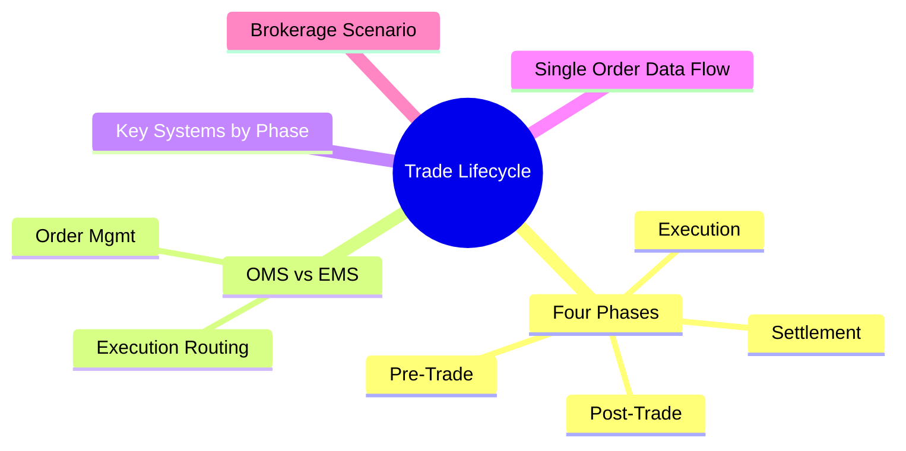
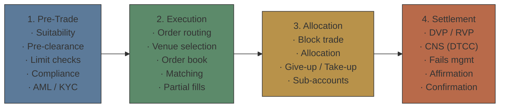
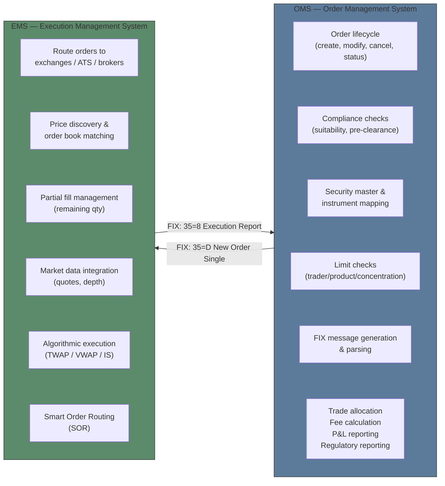
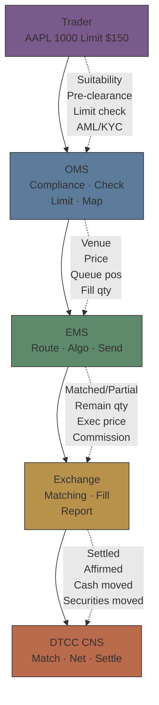
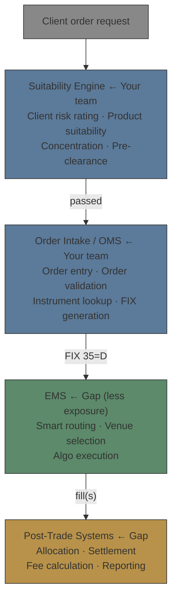

# Module 1: Trade Lifecycle Overview — Pre-Trade to Settlement

Estimated time: 2h
language: en
description: Full trade lifecycle map, boundary between OMS and EMS, and role of each system



## Learning Objectives (mapped to course CILOs)
- Understand the complete phases of the trade lifecycle and system boundaries — maps to CILO #1
- Distinguish OMS and EMS responsibilities — maps to CILO #6
- Identify data flow and dependencies from pre-trade through settlement — maps to CILO #1

---

## Real-World Case

Your team maintains the broker's pre-trade system (suitability / pre-clearance / order taking). One day, a US equity limit order passes all compliance checks and gets submitted. Thirty minutes later, the trader reports: "The EMS rejected the order — the instrument doesn't have a matching exchange code on the execution side."

Your system uses Bloomberg Ticker, but the EMS uses Reuters RIC + Exchange Code. Each side maintains its own security master table, and the sync lags by 15 minutes — just enough to miss this order.

> **Think**: Why did the pre-trade system pass the check while the execution side rejected it? Which link broke?
>
> *Answer: Data sync delay caused instrument mapping mismatch. The pre-trade system only knows "this stock is tradeable", but doesn't know the execution side needs a different identifier + venue combo to execute. The problem is in cross-system master data synchronization.*

---

## Core Content

### 1. The Four Phases of the Trade Lifecycle



> **Think**: Which phase do you deal with daily at the brokerage? Which phases are a black box to you?
>
> *Answer: Your domain = Phase 1 (Pre-Trade). Phases 2-4 are usually black boxes. This course exists to bridge that gap.*

> **Cloze**: "The pre-trade system's main job is to ensure orders pass all {compliance} and {risk} checks before entering the execution system."
>
> *Answer: compliance, risk*

### 2. OMS vs EMS: Responsibilities at the Boundary



> **Think**: The diagram shows OMS sending an order to EMS. If the OMS sends a duplicate ClOrdID, how does the EMS handle it?
>
> *Answer: EMS responds with ExecType=8 (Rejected), RejectReason=11 (Duplicate ClOrdID). The OMS must generate unique ClOrdIDs — this is the OMS's responsibility, not the EMS's.*

**Example — Typical FIX order flow:**
```text
OMS ──▶ 35=D (New Order Single) ──▶ EMS
  ClOrdID=20250101-001
  Symbol= AAPL
  Side= 1 (Buy)
  OrdType= 2 (Limit)
  Price= 150.00
  OrderQty= 1000

EMS ──▶ 35=8 (Execution Report) ──▶ OMS
  ClOrdID=20250101-001
  ExecType= 0 (New)
  OrdStatus= 0 (New)
  LeavesQty= 1000

  ... (later, when matched) ...

EMS ──▶ 35=8 (Execution Report)
  ClOrdID=20250101-001
  ExecType= 2 (Fill)
  OrdStatus= 2 (Filled)
  LastShares= 1000
  LastPx= 149.95
  LeavesQty= 0
```

> **Predict**: If the OMS sends an order and the EMS rejects it because the price falls outside the valid range, how should the OMS handle it?
>
> *Answer: The OMS should log the rejection reason, update the order status to Rejected, and notify the trader. It should NOT auto-resubmit — since a price constraint was violated, manual intervention is needed.*

### 3. Key Systems and Roles by Phase

| Phase      | Key Systems                                 | Data Flow                                                   | Common Issues                                                                     |
| ---------- | ------------------------------------------- | ----------------------------------------------------------- | --------------------------------------------------------------------------------- |
| Pre-Trade  | OMS, CRM, Compliance System                 | Client data → limits → product mapping → order              | Security master mismatch; Client tier permissions expired                         |
| Execution  | EMS, Algo Engine, SOR                       | OMS → FIX → EMS → exchange → fill → report → OMS            | High latency → price slippage; Low liquidity → partial fills                      |
| Allocation | OMS, Allocation Engine                      | Block trade → break out → sub-accounts                      | Allocation split deviates from client instructions; Minimum lot restrictions      |
| Settlement | CTM / DTCC, Custodian Bank, Clearing Broker | Confirm → match → clear → settle → cash/securities transfer | Settlement fail → penalty; Counterparty default → loss; Wash trade false positive |

> **Cloze**: "In the trade lifecycle, the {OMS} is the brain for order management, the {EMS} is the arm for execution, and {DTCC} is the central hub for clearing and settlement."
>
> *Answer: OMS, EMS, DTCC*

### 4. Data Flow: A Single Order's Complete Journey



> **Think**: In this diagram, which link is most likely to break and cause the whole trade to fail?
>
> *Answer: Instrument mapping — from OMS to EMS to Exchange, each hop needs the correct identifier. A mapping failure at any link causes the order to be rejected or executed against the wrong product. As the person maintaining the pre-trade system, this is the area to watch most closely.*

### 5. Brokerage Scenario: Where Your System Sits in the Big Picture

In the brokerage architecture, your pre-trade / suitability system sits at the **start** of the lifecycle:



> **Spot the Mistake**: Someone says "If the suitability check passes, the order is guaranteed to execute." What's wrong with this statement?
>
> *Answer: Suitability only checks whether this product is appropriate for this client. The order can still fail due to instrument mapping issues, price outside range, insufficient limits, low liquidity on the EMS side, an exchange reject, and more. Suitability passed ≠ guaranteed execution.*

> **Predict**: If your suitability system has a batch job delay that prevents a client restriction update from being reflected in time, and the order gets rejected at the EMS only after submission, what are the consequences?
>
> *Answer: The trader wastes time managing an order that can't execute, and the client experience suffers. In the worst case: if the restriction was a regulatory trading ban (e.g., insider list) and the order accidentally executes, that could be a regulatory violation. This is why a real-time restriction sync mechanism between pre-trade and EMS is essential.*

---

## Key Takeaways

- The trade lifecycle has four phases: Pre-Trade → Execution → Allocation → Settlement. Each phase has its own systems and data flows.
- OMS manages order lifecycle and compliance checks; EMS handles routing to exchanges and execution.
- Communication between OMS and EMS mainly uses the FIX protocol (35=D New Order Single, 35=8 Execution Report).
- Instrument mapping is the biggest pain point in cross-system integration — mismatched identifiers cause rejections.
- Suitability / pre-clearance is the starting point of a trade, but not a guarantee of execution. Later phases have their own checks.
- Trade date ≠ settlement date. Settlement cycles vary by asset class and market (US equities T+1, some FI T+2/T+3).

---

## Common Misconceptions

**Misconception**: "OMS and EMS are the same system, or only big banks need separate ones."
**Fact**: Even mid-sized brokerages almost always have separate OMS and EMS systems — from different vendors or maintained by different internal teams. OMS focuses on compliance and order management; EMS focuses on execution speed and market connectivity. This separation also provides risk isolation.

**Misconception**: "Once the order reaches the exchange, the job is done."
**Fact**: Execution is only the beginning. There is still allocation (distributing to sub-accounts), affirmation (confirming trade details), and clearing & settlement. The fastest case takes T+1, but complex multi-asset trades can take T+3 or longer.

---

## Spot the Mistake

In a system architecture diagram, someone placed the Suitability Engine after the EMS and before the Exchange, meaning "execute first, check suitability later."

**Why is this wrong?**

*Answer: Suitability is a pre-trade check and must complete before the order enters the execution system. If you find a suitability problem after execution, the trade has already happened — it can't be undone. The correct position is inside the OMS, before the EMS. Suitability + compliance check first, then send to EMS.*

---

## Feynman Explain

(Explain the "trade lifecycle" in the simplest terms to someone without a finance background. Example: you want to buy one share of Apple stock — from the moment you place the order to the moment you actually own the share, what happens in between?)


---

## Reframe

(Pause. Evaluate the "trade lifecycle" as a framework: is this four-phase division useful for your work? Are there situations you've encountered that this framework doesn't cover? For example, are there cross-phase problems this linear model can't capture? Write down your assessment.)

---

## Drill

Complete the quiz. MCQ tests from different angles — memory, application, scenario.

Run: `learn.sh quiz brokerage-ops 1`
