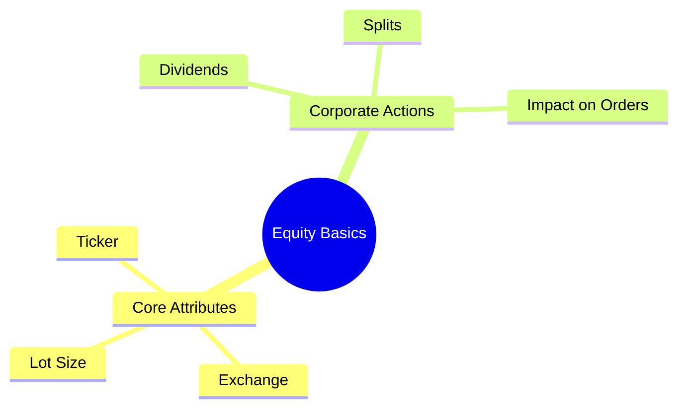
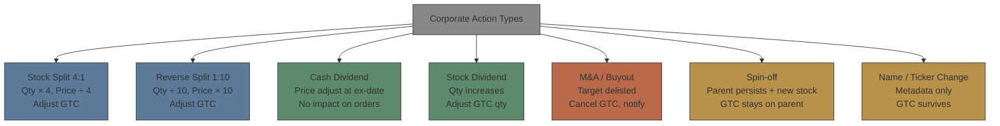

# Module 2: Asset Class Basics: Equity

Estimated time: 2h
language: en
description: Core attributes of equities, corporate action impact on open orders and GTC handling

## Learning Objectives (mapped to course CILOs)
- Master the core attributes of equities and their impact on OMS — maps to CILO #2
- Understand how corporate actions affect open orders — maps to CILO #2

---

## Real-World Case

Your OMS supports multi-asset trading. Last Monday, trader W placed a GTC (Good-till-Cancelled) limit order to buy 1000 shares of AAPL at $150. The next day, AAPL announced a 4:1 stock split with an ex-date on Friday.

Friday before market open, you get a production alert: multiple GTC orders show abnormal status — quantities show pre-split values, prices are out of market range. Trader complains in the group chat: "Why didn't the system auto-adjust my split orders?"

> **Think**: Why didn't the OMS automatically adjust the orders affected by the split? Who should normally handle this?
>
> *Answer: A stock split is a "corporate action" — normally handled by the back-office / corporate actions team, not automatically by the OMS. The OMS needs to receive adjustment notices from the corporate actions system, then adjust or cancel affected GTC orders per the rules. When that data flow breaks, you get the situation the trader saw.*

---

## Core Content

### 1. Equity Core Attributes

| Attribute | Description |
|-----------|-------------|
| Ticker | AAPL, MSFT, JPM |
| ISIN | US0378331005 |
| CUSIP | 037833100 |
| Exchange | NASDAQ, NYSE |
| Currency | USD |
| Par Value | $0.00001 (nominal, N/A) |
| Shares Outstanding | 15.5B (changes w/ CAs) |
| Lot Size | 1 (US) = 100 (some mkt) |
| Trading Unit | 1 share |
| Settlement Cycle | T+1 (US equities 2024+) |

**Why this matters for OMS:**

- **Ticker / ISIN / CUSIP** — the foundation of order identification. Different systems favor different identifiers; mapping is a core challenge
- **Lot Size** — affects minimum order quantity checks. Suitability engine must verify qty % lot size == 0
- **Settlement Cycle** — affects settlement workflow. T+1 equities and T+2 bonds need different handling logic
- **Currency** — cross-currency trades need FX conversion. OMS must track original currency vs settlement currency

> **Think**: When your pre-trade system does limit checks, if the client account is in USD but the product is JPY-denominated, which exchange rate should the limit comparison use?
>
> *Answer: Use the spot FX rate to convert the product value into the client's base currency before comparing. Stale rates could overestimate or underestimate the limit. This means the pre-trade system needs a real-time FX feed.*

> **Cloze**: "The standard trading unit for US equities is {1 share}, but some historically older markets (like Taiwan, Hong Kong) use {1000 or 100 shares} as the standard unit. The OMS must validate minimum order quantities based on {exchange rules}."
>
> *Answer: 1 share, 1000 or 100 shares, exchange rules*

### 2. Corporate Actions Impact on Orders

Corporate actions are one of the OMS's biggest headaches. Here are the most common types and their effect on orders:

**How the OMS should handle each:**

| Corporate Action Type | Impact on Open Orders               | OMS Handling                                                    |
| --------------------- | ----------------------------------- | --------------------------------------------------------------- |
| Stock Split           | Adjust qty and price                | Find all affected GTC/GTD orders, adjust qty and price by ratio |
| Reverse Split         | Same, watch rounding                | May produce fractional shares; must decide to round up or down  |
| Cash Dividend         | No impact on price/qty              | Accounting changes around ex-date, but suitability unaffected   |
| Stock Dividend        | Similar to split, qty increases     | Adjust GTC order qty                                            |
| M&A / Buyout          | Target stock delisted               | Cancel all GTC orders, notify holding clients                   |
| Spin-off              | Original stock persists + new stock | GTC orders usually stay on parent, new stock handled manually   |
| Name / Ticker Change  | Metadata only                       | Update symbol/name in system, GTC orders remain valid           |

> **Predict**: If the corporate actions team batch-processes split data and updates the master after market close, and your OMS receives the update the night before the ex-date. But your system only scans master data changes once before market open. A GTC order gets amended at 9:01 AM on ex-date — has the split adjustment already been applied?
>
> *Answer: If the OMS only scans master data changes once (e.g., 8:00 AM), the 9:01 AM amend happens after the scan. The amend must be aware the split has already occurred. The correct design: OMS should trigger an event when master data changes (not poll), and should lock related GTC orders from modification during the corporate action window until adjustments complete.*

---

## Spot the Mistake

Someone says "After a stock split, my GTC sell limit price should stay the same because I still want to sell at that price."

**Why is this wrong?**

*Answer: Wrong. After a split, the stock price adjusts proportionally. If a GTC sell limit at $100 stays at $100 after a 4:1 split, the stock is now trading at ~$25, so the order is far above market and will never fill. Regulators also don't allow such pricing. Correct treatment: qty × 4, price ÷ 4.*
