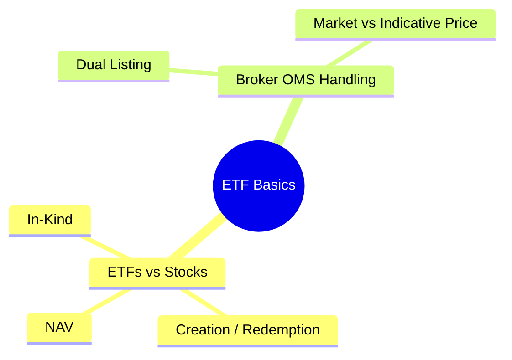

# Module 3: Asset Class Basics: ETF

Estimated time: 2h
language: en
description: ETF structure — NAV vs market price, premium/discount, creation/redemption mechanics, suitability handling in the OMS



## Learning Objectives (mapped to course CILOs)
- Distinguish ETF NAV from market price and explain premium/discount — maps to CILO #2
- Explain ETF creation/redemption mechanics and the Authorized Participant role — maps to CILO #2
- Apply correct suitability and pricing handling for ETF orders in the OMS — maps to CILO #2

---

## Core Content

### 1. ETFs: How They Differ from Stocks

ETFs look like stocks and trade like stocks, but the underlying mechanics are completely different.

| ETF | Stock |
|-----|-------|
| Basket of assets (index) | Company ownership (one share = one vote) |
| Has NAV and Market Price | Only Market Price |
| Can be created/redeemed | Fixed supply (except buyback/secondary offering) |
| Authorized Participants (AP) do creation/redemption | No such mechanism |
| Has expense ratio | No expense ratio |
| Has tracking error | N/A |
| Dividends paid centrally | Each company pays individually |

**ETF Creation / Redemption Mechanics:**

```text
   Creation Basket                     Redemption Basket
  ┌─────────────────────────┐        ┌─────────────────────────┐
  │ AAPL 1000 shares        │        │ ETF Shares (5000 units) │
  │ MSFT 2000 shares        │        │                         │
  │ GOOGL 500 shares        │        │                         │
  │ Cash (for dividends)    │        │                         │
  └──────────┬──────────────┘        └──────────┬──────────────┘
             │                                  │
             ▼                                  ▼
    ┌──────────────────┐              ┌──────────────────┐
    │  AP (Authorized  │              │  AP (Authorized  │
    │   Participant)   │              │   Participant)   │
    └────────┬─────────┘              └────────┬─────────┘
             │                                 │
             ▼                                 ▼
    ┌──────────────────┐              ┌──────────────────┐
    │  ETF Issuer      │              │  ETF Issuer      │
    │  (e.g. BlackRock)│              │  (e.g. BlackRock)│
    │  Creates ETF     │              │  Redeems ETF     │
    │  Shares          │              │  Shares          │
    └──────────────────┘              └──────────────────┘
```

**Why this matters for your OMS:**

- **NAV ≠ Market Price**: An ETF's market price can trade at a premium or discount. For suitability checks, which price do you use for limits? Usually market price — that's what the trader actually pays
- **ETF Creation/Redemption is institutional-level**: Retail clients can only buy/sell ETF shares, not create or redeem directly. Your OMS doesn't need to support creation/redemption (unless you have an AP business)
- **Active ETF portfolios are opaque**: Some ETFs (like ARKK) don't disclose holdings daily. The suitability engine can't check concentration on the underlying securities
- **Tracking error**: An ETF's tracking error is a suitability factor (high tracking error means the ETF is drifting from its index)

> **Think**: A client wants to buy $100K of SPY (S&P 500 ETF). What should the suitability engine check?
>
> *Answer: Check SPY itself for suitability (non-leveraged, diversified, liquid). But you can't check suitability on all 500 underlying holdings one by one (holdings change daily). This is the difficulty of "look-through" checks for ETFs — your system may need to distinguish between ETFs with transparent, stable holdings (like SPY) and opaque ones (like ARKK).*

> **Cloze**: "When an ETF's market price deviates from its NAV, the difference is called {premium or discount}. APs (Authorized Participants) use {arbitrage} to bring the price back toward NAV — when price > NAV, APs create new ETF shares and sell them, pocketing the spread."
>
> *Answer: premium or discount, arbitrage*

### 2. Practical Application in the Broker's OMS

In your brokerage's system, how equities and ETFs are handled differently:

| Aspect | Equity | ETF |
|--------|--------|-----|
| Suitability | Check company fundamentals (sector concentration) | Check ETF type (leveraged/inverse/active/passive); limited look-through possible |
| Corporate Actions | Splits/dividends need GTC order adjustment | Rare but ETF issuer may liquidate |
| Pricing | Single market price | Need NAV + market price + premium/discount |
| Restricted Shares | Needs separate check | N/A (ETF has no restricted share concept) |

> **Spot the Mistake**: Someone designs a suitability check that runs restricted-securities checks on every underlying holding of SPY (e.g., checking whether AAPL, MSFT, GOOGL are restricted securities).
>
> *Answer: This is wrong. The ETF's underlying holdings are managed by the ETF issuer. The client buys ETF shares, not the individual stocks. Don't do look-through restricted security checks on ETFs. Just check whether the ETF itself is suitable for that client.*

> **Predict**: If Apple announces a massive stock buyback, would it affect the ETF IVV (iShares Core S&P 500 ETF)? What impact does this have on your OMS?
>
> *Answer: Yes. Apple is an S&P 500 component, so a buyback changes IVV's holding weight. But this is not a corporate action that requires OMS intervention — the ETF issuer adjusts the basket composition automatically. The OMS doesn't need to do anything. However, if the buyback causes AAPL's index weight to exceed a regulatory limit, the suitability engine may need to recalculate the client's single-stock concentration.*

---

### Why This Matters

- **Stock splits are a common source of production incidents**: If the OMS doesn't handle GTC order adjustments correctly, consequences range from trader complaints to regulatory fines
- **ETFs are not stocks**: Applying stock logic to ETFs causes errors — NAV vs market price, look-through checks, tracking error are all ETF-specific
- **Corporate action data flow is a key middle-office KPI**: The speed of corporate action data traveling from issuer → data vendor (Bloomberg/Refinitiv) → back office → OMS → EMS directly affects system correctness

---

## Key Takeaways

- Stock splits/reverse splits directly affect GTC order quantity and price; OMS must complete adjustments before ex-date
- Latency in corporate action data flow (issuer → vendor → back office → OMS) is a system integration pain point
- ETFs differ from stocks: two prices (NAV and market), creation/redemption mechanism, potentially opaque holdings
- ETF suitability should not use look-through checks on underlying holdings; focus on the ETF's own attributes
- When handling ETF orders, the OMS must distinguish market price from NAV for different check scenarios

---

## Common Misconceptions

**Misconception**: "An ETF tracks an index, so the ETF's risk equals the index's risk."
**Fact**: ETFs have tracking error, liquidity risk (niche ETFs trade thinly), premium/discount risk, and potential early liquidation risk. Tracking an index is not the same as being as safe as the index. Leveraged ETFs amplify volatility even further.

**Misconception**: "All GTC orders need adjustment after every corporate action."
**Fact**: Only actions that affect quantity and price (splits, reverse splits, stock dividends) need adjustment. Cash dividends don't affect orders. M&A and delisting require cancellation. The corporate actions team should provide a classification, and the OMS applies different logic per classification.

---

## Spot the Mistake

```text
System design: When a corporate action occurs, the OMS iterates over all Open Orders
for the affected product, directly updates order price and order qty, and then
continues processing new orders.
```

**What step was skipped?**

*Answer: No notification to the trader. Before adjusting GTC orders, the trader should be notified of the upcoming change, or at minimum sent a notification after the adjustment. The trader may have set stop-loss calculations based on the pre-adjustment price and quantity. Also, modifying orders via FIX requires sending an Order Cancel/Replace Request (35=G), not just updating the internal database directly.*

---

## Feynman Explain

(Explain to a junior trader: a stock announces a 2:1 split — what happens to your open market orders and limit orders? Why not just cancel them all?)


---

## Reframe

(Pause. Evaluate the claim that "ETFs don't need look-through checks." As regulations get stricter, does this position hold up? Is there a way to do adequate ETF suitability checks without checking every single underlying holding? Write your assessment.)

---

## Drill

Complete the quiz.

Run: `learn.sh quiz brokerage-ops 3`
