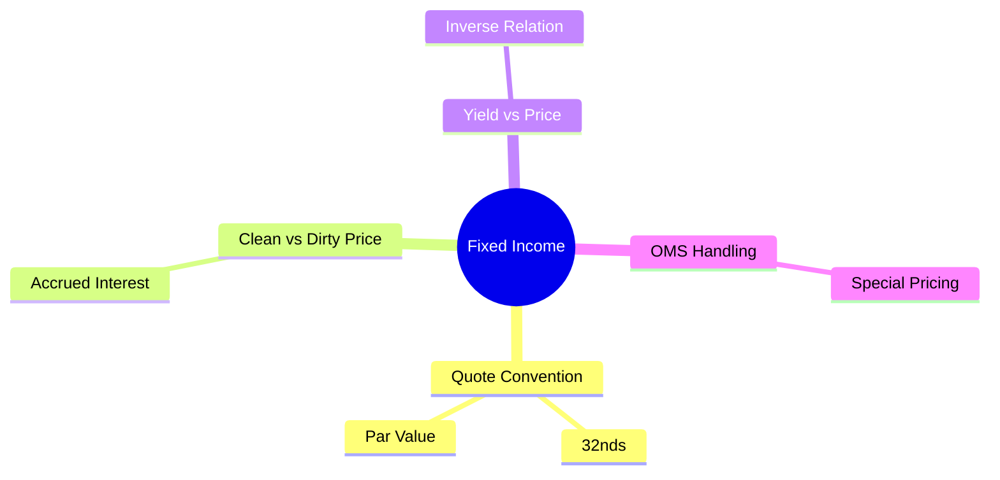

# Module 4: Asset Class Basics: Fixed Income

Estimated time: 2h
language: en
description: Bond pricing conventions, yield calculations, clean vs dirty price, special FI handling in OMS



## Learning Objectives (mapped to course CILOs)
- Master bond quotation conventions and price calculation — maps to CILO #2
- Understand the yield curve and price relationship — maps to CILO #2
- Identify special handling requirements for fixed income in OMS — maps to CILO #2

---

## Real-World Case

Your OMS supports mixed equity and bond accounts. A trader places a US Treasury Note buy order: "Buy 5M of the 10Y UST, price 98-12+." The order hits the suitability engine and returns an error: "Order value exceeds limit by $15,234.82."

The trader is furious: "Bloomberg says it's well within the limit!" Your team spends half a day debugging and finds:

1. The quote (98-12+) was parsed as $98.12 instead of $98.390625
2. Accrued interest was not included in the limit check
3. The $5M face value was treated as market value instead of the actual value at 98-12+

> **Think**: Why can't bond prices use a simple decimal? What does 98-12+ actually mean?
>
> *Answer: US Treasury quotes use thirty-seconds convention. Price is quoted as points + 1/32 fractions. 98-12 = 98 + 12/32 = 98.375. 98-12+ = 98 + 12.5/32 = 98.390625. This convention dates back to the paper-trading era and remains the standard today.*

---

## Core Content

### 1. Bond Quote Convention: Thirty-Seconds

```text
US Treasury Quote Format Examples
┌─────────────────────────────────────────────────────┐
│ Quote          │ Meaning            │ Decimal Value │
├─────────────────────────────────────────────────────┤
│ 98-00          │ 98 + 0/32          │ 98.000        │
│ 98-08          │ 98 + 8/32          │ 98.250        │
│ 98-12          │ 98 + 12/32         │ 98.375        │
│ 98-16          │ 98 + 16/32         │ 98.500        │
│ 98-12+         │ 98 + 12.5/32       │ 98.390625     │
│ 98-124         │ 98 + 12.25/32      │ 98.3828125    │
│ 98-127         │ 98 + 12.75/32      │ 98.3984375    │
└─────────────────────────────────────────────────────┘
```

**Common Conversion Errors:**
- Face value $5,000,000 bond, price 98-12+
- **Correct**: $5,000,000 × 98.390625% = $4,919,531.25
- **Common error**: $5,000,000 × 98.12% = $4,906,000 (off by $13,531.25)

> **Think**: If the price field in the database is decimal(10,6), what value should 98-12+ be stored as?
>
> *Answer: 98.390625. Not 98.12, not 98.12500. Don't store in split format — convert to a uniform decimal format at parse time.*

> **Cloze**: "The tick size (minimum price increment) for US Treasuries is {1/32}, or {0.03125} points. Short-term T-Bills use {discount yield} quotation instead of price."
>
> *Answer: 1/32, 0.03125, discount yield*

### 2. Clean Price vs Dirty Price

This is the most commonly overlooked issue with fixed income in an OMS.

```text
Clean Price vs Dirty Price
┌─────────────────────────────────────────────────────────────────┐
│                                                                 │
│  Dirty Price = Clean Price + Accrued Interest                   │
│                                                                 │
│  Clean Price = The price you see on screen (98-12+)             │
│                                                                 │
│  Accrued Interest = Interest accrued since the last coupon      │
│                     payment up to settlement date               │
│                                                                 │
│  What you actually pay = Dirty Price × Face Value               │
│                                                                 │
└─────────────────────────────────────────────────────────────────┘
```

**Example:**
- Buy 5M UST 10Y, coupon 4.25%, quoted 98-12+
- Last coupon: 2024/8/15
- Settlement: 2024/10/20 (66 days since last coupon)
- Accrued Interest = 5,000,000 × 4.25% × (66/365) = $38,424.66
- Clean Price = $4,919,531.25
- **Dirty Price (actual payment)** = $4,919,531.25 + $38,424.66 = **$4,957,955.91**

```text
Buyer's perspective: Pays Dirty Price
  ┌───────────────────────────────────────────────┐
  │ Buyer pays $4,957,955.91                      │
  │                                               │
  │ ┌──────────────────┐    ┌──────────────────┐  │
  │ │ Clean Price      │    │ Accrued Interest │  │
  │ │ $4,919,531.25    │    │ $38,424.66       │  │
  │ │ (= bond itself)  │    │ (= interest comp)│  │
  │ └──────────────────┘    └──────────────────┘  │
  │                                               │
  │ Next coupon date (11/15), buyer receives full │
  │ $106,250 interest                             │
  │ $106,250 - $38,424.66 (compensated to seller) │
  │ = $67,825.34 (net gain)                       │
  └───────────────────────────────────────────────┘
```

> **Think**: Should your suitability engine use clean price ($4,919,531) or dirty price ($4,957,956) for the limit comparison?
>
> *Answer: Use dirty price. That's the actual cash the client needs to have available. Using only clean price underestimates the required funds, which could lead to insufficient funds at settlement.*

> **Spot the Mistake**: Someone designs the OMS limit check logic as: "Calculate dirty price → compare to limit → reject if over." But the trader says "This order executes at $4.92M clean price, and the limit is $5M — why was it rejected?"
>
> *Answer: The issue is that dirty price ($4.957M) is below $5M... so why was it rejected? Possibly because the system used face value for comparison ($5M > $5M?), or the accrued interest calculation is wrong. The key point: the trader only looks at clean price, but the system uses dirty price. This is a communication and display mismatch.*

### 3. Yield vs Price Relationship

```text
Price vs Yield (Inverse Relationship)

   Price ↑
    │         ← When yield falls, price rises (premium bond)
    │           (coupon rate > market rate)
    │    ────
    │   │    │
    │   │    │  ← Par (price near 100)
    │   │    │    When yield ≈ coupon rate
    │   │    │
    │   │    │──  ← When yield rises, price falls (discount bond)
    │   │         (coupon rate < market rate)
    │   └───────────────→ Yield ↑
    │
    └───────────────────────────
```

**Why this matters for OMS:**

- **Price ≠ Value**: A bond at $100 is not worth $100. A price of 98-12+ means 98.39% of face value, not $98.39
- **Price convention varies by market**: US Treasuries use 32nds, European government bonds use decimal, corporate bonds may quote by yield
- **Yield is an input to suitability checks**: Bonds with excessively high yields (junk bonds) may need extra scrutiny
- **Duration affects limits**: Same face value, short-duration vs long-duration bonds have different price sensitivity. Limit checks should consider duration

> **Cloze**: "When market interest rates rise, the price of existing bonds {falls}, because newly issued bonds offer {higher yields}, making older bonds less attractive. This relationship is called {interest rate risk}."
>
> *Answer: falls, higher yields, interest rate risk*

### 4. Special FI Handling in the OMS

Compared to equities, fixed income needs special treatment in the OMS:

| Concern | Equities | Fixed Income |
|---------|----------|--------------|
| Price Convention | Decimal ($150.25) | 32nds / Decimal / Yield (varies by mkt) |
| Value Calculation | Qty × Price (simple multiplication) | Face × Price% + Accrued (multi-step) |
| Accrued Interest | None | Must calculate (affects actual payment) |
| Settlement Cycle | T+1 (uniform) | T+1 (T-Bills) / T+2 (Corp Bonds) |
| Corporate Actions | Splits/dividends/M&A | Call / Put / Maturity / Default |
| Minimum Increment | 1 share (US) | $1,000 face (wholesale) / $100 (retail) |
| Coupon Schedule | N/A | Affects AI calculation, needs tracking |
| Yield Consideration | N/A | Important for suitability |
| Market Data Vendor | Single source (Bloomberg/Reuters) | Multi-vendor (fragmented pricing, OTC) |

**Practical Considerations:**
- Fixed income is still mainly an OTC market (more than exchange-traded). OMS needs to support RFQ (Request for Quote) workflows, unlike equities' direct order entry
- Different bonds have different settlement cycles: your allocation / post-trade logic must differentiate by FI type
- OTC bond pricing sources can be unreliable; your suitability engine may encounter edge cases where "real-time price unavailable"

> **Predict**: A client account has a $10M limit. They simultaneously buy $5M in equities (market value) and $5M face value of bonds (clean price 98-12+). If the suitability engine uses dirty price for the bond portion, will the total exceed $10M?
>
> *Answer: Equities $5M + Bond dirty price ($4,919,531.25 + accrued interest ~$38K = ~$4.958M) = ~$9.958M < $10M, so within the limit. But if the engine used face value ($5M) and forgot to add accrued interest, it would still pass (~$10M). The dirty price check is more accurate.*

---

## Key Takeaways

- US Treasury quotes use thirty-seconds convention (98-12+ = 98.390625), not decimal
- Dirty Price = Clean Price + Accrued Interest. The client pays dirty price
- Limit checks must use dirty price. Using only clean price underestimates actual funding needs
- Yield and price have an inverse relationship. Yield itself is also an input to suitability checks
- FI's OTC nature (RFQ workflow, multi-vendor pricing, variable settlement cycles) is a key design differentiator for OMS

---

## Common Misconceptions

**Misconception**: "Face value equals bond value."
**Fact**: Face value is the amount the issuer repays at maturity. A bond's market value depends on the interest rate environment. A 100-face bond could be worth 95 (market rate above coupon) or 105 (market rate below coupon).

**Misconception**: "All bonds use the same quote convention."
**Fact**: US Treasuries use 32nds, European government bonds use decimal, US corporate bonds use decimal (usually), T-Bills use discount rate. Each has a different price calculation method. The OMS must support multiple price conventions.

---

## Spot the Mistake

```text
OMS receives an order:
Face: $5,000,000
Price: 98-12+
Side: Buy

System calculates market value = $5,000,000 × 98.12 / 100 = $4,906,000
(Assuming limit is $5M, system says OK)
```

**What's wrong?**

*Answer: (1) 98-12+ was incorrectly parsed as 98.12 — correct value is 98.390625. (2) Accrued interest wasn't added. (3) The actual funds needed are $4,957,955.91 (dirty price), which is $51,955.91 more than calculated. If the client's remaining limit is $4,950,000, this order would cause a settlement shortfall.*

---

## Feynman Explain

(Explain to a non-finance engineer: why does the same $100 face value bond sell for $95 to one person and $105 to another? Why isn't it always $100?)


---

## Reframe

(Pause. Evaluate the statement "FI needs multi-vendor pricing." How does this affect your system architecture? If your system only uses Bloomberg pricing and the Bloomberg feed goes down, what is your fallback strategy? Write down your assessment.)

---

## Drill

Run: `learn.sh quiz brokerage-ops 4`
