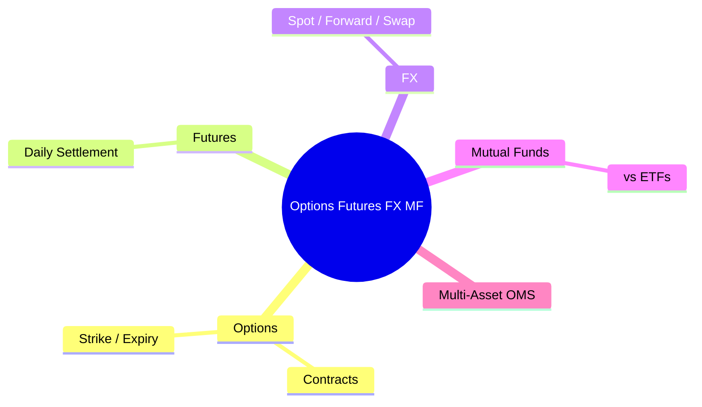

# Module 5: Asset Class Overview: Options, Futures, FX, Mutual Funds

Duration: 1.5h
language: en
description: Core attributes, margin/collateral mechanics, and OMS implications for four asset classes



## Learning Objectives (CILO Mapping)
- Understand option and futures margin mechanics — CILO #2
- Master FX spot trading conventions — CILO #2
- Identify mutual fund special handling in OMS — CILO #2

---

## Real-World Scenario

Your broker's system supports multi-asset orders. An institutional client opens positions across four products simultaneously:

1. Buy 100 contracts SPY $500 Call (Options)
2. Sell 5 contracts E-mini S&P 500 Futures
3. Buy EUR/USD $10M (FX)
4. Subscribe $500K Vanguard Total Bond Market Fund (Mutual Fund)

OMS fires all four orders into limit check — and breaks. Option premium uses wrong multiplier, futures margin not factored, FX settlement date mismatches equity, MF only accepts EOD processing. The trader asks: "Why can't one system handle everything uniformly?"

> **Think**: Why can't one system handle everything uniformly? What are the core differences across these four orders?
>
> *Answer: Each asset class has different pricing models, settlement cycles, margin/collateral requirements, and execution methods. Options carry Greeks risk, futures require daily mark-to-market settlement, FX has spot vs forward distinctions, MF uses end-of-day pricing only. OMS needs specialized handling for each asset class.*

---

## Core Content

### 1. Options: Contract vs Cash Equity

| Attribute | OMS Impact |
|-----------|------------|
| Multiplier | US equity options = 100 shares. Premium = price × 100 |
| Strike Price | Needs tracking for deep ITM/OTM status |
| Expiration | May need roll-over before expiry |
| Call/Put Type | Suitability direction differs (long call bullish) |
| European/American | American can be exercised early (affects risk) |
| Margin | Short options require margin (complex calculation) |
| Greeks (Delta/Gamma) | Risk assessment parameters, not always computed in OMS in real-time |

**Option Premium Calculation:**
```text
Option Premium = Quote Price × Multiplier × Contracts

Example: Buy 10 contracts SPY $500 Call, quoted at $12.50
Total Premium = $12.50 × 100 × 10 = $12,500
```

> **Think**: After the trader submits the order, should the suitability engine check the option's total premium or the underlying SPY's notional value?
>
> *Answer: Both. Premium is the actual cash cost, used for limit checks. Notional value ($500 strike × 100 × 10 = $500,000) is used for concentration checks, because the option's risk exposure is in the underlying SPY.*

> **Cloze**: "Selling {naked calls} requires posting {margin} because {upside risk is unlimited}. Buying options caps the maximum loss at {the full premium paid}."
>
> *Answer: naked calls, margin, upside risk is unlimited, the full premium paid*

### 2. Futures: Standardized Contracts, Daily Settlement

| Futures | Options | Cash Equity |
|---------|---------|-------------|
| Bilateral obligation | Buyer has right, no obligation | Ownership stake |
| Daily MTM settlement | Option premium paid upfront | No daily settlement |
| Requires initial margin | Short options require margin | No margin required |
| Has expiration | Has expiration | No expiration |
| Physical or cash settlement | Physical or cash settlement | Securities settlement |

**Futures Margin Calculation:**
```text
Initial Margin — must be deposited before opening a position
Maintenance Margin — if balance falls below this, margin call triggered
Variation Margin — daily MTM P&L settlement

Example: 1 contract E-mini S&P 500 Futures
  Multiplier: $50 × S&P 500 Index
  Current Index: 5,800
  Notional Value: $50 × 5,800 = $290,000
  Initial Margin: ~$12,000 (approx 4%)
  Maintenance Margin: ~$10,000
```

> **Spot the Mistake**: Someone says "Futures margin is like a down payment — you pay the rest later."
>
> *Answer: Wrong. Margin is not a down payment. It is performance bond — ensuring you can absorb daily settlement losses. The full notional value of the futures is always at risk. Margin is simply a credit guarantee you must maintain.*

> **Predict**: If a client is long 1 contract E-mini and the S&P 500 drops 2% in a day, what happens to the client's account?
>
> *Answer: Client's cash decreases by $290,000 × 2% = $5,800 (variation margin loss). If account balance falls below maintenance margin of $10,000, the broker issues a margin call requiring a top-up to initial margin of $12,000.*

### 3. FX: Spot, Forward, Swap

| Attribute | Description |
|-----------|-------------|
| Settlement | T+2 (most major pairs), USD/CAD/MXN T+1 |
| Quote Convention | Base/Quote (EUR/USD = 1.05 means 1 EUR = 1.05 USD) |
| Lot Size | Standard (100K), Mini (10K), Micro (1K) |
| Pips | Smallest price unit (EUR/USD 0.0001, USD/JPY 0.01) |
| NDF | Non-Deliverable Forward (non-convertible currencies) |

**FX Considerations in OMS:**

- **Currency conversion is a cross-cutting OMS concern**: Every multi-currency account limit check needs an FX rate
- **Multi-currency vs single-currency accounts**: Different account structures lead to different limit enforcement
- **FX trading suitability**: Leveraged FX may require special qualification
- **NDF (Non-Deliverable Forward)**: Settles using a fixing rate, not spot FX rate

```text
FX Handling in the Broker's OMS:
┌────────────────────────────────────────────────────────────────────┐
│  Client orders Buy EUR/USD 10M @ 1.0500                            │
│                                                                    │
│  OMS must verify:                                                  │
│  ├─ Is client USD limit sufficient? (10M × 1.05 = $10.5M)          │
│  ├─ Is client qualified for FX trading? (eligibility check)        │
│  ├─ Does client have USD or need to convert from another currency? │
│  └─ Does T+2 settlement align with other trades?                   │
│                                                                    │
│  OMS sends FIX to EMS (FX-specialized Execution System)            │
└────────────────────────────────────────────────────────────────────┘
```

> **Cloze**: "EUR/USD spot rate 1.0500 means 1 {EUR} = 1.0500 {USD}. If the euro strengthens to 1.0700, EUR has {appreciated} and USD has {depreciated}."
>
> *Answer: EUR, USD, appreciated, depreciated*

### 4. Mutual Funds: Key Differences from ETFs

| Mutual Fund | ETF |
|-------------|-----|
| Priced once daily (NAV) | Real-time Market Price + NAV |
| All orders execute at market close | Trades intraday anytime |
| Price = End-of-day NAV | Price = market supply/demand |
| Order cut-off time applies | No cut-off (intraday trading) |
| May charge load fees | No load fees (brokerage fees apply) |
| No creation/redemption mechanism | Has creation/redemption mechanism |
| Minimum investment limits | Buyable from one share |

**Mutual Fund Special Handling in OMS:**

- **EOD Batch Processing**: MF orders don't execute instantly. OMS collects all-day orders and submits them in a batch after market close
- **Cut-off Time**: Different funds have different order cut-off times (e.g., 4:00 PM ET)
- **Unknown NAV at order time**: Final price (NAV) is not known until after close — suitability checks must use previous NAV
- **Load Fee / 12b-1 Fee**: May include front-end load, back-end load, redemption fees — OMS must support these
- **Batch allocation on partial fills**: If the fund hits its daily inflow limit, OMS must support prorated allocation

> **Think**: A client subscribes to Vanguard Total Bond Market Fund at 3:59 PM (cut-off 4:00 PM), but NAV won't be published until 6:00 PM. What price does your suitability engine use for the limit check?
>
> *Answer: Previous day NAV. This is the industry standard practice — the current day's NAV is unknown at order time. However, this means the limit check may be biased due to NAV movement. Large NAV swings (> 2%) may require additional review.*

### 5. Multi-Asset OMS Integration Challenges

| | Equity | Option | Futures | MF |
|---|--------|--------|---------|-----|
| Price src | Real-time | Real-time | Real-time | EOD |
| Settlement | T+1 | T+1 | T+1 | T+1/T+2 |
| Margin | None | Yes (short) | Yes | None |
| FIX support | Yes | Yes | Yes | Limited |
| Execution | Direct | Direct | Direct | Batch |
| Min unit | 1 share | 1 contract | 1 contract | $100-$1M |
| Corp action | Split/Dvd | Adjust/Exp | Roll | Conv/Redm |

> **Predict**: A brokerage is integrating a new multi-asset OMS and wants to use one unified order validation logic across all asset classes. Which asset class do you think will be hardest to integrate?
>
> *Answer: Fixed Income or Mutual Funds. FI has different price conventions + accrued interest + OTC model. MF uses EOD batch + unknown price + cut-off time. Option margin calculations are complex but the rules are relatively well-defined.*

---

### Why This Matters

- **Multi-asset is the institutional norm**: A hedge fund client may trade equities, options, futures, FX, and mutual funds through the same broker simultaneously
- **Each asset class has a different settlement model**: Failing to distinguish settlement calendars by asset class can cause settlement failures
- **Limit checks must be cross-asset**: The client's total risk exposure is the sum across all assets. Siloed equity limits and futures limits miss the big picture

---

## Key Takeaways

- Option premium uses multiplier × price × qty. Suitability must check both premium and notional value
- Futures margin is not a down payment — it's performance bond. Daily MTM settlement affects account cash balance
- FX spot settles T+2; cross-currency limit checks need real-time FX rates
- MF orders are EOD batch, price unknown at order time (previous NAV). Cut-off times apply
- Multi-asset OMS limit checks must unify notional exposure across all asset classes

---

## Common Misconceptions

**Misconception**: "Futures and options are both derivatives — OMS handles them the same way."
**Fact**: Completely different. Futures impose bilateral obligations + daily settlement. Options grant unilateral rights + premium upfront. Margin calculations differ. OMS needs two separate logic sets.

**Misconception**: "FX is just currency conversion — it shouldn't count as a trade."
**Fact**: FX carries leverage, settlement risk, and regulatory reporting requirements. FX spot and FX forward are handled differently. For multi-currency accounts, FX conversion alone may trigger suitability checks.

---

## Spot the Mistake

```text
OMS design: All asset classes share the same price → value calculation:

MarketValue = Qty × Price
```

**Which asset classes does this formula fail for?**

*Answer: Fails for options (needs × multiplier × 100). Fails for bonds (needs face × price% + AI). Fails for futures (needs × multiplier × index value). Fails for FX (needs lot size standard consideration). Only equity's qty × price is correct.*

---

## Feynman Explain


---

## Reframe

(Pause. Evaluate the trade-offs between "one unified OMS handling all asset classes" vs "dedicated systems for each asset class." Is your brokerage's architecture unified? What do you think is the right trade-off?)

---

## Drill

Run: `learn.sh quiz brokerage-ops 5`
