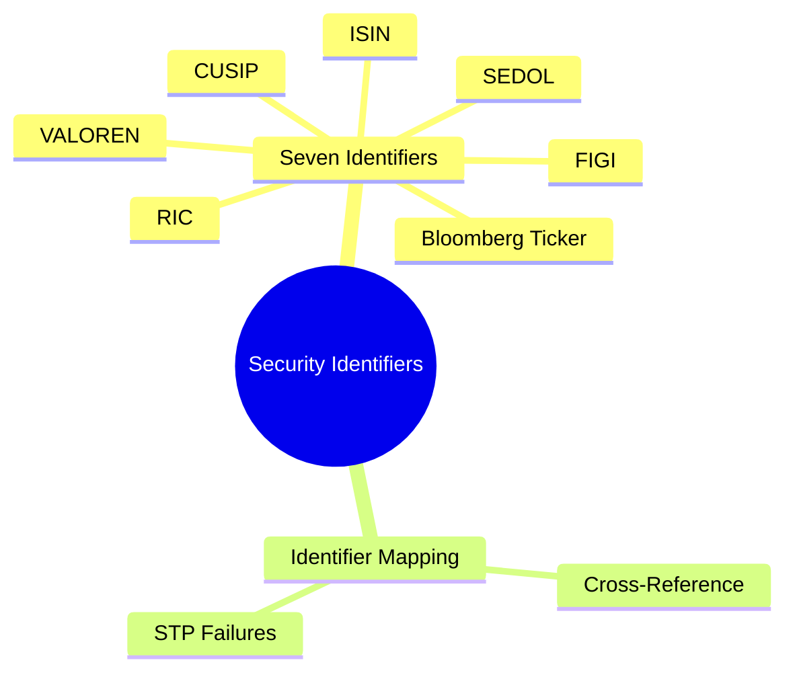
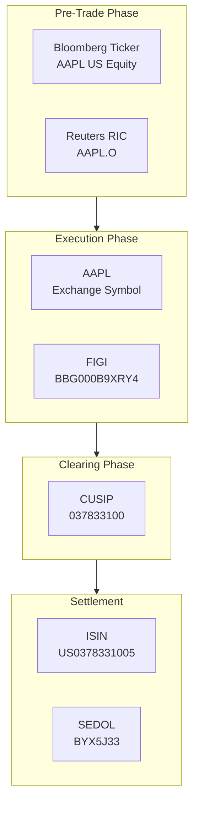
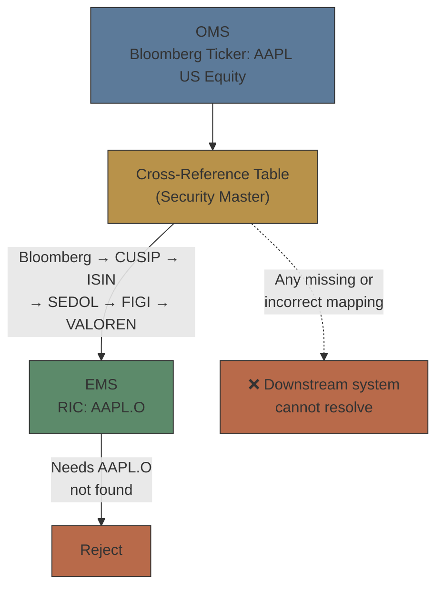

# Module 6: Security Identifiers

language: en
description: Coverage of seven security identifiers (ISIN/CUSIP/SEDOL/Bloomberg Ticker/RIC/FIGI/VALOREN), security master management, identifier mapping patterns, booking and conversion workflows, and the real impact of mapping failures



## Learning Objectives (CILO Mapping)
- Distinguish seven security identifiers by purpose and usage context — CILO #2
- Understand security master maintenance challenges — CILO #3
- Diagnose identifier mapping failures that cause STP breaks — CILO #6

---


## Real-World Scenario

Your brokerage's pre-trade team maintains the system. Last week, a US equity buy order passed all compliance checks: suitability passed, limit sufficient, client qualified. The system sent the order to EMS using CUSIP 037833100 (AAPL).

30 seconds later, EMS replied ExecType=8 (Rejected), reason: "Instrument not found on destination."

Debug revealed: OMS looked up the security by CUSIP, but the corresponding custodian uses ISIN as its primary key. CUSIP US037833100 and ISIN US0378331005 differ by the trailing check digit. In the OMS cross-reference table, this CUSIP→ISIN mapping was stale due to a delayed batch sync from the previous day.

> **Think**: Which identifier does the OMS use, and which does the custodian use? Why does the same stock need two identifiers? Where did the error occur?
>
> *Answer: OMS uses CUSIP (US market standard), custodian uses ISIN (cross-border settlement standard). The mapping error occurred in the cross-reference table sync delay — batch sync is not real-time, so newly issued or updated security mappings were not yet effective.*

---

## Core Content

### 1. Seven Security Identifiers: Who Uses What, When

## Chart: Security Identifier Ecosystem



**Why so many identifiers?**

Each identifier was created for a different purpose:

| Identifier           | Full Name                                                 | Example (AAPL)      | Pattern (Structure)                                                           | Primary Use / Users                                                   | Exchange Center Preference         |
| -------------------- | --------------------------------------------------------- | ------------------- | ----------------------------------------------------------------------------- | --------------------------------------------------------------------- | ---------------------------------- |
| **ISIN**             | International Securities Identification Number            | US0378331005        | 12 chars: 2-letter country prefix + 9-char national ID (NSIN) + 1 check digit (Luhn algorithm) | Cross-border settlement, regulatory reporting — custodians, DTCC, regulators | **Hong Kong** (HKEX settlement), London, New York |
| **CUSIP**            | Committee on Uniform Securities Identification Procedures | 037833100           | 9 chars: 6-char issuer + 2-char issue + 1 check digit                          | US settlement & clearing — DTC, US broker-dealers, clearing houses     | **New York** (NYSE/NASDAQ)         |
| **SEDOL**            | Stock Exchange Daily Official List                        | BYX5J33             | 7 chars: 6 alphanumeric + 1 check digit                                        | UK market identification — LSE, UK settlement systems                  | **London** (LSE)                   |
| **Bloomberg Ticker** | Bloomberg proprietary code                                | AAPL US Equity      | Ticker + exchange code + asset-class suffix (e.g., Equity)                     | Trading terminal, market data — traders, OMS pre-trade                 | All three — terminal-driven        |
| **Reuters RIC**      | Reuters Instrument Code                                   | AAPL.O              | Root ticker + "." + venue code (O=US, L=London, HK=HKEX)                       | Real-time quotes, market data — traders, EMS routing                   | All three — market data            |
| **FIGI**             | Financial Instrument Global Identifier                    | BBG000B9XRY4        | 12 alphanumeric, always starts with **BBG000** + 6 chars                       | Cross-system mapping bridge — OMS, multi-vendor integration            | All three — vendor-neutral         |
| **VALOREN**          | Swiss Securities Identifier                               | 1234567             | 7 digits, purely numeric                                                       | Swiss market settlement — SIX Swiss Exchange, Swiss settlement systems | None of the three — Switzerland (SIX) |

### The Three Big Exchange Centers: Hong Kong, London, New York

Each of the three centers runs on its **home identifier**. Routing across centers requires translation — a key that works in one center may not resolve in another.

| Exchange Center | Exchange     | Home Identifier                              | Example                                                                                                             | Notes |
| --------------- | ------------ | -------------------------------------------- | -------------------------------------------------------------------------------------------------------------------- | ----- |
| **Hong Kong**   | HKEX         | ISIN (settlement) + 5-digit local code       | Tencent: ISIN KYG875721634, code 0700, RIC 0700.HK, Bloomberg 700 HK Equity                                         | No CUSIP/SEDOL. International settlement keys on ISIN; local systems use the 5-digit HK stock code |
| **London**      | LSE          | SEDOL (domestic) + ISIN (cross-border)       | Shell: SEDOL BP6MXD8, ISIN GB00BP6MXD84, RIC SHEL.L, Bloomberg SHEL LN Equity                                       | SEDOL is the local workhorse; ISIN carries it cross-border |
| **New York**    | NYSE/NASDAQ  | CUSIP (domestic) + ISIN (cross-border)       | AAPL: CUSIP 037833100, ISIN US0378331005, RIC AAPL.O, Bloomberg AAPL US Equity                                     | CUSIP drives DTC clearing; ISIN used for foreign counterparts |

> **Think**: HSBC is listed in all three centers — London (LSE), Hong Kong (HKEX), and New York (NYSE via ADS). Why does the OMS need a separate identifier record per center instead of just one?
>
> *Answer: Because each center keys its own identifier universe: HSBA.L / SEDOL on LSE, 0005.HK / ISIN HK0000055516 on HKEX, and HBC.N / CUSIP on NYSE. One golden key (often ISIN) ties the records together, but every venue record must still resolve locally or routing fails with "instrument not found."*

> **Think**: Why do traders prefer Bloomberg Ticker over ISIN?
>
> *Answer: Bloomberg Ticker is human-readable (AAPL US Equity) — traders recognize it at a glance. ISIN (US0378331005) has no semantic meaning and doesn't map intuitively to the product. However, ISIN is the settlement and regulatory standard because it is globally unique and consistent across markets. Bloomberg Ticker may change due to Bloomberg's naming conventions (e.g., company rename), but ISIN remains constant for the product's lifetime.*

> **Cloze**: "ISIN consists of a {2-letter country prefix} + 9 national characters + {1 check digit}. CUSIP is a {9-character} code for US/Canada settlement. SEDOL is a {7-character} code used on the {London (LSE)} market. FIGI always begins with {BBG000}, and VALOREN is a {7-digit} numeric code for {Swiss securities}."
>
> *Answer: 2-letter country prefix, 1 check digit, 9-character, 7-character, London (LSE), BBG000, 7-digit, Swiss securities*

**VALOREN Details:**

Switzerland uses VALOREN (VALOR number) for securities on SIX Swiss Exchange settled via SIX SIS. VALOREN is typically 7 digits (e.g., VALOR 1234567) and, unlike ISIN, is purely numeric.

```text
VALOREN to ISIN Mapping:
  VALOR: 1234567 (7-digit Swiss identifier)
        + Country prefix "CH"
        + Check digit calculation
        → ISIN: CH0012345678
```

VALOREN remains important for:
- Swiss domestic settlement (SIX SIS uses VALOREN internally)
- Swiss Franc-denominated instruments
- Historical positions and legacy systems within Swiss banks

> **Think**: A Swiss bank's OMS receives an order for Nestlé. The OMS has the ISIN (CH0038863350) but the Swiss custodian needs a VALOREN to settle. How should the OMS handle this?
>
> *Answer: The OMS must maintain a VALOREN-to-ISIN mapping in its cross-reference table. Using VALOREN as an alias alongside ISIN (the golden key) ensures Swiss custody and settlement systems can process the trade. Without this mapping, Swiss market settlement will fail even though the ISIN is correct.*

### 2. Identifier Mapping (Cross-Reference): Why 40% of STP Failures Originate Here

STP (Straight-Through Processing) is the industry goal: from order entry to settlement with zero manual intervention. A DTCC study found that 40% of STP failures stem from identifier mapping issues.

> **Predict**: A stock IPOs today. Bloomberg already carries the Ticker, but CUSIP and ISIN have not yet synced into your OMS cross-reference table. A trader submits a buy order. What happens?
>
> *Answer: The order displays fine on the Ticker, but downstream routing/settlement fails — missing CUSIP/ISIN means the EMS or custodian rejects with "instrument not found." Newly issued securities are the top cause of mapping-gap STP failures.*

**Typical Mapping Failure Scenario:**



**Common Mapping Failure Causes:**

1. **Newly Issued Securities**: On IPO day, Bloomberg may have a Ticker already, but CUSIP/ISIN/VALOREN may not yet be assigned or synced to OMS
2. **Cross-Listings**: The same company listed on multiple exchanges (e.g., HSBC on LSE/HKSE/NYSE) has different identifier combinations per exchange
3. **Corporate Actions**: After a split, reverse split, or rename, some systems update while others lag
4. **Proprietary vs Standard**: Bloomberg Ticker / RIC are proprietary and require licenses; ISIN/CUSIP are standards, but different vendors' mappings may conflict
5. **Multi-Vendor Inconsistency**: No official real-time mapping exists between Bloomberg's FIGI and Refinitiv's RIC

> **Predict**: A 4:1 stock split happens overnight. The OMS updates its mapping table, but a downstream vendor's cross-reference still holds the pre-split record. The next buy order passes compliance. What happens?
>
> *Answer: STP breaks mid-lifecycle — systems disagree on the instrument record, so the order is rejected as "instrument not found" or books at a stale identifier. Corporate actions leave some systems updated while others lag, unless the change notification is pushed to every consumer.*

---

## Spot the Mistake

A junior developer says: "CUSIP US037833100 is just the first 9 characters of ISIN US0378331005 — we can derive ISIN from CUSIP and skip maintaining the mapping."

**Why is this wrong?**

*Answer: Wrong in the general case. Derivation only works for US/Canada instruments, where the ISIN's middle 9 characters happen to be the CUSIP. It fails for UK (SEDOL), Swiss (VALOREN), and cross-listed securities, and it silently propagates any stale CUSIP data. The cross-reference table must be maintained, not skipped.*

A developer says: "Our cross-reference batch sync runs every morning at 5 AM, so any identifier change before market open is always captured. Real-time sync is overkill."

**Why is this wrong?**

*Answer: Wrong. Same-day corporate actions, intraday IPO identifier assignments, and vendor mapping corrections can land after the batch. This module's opening failure happened exactly because a delayed batch sync left the CUSIP→ISIN mapping stale. Critical mappings need event-driven or intraday sync, not a single daily batch.*
