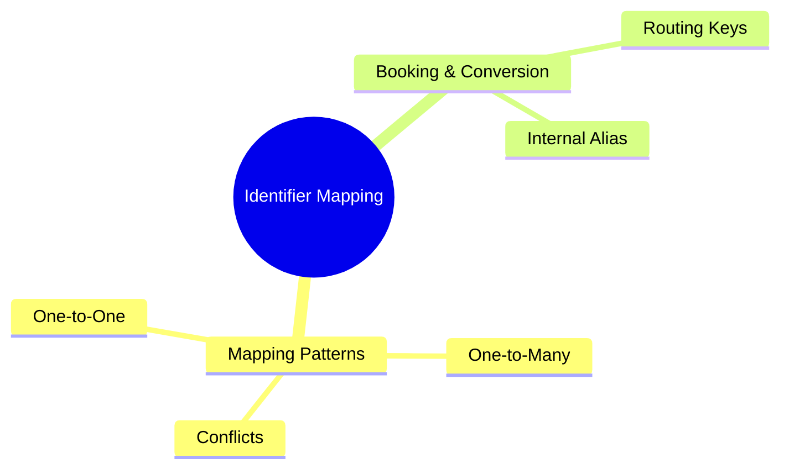
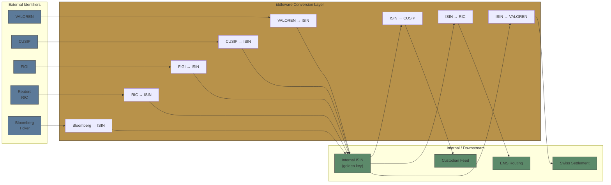

# Module 7: Identifier Mapping

language: en
description: Coverage of seven security identifiers (ISIN/CUSIP/SEDOL/Bloomberg Ticker/RIC/FIGI/VALOREN), security master management, identifier mapping patterns, booking and conversion workflows, and the real impact of mapping failures



## Learning Objectives (CILO Mapping)
- Distinguish seven security identifiers by purpose and usage context — CILO #2
- Understand security master maintenance challenges — CILO #3
- Diagnose identifier mapping failures that cause STP breaks — CILO #6

---

## Core Content

### 3. Identifier Mapping Patterns

Understanding the cardinality and behavior of identifier relationships is critical for OMS design.

**1:1 Mapping (One-to-One)**

The simplest case: one identifier maps to exactly one other identifier. Example: a US-only stock's ISIN maps to exactly one CUSIP.

```text
ISIN: US0378331005  ──→  CUSIP: 037833100
```

No ambiguity. OMS can perform a straightforward lookup.

**N:1 Mapping (Many-to-One)**

Multiple identifiers from different systems map to a single canonical identifier. Example: a cross-listed stock has different Bloomberg Tickers per exchange but one ISIN.

```text
Bloomberg: HSBA LN Equity  ──┐
Bloomberg: HSBC HK Equity  ──┤── ISIN: GB0005405286
Reuters: HSBA.L  ────────────┘
```

> **Think**: Your OMS receives orders for HSBC from both the London and Hong Kong desks. Both use different Bloomberg Tickers. How does OMS know these are the same instrument for limit aggregation?
>
> *Answer: OMS must resolve both Bloomberg Tickers to the same ISIN. The ISIN is the golden key that consolidates positions and limits. If OMS aggregates by Bloomberg Ticker, orders from the Hong Kong desk would be treated as a separate instrument — overstating available limits.*

**1:N Mapping (One-to-Many)**

One canonical identifier maps to multiple exchange-specific identifiers. Example: the same ISIN is traded on multiple exchanges.

```text
ISIN: US0378331005  ──→  NASDAQ: AAPL
                    ──→  BATS: AAPL
                    ──→  NYSE ARCA: AAPL
```

**Time-Dependent Mapping**

Identifier mappings change over time due to corporate actions. A mapping that was correct yesterday may be wrong today.

> Timeline:
>   T-1: ISIN US0378331005  ←→  Bloomberg Ticker "AAPL US Equity"
>   T+0: Company renames to "APPLE INC." → Bloomberg changes Ticker to "AAPL2 US Equity"
>   T+1: Some OMS vendors update, others still use "AAPL" — mapping table now stale

An OMS cross-reference table without a temporal dimension (effective date / end date) cannot distinguish pre-rename from post-rename mappings.

**Lossy Mapping**

Some identifier conversions lose information. Example: a Bloomberg Ticker includes exchange context (AAPL US Equity includes "US Equity" indicating the listing venue), but CUSIP does not encode exchange information. Converting Bloomberg Ticker → CUSIP loses the venue detail.

```text
Lossy conversion:
  Bloomberg: "AAPL US Equity"  ──→  CUSIP: 037833100
  Information lost: The "US Equity" venue context is dropped.
```

> **Predict**: Your OMS receives a Bloomberg Ticker "SAP GY Equity" for SAP SE. You convert it to ISIN DE0007164600. The EMS needs a Reuters RIC to route. Your cross-reference table maps ISIN DE0007164600 → RIC SAPG.DE. But the order was meant for Xetra, not Frankfurt floor trading. What went wrong?
>
> *Answer: The Bloomberg Ticker "GY" indicates Xetra, but the RIC "SAPG.DE" may point to a different venue or the floor. The lossy ISIN→RIC mapping dropped the venue preference. Lossy mappings require the OMS to preserve routing metadata beyond just the identifier.*

### 4. Booking & Conversion Patterns

In practice, the OMS sits between pre-trade systems (which use trader-friendly identifiers) and post-trade systems (which use settlement-standard identifiers). The mapping layer handles booking and conversion.

```text
Pre-Trade                    OMS Core                     Post-Trade
─────────                    ────────                     ──────────
Trader enters:               OMS maps to:                 EMS needs RIC for routing
  Bloomberg Ticker           Internal ISIN                Custodian needs CUSIP/ISIN for settlement
  or FIGI                    (golden key)                 Clearing house needs SEDOL
  or RIC                                                Regulator needs ISIN + LEI
```

**Booking Identifier vs Trading Identifier:**

| Phase                   | Identifier Used                      | Example          |
| ----------------------- | ------------------------------------ | ---------------- |
| Pre-trade (order entry) | Bloomberg Ticker, RIC, Alias         | "AAPL US Equity" |
| Execution routing       | RIC, Exchange Code, FIGI             | "AAPL.O"         |
| Trade booking           | ISIN, CUSIP                          | "US0378331005"   |
| Clearing                | CUSIP (US), SEDOL (UK), VALOREN (CH) | "037833100"      |
| Settlement              | ISIN (global), VALOREN (Swiss)       | "US0378331005"   |

**The Cross-Reference Table as Middleware:**



**Booking Failures Due to Mapping Gaps:**

1. **Missing VALOREN mapping**: OMS identifies Swiss security by ISIN but cannot produce VALOREN for SIX SIS → settlement rejected
2. **Stale RIC mapping**: Corporate action changed the RIC, but OMS cross-reference still points to old RIC → EMS rejects as "instrument not found"
3. **Cross-listing ambiguity**: OMS holds ISIN for a dual-listed stock but doesn't know which exchange the trade belongs to → EMS routes to wrong venue
4. **FIGI vs Bloomberg mismatch**: Vendor A provides FIGI, vendor B provides Bloomberg Ticker — cross-reference table gets out of sync → different departments see different positions

> **Think**: Your OMS uses ISIN internally as the golden key. For a UK equity trade, the EMS needs SEDOL, and the custodian needs ISIN. The cross-reference table correctly maps ISIN→SEDOL. But the trade is booked with the wrong SEDOL because the equity underwent a corporate action yesterday. What happens?
>
> *Answer: The EMS accepts the order (SEDOL lookup succeeds), the trade executes on the correct stock. The booking to the custodian uses ISIN (correct). But the clearing house (LCH) uses the stale SEDOL → clearing fails. The trade is stuck: executed but not settled. The OMS needs a real-time or event-driven sync trigger tied to corporate actions, not just daily batch updates.*

> **Cloze**: "The OMS conversion layer maps {trading identifiers} (used by traders pre-trade) to {booking identifiers} (used by custodians post-trade). The {cross-reference table} acts as middleware between these two domains. A missing mapping in this layer causes {STP failure} — the trade executes but cannot settle."
>
> *Answer: trading identifiers, booking identifiers, cross-reference table, STP failure*

---

## Spot the Mistake

A developer says: "A single static cross-reference table is fine — when a corporate action happens, we just overwrite the old mapping with the new one."

**Why is this wrong?**

*Answer: Overwriting destroys history. Trades booked before the corporate action still need the old mapping for reconciliation, tax, and audit reconstruction. Without a temporal dimension (effective/end dates), the table cannot distinguish pre-rename from post-rename mappings — a mapping correct yesterday becomes wrong today.*

A developer says: "Routing metadata like the listing venue doesn't matter — once we map the Bloomberg Ticker to ISIN, the EMS can figure out the rest."

**Why is this wrong?**

*Answer: Wrong. The conversion is lossy — "AAPL US Equity" carries venue context that ISIN (and CUSIP) do not encode. Dropping venue metadata routes orders to the wrong exchange, exactly like the SAP GY (Xetra) example above. OMS must preserve routing metadata beyond the bare identifier.*
