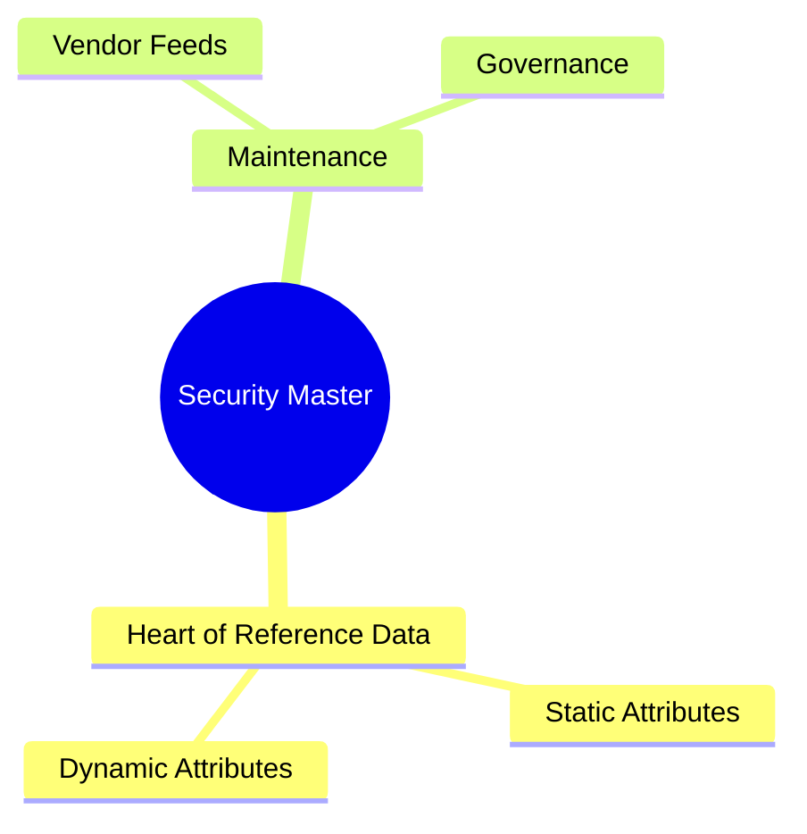

# Module 8: Security Master

language: en
description: Coverage of seven security identifiers (ISIN/CUSIP/SEDOL/Bloomberg Ticker/RIC/FIGI/VALOREN), security master management, identifier mapping patterns, booking and conversion workflows, and the real impact of mapping failures



## Learning Objectives (CILO Mapping)
- Distinguish seven security identifiers by purpose and usage context — CILO #2
- Understand security master maintenance challenges — CILO #3
- Diagnose identifier mapping failures that cause STP breaks — CILO #6

---

## Core Content

### 5. Security Master: The Heart of the Heart

```text
Security Master Data Model (Simplified)
┌───────────────────────────────────────────────────┐
│              Security Master Record               │
├───────────────────────────────────────────────────┤
│ Internal ID: SEC-123456 (OMS internal unique key) │
│                                                   │
│ Standard Identifiers:                             │
│   ISIN:      US0378331005                         │
│   CUSIP:     037833100                            │
│   SEDOL:     BYX5J33                              │
│   FIGI:      BBG000B9XRY4                         │
│   VALOREN:   (N/A for US equities)                │
│                                                   │
│ Proprietary Identifiers:                          │
│   Bloomberg Ticker: AAPL US Equity                │
│   Reuters RIC:     AAPL.O                         │
│                                                   │
│ Market Attributes:                                │
│   Exchange: NASDAQ                                │
│   Currency: USD                                   │
│   Asset Class: Equity                             │
│   Lot Size: 1                                     │
│   Settlement Cycle: T+1                           │
│                                                   │
│ Corporate Actions:                                │
│   Last Split: 2025-08-28 (4:1)                    │
│   Dividend Schedule: Quarterly                    │
│   Pending Actions: None                           │
└───────────────────────────────────────────────────┘
```

**Security Master Maintenance Challenges:**

- **Single Source of Truth**: Who has final edit authority? Bloomberg data feed vs manual maintenance vs clearing house feed
- **Data Source Conflicts**: Bloomberg says a bond settles T+2, DTCC says T+1 — which takes priority?
- **New Product Onboarding**: How many days before IPO is the record created? Who is responsible for the initial setup?
- **Change Notification**: When a corporate action occurs, who triggers the security master update? How are downstream systems notified?
- **Multi-Market Listings**: Same ISIN maps to multiple exchange codes — how does the master record handle 1:N mappings?
- **Multi-Currency Support**: Swiss Franc instruments need VALOREN; the same issuer's USD bonds trade under CUSIP — master must handle per-currency identifiers

> **Think**: Bloomberg's feed says a bond settles T+2; the DTCC clearing feed says T+1. Which source wins, and how should the master record resolve it?
>
> *Answer: Settlement data is a clearing/settlement attribute — the clearing house feed (DTCC) is authoritative for it, while Bloomberg is authoritative for market-data attributes. Design the master to tag each attribute with its source of truth and record the conflict, rather than declaring a single winner for the whole record.*

> **Predict**: A Swiss security's master record has an ISIN but no VALOREN. A trader buys it into a Swiss custody account. What happens?
>
> *Answer: Execution succeeds, but settlement through SIX SIS fails — Swiss settlement needs the VALOREN. The trade is executed but stuck, a classic STP break caused by an incomplete master record.*

> **Cloze**: "The security master's {golden key} should be an identifier that does not change with corporate actions. In practice, this is usually {ISIN}. The OMS internal {Internal ID} is the relational key between systems and should not be exposed to external interfaces."
>
> *Answer: golden key, ISIN, Internal ID*

> **Predict**: A stock splits 4:1, but the security master is not updated until 10 AM — after the market open. A GTC limit order still references the old price. What happens if it fills before the update?
>
> *Answer: The GTC order carries pre-split qty/price and fills at the wrong quantity/price. That is why change notification must fire immediately on the corporate action, and why adjustments must land before the ex-date open — a late master update means wrong-price fills.*

---

## Spot the Mistake

Someone designing a security master says: "Bloomberg Ticker is the most intuitive — let's use it as the primary key. When Bloomberg changes the ticker, we'll just update it."

**Why is this wrong?**

*Answer: Wrong. Bloomberg Ticker changes on company rename, restructuring, or Bloomberg's own naming convention updates. Using Ticker as the primary key means all related data (order history, positions, limits) requires cascading updates on every change. Plus, Bloomberg Ticker is proprietary — switching vendors invalidates the entire dataset. The correct approach uses ISIN (standardized, stable) as the golden key.*
