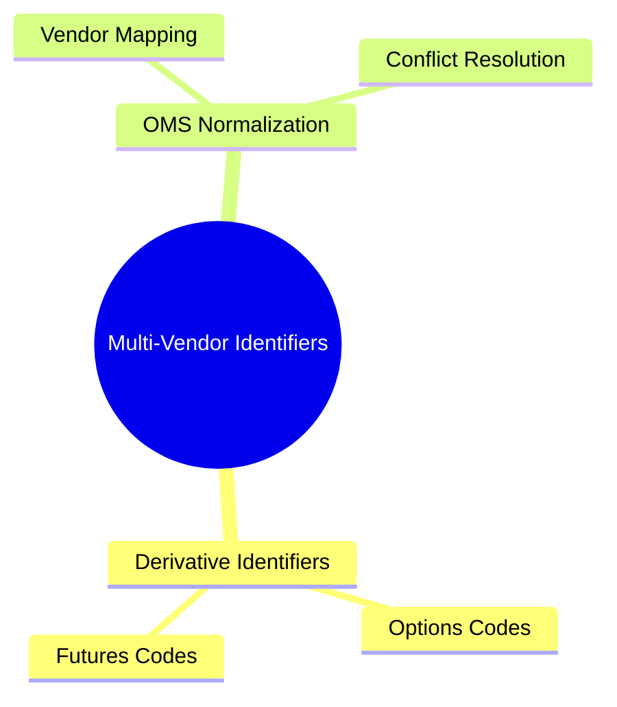
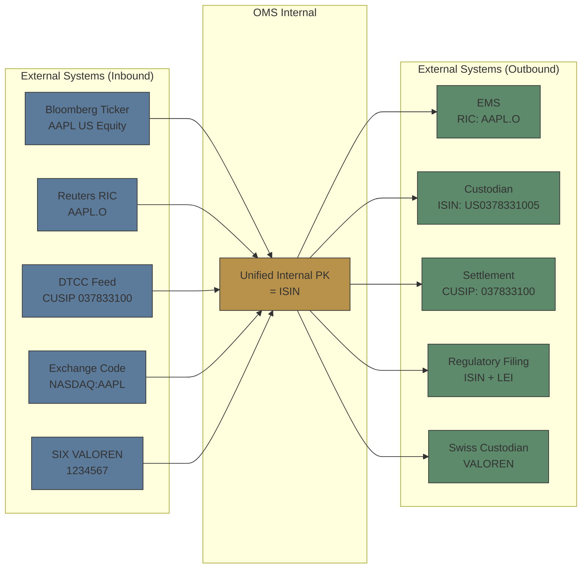

# Module 9: Multi-Vendor Identifier Management

language: en
description: Coverage of seven security identifiers (ISIN/CUSIP/SEDOL/Bloomberg Ticker/RIC/FIGI/VALOREN), security master management, identifier mapping patterns, booking and conversion workflows, and the real impact of mapping failures



## Learning Objectives (CILO Mapping)
- Distinguish seven security identifiers by purpose and usage context — CILO #2
- Understand security master maintenance challenges — CILO #3
- Diagnose identifier mapping failures that cause STP breaks — CILO #6

---

## Core Content

### 6. Derivative Identifiers: Options & Futures

Equity and bond identifiers are relatively straightforward, but derivatives need multiple dimensions for unique identification.

**Option Identification: OCC Symbol**

US equity options use the OCC (Options Clearing Corporation) symbol format:
```text
OCC Symbol = Ticker + Expiration Date + Call/Put + Strike Price

Example: AAPL   250817  C   00250000
          ├───┐  ├───┐  ├┐  ├──────┐
          │      │      │    │
          Ticker  Expiry  C/P  Strike (×1000)
          AAPL   2025/   Call $250.00
                 08/17
```

**Futures Identification: Product Code + Contract Month**

```text
ESZ5 — E-mini S&P 500, Dec 2025
├┐├┐
│ │ └ Last digit of year (2025 → 5)
│ └── Contract month code (Z = December)
└──── Product code (ES = E-mini S&P 500 Futures)

Month codes: F(Jan) G(Feb) H(Mar) J(Apr) K(May) M(Jun)
             N(Jul) Q(Aug) U(Sep) V(Oct) X(Nov) Z(Dec)
```

> **Think**: Why can't options and futures use just ISIN for identification?
>
> *Answer: ISIN can be assigned to a specific contract series (ESZ5 has an ISIN), but traders and systems routing need to know the contract's expiration, strike price, call/put type immediately. OCC Symbols and futures product codes encode these dimensions into a readable string — faster than looking up ISIN then querying attributes. Additionally, each expiration creates new contracts — ISIN allocation has a time lag.*

**Corporate Action Impact on Derivative Identifiers:**

| Corporate Action     | Option Impact                                                                   | Futures Impact                                                   |
| -------------------- | ------------------------------------------------------------------------------- | ---------------------------------------------------------------- |
| Stock Split (4:1)    | OCC Symbol unchanged; Multiplier 100 → 400; Strike adjusted ($500→$125)         | No direct impact (index futures: constituent weight changes)     |
| Reverse Split (1:10) | OCC Symbol unchanged; Multiplier 100 → 10; Strike adjusted ($10→$100)           | No direct impact                                                 |
| Cash Dividend        | OCC Symbol unchanged; Deep ITM options may be early-exercised                   | No direct impact (index futures adjusted via index calculation)  |
| Cash M&A             | OCC Symbol usually unchanged (underlying replaced, option becomes cash-settled) | No direct impact (if underlying changes, contract may terminate) |
| Company Rename       | Ticker changes; OCC Symbol ticker part updated                                  | Product code unchanged (product name updated)                    |

> **Predict**: AAPL announces a 4:1 split. You hold AAPL 250817C00250000 (AAPL $250 Call expiring 2025/8/17). What happens to this option after the split?
>
> *Answer: OCC Symbol stays unchanged (AAPL 250817 C 00250000), but the contract multiplier adjusts from 100 to 400, and the strike adjusts from $250 to $62.50. Your 1 contract now represents 400 underlying shares at a strike of $62.50. If the OMS does not update the multiplier and strike, all subsequent limit and risk calculations will be completely wrong.*

### 7. Multi-Vendor OMS Identifier Normalization

In a brokerage's multi-vendor OMS environment, identifier normalization is a daily challenge:



**Normalization Principles:**

1. **Internal golden key = ISIN** — the only cross-vendor, cross-system bridge
2. **Proprietary identifiers stored as aliases** — Bloomberg Ticker / RIC / VALOREN are lookup indexes, not relational keys
3. **Inbound orders**: incoming identifier → cross-reference table → internal golden ISIN
4. **Outbound orders**: from ISIN → lookup target downstream system's required identifier format
5. **Mapping failure fallback**: log error, queue to manual processing, notify ops team

> **Think**: An external broker sends a buy order via FIX. Symbol(55) = AAPL, SecurityID(48) = 037833100, SecurityIDSource(22) = 1 (meaning CUSIP). How should your system handle this?
>
> *Answer: Use SecurityIDSource=1 (CUSIP) to identify that 037833100 is a CUSIP, not an ISIN. Look up the cross-reference table to map CUSIP 037833100 → ISIN US0378331005. If mapping not found, fallback: check Symbol(55)=AAPL alias table. If still not found, reject the order and return a Reject message.*

> **Cloze**: "FIX tag 48 (SecurityID) must be used together with tag 22 ({SecurityIDSource}) to determine the identifier {type}. Common values: 1={CUSIP}, 2={SEDOL}, 4={ISIN}, 8={Bloomberg Ticker}."
>
> *Answer: SecurityIDSource, type, CUSIP, SEDOL, ISIN*

---

### Why This Matters

- **Identifier mapping determines STP success or failure**: 40% of straight-through processing failures originate from mapping issues. At brokerage scale, this means thousands of trades requiring manual intervention daily
- **Security master correctness directly impacts upstream and downstream systems**: Master record errors → OMS sends wrong orders → EMS rejects or executes wrong product → settlement fails → regulatory penalties
- **Multi-vendor integration is an institutional challenge**: Bloomberg, Refinitiv, DTCC, SIX each have their own identifier systems. Your system must handle inconsistency, latency, and conflicts
- **Corporate actions are the single largest source of identifier changes**: Thousands of corporate actions per year, each potentially breaking mapping tables
- **Regional identifiers like VALOREN cannot be ignored**: A broker trading Swiss securities must support VALOREN or face Swiss settlement failures

---

## Key Takeaways

- Seven major identifiers each serve distinct purposes: ISIN (cross-border settlement), CUSIP (US settlement), SEDOL (UK), Bloomberg Ticker (trader desktop), RIC (quotes), FIGI (cross-system bridge), VALOREN (Swiss market)
- Identifier mapping follows patterns: 1:1, N:1, 1:N, time-dependent, and lossy — OMS must handle all
- Security master should use ISIN as the golden key, proprietary identifiers as aliases
- The OMS conversion layer maps trading identifiers (pre-trade) to booking identifiers (post-trade) — missing mappings cause STP failures where trades execute but cannot settle
- VALOREN is essential for Swiss securities (SIX Swiss Exchange, SIX SIS settlement) — a 7-digit numeric code
- Cross-reference mapping failures are the #1 cause of STP breaks; near-real-time sync is critical
- Derivatives (options, futures) need multi-dimensional identification (OCC Symbol, futures contract codes), not just ISIN
- Corporate actions trigger identifier changes (split adjusts multiplier/strike, rename changes Ticker, M&A cancels options)
- FIX orders require SecurityID(48) paired with SecurityIDSource(22) for correct interpretation

---

## Common Misconceptions

**Misconception**: "All identifiers point to the same product, so any one is fine."

**Fact**: Completely different. Bloomberg Ticker can change on company rename. The same ISIN can map to multiple exchange codes (cross-listed). CUSIP only covers US/Canada markets. ISIN's check digit calculation differs from CUSIP's. VALOREN is required for Swiss settlement. A mapping error can route to the wrong market or prevent execution entirely.

**Misconception**: "FIGI will replace all other identifiers."

**Fact**: FIGI is an open standard designed as a mapping bridge, but industry adoption still lags far behind ISIN/CUSIP. It is better suited as a stable OMS internal cross-reference key rather than a replacement for existing standards. Regulators still require ISIN and LEI for reporting. VALOREN persists as the Swiss clearing standard.

**Misconception**: "Identifier mapping is a one-time setup — build it once and it's done."

**Fact**: Mapping tables require continuous maintenance. Corporate actions, exchange changes, new product listings, and vendor data feed changes all introduce mapping drift. A static cross-reference table degrades over time and causes increasing STP failure rates.

---

## Spot the Mistake

```text
OMS receives FIX order:
  Symbol(55) = MSFT
  SecurityID(48) = US5949181045
  SecurityIDSource(22) = 4 (ISIN)

OMS forwards the order to EMS using Symbol (MSFT) only. EMS returns Rejected.
```

**What went wrong?**

*Answer: OMS ignored SecurityID and SecurityIDSource. The FIX order already provided a high-quality ISIN (US5949181045). OMS should have used the ISIN for internal lookup and verified the Symbol-to-ISIN mapping consistency. Discarding the ISIN and sending only Symbol wastes the precise identifier received and may cause routing failure from Symbol mismatch. Correct approach: use ISIN to look up the Security Master, confirm the Symbol match, then translate to the identifier format required by EMS.*

---

## Feynman Explain

(Explain to a non-finance engineer: Why does one Apple stock need at least 6 different codes? Why can't we just use "AAPL" for everything? Use the postal address analogy — house number (Ticker), zip code (CUSIP), full address+postcode (ISIN), GPS coordinates (FIGI), and Swiss postal code (VALOREN).)


---

## Reframe

(Pause. Evaluate the "ISIN as golden key" design decision: Is ISIN truly immutable? What about spin-offs where the new company gets a new ISIN? Is ISIN sufficient for OTC derivatives? Is a VALOREN lookup essential for your Swiss book? Document your assessment.)

---

## Drill

Run: `learn.sh quiz brokerage-ops 9`
