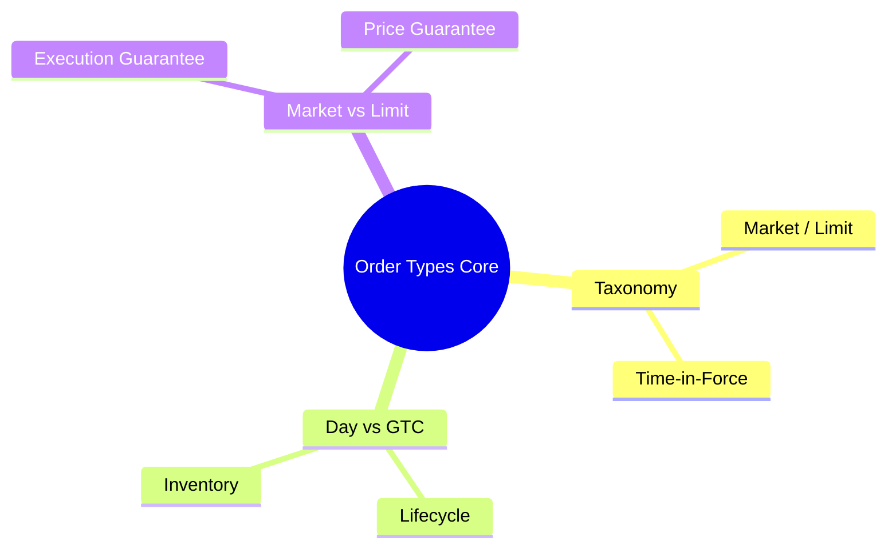
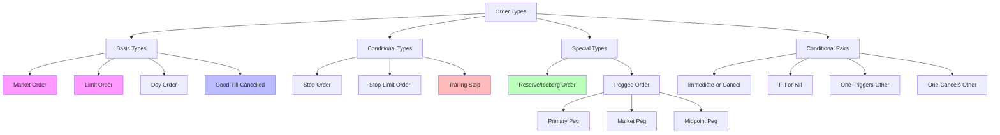

# Module 10: Order Types Core

language: en
description: Complete order type taxonomy — from basic market/limit orders to conditional and algorithmic orders, plus each order type's handling in OMS/EMS/FIX



## Learning Objectives (CILO Mapping)
- Distinguish each order type's behavior, lifecycle, and appropriate use cases — CILO #3
- Understand order type impact on OMS validation logic and FIX mapping — CILO #3
- Master practical application of stop, iceberg, and conditional orders — CILO #3
- Identify interactions between order types, product rules, and venue rules — CILO #3

---


## Real-World Scenario

A brokerage institutional client manager calls your team: Client XYZ Asset Management placed an Iceberg order to buy 50,000 shares of AAPL, limit $152, display quantity 5,000 shares. The trader sees the order as sent in OMS, but on the EMS side, the system throws an error: "Reserve order not supported on destination venue."

The client is unhappy: "IBKR supports this — why can't the broker?"

Your team investigates: OMS sent FIX tag 111=MaxFloor (=5000) with tag 110=MinQty (unset) to EMS, but EMS routed to a wholesaler that does not support Reserve/Iceberg orders. EMS performed no order type translation and simply rejected.

> **Think**: Which FIX tags carry the display quantity and total quantity for Iceberg orders? What should OMS check before sending the order?
>
> *Answer: FIX tag 111=MaxFloor indicates display qty, tag 38=OrderQty indicates total qty. Before routing, OMS should check whether the destination venue supports Reserve/Iceberg order types — if not, options include converting to a regular limit order or routing to a venue that does support it.*

---

## Core Content

### 1. Order Type Classification Taxonomy



> **Think**: Which order types above are "price guarantee" types and which are "execution guarantee" types?
>
> *Answer: Market Order is execution guarantee (guarantees fill, not price). Limit Order is price guarantee (guarantees price, not fill). Stop Order is trigger guarantee — once triggered, it becomes a market order.*

> **Cloze**: "{Market orders} guarantee execution but not price; {limit orders} guarantee price but not execution. This trade-off is the central tension in order type selection."
>
> *Answer: Market orders, limit orders*

### 2. Day Order vs GTC: Lifecycle & Inventory Management

| Attribute                | Day Order                             | GTC (Good-Till-Cancelled)                      |
| ------------------------ | ------------------------------------- | ---------------------------------------------- |
| FIX tag 59 (TimeInForce) | 0 (Day)                               | 1 (GTC)                                        |
| Validity                 | Current trading session only          | Until cancelled (max 90 days, venue-dependent) |
| Post-close handling      | Auto-cancelled (Expired)              | Carried to next trading day                    |
| Corporate action impact  | Usually unaffected (expires same day) | Qty/price may need adjustment or cancel        |
| OMS handling             | Daily close batch clean up Day orders | Reload to EMS before each day's open           |
| Risk                     | None (auto-expires)                   | Forgotten order risk, large price move risk    |

**GTC Order Cross-Day Lifecycle:**
```text
Trading Day T   T+1             T+2             ⋯
  │               │               │
  ▼               ▼               ▼
┌──────┐      ┌──────┐        ┌──────┐
│Day 1 │──▶   │Day 2 │──▶    │Day 3 │──▶ ⋯ until filled/cancelled
│Open  │      │Still │       │Still │
│      │      │Open  │       │Open  │
└──────┘      └──────┘       └──────┘
  │             │              │
  ▼             ▼              ▼
OMS:         OMS:           OMS:
• intraday   • auto-reload   • pre-market
  cancelable   to EMS pre-    corporate
• held at      open          action check
  close        • price        • adjustment?
  (not expired)  unchanged
```

> **Think**: A client places a GTC limit order to buy AAPL at $150. Two months later, AAPL drops to $100 on poor earnings — the GTC order remains active. The trader forgot about it. Suddenly the stock rallies back to $150 and the order fills. What is the problem?
>
> *Answer: This is classic "forgotten order risk." GTC orders remain active indefinitely. The trader may have forgotten the outstanding order. When the market unexpectedly touches the price, the fill may happen at an undesirable moment. Best practice: OMS should periodically notify traders of open GTC orders (e.g., monthly reports) or enforce a maximum GTC duration.*

### 3. Market Order vs Limit Order: Execution Guarantee vs Price Guarantee

**Market Order:**
- Guarantees execution, does not guarantee price
- FIX: OrdType=1, TimeInForce=1 (GTC) or 3 (IOC) or omitted
- Risk: Slippage — especially in low-liquidity or high-volatility products
- OMS validation: Check if the product allows market orders (some FI/ETF products restrict them)

**Limit Order:**
- Guarantees price, does not guarantee execution
- FIX: OrdType=2, Price tag=44
- Risk: Non-execution risk (especially when limit is below/above market price)
- OMS validation: Check Price is within reasonable range (non-zero, non-negative, compared to market price)

**Slippage Mechanics:**
```text
Market buy 10,000 shares AAPL, order book state:

Level 1: $150.00 x 1,000 shares → fill 1,000 @ $150.00
Level 2: $150.10 x 2,000 shares → fill 2,000 @ $150.10
Level 3: $150.20 x 3,000 shares → fill 3,000 @ $150.20
Level 4: $150.30 x 4,000 shares → fill 4,000 @ $150.30

VWAP = (1000×150 + 2000×150.10 + 3000×150.20 + 4000×150.30) / 10000
      = $150.20
Slippage = $150.20 - $150.00 = $0.20 (13 bps)
```

> **Cloze**: "The risk of a market order is {slippage}; the risk of a limit order is {non-execution}. In highly volatile markets, a market order may fill far from the expected price — this is called {negative slippage}."
>
> *Answer: slippage, non-execution, negative slippage*

> **Predict**: Trader A uses a market order to buy a low-liquidity product (daily volume only 1,000 shares), buying 500 shares. Trader B uses a limit order for the same product, priced at the current ask. Which order is more likely to trigger a price validation warning in OMS?
>
> *Answer: Trader A's market order. A market order on a low-liquidity product can produce significant slippage. OMS pre-trade checks should set a maximum slippage threshold (e.g., 5%) for market orders — warn the trader or force conversion to a limit order if exceeded.*

---

## Spot the Mistake

A developer wires the FIX mapping backwards: market orders are sent as OrdType=2, limit orders as OrdType=1.

**Why is this wrong?**

*Answer: Reversed. Market order is OrdType=1; limit order is OrdType=2 with Price tag 44. Sending a market order as OrdType=2 makes the venue treat it as a limit order at an unset price — wrong behavior or reject, and a broken execution guarantee.*

A trader claims: "Market orders always fill at the best price — the exchange matches at the NBBO, so slippage is negligible."

**Why is this wrong?**

*Answer: Wrong. A market order guarantees execution, not price. The module's own slippage example shows a 10,000-share buy filling across four levels at a $150.20 VWAP versus $150.00 NBBO — $0.20 (13 bps) slippage. In low-liquidity or volatile products the gap can be far worse.*
