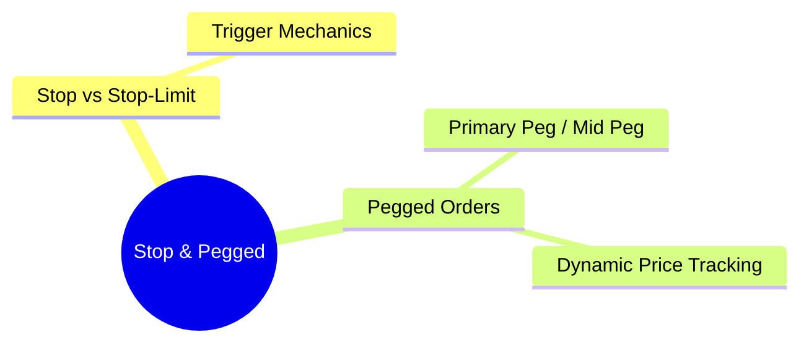

# Module 11: Stop & Pegged Orders

language: en
description: Complete order type taxonomy — from basic market/limit orders to conditional and algorithmic orders, plus each order type's handling in OMS/EMS/FIX



## Learning Objectives (CILO Mapping)
- Distinguish each order type's behavior, lifecycle, and appropriate use cases — CILO #3
- Understand order type impact on OMS validation logic and FIX mapping — CILO #3
- Master practical application of stop, iceberg, and conditional orders — CILO #3
- Identify interactions between order types, product rules, and venue rules — CILO #3

---


## Real-World Scenario

A brokerage institutional client manager calls your team: Client XYZ Asset Management placed an Iceberg order to buy 50,000 shares of AAPL, limit $152, display quantity 5,000 shares. The trader sees the order as sent in OMS, but on the EMS side, the system throws an error: "Reserve order not supported on destination venue."

The client is unhappy: "IBKR supports this — why can't the broker?"

Your team investigates: OMS sent FIX tag 111=MaxFloor (=5000) with tag 110=MinQty (unset) to EMS, but EMS routed to a wholesaler that does not support Reserve/Iceberg orders. EMS performed no order type translation and simply rejected.

> **Think**: Which FIX tags carry the display quantity and total quantity for Iceberg orders? What should OMS check before sending the order?
>
> *Answer: FIX tag 111=MaxFloor indicates display qty, tag 38=OrderQty indicates total qty. Before routing, OMS should check whether the destination venue supports Reserve/Iceberg order types — if not, options include converting to a regular limit order or routing to a venue that does support it.*

---

## Core Content

### 4. Stop Order vs Stop-Limit Order: Trigger Mechanics

**Stop Order (Stop Loss):**
- FIX: OrdType=3 (Stop), StopPx tag=99
- How it works: Sets a "trigger price" (stop price). When the market reaches or crosses the stop price, triggers a **market order**
- Used for stop-loss protection or breakout tracking

**Stop-Limit Order:**
- FIX: OrdType=4 (Stop Limit), StopPx tag=99, Price tag=44
- How it works: When the market reaches the stop price, triggers a **limit order** (not a market order)
- Used to ensure the fill price after trigger does not exceed the limit price

```text
Price Chart (Buy side — long, trigger to buy):
                ▲
                │     Stop Price ($152) ────── Trigger point
                │          │
                │          ▼
                │     ┌──────────┐
                │     │ Post-    │
                │     │ trigger  │
                │     │ Stop→Mkt │  ← Stop Order: no limit, may fill high
                │     │ Stop→Lmt │  ← Stop-Limit: caps max buy price
                │     └──────────┘
                │
                └──────────────────────────▶ Time

Sell side (short or close position, trigger to sell):
                ▲
                │     ┌──────────┐
                │     │ Post-    │
                │     │ trigger  │
                │     │ Stop→Mkt │
                │     │ Stop→Lmt │
                │     └──────────┘
                │          ▲
                │     Stop Price ($148) ────── Trigger point
                │
                └──────────────────────────▶ Time
```

**Stop / Stop-Limit Subtle Differences:**

| Scenario                          | Stop Order Behavior                                 | Stop-Limit Order Behavior             |
| --------------------------------- | --------------------------------------------------- | ------------------------------------- |
| Stop hit, market recovers quickly | Filled at market price on trigger                   | Limit order not filled, remains open  |
| Stop hit, market gaps down        | Fills with slippage (possibly far below stop price) | Limit order does not fill above limit |
| Stop hit, normal liquidity        | Fills near stop price                               | Fills at limit or better              |
| Limit set too tight post-trigger  | N/A                                                 | May never fill (limit too narrow)     |

> **Think**: Why do financial regulators have special disclosure requirements for Stop-Limit Orders? In what scenario is a Stop-Limit more dangerous than a regular Stop?
>
> *Answer: The limit on a Stop-Limit may be set too tight, causing the triggered limit order to never fill. The client thinks they have protection (because they set a stop), but the Stop-Limit may not execute at all — creating a false sense of security. This risk must be disclosed.*

### 5. Pegged Orders: Dynamic Price Tracking

Pegged Orders have no fixed price — their price dynamically tracks a reference price.

```text
           ┌─────────────────────────────────────┐
           │      Pegged Order Pricing           │
           ├─────────────────────────────────────┤
           │                                     │
           │  Primary Peg: NBBO Bid + offset     │
           │    ─── Buy order at Bid price       │
           │    ─── Sell order at Offer price    │
           │                                     │
           │  Market Peg: NBBO Offer - offset    │
           │    ─── Buy order at Offer price     │
           │    ─── Sell order at Bid price      │
           │                                     │
           │  Midpoint Peg: (Bid + Offer) / 2    │
           │    ─── Priced at mid-market         │
           │    ─── Most cost-effective          │
           │                                     │
           │  Offset: deviation from reference   │
           │    ─── Positive = more passive      │
            │    ─── Negative = more aggressive   │
            └─────────────────────────────────────┘
```

**Pegged Order Dynamic Behavior:**
```text
Time       NBBO Bid    NBBO Offer    Midpoint    Market Peg Buy (Offset=0)
09:30      $150.00     $150.05       $150.025    $150.05
09:31      $150.02     $150.06       $150.040    $150.06
09:32      $149.98     $150.03       $150.005    $150.03
09:33      $150.01     $150.04       $150.025    $150.04

→ Market Peg Buy price changes every minute — OMS needs continuous tracking!
```

**FIX Representation:**
- FIX tag 40=OrdType: "P" (Pegged)
- FIX tag 59=TimeInForce: 1 (GTC, Pegged orders typically cross days)
- FIX tag 54=Side: 1=Buy, 2=Sell
- Peg Offset: tag 1584 (PegOffsetValue) or vendor-specific tags

> **Cloze**: "Primary Peg buy orders are priced at the {NBBO Bid}, while Market Peg buy orders are priced at the {NBBO Offer}. Midpoint Peg is priced at {(Bid+Offer)/2} — this is the order type with the smallest market impact."
>
> *Answer: NBBO Bid, NBBO Offer, (Bid+Offer)/2*

> **Predict**: A market maker uses a Midpoint Peg order on a very low-liquidity stock. NBBO spread is 10 cents ($100.00 Bid, $100.10 Offer). The order sits at midpoint $100.05. Suddenly an aggressive seller hits the Bid down to $99.90, Offer becomes $100.05. Midpoint becomes $99.975. At what price would you expect the market maker's order to fill?
>
> *Answer: Midpoint becomes $99.975, but actual fill depends on a matching order at that level. Midpoint Peg orders can only match with other midpoint orders or through midpoint-enabled dark pools (e.g., SIGMA X2). In low-liquidity stocks, Midpoint Peg may remain unfilled for extended periods.*

---

## Spot the Mistake

A developer codes the FIX mapping as: stop order OrdType=4, stop-limit order OrdType=3.

**Why is this wrong?**

*Answer: Reversed. Stop is OrdType=3 (triggers a market order); stop-limit is OrdType=4 (triggers a limit order, adds Price tag 44). Swapping them sends the wrong protection profile to the venue — a stop that becomes a limit may never fill.*

A junior dev configures a Market Peg buy with offset 0, expecting it to sit passively at the bid.

**Why is this wrong?**

*Answer: Wrong. A Market Peg buy is priced at the NBBO Offer (aggressive), not the bid. The bid-side passive pricing belongs to the Primary Peg. Offset 0 does not make a Market Peg passive — it just removes any offset from the offer reference.*
