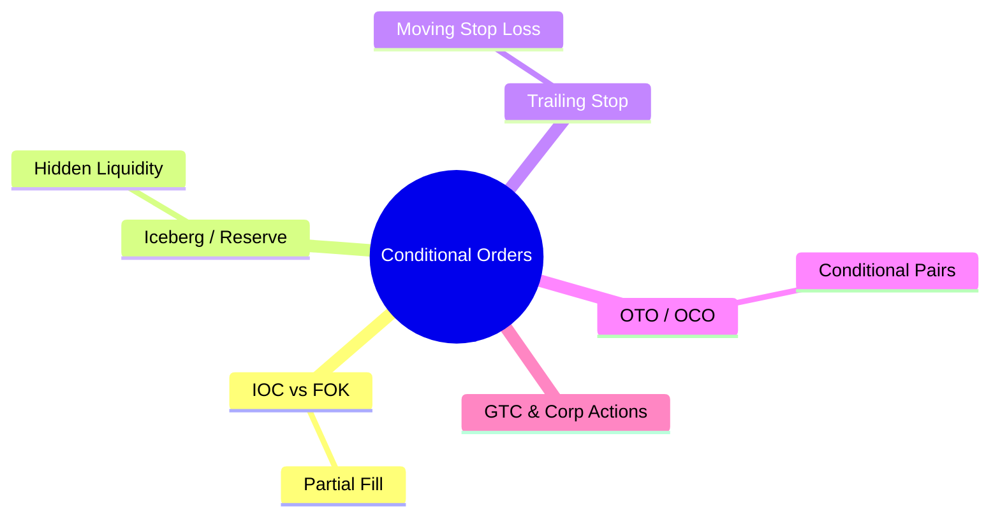

# Module 12: Conditional Orders

language: en
description: Complete order type taxonomy — from basic market/limit orders to conditional and algorithmic orders, plus each order type's handling in OMS/EMS/FIX



## Learning Objectives (CILO Mapping)
- Distinguish each order type's behavior, lifecycle, and appropriate use cases — CILO #3
- Understand order type impact on OMS validation logic and FIX mapping — CILO #3
- Master practical application of stop, iceberg, and conditional orders — CILO #3
- Identify interactions between order types, product rules, and venue rules — CILO #3

---

## Core Content

### 6. IOC vs FOK: Partial Fill Behavior

| Attribute          | IOC (Immediate-or-Cancel)                           | FOK (Fill-or-Kill)                                    |
| ------------------ | --------------------------------------------------- | ----------------------------------------------------- |
| FIX tag 59         | 3 (IOC)                                             | 4 (FOK)                                               |
| Definition         | Fill what's available immediately, cancel remainder | Either fill the entire quantity, or cancel everything |
| Partial fills      | ✅ Allowed                                           | ❌ Not allowed                                         |
| Remainder handling | Remaining portion cancelled                         | All cancelled (if not fully filled)                   |
| Typical use        | Large orders consuming liquidity in stages          | Precision quantity trades (e.g., pair trades)         |
| OMS handling       | Accept fills, mark remaining qty Cancelled          | One Reject or one full fill                           |

> **Cloze**: "IOC fills what is immediately available and cancels the {remainder}; FOK requires the {entire quantity} to fill or everything is {cancelled}. Iceberg orders send total quantity in FIX tag {38} and display quantity in tag {111}."
>
> *Answer: remainder, entire quantity, cancelled, 38, 111*

```text
IOC 10,000 shares AAPL @ $150 Limit:

Order book:
$150.00 x 3,000    → fill 3,000 ✅
$150.02 x 2,000    → fill 2,000 ✅
$150.05 x 1,000    → fill 1,000 ✅
                     Remaining 4,000 → Cancelled ❌

→ OMS receives 1 Execution Report (New) + 3 Partially Filled
  Final: 1 Cancelled (LeavesQty=4000)

FOK 10,000 shares AAPL @ $150 Limit:

Order book:
$150.00 x 3,000    → not enough!
$150.02 x 2,000    → still not enough!
                     Remaining 5,000 cannot be filled

→ OMS receives 1 Execution Report (Rejected)
  OrdStatus=8 (Rejected), Reason="Cannot fill full quantity"
```

> **Think**: Why do institutional traders generally prefer IOC over FOK?
>
> *Answer: IOC allows partial fills, letting traders build a position incrementally without waiting for all liquidity to appear at once. FOK cancels entirely if liquidity is insufficient — the trader gets nothing. For large orders, IOC can eat into available liquidity in chunks, while FOK is too rigid.*

### 7. Iceberg / Reserve Order: Hidden Liquidity

Iceberg order = display a small portion of the total quantity, hide the rest to avoid revealing true intent.

```text
On-screen order book:
┌───────────────────────┐
│  AAPL Order Book      │
│                       │
│  5,000 shs @ $152     │ ← Iceberg displayed portion
│  ───────────          │
│  3,000 shs @ $151.95  │ ← Other orders
│  2,000 shs @ $151.90  │
│                       │
│  But the iceberg:     │
│  Display: 5,000 shs   │
│  Total: 50,000 shs    │ ← Hidden portion (Reserve)
│  Each display refills │
│  when exhausted       │
└───────────────────────┘

Iceberg Order Lifecycle:
1. OMS sends OrderQty=50000, MaxFloor=5000
2. EMS/Exchange displays first tranche of 5000
3. All 5000 fill → auto-refill next tranche of 5000
4. Repeat until total 50000 filled or cancelled
```

**FIX tags:**
- tag 38=OrderQty: 50000 (total quantity)
- tag 111=MaxFloor: 5000 (display quantity)
- If tag 111 is unset = not an iceberg order

**OMS Iceberg Order Handling:**
- Must track Displayed Qty vs Reserved Qty (OMS internal: Reserved = OrderQty - cumulative displayed fills)
- When displayed portion is exhausted, EMS/Exchange auto-refills — OMS does not need manual intervention
- On Cancel/Replace, the new total cannot be less than the quantity already filled
- **Combination restrictions**: Iceberg orders are typically limit-only — cannot combine with market or stop orders

### 8. Trailing Stop: Moving Stop Loss

Trailing Stop's stop price "trails" the market price as it moves favorably, maintaining a fixed distance on the unfavorable side.

```text
Trailing Stop Sell (long position protection):

$150.00 ─── AAPL price ──▶
  │
  ├── Price rises to $155.00
  │     │ initial stop=$148.00 (trail=$2.00)
  │     ├── stop stays $148.00
  │     │   (price hasn't crossed stop)
  │     │
  │     ├── Price rises to $160.00
  │     │     stop rises to $158.00
  │     │     (trail distance = $2.00, follows price up)
  │     │
  │     ├── Price falls to $157.50
  │     │     stop stays $158.00 (never goes down)
  │     │     → Trigger! Sell at market
  │     │
  │     ▼
  │   Fill at $157.40 (slippage $0.10)

Key: stop price only moves up (long) or down (short) — never reverses.
```

**Trailing Amount vs Trailing Percent:**

| Type             | Definition       | Example                              |
| ---------------- | ---------------- | ------------------------------------ |
| Trailing Amount  | Fixed dollar gap | Buy at $100, trail $2 → stop at $102 |
| Trailing Percent | Percentage gap   | Buy at $100, trail 2% → stop at $102 |

**FIX Representation:** No standard FIX tag. Common approaches:
- tag 59=TimeInForce: 1 (GTC)
- tag 9941 or vendor-specific fields
- OMS calculates internally and converts to standard FIX stop orders

> **Predict**: A trader sets a Trailing Stop Sell, trail=$0.50, initial price $100. Price moves: $100 → $105 → $103 → $107 → $106.50. When does the Trailing Stop trigger? Approximate fill price?
>
> *Answer: Initial stop=$99.50. At $105, stop rises to $104.50. $103 (no trigger — stop does not decrease). At $107, stop rises to $106.50. Price falls to $106.50 → trigger. Sell at market, approximate fill $106.40 (depending on liquidity).*

### 9. OTO / OCO: Conditional Order Pairs

| Type | Full Name          | Behavior                                                                      |
| ---- | ------------------ | ----------------------------------------------------------------------------- |
| OTO  | One-Triggers-Other | When primary order fills, secondary order is automatically submitted          |
| OCO  | One-Cancels-Other  | Two orders placed simultaneously; when one fills, the other is auto-cancelled |

```text
OTO Scenario: Buy stock with automatic stop-loss

Step 1: Submit primary order (Buy 1000 AAPL @ $150 Limit)

Step 2: Primary order fills ✅
        → OMS auto-submits secondary (Sell 1000 AAPL @ $145 Stop)

Step 3: Stop-loss is now active, risk locked in

OCO Scenario: Breakout trade

Two orders placed simultaneously:
┌──────────────────────────────────────────┐
│  OCO: Buy 1000 AAPL                      │
│                                          │
│  Order A: Stop Buy @ $152                │ ← Breakout buy
│    + Condition: if A fills → cancel B    │
│                                          │
│  Order B: Stop Buy @ $148                │ ← Breakdown buy (reversal)
│    + Condition: if B fills → cancel A    │
└──────────────────────────────────────────┘

Case 1: Price breaks above $152 → A fills, B auto-cancelled
Case 2: Price breaks below $148 → B fills, A auto-cancelled
```

**OTO/OCO Management in OMS:**
- OMS must maintain a "parent-child" or "linked order" relationship
- When the primary/one side fills, OMS must immediately send a Cancel Request (FIX 35=F) to the other side
- Timing critical: if OTO secondary order is submitted after price has moved, it may fill at an unexpected price
- OMS must handle race conditions: OCO both sides filling simultaneously (possible in some matching engines)

### 10. GTC Orders & Corporate Action Interaction

Corporate actions affect different order types differently:

| Order Type    | Stock Split (4:1)            | Reverse Split (1:10) | Cash Dividend   | M&A            |
| ------------- | ---------------------------- | -------------------- | --------------- | -------------- |
| Day Order     | Unaffected (already expired) | Unaffected           | Unaffected      | Unaffected     |
| GTC Limit     | Qty×4, Price÷4               | Qty÷10, Price×10     | Price unchanged | Cancel all GTC |
| GTC Stop      | StopPx÷4                     | StopPx×10            | Unchanged       | Cancel         |
| GTC Pegged    | Peg offset unchanged         | Peg offset unchanged | Unchanged       | Cancel         |
| Iceberg GTC   | Total×4, Display×4           | Total÷10, Display÷10 | Unchanged       | Cancel         |
| Trailing Stop | Trail amount÷4               | Trail amount×10      | Unchanged       | Cancel         |

**Key Principle:** Adjustments must be completed **before the ex-date open**. Any post-open adjustment causes orders to fill at the wrong price.

---

## Spot the Mistake

An OMS implementation sends an Iceberg order modification (Cancel/Replace) with only the new OrderQty=60000, without sending MaxFloor=6000. The exchange treats the order as a regular limit order (not iceberg).

**Why is this wrong?**

*Answer: A Cancel/Replace Request (FIX 35=G) must **re-send all relevant parameters**, including tag 111=MaxFloor. If MaxFloor is missing from the replace, the exchange interprets it as a regular limit order with OrderQty=60000 displayed in full at the original limit price — completely defeating the client's intent to hide order size.*

An OMS implementation handles a 4:1 split for a GTC limit order: buy 1000 shares at $100. The developer writes:

```text
new_price = old_price × 4
new_qty = old_qty / 4
```

**Why is this wrong?**

*Answer: Wrong. A 4:1 split means 1 share becomes 4 shares. Qty should be ×4, price should be ÷4. The developer reversed the direction. Correct: new_qty = 4000, new_price = $25.*
