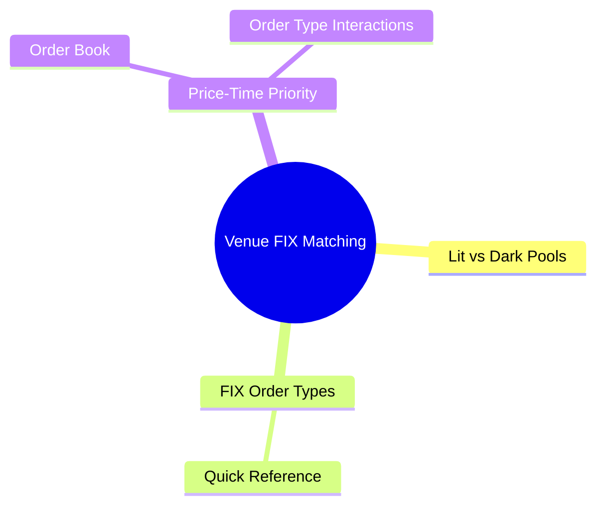

# Module 13: Venue, FIX & Matching

language: en
description: Complete order type taxonomy — from basic market/limit orders to conditional and algorithmic orders, plus each order type's handling in OMS/EMS/FIX



## Learning Objectives (CILO Mapping)
- Distinguish each order type's behavior, lifecycle, and appropriate use cases — CILO #3
- Understand order type impact on OMS validation logic and FIX mapping — CILO #3
- Master practical application of stop, iceberg, and conditional orders — CILO #3
- Identify interactions between order types, product rules, and venue rules — CILO #3

---

## Core Content

### 11. Venue Compatibility: Lit vs Dark Pools

Not all order types are supported on every venue:

| Order Type      | Lit Exchange (NYSE/NASDAQ) | Dark Pool (SIGMA X2/Crossfinder)              | Wholesaler (Citadel/Virtu)           |
| --------------- | -------------------------- | --------------------------------------------- | ------------------------------------ |
| Market          | ✅                          | ❌ (dark pools typically reject market orders) | ✅                                    |
| Limit           | ✅                          | ✅                                             | ✅                                    |
| GTC             | ✅ (many impose 90-day max) | ✅ (most support)                              | ❌ (wholesalers typically reject GTC) |
| Stop/Stop-Limit | ✅                          | ❌ (no stop orders in dark pools)              | ❌                                    |
| IOC             | ✅                          | ✅                                             | ✅                                    |
| Iceberg         | ✅                          | ❌ (dark pool is already hidden)               | ❌                                    |
| Pegged          | ✅ (select venues)          | ✅ (Midpoint Peg common)                       | ❌                                    |

**OMS Practice:** After the trader selects an order type, OMS must filter the venue list to show only venues supporting that order type. Without this validation, the scenario from this module's opening case study occurs.

> **Predict**: The trader picks a GTC limit order, and OMS routes it to a wholesaler (Citadel/Virtu). Predict the outcome.
>
> *Answer: The wholesaler rejects it — the venue table shows wholesalers typically reject GTC orders. The order comes back as Rejected. This is exactly why OMS must filter the venue list by order type before routing, not after the trader picks a destination.*

### 12. FIX Order Type Quick Reference

| Order Type       | tag 40 OrdType | tag 59 TimeInForce            | Other Key Tags              |
| ---------------- | -------------- | ----------------------------- | --------------------------- |
| Market           | 1 (Market)     | Omit or 1 (GTC)               | No Price (tag 44)           |
| Limit            | 2 (Limit)      | 0=Day / 1=GTC / 3=IOC / 4=FOK | tag 44=Price                |
| Stop             | 3 (Stop)       | 0 (Day) or 1 (GTC)            | tag 99=StopPx               |
| Stop Limit       | 4 (Stop Limit) | 0 (Day) or 1 (GTC)            | tag 99=StopPx, tag 44=Price |
| Pegged           | P (Pegged)     | 1 (GTC)                       | tag 1584=PegOffsetValue     |
| Market + Iceberg | 1 (Market)     | 1 (GTC)                       | tag 111=MaxFloor            |
| Limit + Iceberg  | 2 (Limit)      | 1 (GTC)                       | tag 111=MaxFloor            |

> **Cloze**: "In FIX, limit orders use OrdType={2}, stop orders use OrdType={3}. For TimeInForce, GTC is {1}, IOC is {3}, FOK is {4}."
>
> *Answer: 2, 3, 1, 3, 4*

### 13. Price-Time Priority & Order Type Interactions

The core matching principle of exchanges is **Price-Time Priority**:

```text
Order book (buy side):

Price priority ──▶  $150.05 (9:30:01) ── Best Bid
                   $150.05 (9:30:02) ── Same price, second in line
                   $150.04 (9:30:00) ── Lower price

Time priority ──▶  First come, first served (at same price)
                   $150.05 @ 9:30:01 matched before $150.05 @ 9:30:02
```

**Queue Behavior by Order Type:**

| Order Type | Can Enter Queue    | Queue Position Maintained      | Notes                                         |
| ---------- | ------------------ | ------------------------------ | --------------------------------------------- |
| Day Limit  | ✅                  | ✅                              | Standard queue                                |
| GTC Limit  | ✅                  | ✅                              | Position held across days                     |
| IOC        | ❌ (no queue entry) | N/A                            | Scans and cancels immediately                 |
| FOK        | ❌ (no queue entry) | N/A                            | Scans and cancels immediately                 |
| Iceberg    | ✅                  | New tranche goes to queue tail | Each auto-refill loses price-time advantage   |
| Pegged     | ✅                  | Re-queues on price change      | Each peg price change loses original position |

**Iceberg Queue Disadvantage:**
```text
Iceberg order: Total=10000, Display=1000, Price=$150.00

Round 1: Display 1000 @ $150.00 → Queue position #1
          After fill, auto-refill 1000

Round 2: New display 1000 @ $150.00 → Queue position #5
          (Others have queued at $150.00 — new tranche goes to tail)
```

> **Think**: Why does each new Iceberg tranche go to the queue tail? What strategic implications does this have for large traders?
>
> *Answer: Iceberg design hides true intent, but the cost is losing queue position on each refill. Other market participants observing consistent refills at the same price can "front-run" — placing their own orders ahead. Large traders who want to maintain queue position may need to display the full quantity (revealing intent) or split across multiple OMS accounts.*

> **Predict**: An iceberg order (total 10,000, display 1,000) puts its first tranche at queue position #1 at $150.00. The tranche fills and auto-refills. Where does the new 1,000-share tranche sit?
>
> *Answer: At the queue tail (e.g., position #5), not #1. Every refill loses price-time priority. Repeated refills at the same price also reveal the iceberg's signature to other participants, who can then front-run it.*

---

### Why This Matters

1. **Order types are the trader's core language**: Each order type encodes different trading strategy and risk preference. Without understanding order type behavior, you cannot debug trader issues.

2. **OMS core logic is order type routing and validation**: Over 60% of OMS production issues relate to order type / venue mismatch. Iceberg sent to unsupported venue → reject. GTC paired with Day-order-only algorithmic execution → error.

3. **FIX mapping is OMS infrastructure**: Your OMS code ultimately translates to FIX messages. Wrong OrdType or missing TimeInForce sends orders to the wrong destination or with wrong behavior.

4. **Corporate actions + GTC combinations are high regulatory risk**: If OMS does not correctly adjust GTC orders before the ex-date, large quantities may fill at wrong prices — causing significant financial loss and regulatory penalties.

5. **Order type knowledge directly drives system design decisions**: Do you support Iceberg? Does your OMS order table need a display_qty column? Does your pre-trade engine need different validation for trailing stops vs regular limits? These design decisions come from understanding order types.

---

## Key Takeaways

- Order types fall into four categories: basic (market/limit/day/GTC), conditional (stop/stop-limit/trailing), special (iceberg/pegged), and paired (IOC/FOK/OTO/OCO)
- Market orders guarantee execution but not price; limit orders guarantee price but not execution — a trade-off between slippage and non-execution risk
- GTC orders persist across days but require corporate action handling (qty and price adjustments on splits/reverse splits)
- Stop Orders trigger into market orders, Stop-Limit Orders trigger into limit orders — fundamentally different protection profiles
- Pegged Orders track reference prices (Bid/Offer/Midpoint) dynamically — OMS needs real-time market data support
- Iceberg orders use tag 38=OrderQty + tag 111=MaxFloor; each refill loses price-time queue position
- OTO and OCO require OMS to maintain linked-order relationships and handle race conditions
- Different venues support different order types — OMS must check order type / venue compatibility before routing
- FIX: OrdType (tag 40) and TimeInForce (tag 59) together determine order behavior

---

## Common Misconceptions

**Misconception**: "IOC and FOK are the same — both cancel immediately."
**Fact**: IOC allows partial fills with the remainder cancelled. FOK requires the full quantity to fill or everything is cancelled. Institutional traders prefer IOC because they at least capture available liquidity.

**Misconception**: "Stop Order and Stop-Limit Order behave similarly — the only difference is the limit price."
**Fact**: Fundamentally different. A Stop Order becomes a **market order** on trigger — guarantees execution but carries slippage risk. A Stop-Limit Order becomes a **limit order** on trigger — guarantees price but may not execute. In a fast-declining market, a Stop may fill far below the stop price while a Stop-Limit may not fill at all.

**Misconception**: "Iceberg orders completely hide the total quantity."
**Fact**: Iceberg only hides the total, but market participants can detect iceberg orders by observing the order book's "refill pattern" — consistent replenishment at the same price after each display tranche is consumed is the telltale iceberg signature.

---

## Spot the Mistake

```text
Trader places OCO order:
Buy A: Stop Buy 100 AAPL @ $152
Buy B: Stop Buy 100 AAPL @ $148

System design: OMS sends both orders to EMS simultaneously,
and upon receiving one Execution Report (Fill),
sends a Cancel Request to the other.

Problem: A and B are both at $150 current price.
Price drops to $148 → B triggers → OMS receives Fill → OMS sends Cancel A.
But price quickly recovers to $152 — A may also have triggered and filled!
```

**What is wrong with this design?**

*Answer: Race condition! Both A and B are Stop Buys with close trigger prices. When B fills, the market may trigger A before OMS's Cancel A request arrives. Correct approach: OCO should be handled at the EMS/Exchange level (using venues that natively support OCO), or OMS must guarantee the cancel message arrives before the other order triggers — extremely difficult in a low-latency environment. Alternative: use the same price level with different directions instead of two close stop prices.*

---

## Feynman Explain

(Explain "Iceberg Order" in the simplest terms to a non-finance person. Analogy: you want to buy 100 limited-edition sneakers on the secondary market, but you don't want sellers to know you need that many — they'd raise prices. What would you do? Iceberg orders are the "batch reveal" strategy of the sneaker market.)


---

## Reframe

(Pause. Evaluate the "order type" classification framework: Which three order types do you encounter most frequently in your daily work? Are there order types your OMS supports but rarely uses? Should it? Write your assessment.)

---

## Drill

Run: `learn.sh quiz brokerage-ops 13`
