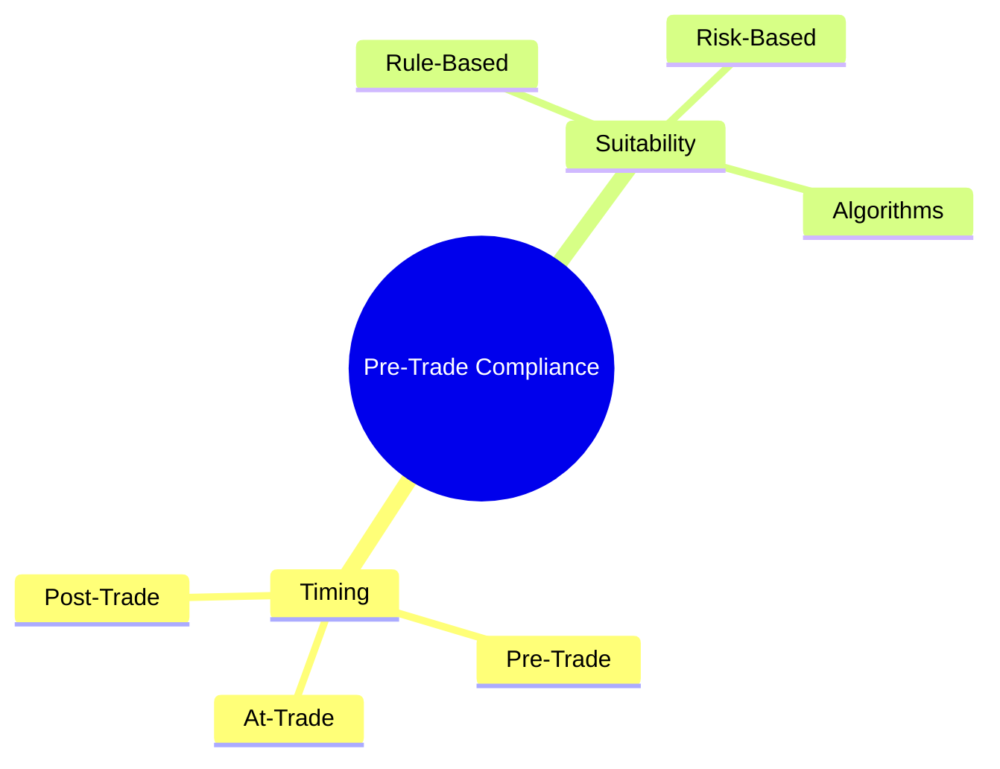
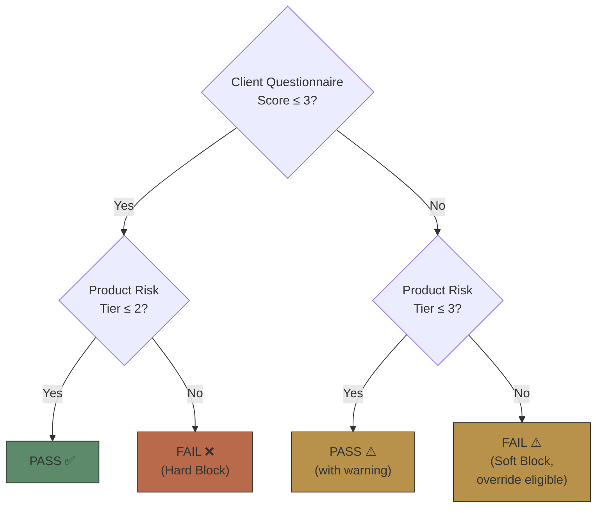
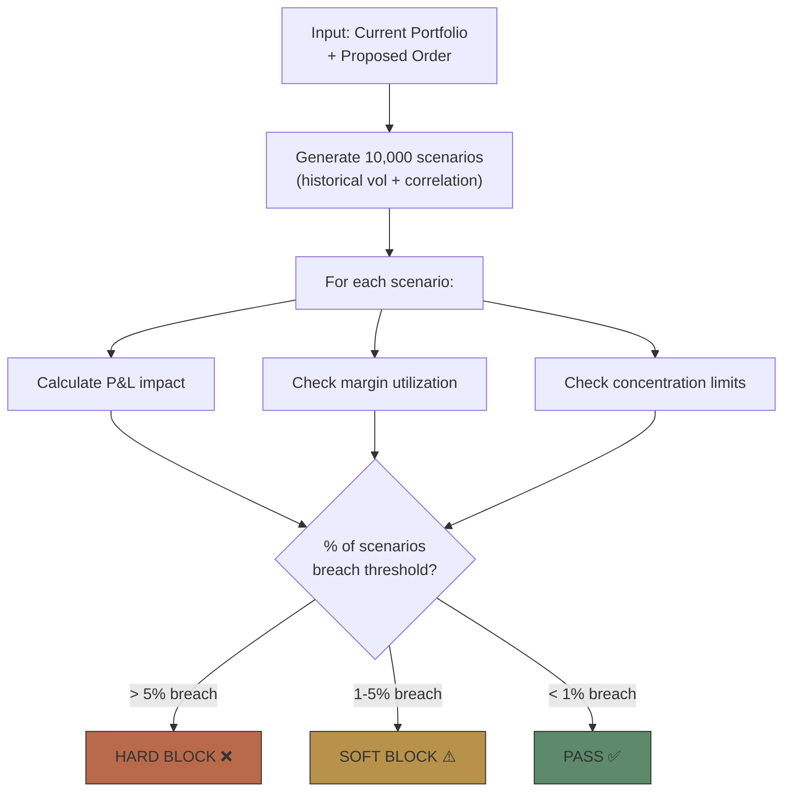

# Module 14: Pre-Trade Compliance




## Learning Objectives (CILO Mapping)
- Master pre-trade compliance framework: suitability, pre-clearance, credit check, limit management — CILO #1
- Understand compliance rule engine architecture: event-driven, rule priority, hard block vs soft block — CILO #3
- Distinguish pre-trade, at-trade, and post-trade compliance boundaries and responsibilities — CILO #6
- Understand order validation pipeline (Validate → Approve → Route) engineering implementation — CILO #6

---


## Real-World Scenario

Tuesday 9:35 AM, the brokerage OMS receives a limit order: Client A (cash account) buys 5,000 shares of TSLA, limit $250. System checks sequentially:

1. **Symbol check** → TSLA on approved trading list ✅
2. **Suitability** → Client risk rating "Growth", TSLA high-volatility stock, pass ✅ (rule-based scoring only)
3. **Credit check** → Cash account balance $80K, order notional $1.25M → **Insufficient balance** ❌

Order blocked at validate stage. Trader receives reject code: `CREDIT_INSUFFICIENT_CASH_ACCT`.

But the trader reports: "This client is an institutional account in the same group with a cross-guarantee agreement — we should aggregate buying power!"

Problem: OMS credit module does not query group-level aggregated buying power. The pre-trade system only checks single account balance.

> **Think**: If you were the developer responsible for the OMS pre-trade module, what system design flaws does this case expose?
>
> *Answer: (1) Credit check does not consider group-linked accounts (2) Suitability is rule-based only, no risk-based volatility dynamic threshold (3) Rejection message is sent to the trader but no escalation path (e.g., manual approval override)*

---

## Core Content

### 1. Pre-Trade vs At-Trade vs Post-Trade Compliance

Pre-trade compliance is the **most underestimated complexity** in the trade lifecycle. Time boundary definition:

```text
Timeline:
Pre-Trade ───────────── At-Trade ───────────── Post-Trade
(before order sent)     (during execution)       (after trade)

Pre-Trade Compliance:
  • Suitability check       • Market manipulation    • Trade reporting
  • Pre-clearance             detection (layering,    (TRACE, MSRB,
  • Credit check              spoofing)               FINRA OATS)
  • Position limits         • Best execution        • Settlement
  • Tax withholding           monitoring              monitoring
  • Commission disclosure   • Limit order           • Reconciliation
                              protection
```

> **Think**: Why can't suitability be done at-trade or post-trade?
>
> *Answer: Suitability determines "whether this product is suitable for this client." If discovered after execution, the trade has already happened and cannot be reversed (except through cancel/amend processes). Pre-trade is the only window to stop a transaction before funds or securities move.*

> **Cloze**: "The purpose of pre-trade compliance is to block non-compliant orders {before entering the execution system}. If a problem is discovered {after execution}, the remediation cost is far higher than pre-trade blockage."
>
> *Answer: before entering the execution system, after execution*

---

### 2. Suitability: Rule-Based vs Risk-Based

Suitability is the OMS pre-trade check. Two major regulatory frameworks:

**FINRA 2111 (US) vs MiFID II Appropriateness (EU)**

| Aspect | FINRA 2111 (US) | MiFID II Appropriateness (EU) |
| ------ | --------------- | ----------------------------- |
| Applies to | US brokers | EU investment firms |
| Suitability model | Three-tier: reasonable-basis, customer-specific, quantitative | Client classification (retail/professional/counterparty) + product classification (complex/non-complex) |
| Complex product handling | N/A | Additional appropriateness test required |
| Implementation style | Rule-based: risk questionnaire → A/B/C/D rating; product tier → 1/2/3/4; matching matrix | Risk-based: dynamic scoring model (volatility, leverage, liquidity, concentration weighted) → composite score → threshold |
| Pros | Simple, predictable, easy to audit | Flexible, catches edge cases |
| Cons | Rigid, ignores product dynamics | Complex model, needs continuous calibration |

**The Brokerage OMS typically implements a Hybrid**:
- Rule-based as **first gate** (rapid reject of clearly unsuitable cases)
- Risk-based as **second gate** (weighted scoring for borderline cases)
- Both fail → hard block. Rule pass + risk fail → soft block (manual override possible)

> **Predict**: A client passes the rule-based gate but the risk-based weighted score lands in the 40-60 band. What does the hybrid system do?
>
> *Answer: Soft block — rule pass + risk fail. The order is flagged for compliance review with manual override possible; it is not hard-rejected.*

> **Think**: Suppose a client's risk questionnaire result is "Conservative", but they have a 10-year history of trading high-volatility stocks. The rule-based system would reject; the risk-based might accept. Which is more reasonable? Why?
>
> *Answer: Risk-based is more flexible, but any override needs audit trail. Brokerage practice: Rule-based as baseline, risk-based allows experienced clients to bypass certain rules with compliance officer approval. Pure rule-based causes poor client experience (false positives); pure risk-based may be too permissive (false negatives).*

> **Cloze**: "FINRA 2111 requires three-tier suitability: {reasonable-basis}, {customer-specific}, {quantitative}. MiFID II requires classifying products as {complex} and {non-complex}; complex products need an {appropriateness test}."
>
> *Answer: reasonable-basis, customer-specific, quantitative, complex, appropriateness test*

---

### 2b. Suitability Algorithms — Expanded

Modern OMS suitability engines employ multiple algorithm types depending on regulatory regime, asset class, and client demographics.

#### Rule-Based Algorithms

**Decision Tree**
Orders flow through a binary classification tree. Each node represents a check: risk tolerance, investment horizon, product complexity. Terminal nodes yield Pass/Fail.



**Lookup Table**
A matrix of client risk category × product risk tier. The intersection cell defines the outcome.

| | Product Tier 1 | Product Tier 2 | Product Tier 3 | Product Tier 4 |
| ------- | -------------- | -------------- | -------------- | -------------- |
| Client A | PASS | PASS | SOFT BLOCK | HARD BLOCK |
| Client B | PASS | SOFT BLOCK | HARD BLOCK | HARD BLOCK |
| Client C | SOFT BLOCK | HARD BLOCK | HARD BLOCK | HARD BLOCK |
| Client D | HARD BLOCK | HARD BLOCK | HARD BLOCK | HARD BLOCK |

**Scoring Matrix**
Each client attribute contributes points. A total score maps to a product eligibility band. Attributes: income, net worth, trading experience, investment objective.

| Attribute                                  | Score Contribution |
| ------------------------------------------ | ------------------ |
| Annual Income > $200K                      | +2 points          |
| Net Worth > $1M                            | +2 points          |
| Trading Experience > 5yr                   | +1 point           |
| Aggressive Objective                       | +1 point           |
| Total ≥ 4 → Eligible for Tier 3-4 products |

#### Risk-Based Algorithms

**Weighted Scoring Model**
Dynamic factors with configurable weights:

```text
Suitability Score = w₁ × Volatility + w₂ × Leverage + w₃ × Liquidity + w₄ × Concentration

Example weights (MiFID II emphasis on complexity):
  Volatility (30-day realized):     w₁ = 0.35
  Leverage ratio:                   w₂ = 0.25
  Liquidity (bid-ask spread %):     w₃ = 0.25
  Position concentration:           w₄ = 0.15

Thresholds:
  Score < 40 → PASS
  Score 40-60 → SOFT BLOCK (compliance review)
  Score > 60 → HARD BLOCK
```

**Monte Carlo Simulation for Portfolio Risk**
For complex portfolios, the OMS simulates thousands of potential market scenarios to evaluate whether the proposed order, combined with existing positions, would breach risk thresholds.



**Machine Learning Classifiers**
Some brokerages deploy ML models (random forest, gradient boosting) to predict suitability violations before they occur. The model is trained on historical suitability decisions, post-trade complaints, and regulatory actions.

> **Think**: A brokerage operates in both US (FINRA) and EU (MiFID II) markets. Should they use the same suitability algorithm for both regimes?
>
> *Answer: No. FINRA 2111 focuses on three-tier reasonable-basis, customer-specific, and quantitative suitability. MiFID II requires appropriateness testing based on product complexity classification. A unified algorithm would either over-constrain (blocking trades unnecessarily) or under-constrain (regulatory risk). Best practice: configurable algorithm selection per jurisdiction, with a shared core and regime-specific plugins.*

#### Algorithm Selection Criteria

| Criterion              | Rule-Based Preferred     | Risk-Based Preferred               |
| ---------------------- | ------------------------ | ---------------------------------- |
| Regulatory regime      | FINRA (clear rules)      | MiFID II (principles-based)        |
| Asset class complexity | Listed equities, ETFs    | Derivatives, structured products   |
| Client demographics    | Retail, mass market      | HNW, institutional                 |
| Audit requirement      | High (simple to explain) | Moderate (model validation needed) |
| System latency budget  | < 10ms                   | 10-100ms acceptable                |

#### Algorithm Versioning & Audit Trail

Every suitability algorithm change must be versioned and auditable:

```text
Suitability Engine Configuration:
  Current Version: v2.4.1
  Activation Date: 2025-06-01
  Regime: MiFID II (EU)
  Algorithm: WeightedScoringModel
  Weights: {vol:0.35, lev:0.25, liq:0.25, conc:0.15}
  Thresholds: {pass:40, soft:60}

  Previous Version: v2.3.0
  Deactivation Date: 2025-05-31
  Change Reason: "Adjust liquidity weight from 0.20 to 0.25 per
                  ESMA guidance on complex product suitability"

Audit Record per Order:
  OrderID: ORD-20250710-001
  Algo Version: v2.4.1
  Inputs: {vol:0.65, lev:1.2, liq:0.03, conc:0.45}
  Score: 52.3
  Result: SOFT BLOCK
  Override: Yes (Compliance Officer ID: CO-042)
```

---

## Spot the Mistake

A developer implements both soft and hard blocks as an identical reject, saying: "a rule is a rule — a block is a block."

**Why is this wrong?**

*Answer: Wrong. Hard block is irreversible — no override. Soft block allows the order to proceed under manual approval or tagging (e.g., watch-list flagging, risk-based suitability override). Treating them the same destroys the escalation path and over-blocks borderline orders.*

An EU firm uses a pure rule-based suitability matrix for MiFID II clients "because it's simpler to audit."

**Why is this wrong?**

*Answer: Wrong. MiFID II requires risk-based appropriateness plus complex/non-complex product classification and an additional test for complex products. A rigid rule matrix under-constrains complex products and over-blocks routine ones — the EU regime is precisely the risk-based case in the algorithm selection table.*

---
