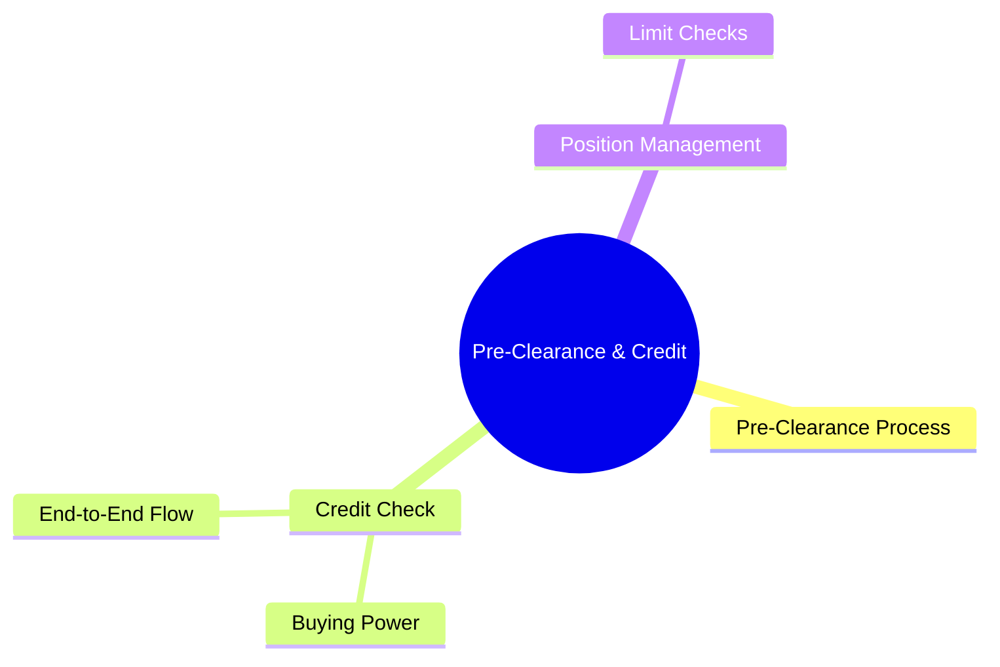
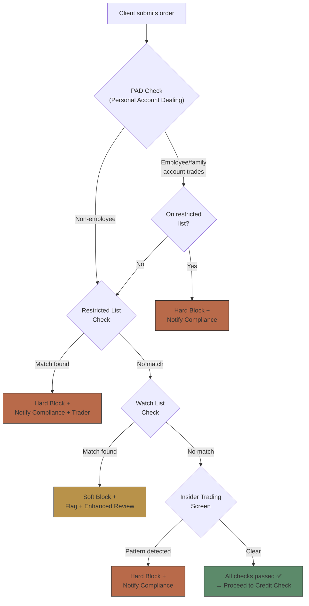
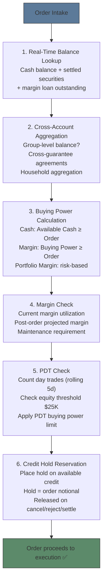
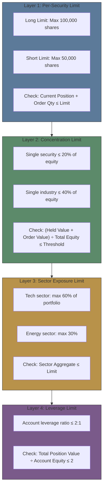

# Module 15: Pre-Clearance & Credit




## Learning Objectives (CILO Mapping)
- Master pre-trade compliance framework: suitability, pre-clearance, credit check, limit management — CILO #1
- Understand compliance rule engine architecture: event-driven, rule priority, hard block vs soft block — CILO #3
- Distinguish pre-trade, at-trade, and post-trade compliance boundaries and responsibilities — CILO #6
- Understand order validation pipeline (Validate → Approve → Route) engineering implementation — CILO #6

---

## Core Content

### 3. Pre-Clearance Process

Pre-clearance is an additional check layer for **employees or specific client groups**. Common pre-clearance checks in brokerage OMS:



**Key Differences**:

| List Type       | Block Behavior                          | Notify              | Automation                         |
| --------------- | --------------------------------------- | ------------------- | ---------------------------------- |
| Restricted List | Hard block (order cannot send)          | Compliance + Trader | Fully automated                    |
| Watch List      | Soft block (overrideable with approval) | Trader only         | Automated + manual approval        |
| PAD             | Hard block or Pre-approval required     | Compliance + HR     | Pre-trade approval workflow needed |

> **Predict**: A brokerage trader's spouse bought stock A in a personal account yesterday. Today the brokerage begins providing M&A advisory for the acquirer of stock A. Stock A is added to the Restricted List. The spouse's PAD order was already executed yesterday. What happens next?
>
> *Answer: The executed order will not auto-cancel (pre-trade checks only fire before execution). But the compliance system's post-trade monitoring will detect this trade occurred in the sensitive window around the restricted list update, triggering a compliance investigation. The trader may need to submit an affidavit proving the trade occurred before knowing about the M&A. This also exposes restricted list update timeliness — the OMS needs real-time sync of list changes.*

---

### 4. Credit Check & Buying Power Calculation

Credit check is the gate that determines "can the client afford this trade." Core concepts:

```text
Account type determines credit check logic:

Cash Account
  ┌──────────────────────────────┐
  │ Eq = Cash Balance +          │
  │      Settled Securities      │
  │ Max Order Value ≤ Eq         │
  │ Simple: balance > order OK   │
  └──────────────────────────────┘

Margin Account
  ┌──────────────────────────────┐
  │ Buying Power = Cash × 2      │
  │ (Reg T initial margin 50%)   │
  │ or Portfolio Margin (complex)│
  │ Max Order ≤ Buying Power     │
  │ + Overnight maintenance check│
  └──────────────────────────────┘

Day Trading Buying Power
  ┌──────────────────────────────┐
  │ DTBP = (Equity - Overnight   │
  │         Requirement) × 4     │
  │ Applies: Pattern Day Trader  │
  │ Same-day liquidity products  │
  └──────────────────────────────┘
```

**PDT Rule (Pattern Day Trader)**:

```text
Trigger Conditions:
  • Account equity < $25,000 (US equities)
  • ≥ 3 day trades in rolling 5 trading days

Impact:
  • Buying power restricted (settled cash only)
  • 90-day restriction or until $25K met

Common Traps:
  • PDT counts on rolling 5-day window, not calendar week
  • Margin accounts only count day trades
  • Buy and sell same stock on same day = 1 day trade
  • Open/close across days → not a day trade
```

> **Cloze**: "Reg T requires {50%} initial margin for margin accounts. This means a client with $50K cash can buy up to ${100K} of securities. Day Trading Buying Power (DTBP) is {4×} equity."
>
> *Answer: 50%, $100K, 4×*

> **Predict**: Client has $30K equity in a margin account, does 3 day trades (TSLA buy/sell, AAPL buy/sell, MSFT buy/sell — all same-day open/close). Equity drops to $28K. Will they be flagged as PDT the next day?
>
> *Answer: 3 day trades triggers the PDT threshold (≥ 3). Also equity < $25K is a PDT trigger condition. They will be flagged. But if equity stayed above $25K, 3 day trades alone would not automatically trigger PDT (both conditions must be met: equity < $25K AND ≥ 3 day trades in rolling 5 days).*

---

### 4b. Expanded Credit Flow — End-to-End

The credit check is not a single lookup but a multi-stage pipeline:



#### Hold-Release Pattern

The credit hold is a critical concurrency mechanism:

```text
Order Entry (time T+0):
  Available Credit: $1,000,000
  Order Notional: $300,000
  → Place Hold: $300,000
  → Remaining Available: $700,000

Scenario A: Order Executes (T+0.1s):
  Hold Released (converted to settlement obligation)
  Available Credit: $700,000 (adjusted for settlement)

Scenario B: Order Cancelled (T+0.5s):
  Hold Released
  Available Credit: $1,000,000 (fully restored)

Scenario C: Order Rejected by Compliance (T+0.05s):
  Hold Released
  Available Credit: $1,000,000 (fully restored)
```

#### Batch vs Real-Time Credit Checking

| Approach                           | Latency            | Consistency            | Freshness    | Use Case                    |
| ---------------------------------- | ------------------ | ---------------------- | ------------ | --------------------------- |
| Batch (nightly snapshot)           | 0ms (pre-computed) | Stale by up to 24h     | Low          | Overnight risk checks       |
| Near-real-time (cache, < 1min)     | ~50ms              | Minutes stale          | Medium       | High-volume retail          |
| Real-time (live balance query)     | 100-500ms          | Exact                  | High         | Institutional, large orders |
| Hybrid (cache + live on threshold) | Variable           | Exact for large orders | Configurable | Most brokerages             |

> **Think**: A brokerage processes 10,000 orders/sec. Every credit check does a real-time balance query taking 200ms. What problem arises? How to fix?
>
> *Answer: 10,000 orders/sec × 200ms = 2,000 concurrent queries — the balance system will be overwhelmed. Fix: (1) Use cached balance with TTL (e.g., 1 second) for small orders (2) Only live-query for orders above a threshold (e.g., > $100K) (3) Batch small-order credit checks and apply aggregate hold.*

#### Margin Account Credit Waterfall

```text
Order: Buy $500K of AAPL in Margin Account

Step 1: Cash available?
  Cash Balance: $50K
  → Use $50K cash first

Step 2: Cash exhausted. Use Margin Loan (Reg T 50%)?
  Remaining: $450K
  Reg T Loan Capacity: min($450K, Account Equity × 2 - Used)
  Equity: $300K → Reg T Buying Power = $600K
  Existing margin loan: $100K
  Available: $600K - $100K = $500K
  → Draw $450K from margin loan ✅

Step 3: Portfolio Margin (if enabled)?
  If PM approved: risk-based requirement may be lower
  PM requirement: $150K (vs $225K under Reg T)
  → Additional headroom: $75K

Step 4: Collateral check?
  Haircut applied to existing portfolio
  Liquid collateral: $400K (after haircut)
  Post-order collateral = $400K + $500K = $900K
  Loan = $450K → Collateral ratio = 50% ✅ (above house minimum 35%)
```

---

### 5. Position Management: Limit Check System

Position management checks ensure client positions do not violate risk limits:



> **Think**: Client A holds AAPL $1M, MSFT $600K, GOOGL $400K, total equity $2M. Concentration rule: single tech stock ≤ 25%. AAPL is 50%. Now the client orders another $200K AAPL. How should OMS handle it?
>
> *Answer: (1) New AAPL position = $1M + $200K = $1.2M (~54.5%) (2) Exceeds 25% threshold → Concentration Limit breach (3) Sector exposure (tech) also exceeds common threshold (60% → $1.8M/$2M = 90%) (4) Two violations, both hard block. Reject order. Trigger DUCO process if client requests override.*

> **Cloze**: "Concentration limit check must consider both the {held position} and {new order} combined. Formula: (Held Value + Order Value) ÷ Total Equity ≤ {Threshold}."
>
> *Answer: held position, new order, Threshold*

---

## Spot the Mistake

Someone says "Restricted List and Watch List are the same, just different names."

**Why is this wrong?**

*Answer: Completely wrong. Restricted List is absolute trading prohibition (hard block), typically due to underwriting, M&A advisory creating insider risk. Watch List is a potential risk marker (soft block) — trading can proceed but needs extra review or monitoring. Confusing the two is a serious regulatory error.*

"PDT limits reset at end of day, so if I do 3 day trades today, I can do 3 more tomorrow."

**Why is this wrong?**

*Answer: Wrong. PDT counts on a rolling 5-trading-day window. Today's 3 trades stay in the window for 5 days. Day 1's counts don't drop until day 6. Not a daily reset.*

---
