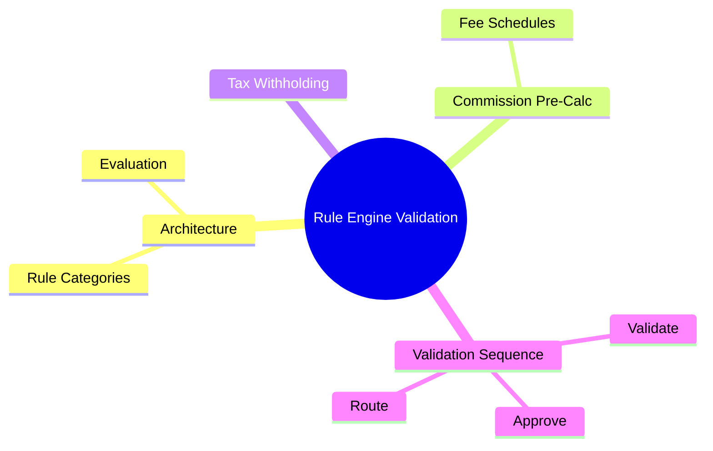
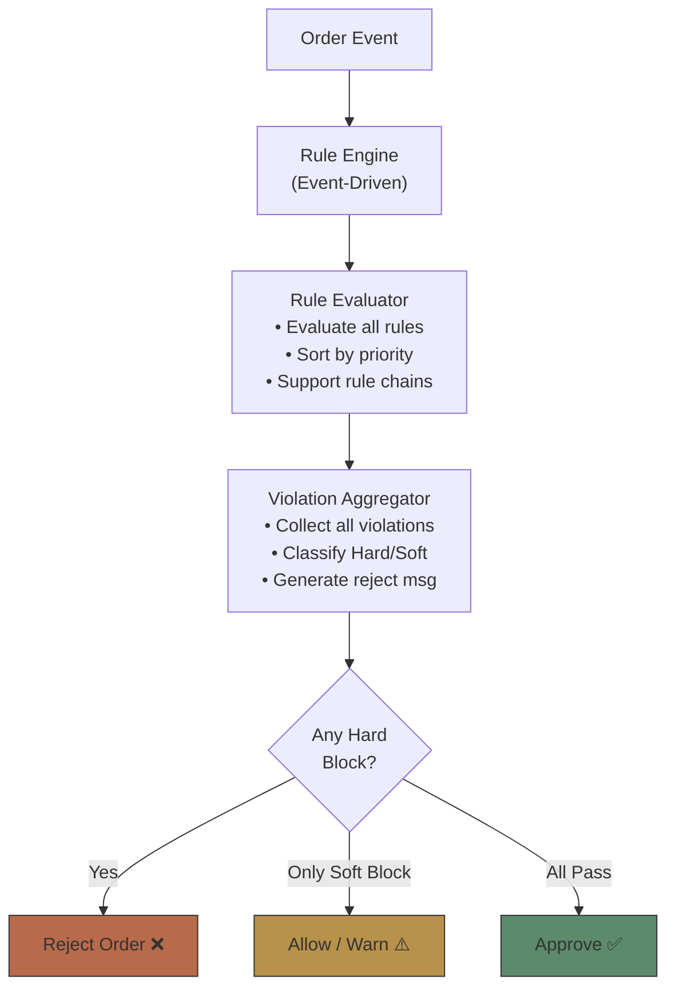
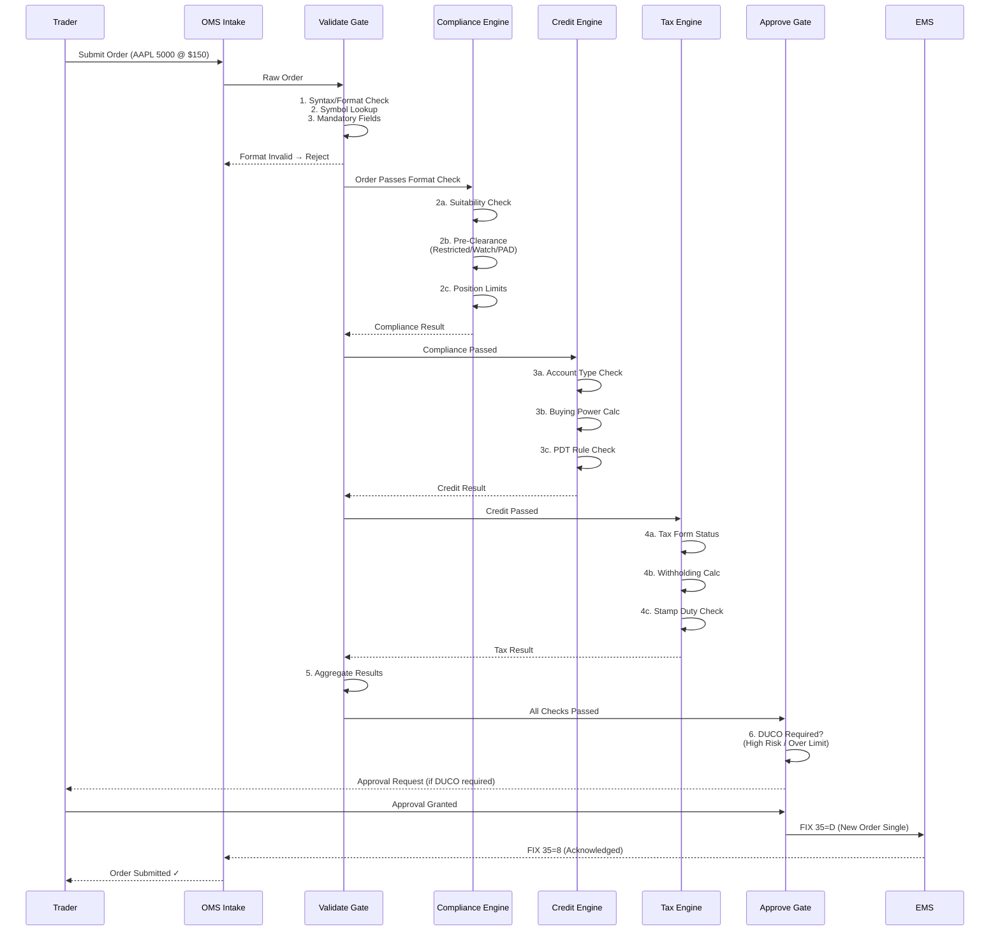

# Module 16: Rule Engine Validation




## Learning Objectives (CILO Mapping)
- Master pre-trade compliance framework: suitability, pre-clearance, credit check, limit management — CILO #1
- Understand compliance rule engine architecture: event-driven, rule priority, hard block vs soft block — CILO #3
- Distinguish pre-trade, at-trade, and post-trade compliance boundaries and responsibilities — CILO #6
- Understand order validation pipeline (Validate → Approve → Route) engineering implementation — CILO #6

---

## Core Content

### 6. Compliance Rule Engine Architecture

The brokerage OMS compliance rules engine uses **event-driven** architecture:



**Rule Priority & Hard/Soft Block Classification**:

```text
Rule Priority (Priority 1 = highest):

Priority 1 (Hard Block, no override):
  • Restricted list match
  • Insider trading detection
  • KYC/AML incomplete
  • Regulator-prohibited trading (e.g., SEC ban)

Priority 2 (Hard Block, escalation possible):
  • Concentration limit exceeded
  • Credit insufficient
  • Position limit exceeded
  • Suitability fail (rule-based)

Priority 3 (Soft Block, overrideable):
  • Suitability fail (risk-based)
  • Watch list match (needs flagging)
  • Concentration approaching threshold (warning)
  • Client risk rating minor mismatch

Priority 4 (Informational, no block):
  • Best execution note
  • Fee estimate discrepancy
  • Tax advisory note
```

> **Predict**: An order triggers a Priority 1 hard block (restricted list match) AND a Priority 3 soft warning (watch list flag). What is the final outcome?
>
> *Answer: Rejected. Any hard block wins — the aggregator rejects the order outright, while the soft warning is still collected into the audit trail.*

> **Think**: Why is the rule engine designed as event-driven rather than batch processing?
>
> *Answer: Pre-trade checks must complete before order dispatch (latency < 100ms). Batch processing cannot meet timeliness requirements. Event-driven fires rule evaluation independently for each order before OES dispatch. Event-driven also handles rule dependencies more easily (one rule's output is another rule's input).*

> **Cloze**: "In the compliance rule engine, a {hard block} means the order is absolutely rejected, not overrideable. A {soft block} means the order can proceed but needs {manual approval or tagging}. Rule priority ranges from {1 (highest)} to {4 (lowest)}."
>
> *Answer: hard block, soft block, manual approval or tagging, 1 (highest), 4 (lowest)*

---

### 7. Commission & Fee Pre-Calculation

Pre-trade fee calculation is not just for estimation — it is a compliance requirement (MiFID II requires pre-trade cost disclosure).

```text
Fee Types & Calculation:

Commission:
  ┌────────────────────────────────────────────┐
  │ Per-trade charging                         │
  │ Bundled: fixed rate includes commission    │
  │   + research fees                          │
  │   → e.g., 0.05% of notional                │
  │ Unbundled: commission vs research fees     │
  │   separated                                │
  │   → e.g., commission 0.02% + research      │
  │     fee $200/trade                         │
  │ Note: MiFID II requires unbundled          │
  └────────────────────────────────────────────┘

MiFID II Research Payment:
  ┌────────────────────────────────────────────┐
  │ Asset managers cannot bundle research      │
  │ costs with execution fees                  │
  │ Must:                                      │
  │ 1. Set up independent research budget      │
  │ 2. Report research fee usage quarterly     │
  │ 3. Pay research fees from client's         │
  │    research account                        │
  │ Impact on OMS:                             │
  │ • Flag research fee allocation in order    │
  │ • Query client research budget balance     │
  └────────────────────────────────────────────┘

Fee Estimate = Commission + Exchange Fee + Clearing Fee + Regulatory Fee

```

> **Think**: A brokerage's institutional client requires MiFID II unbundled pricing. What extra checks must the OMS perform at pre-trade?
>
> *Answer: (1) Query client's quarterly research budget balance (2) If insufficient → soft block or notify (3) Mark research payment allocation in FIX tags beyond 38(OrderQty) (4) Ensure execution fees and research fees are recorded separately for post-trade reporting.*

> **Predict**: Under MiFID II unbundled pricing, a client's research budget balance hits zero when their order allocates research fees. What happens at pre-trade?
>
> *Answer: OMS flags the research allocation and issues a soft block or notification — the order cannot proceed with research fees it cannot pay. The pre-trade check must query the research budget balance before approval.*

---

### 8. Tax Withholding Check

Tax withholding is a critical pre-trade check for cross-border trading. The brokerage acts as a Qualified Intermediary (QI) and must perform FATCA withholding.

```text
Client Tax Classification (determines withholding rate):

US Person → W-9 Form on file
  • Generally no withholding
  • But backup withholding if TIN missing

Non-US Person → W-8 Series on file
  • W-8BEN: Individual (claiming treaty benefits)
  • W-8BEN-E: Entity
  • W-8ECI: Effectively connected to US trade/business
  • W-8EXP: Foreign government/organization

FATCA Status:
  • Participating FFI → No withholding
  • Non-participating FFI → 30% withholding
  • Recalcitrant account holder → 30%

CGT (Capital Gains Tax) varies by jurisdiction:
  • US equities: No CGT (non-resident)
  • HK equities: No CGT
  • TW equities: 15% CGT (non-resident)
  • UK: 20% CGT (resident)
  • Australia: CGT applies to non-residents

Stamp Duty varies by jurisdiction:
  • UK: 0.5% on purchase (SDRT)
  • HK: 0.13% (both sides)
  • SG: 0.2% (both sides)
  • US: No federal stamp duty
```

> **Cloze**: "The QI (Qualified Intermediary) agreement requires the broker to appropriately {withhold} on {US-sourced income} for non-US clients. The most common forms are {W-8BEN} (individual) and {W-8BEN-E} (entity). If the client has no valid form on file, the OMS must assume {30% withholding} rate."
>
> *Answer: US-sourced income, withhold, W-8BEN, W-8BEN-E, 30% withholding*

---

### 9. Order Validation Sequence: Validate → Approve → Route (Pre-Trade Gate)

The OMS pre-trade gate ensures all checks pass before dispatching the order to EMS. Sequence:



> **Think**: Compliance engine suitability check takes 500ms, credit engine takes 300ms, tax engine takes 200ms. Total 1 second. Traders complain it is too slow. How would you optimize?
>
> *Answer: (1) Run all three engines in parallel instead of serial — total time = max(500, 300, 200) = 500ms (2) Enable fast path for simple orders (small value, non-complex products, cash accounts) skipping some checks (3) Cache frequent check results (same client, same product, quick repeat orders).*

> **Cloze**: "The complete order validation sequence is: {Validate} → {Approve} → {Route}. If any check fails, the order is {not} sent to the EMS. DUCO (Dual Control) executes at the {Approve} stage."
>
> *Answer: Validate, Approve, Route, not, Approve*

---

## Spot the Mistake

A developer optimizes the engine to stop rule evaluation at the first hard block: "the order is rejected anyway — why waste cycles on the rest?"

**Why is this wrong?**

*Answer: Wrong. The event-driven evaluator runs all rules and the violation aggregator collects every violation — hard and soft — for classification and audit. Stopping at the first hit hides additional Priority 1/2 violations from the audit record and breaks the hard/soft aggregation logic.*

A developer says: "Our client is a non-participating FFI — a foreign financial institution, so FATCA withholding does not apply."

**Why is this wrong?**

*Answer: Wrong. FATCA status exactly determines withholding: a non-participating FFI faces 30% withholding. The OMS must apply 30% unless the client holds the correct W-8 series or participating-FFI status on file.*

---
