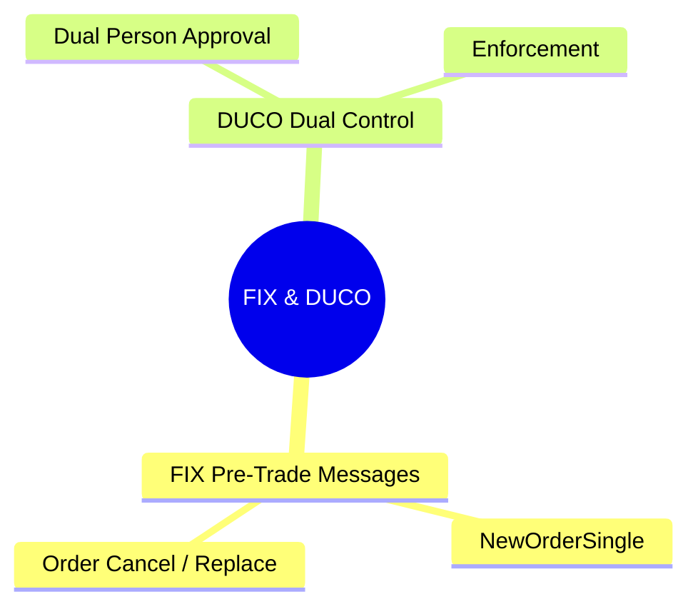
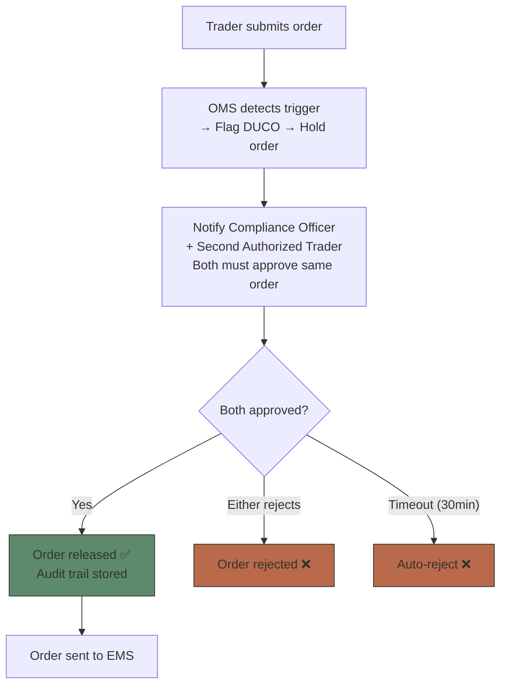

# Module 17: FIX & DUCO




## Learning Objectives (CILO Mapping)
- Master pre-trade compliance framework: suitability, pre-clearance, credit check, limit management — CILO #1
- Understand compliance rule engine architecture: event-driven, rule priority, hard block vs soft block — CILO #3
- Distinguish pre-trade, at-trade, and post-trade compliance boundaries and responsibilities — CILO #6
- Understand order validation pipeline (Validate → Approve → Route) engineering implementation — CILO #6

---

## Core Content

### 10. FIX Pre-Trade Messages

The pre-trade phase uses not only 35=D (New Order Single) but also dedicated FIX messages for quoting and RFQ:

```text
FIX Pre-Trade Message Types:

35=W (Request for Quote)
  ┌────────────────────────────────────────┐
  │ Usage: RFQ, especially fixed income    │
  │       or illiquid products             │
  │ Flow: Client sends RFQ → Market maker  │
  │       responds → Client picks price →  │
  │       sends 35=D to execute            │
  │ Key Tags:                              │
  │ • 35=W (MsgType)                       │
  │ • 131=QuoteReqID (unique request ID)   │
  │ • 146=NoRelatedSym (# of products)     │
  │ • 55=Symbol (product code)             │
  │ • 54=Side (buy/sell)                   │
  └────────────────────────────────────────┘

35=R (Quote Request — alternative RFQ form)
  ┌────────────────────────────────────────┐
  │ Similar to 35=W but for equities/      │
  │ futures                                │
  │ Often used to request quotes from      │
  │ multiple market makers                 │
  │ Response: 35=S (Quote) or 35=A (Quote  │
  │       Acknowledgement)                 │
  └────────────────────────────────────────┘

35=j (Quote — market maker response)
  ┌────────────────────────────────────────┐
  │ Market maker's response to RFQ         │
  │ Key Tags:                              │
  │ • 35=j (MsgType)                       │
  │ • 117=QuoteID                          │
  │ • 132=BidPx / 133=OfferPx              │
  │ • 134=BidSize / 135=OfferSize          │
  │ • 62=ValidUntilTime (quote expiry)     │
  └────────────────────────────────────────┘
```

> **Cloze**: In the pre-trade phase the OMS sends a {Request for Quote} (35=W) to market makers; a maker responds with quote message 35={j}; if the price is acceptable the client sends 35={D} (New Order Single) to execute. High-risk orders then pass through {DUCO} dual control — two people must approve before release.
>
> **Predict**: OMS sends 35=W (RFQ) to three market makers. Maker A responds 35=j (quote $99.50-$99.80), Maker B responds $99.45-$99.75, Maker C does not respond. What should the OMS do?
>
> *Answer: (1) Collect all quotes (2) Select best price (lowest offer for buy = $99.75 from B) (3) Check if ValidUntilTime has expired (4) Send 35=D to winning maker (B at $99.75) (5) Notify other makers their quote was processed. If best quote expired, re-RFQ.*

> **Think**: The best RFQ quote carries a very short ValidUntilTime. Why must the OMS check it before sending 35=D to execute?
>
> *Answer: The quote can expire between collection and execution. Sending 35=D against an expired quote risks filling at a price the market maker no longer honors — or a rejected execution. If expired, the OMS must re-RFQ rather than assume the price still stands.*

---

### 11. DUCO (Dual Control) — Dual Person Approval

DUCO is the manual review workflow for high-risk or over-limit orders.



---

## Spot the Mistake

"In DUCO, as long as one manager approves it is fine, because the manager has final authority."

**Why is this wrong?**

*Answer: Wrong. DUCO stands for Dual Control — two-person control. Both must independently approve. Single-person approval violates the dual control principle and cannot prevent rogue trading or collusion risk. DUCO is a regulatory hard requirement for brokerages.*

---
