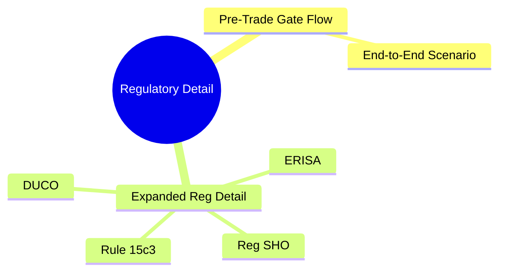

# Module 18: Regulatory Detail




## Learning Objectives (CILO Mapping)
- Master pre-trade compliance framework: suitability, pre-clearance, credit check, limit management — CILO #1
- Understand compliance rule engine architecture: event-driven, rule priority, hard block vs soft block — CILO #3
- Distinguish pre-trade, at-trade, and post-trade compliance boundaries and responsibilities — CILO #6
- Understand order validation pipeline (Validate → Approve → Route) engineering implementation — CILO #6

---

## Core Content

### 12. Brokerage Real-World Scenario: Full Pre-Trade Gate Flow

Your OMS receives an institutional client order:

**Order Details**:
- Client: Acme Fund (Cayman Islands registered, non-US entity)
- Account Type: Cash account (but group has a margin account)
- Product: 100,000 shares of TSLA (NASDAQ, high-liquidity stock)
- Limit: $300
- Notional: $30M
- Client Cash Balance: $25M

**Pre-Trade Gate Layer-by-Layer Check**:

```text
Step 1: Syntax & Symbol Check
  • TSLA → NASDAQ listed, active trading ✅
  • Side=1 (Buy), OrdType=2 (Limit) ✅
  • Qty=100000, lot size multiple ✅

Step 2: Suitability (Rule-Based)
  • Client Risk Questionnaire: Aggressive Growth
  • TSLA Risk Tier: 4 (high volatility)
  • Matching: Aggressive Growth ≤ 4 ✅
  → Rule-based PASS

Step 3: Suitability (Risk-Based)
  • Client historical vol tolerance: High (10yr track record)
  • TSLA 30-day realized vol: 65%
  • Sector exposure: Tech already at 55% (threshold 60%)
  • Post-order Tech exposure: ($25M + $30M)/$55M = 100%
  → Sector exposure violated ⚠️ Soft Block

Step 4: Pre-Clearance
  • Restricted List: TSLA not listed ✅
  • Watch List: TSLA not listed ✅
  • PAD: Institutional account, non-employee ✅

Step 5: Credit Check
  • Cash account balance: $25M
  • Order value: $30M
  • $25M < $30M → ❌ Insufficient
  • Group margin account has $20M balance
  → Group aggregated buying power: $25M + $20M = $45M ✅
  → Pass (requires group account checking enabled)

Step 6: Position Limits
  • No existing TSLA position → OK
  • Concentration: TSLA/$55M = 54.5% > 20% threshold ❌
  → Hard Block (DUCO overrideable)

Step 7: Tax Withholding
  • Non-US entity → W-8BEN-E on file ✅
  • Cayman Islands → No tax treaty
  • Dividend withholding 30% (but this is a trade, no dividend event) → N/A
  • Stamp duty: US equities no stamp duty ✅

Step 8: Commission & Fee Estimate
  • Institutional unbundled rate: $0.003/share
  • Commission est. = 100,000 × $0.003 = $300
  • Exchange + clearing = ~$50
  • Total est. = $350 ✅

Result:
  • Hard Blocks: 0
  • Soft Blocks: 2 (Sector Exposure ⚠️, Concentration ⚠️)
  • DUCO Required: Yes (concentration override)
  → Initiate DUCO → Compliance + Second Trader Approve → Order Sent

```

> **Predict**: If the tax withholding check finds an expired W-8BEN-E, but the client is a long-term partner. What should the OMS do?
>
> *Answer: OMS should hard block the order. Expired W-8 form means the broker cannot confirm the client's tax status. If the trade proceeds and the stock pays dividends, the broker may need to withhold at the maximum rate (30%), but if the client has a treaty benefit, incorrect over-withholding could lead to claims. Safest approach: reject the trade + notify client to update W-8 form.*

---

### 13. Expanded Regulatory Detail

#### FINRA 3110 (Supervision) — Pre-Trade Oversight

FINRA Rule 3110 requires member firms to establish and maintain a supervisory system reasonably designed to achieve compliance with securities laws. Key pre-trade implications:

```text
3110 Requirements Mapped to OMS Design:

3110(a) Supervisory System:
  • Written supervisory procedures (WSPs) must cover pre-trade review
  • OMS must support configurable business rules per WSP requirements
  • Annual WSP review should trigger OMS rule updates

3110(b) Supervisory Controls:
  • Pre-trade controls must be tested at least annually
  • Exception reports must flag violations within 24 hours
  • Manual override activity must be reviewed by a principal

3110(c) Office of Supervisory Jurisdiction (OSJ):
  • Each OSJ must have a designated principal for pre-trade oversight
  • OMS must route DUCO approvals to the correct OSJ principal

3110(d) On-Site Inspections:
  • Pre-trade gate logic is part of the annual inspection scope
  • Audit trail must show every rule modification and override

Impact on Pre-Trade Gate Design:
  • Rule changes must have effective dating (not immediate, to allow review)
  • Override reporting must include: who, what, when, why
  • Annual testing triggers must be tracked in the OMS itself
```

> **Cloze**: "FINRA 3110 requires that pre-trade controls be {tested at least annually} and that manual override activity be reviewed by {a principal}. The OMS must support {configurable business rules} per the firm's written supervisory procedures."
>
> *Answer: tested at least annually, a principal, configurable business rules*

#### SEC 15c3-1 (Net Capital) — Impact on Pre-Trade Credit

SEC Rule 15c3-1 (Net Capital Rule) directly affects how the brokerage computes available credit for pre-trade checks:

```text
15c3-1 Key Concepts for Pre-Trade:

Net Capital = Net Worth + Qualifying Subordinated Loans - Deductions

Haircuts on Securities:
  • Equities: 15% deduction (long), additional % for concentrated positions
  • Corporate bonds: 2-9% depending on rating/maturity
  • Options: risk-based haircut using theoretical pricing model

How It Affects Pre-Trade Credit:
  • Firm-wide net capital constraint limits aggregate client buying power
  • If firm net capital is low, OMS must reduce available credit firm-wide
  • Large client positions increase firm's capital requirement via haircuts

Real Example:
  Brokerage net capital: $500M
  Aggregate client margin loans: $3B
  Haircuts on collateral: $450M
  Net capital after haircuts: $50M
  → Additional margin lending capacity capped by net capital ratio
  → OMS must enforce firm-level credit ceiling on top of per-client limits
```

#### MiFID II RTS 6 — Suitability Requirements

Regulatory Technical Standard 6 under MiFID II specifies detailed suitability obligations that translate directly to OMS pre-trade logic:

```text
RTS 6 Article 2 — Information Gathering: client knowledge/experience, financial situation, objectives
  OMS: questionnaire versioning, recency check (≤2 yrs retail), material change detection → re-assess

RTS 6 Article 9 — Appropriateness (Non-Advised): complex product → appropriateness test before execution; fail → warning + opt-out
  OMS: product complexity flag; warning disclosure + opt-out capture; record in FIX/consent workflow

RTS 6 Article 13 — Record Keeping: keep suitability records 5 years, reproducible
  OMS: suitability snapshot per order (questionnaire version, product class, scoring inputs, result, algorithm version)
```

> **Think**: Under MiFID II RTS 6, a retail client's risk questionnaire is 3 years old. The client wants to buy a complex structured product. How should the OMS handle this?
>
> *Answer: The questionnaire is too old (RTS 6 effective guidance suggests ≤ 2 years for retail clients). The OMS should: (1) Block the order with a reason code QUESTIONNAIRE_STALE (2) Notify the client-facing system to trigger a re-questionnaire (3) After new questionnaire is completed, re-run suitability/appropriateness. This is a hard block — the old questionnaire cannot be used as the basis for a suitability determination.*

#### Regulatory-Driven Pre-Trade Gate Design Decisions

| Regulatory Requirement                  | Pre-Trade Gate Impact                        | Design Decision                                                          |
| --------------------------------------- | -------------------------------------------- | ------------------------------------------------------------------------ |
| FINRA 3110 — Annual testing             | Rule engine must support scheduled test mode | Add "simulation mode" that runs rules without blocking                   |
| SEC 15c3-1 — Net capital                | Firm-level credit ceiling                    | Add firm-wide credit monitor upstream of per-client checks               |
| MiFID II RTS 6 — Questionnaire recency  | Block stale questionnaires                   | Add client metadata recency check as Priority 2 hard block               |
| FINRA 2111 — Quantitative suitability   | Position limits + turnover analysis          | Add per-period turnover limit (e.g., max 10× portfolio turnover/quarter) |
| MiFID II — Best execution reporting     | Pre-trade venue selection analysis           | Add venue analysis report for each order                                 |
| SEC Rule 606 — Order routing disclosure | Record routing decisions                     | Add routing decision metadata to audit store                             |

---

## Key Takeaways

- Pre-trade compliance spans three time domains: pre-trade (check), at-trade (monitor), post-trade (report). Suitability must happen pre-trade
- Suitability has rule-based and risk-based implementations; brokerages use hybrid architecture
- Pre-clearance layers: Restricted List → Hard Block; Watch List → Soft Block; PAD → Pre-approval
- Credit check depends on account type: cash = balance, margin = buying power, PDT = rolling 5-day constraint
- Compliance rule engine is event-driven with priority (1-4) and hard/soft block classification
- Tax withholding depends on W-8/W-9 forms; expired forms should cause hard block
- DUCO dual control is mandatory for high-risk orders; two independent approvals required
- FINRA 3110 requires annual testing of pre-trade controls; SEC 15c3-1 sets firm-level credit ceiling; MiFID II RTS 6 mandates questionnaire recency checks

---

## Common Misconceptions

**Misconception**: "All pre-trade checks are done manually by the compliance team."
**Fact**: Pre-trade checks are highly automated. Compliance sets rules and thresholds, but the OMS rule engine executes them in milliseconds. Manual checks only occur in DUCO or exceptional cases.

**Misconception**: "Passing pre-trade checks guarantees successful execution."
**Fact**: Pre-trade only checks "can be sent to EMS." The EMS has its own checks (price range, venue availability, liquidity), market data latency, or exchange rejections that may cause execution failure.

**Misconception**: "PDT limits reset daily."
**Fact**: PDT counts are based on a rolling 5-trading-day window. Day 1's day trades are not removed from the calculation window until day 6. Not a daily reset.

**Misconception**: "A signed W-8 is valid forever."
**Fact**: W-8 series forms have an expiration date (typically 3 years). After expiry, the broker must assume 30% withholding rate. The OMS must track form expiration and verify it in pre-trade checks.

---

## Spot the Mistake

```text
System Design: OMS compliance engine uses a batch job to update the restricted list
daily at 2:00 AM. Wednesday 9:00 AM, the brokerage signs a new M&A advisory contract.
The target company stock (Ticker: XYZ) must be added to the restricted list immediately
after signing. The OMS receives a buy order for XYZ at 9:05 AM.
Check result: Passed (restricted list not yet updated).
```

**Where is the flaw?**

*Answer: Batch-updated restricted list cannot meet real-time requirements. After signing the M&A advisory contract, XYZ should immediately become a restricted security. But the OMS only batch syncs once daily, creating a 24-hour window during which insider trading could slip through. Correct design: event-driven restricted list update (compliance team pushes update to OMS cache at contract signing, or restricted list uses a real-time database instead of a nightly file).*

---

## Feynman Explain

(Explain "Pre-Trade Gate" in the simplest terms to a non-finance colleague. Imagine explaining why an order takes 1 second from submission to sending — what checks happen in that second?)


---

## Reframe

(Pause. Evaluate the proposition "The stricter the pre-trade check, the better." When too many checks exist, what are the negative impacts on client experience, system latency, and trader productivity? In which scenarios do you think the brokerage should relax checks, and which scenarios must absolutely never be relaxed? Write your assessment.)

---

## Drill

Complete the quiz. MCQs test from different angles — memory, application, scenario.

Run: `learn.sh quiz brokerage-ops 18`
